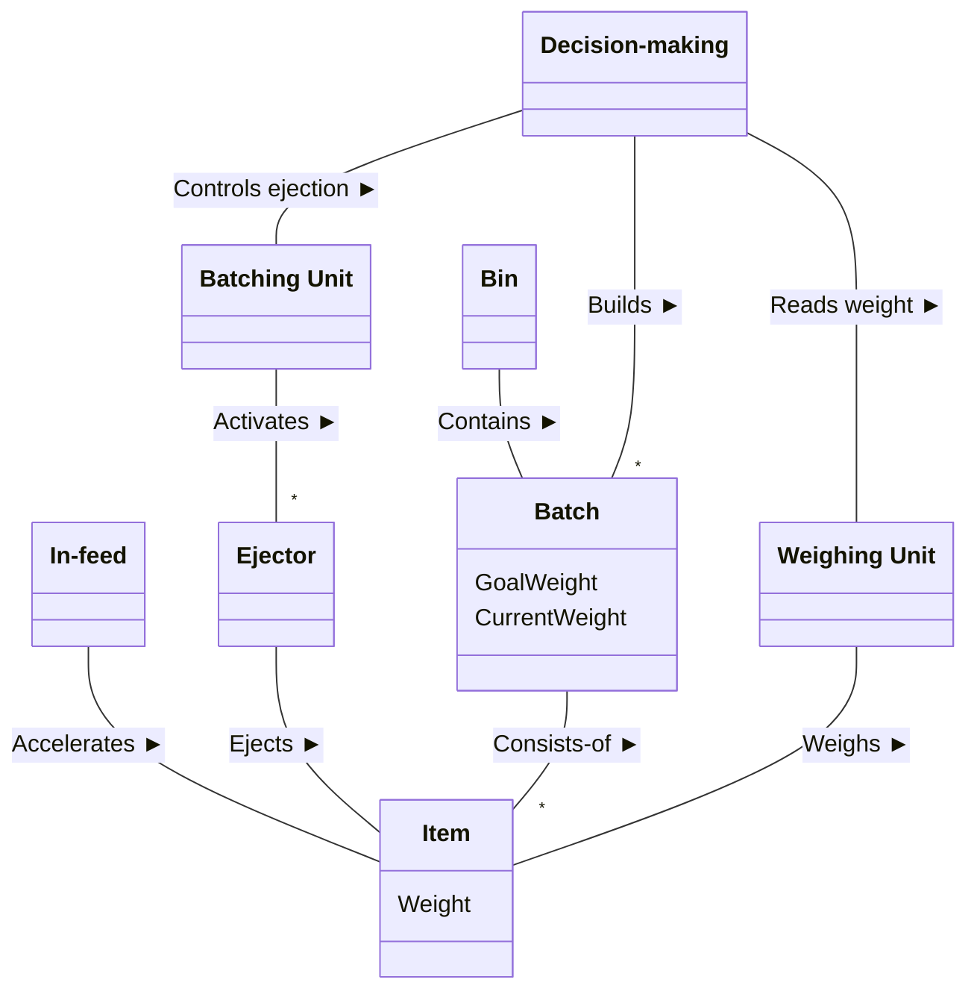
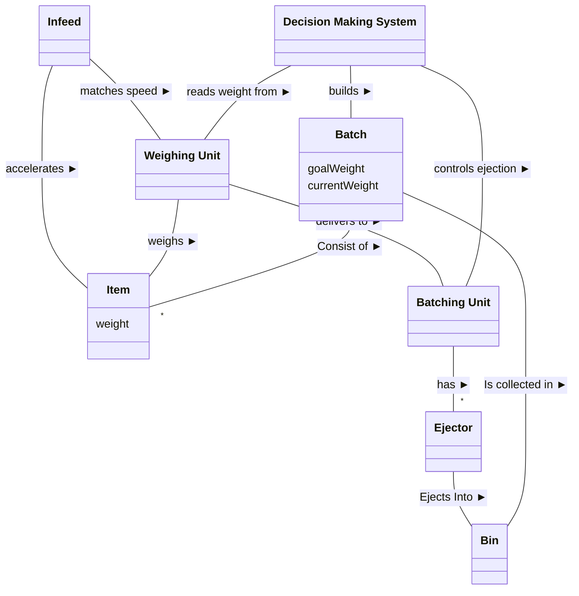

# Øvelse: A new processing plant for "Poultry Galore" — domænemodel (med to løsningsforslag)

## Metadata

| Felt | Værdi |
|---|---|
| **Lektion** | L17 — Domænemodeller fortsat med øvelser (der arbejdes på klassen i L17) |
| **Kursus** | SWISE-01 Indledende System Engineering |
| **Kilde** | `SDA Poultry Galore.pdf` (1 side) + `SDA Poultry Galore solution.pdf` (1 side) + `SDA Poultry Galore solution3.pdf` (1 side) |
| **Type** | øvelse + løsningsforslag (2 stk.) |
| **Emner dækket** | Domænemodel for automatisk batching-anlæg: Infeed, Weighing Unit, Batching Unit, Ejector, Bin, Item, Batch, Decision-making; associationer med læsepile, multiplicitet `*`, attributter (weight, goalWeight, currentWeight) |

---

# Del 1: Opgaven

## A new processing plant for "Poultry Galore"

The poultry processing company "Poultry Galore" processes poultry, e.g. chicken. One sub-process is the *batching* of pieces of chicken are collected into fixed-size portions called batches.

Currently this is done by hand using a manual scale, but the company is looking to automate this process to minimize waste and maximize throughput.

A candidate architecture for such a system consists of an *infeed*, a *weighing unit* and a *batching unit* as sketched below.

*Figur: Skitse set fra siden. Fra højre mod venstre: "Infeed" (transportbånd) → "Weighing unit" (et Item ligger på den, pil "Item" peger på det) → "Batching unit" (langt transportbånd med fire "Ejector" foroven; ét item er ved at blive skubbet skråt ned). Under batching unit står fire "Bin" med varierende antal items (0, 0, 2+1 på vej ned, 2).*

- The *infeed* is a conveyor belt which accelerates the pieces of chicken (called *items*) to match the speed of the weighing unit and batching unit conveyors.
- The *weighing unit* weighs the items as they move across the unit.
- The *batching unit* consists of a conveyor on which the items travel. When an item is in the correct position it is ejected into bins using ejectors.

The core of the system is a decision-making mechanism which, when an item has been weighed, allocates it to one of the open batches.

When a bin is full, it is manually emptied and further processed.

**Opgave (fra slides):** Lav en Domænemodel for det nye pakkesystem: (1) identificer vigtige begreber (Step 1), (2) lav et UML Class Diagram med begreber og evt. attributter, (3) identificer relationer (Step 2) og indfør dem som associationer, (4) sæt multipliciteter hvor nødvendigt, (5) finpudsning.

> Opgave side 1

---

# Del 2: Løsningsforslag nr. 1 (`SDA Poultry Galore solution.pdf`)

Klassediagram med 8 begreber. Læsepile (sorte trekanter) står ved relationsteksten.

| Klasse | Attributter |
|---|---|
| Item | Weight |
| Batch | GoalWeight, CurrentWeight |
| In-feed, Ejector, Bin, Weighing Unit, Batching Unit, Decision-making | – |

| Fra | Relationstekst | Til | Multiplicitet |
|---|---|---|---|
| In-feed | Accelerates ► | Item | |
| Ejector | Ejects ► | Item | |
| Batch | Consists-of ► | Item | Item `*` |
| Weighing Unit | Weighs ► | Item | |
| Batching Unit | Activates ► | Ejector | Ejector `*` |
| Bin | Contains ► | Batch | |
| Decision-making | Builds ► | Batch | Batch `*` |
| Decision-making | Reads weight ► | Weighing Unit | |
| Decision-making | Controls ejection ► | Batching Unit | |

(► = læseretning fra venstre klasse til højre klasse i linjen. Ingen pile i associationsenderne.)

> Solution side 1

---

# Del 3: Løsningsforslag nr. 2 (`SDA Poultry Galore solution3.pdf`)

Af historiske årsager hedder løsning nr. 2 "nr. 3" (fra Brightspace). Klassediagram med 8 begreber; læsepile er skrevet ind i teksten som `>`, `<`, `v`.

| Klasse | Attributter |
|---|---|
| Item | weight |
| Batch | goalWeight, currentWeight |
| Infeed, Weighing Unit, Batching Unit, Ejector, Bin, Decision Making System | – |

| Fra | Relationstekst | Til | Multiplicitet |
|---|---|---|---|
| Infeed | accelerates > | Item | |
| Infeed | matches speed > | Weighing Unit | |
| Weighing Unit | weighs > | Item | |
| Weighing Unit | delivers to > | Batching Unit | |
| Decision Making System | reads weight from v | Weighing Unit | |
| Decision Making System | controls ejection v | Batching Unit | |
| Decision Making System | builds > | Batch | |
| Batch | < Consist of | Item | Item `*` |
| Batching Unit | has > | Ejector | Ejector `*` |
| Ejector | Ejects Into > | Bin | |
| Batch | Is collected in v | Bin | |

(► = læseretning fra venstre klasse til højre klasse i linjen.)

**Forskelle mellem de to løsninger:** Løsning 2 tilføjer de fysiske transportbånds-relationer *Infeed matches speed Weighing Unit* og *Weighing Unit delivers to Batching Unit*, vender "Ejects" til *Ejector Ejects Into Bin* (i stedet for Ejector ejects Item), erstatter *Batching Unit activates Ejector* med *Batching Unit has Ejector*, og erstatter *Bin contains Batch* med *Batch is collected in Bin*. Løsning 1 har `*` på Batch-enden af "Builds"; løsning 2 har ingen multiplicitet på "builds".

> Solution3 side 1
