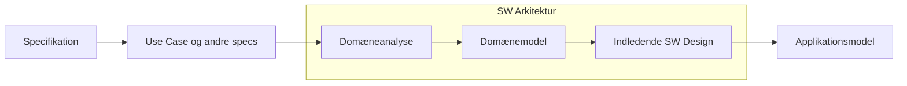
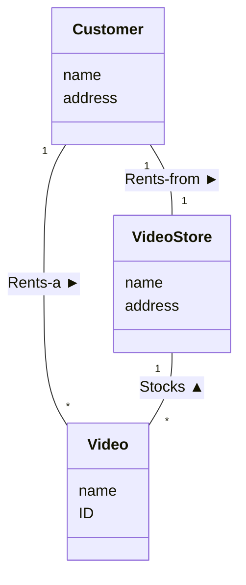

# Systemdomæneanalyse og Domænemodeller (System Domain Analysis)

## Metadata

| Felt | Værdi |
|---|---|
| **Lektion** | L15–L17 — Domæneanalyse / domænemodeller |
| **Kursus** | SWISE-01 Indledende System Engineering |
| **Kilde** | `System Domain Analysis.pdf` (34 slides) |
| **Type** | slides |
| **Emner dækket** | Systemdomæneanalyse, domæne, domænemodel, begreber (conceptual classes), associationer, læsepile, multiplicitet, attributter, kogebog i 4 steps (navneordsanalyse, kategoriliste, udsagnsordsanalyse, relationsliste, multiplicitet, finpudsning), aktør som tændstiksmand vs. klasse, attribut vs. klasse, praktiske råd, øvelser (Tankstation, Poultry Galore) |

---

## Introduktion

Slides fra "Introduktion til Systems Engineering, I2ISE". Spørgsmålene lektionen besvarer:

- Hvad er Systemdomæneanalyse (System Domain Analysis)?
- Hvad er en Domænemodel (Domain Model)?
- Hvorfor lave en Domænemodel?
- Hvordan laver man en Domænemodel?

> Slide 1–2

## Systems engineering – skematisk set

*Figur: Fire kasser i en kæde. Venstre: "Krav, Ønsker, Visioner, Rammer, Platform" → tilstand A. En buet pil mærket "Proces" fører fra A til B. B → højre kasse "System, Dokumentation, Kvalitet, Tilfredshed". Nedefra peger en pil "Udviklingstid, Udviklingsresurser" op på Proces-pilen.*

> Slide 3

## DM's plads i dokumenter og proces

*Figur: "The ASE Process" som flowdiagram: Projektformulering → Specifikation → Arkitektur → (iterativ, cross-disciplinary boks med HW Design / PC-SW Design / µC-SW Design og under dem HW implementering+modultest / PC-SW implementering+modultest / µC-SW implementering+modultest) → Integrationstest → Accepttest. Dokumenter ud til højre: Projektformulering, Kravspecifikation, Accepttestspecifikation, Systemarkitektur (HW og SW), HW-designdokument, SW-designdokument, Hardware, Source Code, Logbog, Gennemført accepttest. Et lille klassediagram mærket "Domænemodel" peger med en pil ind på dokumentet "Systemarkitektur (HW og SW)".*

Domænemodellen hører altså hjemme i Systemarkitekturdokumentet, produceret i aktiviteten "Arkitektur".

> Slide 4

## SW Arkitektur – fra UC til Design

*Figur: Kæde af trin: Specifikation → Use Case og andre specs → [SW Arkitektur-boks: Domæneanalyse → Domænemodel → Indledende SW Design] → Applikationsmodel. "Use Case og andre specs", "Domænemodel" og "Applikationsmodel" er røde kasser (artefakter/dokumenter); "Specifikation", "Domæneanalyse", "Indledende SW Design" er blå (aktiviteter).*

> Slide 5

## Hvad er Systemdomæneanalyse?

- Systemdomæneanalyse er en aktivitet der udføres for at bestemme og afgrænse systemets Domæne i form af vigtige begreber og relationer mellem disse.
- Resultatet af Systemdomæneanalysen er Domænemodellen.

> Slide 6

## Virkeligheden og systemet

*Figur: En stor sky mærket "Virkeligheden!". Inde i skyen en firkant mærket "Domænet!". I firkanten: "En bruger" (smiley) med dobbeltpil til "Et nyt system" (cirkel opdelt i HW, MEK, SW; i SW-delen små gule kasser mærket "Klasser"). Systemet har dobbeltpile til "Et andet system" (lille cirkel) og til to bjælker mærket "Vigtige domænebegreber".*

Pointen: Domænet er den del af virkeligheden systemet skal tage hensyn til — brugere, andre systemer og de vigtige domænebegreber. Klasserne inde i softwaren afspejler domænebegreberne.

> Slide 7

## Hvad er en Domænemodel (og hvad er det ikke)? (1)

- Domænemodellen er en illustration af vigtige, interessante, relevante, bemærkelsesværdige (noteworthy) begreber i systemets domæne
  - Begreberne, deres relationer, multipliciteter og attributter
  - Ikke ansvar og funktioner
  - Ikke systemarkitektur
- Domænemodellen viser begreber fra virkeligheden, ikke SW-begreber (endnu)
  - "Køretøj", "Betaling", "Kontantautomat" — OK, vigtige begreber fra virkeligheden
  - "SQLDatabase", "string" — IKKE OK, software- (implementerings-) begreber

> Slide 8

## Hvad er en Domænemodel (og hvad er det ikke)? (2)

- Domænemodellen er en visuel ordbog, tegnet som et UML klassediagram
- Domænemodellen fortæller en historie som en slags resume af kravene

> Slide 9

## Domænemodel: Eksempel

*Figur: Klassediagram med tre klasser Customer (name, address), Video (name, ID), VideoStore (name, address). Annoteringer peger på diagrammets elementer: "Association" (linjen Customer–Video), "Multiplicitet" (`*` ved Video), "UML Class" (Video-kassen), "Relationsbeskrivelse" (teksten "Stocks"), "Læsepil" (den sorte trekant ved "Stocks"), "Begreb" (klassenavnene), "Attributter" (name/address i VideoStore).*

Læseretning: Customer *Rents-a* Video (1 Customer, * Video). VideoStore *Stocks* Video (1 VideoStore, * Video). Customer *Rents-from* VideoStore (1–1).

> Slide 10

## Hvad er et begreb (conceptual class)?

- Et begreb som det bruges på Domænemodellen er en ide, en ting eller et objekt, tegnet som en klasse
- Dets relationer med andre begreber tegnes som associationer

> Slide 11

## Hvad gør et begreb eller en relation vigtig (noteworthy)?

- De vigtige begreber er dem som er nødvendige for at forstå systemets funktion og eksistensberettigelse
- Et klassediagram er et statisk billede, der viser de relationer, der er vigtige over tid i systemets levetid
- De vigtige begreber, attributter og relationer at vise på Domænemodellen er dem, der er vigtige at huske over tid for systemet
- Dette kan bruges til både at fuldstændiggøre, men også begrænse Domænemodellen

> Slide 12

## Hvorfor lave en Domænemodel?

- Domænemodellen er input til at vælge og designe nogle af klasserne som skal indgå i det indledende (objektorienterede) software design
- Domænemodellen er dermed med til at understøtte det første svære skridt fra krav til design – det første skridt fra "hvad" til "hvordan"
- En Domænemodel kan bruges til at tale med kunden/product owner om systemet
- Den visuelle ordbog fastlægger navnene i den videre proces, så alle bruger samme navne
- En ny medarbejder kan få et hurtigt overblik over systemets Domæne

> Slide 13

## Kogebog for Domænemodeller

| Step | Aktivitet |
|---|---|
| Step 1 | Find begreberne (med evt. attributter) i Domænet og tegn dem i et klassediagram |
| Step 2 | Find relationerne og tegn dem som associationer med en tekst og evt. en pil |
| Step 3 | Forsyn relationerne med multiplicitet |
| Step 4 | Lav finpudsning med attributter/klasser, specifikke klasserelationer, og slet evt. unødvendige begreber |

(Kogebogen gentages som overgangsslide før hvert step.)

> Slide 14, 20, 26, 28

## Step 1: Find begreberne

- **Step 1.1:** Find navneord i Use Cases og andre specifikationer
- **Step 1.2:** Find begreber ved at lade sig inspirere af listen med kategorier af generelle begreber (afsnit 1.6.1 i artiklen)

Organiser dem på et klassediagram. Nogle af dem er måske attributter i stedet for klasser.

> Slide 15

### Step 1.1 Navneordsanalyse

- Marker navneordene i UC og andre specifikationer
- Ikke alle navneord er nødvendigvis vigtige begreber
  - De kan være implementationsorienterede
  - De kan være for lavniveau og skal måske op på et højere abstraktionsniveau
  - De er måske slet ikke relevante for systemet og kan ignoreres
- Men da de kommer fra specifikationerne er de sandsynligvis ret relevante
- Nogle navneord kan måske med det samme udnævnes som attributter for andre begreber
- Hellere lidt for mange begreber i Domænemodellen end for få på nuværende tidspunkt

> Slide 16

### Step 1.2 Kategoriliste

Listen står i afsnit 1.6.1 i pensumsartiklen til lektionen (uddrag på sliden — fuld liste i `artikel-domaenemodeller.md`):

| Generelt Begreb | Eksempler |
|---|---|
| Transaktion – en afsluttet forretningshændelse, som naturligt afgrænser en aktivitet, der skal kunne skelnes fra andre slags og andre af samme slags | Et Salg; En Betaling; En Tankning; En Udcheckning på biblioteket/supermarkedet; En Flyreservation |
| Transaktionslinje – en af flere linjer, der repræsenterer et begreb, der indgår i eller dækkes af transaktionen | En Varelinje på en bon ved et salg; En Boglinje i en udcheckning på biblioteket |
| Fysisk genstand – et fysisk objekt, der fx matcher en transaktionslinje | Selve Varen; Selve Bogen; Et Lånerkort |
| … | … |

- Listen indeholder kategorier af begreber, der erfaringsmæssigt ofte optræder i systemer
- Listen er meget generel og nogle kategorier er måske ikke relevante for den slags system I er ved at lave — fx indlejrede/embeddede systemer
- Lad dig inspirere af listen for at se, om der er nogen begreber, der ikke er direkte nævnt som navneord, eller afledt heraf

> Slide 17–18

### Step 1 – afslutning

- Tegn dem på et klassediagram med gode navne og evt. attributter
- Med lidt øvelse har man
  - identificeret de vigtige begreber
  - ignoreret ikke vigtige begreber
  - indført attributter
- Og er klar til næste skridt

> Slide 19

## Step 2: Find relationerne

- **Step 2.1:** Find udsagnsord i Use Cases og andre specifikationer
- **Step 2.2:** Find relationer ved at lade sig inspirere af listen med kategorier af generelle relationer (afsnit 1.6.2)

Tegn dem ind på klassediagrammet som associationer. Giv dem navne/beskrivelser og evt. læsepile.

> Slide 21

### Step 2.1 – udsagnsord

- Find de udsagnsord i UC og andre specifikationer, der forbinder begreber
- Identificer begreberne på dit klassediagram og forbind dem med en association
- Det er ikke sikkert at alle udsagnsord giver vigtige relationer

> Slide 22

### Step 2.2 Relationsliste

Listen står i pensumsartiklen (uddrag på sliden — fuld liste i `artikel-domaenemodeller.md`):

| Generel Relation | Eksempler |
|---|---|
| A er en transaktion som hænger sammen med en anden transaktion B | Salg – Betaling; Reservation – Afbestilling |
| A er en transaktionslinje i transaktionen B | Faktura – Varelinje |
| A er et produkt eller en service for en transaktion eller transaktionslinje B | Varelinje – Vare; Reservation – Selve flyveturen |
| … | … |

- Listen indeholder kategorier af relationer, der erfaringsmæssigt ofte optræder i systemer
- Listen er meget generel og nogle kategorier er måske ikke relevante for den slags system I er ved at lave — fx indlejrede/embeddede systemer
- Lad dig inspirere af listen for at se, om der er nogen relationer, der ikke direkte er afledt af udsagnsord — fx mellem de begreber du fik fra kategorilisten

> Slide 23–24

### Step 2 – afslutning

- De fundne relationer har man nu tilføjet til klassediagrammet som associationer
- De har fået nogle gode navne, der beskriver formålet/begrundelsen for relationen
- De har fået læsepile, der hvor der kan være mulighed for misforståelser
- Er der nogen begreber, der ikke har nogen association, må man overveje, om der mangler en relation, eller om begrebet er irrelevant
- Associationerne har IKKE fået pile i enderne – det venter vi med at gøre til design og implementation

> Slide 25

## Step 3 – multipliciteter

- Associationerne skal nu forsynes med multiplicitet
- Det er vigtigt at huske, at det er set fra systemets side – vi ser det fra én instans af systemet
- Der bruges typisk multipliciteterne "1", "*", "0..1", "1..*"
- Er det vigtigt, fx for product owner, at der er eksakte værdier for antal, skriver man bare det, fx som "1..4" eller "3". Ellers er det typisk en implementationsdetalje
- Er det en 1-til-1 association kan man udelade multiplicitet

> Slide 27

## Step 4 – finafpudsning

Nogle vigtige emner at tage stilling til her er:

- **Aktører:** Er en tændstiksmand nok, eller skal det være en klasse med attributter, evt. med stereotypen <<aktør>>?
- **Klasser–Attributter:** er der nogle klasser, der burde være attribut på en af de andre i stedet for?
- Giver det mening med et **System-begreb**?
- **Komposition og Arv:** er der grund til at bruge dem?
- **Generel oprydning**
  - Se efter overflødige begreber
  - Se efter begreber der IKKE skal indgå i denne iteration af udviklingsforløbet

> Slide 29

### Aktør

- Er aktøren blot en anonym ekstern aktør bruges en tændstiksmand
- Er der brug for at huske noget om aktøren, skal den have en klasse
- IKKE begge dele!

*Figur: Til venstre en tændstiksmand "Kunde". Dobbeltpil "Eller!" til højre: en klasse `<<actor>> Kunde` med attributterne `- Navn`, `- CPR-nummer`, `- Adresse`.*

> Slide 30

### Attribut eller klasse?

Guidelines:

- Hvis det fylder noget fysisk, er det et begreb
- Hvis det har en kompleks struktur med underattributter (som er vigtige for dette system), er det et begreb
- Hvis det har aktiviteter, er det et begreb
- Hvis det er simpelt, med en veldefineret værdimængde, er det en attribut

*Figur: To alternativer: klassen `Customer` med attributten `name` — "eller" — klassen `Customer` med association `has-a ►` til en klasse `Name` — "?"*

> Slide 31

## Praktiske råd til Systemdomæneanalysen

- Brug et whiteboard og/eller PostIts (sticky notes, gule sedler) eller papir & blyant eller et diagrammeringsprogram direkte
- Arbejd sammen!
- Tag et foto af whiteboardet (gem de gule sedler) eller af papiret eller gem den første version af diagrammet, når I er færdige med den "kreative proces"
- Så kan man rentegne og arrangere Domænemodellen i et diagrammeringsprogram, så andre kan forstå det, og det er nemmere at arbejde videre med det
- Vi forventer at finde jeres Domænemodel i Systemarkitekturdokumentet for jeres semesterprojekt(er) i letlæselig form

> Slide 32

## Øvelse i dag, og som hjemmearbejde: Tankstation

Lav en Domænemodel for tankstationen, baseret på Use Casen "Optank Bil" (se den fulde tekst på Brightspace — konverteret i `oevelse-benzinstander-domaenemodel.md`):

1. Identificer vigtige begreber med metoderne beskrevet under Step 1
2. Lav et UML Class Diagram med begreberne og evt. attributter
3. Identificer vigtige relationer med metoderne beskrevet under Step 2 og indfør dem på klassediagrammet
4. Sæt multipliciteter, hvor nødvendigt
5. Udfør finpudsning med attributter og anden oprydning

> Slide 33

## Øvelse næste lektion: Poultry Galore

Lav en Domænemodel for det nye pakkesystem for fabrikken "Poultry Galore" (se den fulde tekst på Brightspace — konverteret i `oevelse-poultry-galore-domaenemodel.md`). Samme fem trin som ovenfor.

> Slide 34
