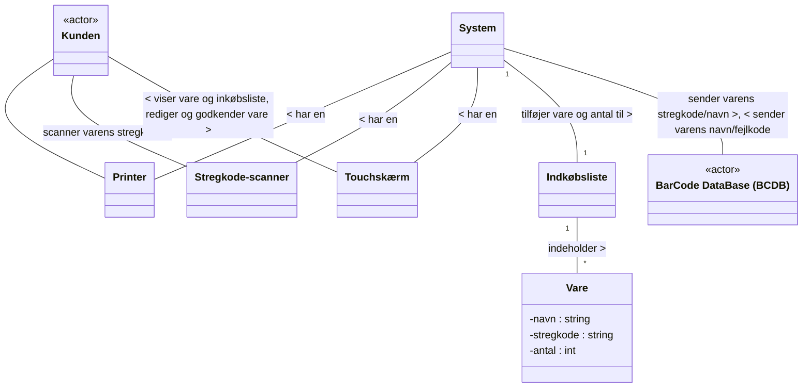
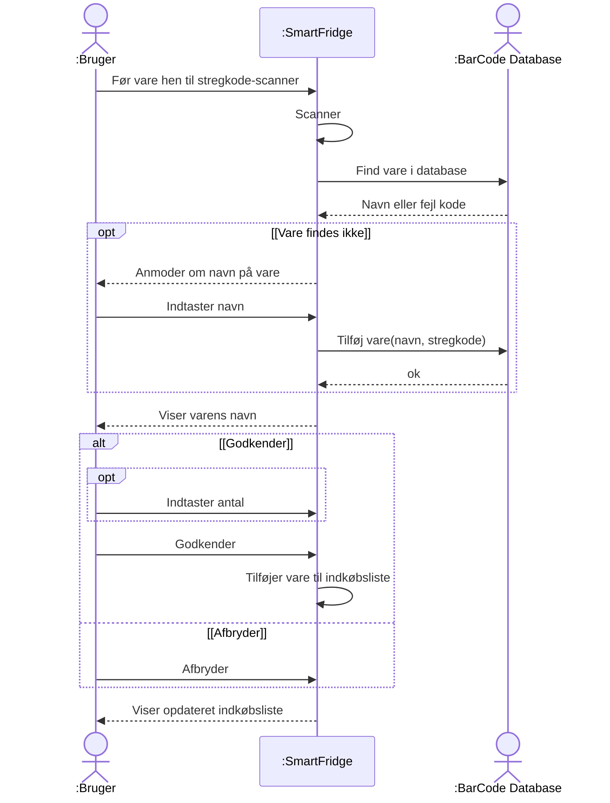
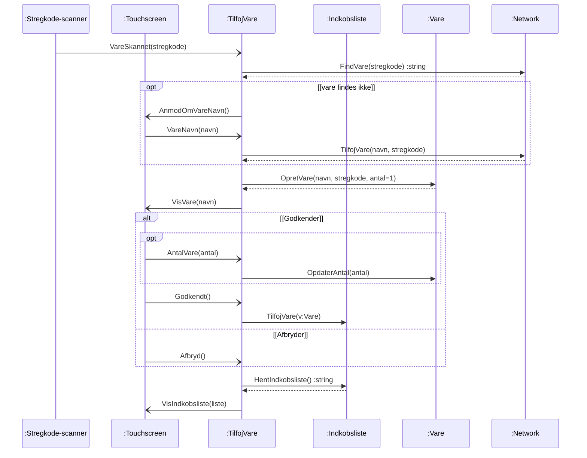
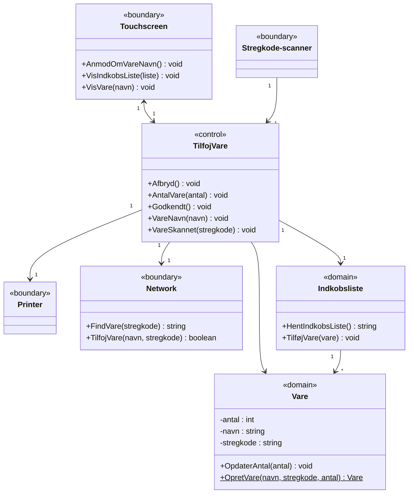

# Eksamensopgave E2015: SmartFridge (opgave 2 og 3) med løsning til applikationsmodel

## Metadata

| Felt | Værdi |
|---|---|
| **Lektion** | L17–L18 — Applikationsmodel (eksamensopgave brugt som øvelse) |
| **Kursus** | SWISE-01 Indledende System Engineering |
| **Kilde** | `I2ISE Eksamensopgave E2015.pdf` (5 sider, opgavetekst) + `SAM_SmartFridge_Opgave_Lsning.pdf` (2 sider, løsning til opg. 3A og 3B) |
| **Type** | øvelse (eksamensopgave) + løsningsforslag |
| **Emner dækket** | Use case → domænemodel; IBD → klassediagram for applikationsmodel (boundary/control/domain); SSD → sekvensdiagram for applikationsmodel med opt/alt-fragmenter |

---

## Del 1: Opgavetekst (`I2ISE Eksamensopgave E2015.pdf`)

**Ingeniørhøjskolen Aarhus Universitet — Elektro-, IKT og Stærkstrøm-Ingeniørstudiet**

| Felt | Værdi |
|---|---|
| Eksamenstermin | Q2 eksamen – vinter 2015-16 opgave 2 og 3 |
| Prøve i | Introduction to System Engineering |

### Beskrivelse af SmartFridge (opgave 2 og 3)

De følgende opgaver omhandler *SmartFridge*, et intelligent køleskab der kan hjælpe en bruger med at vedligeholde en indkøbsliste. Køleskabet har en indbygget stregkodescanner, touchskærm, printer og Computer, samt WiFi-forbindelse, som giver køleskabet mulighed for at oprette forbindelse til en ekstern stregkode-database (*BarCode DataBase*, eller BCDB). Systemet er skitseret på Figur 1 nedenfor.

*Figur 1: SmartFridge med stregkodescanner, touchskærm, printer, WiFi-interface og Computer. Skitse af køleskabsdør med fem elementer markeret oppefra og ned: Stregkodescanner, Touchskærm, Printer, WiFi (stiplet boks — indvendig/skjult), Computer (stiplet boks — indvendig/skjult).*

> Side 1

### Use case "Tilføj vare"

I nedenstående use case "Tilføj vare" er et brugsscenarie for SmartFridge beskrevet.

| Felt | Værdi |
|---|---|
| **Navn** | Tilføj vare |
| **Mål** | At tilføje en vare til brugerens indkøbsliste |
| **Initiering** | Kunden: Scanner en vares stregkode vha. systemets stregkodescanner |
| **Aktører** | Bruger (Primær); BarCode Database (BCDB) (Sekundær) |
| **Antal samtidige forekomster** | 1 |
| **Prækondition** | Systemet viser en indkøbsliste |
| **Postkondition** | Systemets indkøbsliste er opdateret og en ny vare er tilføjet BCDB |

**Hovedscenarie:**

1. Bruger fører en vare hen til systemets stregkode-scanner
2. Systemet scanner varens stregkode
3. Systemet sender varens stregkode til BCDB
4. BCDB returnerer varens navn til Systemet
   *[Extension 1: Stregkoden findes ikke i BCDB]*
5. Systemet viser varens navn
6. Bruger redigerer og godkender antallet af varer
   *[Extension 2: Bruger afbryder tilføjelsen af en vare]*
7. Systemet tilføjer varens navn og antal til indkøbslisten
8. Systemet viser en opdateret indkøbsliste

**Udvidelser/undtagelser:**

*[Extension 1: Vare findes ikke i databasen]*
1. BCDB sender en fejlkode til Systemet
2. Systemet anmoder om indtastning af navn
3. Brugeren indtaster varens navn og godkender
4. Systemet sender varens navn og stregkode til BCDB
5. Use Casen fortsætter ved pkt. 5.

*[Extension 2: Bruger afbryder tilføjelsen af en vare]*
1. Systemet tilføjer ikke varen til indkøbslisten
2. Systemet viser indkøbslisten på touchskærmen
3. Use Case afsluttes

> Side 2

### Opgave 2 (20%)

Udarbejd en domænemodel for systemet på grundlag af figur 1 og use case beskrivelsen ovenfor. I domænemodellen skal alle konceptuelle klasser, associationer og væsentlige attributter medtages.

**Figur 2: Løsningsforslag til domænemodel for SmartFridge** (løsningen er trykt direkte i opgavesættet):

Bemærkninger til domænemodellen:
- Aktørerne `Kunden` og `BarCode DataBase (BCDB)` er tegnet som stregmænd i diagrammet, ikke som klasser.
- Kun `Vare` har attributter (`navn :string`, `stregkode :string`, `antal :int`).
- Multipliciteter er kun angivet på `System 1 — 1 Indkøbsliste` og `Indkøbsliste 1 — * Vare`.
- Associationen `Kunden — Printer` har ingen label i originalen.

> Side 3

### Opgave 3A (25%)

Med udgangspunkt i SysML *Internal Block Diagram* (IBD) for SmartFridge på Figur 2 [sic — figuren hedder Figur 3] skal der designes en softwareapplikation, som skal eksekveres på computeren.

Udarbejd et klassediagram til applikationsmodellen for en sådan softwareapplikation med udgangspunkt i use case "Tilføj vare" som givet ovenfor. Du skal på klassediagrammet angive boundary-, controller- og domain-klasser samt disse klassers associationer. Du skal *som minimum* medtage *Indkøbsliste* og *Vare* som domain-klasser.

**Figur 3: SysML Internal Block Diagram (IBD) for SmartFridge**

Ydre blok: `SmartFridge`. Parts og ports:

| Part | Ports (navn: type) | Portretning |
|---|---|---|
| `: Stregkodescanner` | `barcode: Light` | in |
| | `data: RS232` | out |
| `: Touchskærm` | `push: Force` | in |
| | `touch: USB` | out |
| | `info: Image` | out |
| | `hdmi: HDMI` | in |
| `: Computer` | `scanner: RS232` | in |
| | `touch: USB` | in |
| | `hdmi: HDMI` | out |
| | `printer: USB` | out |
| | `WiFi: WiFiData` | inout (proxy port, udfyldt sort) |
| `: Printer` | `data: USB` | in |
| | `paper: Paper` | out |
| `: WiFi` | `data: WiFiData` | inout |
| | `wireless: IEEE 802.11` | inout |

Ydre ports på `SmartFridge`: `barcode: Light` (in), `push: Force` (in), `info: Image` (out), `paper: Paper` (out), `wireless: IEEE 802.11` (inout).

Connectors:

| Fra | Til |
|---|---|
| SmartFridge.barcode | Stregkodescanner.barcode |
| Stregkodescanner.data (RS232) | Computer.scanner |
| SmartFridge.push | Touchskærm.push |
| Touchskærm.touch (USB) | Computer.touch |
| Computer.hdmi (HDMI) | Touchskærm.hdmi |
| Touchskærm.info | SmartFridge.info |
| Computer.printer (USB) | Printer.data |
| Printer.paper | SmartFridge.paper |
| Computer.WiFi (WiFiData) | WiFi.data |
| WiFi.wireless | SmartFridge.wireless |

> Side 4

### Opgave 3B (25%)

Figur 4 viser et systemsekvensdiagram (SSD) for Use Case "Tilføj vare". Udarbejd med udgangspunkt i dette SSD et sekvensdiagram, der viser hvordan klasserne i applikationsmodellen fra Opgave 3A kommunikerer for at implementere use casen. Du skal i sekvensdiagrammet angive navnene på alle metoder.

**Figur 4: Systemsekvensdiagram for hovedscenariet i use casen "Tilføj vare"**

> Side 5

---

## Del 2: Løsning til opgave 3A og 3B (`SAM_SmartFridge_Opgave_Lsning.pdf`)

**SMARTFRIDGE — OPGAVE I APPLIKATIONSMODEL – LØSNING**

### Opgave 3B: Sekvensdiagram for applikationsmodellen

Her er SekvensDiagrammet (SD) for UC Tilføj Vare, med alle opgivne extensions. Det er så heldigt, at SystemSekvensDiagrammet (SSD) har en struktur, der kan bruges til at opbygge SD for Applikationsmodellens SD, *opt* og *alt* blokke.

Lifelines: `:Stregkode-scanner` (boundary), `:Touchscreen` (boundary), `:TilfojVare` (control), `:Indkobsliste` (domain), `:Vare` (domain), `:Network` (boundary). Kald til `:Network`, `:Vare` og `:Indkobsliste` er synkrone (udfyldt pil) med stiplede retursvar; kald til/fra boundaries er asynkrone (åben pil).

Mapping SSD → SD:

| SSD-besked | SD-besked(er) |
|---|---|
| Før vare hen til stregkode-scanner / Scanner | `VareSkannet(stregkode)` (scanner → ctrl) |
| Find vare i database / Navn eller fejl kode | `FindVare(stregkode) :string` (ctrl → net) med retur |
| opt [Vare findes ikke]: Anmoder om navn, Indtaster navn, Tilføj vare, ok | `AnmodOmVareNavn()` (ctrl → touch), `VareNavn(navn)` (touch → ctrl), `TilfojVare(navn, stregkode)` (ctrl → net) med retur |
| Viser varens navn | `OpretVare(navn, stregkode, antal=1)` (ctrl → vare) med retur, derefter `VisVare(navn)` (ctrl → touch) |
| alt [Godkender]: opt Indtaster antal | `AntalVare(antal)` (touch → ctrl), `OpdaterAntal(antal)` (ctrl → vare) |
| Godkender / Tilføjer vare til indkøbsliste | `Godkendt()` (touch → ctrl), `TilfojVare(v:Vare)` (ctrl → liste) |
| [Afbryder]: Afbryder | `Afbryd()` (touch → ctrl) |
| Viser opdateret indkøbsliste | `HentIndkobsliste() :string` (ctrl → liste) med retur, `VisIndkobsliste(liste)` (ctrl → touch) |

Bemærk: `Vare`-objektet oprettes altid med `antal=1` før det vises; antallet opdateres kun hvis brugeren indtaster et andet antal. Ved afbrydelse tilføjes varen ikke til listen, men listen hentes og vises alligevel (svarer til Extension 2, trin 2).

> Side 1

### Opgave 3A: Klassediagram for applikationsmodellen

Her er det opdaterede klassediagram, hvor alle events fra SD er indført som metoder.

Bemærkninger til klassediagrammet:

- Stereotyper i originalen er skrevet `«boundary.»`, `«control.»`, `«domain.»` (Enterprise Architect-notation).
- `Touchscreen ↔ TilfojVare` er den eneste tovejs-navigerbare association (touchscreen sender events til controlleren, controlleren opdaterer touchscreen). `Stregkode-scanner → TilfojVare` er ensrettet (scanneren sender kun events ind). Alle øvrige associationer er ensrettede fra `TilfojVare`.
- `Printer` er med som boundary-klasse (fra IBD'en) men har ingen metoder, da use casen ikke bruger den.
- `OpretVare(navn, stregkode, antal) :Vare` er understreget i originalen (static/klassemetode — en factory).
- Controlleren `TilfojVare` har præcis de fem metoder, der modtages som events fra boundaries i SD: `VareSkannet`, `VareNavn`, `AntalVare`, `Godkendt`, `Afbryd`.
- Alle multipliciteter er `1`, undtagen `Indkobsliste 1 → * Vare`.

> Side 2
