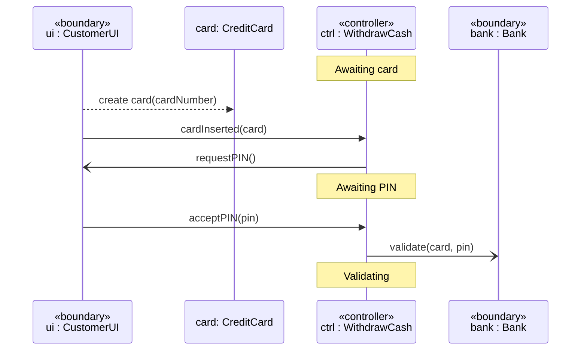
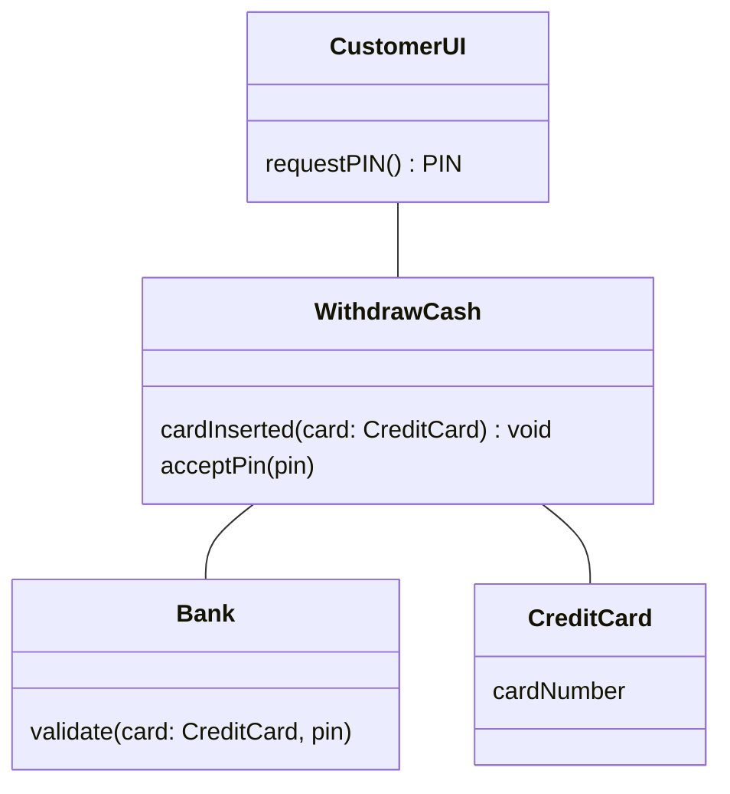
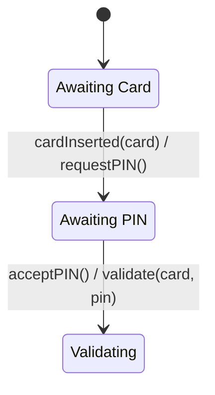
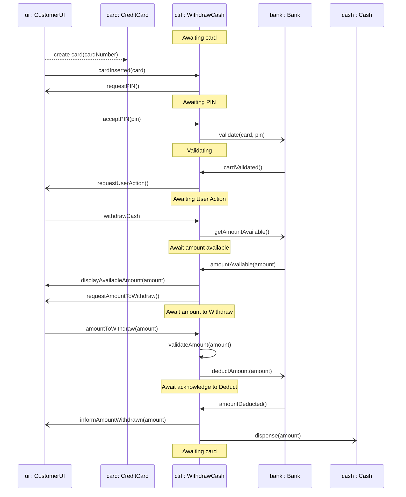
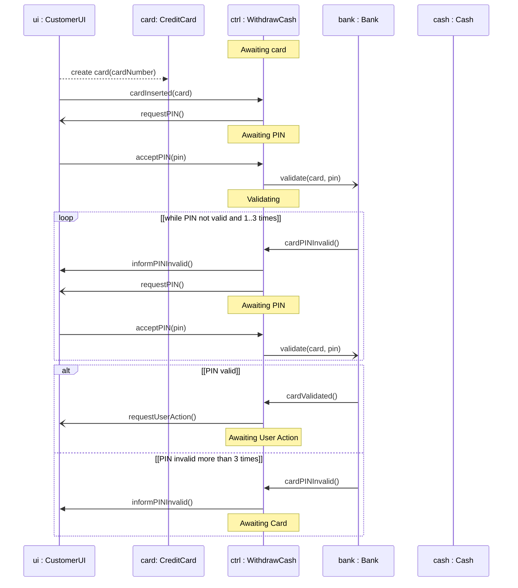
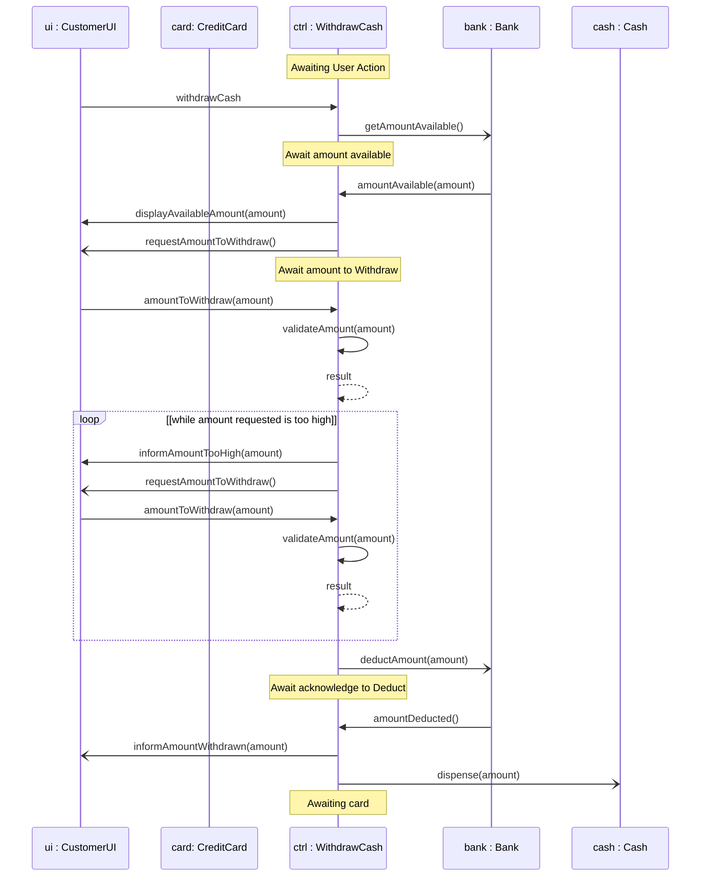
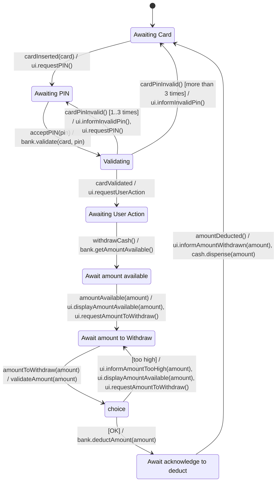
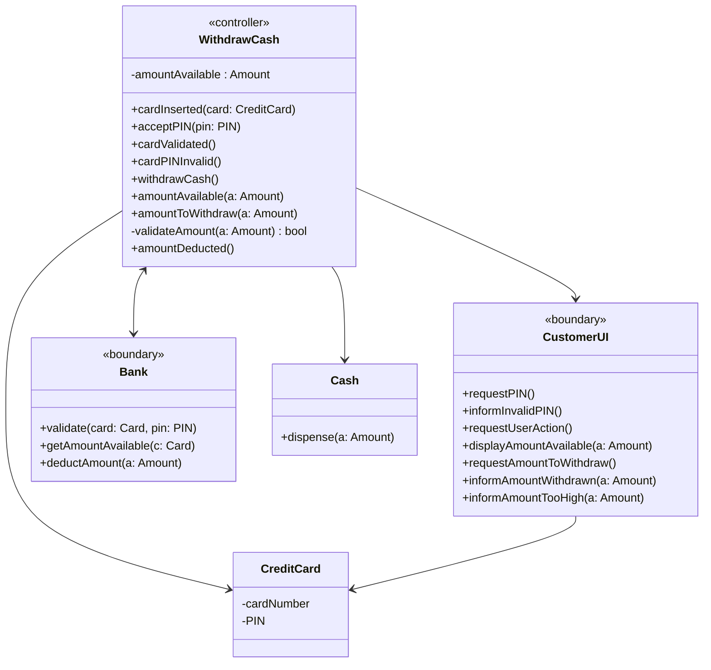

# Øvelse: ATM — UC Withdraw Cash som Software Application Model (SAM)

## Metadata

| Felt | Værdi |
|---|---|
| **Lektion** | L17 — Applikationsmodel |
| **Kursus** | SWISE-01 Indledende System Engineering |
| **Kilde** | `SAM_ATM UC description.pdf` (2 sider, opgave) + `SAM_ATM_Lsning.pdf` (5 sider, løsningsforslag) |
| **Type** | øvelse + løsningsforslag |
| **Emner dækket** | Use case → applikationsmodel; «boundary»/«controller»-klasser; sekvensdiagram med state-invarianter; state machine for controller; klassediagram for SAM; extensions (loop/alt-fragmenter) |

---

## Del 1: Opgaven (`SAM_ATM UC description.pdf`)

### Use case: Withdraw Cash

| Felt | Værdi |
|---|---|
| **Name** | Withdraw Cash |
| **ID** | 1 |
| **Initiator** | Customer |
| **Preconditions** | - |
| **Postc. on success** | Customer received desired amount in case |
| **Postc. on failure** | Customer received no cash. Customer is informed of the reason for lack of withdrawal |

**Main scenario:**

1. Customer inserts credit card in System
2. System requests Customer's PIN code
3. Customer enters PIN code
4. System validates card info and PIN code with Bank
5. Bank validates card
   [Ext. 5.1: Invalid PIN entered]
6. System requests desired action from customer
7. Customer selects "Withdraw Cash"
8. System requests amount available from Bank
9. Bank supplies amount available to System
10. System presents Customer with amount available and requests amount to withdraw
11. Customer enters amount to withdraw
12. System validates amount
    [Ext. 12.1: Amount too large]
13. System requests bank to withdraw amount
14. Bank informs System that amount is withdrawn
15. System issues cash to Customer

**[Ext. 5.1: Invalid PIN entered]**
System informs Customer that invalid PIN was entered.
UC resumes from 2.

**[Ext. 12.1: Amount too large]**
System informs Customer that amount is too large.
UC resumes from 10.

> Side 1

### Start of the sequence diagram for the Software Application Model

Opgavearket giver starten på sekvensdiagrammet (trin 1–6 i use casen). Lifelines: `ui : CustomerUI` («boundary»), `card: CreditCard`, `ctrl : WithdrawCash` («controller»), `bank : Bank` («boundary»). Controllerens tilstand er vist som state-invarianter (afrundede bokse) på dens lifeline.

Opgaven er at fortsætte sekvensdiagrammet gennem hele main scenario (og extensions), og på den baggrund udlede klassediagram og state machine.

> Side 1

### Class diagram for the SAM after the first few steps

Klassediagrammet efter de første trin (associationer tegnet som simple streger uden retning/multiplicitet):

> Side 2

### State machine diagram for class WithdrawCash after the first few steps

> Side 2

---

## Del 2: Løsningsforslag (`SAM_ATM_Lsning.pdf`)

Løsningen består af tre sekvensdiagrammer (main scenario, Ext. 5.1, Ext. 12.1), én state machine for controlleren `WithdrawCash` og ét klassediagram for hele SAM. I forhold til opgavearket er der tilføjet en ekstra «boundary»-lifeline `cash : Cash` (seddeludbetaler).

### sd UC Withdraw Cash – Main Scenario – SAM

Lifelines: `ui : CustomerUI`, `card: CreditCard`, `ctrl : WithdrawCash`, `bank : Bank`, `cash : Cash`. State-invarianter på `ctrl` er vist som `Note over ctrl`. Beskeder fra `ctrl` til boundaries er tegnet som asynkrone (åben pilespids) i originalen; beskeder ind til `ctrl` er synkrone (udfyldt pilespids). `validateAmount(amount)` er et selvkald på `ctrl` med dashed retursvar.

Mapping fra UC-trin til beskeder:

| UC-trin | Besked(er) | Controller-state efter |
|---|---|---|
| 1 | `create card(cardNumber)` (ui → card), `cardInserted(card)` (ui → ctrl) | — |
| 2 | `requestPIN()` (ctrl → ui) | Awaiting PIN |
| 3–4 | `acceptPIN(pin)` (ui → ctrl), `validate(card, pin)` (ctrl → bank) | Validating |
| 5 | `cardValidated()` (bank → ctrl) | — |
| 6 | `requestUserAction()` (ctrl → ui) | Awaiting User Action |
| 7–8 | `withdrawCash` (ui → ctrl), `getAmountAvailable()` (ctrl → bank) | Await amount available |
| 9 | `amountAvailable(amount)` (bank → ctrl) | — |
| 10 | `displayAvailableAmount(amount)`, `requestAmountToWithdraw()` (ctrl → ui) | Await amount to Withdraw |
| 11–12 | `amountToWithdraw(amount)` (ui → ctrl), `validateAmount(amount)` (ctrl selvkald) | — |
| 13 | `deductAmount(amount)` (ctrl → bank) | Await acknowledge to Deduct |
| 14 | `amountDeducted()` (bank → ctrl) | — |
| 15 | `informAmountWithdrawn(amount)` (ctrl → ui), `dispense(amount)` (ctrl → cash) | Awaiting card |

> Side 1

### sd UC Withdraw Cash – Extension 5.1 – SAM

Samme start som main scenario frem til `Validating`. Derefter et `loop`-fragment og et `alt`-fragment:

Bemærk: loop-guarden er `[while PIN not valid and 1..3 times]`; alt-grenene er `[PIN valid]` og `[PIN invalid more than 3 times]`. Ved mere end 3 fejl går controlleren tilbage til `Awaiting Card` (kortet afvises).

> Side 2

### sd UC Withdraw Cash – Extension 12.1 – SAM

Starter i `Awaiting User Action` (efter validering). Efter første `validateAmount(amount)` følger et `loop`-fragment mens beløbet er for højt:

> Side 3

### stm UC Withdraw Cash – SAM

State machine for controller-klassen `WithdrawCash`. Actions er skrevet som kald på de associerede objekter (`ui.`, `bank.`, `cash.`). Efter `Await amount to Withdraw` bruges en choice-pseudostate (rombe) med guards `[too high]` og `[OK]`.

Transitionstabel (ordret fra diagrammet):

| Fra | Trigger [guard] | Action(s) | Til |
|---|---|---|---|
| (initial) | — | — | Awaiting Card |
| Awaiting Card | cardInserted(card) | ui.requestPIN() | Awaiting PIN |
| Awaiting PIN | acceptPIN(pin) | bank.validate(card, pin) | Validating |
| Validating | cardPinInvalid() [1..3 times] | ui.informInvalidPin(), ui.requestPIN() | Awaiting PIN |
| Validating | cardPinInvalid() [more than 3 times] | ui.informInvalidPin() | Awaiting Card |
| Validating | cardValidated | ui.requestUserAction | Awaiting User Action |
| Awaiting User Action | withdrawCash() | bank.getAmountAvailable() | Await amount available |
| Await amount available | amountAvailable(amount) | ui.displayAmountAvailable(amount), ui.requestAmountToWithdraw() | Await amount to Withdraw |
| Await amount to Withdraw | amountToWithdraw(amount) | validateAmount(amount) | (choice) |
| (choice) | [too high] | ui.informAmountTooHigh(amount), ui.displayAmountAvailable(amount), ui.requestAmountToWithdraw() | Await amount to Withdraw |
| (choice) | [OK] | bank.deductAmount(amount) | Await acknowledge to deduct |
| Await acknowledge to deduct | amountDeducted() | ui.informAmountWithdrawn(amount), cash.dispense(amount) | Awaiting Card |

> Side 4

### cd UC Withdraw Cash – SAM

Klassediagram for hele applikationsmodellen. Alle associationer udgår fra controlleren; `WithdrawCash ↔ Bank` er tovejs-navigerbar, resten er ensrettede (navigerbar fra `WithdrawCash` til boundary), og både `CustomerUI` og `WithdrawCash` har en ensrettet association til `CreditCard`.

Bemærkninger til klassediagrammet:

- `WithdrawCash` («controller») har alle de operationer, som modtages som beskeder i sekvensdiagrammerne (fra `ui` og `bank`), plus den private hjælpeoperation `validateAmount(a: Amount) : bool` og attributten `amountAvailable : Amount` (gemmes fra `amountAvailable(a)` for at kunne validere beløbet lokalt).
- `CustomerUI` («boundary») har alle de operationer, controlleren kalder på den. `informInvalidPIN()` og `informAmountTooHigh(a)` kommer fra extensions.
- `Bank` («boundary») har de tre kald fra controlleren. Bemærk at `Bank` i klassediagrammet bruger typen `Card` (`validate(card: Card, pin: PIN)`, `getAmountAvailable(c: Card)`) mens controlleren bruger `CreditCard` — inkonsistens i originalen.
- `Cash` har ingen stereotype i diagrammet men fungerer som boundary til seddeludbetaleren.
- Original: `Cash` er tegnet med tom attributsektion (dobbelt streg) — ingen attributter.

> Side 5
