# Øvelse: Benzinstander med automatbetaling — opgave i applikationsmodel (med løsning)

## Metadata

| Felt | Værdi |
|---|---|
| **Lektion** | L17–L21 — Applikationsmodel (opgave 1 til L17/L18, opgave 2 til L21) |
| **Kursus** | SWISE-01 Indledende System Engineering |
| **Kilde** | `SAM_Benzinstander_Opgave.pdf` (3 sider, opgave) + `SAM_Benzinstander_Opgave_Lsning.pdf` (9 sider, løsning inkl. alternative/udvidede løsninger) |
| **Type** | øvelse + løsningsforslag |
| **Emner dækket** | BDD/IBD/SD/domænemodel som input til SAM; klassediagram med «boundary»/«controller»/«domain»; sekvensdiagram for controller; SAM for to forskellige blokke i samme system (Benzinstanderstyring og Benzinstander); tilbagevirkning fra SAM på tidligere designbeslutninger (SSD, BDD, IBD, domænemodel); polling af boundary i loop-fragment |

---

## Del 1: Opgaven (`SAM_Benzinstander_Opgave.pdf`)

**BENZINSTANDER MED AUTOMATBETALING — OPGAVE I APPLIKATIONSMODEL**

Opgaven tager udgangspunkt i en *tankstation* med flere *benzinstandere* og *automatbetaling* se detaljerne i tidligere opgaver. Domænemodellen for tankstationen er udarbejdet med udgangspunkt i *UC1: Optank bil*. Resultatet er et klassediagram med domænemodellen vist nedenfor.

### bdd [Package] Arkitektur [Tankstation] — oplæg fra øvelsen i L12

Her er det bdd, der blev givet som oplæg til øvelsen i L12 om en benzintank.

| Blok | Består af (komposition, udfyldt rombe) | Multiplicitet på del |
|---|---|---|
| `Tankstation` | `Benzinstander` | 1..* |
| | `Benzinstanderstyring` | 1..* |
| | `Central computer` | 1 |
| `Benzinstander` | `Benzinpumpe` | (ingen angivet) |
| | `Elektroniskstyring` | (ingen angivet) |
| `Benzinstanderstyring` | `Computer` | (ingen angivet) |
| | `Kontrolpanel` | (ingen angivet) |
| | `Automatbetalingsenhed` | (ingen angivet) |

Referenceassociationer (åben rombe = aggregering/reference) mellem søskende-blokke:

| Fra (rombe-ende) | Til | Multiplicitet |
|---|---|---|
| `Benzinstanderstyring` (1) | `Benzinstander` | 1..3 |
| `Central computer` (1) | `Benzinstanderstyring` | 1..* |

Dvs. én Benzinstanderstyring betjener 1–3 benzinstandere, og én Central computer betjener 1..* Benzinstanderstyringer.

> Side 1

### ibd Tankstation [Detaljer] — løsning fra L12, udvidet med interfaces

Her er det ibd der blev foreslået som løsning på opgaven i L12. Det er dog udvidet med et par interfaces, til brug for opgaven i L21 – hvis de skal bruges!

Ydre blok `: Tankstation` med tre parts. Portnavn `: type`; `<>` = bidirektional/proxy-port (udfyldt sort ved `bsCtrl`, `standerCtrl`, `pbs`), pil = flow-retning.

**`: Benzinstander`** (parts: `: Benzinpumpe`, `: Elektronisk Styring`)

| Part | Port | Retning |
|---|---|---|
| `: Benzinpumpe` | `tændt : bool` | in (fra Elektronisk Styring) |
| `: Elektronisk Styring` | `pumpeTændt: bool` | out (til Benzinpumpe.tændt) |
| | `brændstofType: BT` | in (fra Benzinstander.brændstofType) |
| | `pistolPåPlads: bool` | in (fra Benzinstander.pistolPåPlads) |
| | `ctrl:BS_Ctrl` | `<>` (til Benzinstander.ctrl) |
| `: Benzinstander` (ydre ports) | `brændstofType: BT` | in |
| | `pistolPåPlads: bool` | in |
| | `ctrl:BS_Ctrl` | `<>` |

**`: Benzinstanderstyring`** (parts: `: Kontrolpanel`, `: Computer`, `: Automatbetalingsenhed`)

| Part | Port | Retning |
|---|---|---|
| `: Kontrolpanel` | `touchScreen: Touch_Ctrl` | `<>` (til Benzinstanderstyring.touchScreen) |
| | `out: KP` | out (til Computer.kp) |
| `: Computer` | `kp: KP` | in |
| | `bsCtrl:BS_Ctrl` | `<>` udfyldt (til Benzinstanderstyring.bsCtrl) |
| | `ctrl: BSS_Ctrl` | `<>` (til Benzinstanderstyring.ctrl) |
| | `abeIn: ABE` | in (fra Automatbetalingsenhed.out) |
| `: Automatbetalingsenhed` | `out: ABE` | out |
| | `keypad: KeyPadData` | in (fra Benzinstanderstyring.keypad) |
| | `cardSlot: card_Ctrl` | `<>` (til Benzinstanderstyring.cardSlot) |
| `: Benzinstanderstyring` (ydre ports) | `touchScreen: Touch_Ctrl` | `<>` |
| | `bsCtrl:BS_Ctrl` | `<>` udfyldt |
| | `ctrl: BSS_Ctrl` | `<>` |
| | `keypad: KeyPadData` | in |
| | `cardSlot: card_Ctrl` | `<>` |

**`: Central Computer`**

| Port | Retning |
|---|---|
| `standerCtrl : BSS_Ctrl` | `<>` udfyldt |
| `pbs : PBS_Comms` | `<>` udfyldt |

**Connectors mellem parts / ydre ports:**

| Fra | Til |
|---|---|
| Benzinstander.ctrl:BS_Ctrl | Benzinstanderstyring.bsCtrl:BS_Ctrl |
| Benzinstanderstyring.ctrl: BSS_Ctrl | Central Computer.standerCtrl : BSS_Ctrl |
| Central Computer.pbs : PBS_Comms | Tankstation.pbsComms: PBS_Comms (ydre port, `<>`) |

Interfaces (typer) der er tilføjet til brug for SAM: `BS_Ctrl` (Benzinstander ↔ Benzinstanderstyring), `BSS_Ctrl` (Benzinstanderstyring ↔ Central Computer), `PBS_Comms` (Central Computer ↔ PBS), `Touch_Ctrl`, `KP`, `ABE`, `KeyPadData`, `card_Ctrl`, `BT`.

> Side 1

### sd Foretag tankning — systemsekvensdiagram (løsning fra L13)

Her er sekvensdiagrammet for UC: Optank Bil for tankstationen, som er løsningsforslag til øvelsen i L13. Lifelines `: Benzinstanderstyring`, `: Benzinstander` og `: Central Computer` er samlet under en fælles boks `: Tankstation`.

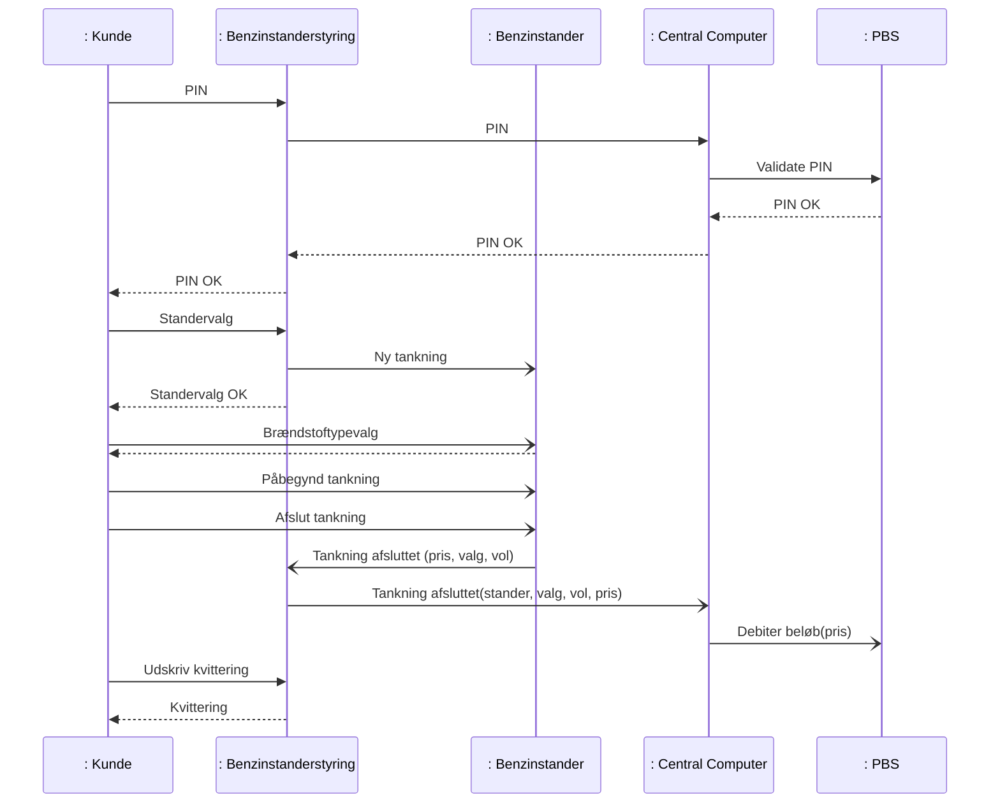

> Side 2

### class Domænemodel — løsning fra L17

Her er en domænemodel, der er løsningsforslag til opgaven i L17. **Figur 1 Domænemodel for UC1: Optank bil.**

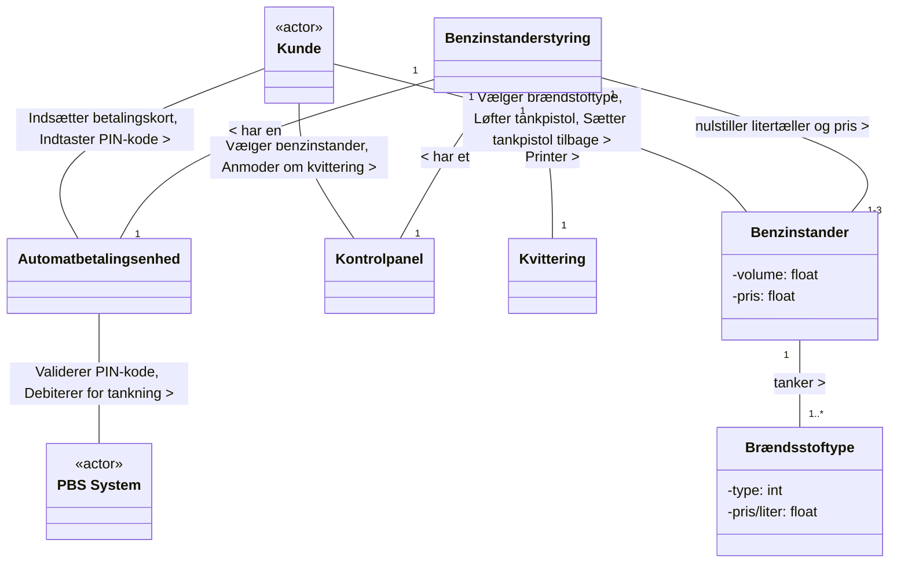

Bemærk: klassen staves `Brændsstoftype` (dobbelt s) i domænemodellen men `Brændstoftype` i applikationsmodellen. Multiplicitet `1-3` er skrevet med bindestreg i originalen.

> Side 2

### OPGAVE 1

Nedenfor er vist et klassediagram for applikationsmodellen for selve benzinstanderstyringen med kontrol, domæne- og grænsefladeklasser for Use Case 1. (IF = Interface)

**Figur 2 Klassediagram for applikationsmodel for Benzinstanderstyring** (`class Applicationsmodel`):

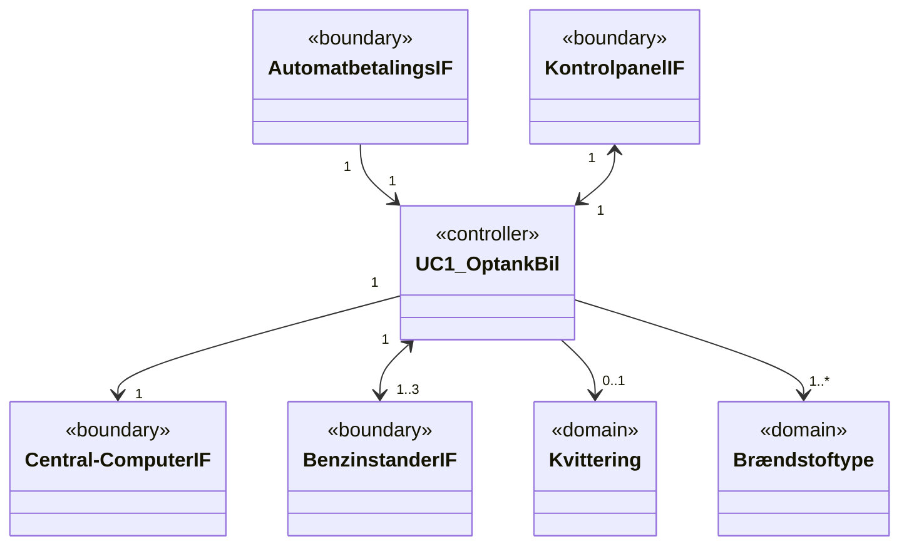

Navigerbarhed: `AutomatbetalingsIF → UC1_OptankBil` (ensrettet ind i controlleren), `UC1_OptankBil → Central-ComputerIF` (ensrettet ud), `KontrolpanelIF ↔ UC1_OptankBil` og `UC1_OptankBil ↔ BenzinstanderIF` tovejs, domain-klasser ensrettet fra controlleren.

Tegn et sekvensdiagram, der beskriver kommunikationen imellem klasserne for følgende reducerede version af "Main Scenario" i UC1 med brug af ovenstående applikationsmodel. Der skal ikke tages hensyn til undtagelserne beskrevet i UC1. Find selv på passende navne til funktioner og metoder i klasserne. Opdater klassediagrammet med metoder og attributter.

1. Brugeren indtaster PIN-koden på knapperne kortinterfacet
2. Systemet validerer PIN-koden på PBS systemet
3. Kunde vælger benzinstander mellem 1 og antal tilknyttede benzinstandere
4. Kunde vælger brændstoftype på benzinstanderen
5. Kunde løfter tankpistol
6. System nulstiller litertæller og pris på benzinstander
7. Kunde påbegynder tankning
8. Kunde placerer tankpistol i holder på benzinstander
9. Systemet beordrer PBS systemet at debitere for prisen på tankningen
10. Kunde anmoder om kvittering på kontrolpanelet
11. Kvittering udskrives

> Side 3

### OPGAVE 2 (TIL L21)

Nu skal der laves en Software Applikationsmodel for Benzinstanderen.

a) Ud fra ovenstående information, lav et klassediagram for Applikationsmodellen for Benzinstanderen.

b) Lav et sekvensdiagram for den samme UC, set fra Benzinstanderens side, med udgangspunkt i Applikationsmodellen for Benzinstanderen.

> Side 3

---

## Del 2: Løsningsforslag (`SAM_Benzinstander_Opgave_Lsning.pdf`)

For fuldstændighedens skyld, bringes først hele opgaveformuleringen (side 1–4, identisk med Del 1 ovenfor), efterfulgt af løsningsforslagene. Til allersidst bringes også et forslag til en udvidet opgaveløsning, der gør det hele lidt mere virkelighedsnært.

> Side 1–4 (gentagelse af opgaven)

### LØSNING OPGAVE 1: sd BSS::UC1_OptankBil

Lifelines: `: AutomatbetalingsIF` «boundary», `: KontrolpanelIF` «boundary», `: UC1_OptankBil` «controller», `: Kvittering` «domain», `stander[3] : BenzinstanderIF` «boundary» (multiobjekt — tegnet med dobbelt ramme), `: Central-ComputerIF` «boundary».

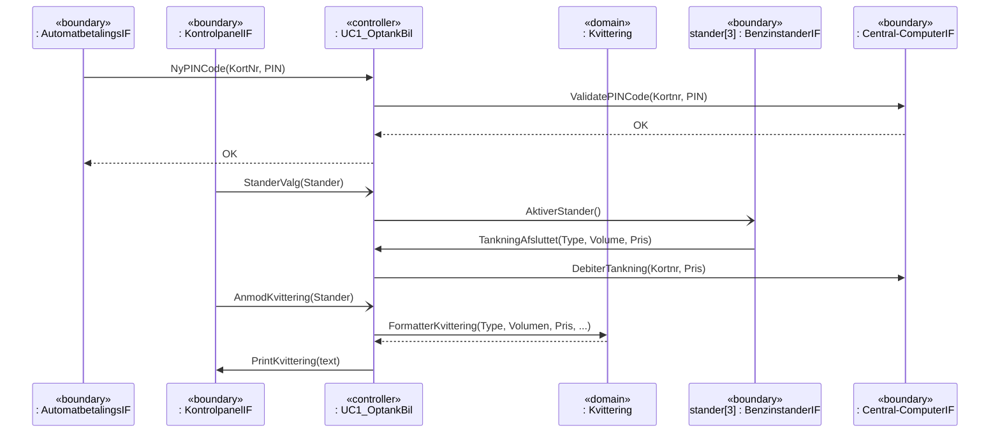

Mapping til de 11 scenarietrin:

| Trin | Besked |
|---|---|
| 1 | `NyPINCode(KortNr, PIN)` (AutomatbetalingsIF → controller) |
| 2 | `ValidatePINCode(Kortnr, PIN)` (controller → Central-ComputerIF), retur `OK`, videresendes som `OK` til AutomatbetalingsIF |
| 3 | `StanderValg(Stander)` (KontrolpanelIF → controller), `AktiverStander()` (controller → stander[3]) |
| 4–8 | Foregår på Benzinstanderen — ikke synligt for BSS. Afsluttes med `TankningAfsluttet(Type, Volume, Pris)` (stander → controller) |
| 9 | `DebiterTankning(Kortnr, Pris)` (controller → Central-ComputerIF) |
| 10 | `AnmodKvittering(Stander)` (KontrolpanelIF → controller) |
| 11 | `FormatterKvittering(Type, Volumen, Pris, ...)` (controller → Kvittering) med retur, `PrintKvittering(text)` (controller → KontrolpanelIF) |

Denne løsning tager udgangspunkt i den forsimplede scenariesekvens, som den er angivet i Systemsekvensdiagrammet. Det ses, at vi alligevel ikke fik brug for klassen Brændstoftype. Det blev også tydeligt, at vi måske mangler nogle elementer i BDD og IBD diagrammerne og i domænemodellen, fx printeren, hvor sidder den henne?

> Side 4

### Det opdaterede klassediagram: class Applicationsmodel for BSS

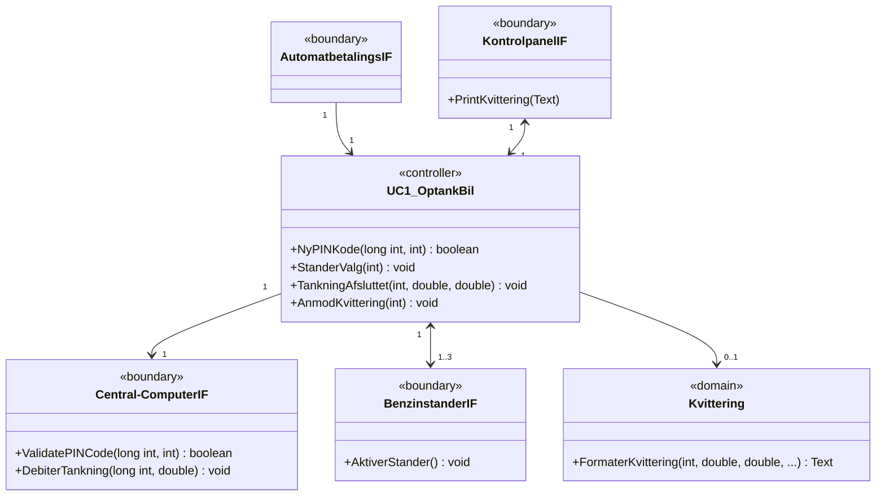

Bemærkninger:
- `Brændstoftype` er fjernet fra klassediagrammet, da den ikke blev brugt i sekvensdiagrammet.
- Controllerens metoder er præcis de events, den modtager fra boundaries: `NyPINKode`, `StanderValg`, `TankningAfsluttet`, `AnmodKvittering`. Bemærk navneinkonsistens `NyPINCode` (SD) vs `NyPINKode` (CD), og `FormatterKvittering` (SD) vs `FormaterKvittering` (CD).
- Typer: `long int` for kortnummer, `int` for PIN/standernummer/brændstoftype, `double` for volumen og pris, `Text` for kvitteringstekst.
- Originalen har en tastefejl: `TankningAfsluttet(int, double, double) . void` (punktum i stedet for kolon).

> Side 5

### OPGAVE 2 LØSNINGSFORSLAG

Det første klassediagram, med udgangspunkt i Use case, BDD, IBD og domænemodellen (`class Applicationsmodel for BS`):

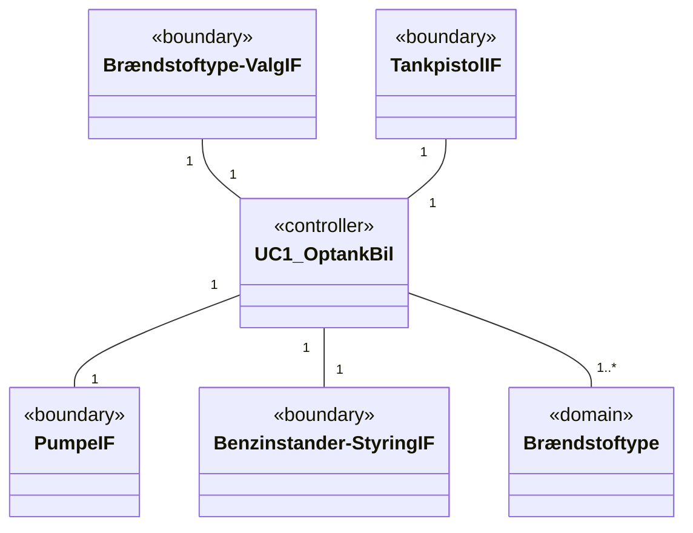

(Associationerne er tegnet uden navigeringspile i dette første udkast.)

Boundary-klasserne er udledt af IBD'ens ports på `: Benzinstander` / `: Elektronisk Styring`: `brændstofType: BT` → `Brændstoftype-ValgIF`, `pistolPåPlads: bool` → `TankpistolIF`, `pumpeTændt: bool` → `PumpeIF`, `ctrl:BS_Ctrl` → `Benzinstander-StyringIF`.

> Side 6

### Sekvensdiagram for Benzinstanderen (sd Name)

Disse klasser anbringes derefter på et sekvensdiagram, der udarbejdes ud fra den del af Systemsekvensdiagrammet og UC scenariet, der foregår på Benzinstanderen. Lifeline `brændstof[] : Brændstoftype` er et multiobjekt (dobbelt ramme).

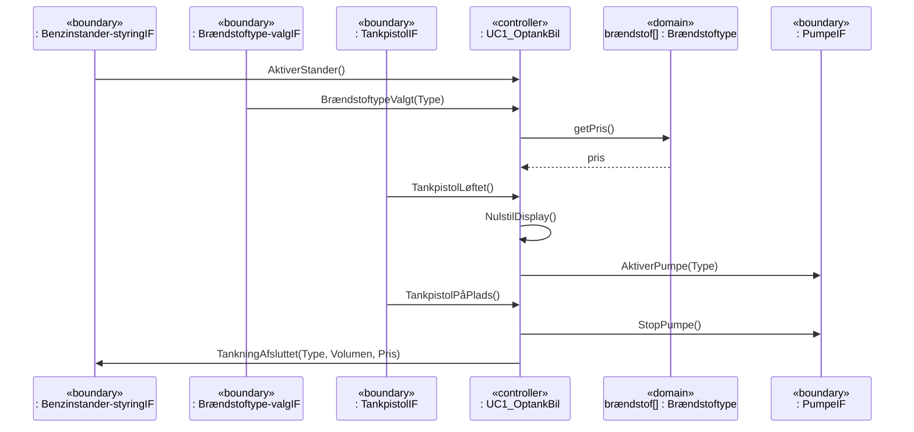

Mapping til scenarietrin 3–9 set fra Benzinstanderen:

| Trin | Besked |
|---|---|
| 3 | `AktiverStander()` (fra Benzinstander-styringIF) — BSS har valgt denne stander |
| 4 | `BrændstoftypeValgt(Type)` (fra Brændstoftype-valgIF); controlleren slår prisen op med `getPris()` på `brændstof[]` |
| 5 | `TankpistolLøftet()` (fra TankpistolIF) |
| 6 | `NulstilDisplay()` (selvkald) |
| 7 | `AktiverPumpe(Type)` (til PumpeIF) |
| 8 | `TankpistolPåPlads()` (fra TankpistolIF), `StopPumpe()` (til PumpeIF) |
| 9 | `TankningAfsluttet(Type, Volumen, Pris)` (til Benzinstander-styringIF) — BSS debiterer derefter via Central Computer |

Også kunne det tyde på, at der mangler nogle ting i den fulde systembeskrivelse på BBD, IBD og Domænemodellen. Fx er der ikke et display nogle steder – vi har valgt at angive at der skal være en metode, der søger for at nulstille displayet.

> Side 7

### Klassediagrammet efter opdatering (class Applicationsmodel for BS)

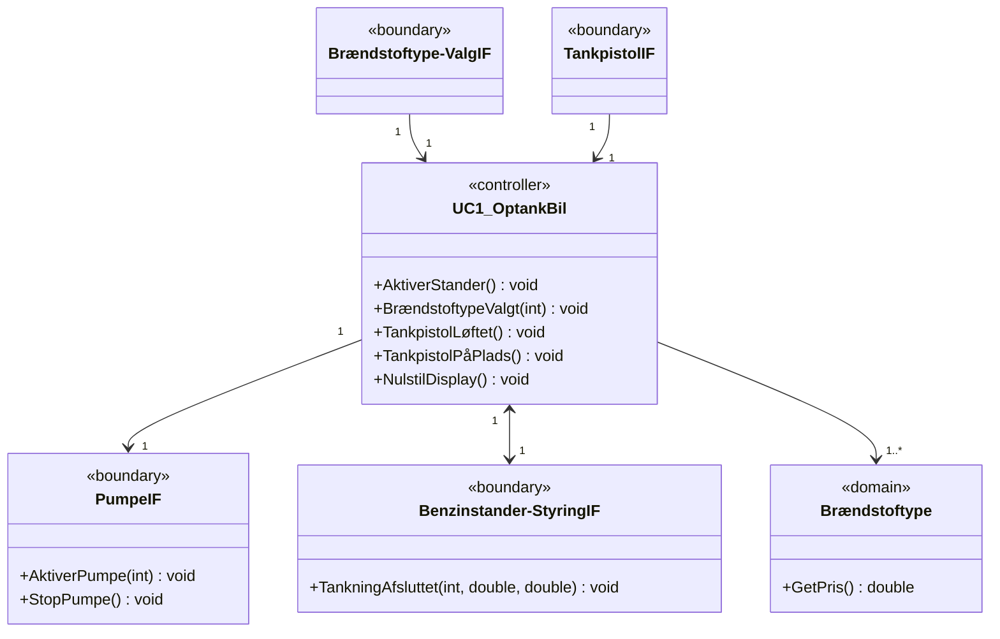

Navigerbarhed: input-boundaries (`Brændstoftype-ValgIF`, `TankpistolIF`) peger ind i controlleren; `PumpeIF` og `Brændstoftype` peges på fra controlleren; `Benzinstander-StyringIF` er tovejs (modtager `AktiverStander()` ind, sender `TankningAfsluttet` ud).

> Side 7

### ALTERNATIVE LØSNINGER

Ud fra nogle af tanker man kan gøre sig ud fra at tingene bliver mere tydelige når man laver SAM, kan medføre ændringer i tidligere designbeslutninger. Disse skal selvfølgelig dokumenteres. Fx vil nedenstående ændringer i kommunikationen mellem Benzinstanderstyringen og Benzinstanderen, for at få prisinformation medføre ændringer i Systemsekvensdiagrammet.

#### Ændret/udvidet sekvensdiagram for Benzinstanderstyringen (sd BSS::UC1_OptankBil)

Her er det Benzinstanderstyringen, der kender priserne på brændstoftyperne. Ny lifeline `brændstof[] : Brændstoftype` «domain» (multiobjekt) er tilføjet mellem `: Kvittering` og `stander[3] : BenzinstanderIF`.

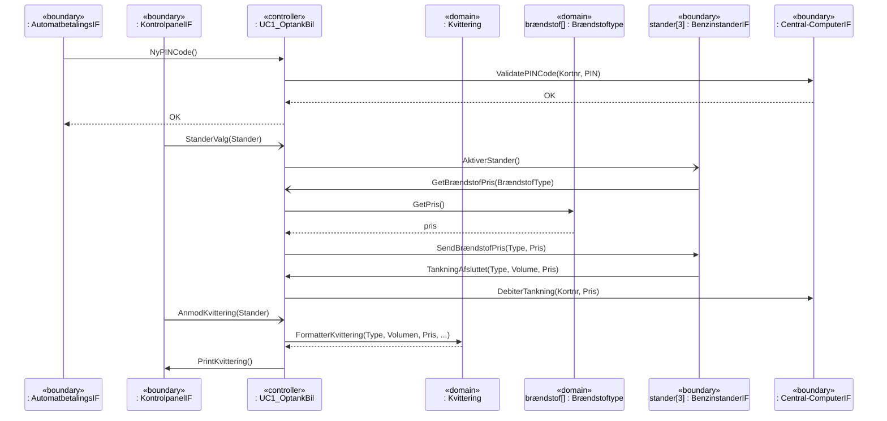

Nyt i forhold til den første løsning: efter `AktiverStander()` sender standeren `GetBrændstofPris(BrændstofType)` til controlleren, som slår prisen op via `GetPris()` på `brændstof[]` og svarer standeren med `SendBrændstofPris(Type, Pris)`.

**class Applicationsmodel for BSS (udvidet):**

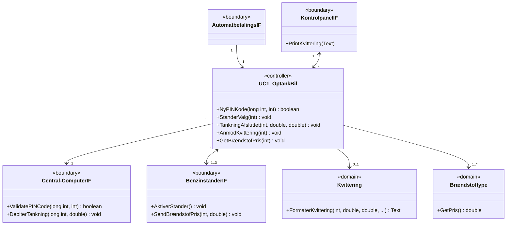

Ændringer: `Brændstoftype` er tilbage (med `GetPris() : double`), `UC1_OptankBil` har fået `GetBrændstofPris(int) : void`, `BenzinstanderIF` har fået `SendBrændstofPris(int, double) : void`.

> Side 8

#### Ændret/udvidet sekvensdiagram for Benzinstanderen (sd Name)

Her skal Benzinstanderen hente prisen på Benzinstanderstyringen, og det er taget med, at den skal opdatere displayet. Lifelinen `brændstof[] : Brændstoftype` er fjernet fra Benzinstanderens SAM (prisen kommer nu fra BSS). Under tankning polles pumpen i et `loop`-fragment.

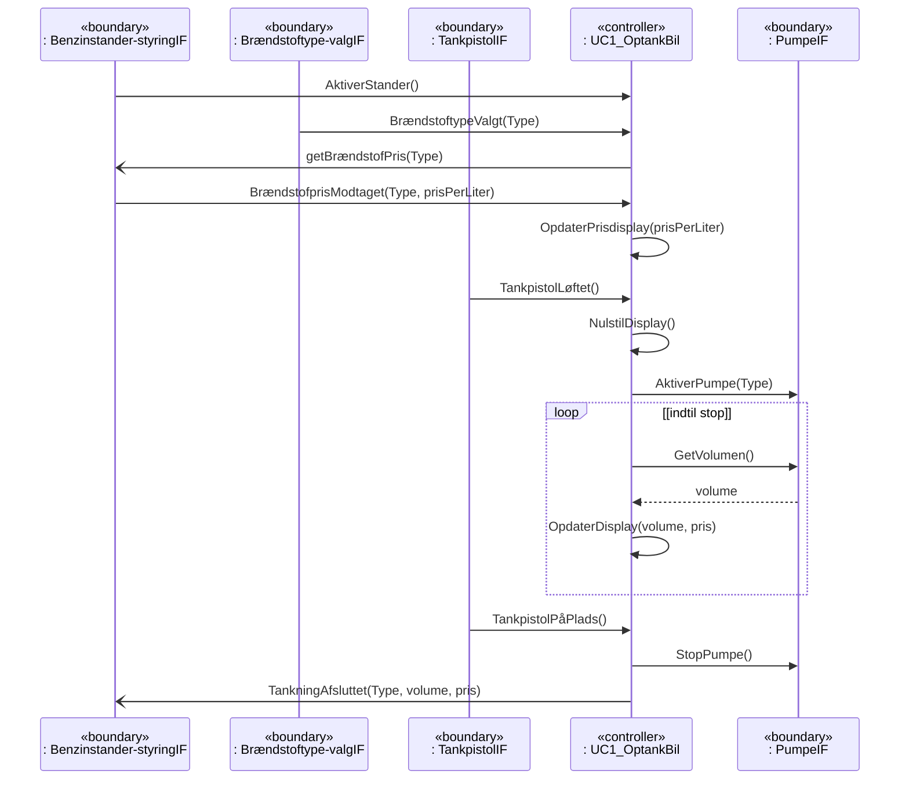

Pointen med loop-fragmentet: controlleren har ingen event fra pumpen om, hvor meget der er tanket, så den *poller* boundary-klassen `PumpeIF` med `GetVolumen()` gentagne gange `[indtil stop]` (dvs. indtil `TankpistolPåPlads()` modtages) og opdaterer displayet med `OpdaterDisplay(volume, pris)` for hver iteration.

**class Applicationsmodel for BS (udvidet):**

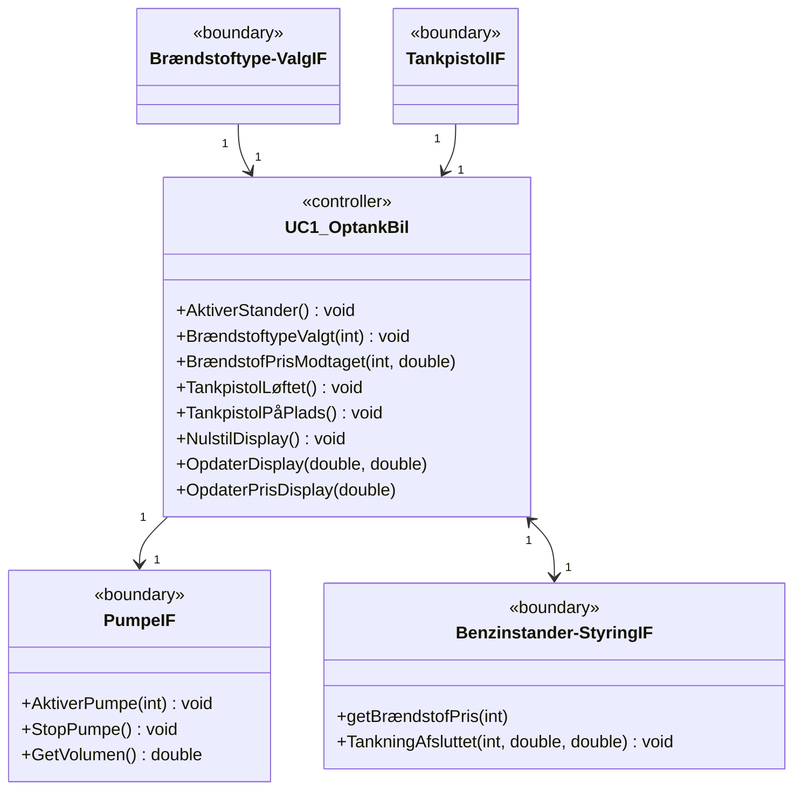

Ændringer i forhold til side 7: `Brændstoftype` er fjernet fra BS-modellen; `PumpeIF` har fået `GetVolumen() : double`; `Benzinstander-StyringIF` har fået `getBrændstofPris(int)`; controlleren har fået `BrændstofPrisModtaget(int, double)`, `OpdaterDisplay(double, double)` og `OpdaterPrisDisplay(double)`. Display-metoderne ligger på controlleren som selvkald, fordi der ikke findes et display i BDD/IBD — en mangel der bør føres tilbage til systemmodellen.

> Side 9

### Opsummering af læringspointer fra løsningen

- SAM laves per blok med software (her både `Benzinstanderstyring` og `Benzinstander`), og boundary-klasser svarer til blokkens ports/interfaces i IBD'en (`BS_Ctrl`, `BSS_Ctrl`, `BT`, `pistolPåPlads`, `pumpeTændt`).
- Controllerens operationer = de events, den modtager fra boundaries. Boundary-klassernes operationer = de kald, controlleren laver ud.
- Domain-klasser der ikke bruges i sekvensdiagrammet (første `Brændstoftype`) skal fjernes igen — klassediagrammet opdateres iterativt efter SD.
- Arbejdet med SAM afslører huller i den tidligere systemmodel (printer, display, prisinformation). Ændringer skal føres tilbage til SSD, BDD, IBD og domænemodel og dokumenteres.
- Når der ikke er en event for en kontinuert størrelse (tanket volumen), polles boundary-klassen i et loop-fragment.
