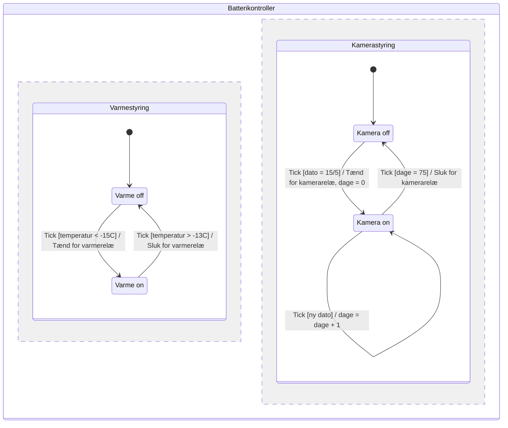

# Øvelse: Kamerasystem (opgave 1–6, opgave 6 er applikationsmodel)

## Metadata

| Felt | Værdi |
|---|---|
| **Lektion** | L20/L21 — Applikationsmodel, sammensatte systemer (fortsat) |
| **Kursus** | SWISE-01 Indledende System Engineering |
| **Kilde** | `L21_Kamerasystem Exercise.pdf` (4 sider) |
| **Type** | øvelse (eksamenslignende opgavesæt; ingen løsning i zip 14) |
| **Emner dækket** | Krav med MoSCoW; BDD → IBD fra port-tabel; use case diagram; fully dressed use case; STM med orthogonal states/Tick-event; klassediagram for applikationsmodel (boundary/controller/domain) |

---

*Dette opgavesæt består af 6 opgaver. Opgave 1, 2, 3 og 6 udgør hver 15% af opgavesættet og opgave 4 og 5 udgør 20% af opgavesættet.*

## Kamerasystem

I de følgende opgaver skal du specificere og designe et kamerasystem, der er beregnet til permanent installation i Østgrønland. Kamerasystemet skal overvåge insekters adfærd og bestøvning af planter i sommerperioden, og være slukket i vinterperioden. Systemet omfatter derfor, foruden et kamera, et "smartbatteri", som skal slukke for kameraerne om vinteren og holde sig selv varme i en isoleret kasse.

Kamerasystemet skal kunne tænde for 4 kameraer om foråret og slukke dem igen med udgangen af sommerperioden. Kameraerne er standardkomponenter, mens smartbatteriet består af et blybatteri, en batterikontroller, en termistor, et varmelegeme og to relæer til styring af varmen og kameraerne som vist i figur 1.

**Figur 1 Block Definitions Diagram af kamerasystem** (`bdd Kamerasystem`):

| Blok | Består af (komposition) | Multiplicitet |
|---|---|---|
| `Kamerasystem` «block» | `Smartbatteri` «block» | 1 |
| | `Kamera` «block» | 4 |

`Smartbatteri` har parts-compartment:

```
parts
: Blybatteri
: Batterikontroller
: Termistor
: Varmelegeme
Varme : Relæ
Kamera : Relæ
```

Kamerasystemet skal tænde for alle kameraer om foråret den 15. maj og slukke igen efter 75 døgn. Kamerasystemet skal kunne tilsluttes et solcellepanel, som oplader smartbatteriet, når der er sol nok. Når kamerasystemet er tændt, skal alle kameraer automatisk tage et foto hvert 30. sekund. Temperaturen i kassen med smartbatteriet skal holdes over -15 ºC i hele driftsperioden. Når systemet sættes i drift, bør installatøren kunne indstille uret på batterikontrolleren.

> Side 1

## Opgave 1 (15%)

Beskriv kravene til kamerasystemet med udgangspunkt i ovenstående beskrivelse. Kravene skal prioriteres med MoSCoW (brug **skal** eller **bør**). Hvert krav nummereres og beskrives med en sætning.

> Side 2

## Opgave 2 (15%)

Den elektroniske del af smartbatteriet er beskrevet nedenfor med blokke, hvor **kun** de elektriske kommunikationsporte skal med, som er beskrevet i tabellen nedenfor. Alle porte i beskrivelserne er atomiske.

| Navn:Block | Beskrivelse | Ports |
|---|---|---|
| `:Smartbatteri` | Indeholder de elektriske blokke beskrevet i denne tabel. | In `Solcelle: DC12V`; Out `Kamera[4]: DC12V` |
| `:Varmelegeme` | Varmelegeme til opvarmning af smartbatteri kassen. | In `Power: DC12V` |
| `:Termistor` | Termisk modstand til måling af temperaturen. | Out `Temp: Analog` |
| `Varme:Relæ` | Relæ til tænd/sluk for varmelegemet. | In `Ctrl: Digital`; In `Power: DC12V`; Out `Varme: DC12V` |
| `:Batterikontroller` | Varetager afvikling af software for styring af temperaturen og automatisk tænd/sluk af kamerarelæ. | In `Power: DC12V`; In `Temp: Analog`; Out `CtrlKamera: Digital`; Out `CtrlVarme: Digital` |
| `Kamera:Relæ` | Relæ til tænd/sluk af kamera. | In `Ctrl: Digital`; In `Power: DC12V`; Out `Kamera[4]: DC12V` |
| `:Blybatteri` | Blybatteri til forsyning af elektriske komponenter, som kan oplades fra solceller. | In `Solcelle: DC12V`; Out `Power: DC12V` |

**Lav et SysML *Internal Block Diagram* (IBD) for block'en "Smartbatteri"** baseret på port- og block-definitionerne i ovenstående tabel.

> Side 2

## Opgave 3 (15%)

Batterikontrolleren skal kunne programmeres. En skitse er vist i figur 2, som viser at kontrolleren består af en Arduino, ur (RTC), 7-segments display og 2 knapper til indstilling af dato.

*Figur 2 Skitse af batterikontroller med Arduino, ur (RTC), 7-segment display og knapper. Billedet viser en boks "Batterikontroller" med en Arduino Mega i midten, en "Real Time Clock (RTC)"-modul (DS3231-lignende) forbundet med ledninger, et rødt 4-cifret 7-segment display (viser "88:88") under Arduinoen, og to knapper mærket "Dag" og "Måned". Til venstre uden for boksen: en "PTC Thermistor (Eller NTC)" med pil ind til Arduinoen, og to relæer mærket "Varme og Kamera Relæ" med pil fra Arduinoen.*

Batterikontrolleren skal kunne styre varme-relæ og tænde/slukke for kamera-relæ. Installatøren skal kunne indstille uret (RTC'en) med 2 knapper til indstilling af henholdsvis måned og dag. Dato vises på et 7-segment display. Månedknap optæller måneder (1-12) og dagknap optæller gyldige dage (1-28/30/31). Der tages ikke hensyn til skudår.

Når der er optalt til den sidste måned eller dag, startes forfra. Displayet skal slukkes automatisk efter 5 minutter, når knapperne ikke er blevet aktiverede. For at tænde displayet igen, skal en af knapperne aktiveres, hvorefter Dags dato vises uden der ændres på datoen.

***Tegn et use case diagram for batterikontrolleren*** med udgangspunkt i beskrivelsen og opgaverne for kamerasystemet.

> Side 3

## Opgave 4 (20%)

En oplagt use case for batterikontrolleren er "Indstil ur". Giv en *fully dressed* use case-beskrivelse med udgangspunkt i beskrivelsen ovenfor inklusiv udvidelser/undtagelser.

Brug skabelonen nedenfor:

| Felt | |
|---|---|
| **Navn:** | |
| **Mål** | |
| **Initiering** | |
| **Aktører** | |
| **Antal samtidige forekomster** | |
| **Prækondition** | |
| **Postkondition** | |
| **Hovedscenarie** | |
| **Udvidelser/undtagelser** | |
| **Datavariationsliste** | |

> Side 4

## Opgave 5 (20%)

Lav et SysML *State machine diagram* (STM) for batterikontrolleren til styring af varme og kamera. Brug tilstande, triggers, guards og actions som beskrevet i nedenstående tabel. Systemet implementeres med et Tick event, der trigger statemaskinen hvert minut. Hint: brug parallelle tilstande ("multiple regions" også kendt som "orthogonal states").

| Tilstand | Triggers[guard] | Actions |
|---|---|---|
| **Varme off** (Afventer temperatur bliver for lav) | `Tick[temperatur < -15C]` | Tænd for varmerelæ |
| **Varme on** (Afventer temperatur bliver høj) | `Tick[temperatur > -13C]` | Sluk for varmerelæ |
| **Kamera off** (Afventer dato for at tænde kamerarelæ) | `Tick[dato = 15/5]` | Tænd for kamerarelæ, dage = 0 |
| **Kamera on** (Afventer, at der er gået et antal dage, før kamerarelæ slukkes) | `Tick[dage = 75]` | Sluk for kamerarelæ |
| | `Tick[ny dato]` | dage = dage + 1 |

Tabellen som state machine (to ortogonale regioner, ikke en del af opgaveteksten — udledt direkte af tabellen):



> Side 4

## Opgave 6 (15%)

Der skal designes software til batterikontrolleren. Lav et *Class Diagram* for applikationsmodellen, hvor "boundary" og "controller" klasser identificeres med udgangspunkt i use casen "Indstil ur" og din løsning til opgaverne 2-6. Du skal som minimum medtage domain-klassen dato. Der skal ikke tilføjes metoder, men kun klasser, attributter, relationer og multiplicitet. Du skal ikke lave en domænemodel.

> Side 4

---

## Note om løsning

Brightspace-siden for L20/L21 skriver "Kamerasystem løsning i løsningsforslag", men zip 14 indeholder ikke nogen løsningsfil til kamerasystemet — kun løsningerne til ATM, SmartFridge og Benzinstander. Underviseren gennemgår løsningsforslagene i anden halvdel af lektionen.

Input til opgave 6 (fra opgave 2–3, til brug for boundary-identifikation): Batterikontrollerens ports er `Power: DC12V` (in), `Temp: Analog` (in), `CtrlKamera: Digital` (out), `CtrlVarme: Digital` (out); hertil kommer fra figur 2 RTC, 7-segment display og knapperne Dag/Måned. Det er disse HW-interfaces, der bliver til boundary-klasser i applikationsmodellen (jf. L18: "Applikationsmodel og Hardware").
