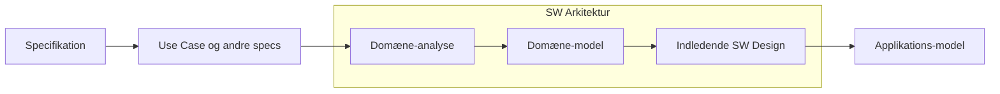
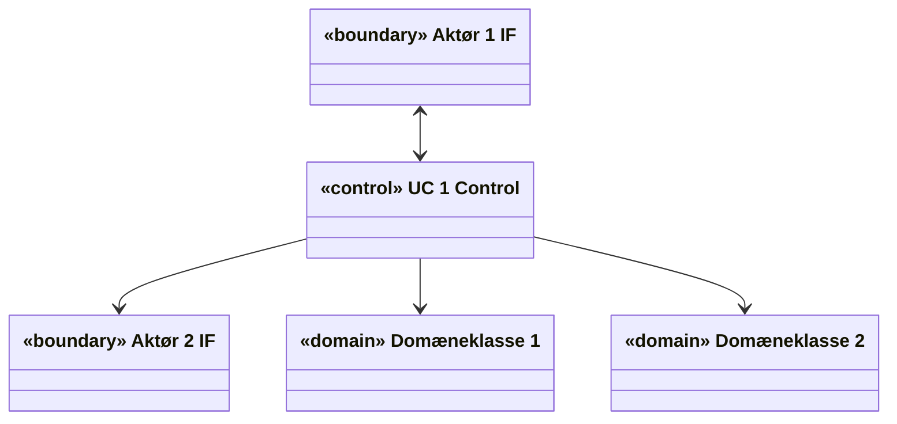
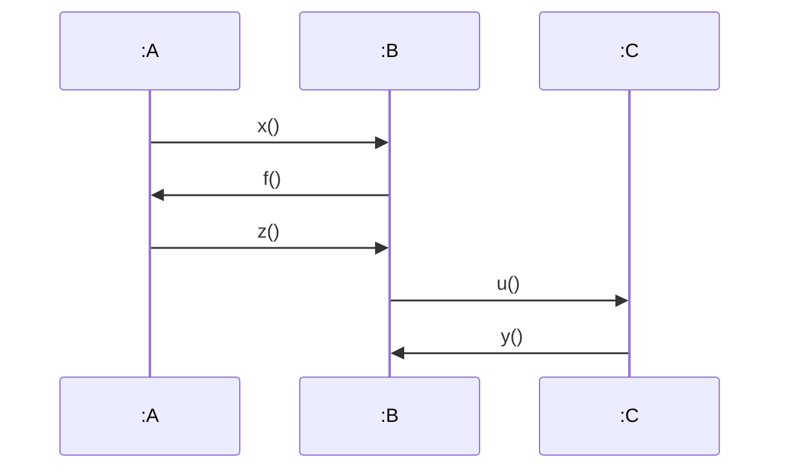
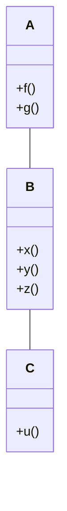
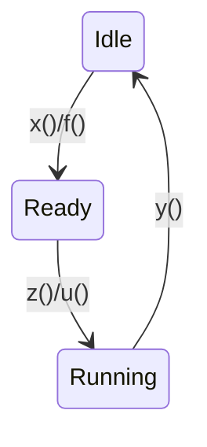
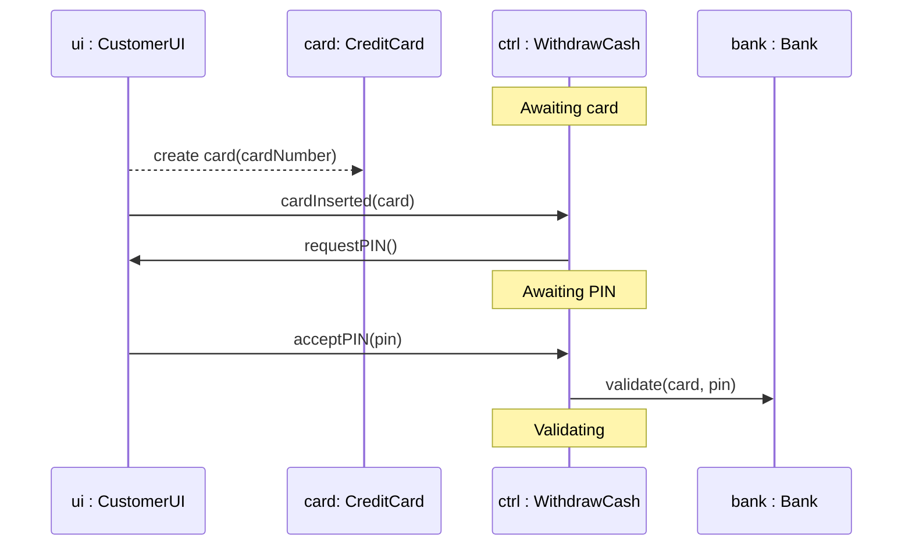
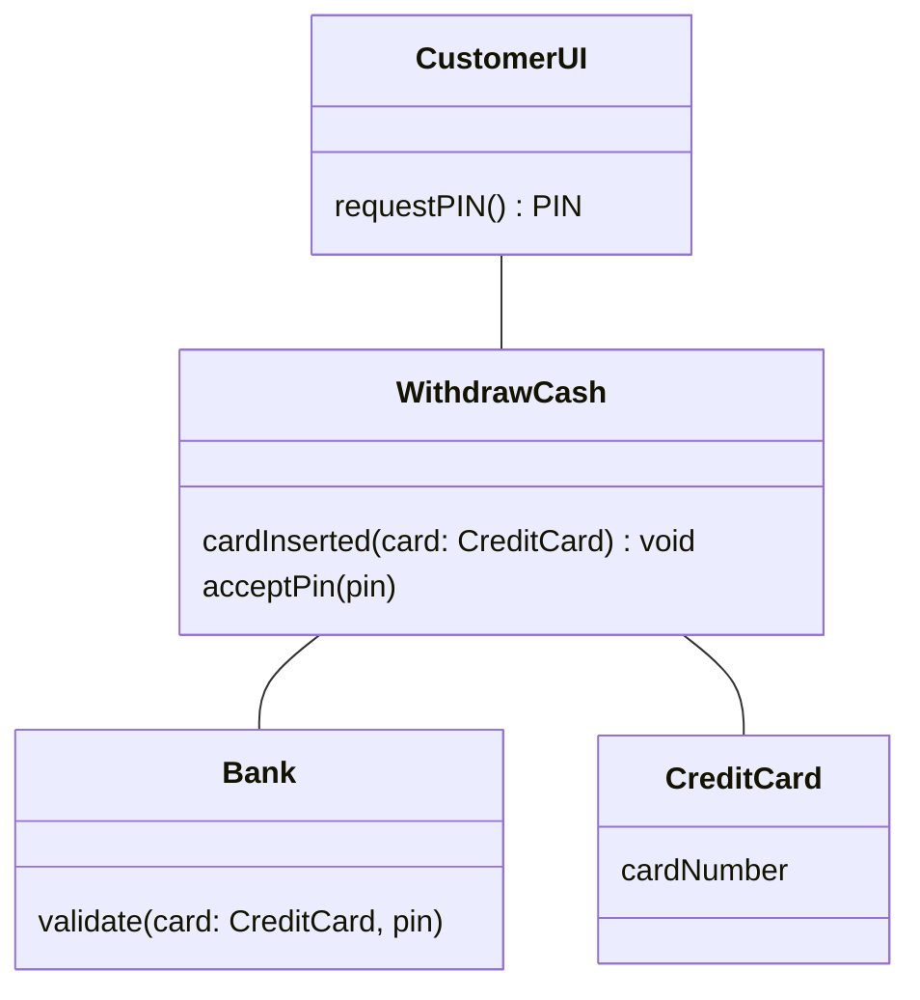
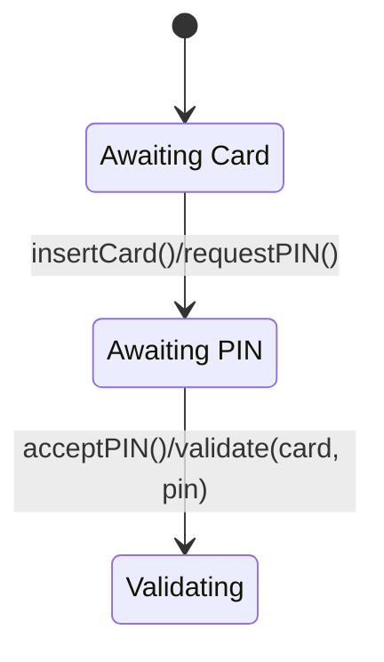
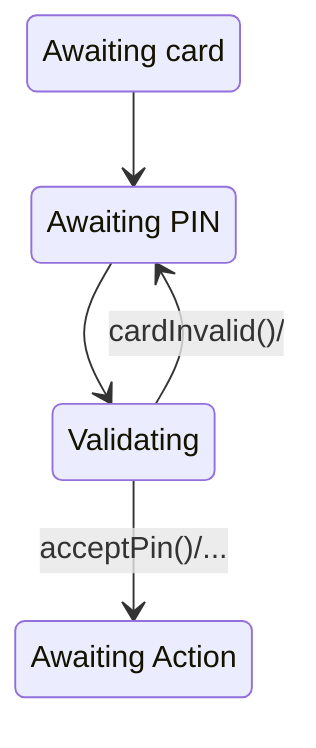
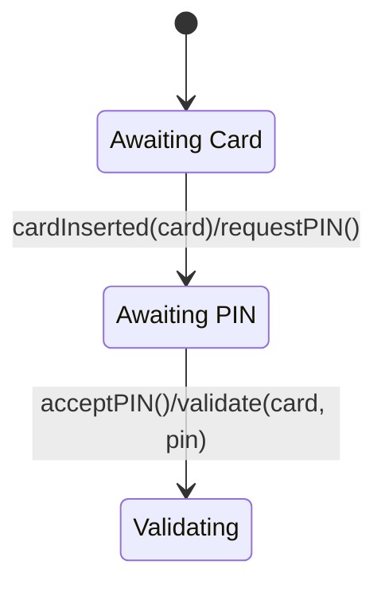

# Applikationsmodeller — Part 1: fra Use Cases til software

## Metadata

| Felt | Værdi |
|---|---|
| **Lektion** | L17 — Applikationsmodel (fra Use Cases til software) |
| **Kursus** | SWISE-01 Indledende System Engineering |
| **Kilde** | `System Application Models Part1.pdf` (30 slides) |
| **Type** | slides |
| **Emner dækket** | Applikationsmodellens (AM) plads i ASE-processen og i Systemarkitektur-dokumentet; Entity-Control-Boundary pattern (boundary/domain/control-klasser); AM = klassediagram + sekvensdiagram + tilstandsdiagram; metoden Step 1.1–1.4 (find klasser) og Step 2.1–2.5 (find samarbejde); ATM-eksempel med UC Withdraw Cash; start på hjemmeøvelsen |

---

## Applikationsmodellen – slår bro over kløften

- Vi har brugt masser af tid til at skrive UCs og lave Domænemodel(ler)
- I dag får vi nytte af dem!
- Vi vil bruge dem til at slå bro over kløften mellem **Hvad** systemet skal gøre (krav/specifikationer) og **Hvordan** det skal gøres (design)
- Vi vil bruge UCs som *design drivers* – input til designprocessen
- Så: **UCs er vigtige!**

> Slide 2

## Hvad er Applikationsmodellen?

- Applikationsmodellen – **AM** – er første skridt i designprocessen!
- Den vil pege på relevante klasser/moduler som designet bygges op på!
- Den vil beskrive hvordan disse interagerer
- Applikationsmodellen er en del af **SW Design**-afsnittet i **Systemarkitektur-dokumentet**.

> Slide 3

## AM's plads i dokumenterne

*Figur: "The ASE Process" – procesdiagram med faserne Projektformulering → Specifikation → Arkitektur → (iterativ, cross-disciplinary boks med HW Design / PC-SW Design / µC-SW Design og tilhørende Implementering + modultest) → Integrationstest → Accepttest. Til højre de dokumenter hver fase producerer: Projektformulering, Kravspecifikation, Accepttestspecifikation, Systemarkitektur (HW og SW), HW-designdokument, SW-designdokument, Hardware, Source Code, Logbog, Gennemført accepttest. En pil markeret "AM" (med et miniaturebillede af System Application Model: klassediagram + sekvensdiagram + tilstandsdiagram) peger på **Systemarkitektur (HW og SW)** – dvs. AM hører hjemme i arkitekturfasen, ikke i SW-designdokumentet.*

> Slide 4

## SW Arkitektur – fra UC til Design

Flow (venstre → højre):

De røde (artefakt-)bokse er *Use Case og andre specs*, *Domænemodel* og *Applikationsmodel*; de blå er aktiviteter (Specifikation, Domæneanalyse, Indledende SW Design).

> Slide 5

## Applikationsmodellens plads i det store billede

*Figur: Use cases (bunke af dokumenter) → Applikationsmodel (klassediagram, sekvensdiagram, tilstandsdiagram side om side) med påskriften "Så mange som nødvendigt!". Domænemodel → Applikationsmodel. Use cases → Acceptance test (checkliste). Applikationsmodel → sky "Iterative design & implementation" → Product ("Hypr Hack 1.0") → Acceptance test.*

Pointen: AM bygges af UCs og domænemodellen, og der laves så mange sæt af de tre diagrammer som nødvendigt; derfra går det iterativt til design/implementation og produktet accepttestes mod UCs.

> Slide 6

## Virkeligheden og systemet

*Figur: En sky "Virkeligheden!" indeholder en kasse "Domænet!". I domænet: "En bruger" (smiley) ↔ "Et nyt system" (cirkel opdelt i MEK, HW, SW) ↔ "Et andet system" (mindre cirkel). Inde i SW-delen er der gule kasser mærket "Klasser" med callout: "Det er klasserne, vi skal finde!"*

> Slide 7

## Arkitektur – hvad er det?

- Vi mangler en god ide til at organisere disse klasser!
- Det kaldes **Arkitektur**
- Vi har ganske vist Domæneklasserne
- Men hvordan får vi styret afviklingen af UC?
- Det bør Domæneklasserne ikke vide noget om!
- Og Domæneklasserne bør ikke vide noget om Hardware og andre interfaces til omverdenen

> Slide 8

## Vores arkitektur pattern

- … hedder **Entity-Control-Boundary pattern**
- Dette er et velkendt og velafprøvet *Architectural Pattern*
- Et *pattern* er et mønster, som man kan genkende i mange godt designede og godt fungerende applikationer
- Vi vil her kalde *Entity* klasser for *Domain* klasser

> Slide 9

## Domain – Control – Boundary

Øverst: klassediagram med to aktører. Struktur:

Aktør 1 (tændstiksmand) er forbundet til «boundary» Aktør 1 IF; Aktør 2 til «boundary» Aktør 2 IF. Pilen mellem Aktør 1 IF og UC 1 Control er tovejs; fra UC 1 Control til Aktør 2 IF er den envejs (control → boundary). Domæneklasserne tilgås kun fra control.

Nederst: koncentriske sekskanter (udefra og ind): **aktører** → **boundary klasser** → **control klasser** → **domæne klasser**. Boundary-laget skærmer control og domæne mod omverdenen.

> Slide 10

## Applikationsmodellen

- Applikationsmodellen er sammensat af følgende **3 typer af diagrammer**:
  - *Klassediagram* (cd) for strukturen (statisk)
  - *Sekvensdiagrammer* (SD) og
  - *Tilstandsdiagrammer* (STM) for aktiviteter (dynamisk)
- Der laves et tilstrækkeligt antal **sæt** af disse til at beskrive **alle UCs**
- UC bruges til at konstruere dem

> Slide 11

## Applikationsmodellen – Step 1

Applikationsmodellen opbygges skridt for skridt, hvor hvert skridt styres af **én UC**:

| Step | Handling |
|---|---|
| **Step 1.1** | Vælg den næste fully-dressed UC til at designe for (hvordan?) |
| **Step 1.2** | Identificer alle involverede **aktører** i UC → **Boundary** klasser |
| **Step 1.3** | Identificer **relevante klasser i Domænemodellen** som er involveret i UC → **Domain** klasser |
| **Step 1.4** | Tilføj **én UC control** → **Control** klasse |

Callout til Step 1.2: *Er der tvivl, er en klasse boundary klasse før den er domæneklasse.*

> Slide 12

## Nogle hvad for nogle klasser?

Applikationsmodellen består af 3 forskellige klassetyper: *Boundary*, *domain* og *control* klasser.

**Boundary klasser repræsenterer UC aktører**
- De er aktørernes interface **til systemet** (UI, protokol, …)
- De gør systemet **synligt for aktørerne**
- Indeholder ingen "business logic" – dvs. ingen styring af UC
- Mindst 1 per aktør, deles mellem de UCs der har samme aktører
- Bør forsynes med stereotypen «boundary»

**Domain klasser repræsenterer systemets domæne**
- Data, domæne-specifik viden, konfigurationer, etc.
- 0, 1 eller flere, deles mellem de UCs der bruger samme begreber
- Kan forsynes med stereotypen «domain»

> Slide 13

**Control klassen indeholder UC'ens business logic**
- Den styrer ("executes") UC'en ved at interagere med *boundary* og *domain* klasserne
- Den skal have navn efter UC'en
- Typisk er der 1 per UC eller 1 som deles mellem nogle få UCs
- Bør forsynes med stereotypen «control»

> Slide 14

## Kontant-/Bankautomaten (ATM – Automatic Teller Machine)

Gennemgående eksempel for resten af sættet.

> Slide 15

### ATM Use Cases

*Figur: Use case-diagram. Systemgrænse (rektangel) med to use cases: **Withdraw Cash** og **Transfer Amount**. Aktør **Customer** (venstre) er forbundet til begge; aktør **Bank** (højre) er forbundet til begge.*

> Slide 16

### ATM Domænemodel

*Figur: Domænemodel (klassediagram uden metoder).*

| Klasse | Attributter |
|---|---|
| Cash | – |
| Customer | – |
| Account | Balance |
| Bank | – |
| Credit card | PIN |

| Association | Fra | Til | Læseretning |
|---|---|---|---|
| Receives | Customer | Cash | Customer *receives* Cash |
| Is withdrawn from | Cash | Account | Cash *is withdrawn from* Account |
| Is associated with | Account | Bank | Account *is associated with* Bank |
| Is associated with | Credit card | Account | Credit card *is associated with* Account |
| Belongs to | Credit card | Customer | Credit card *belongs to* Customer |
| Validates | Bank | Credit card | Bank *validates* Credit card |

> Slide 17

### ATM step 1.1: Vælg den næste UC

*Figur: Samme use case-diagram; **Withdraw Cash** er markeret med rød ramme. Callout: "Step 1.1: Vælg den næste fully-dressed UC at designe for".*

> Slide 18

### ATM step 1.2: Actors → boundary klasser

*Figur: Slide delt vandret af en stiplet linje. Øverst "Use cases (requirements)": use case-diagrammet med aktørerne **Customer** og **Bank** markeret med rød ramme. Nederst "Application Model (design)": røde pile fra Customer → klassen **«boundary» CustomerUI** og fra Bank → klassen **«boundary» BankUI**. Callout: "Step 1.2: Identify alle actors involveret i UC'en → Boundary klasser".*

Resultat: `«boundary» CustomerUI`, `«boundary» BankUI`.

> Slide 19

### ATM step 1.3: Domain klasser

*Figur: Øverst domænemodellen med **Cash**, **Account (Balance)** og **Credit card (PIN)** markeret med rød ramme (Customer og Bank er ikke markeret – de er blevet boundary-klasser). Nederst: røde pile til de tre nye domain-klasser **Cash**, **Account** (Balance) og **Credit card** (PIN). CustomerUI og BankUI vises nedtonet (fra step 1.2). Callout: "Step 1.3: Identificer relevante klasser i Domænemodellen som er involveret i UC'en → Domain klasser".*

Resultat: `Cash`, `Account { Balance }`, `Credit card { PIN }`.

> Slide 20

### ATM step 1.4: UC control → Control class

*Figur: Øverst use casen **Withdraw Cash** markeret med grøn ramme; grøn pil ned til klassen **«control» WithdrawCash**. De øvrige fem klasser vises nedtonet. Callout: "Step 1.4: Tilføj en UC control → Control klasse".*

Resultat: `«control» WithdrawCash`.

> Slide 21

### Step 1 færdigt – så langt, så godt

- Vi er nu færdige med Step 1 og har identificeret **6 kandidater** som SW klasser for vores indledende design
- For at komme så langt, brugte vi vores *use case* og vores *Domænemodel*

| Type | Klasser |
|---|---|
| «boundary» | CustomerUI, BankUI |
| «control» | WithdrawCash |
| domain | Cash, Account (Balance), Credit card (PIN) |

- Nu skal vi tilføje aktiviteter – det er **Step 2**

> Slide 22

## Principperne for step 2.1–4: Gå igennem hovedscenariet for UC og opdater løbende

De tre diagrammer **opdateres parallelt!**

**Sekvensdiagram:**
- Tilføj kald af objekternes metoder

**Klassediagram:**
- Tilføj metoder til klasserne
- Opdater associationer

**Tilstands/aktionsdiagram:**
- Lav det for de klasser der har tilstande
- Triggerne til transitionerne er kald til klassens metoder
- Aktionerne er kald til andre klassers metoder

Illustrationseksempel på sliden (generiske klasser A, B, C):

STM for Class B (den klasse der har tilstande):

Bemærk sammenhængen: triggeren `x()` er en metode på B (kaldt af A på SD'et), aktionen `f()` er B's kald til A; `z()/u()`: z() på B, u() er B's kald til C; `y()` er C's kald til B.

> Slide 23

## Applikationsmodellen – Step 2

Samarbejdet mellem klasserne udledes nu fra UC:

| Step | Handling |
|---|---|
| **Step 2.1** | Gennemgå UC's hovedscenarie skridt-for-skridt og udtænk hvordan klasserne kan samarbejde for at udføre skridtet |
| **Step 2.2** | Opdater sekvens- og klassediagrammet for at beskrive samarbejdet (metoder, associationer, attributter) |
| **Step 2.3** | Hold øje med, om der er state-baserede aktiviteter og opdater STMs for disse klasser (tilstande, triggere, overgange, aktioner). *(Step 2.3 springes over hvis der ikke er nogen tilstandsbaserede klasser)* |
| **Step 2.4** | Verificer at diagrammerne passer med UC (postconditions, test) |
| **Step 2.5** | Gentag 2.1 – 2.4 for alle UC extentions. Finpuds modellen. |

Alle 3 diagrammer (cd, SD, STM) opdateres **parallelt/samtidigt** under dette arbejde.

> Slide 24

## Steps 2.1–2.4 for UC Withdraw Money

Main scenario (de første fire skridt, med pile ud for hvert):
1. Customer inserts credit card in System
2. System requests Customer's PIN code
3. Customer enters PIN code
4. System validates card info and PIN code with Bank

Sliden viser alle tre diagrammer bygget op samtidigt for disse fire skridt.

**Sekvensdiagram** (livliner `ui : CustomerUI`, `card: CreditCard`, `ctrl : WithdrawCash`, `bank : Bank`; tilstandsmarkører på ctrl-livlinen):

**Klassediagram** (foreløbigt; ingen stereotyper på denne slide):

**STM for WithdrawCash:**

(Bemærk: på slide 25 hedder triggeren `insertCard()`, på slide 30 hedder den `cardInserted(card)` – sidstnævnte matcher metoden på klassediagrammet.)

> Slide 25

## Find STM fra hovedscenariet med extensions

Hovedscenarie:
1. Customer inserts credit card in System
2. System requests Customer's PIN code
3. Customer enters PIN code
4. System validates card info and PIN code with Bank
5. Bank validates card — [*Ext. 5.1: Invalid PIN entered*]
6. System requests desired action from customer
7. Customer selects "Withdraw Cash"
8. ...

Tilstandene aflæses direkte af scenariets "ventepunkter": efter skridt 1 → *Awaiting card*; efter 2–3 → *Awaiting PIN*; efter 4–5 → *Validating*; efter 6–7 → *Awaiting Action*. Extension 5.1 giver en transition tilbage:

(Pilene Awaiting card → Awaiting PIN og Awaiting PIN → Validating er tegnet uden label på denne slide; labels er på slide 25/30. Transitionen *Validating → Awaiting PIN* er trigget af `cardInvalid()/` (ext. 5.1), og *Validating → Awaiting Action* af `acceptPin()/...`.)

> Slide 26

## Applikationsmodellen – hvad nu?

- Fortsæt med næste UC
- Efterhånden som man tilføjer flere UC'er vil man opdage at man kan genbruge nogle af de allerede fundne klasser
  - Domain og boundary klasser dukker ofte op igen
  - Forskellige domain klasser er måske så nært beslægtede, at de kan slås sammen til en
  - Nogle gange kan også control klasser slås sammen
- At tage det rigtige valg mellem genbrug, slå sammen eller introducere nye klasser kommer med erfaringen

> Slide 27

## Så er det jeres tur: Gør Applikationsmodellen for UC Withdraw Cash færdig!

- Den fulde tekst for UC Withdraw Cash findes på BrightSpace (`SAM_ATM UC description.pdf`). I skal:
  - Gøre Applikationsmodellen færdig for hovedscenariet for UC'en
  - Udbygge Applikationsmodellen med alle extensions for UC'en
- Udgangspunktet er de 3 diagrammer vi har lavet her ved gennemgangen – ses nedenfor
- Arbejd videre nu og hjemmearbejde til næste gang

> Slide 28

### Start øvelsen – starten på Sekvensdiagrammet

`create card(cardNumber)` er en stiplet (create-)message fra ui til card. Alle øvrige er synkrone kald. Aktiveringsbjælker på ui ved hvert kald, lang aktivering på ctrl fra `cardInserted` og frem, kort aktivering på bank ved `validate`.

> Slide 29

### Start øvelsen – starten på klassediagrammet og tilstandsdiagrammet

Associationerne er tegnet uden pilespidser (uspecificeret retning) på denne slide.

> Slide 30
