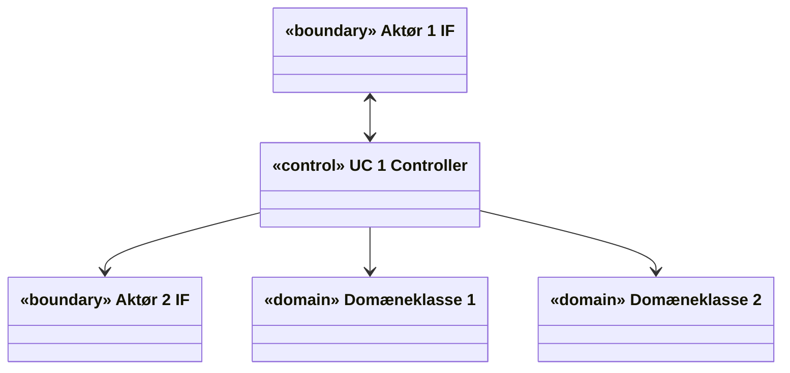
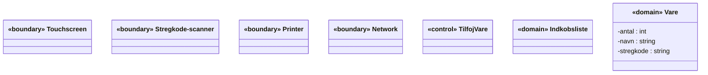
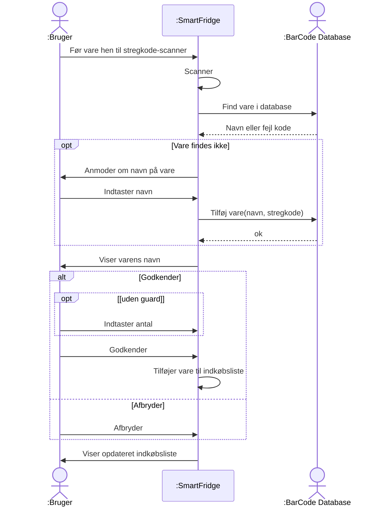
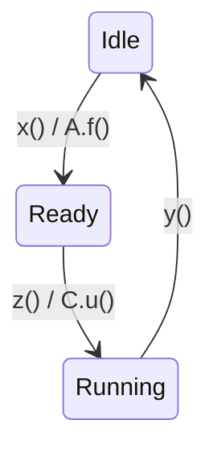
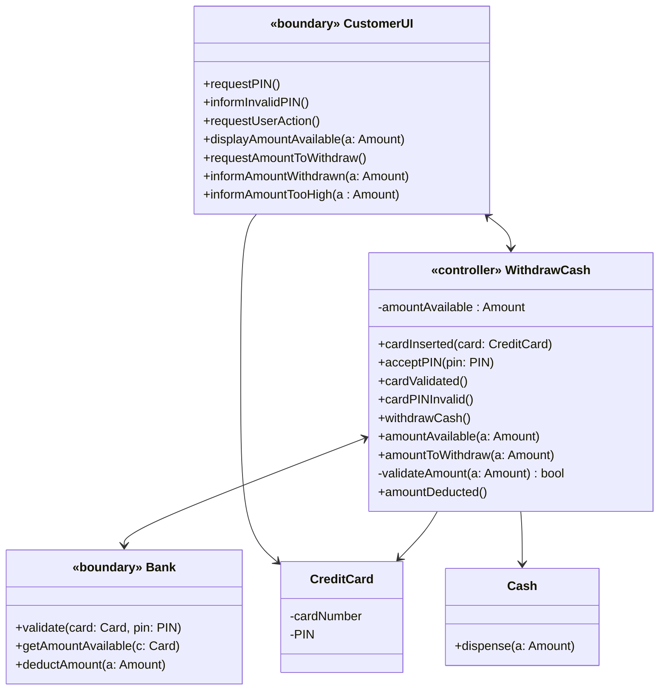
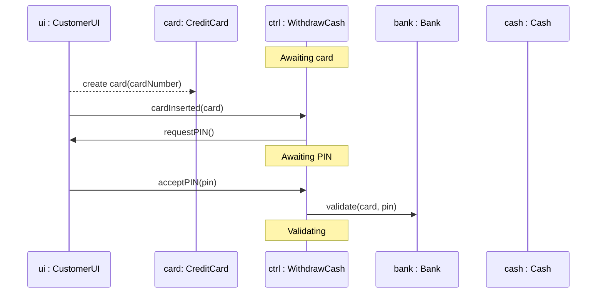
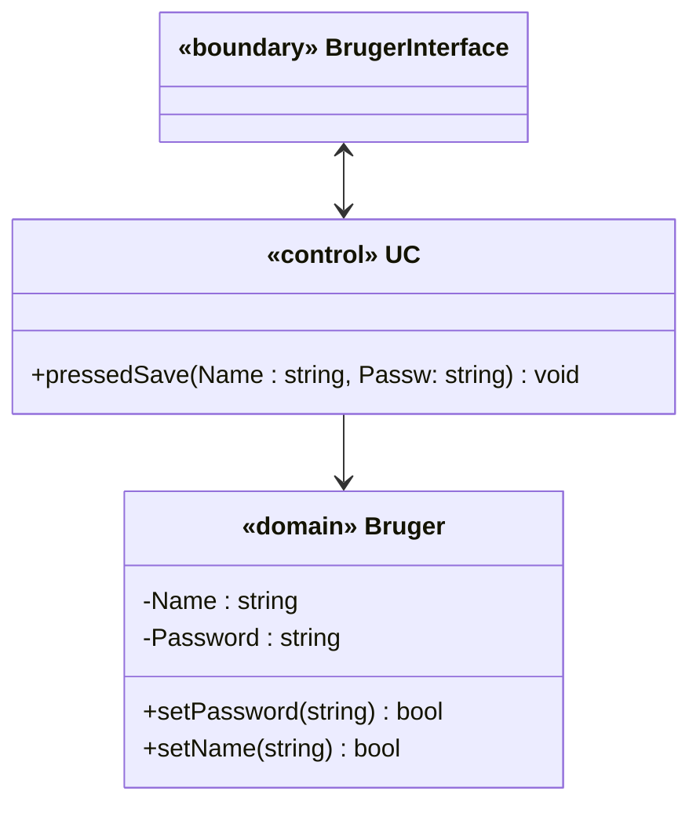
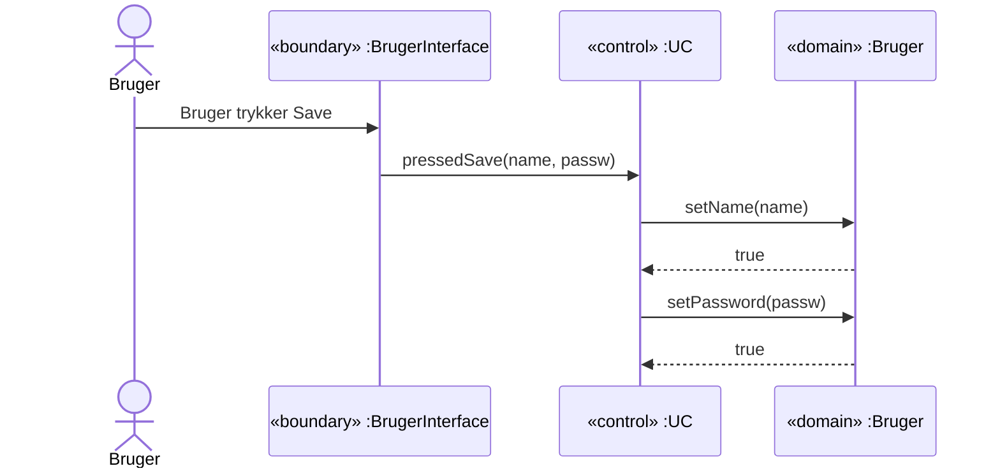

# Applikationsmodeller — Del 2: Find de rigtige boundary klasser

## Metadata

| Felt | Værdi |
|---|---|
| **Lektion** | L18 — Applikationsmodel og Hardware |
| **Kursus** | SWISE-01 Indledende System Engineering |
| **Kilde** | `System Application Models Part2.pdf` / `System Application Models Part2.pptx` (28 slides; pptx'ens noter er tomme) |
| **Type** | slides |
| **Emner dækket** | Resumé af ECB-pattern og AM; boundary-klasser udledt fra hardware interfaces på IBD (Step 1.2b); Step 1 version 2; SmartFridge-eksempel (IBD → 1. version klassediagram); systemsekvensdiagram som input til Step 2; metoder = messages; kommunikationsregler (principielle og pragmatiske); designregler for konsistens mellem SD og cd; guidelines for "control" og Actor; øvelse |

*Sidenumre refererer til PDF-versionen (28 sider). Slide 17 er et rent diagram uden tekst (systemsekvensdiagram) og mangler derfor i pdftotext-udtrækket.*

---

## Dagens program

- Resumé
- Find nogle gode boundary klasser
- Regler og guide lines for applikationsmodeller
- Øvelse

> Slide 1–2

## Resumé (gentagelse fra Part 1)

### AM's plads i dokumenterne

*Figur: "The ASE Process" – identisk med Part 1 slide 4. Pil mærket "AM" (System Application Model: cd + SD + STM) peger på dokumentet **Systemarkitektur (HW og SW)**.*

> Slide 3

### SW Arkitektur – fra UC til Design

Specifikation → **Use Case og andre specs** → [SW Arkitektur: Domæne-analyse → **Domæne-model** → Indledende SW Design] → **Applikations-model**. (Identisk med Part 1 slide 5.)

> Slide 4

### Vores arkitektur

- … hedder *Entity-Control-Boundary pattern*
- Dette er et velkendt og velafprøvet *Architectural Pattern*
- Et *pattern* er et mønster, som man kan genkende i mange godt designede og godt fungerende applikationer
- Vi vil her kalde *Entity* klasser for *Domain* klasser

> Slide 5

### Domain – Control – Boundary

Samme figur som Part 1 slide 10, men control-klassen hedder her **«control» UC 1 Controller**:

Koncentriske sekskanter: aktører → boundary klasser → control klasser → domæne klasser.

> Slide 6

### Applikationsmodellen

- Applikationsmodellen er sammensat af følgende 3 typer af diagrammer:
  - *Klassediagram* (cd) for strukturen (statisk)
  - *Sekvensdiagrammer* (SEQ) og
  - *Tilstandsdiagrammer (STM)* for aktiviteter (dynamisk)
- Der laves et tilstrækkeligt antal **sæt** af disse til at beskrive **alle UCs**
- UC bruges til at konstruere dem

> Slide 7

### Nogle hvad for nogle klasser?

Applikationsmodellen består af 3 forskellige klassetyper: *Boundary*, *domain* og *control* klasser.

**Boundary klasser repræsenterer UC aktører**
- De er aktørernes interface **til systemet** (UI, protokol, …)
- De gør systemet **synligt for aktørerne**
- Indeholder ingen "business logic" – dvs. ingen styring af UC
- Mindst 1 per aktør, deles mellem de UCs der har samme aktører
- Bør forsynes med stereotypen «boundary»

**Domain klasser repræsenterer systemets domæne**
- Data, domæne-specifik viden, konfigurationer, etc.
- 0, 1 eller flere, deles mellem de UCs der bruger samme begreber
- Kan forsynes med stereotypen «domain»

> Slide 8

**Control klassen indeholder UC'ens business logic**
- Den styrer ("executes") UC'en ved at interagere med *boundary* og *domain* klasserne
- Den skal have navn efter UC'en
- Typisk er der 1 per UC eller 1 som deles mellem nogle få UCs
- Bør forsynes med stereotypen «control» or «controller»

> Slide 9

## Boundary klasser og hardware interfaces

- *Boundary* klasserne er den del af softwaren, der tager sig af interfaces til *Actors*
- Softwaren kører på computeren/microcontrolleren
- Så må interfaces til *Actors* være interfaces på computeren/microcontrolleren!
- Derfor: Led efter hardware interfaces der er involveret med *Actors*!
- For hver af dem: Lav en *boundary* klasse!

> Slide 10

## Applikationsmodellen – Step 1, Version 2!

Applikationsmodellen opbygges skridt for skridt, hvor hvert skridt styres af én UC:

| Step | Handling |
|---|---|
| **Step 1.1** | Vælg den næste fully-dressed UC til at designe for (hvordan?) |
| **Step 1.2a** | Identificer alle involverede **aktører** i UC → **Boundary** klasser |
| **Step 1.2b** | *(nyt)* **Hvis man har et IBD som definerer de faktiske hardware interfaces: opsplit *Boundary* klasserne i relevante *hardware interface Boundary* klasser!** |
| **Step 1.3** | Identificer **relevante klasser i Domænemodellen** som er involveret i UC → **Domain** klasser |
| **Step 1.4** | Tilføj én UC *control* → **Control** klasse |

> Slide 11

## Find Boundaryklasser (SmartFridge IBD)

*Figur: IBD for blokken **SmartFridge** med fem parts og eksterne ports. To grønne callouts: "Involveret med Bruger" peger på `: Stregkodescanner` og `: Touchskærm`; "Involveret med Barcode Database" peger på `: WiFi`. (`: Printer` har også en pil fra "Involveret med Bruger"-callouten.)*

| Part | Ports |
|---|---|
| : Stregkodescanner | barcode: Light (ind, fra ekstern port), data: RS232 (ud) |
| : Touchskærm | push: Force (ind, fra ekstern port), touch: USB (ud), info: Image (ud, til ekstern port), hdmi: HDMI (ind) |
| : Computer | scanner: RS232, touch: USB, hdmi: HDMI, printer: USB, WiFi: WiFiData |
| : Printer | data: USB (ind), paper: Paper (ud, til ekstern port) |
| : WiFi | data: WiFiData, wireless: IEEE 802.11 (til ekstern port) |

Eksterne ports på SmartFridge: `barcode: Light`, `push: Force`, `info: Image` (bruger-siden); `paper: Paper`, `wireless: IEEE 802.11` (højre side).

Connectors: Stregkodescanner.data ↔ Computer.scanner (RS232); Touchskærm.touch ↔ Computer.touch (USB); Computer.hdmi ↔ Touchskærm.hdmi (HDMI); Computer.printer ↔ Printer.data (USB); Computer.WiFi ↔ WiFi.data (WiFiData).

Pointen: hver hardware interface på Computeren, der er involveret med en aktør, giver én boundary-klasse (Step 1.2b).

> Slide 12

## 1. Version SAM klassediagram (SmartFridge)

`class SmartFridge Applikationsmodel` – klasserne er placeret uden associationer endnu:

Fire boundary-klasser (én per HW-interface fra IBD'et: Touchscreen, Stregkode-scanner, Printer, Network), én control-klasse (TilfojVare – navngivet efter UC'en), to domain-klasser (Indkobsliste, Vare).

> Slide 13

## Applikationsmodellen er en Softwaremodel!

- Derfor skal vi finde **metoderne** på klasserne
- Alle messages mellem objekterne på sekvensdiagrammet er metodekald! Derfor har de "()"
- Udtænk
  - et godt navn
  - parametre og parametertyper
  - returværdi (for synkrone kald som ikke er void)
  - synkron/asynkron — *Interrupts vs. polling*

> Slide 14

## Applikationsmodellen – Step 2

Samarbejdet mellem klasserne udledes nu fra UC:

| Step | Handling |
|---|---|
| **Step 2.1** | Gennemgå UC's hovedscenarie skridt-for-skridt og udtænk hvordan klasserne kan samarbejde for at udføre skridtet. **Hvis man er heldig, har man et System SEQ, der viser UC – brug det!** |
| **Step 2.2** | Opdater sekvens- og klassediagrammet for at beskrive samarbejdet (metoder, associationer, attributter) |
| **Step 2.3** | Hold øje med, om der er state-baserede aktiviteter og opdater STMs for disse klasser (tilstande, triggere, overgange, aktioner). *(Step 2.3 springes over hvis der ikke er nogen tilstandsbaserede klasser)* |
| **Step 2.4** | Verificer at diagrammerne passer med UC (postconditions, test) |
| **Step 2.5** | Gentag 2.1 – 2.4 for alle UC extentions. Finpuds modellen. |

Alle 3 diagrammer (cd, SEQ, STM) opdateres *parallelt/samtidigt* under dette arbejde.

> Slide 15

## Hovedscenarie (SmartFridge, UC Tilføj vare)

| Hovedscenarie | |
|---|---|
| 1. | Bruger fører en vare hen til systemets stregkode-scanner |
| 2. | Systemet scanner varens stregkode |
| 3. | Systemet sender varens stregkode til BCDB |
| 4. | BCDB returnerer varens navn til Systemet — *[Extension 1: Stregkoden findes ikke i BCDB]* |
| 5. | Systemet viser varens navn |
| 6. | Bruger redigerer og godkender antallet af varer — *[Extension 2: Bruger afbryder tilføjelsen af en vare]* |
| 7. | Systemet tilføjer varens navn og antal til indkøbslisten |
| 8. | Systemet viser en opdateret indkøbsliste |

> Slide 16

## System-sekvensdiagram `sd Tilføj vare`

Livliner: aktør `:Bruger`, systemet `:SmartFridge`, aktør `:BarCode Database`.

Dette er input til Step 2.1 (jf. "Hvis man er heldig, har man et System SEQ").

> Slide 17

## Principperne for step 2.1–4: Gå igennem hovedscenariet for UC og opdater løbende

Samme som Part 1 slide 23, men STM'en angiver nu hvilken klasse aktionen kaldes på (`A::f()`, `C::u()`):

**Sekvensdiagram:** tilføj kald af objekternes metoder. **Klassediagram:** tilføj metoder til klasserne, opdater associationer. **Tilstands/aktionsdiagram:** lav det for de klasser der har tilstande; triggerne til transitionerne er kald til klassens metoder; aktionerne er kald til andre klassers metoder. **Opdateres parallelt!**

*(Sliden skriver effekterne som `A::f()` og `C::u()`; `::` kan ikke stå i mermaid-transitionstekst, derfor `.` her.)*

> Slide 18

## Kommunikationsregler

Det er *control* klassen der tager alle logiske beslutninger – derfor gælder:
- *Boundary* klasser kalder **KUN** til *control* klassen/r!
  - (og evt. nødvendige *domain* klasser der bruges som parametre (*Data Transfer Objects* – DTO))!
- *Boundary* klasser kalder **IKKE direkte** til andre *boundary* klasser!
  - (medmindre man har en lagdelt *boundary* struktur)!
- *Domain* klasser kalder **IKKE** til *boundary* klasser!
- *Domain* klasser starter **IKKE** noget på eget initiativ!

> Slide 19

**Principielle kommunikationsregler i arkitekturen**

| | Til Boundary | Til Domain | Til Control |
|---|---|---|---|
| **Fra Boundary** | Nej! | Nej! | Ja! |
| **Fra Domain** | Nej! | Nej! | Nej! |
| **Fra Control** | Ja! | Ja! | Ja! |

**Pragmatiske kommunikationsregler i arkitekturen**

| | Til Boundary | Til Domain | Til Control |
|---|---|---|---|
| **Fra Boundary** | (Lagdelt I->I og O->O) | (Data Transfer Object) | Ja! |
| **Fra Domain** | Nej! | (Komposition) | Nej! |
| **Fra Control** | Ja! | Ja! | Ja! |

> Slide 20

## Designregler

- **Alle klasser** på **sekvensdiagrammet**, skal også være **på klassediagrammet** (men ikke nødvendigvis omvendt)
- **Alle metoder** skal tilknyttes **den klasse på klassediagramet**, der står for **enden af pilen på sekvensdiagrammet**
  - Det er et **metodekald** fra den ene klasse til den anden
- **Alle associationer** skal **pege samme vej** på **klassediagrammet**, som de gør på **sekvensdiagrammet**
  - For at den **ene klasse kan kalde den anden**, skal den have **en association til den**
- **Associationer kan være tovejs**, hvis begge klasser kalder den anden i løbet af UC

> Slide 21

### Designreglerne illustreret på ATM (cd + sd for UC Withdraw Cash)

Slides 22–24 viser samme to diagrammer med hver sin regel fremhævet:
- Slide 22: *"Alle klasser på sekvensdiagrammet skal også være på klassediagrammet!"* – en stor pil fra sd op til cd.
- Slide 23: *"Alle metoder skal tilknyttes den klasse på klassediagramet, der står for enden af pilen på sekvensdiagrammet"* – blå pile fra `requestPIN()` (pil ind i ui) → metode på CustomerUI; `cardInserted(card)` (pil ind i ctrl) → metode på WithdrawCash; `validate(card, pin)` (pil ind i bank) → metode på Bank.
- Slide 24: *"Alle associationer skal pege samme vej på klassediagrammet, som de gør på sekvensdiagrammet"* – blå pile fra `create card(cardNumber)` → association CustomerUI → CreditCard; fra `cardInserted(card)` og `requestPIN()` → den tovejs association CustomerUI ↔ WithdrawCash; fra `validate(card, pin)` → association WithdrawCash → Bank.

**`cd UC Withdraw Cash - AM`** (den færdige version af klassediagrammet):

Retninger aflæst af sliden: CustomerUI ↔ WithdrawCash (tovejs – begge kalder hinanden), WithdrawCash ↔ Bank (tovejs), CustomerUI → CreditCard (opretter kortet), WithdrawCash → CreditCard, WithdrawCash → Cash.

**`sd UC Withdraw Cash – Main Scenario- SAM`** (starten, som vist på sliden; livliner `ui : CustomerUI`, `card: CreditCard`, `ctrl : WithdrawCash`, `bank : Bank`, `cash : Cash`):

(Resten af sekvensdiagrammet er skåret af på sliden.)

> Slide 22–24

## Guidelines "control"

- *Control* klassen er **IKKE** det samme som **hardware controlleren** eller **µ-controlleren** eller **"control unit" på BDD/IBD**!
- *Control* klassen er en del af **softwaren** som kører **på CPUen** i disse hardware controllers!
- *Control* klassen har navn efter den UC, den udfører!

> Slide 25

## Guideline Actor

- Man må gerne bruge en UC **Actor** (tændstiksmand) på Applikationsmodellens sekvensdiagram – **MEN:**
  - Den faktiske **Actor** og *boundary* **klassen/r** for aktøren og den *domain* **klasse** som bruges til at gemme attributter for aktøren – er 3 forskellige ting!
  - En faktisk **Actor har IKKE metoder** og **kan IKKE kalde metoder** – det kan kun *boundary* **klassen/r for** aktøren!
    - Ikke alle tegneværktøjer kan tegne messages uden () på sekvensdiagrammer :-(

> Slide 26

### Guideline Actor – eksempel

Klassediagram (aktøren *Bruger* står uden for klasserne og er forbundet til BrugerInterface):

Sekvensdiagram – aktøren sender en message **uden parentes** ("Bruger trykker Save"), alt andet er metodekald:

Rød boks "Disse er 3 forskellige ting!" med pile til: aktøren Bruger, «boundary» BrugerInterface og «domain» Bruger (i både cd og sd).

> Slide 27

## Opgave

- Udfør Step 2.1–2.5 for SmartFridge, mens I overholder designregler og andre guidelines

> Slide 28
