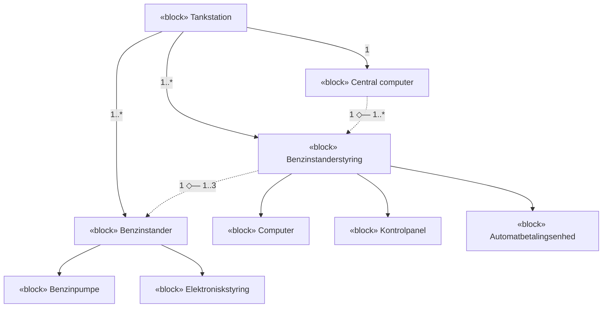
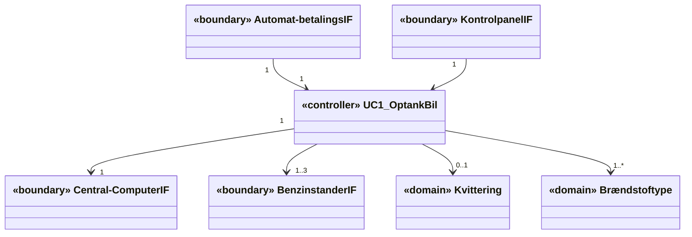
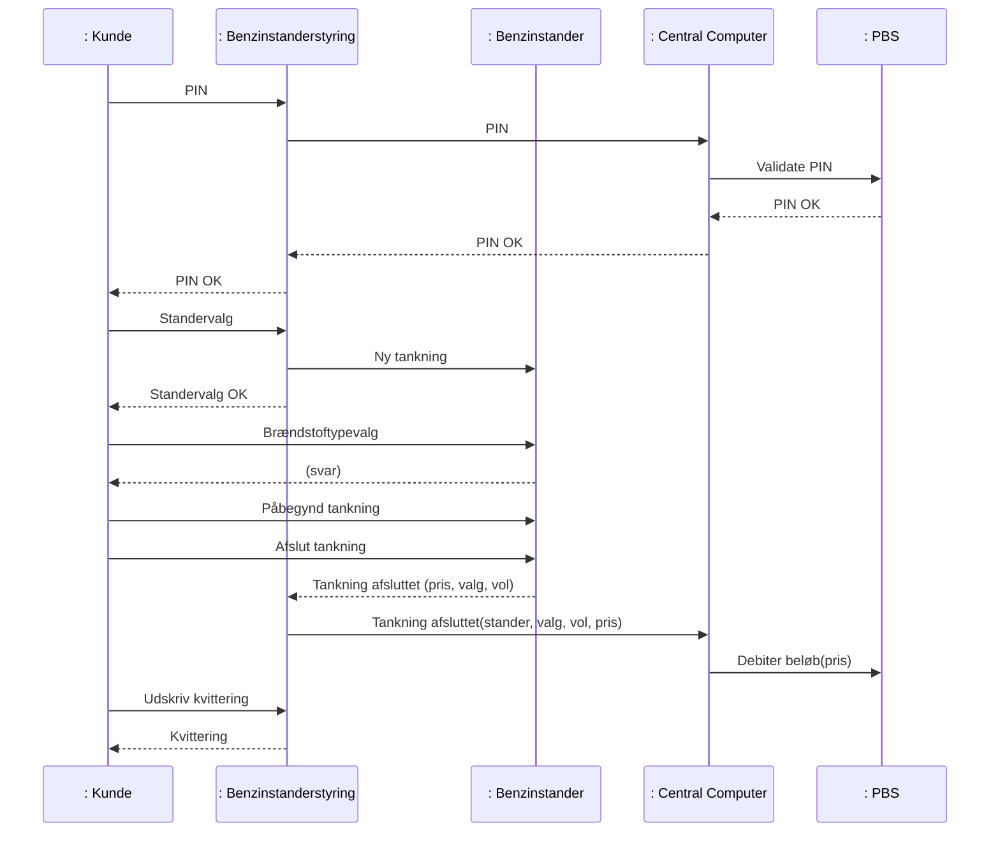
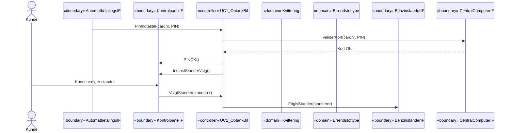

# Applikationsmodeller — Part 3: Systemer med subsystemer

## Metadata

| Felt | Værdi |
|---|---|
| **Lektion** | L19–L20 — Applikationsmodel, sammensatte systemer |
| **Kursus** | SWISE-01 Indledende System Engineering |
| **Kilde** | `System Application Models Part3.pdf` (24 slides) |
| **Type** | slides |
| **Emner dækket** | Resumé af kommunikations- og designregler samt guidelines; applikationsmodeller for systemer med subsystemer (én AM per subsystem per UC); Step 1 version 3 og Step 2 version 3; Tankstation-eksempel: BDD, domænemodel, IBD, 1. version klassediagram for Benzinstanderstyringen (BSS), systemsekvensdiagram for UC Optank Bil, start på AM-sekvensdiagram for BSS; øvelse |

---

## Dagens emner

- Resume regler og guide lines
- Applikationsmodeller for systemer med subsystemer

> Slide 1–2

## Resumé: regler og guidelines (gentaget fra Del 2)

### Kommunikationsregler

Det er *control* klassen der tager alle logiske beslutninger – derfor gælder:
- *Boundary* klasser kalder **KUN** til *control* klassen/r!
  - (og evt. nødvendige *domain* klasser der bruges som parametre (*Data Transfer Objects* – DTO))!
- *Boundary* klasser kalder **IKKE direkte** til andre *boundary* klasser!
  - (medmindre man har en lagdelt *boundary* struktur)!
- *Domain* klasser kalder **IKKE** til *boundary* klasser!
- *Domain* klasser kalder **IKKE** noget på eget initiativ!

> Slide 3

**Principielle kommunikationsregler i arkitekturen**

| | Til Boundary | Til Domain | Til Control |
|---|---|---|---|
| **Fra Boundary** | Nej! | Nej! | Ja! |
| **Fra Domain** | Nej! | Nej! | Nej! |
| **Fra Control** | Ja! | Ja! | Ja! |

**Pragmatiske kommunikationsregler i arkitekturen**

| | Til Boundary | Til Domain | Til Control |
|---|---|---|---|
| **Fra Boundary** | (Lagdelt I->I og O->O) | (Data Transfer Object) | Ja! |
| **Fra Domain** | Nej! | (Komposition) | Nej! |
| **Fra Control** | Ja! | Ja! | Ja! |

> Slide 4

### Designregler (illustreret på ATM `cd UC Withdraw Cash - AM` + `sd UC Withdraw Cash – Main Scenario- SAM`)

- Slide 5: *Alle klasser på sekvensdiagrammet skal også være på klassediagrammet!*
- Slide 6: *Alle metoder skal tilknyttes den klasse på klassediagramet, der står for enden af pilen på sekvensdiagrammet*
- Slide 7: *Alle associationer skal pege samme vej på klassediagrammet, som de gør på sekvensdiagrammet*

Diagrammerne er identiske med Del 2 slide 22–24 (se `system-application-models-2.md` for det fulde klassediagram med CustomerUI, WithdrawCash, Bank, CreditCard, Cash).

> Slide 5–7

- **Alle klasser** på **sekvensdiagrammet**, skal også være **på klassediagrammet** (men ikke nødvendigvis omvendt)
- **Alle metoder** skal tilknyttes **den klasse på klassediagramet**, der står for **enden af pilen på sekvensdiagrammet**
  - Det er et **metodekald** fra den ene klasse til den anden
- **Alle associationer** skal **pege samme vej** på **klassediagrammet**, som de gør på **sekvensdiagrammet**
  - For at den **ene klasse kan kalde den anden**, skal den have **en association til den**
- **Associationer kan være tovejs**, hvis begge klasser kalder den anden i løbet af UC

> Slide 8

### Guidelines "control"

- *Control* klassen er **IKKE** det samme som **hardware controlleren** eller **µ-controlleren** eller **"control unit" på BDD/IBD**!
- *Control* klassen er en del af **softwaren** som kører **på CPUen** i disse hardware controllers!
- *Control* klassen har navn efter den UC, den udfører!

> Slide 9

### Guideline Actor

- Man må gerne bruge en UC **Actor** (tændstiksmand) på Applikationsmodellens sekvensdiagram – **MEN:**
  - Den faktiske **Actor** og *boundary* **klassen/r** for aktøren og den *domain* **klasse** som bruges til at gemme attributter for aktøren – er 3 forskellige ting!
  - En faktisk **Actor har IKKE metoder** og **kan IKKE kalde metoder** – det kan kun *boundary* **klassen/r for** aktøren!
    - Ikke alle tegneværktøjer kan tegne messages uden () på sekvensdiagrammer :-(

Eksempel (identisk med Del 2 slide 27): «boundary» BrugerInterface ↔ «control» UC (`+ pressedSave(Name : string, Passw: string) : void`) → «domain» Bruger (`- Name : string`, `- Password : string`, `+ setPassword(string) : bool`, `+ setName(string) : bool`). SD: Bruger —"Bruger trykker Save"→ :BrugerInterface —`pressedSave(name, passw)`→ :UC —`setName(name)`→ :Bruger (retur `true`), —`setPassword(passw)`→ :Bruger (retur `true`). "Disse er 3 forskellige ting!"

> Slide 10–11

## Løsning Smartfridge

*(slide 12: kun punktet "Løsning Smartfridge" – gennemgang af løsningsforslaget mundtligt; se løsningsfilen `SAM_SmartFridge_Opgave_Lsning.pdf`.)*

> Slide 12

## Virkeligheden og systemet – med subsystemer!

*Figur: Samme sky/domæne-figur som Part 1 slide 7 (Virkeligheden! → Domænet! → Et nyt system med MEK/HW/SW, En bruger, Et andet system). Forskellen: SW-delen er nu delt i to grupper af klasser med påskrifterne "Her SW til et subsystem" og "Her SW til et andet subsystem!" – dvs. hvert subsystem har sin egen software og dermed sine egne klasser.*

> Slide 13

## Applikationsmodellen – Step 1, Version 3!

- Applikationsmodellen opbygges skridt for skridt, hvor hvert skridt styres af én UC
- **Én for hvert subsystem!**

| Step | Handling |
|---|---|
| **Step 1.1** | Vælg den næste fully-dressed UC til at designe for |
| **Step 1.2a** | Identificer alle involverede **aktører og subsystemer** i UC **for dette subsystem** → **Boundary** klasser |
| **Step 1.2b** | Hvis man har et IBD som definerer de faktiske hardware interfaces, **også mellem subsystemerne**: opsplit *Boundary* klasserne i relevante *hardware interface Boundary* klasser! |
| **Step 1.3** | Identificer **relevante klasser i Domænemodellen** som er involveret i UC → **Domain** klasser |
| **Step 1.4** | Tilføj én UC *control* → **Control** klasse |

(Ændringer i forhold til version 2 markeret med fed/rødt på sliden: "og subsystemer", "for dette subsystem", "også mellem subsystemerne".)

> Slide 14

## Applikationsmodellen – Step 2, Version 3

- Samarbejdet mellem klasserne udledes nu fra UC **og fra System sekvensdiagrammer for UC**
- **For hvert subsystem!**

| Step | Handling |
|---|---|
| **Step 2.1** | Gennemgå UC's hovedscenarie skridt-for-skridt **og/eller System sekvensdiagrammet for UC** og udtænk hvordan klasserne kan samarbejde for at udføre skridtet! **Man skal kun se på de skridt/messages, der involverer det pågældende subsystem!** |
| **Step 2.2** | Opdater sekvens- og klassediagrammet for at beskrive samarbejdet (metoder, associationer, attributter) |
| **Step 2.3** | Hold øje med, om der er state-baserede aktiviteter og opdater STMs for disse klasser (tilstande, triggere, overgange, aktioner). *(Step 2.3 springes over hvis der ikke er nogen tilstandsbaserede klasser)* |
| **Step 2.4** | Verificer at diagrammerne passer med UC (postconditions, test) |
| **Step 2.5** | Gentag 2.1 – 2.4 for alle UC extentions. Finpuds modellen. |

- Alle 3 diagrammer (cd, SEQ, STM) opdateres *parallelt/samtidigt* **for et subsystem af gangen** under dette arbejde

> Slide 15

## Applikationsmodeller for samarbejdende subsystemer

*Figur: Matrix med rækker UC1, UC2, UC3, …, UCn og kolonner Subsystem 1, Subsystem 2, Subsystem 3. Til venstre én fælles domænemodel (DM). I hver celle, hvor UC'en involverer subsystemet, ligger et sæt "System Application Model" (cd + SD + STM). Tovejspile forbinder AM'erne for samme UC på tværs af subsystemer:*

| UC | Subsystem 1 | Subsystem 2 | Subsystem 3 |
|---|---|---|---|
| UC1 | SAM ↔ | SAM ↔ | SAM |
| UC2 | SAM ↔ | (ikke involveret) | SAM |
| UC3 | SAM ↔ | SAM | (ikke involveret) |
| UCn | SAM ↔ | SAM ↔ | SAM |

Pointen: én AM per (UC, subsystem)-kombination; subsystemernes AM'er for samme UC "taler sammen" via deres boundary-klasser mod hinanden; alle deler samme domænemodel.

*(DM-miniaturen på sliden er en `bdd [Package] Domain Model` for et andet eksempel: Kunde, PBS, VarerDatabase, Dankortterminal, Systemet, Printer, Vare 0..*–1 VarerListe, Vare 1–1 Stregkode, Scanner; med associationsnavne "betaling valideres hos", "finder varer og pris i", "printer bon på", "modtager betaling fra", "foretager betaling på", "scanner en eller flere", "tilføjer vare til", "modtager barkode fra", "har en", "læser". Den er kun illustration.)*

> Slide 16

## System med subsystemer – `bdd [Package] Arkitektur [Tankstation]`

| Blok | Består af (komposition, udfyldt diamant) | Multiplicitet |
|---|---|---|
| «block» Tankstation | «block» Benzinstander | 1..* |
| | «block» Benzinstanderstyring | 1..* |
| | «block» Central computer | 1 |
| «block» Benzinstander | «block» Benzinpumpe, «block» Elektroniskstyring | – |
| «block» Benzinstanderstyring | «block» Computer, «block» Kontrolpanel, «block» Automatbetalingsenhed | – |

Aggregationer (hollow diamant) mellem subsystemerne:
- Benzinstanderstyring (1) ◇— Benzinstander (1..3): én styring betjener 1–3 standere
- Central computer (1) ◇— Benzinstanderstyring (1..*): én central computer betjener flere styringer

(Fuldt optrukne pile = komposition; stiplede = aggregation.)

> Slide 17

## Domænemodellen for hele systemet – `class Domænemodel`

| Klasse | Attributter |
|---|---|
| Automat-betalingsenhed | – |
| Kontrolpanel | – |
| Benzinstander-styring | – |
| Kvittering | – |
| Benzinstander | - volume: float, - pris: float |
| Brændsstoftype | - type: int, - pris/liter: float |

Aktører: **Kunde**, **PBS System**.

| Fra | Association (læseretning) | Til | Multiplicitet |
|---|---|---|---|
| Automat-betalingsenhed | Validerer PIN-kode, Debiterer for tankning > | PBS System | – |
| Kunde | Indsætter betalingskort, Indtaster PIN-kode > | Automat-betalingsenhed | – |
| Benzinstander-styring | < har en | Automat-betalingsenhed | 1 – 1 |
| Kunde | Vælger benzinstander, Anmoder om kvittering > | Kontrolpanel | – |
| Benzinstander-styring | < har et | Kontrolpanel | 1 – 1 |
| Benzinstander-styring | Printer > | Kvittering | 1 – 1 |
| Benzinstander-styring | nulstiller litertæller og pris > | Benzinstander | 1 – 1-3 |
| Kunde | Vælger brændstoftype, Løfter tankpistol, Sætter tankpistol tilbage > | Benzinstander | – |
| Benzinstander | tanker > | Brændsstoftype | 1 – 1..* |

> Slide 18

## IBD for systemet – `ibd Tankstation [Detaljer]`

*Figur: IBD med tre parts i `: Tankstation`. To grønne callouts: "HW interfaces for BS" peger på portene på `: Elektronisk Styring` (brændstofType, pumpeTændt, pistolPåPlads, ctrl); "HW interfaces for BSS" peger på portene på `: Computer` (kp, bsCtrl, ctrl, abeIn).*

**`: Benzinstander`** (eksterne ports: `brændstofType: BT`, `pistolPåPlads: bool`, `ctrl:BS_Ctrl`)

| Part | Ports |
|---|---|
| : Benzinpumpe | tændt : bool |
| : Elektronisk Styring | brændstofType: BT, pumpeTændt: bool, pistolPåPlads: bool, ctrl:BS_Ctrl |

Connectors: Benzinpumpe.tændt ↔ Elektronisk Styring.pumpeTændt; Benzinstander.brændstofType ↔ Elektronisk Styring.brændstofType; Benzinstander.pistolPåPlads ↔ Elektronisk Styring.pistolPåPlads; Elektronisk Styring.ctrl ↔ Benzinstander.ctrl.

**`: Benzinstanderstyring`** (eksterne ports: `touchScreen: Touch_Ctrl`, `bsCtrl:BS_Ctrl`, `keypad: KeyPadData`, `cardSlot: card_Ctrl`, `ctrl: BSS_Ctrl`)

| Part | Ports |
|---|---|
| : Kontrolpanel | touchScreen: Touch_Ctrl, out: KP |
| : Computer | kp: KP, bsCtrl:BS_Ctrl, ctrl: BSS_Ctrl, abeIn: ABE |
| : Automatbe-talingsenhed | out: ABE, keypad: KeyPadData, cardSlot: card_Ctrl |

Connectors: Kontrolpanel.out ↔ Computer.kp (KP); Automatbetalingsenhed.out ↔ Computer.abeIn (ABE); Computer.bsCtrl ↔ Benzinstanderstyring.bsCtrl ↔ Benzinstander.ctrl (BS_Ctrl); Computer.ctrl ↔ Benzinstanderstyring.ctrl ↔ Central Computer.standerCtrl (BSS_Ctrl); Benzinstanderstyring.touchScreen/keypad/cardSlot går videre til Tankstationens eksterne ports (mod Kunde).

**`: Central Computer`**: ports `standerCtrl : BSS_Ctrl`, `pbs : PBS_Comms`. Tankstationens eksterne port `pbsComms: PBS_Comms` (mod PBS).

Konsekvens for Step 1.2b: boundary-klasserne for BSS svarer til Computerens fire HW-interfaces: `kp: KP` → KontrolpanelIF, `abeIn: ABE` → AutomatbetalingsIF, `bsCtrl: BS_Ctrl` → BenzinstanderIF, `ctrl: BSS_Ctrl` → CentralComputerIF.

> Slide 19

## 1. Version af klassediagram for Benzinstanderstyringen (BSS) – `class Applicationsmodel`

Aflæsning af pile på sliden: AutomatbetalingsIF → UC1_OptankBil og KontrolpanelIF → UC1_OptankBil (boundary kalder control); UC1_OptankBil → CentralComputerIF (1–1), UC1_OptankBil → BenzinstanderIF (1–1..3), UC1_OptankBil → Kvittering (0..1), UC1_OptankBil → Brændstoftype (1..*). Ingen metoder endnu.

> Slide 20

## System SD for UC Optank Bil – `sd Foretag tankning`

Livliner: `: Kunde`, og inde i `: Tankstation`: `: Benzinstander-styring`, `: Benzinstander`, `: Central Computer`; udenfor: `: PBS`.

(Svaret fra Benzinstander til Kunde efter *Brændstoftypevalg* er tegnet som en stiplet returpil uden label.)

> Slide 21

## Start på Applikationsmodellens SD for BSS for UC Optank Bil – `sd BSS::UC1_OptankBil`

Livliner: aktør (Kunde), «boundary» Automat-betalingsIF, «boundary» Kontrol-panelIF, «controller» UC1_OptankBil, «domain» Kvittering, «domain» Brændstoftype (multiobjekt), «boundary» BenzinstanderIF (multiobjekt), «boundary» Central-ComputerIF.

Bemærk: `ValiderKort(cardnr, PIN)` er tegnet asynkront (udfyldt pilespids, ingen aktivering hos CentralComputerIF) med `Kort OK` som stiplet retur; "Kunde vælger stander" er en aktør-message uden parentes (jf. Guideline Actor). Kvittering og Brændstoftype er endnu ikke brugt.

> Slide 22

## System SD for UC Optank Bil – hvad er relevant for BSS?

*Figur: Samme `sd Foretag tankning` som slide 21, men med to blå rammer om Benzinstanderstyringens aktiveringer: (1) PIN → PIN OK → Standervalg → Ny tankning → Standervalg OK, og (2) Tankning afsluttet (pris, valg, vol) → Tankning afsluttet(stander, valg, vol, pris) → Udskriv kvittering → Kvittering. Callout:*

> **Kun de messages, der går til og fra BSS er interessante for SAM for BSS!**

Dvs. Brændstoftypevalg / Påbegynd tankning / Afslut tankning (Kunde ↔ Benzinstander) og Validate PIN / Debiter beløb (Central Computer ↔ PBS) hører til andre subsystemers AM.

> Slide 23

## Your turn: System Application Model for Benzinstanderstyring – UC Optank Bil

- Færdiggør **Applikationsmodellen** for **subsystemet Benzinstanderstyringen** for "UC Optank Bil"
- Brug som input
  - BDD og IBD
  - System sekvensdiagrammet
  - Domænemodellen
  - Den 1. version af klassediagrammet (se ovenfor)

1. Check at steps 1.1–1.4 er gennemført korrekt for den 1. version af klassediagrammet
2. Gennemfør steps 2.1–2.5 ved at fortsætte med at arbejde med 1. version af klassediagrammet og lav det tilhørende sekvensdiagram
3. Tænk og check om der mangler domæneklasser, hardware interface klasser, etc, eller om der nogen, der er overflødige **for dette subsystem**!

> Slide 24
