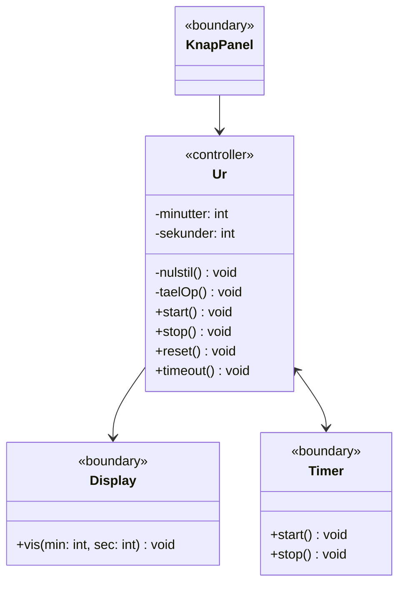
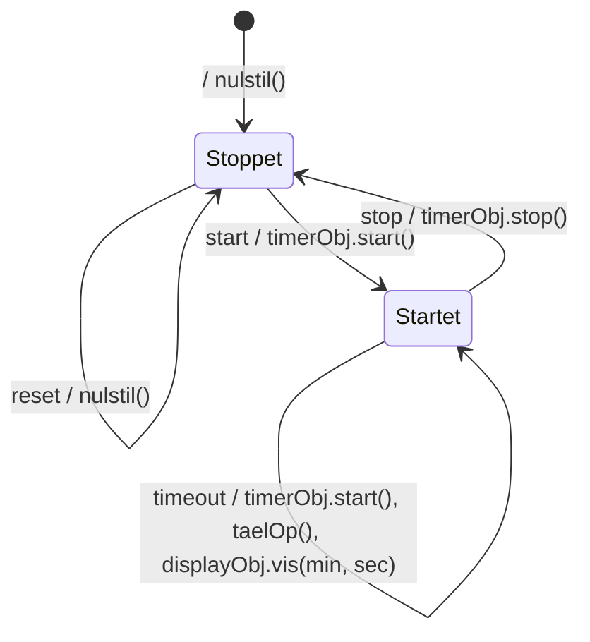
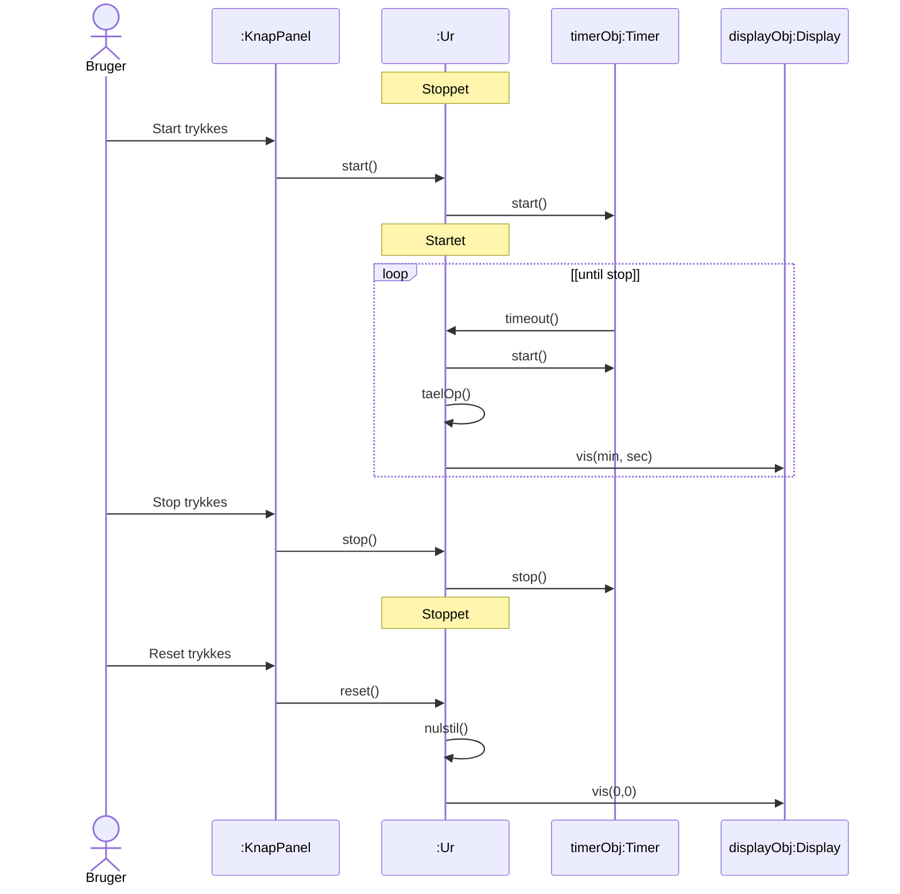

# Applikationsmodel for Minutur

## Metadata

| Felt | Værdi |
|---|---|
| **Lektion** | L22 — Application Models og Implementation |
| **Kursus** | SWISE-01 Indledende System Engineering |
| **Kilde** | `ApplicationModel.pdf` (3 sider) |
| **Type** | eksempel (applikationsmodel) |
| **Emner dækket** | Applikationsmodel for minuturet fra UML-Light-Ur: klassediagram med boundary/controller-stereotyper, tilstandsdiagram for Ur, sekvensdiagram med aktør |

Dette er "den omhyggeligt udarbejdede applikationsmodel" som L22 tager udgangspunkt i. Den er en omskrivning af UML-Light-eksemplet (se `uml-light-ur.md`) til kursets applikationsmodel-notation: klasserne har stereotyperne «boundary» og «controller», der er endnu intet Hovedprogram, og der er ingen polling-operationer (`checkForTast`, `laesTast`, `checkForTimeout`) — hændelserne antages at komme "af sig selv" fra boundary-klasserne.

---

## Klassediagram (side 1)

| Klasse | Stereotype | Attributter | Operationer |
|---|---|---|---|
| KnapPanel | «boundary» | — | — (ingen operationer endnu; sender start/stop/reset til Ur) |
| Ur | «controller» | `- minutter : int`, `- sekunder : int` | `- nulstil() : void`, `- taelOp() : void`, `+ start() : void`, `+ stop(): void`, `+ reset : void`, `+ timeout() : void` |
| Display | «boundary» | — | `+ vis(min: int, sec: int) : void` |
| Timer | «boundary» | — | `+ start() : void`, `+ stop() : void` |

Associationer (rettede, ingen multipliciteter angivet):
- KnapPanel → Ur (KnapPanel kender Ur, så den kan sende hændelser).
- Ur → Display (Ur kalder `vis`).
- Ur ↔ Timer (tovejs: Ur kalder `start`/`stop`; Timer sender `timeout` tilbage til Ur).

Bemærk forskellen til UML-Light-klassediagrammet: `Timer.start()` har ikke længere parameteren `tid`, `checkForTimeout()` er væk, og KnapPanel har hverken `checkForTast()` eller `laesTast()`. Hovedprogram findes ikke.

> Side 1

## Tilstandsdiagram for Ur (side 2)

| Fra | Hændelse | Action | Til |
|---|---|---|---|
| (initial) | — | `nulstil()` | Stoppet |
| Stoppet | reset | `nulstil()` | Stoppet |
| Stoppet | start | `timerObj.start()` | Startet |
| Startet | stop | `timerObj.stop()` | Stoppet |
| Startet | timeout | `timerObj.start()`, `taelOp()`, `displayObj.vis(min, sec)` | Startet |

Identisk med UML-Light Figur 23, bortset fra at `timerObj.start()` kaldes uden argumentet 1000.

> Side 2

## Sekvensdiagram (side 3)

Livslinjer fra venstre: aktør (bruger), `:KnapPanel`, `:Ur`, `timerObj:Timer`, `displayObj:Display`. Ur's aktuelle tilstand er vist som tilstandsnoter (Stoppet / Startet) på Ur's livslinje.

Væsentligt: `timeout()` sendes fra `timerObj:Timer` *til* `:Ur` — Timer er aktiv og leverer hændelsen selv. Der er intet Hovedprogram, der poller. Det er præcis dette, der skal "omformes" for at få en implementation, der kan køre på en polling-baseret Arduino (se `implementation-minutur-arduino.md`), mens GUI-versionen med `DispatcherTimer` kan implementere det direkte (se `implementation-minutur-gui-wpf.md`).

> Side 3
