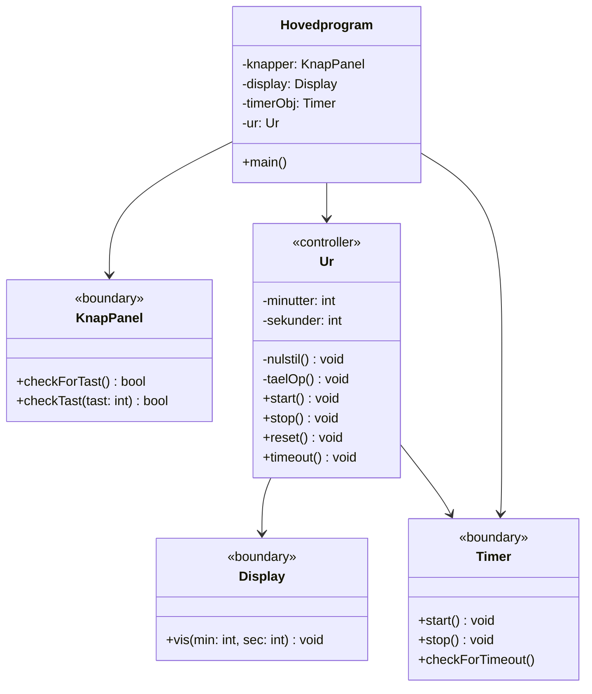
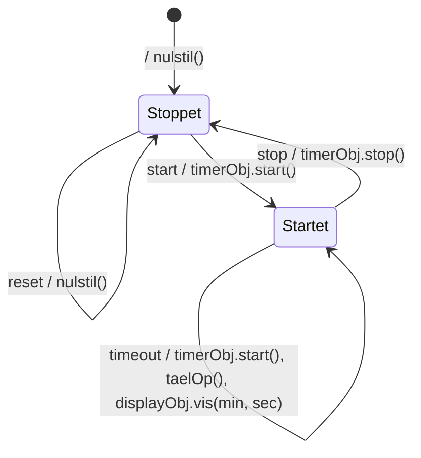
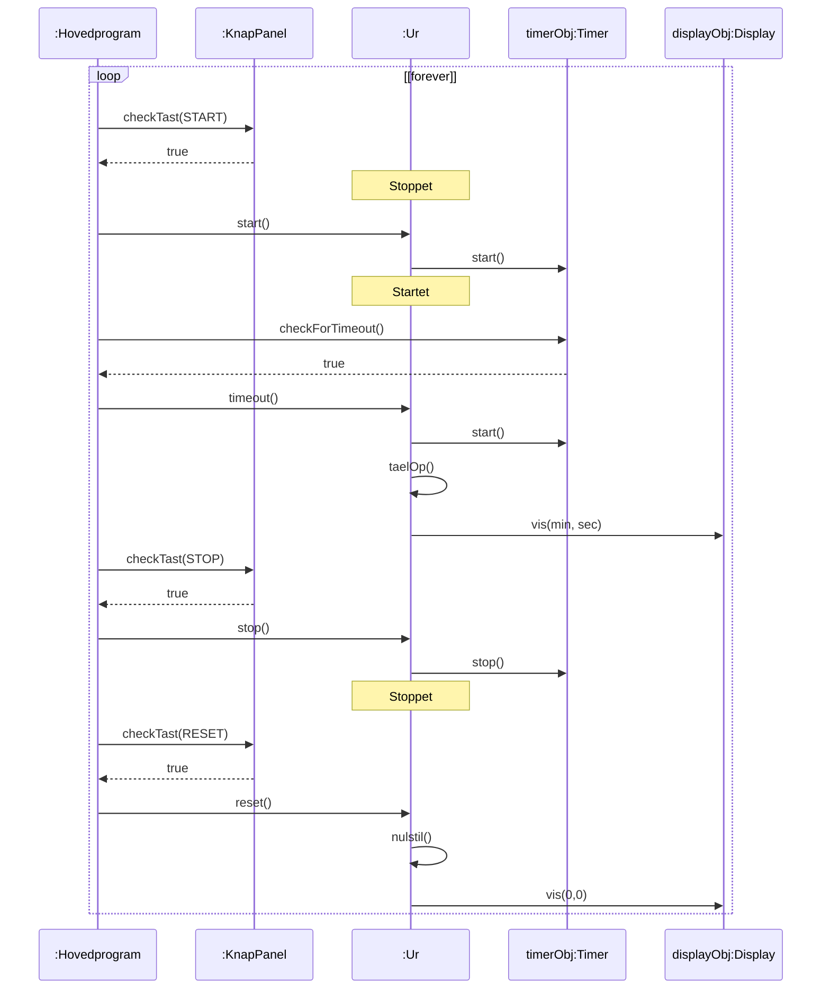
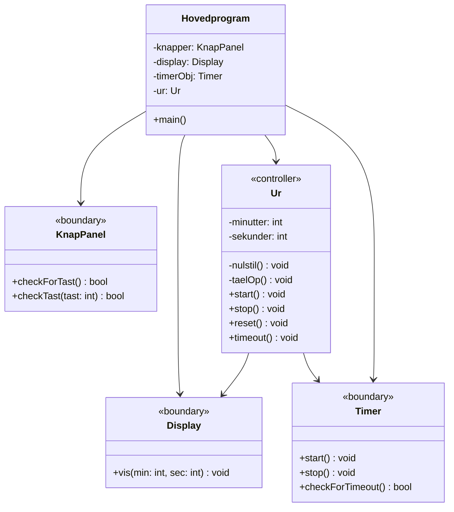
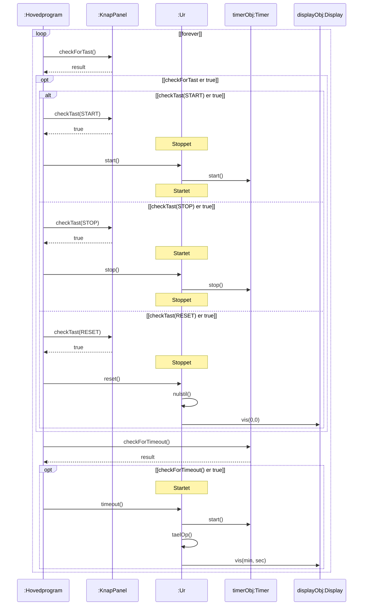

# Fra applikationsmodel til implementation: Minutur på Arduino (polling)

## Metadata

| Felt | Værdi |
|---|---|
| **Lektion** | L22 — Application Models og Implementation |
| **Kursus** | SWISE-01 Indledende System Engineering |
| **Kilde** | `ImplementationIntermediate.pdf` (3 sider) + `ImplementationFinal.pdf` (3 sider) — L22 Løsningsforslag |
| **Type** | løsningsforslag |
| **Emner dækket** | Omformning af applikationsmodellen mod en polling-baseret implementation: Hovedprogram tilføjes, boundary-klasserne får polling-operationer (`checkForTast`, `checkTast`, `checkForTimeout`), associationer vendes, sekvensdiagram med loop/opt/alt-fragmenter |

Udgangspunktet er applikationsmodellen i `applikationsmodel-minutur.md`. Problemet: i applikationsmodellen er KnapPanel og Timer *aktive* — de sender selv `start()`/`stop()`/`reset()` og `timeout()` til Ur. På en Arduino uden interrupts er der kun én tråd, `main()`, som må *polle* hardwaren. Modellen omformes derfor i to trin. Ændringer i forhold til forrige trin er tegnet med **rødt** i originalen; her markeret med *(ny)* / *(fjernet)*.

---

## Trin 1: Intermediate (`ImplementationIntermediate.pdf`)

### Klassediagram (side 1)

| Klasse | Stereotype | Attributter | Operationer | Ændring |
|---|---|---|---|---|
| KnapPanel | «boundary» | — | `+ checkForTast() : bool` *(ny)*, `+ checkTest(tast : int) : bool` *(ny)* | polling-operationer tilføjet (originalen staver `checkTest` i klassediagrammet, men `checkTast` i sekvensdiagrammet og koden) |
| Ur | «controller» | `- minutter : int`, `- sekunder : int` | `- nulstil() : void`, `- taelOp() : void`, `+ start() : void`, `+ stop(): void`, `+ reset : void`, `+ timeout() : void` | uændret |
| Display | «boundary» | — | `+ vis(min: int, sec: int) : void` | uændret |
| Timer | «boundary» | — | `+ start() : void`, `+ stop() : void`, `+ checkForTimeout()` *(ny)* | polling-operation tilføjet |
| Hovedprogram | (ingen) | `- knapper : KnapPanel` *(ny)*, `- display : Display` *(ny)*, `- timerObj: Timer` *(ny)*, `- ur : Ur` *(ny)* | `+ main()` *(ny)* | hele klassen er ny — ejer de fire objekter |

Associationer:

| Association | Status |
|---|---|
| KnapPanel → Ur | *(fjernet — stort rødt kryds)*. KnapPanel skal ikke længere kende Ur. |
| Ur ↔ Timer | Pilen Timer → Ur *(fjernet — rødt kryds på pilehovedet ved Ur)*. Tilbage er kun Ur → Timer. Timer kan ikke længere selv sende `timeout`. |
| Ur → Display | uændret |
| Hovedprogram → KnapPanel | *(ny)* |
| Hovedprogram → Ur | *(ny)* |
| Hovedprogram → Timer | *(ny)* |

(Mermaid viser resultatet *efter* de fjernede associationer er taget ud.)

> Side 1

### Tilstandsdiagram (side 2)

Uændret i forhold til applikationsmodellen:

> Side 2

### Sekvensdiagram (side 3)

Livslinjer: `:Hovedprogram`, `:KnapPanel`, `:Ur`, `timerObj:Timer`, `displayObj:Display`. Hele forløbet er pakket i `loop [forever]`. Hovedprogram poller nu KnapPanel og Timer og videresender hændelserne til Ur.

I originalen står der stadig et indre `loop [until stop]`-fragment omkring timeout-delen (arvet fra applikationsmodellen), men det er streget over med rødt: med et polling-baseret `loop [forever]` udenom giver et indre "until stop"-loop ikke mening — hvert gennemløb af hovedløkken tjekker bare én gang for timeout. Diagrammet er stadig et "happy path"-scenarie: det viser ikke, hvad der sker når `checkTast()` returnerer false. Det retter Final-versionen.

> Side 3

---

## Trin 2: Final (`ImplementationFinal.pdf`)

### Klassediagram (side 1)

Samme klasser som Intermediate med to præciseringer: `Timer.checkForTimeout()` har nu returtype `: bool`, og Hovedprogram har fået association til Display (så `main()` kan oprette display-objektet og give Ur en pointer til det).

| Klasse | Stereotype | Attributter | Operationer |
|---|---|---|---|
| Display | «boundary» | — | `+ vis(min: int, sec: int) : void` |
| KnapPanel | «boundary» | — | `+ checkForTast() : bool`, `+ checkTest(tast : int) : bool` |
| Ur | «controller» | `- minutter : int`, `- sekunder : int` | `- nulstil() : void`, `- taelOp() : void`, `+ start() : void`, `+ stop(): void`, `+ reset : void`, `+ timeout() : void` |
| Hovedprogram | — | `- knapper : KnapPanel`, `- display : Display`, `- timerObj: Timer`, `- ur : Ur` | `+ main()` |
| Timer | «boundary» | — | `+ start() : void`, `+ stop() : void`, `+ checkForTimeout() : bool` |

Associationer (alle envejs): Hovedprogram → KnapPanel, Hovedprogram → Display, Hovedprogram → Ur, Hovedprogram → Timer, Ur → Display, Ur → Timer.

Dette klassediagram svarer 1:1 til C++-koden i `kode-minutur-cpp.md` (`main.cpp` = Hovedprogram, som opretter `display`, `timerObj`, `knapper` og `ur(&timerObj, &display)`).

> Side 1

### Tilstandsdiagram (side 2)

Uændret (se Trin 1).

> Side 2

### Sekvensdiagram (side 3)

Nu et komplet polling-scenarie med UML-fragmenter `loop`, `opt` og `alt`. Livslinjer: `:Hovedprogram`, `:KnapPanel`, `:Ur`, `timerObj:Timer`, `displayObj:Display`.

Struktur:
1. `loop [forever]` — hovedløkken i `main()`.
2. `checkForTast()` → `result`. `opt [checkForTast er true]` omslutter en `alt` med tre grene: `checkTast(START)`, `checkTast(STOP)`, `checkTast(RESET)`, hver med det tilhørende kald til Ur og Ur's tilstandsskift (vist som tilstandsnoter på Ur's livslinje).
3. `checkForTimeout()` → `result`. `opt [checkForTimeout() er true]`: `timeout()` til Ur, som genstarter timeren, tæller op og opdaterer displayet.

Dette sekvensdiagram er en direkte tegning af `while(1)`-løkken i `main.cpp` / `main.c`. Ur's tilstandsmaskine håndterer selv, at fx `start()` i tilstanden Startet ignoreres — det er ikke Hovedprogrammets ansvar.

> Side 3

---

## Opsummering: hvad omformningen gør

| Applikationsmodel | Implementation (polling) |
|---|---|
| KnapPanel sender `start()/stop()/reset()` til Ur | Hovedprogram poller `checkForTast()` + `checkTast(x)` og kalder Ur |
| Timer sender `timeout()` til Ur | Hovedprogram poller `checkForTimeout()` og kalder `ur.timeout()` |
| Ingen Hovedprogram | Hovedprogram ejer alle fire objekter og kører `loop [forever]` |
| Ur ↔ Timer tovejs | Ur → Timer envejs |
| Ur's controller-logik og tilstandsmaskine | **uændret** — det er hele pointen: boundary-laget absorberer forskellen |

Alternativet med interrupts (`kode-minutur-cpp-interrupt.md`) beholder Timer → Ur-retningen fra applikationsmodellen: ISR'en kalder `globalUrObj.timeout()` direkte, og kun knapperne polles.
