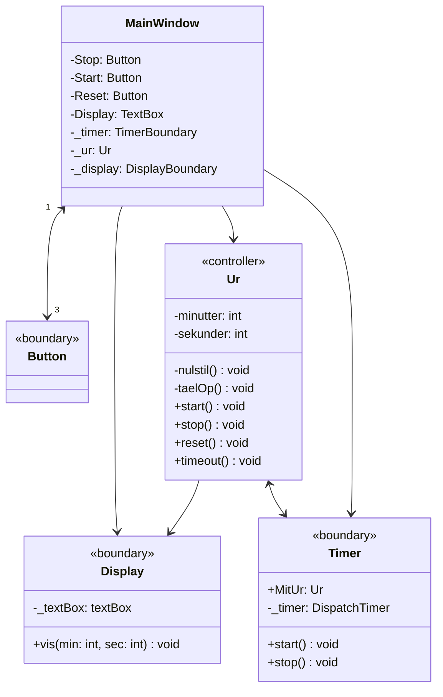
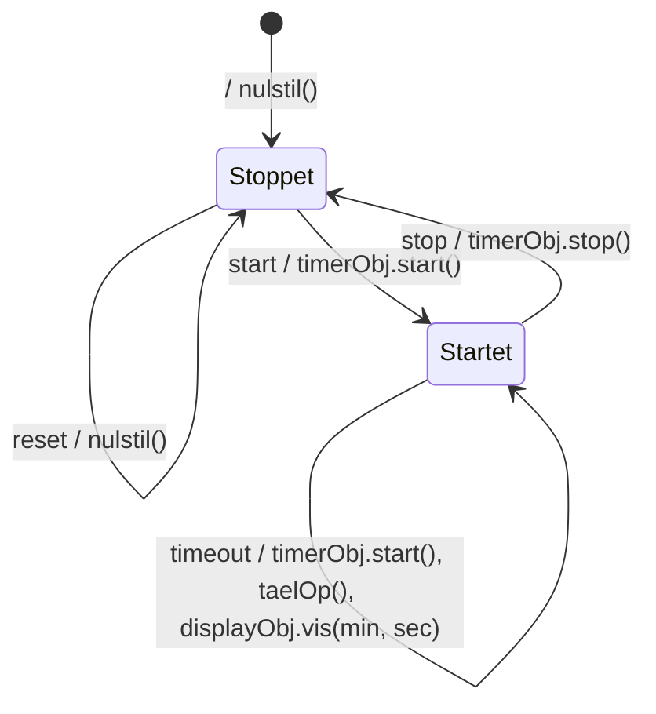
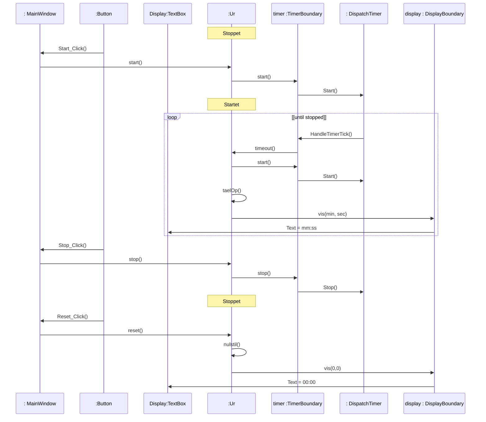

# Fra applikationsmodel til implementation: Minutur som GUI (WPF)

## Metadata

| Felt | Værdi |
|---|---|
| **Lektion** | L23 — Application Model og Implementation II |
| **Kursus** | SWISE-01 Indledende System Engineering |
| **Kilde** | `ImplementationFinalGUI.pdf` (4 sider) — L23 Løsningsforslag |
| **Type** | løsningsforslag |
| **Emner dækket** | Samme applikationsmodel implementeret som PC-applikation i C#/WPF: MainWindow som "hovedprogram", WPF-kontroller (`Button`, `TextBox`, `DispatcherTimer`) wrappet i boundary-klasser, event-drevet (ingen polling), sekvensdiagram med `Start_Click`, `HandleTimerTick`, `Text = mm:ss` |

Samme opgave og applikationsmodel som L22 (`applikationsmodel-minutur.md`). Pointen: controller-klassen Ur og dens tilstandsmaskine er **den samme** — kun boundary-klasserne og "hovedprogrammet" skifter, fordi platformen er en event-drevet GUI i stedet for en polling-løkke på en microcontroller. Den tidligere løsning var Windows Forms; denne er WPF. Koden er i `kode-minutur-wpf.md`.

---

## Klassediagram, trin 1 (side 1)

Rød tekst i originalen = tilføjelser i forhold til applikationsmodellen.

| Klasse | Stereotype | Attributter | Operationer | Ændring |
|---|---|---|---|---|
| Display | «boundary» | `- _textBox : textBox` *(ny)* | `+ vis(min: int, sec: int) : void` | wrapper om en WPF `TextBox` |
| Button | «boundary» | — | — | ny boundary-klasse (WPF's egen `Button`); erstatter KnapPanel |
| Ur | «controller» | `- minutter : int`, `- sekunder : int` | `- nulstil() : void`, `- taelOp() : void`, `+ start() : void`, `+ stop(): void`, `+ reset : void`, `+ timeout() : void` | uændret |
| MainWindow | — | `- Stop : Button`, `- Start : Button`, `- Reset : Button`, `- Display : TextBox`, `- _timer: TimerBoundary`, `- _ur : Ur`, `- _display : DisplayBoundary` *(alle nye)* | (ingen vist) | GUI-vinduet spiller Hovedprogrammets rolle: ejer kontroller og objekter |
| Timer | «boundary» | `+ MitUr : Ur` *(ny)*, `- _timer : DispatchTimer` *(ny)* | `+ start() : void`, `+ stop() : void` | wrapper om `DispatcherTimer`; kender Ur, så den kan levere `timeout` |

Associationer:

| Association | Retning | Bemærkning |
|---|---|---|
| MainWindow — Button | tovejs, multiplicitet **3** ved Button | tre knapper; Button kalder tilbage via Click-events |
| MainWindow → Display | envejs | MainWindow opretter DisplayBoundary med sin TextBox |
| MainWindow → Ur | envejs | MainWindow kalder `start/stop/reset` |
| MainWindow → Timer | envejs | MainWindow opretter TimerBoundary og sætter `MitUr` |
| Ur → Display | envejs | `vis(min, sec)` |
| Ur ↔ Timer | **tovejs** | Ur kalder `start/stop`; Timer kalder `timeout` via `MitUr` — præcis som i applikationsmodellen (i modsætning til Arduino-polling-versionen) |

> Side 1

## Klassediagram, trin 2 — med framework-klasser (side 2)

Samme diagram, men de to WPF-framework-klasser, som boundary-klasserne wrapper, er tegnet ind med rødt:

| Ny klasse (rød) | Associationer |
|---|---|
| `TextBox` | Display → TextBox (Display's `_textBox`); MainWindow → TextBox (MainWindow's `Display : TextBox`) |
| `DispatchTimer` | Timer ↔ DispatchTimer (tovejs: Timer starter/stopper den; den kalder tilbage med Tick) |

Det viser boundary-mønsteret eksplicit: applikationens egne boundary-klasser (Display = `DisplayBoundary`, Timer = `TimerBoundary`) står *mellem* controlleren og frameworkets klasser, så Ur aldrig kender WPF.

> Side 2

## Tilstandsdiagram for Ur (side 3)

Uændret i forhold til applikationsmodellen:

> Side 3

## Sekvensdiagram (side 4)

Livslinjer fra venstre: `: MainWindow`, `:Button` (tegnet som stak = flere instanser), `Display:TextBox`, `:Ur`, `timer :TimerBoundary`, `: DispatchTimer`, `display : DisplayBoundary`. Ur's tilstand vises som noter.

Læsning:
- Hændelserne `start`/`stop`/`reset` kommer som WPF Click-events: Button → MainWindow (`Start_Click()` osv.) → Ur. MainWindow er ren videresendelse, ligesom Hovedprogrammet i Arduino-versionen — men uden polling.
- `timeout` kommer fra `DispatchTimer` → `TimerBoundary.HandleTimerTick()` → `Ur.timeout()`. Dermed bevares applikationsmodellens retning Timer → Ur.
- `DisplayBoundary.vis()` oversætter til `TextBox.Text = "mm:ss"`.
- `loop [until stopped]` er her meningsfuldt (i modsætning til polling-versionen), fordi det er DispatchTimer, der driver gentagelsen.
- I diagrammet kalder Ur `timer.start()` igen ved hvert timeout (som i tilstandsdiagrammet). I den faktiske C#-kode (`Control/Ur.cs`) er dette kald udeladt, fordi `DispatcherTimer` er periodisk.

> Side 4

---

## Sammenligning: Arduino-polling vs. WPF-GUI

| | Arduino (L22) | WPF (L23) |
|---|---|---|
| "Hovedprogram" | `main()` med `while(1)` | `MainWindow` (event handlers) |
| Knapper | `KnapPanel` boundary, polles med `checkForTast()`/`checkTast()` | 3 × WPF `Button`, Click-events |
| Display | `Display` boundary → PORTB/LED'er | `DisplayBoundary` → `TextBox.Text` |
| Timer | `Timer` boundary → AVR Timer 1, polles med `checkForTimeout()` (eller ISR) | `TimerBoundary` → `DispatcherTimer.Tick` |
| Retning Timer → Ur | fjernet (polling) / bevaret (interrupt) | bevaret (`MitUr.TimeOut()`) |
| Ur («controller») | uændret | uændret |
