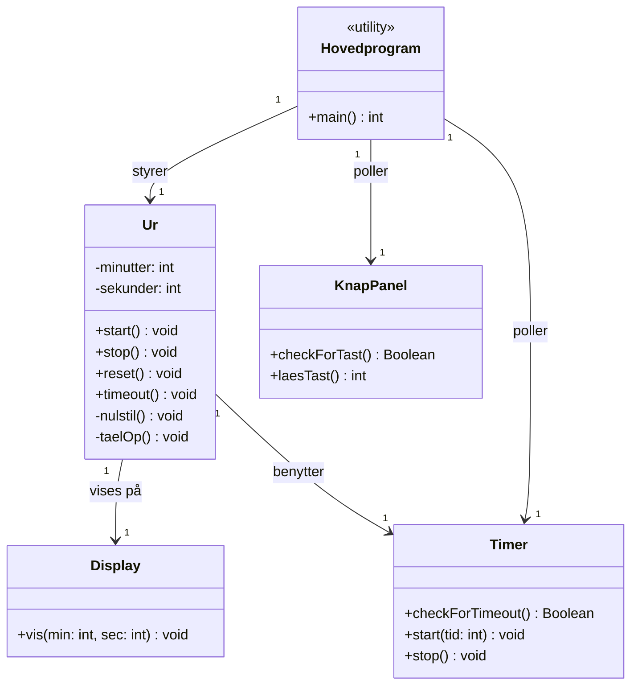
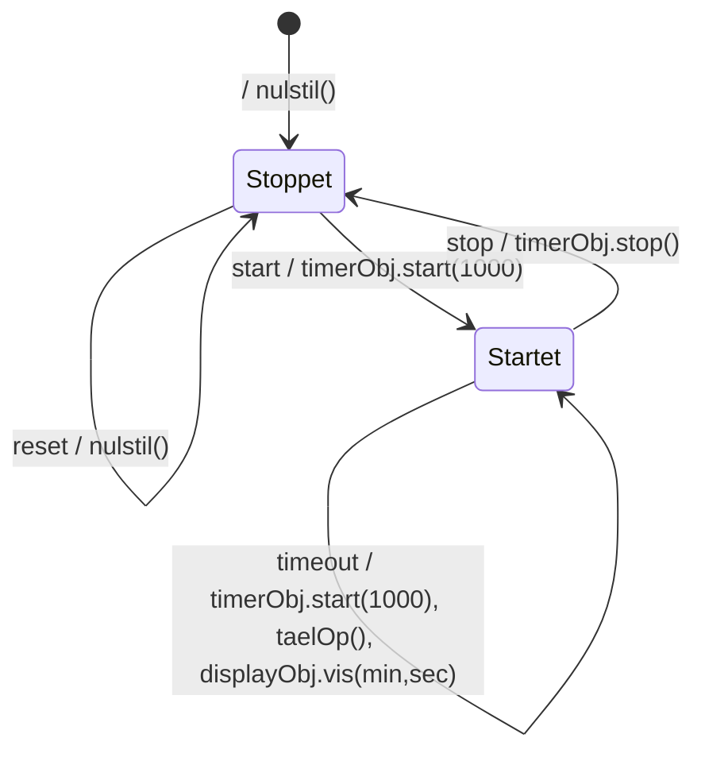
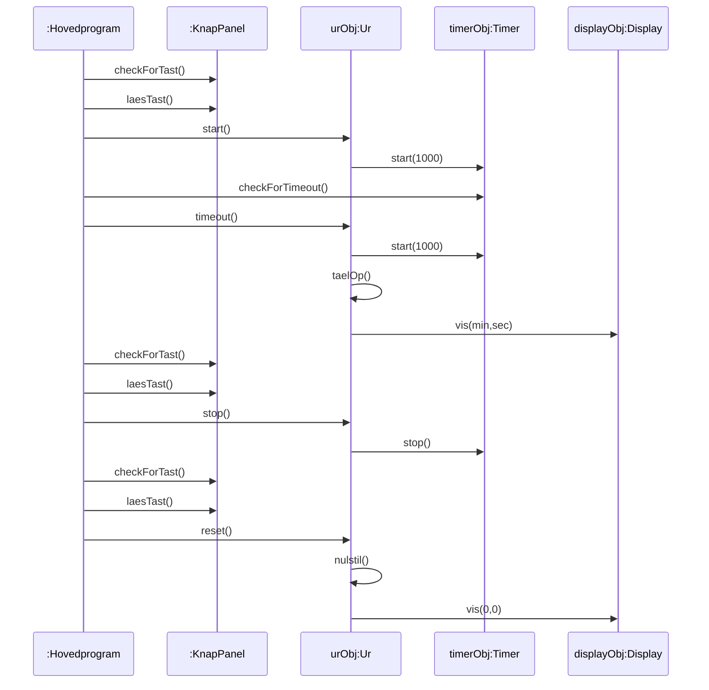

# UML-Light: Eksempel 1 — Minutur designet med UML-Light

## Metadata

| Felt | Værdi |
|---|---|
| **Lektion** | L22 — Application Models og Implementation |
| **Kursus** | SWISE-01 Indledende System Engineering |
| **Kilde** | `UML-Light-Ur.pdf` (12 sider; kapitel 5 af *UML-Light*, Ingeniørhøjskolen i Århus, ver. 18.12.2003, bogsider 24–35) |
| **Type** | eksempel |
| **Emner dækket** | Gennemgået eksempel: digitalt minutur fra beskrivelse → klassediagram med ansvar → tilstandsdiagram → sekvensdiagram → implementation i C++ og i C (ét objekt pr. klasse, flere objekter pr. klasse via struct + this-pointer) |

Sidehenvisninger nedenfor er PDF-side (bogside i parentes).

---

## 5.1 Beskrivelse af eksemplet

Dette eksempel viser en model for et simpelt minutur. Minuturet kan startes, stoppes og resettes ved hjælp af tre knapper, der er anbragt på et Knappanel. Knappanelet er forbundet til en inputport på en microcontroller. Når minuturet er startet, optæller det tiden og viser den i minutter og sekunder på et display i formatet minutter:sekunder. Displayet er forbundet til en outputport på microcontrolleren. Til at styre tiden anvendes en i microcontrolleren indbygget timerkreds, der kan tælle i millisekunder. For at simplificere eksemplet mest muligt vil hovedprogrammet (main) her *polle* (periodisk aflæse) både knappanel og timer.

*Figur 21. Skitse af brugergrænseflade for Minutur: en boks med titlen "UML-Light MinutUr", et stort display der viser "17:23", og til højre tre knapper Start, Stop og Reset.*

> Side 1 (24)

## 5.2 UML-Light model

Som det ses af klassediagrammet på Figur 22, består programmet af fire objekter, der er instantieret ud fra klasserne Ur, Timer, Display og Knappanel. Hovedprogrammet er implementeret vha. funktionen `main()`.

Det er som tidligere nævnt vigtigt at supplere et klassediagram med en beskrivelse af hver klasses ansvar.

**Klasserne på Figur 22 har følgende ansvar:**

| Klasse | Ansvar |
|---|---|
| Hovedprogram | Denne klasse af typen "utility" repræsenterer selve hovedprogrammet, der er repræsenteret ved C-funktionen `main()`. Hovedprogrammet poller hhv. KnapPanel og Timer objektet for hændelserne *start*, *stop*, *reset* og *timeout*, der sendes til Ur objektet for behandling. |
| Ur | Denne klasse har ansvaret for at implementere selve minuturfunktionaliteten. Klassen er beskrevet vha. en tilstandsmaskine, der er vist på tilstandsdiagrammet på Figur 23. |
| Timer | Denne klasse har ansvaret for at implementere SW grænsefladen til en hardwaretimer. Hardwaretimeren kan startes med et tælletal i millisekunder, hvorefter den tæller ned til 0. |
| KnapPanel | Denne klasse har ansvaret for at teste, om en knap er aktiveret og i givet fald at kunne aflæse den aktuelle knaps værdi. Klassen håndterer et KnapPanel med knapperne *Start*, *Stop* og *Reset*. |
| Display | Denne klasse har ansvaret for at vise tiden i minutter og sekunder på et display med fire cifre og et kolon (format mm:ss). |

> Side 1–2 (24–25)

### Figur 22. Klassediagram for Minutur



Alle fem associationer er rettede (navigerbare) associationer med multiplicitet 1 i begge ender. Hovedprogram har tre udgående: *styrer* → Ur, *poller* → KnapPanel, *poller* → Timer. Ur har to udgående: *vises på* → Display, *benytter* → Timer.

Operationerne på klassediagrammet er fundet ved at udarbejde de to følgende diagrammer.

Klassen Ur er designet vha. en tilstandsmaskine, der er vist på tilstandsdiagrammet på Figur 23.

> Side 2 (25)

### Figur 23. Tilstandsdiagram for Minuturet



Tilstandsdiagrammet har to tilstande *stoppet* og *startet*. I tilstanden *stoppet* har man mulighed for at nulstille minuturet vha. hændelsen "reset", der kommer, når man aktiverer *reset* tasten. Når brugeren aktiverer *start* tasten, vil der blive sendt en "start" hændelse til tilstandsmaskinen, hvorefter der skiftes tilstand samtidig med, at der sendes en "start" meddelelse til timerobjektet timerObj. Når tiden er gået (1000ms), modtages hændelsen "timeout", der bevirker at operationen `taelOp()` og operationen `vis(min,sec)` kaldes samtidig med, at der sendes en ny "start" meddelelse til timerobjektet (timerObj).

Nu mangler vi kun at beskrive samspillet mellem hovedprogrammet og de fire objekter, der instantieres ud fra klassediagrammet. Dette samspil beskrives vha. UML-Light sekvensdiagrammet på Figur 24. Der er her kun vist et enkelt forløb af hhv. et start, et timeout, et stop og et reset scenario.

I de følgende to afsnit vises implementering af minuturet i henholdsvis C++ og i C.

> Side 3 (26)

### Figur 24. Sekvensdiagram for Minutur



Hovedprogram har én lang aktiveringsbjælke (hovedløkken) gennem hele diagrammet. De fire scenarier (start, timeout, stop, reset) er vist i rækkefølge.

> Side 4 (27)

## 5.3 Minutur implementeret i C++

I dette afsnit vises, hvorledes de vigtigste af klasserne på klassediagrammet på Figur 22 kan implementeres vha. C++ kode.

Prøv at sammenligne koden med klassediagrammet og se den fine sammenhæng mellem design og kode.

Utilityklassen Hovedprogram implementeres i filen `Hovedprogram.cpp`:

```cpp
#include "Ur.h"
#include "KnapPanel.h"
#include "Timer.h"
#include "Display.h"

enum KnapHaendelse {START=1, STOP=2, RESET=3 };

int main()
{
    KnapPanel knapPanelObj; // her oprettes de fire objekter som anvendes
    Timer timerObj;
    Display displayObj;
                            // ur objektet bliver her initialiseret med
                            // og display objekt pointere til timer
    Ur urObj(&timerObj,&displayObj);

     KnapHaendelse knapHaendelse;

    while ( true )           // Uendelig hovedløkke i programmet
    {
      // polling af knappanel
      if (knapPanelObj.checkForTast() == true)
      {
          knapHaendelse= (KnapHaendelse) knapPanelObj.laesTast();
          if (knapHaendelse == START)
              urObj.start();
          else if (knapHaendelse == STOP)
              urObj.stop();
          else if (knapHaendelse == RESET)
              urObj.reset();
      }
      // polling af timer for timeout
      if (timerObj.checkForTimeout() == true)
          urObj.timeout();
    }
    return 0;
} // end main
```

I C++ anvendes `enum` til at definere en såkaldt enumeration type, der definerer en datatype, der kun kan antage et bestemt antal værdier. I eksemplet definerer `enum KnapHaendelse {START=1, STOP=2, RESET=3 }` datatypen KnapHaendelse. En variabel af typen KnapHaendelse kan kun antage værdien START, STOP eller RESET, der ved defineringen også har fået tildelt de tilhørende konstantværdier. Anvendelsen af enumeration types gør programmet lettere at læse og anvendelsen sikrer samtidig også at konstanterne ikke overlapper i værdi.

> Side 5 (28)

Klassen Ur specificeres i filen `Ur.h`:

```cpp
#include "Timer.h"
#include "Display.h"

class Ur
{
public:
      Ur(Timer*, Display*);   // constructor operation
      void start();
      void stop();
      void reset();
      void timeout();
private:
      void nulstil();   // privat da den kaldes via tilstandsmaskinen
      void taelOp();    // privat da den kaldes via tilstandsmaskinen

        int minutter;
        int sekunder;
        Display* mitDisplay;
        Timer* minTimer;
        enum TILSTAND {STARTET, STOPPET } tilstand;
        const static int TIME1000MS= 1000;
   };
```

Klassen Ur implementeres i filen `Ur.cpp`, der implementerer tilstandsmaskinen. Her er tilstandsmaskinen direkte implementeret i koden på den simplest mulige måde, der er ok for dette enkle eksempel.

```cpp
#include "Ur.h"
#include "Timer.h"
#include "Display.h"

Ur::Ur(Timer* timerPtr, Display* displayPtr)
{                        // constructor operation
    minTimer= timerPtr;
    mitDisplay= displayPtr;
    tilstand = STOPPET;
    nulstil();
}

void Ur::start()        // håndterer hændelsen: start
{
    if (tilstand == STOPPET)
    {
        tilstand= STARTET;
        minTimer->start(TIME1000MS);
    }
}

void Ur::stop()         // håndterer hændelsen: stop
{
    if (tilstand == STARTET)
    {
        tilstand= STOPPET;
        minTimer->stop();
    }
}

void Ur::reset()        // håndterer hændelsen: reset
{
    if (tilstand == STOPPET)
    {
        nulstil();
    }
}

void Ur::timeout()      // håndterer hændelsen: timeout
{
    if (tilstand == STARTET)
    {
        minTimer->start(TIME1000MS);
        taelOp();
        mitDisplay->vis(minutter,sekunder);
    }
}

void Ur::nulstil()      // privat nulstil operation
{
    minutter=0;
    sekunder=0;
    mitDisplay->vis(minutter,sekunder);
}


void Ur::taelOp()        // privat taelOp operation
{
    sekunder++;
    if (sekunder >=60)
    {
      sekunder=0;
      minutter++;
      if (minutter >=60)
          minutter=0;
    }
}
```

Klasserne KnapPanel, Timer og Display er alle grænsefladeklasser til hardwaren. For hver af disse er der på tilsvarende måde en headerfil og en implementeringsfil. Disse klasser implementeres således, at deres constructor operation initialiserer hardwaren.

> Side 6–7 (29–30)

## 5.4 Minutur implementeret i C

Her skitseres, hvorledes det objektbaserede design af minuturet kan implementeres i programmeringssproget C.

### 5.4.1 C implementering af maksimum ét objekt pr. klasse

Først vises den simpleste og mest effektive implementering, der kan anvendes i de tilfælde, hvor der kun er ét objekt af hver klasse.

De private attributter og operationer implementeres her som `static` medlemmer, der i C betyder, at de kun kendes i den fil, hvori de er defineret. I modsætning til C++ så skal man i C definere disse private attributter og operationer vha. `static` i kodefilen (.c) og ikke i headerfilen (.h).

Associationerne er her implementeret implicit ved, at en "C-klasse" kun inkluderer de headerfiler, som den har associationer til på klassediagrammet. Der anvendes således ikke pointere til de andre objekter i denne simple men effektive implementering.

Mange C-compilere understøtter kun filnavne med 8 karakterer, hvorfor det kan være nødvendigt at anvende en forkortet version af Klassenavnene fra klassediagrammet til filnavnene.

> Side 7–8 (30–31)

Utilityklassen Hovedprogram implementeres i filen `HovedPrg.c`:

```c
#include "Define.h"
#include "Ur.h"
#include "KnapP.h"
#include "Timer.h"
#include "Display.h"

int main()
{
    enum KnapHaendelse knapHaendelse;
    // initiering af de fire "objekter"
    Display_init();
    Timer_init();
    KnapPanel_init();
    Ur_init();

    while ( true )   // Uendelig hovedløkke i programmet
    {
      // polling af knappanel
      if (KnapPanel_checkForTast() == true)
      {
          knapHaendelse= KnapPanel_laesTast();
          if (knapHaendelse == START)
              Ur_start();
          else if (knapHaendelse == STOP)
              Ur_stop();
          else if (knapHaendelse == RESET)
              Ur_reset();
      }
      // polling af timer for timeout
      if (Timer_checkForTimeout() == true)
          Ur_timeout();
    }
    return 0;
} // end main
```

I filen `Define.h` kan man f.eks. definere de globale konstanter og brugerdefinerede datatyper, der anvendes i projektet, hvorfor denne fil inkluderes som den første fil i alle øvrige filer. Her kan man f.eks. vha. `enum` definere en datatype `bool`, der kan antage værdien false eller true (`enum bool {false=0, true=1};`).

> Side 8 (31)

Klassen Ur specificeres i filen `Ur.h`:

```c
// class Ur
// private:
      #define TIME1000MS 1000

// public:
      extern void Ur_init(); // Ur_init er constructor operationen
      extern void Ur_start();
      extern void Ur_stop();
      extern void Ur_reset();
      extern void Ur_timeout();
// end class Ur
```

Bemærk at alle public operationer navngives med klassenavnet efterfulgt af operationsnavnet.

Klassen Ur implementeres i filen `Ur.c`, der implementerer tilstandsmaskinen.

```c
#include "Ur.h"
// inkludering af de "objekter" hvis operationer kaldes fra Ur
#include "Timer.h"
#include "Display.h"

//****************** private (static) attributter *************

static enum TILSTAND {STARTET, STOPPET } tilstand;
static int minutter;
static int sekunder;

//****************** private (static( operationer ************

static void nulstil()   // privat nulstil operation
{
    minutter=0;
    sekunder=0;
    Display_vis(minutter,sekunder);
}


static void taelOp()                       // privat taelOp operation
{
    sekunder++;
    if (sekunder >=60)
    {
      sekunder=0;
      minutter++;
      if (minutter >=60)
          minutter=0;
    }
}

//****************** public operationer *******************

void Ur_init()          // "constructor" operation
{
    tilstand = STOPPET;
    nulstil();
}

void Ur_start()         // håndterer hændelsen: start
{
    if (tilstand == STOPPET)
    {
        tilstand= STARTET;
        Timer_start(TIME1000MS);
    }
}

void Ur_stop()          // håndterer hændelsen: stop
{
    if (tilstand == STARTET)
    {
        tilstand= STOPPET;
        Timer_stop();
    }
}


void Ur_reset()         // håndterer hændelsen: reset
{
    if (tilstand == STOPPET)
    {
        nulstil();
    }
}

void Ur_timeout() // håndterer hændelsen: timout
{
    if (tilstand == STARTET)
    {
        Timer_start(TIME1000MS);
        taelOp();
        Display_vis(minutter,sekunder);
    }
}

//********************************************************
```

> Side 9–10 (32–33)

### 5.4.2 C implementering af flere objekter pr. klasse

For nogle klasser vil man også i et C-baseret projekt have brug for, at kunne oprette flere objekter af en given klasse. Princippet for dette vises her med udgangspunkt i klassen Ur.

Objektets datatype defineres vha. en typedefinition (`typedef`) og en C `struct` — denne nye type benævnes med samme navn som den tilhørende klasse på klassediagrammet.

```c
typedef struct Ur_type
{
      int minutter;
      int sekunder;
      enum TILSTAND {STARTET, STOPPET } tilstand;
} Ur;
```

Herefter kan datatypen Ur anvendes til at skabe "objekter" ud fra som det fremgår af følgende `main()` program.

> Side 10 (33)

Hovedprogrammet `main()` i filen `Main.c`, hvor der oprettes to Ur objekter.

```c
int main()
{
    enum KnapHaendelse knapHaendelse;

     Ur mitUrNr1, mitUrNr2;                // her oprettes to Ur "objekter"

     Ur_init(&mitUrNr1);                   // her initialiseres objekterne
     Ur_init(&mitUrNr2);
     Display_init();
     Timer_init();
     KnapPanel_init();


     Ur_start(&mitUrNr1);                  // her kaldes operationen start()
     Ur_stop(&mitUrNr1);
     Ur_reset(&mitUrNr1);
     // etc.
     return 0;
}
```

Klassen Ur specificeres i filen `Ur.h`:

```c
// class Ur
// private:
      #define TIME1000MS 1000

        typedef struct Ur_type
        {
            int minutter;
            int sekunder;
            enum TILSTAND {STARTET, STOPPET } tilstand;
          } Ur;

// public:
      extern void Ur_init(Ur* const this); // Ur_init er constructoren
      extern void Ur_start(Ur* const this);
      extern void Ur_stop(Ur* const this);
      extern void Ur_reset(Ur* const this);
      extern void Ur_timeout(Ur* const this);
// end class Ur
```

Her vises et par eksempler på implementering af operationerne i filen `Ur.c`:

```c
//****************** static operationer *******************


static void nulstil(Ur* const this) // privat nulstil operation
{
    this->minutter=0;
    this->sekunder=0;
    Display_vis(this->minutter,this->sekunder);
}

static void taelOp(Ur* const this)           // privat taelOp operation
{
    this->sekunder++;
    if (this->sekunder >=60)
    {
      this->sekunder=0;
      this->minutter++;
      if (this->minutter >=60)
          this->minutter=0;
    }
}


//****************** public operationer *******************

void Ur_init(Ur* const this)                 // "constructor" operation
{
    this->tilstand = STOPPET;
    nulstil(this);
}


void Ur_timeout(Ur* const this) // håndterer hændelsen: timeout
{
    if (this->tilstand == STARTET)
    {
        Timer_start(TIME1000MS);
        taelOp(this);
        Display_vis(minutter,sekunder);
    }
}
```

Af disse eksempler ses det, at hver operation i klassen Ur, som første parameter har en pointer, der identificerer det objekt, som operationerne skal udføres på. Dette gælder dog ikke for Display og Timer klasserne, hvor her kun kan være ét objekt af hver. "Objektpointeren" kaldes her for `this` som den hedder i C++. Som det ses af f.eks. operationen `taelOp()` så refereres objektets variable vha. denne this pointer (`this->sekunder++;`).

*(Bemærk: i originalens `Ur_timeout` står `Display_vis(minutter,sekunder)` uden `this->` — gengivet ordret.)*

> Side 11–12 (34–35)
