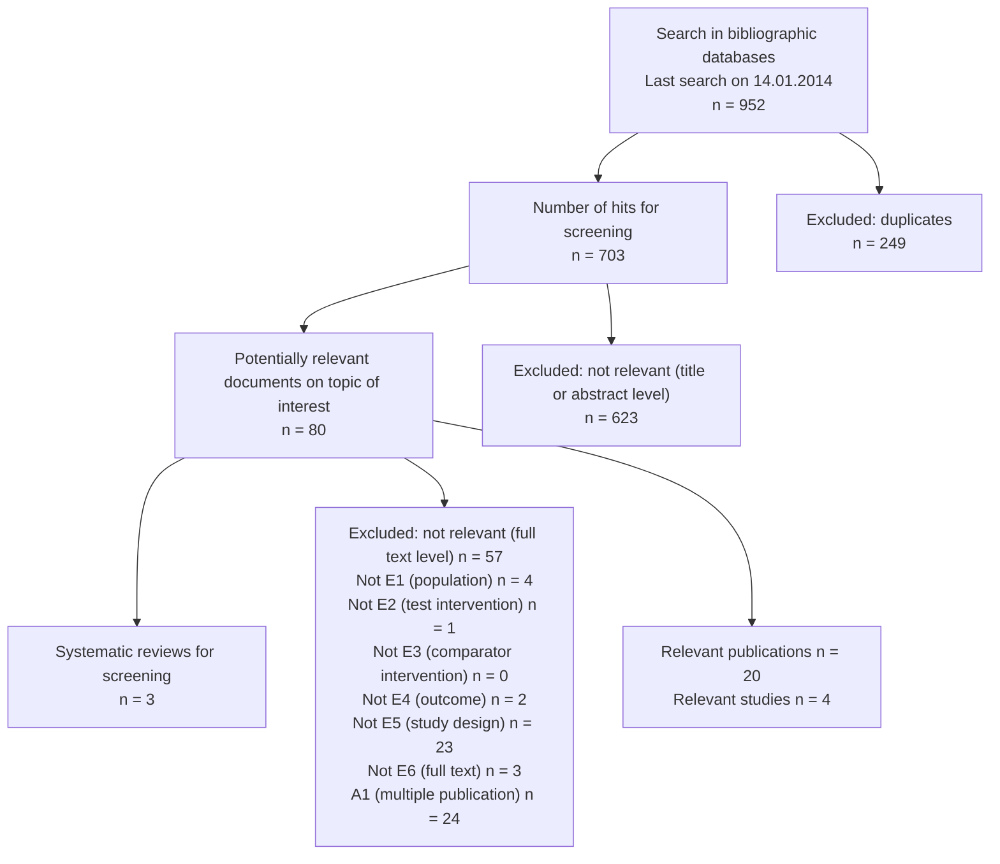

# Hvordan skriver man gode rapporter? (God rapportskrivning)

## Metadata

| Felt | Værdi |
|---|---|
| **Lektion** | Materiale til SW4PRJ4-02 Projekt 4 (Brightspace: "God rapportskrivning") — ikke knyttet til én bestemt lektion |
| **Kursus** | SWISE-01 Indledende System Engineering / SW4PRJ4-02 Projekt 4 |
| **Kilde** | `God_rapportskrivning.pdf` (51 sider; PDF-udgave af Brightspace-siden "God rapportskrivning") |
| **Type** | slides / vejledning |
| **Forfatter** | Samuel Alberg Thrysøe, Lektor, ph.d., Uddannelsesansvarlig: ST (Sundhedsteknologi), Institut for Elektro- og Computerteknologi, Aarhus Universitet. Tlf. +45 4189 3236, sat@ece.au.dk |
| **Emner dækket** | Formelle krav (72.000 tegn), bilagsstruktur, hvornår man begynder at skrive, rød tråd, målgruppe, figurer/tabeller, forkortelser, referencer og citation styles, referencer vs. bilag, plagiering, forslag til rapportstruktur, hyppigste fejl i hvert kapitel (forside, resumé, indledning, krav, metode, analyse, arkitektur, design, tests, resultater, diskussion, konklusion), bachelor-læringsmål, litteratursøgning (indledende og systematisk, PICO, søgetrekanten, databaser, in-/eksklusionskriterier, dokumentation, flowchart) |

---

> Bemærk: Slidesættet er lavet af uddannelsesansvarlig for Sundhedsteknologi (Biomedical Engineering) og bruges som generel rapportvejledning på ECE. Delene om litteratursøgning er derfor rettet mod medicinske databaser (PubMed, Embase, Cochrane) med enkelte ingeniørdatabaser (Engineering Village/Compendex, IEEE Xplore). Rådene om rapportstruktur og hyppigste fejl gælder direkte for softwareprojekter.

## Formelle krav

- **Max 72.000 tegn**
  - Svarende til 30 normalsider af 2400 tegn inkl. mellemrum
  - Tæller fra indledning til og med konklusion
    - Dvs. *ikke* forside, resumé/abstract, indholdsfortegnelse, referenceliste, bilagsfortegnelse og bilag
- **Figurer tæller *ikke* tegn!!!**
  - Jo flere, jo bedre!!!

Se vejledningen "Vejledning til udfærdigelse af projektrapporter" (Torben Gregersen, Ingeniørhøjskolen Aarhus Universitet, version 1.5): ece.au.dk → Til studerende → Uddannelser → Diplomingeniør → Projektvejledning Katrinebjerg. Direkte link: https://studerende.au.dk/studier/fagportaler/ece/uddannelser/diplomingenioer/projektvejledning-katrinebjerg/

> Slide 2–4

## Bilag — to muligheder

I kan enten lave ét samlet dokument med alle bilag (gør det lettere at krydsreferere med hyperlinks) eller aflevere en zip-fil med god folderstruktur som angivet her.

*Figur (fra Torben Gregersen: Vejledning til udfærdigelse af projektrapporter, version 1.5): folderstruktur for bilag.*

```
Bilag
├── Projekt
│   ├── Kravspecifikation (PDF)
│   ├── Analyse (PDF)
│   ├── Arkitektur (HW/SW) (PDF)
│   ├── Design (HW/SW) (PDF)
│   ├── Test
│   │   ├── Modultest (HW/SW) (PDF)
│   │   ├── Integrationstest (PDF)
│   │   └── Accepttest (PDF)
│   ├── Datablade
│   ├── Printudlæg
│   ├── Doxygen genereret dokumentation
│   ├── Source code
│   └── Logbog
└── Proces
    ├── Procesbeskrivelse (PDF)
    ├── Samarbejdsaftale m. underskrifter
    ├── Gantt-diagram
    ├── Scrum-dokumenter
    ├── Mødeindkaldelser
    └── Mødereferater
```

> Slide 5

## Hvad er vigtigst? Rapporten!!!

**Begynd altid med rapporten** og finpoler den mest muligt. Censor får ~6 timer inkl. eksamen pr. projekt — det efterlader ikke meget tid til at nærlæse bilag! Hvis I begynder med bilag og dernæst plukker de vigtige ting ind i rapporten, får I sjældent et sammenhængende eller læseværdigt resultat!

Spørgsmål til gruppen: **Hvornår begynder I på rapportskrivning?**

> Slide 6

## Selvstændig rapport — sammenhæng

Nøgleord: **Ikke kronologisk** og **Rød tråd**.

Brug bilag til at uddybe arbejdsmetoder, design, arkitektur mv., men hvad der er beskrevet i rapporten skal være sammenhængende og kunne læses for sig. Typisk er det en god idé at tage en eller to use cases og dokumentere dem fra start til slut, mens resten overlades til bilag.

> Slide 7

## Hvem skriver I til? Jeres niveau/bedre

Som udgangspunkt skriver I til nogen, der ved det samme som jer eller mere. Det betyder I *ikke* skal forklare grundlæggende begreber som SCRUM, kodestrukturer, designprincipper, ISE-artefakter og anden teori. Undtagelser kan være ved manglende specifik viden omkring det aktuelle emne.

**Fokus er på *jeres* brug af begreberne og teknikkerne — *ikke* en gennemgang af teorien — den læses bedre i teoribog/originalmateriale!**

> Slide 8

## Figurer/tabeller — konventioner

Tabeller har forklarende tekst **over** tabellen, mens figurtekster placeres **under** figuren… Sådan er det bare… Nogle vælger at inkludere oversigt over figurer og tabeller, men dette er ikke påkrævet/nødvendigt.

**Figurtekster er lange — typisk 3-4 linjer.** Sørg for at beskrive alt ved figuren, så den kan læses selvstændigt uden at skulle referere til teksten. **Placer figurer *før* tekst** — det er træls at læse uforståelig tekst og så opdage, at forklarende figur var på næste side…

*Figur: Eksempel på en videnskabelig tabel med caption over ("Table 2. Individual sniffer dog (A–F) lung cancer discrimination performance…") og et søjlediagram med lang figurtekst under ("Fig. 1. Percentages of cases and controls by number of hospital contacts…").*

> Slide 9

## Forkortelser — husk ordforklaring

Hvis I bruger forkortelser skal det være fordi der er begreber, der bruges ekstremt meget igennem hele rapporten. Bruges det blot en eller to gange skal det skrives fuldt ud. Alle forkortelser skal defineres i indledende ordforklaring. Første gang forkortelsen bruges skal den skrives fuldt ud efterfulgt af forkortelse i parentes.

*Figur: Eksempel på ordforklaringstabel (AC – Alternating current, AF – Adafruit Feather nRF52832, AUH – Aarhus University Hospital, BDD – Block definition diagram, BMI – Body Mass Index, CAD – Computer aided design, CMOS – Complementary-metal-oxide-semiconductor, DC – Direct current) samt et tekstuddrag hvor forkortelser introduceres første gang: "…type 1 diabetes (T1D) and type 2 diabetes patients (T2D). Lipodystrophy can be separated into two categories, lipoatrophy (LA) and lipohypertrophy (LH)…".*

> Slide 10

## Referencer — brug reference manager

- **EndNote** er gratis for AU-studerende
- **BibTeX** kan med fordel bruges hvis I skriver i LaTeX
- Gode vejledninger på AU Library og AU Studypedia
- Ingen krav til hvilken citation style I anvender, men **vær konsekvente**

Talrige citation styles, kan overordnet deles i to:

| Numeriske | Efter forfatter og årstal |
|---|---|
| superscript, parenteser (1) eller kantede parenteser [2] | (Jakobsen, 2012) |
| Hvis I bruger disse, **SKAL** referencerne være kronologiske, dvs. 1,2,3 osv. | (Bond, 2021a) |
| Ved flere kilder til samme sætning bruges (1,2,4) eller [2-7,9] | Fylder flere tegn, men kræver ikke kronologi |

*Figur: Eksempel på numerisk referenceliste, bl.a. [1] Torben Gregersen. Vejledning til udfærdigelse af projektrapporter. URL https://studerende.au.dk/fileadmin/user_upload/Vejledning_til_udfaerdigelse_af_projektrapporter_v1.5.pdf; [2] Diabetesforeningen; [3] Sürücü & Arslan, Journal of Caring Sciences 2018; [4] Hayek et al., Diabetes Therapy 2016; [5] Dansk sygepleje råd; [6] Bertuzzi et al. 2017; [7] Gentile et al. 2020.*

> Slide 11

## Referencer vs. bilag — lav to lister

Det kommer til at se rodet og mindre videnskabeligt ud, hvis jeres bilag og jeres referencer ligger sammen. Del dem op så I har en litteratur-/referenceliste for sig og en bilagsliste for sig. I skal ikke henvise til sider, men blot den overordnede kilde.

*Figur: To referencelister — en numerisk ([34]–[40], videnskabelige artikler og URL'er) og en forfatter-år-liste (Jørgensen 2014, Kobayashi 2018, …) hvor to poster er fremhævet med gult som eksempler på bilag, der fejlagtigt er blandet ind i referencelisten: "Konsulent, V. (2020). Telefonisk interviewundersøgelse med Vihtec Konsulent." og "Medicoingeniør (2020). Samtale med medicoingeniør fra patientkald projektet."*

> Slide 12

## Plagiering — regler

I må **IKKE** plagiere, dvs. bruge materiale fra andre uden at angive, at det er tilfældet. Figurer uden kildeangivelser er pr. definition jeres arbejde. Det er *ikke* det samme som copyright… Læs mere: https://library.au.dk/studerende/plagiering

- Plagiering er at bruge en andens materiale (bøger, artikler, film, websider, tabeller, figurer etc.) som jeres eget — uden at henvise præcist til den oprindelige kilde.
- Plagiering er, hvis I snyder bevidst — fx låner en andens opgave og afleverer den, som var den jeres egen — men også ved at jeres henvisninger eksempelvis er upræcise og mangelfulde.
- Pas på selvplagiering/autoplagiat
  - Hvis I genbruger materiale/arbejde I har leveret i tidligere fag/semestre, eller overtager et tidligere projekt/idé, skal I angive dette
  - Det er ikke dumt at genbruge — det skal bare deklareres!
- Plagiat kan medføre afvisning af opgave eller ultimativt bortvisning!

Gode vejledninger til referencer og plagiat: AU Library og AU Studypedia.

> Slide 13–14

## Forslag til struktur

I vejledningen (Torben Gregersen) er angivet typiske kapitler i rapporter. **De er kun en guideline** — hvis det skaber en mindre læseværdig rapport er I meget velkomne til at afvige fra dem!

1. Forside
2. Resumé / Abstract
3. Indholdsfortegnelse
4. Forord
5. Indledning inkl. problemformulering
6. Krav
7. Afgrænsning
8. Metode og proces
9. Analyse
10. Arkitektur
11. Design
12. Implementering
13. Test
14. Resultater
15. Diskussion af resultater
16. Konklusion
17. Fremtidigt arbejde
18. Referenceliste

> Slide 15–16

## Forside/titel — godt forsideindhold

- **God, fængende titel**
  - Brug projekttitel i CV ved jobansøgninger
- **God sigende figur**
  - Brug ikke generisk clipart, men medtag gerne flot og illustrativt billede
- **Antal tegn**
- **Logo**
  - Husk Ingeniørhøjskolen er død og begravet! (brug AU-logo)
- **Navne/studienr**
- **Om rapporten er fortrolig**

*Figur: To eksempelforsider. (1) "CORONA DETEKTERINGSARMBÅND — Bachelorprojekt, Projektnummer: 2020E57" med AU-logo, billede af armbånd på håndled, vejleder Samuel Alberg Thrysøe, deltagertabel (Navn | Studienummer | Studieretning | Underskrift), dato for aflevering 16-12-2020, antal tegn 70.667. (2) "PROJECT REPORT 2020E104 — IMPROVED INSULIN INJECTION — Development of the medical device 'Lipoxia'" med produktbillede, Name/AU ID/Study Number-tabel, supervisor, date of submission 2020/12/16, characters 71.863, "Confidential Document".*

> Slide 17

## Resumé/Abstract & Forord

- Resumé og abstract er en kort opsummering af jeres projekt på henholdsvis dansk/engelsk (ca. 1/3 side hver).
- Forord kan være en tak til nøglepersoner og indeholde fakta om projektet.
- Hvis I bruger en læsevejledning skal der være en god grund til det — blot at angive indholdet på oversigtsform er aldeles unødvendigt, men det kan fx være en gennemgang af citationskonventioner, brug af farver/typografier, hvorvidt placeringen af citater betyder noget osv.

**Hyppigste fejl:**
- Vage og ufuldstændige resuméer
- Dårligt formulerede engelske abstracts
- Misbrug af forord til en meta-indholdsfortegnelse
- Meningsløs læsevejledning

> Slide 18

## Indledning & problemformulering

- Indledning begynder typisk med **motivation** for jeres projekt
  - Hvor mange oplever problemet?
  - Hvor dyrt er det?
  - Hvor stort er problemets omfang osv.
- Dernæst gennemgås hvad man ved i forvejen og hvilke eksisterende løsninger der er derude, samt hvorfor de ikke er tilstrækkelige.
- Munder ud i projekt/problemformulering:
  - Hvad er det I prøver at løse/opnå med jeres projekt?
  - Skal formuleres som spørgsmål, der **skal** besvares i konklusion
  - Indledning og konklusion læses side om side til slut og konklusionen skal besvare samtlige spørgsmål, der er rejst i indledning!

**Hyppigste fejl:**
- Lige på og hårdt uden at sætte scenen
- Ingen angivelse af eksisterende viden
- Uforståelig problemformulering
- Manglende sammenhæng mellem indledning/konklusion

> Slide 19

## Krav & afgrænsning

- Brug gerne MoSCoW og (F)URPS+
  - Meget gerne som figurer
- Nummerer *samtlige* krav med unikke koder
  - Fx M1, M2, C1, C2 osv.
- Brug UC1, UC2 osv. men også gerne korte titler
  - Det er langt mere læsevenligt at læse "UC1: Indlæs fil" end at skulle slå op hver gang I refererer til UC1

*Figur: MoSCoW som fire farvede bokse — Must (M1, M2, M3: bla bla bla), Should (S1, S2, S3), Could (C1, C2, C3), Won't (W1, W2, W3) — og (F)URPS+ som fiskebensdiagram med grenene Functional (F1, F2), Usability (U1, U2), Reliability (R1, R2), Performance (P1, P2), Supportability (SP1, SP2), Regulatory (Reg1, Reg2).*

**Hyppigste fejl:**
- Ingen unik angivelse af krav — gør sporbarhed og referencer svære
- Brug af UC uden titler
- Dårlig anvendelse af Would-krav uden impact på produktet
- Manglende systemtest
- En stor accepttest på ALT i systemet
  - Kan med fordel splittes op i mindre tests/specs

> Slide 20

## Metode & proces

- Lav figur over jeres arbejdsproces og inspirationskilder
  - I må meget gerne beskrive hvis I afviger fra almene konventioner — det giver *langt* flere points hvis I afviger velmotiveret end at følge meningsløse konventioner blindt!

*Figur: Tre eksempler på procesfigurer — (1) et V-model-lignende aktivitetsdiagram (Problemformulering → Kravspecifikation → MATLABapp/Webapp arkitektur og design → Implementering MATLABapp/Webapp → Webapp test/MATLABapp test → Accepttest → Prototype) med grønne pile der viser iterationer; (2) "ARBEJDSMODEL" med Projektformulering → Specifikation → Arkitektur → parallelle spor (HW Design/HW modultest implementering, RPi Design/RPi modultest implementering, UI Design/UI modultest implementering) inde i en rød ramme "Iterativ-proces" → Integrationstest → Accepttest, hver med tilhørende dokumentartefakt (Projektformulering, Kravspecifikation, Accepttest, Systemarkitektur (HW og SW), HW Analyse og Design, Hardware, SW Design, Source Code, Gennemført accepttest); (3) et kumulativt burn-up-diagram med points over dato (sep–dec).*

**Hyppigste fejl:**
- Usammenhængende beskrivelser uden flow og rød tråd
- "Vi har brugt XXX fordi vi kendte det i forvejen"
  - Dovne fremfor smarte
- Brug prioritering i stedet
  - "For at kunne fokusere vores tid på XXX har vi prioriteret at anvende kendte værktøjer som YYY"

> Slide 21

## Analyse

*Figur: Rapport vs. bilag. I rapporten: "5.2.2 Valg af Backend Framework" — en sammenligningstabel med stjernescore (1-5) for Django, Ruby on Rails, Spring, ASP.NET Core og Laravel på kriterierne Survey Logic, Database, Support, Learning Curve, Performance, Security, Scalability, Flexibility, Features, Availability, Popularity, Offline, Debugging, Testing (ASP.NET Core fremhævet som valgt). I bilag: den detaljerede begrundelse pr. framework — "Backend Frameworks: Django (Python)" med kolonnerne Kriterier | Links | Noter | Score, hvor hver score er begrundet med links og noter.*

**Hyppigste fejl:**
- Manglende beskrivelse af valg
  - "Vi har brugt en Arduino Mega, PSOC, Angular, Node.js osv." uden at tage stilling til alternativer og deres respektive fordele/ulemper
- Umotiverede scorer
  - Det er godt med figurer som angivet, men I skal begrunde karakterer

> Slide 22

## Arkitektur

**Hyppigste fejl:**
- Ulæselige diagrammer
  - Brug gerne farver til at markere blokke/ledninger på BDD/IBD
- Husk at få præsenteret en oversigt over systemet tidligt, så vi ved hvad det er I udvikler og er på vej imod
  - Kan fx placeres i analyse eller arkitektur — eller i systembeskrivelsesafsnit efter indledning

*Figur: Fire eksempler på arkitekturfigurer — (1) en systemskitse med bruger, sensorer (Iltmætningsalarm diode, Feber alarm diode, Iltmætningssensor, Hudtemperatursensor), batteri, batteristyring, mikrocontroller (Adafruit ItsyBitsy M4) og ambient temperatursensor; (2) "Lipoxia system overview" — trin 1-6 (Turn device on, Place LDF Sensor at injection site, Filter signal and split to AC and DC, Compute blood flow algorithm, NP displays result, Turn device off) med "Outside the system: Insulin injection"; (3) et farvekodet SysML-diagram "sd Blodtryksmålersystem" med legende (Dataopbevaring, Input til systemet, Output fra systemet, Brugergrænseflade, Systemer, Alarmer, Aktører); (4) BDD og IBD for "Blood Pressure Monitor System" med blokke PowerSupply, RPi, AlarmSpeaker, ADC, SignalProcessing, TransducerIF, en flowspecification I2C (SDA/SCL) og navngivne ports (BA1: 21V DC, BA2: GND, R1: 5V DC, A3: I2C, S1: 5V DC, T5[2]: Analog diff, U4: Light, U6: Force osv.).*

> Slide 23

## Design & implementering

Nøgleord igen: **Ikke kronologisk** og **Rød tråd**.

**Hyppigste fejl:**
- "Så gjorde vi det, så det…"
- INGEN beskrivelse af flow, blot diagrammer efter hinanden uden brødtekst
  - Angiv hvorfor I har lavet diagrammerne, hvad de har givet jer og hvordan I har anvendt dem videre
  - Hvis ikke I ved hvorfor I har lavet en figur, ved læseren det helt sikkert heller ikke…

> Slide 24

## Tests

**Hyppigste fejl:**
- Usammenhængende beskrivelser uden flow og rød tråd
  - Brug figurer og grafisk overblik over jeres totale mængde tests
  - Uddybes i bilag
- Pas på med forkortelser, at de ikke går igen fra kravspek

*Figur: Grafisk testoverblik i tre lag — **Modultest** (blå): Magnetomrører M1→M2→M3→M4→M5→M6; Pumpeenhed P1→P4; Motor E1→E4; Kamera K1→K8; Antitilstopning A1→A2; Raspberry Pi (software) R1–R9; Startbeholder (Indledende analysearbejde S1→S5, Låg S6→S9, Tryk S10→S12); Trykmåler (Transducer T1, Forstærker T2→T5, Filter T6→T9, Inverter T7); Valg af alternativ til Langerhanske øer L1→L2. **Integrationstest** (grøn): Startbeholder–Raspberry Pi S1→S4; Forstærker–Filter F1→F3; Software klasser W1→W4; Raspberry Pi–Sortering R1. **Systemtest** (rød): S1, S2. Desuden en tabel "Test | Elementer under test" (#1–#7) der viser hvilke HW-blokke (Analog Discovery, InvertedSupply, Instrumentation Amplifier, AA-filter, SignalModulation, Transducer, PowerSupply) der indgår i hver test, farvekodet efter Testudstyr / HW-blokke i SignalProcessing / SignalProcessing.*

> Slide 25

## Resultater

**Hyppigste fejl:**
- Antal decimaler
  - 0.4235 angiver, at I måler præcist til og med 4. decimal — dvs. I kan gentage målingen med samme ciffer på denne position!
- Brug hellere figurer fremfor tabeller

*Figur: Eksempel — tabel med Værdi Arduino [mmHg] | Beregnet input fra transducer til INA114 [mV] | Forventet output [V] | Reelt output [V] (0/0.00/0.00/0.00; 25/0.63/0.35/0.36; 75/1.85/1.04/1.08; 127/3.13/1.75/1.82; 175/4.38/2.45/2.50; 225/5.65/3.16/3.21; 251/6.25/3.50/3.45) og samme data som plot "Test af INA114 med transducer input" (Output spænding (V) mod Input spænding (mV), målepunkter og best fitted line).*

> Slide 26

## Diskussion

- Hvad gik godt/skidt?
  - I skal ikke undertrykke negative fund/uheldige beslutninger, men i stedet diskutere hvad kunne I have gjort for at undgå det gik skidt dersom det gjorde det? Vi ÆÆÆÆLSKER når I angiver, at I har lært noget :)
- Hvor funktionelt er jeres system?
- Vær gerne stolte over jeres arbejde — I skal ikke nedgøre jer selv, det er vores opgave :)

**Hyppigste fejl:**
- Ingen forbindelse til netop gennemgåede tests og deres resultater — husk flowet
- En negativ tone og skuffelse over opnåede resultater

> Slide 27

## Konklusion/perspektivering

- **Konklusion**
  - Kort opsummering på hele projektet
  - Adresser samtlige spørgsmål fra introduktion
  - Træk de store linjer op
  - Vigtige erfaringer fra proces
- **Perspektivering**
  - Givet uendelige mængder ressourcer/tid: Hvad ville I så implementere?

**Hyppigste fejl:**
- Ingen samstilling mellem introduktion/problemformulering og konklusion
  - Alle spørgsmål skal besvares i konklusion!
- Urealistiske perspektiver
- Manglende kobling af Won't-krav til perspektivering

> Slide 28

## Bachelor-læringsmål (kursuskatalog)

Læringsmålene er plukket direkte fra kursuskataloget (bachelorprojekt):

- Omsætte forskningsresultater samt naturvidenskabelig og teknisk viden til anvendelse ved udviklingsopgaver og ved løsning af teknologiske problemstillinger
- Søge, analysere og vurdere ny viden indenfor relevante områder
- Udvikle nye løsninger
- Anvende ingeniørfaglig teori og metode på en systematisk måde
- Vurdere og forklare projektresultater for ingeniører og andre målgrupper, skriftlig og mundtligt
- Reflektere over anvendelsen af projektresultaterne i relation til bæredygtighed, sociale, organisatoriske, miljømæssige, arbejdsmiljømæssige, økonomiske og etiske konsekvenser

> Slide 29–30

## Litteratursøgning — overblik

Baseret på EUnetHTA (European Network for Health Technology Assessment) "Methodological Guidelines: Process of information retrieval for systematic reviews and health technology assessments on clinical effectiveness". Figur 1 i EUnetHTA-guidelinen er gengivet i modificeret form og tjener som skabelon for gennemgang af processen omkring litteratursøgning. Første trin er en indledende inspirationssøgning, der skal føre til gode og valide søgeord og -termer.

| Trin | Indhold |
|---|---|
| Indledende søgning | Studier → Udvælg nogle til validering ➠ skal findes via systematisk søgning |
| Søgestrategi strukturering | PICO, synonymer, afgrænsning, trunkering, stavemåder. Se Studypedia: Søgestrategi & Tips/Tricks |
| Valg af databaser | Centrale DB: MEDLINE, Embase, CENTRAL, Pubmed, Cochrane. Hvis relevant: andre passende databaser/søgesteder |
| Identifikation af søgeord og -termer | Søgeord: Koncept 1: SO 1, SO 2, SO xx; Koncept 2: SO 1, SO 2, SO xx. Søgetermer (DB): Koncept 1: ST 1, ST 2, ST xx; Koncept 2: ST 1, ST 2, ST xx |
| Tilretning af søgesyntaks efter database | Pubmed: AND, OR, [TIAB], [MESH]. Embase (fx ProQuest): NEAR/n, ti(), ab(), emu. exact(). Cochrane: Near/n, :ab,ti., MeSH descriptor[] |
| Peer review af søgestrategier | PRESS tjekliste; validering med relevante studier (de studier der blev udvalgt i den indledende søgning skal genfindes af den systematiske søgning) |

Sliden om indledende søgning fokuserer på dannelse af gode problemformuleringer og hvordan I identificerer gode søgeord og -termer; gennemgang af databaser og specifikke søgesyntakser følger i næste lektion.

> Slide 31–33

## Indledende søgning — definition af søgetermer

Den første, indledende litteratursøgning har til formål at få et overblik over emner og hvilke begreber og ord andre har brugt. Disse skal bruges til senere at udforme systematiske litteratursøgninger efter.

**Quick'n'dirty**
- Brug library.au.dk, Google Scholar, Google eller andet
- Søg med ord og begreber I kender i forvejen
- Brug de resultater I får til at blive klogere på fagterminologien og de "rigtige" søgeord
- Søg videre med de nye begreber og søgeord

**Kædesøgning**
- Relateret læsning: Brug forslag fra søgemaskiner
- Brug referenceliste fra fundne artikler til at søge ny litteratur (retrospektiv: tilbage i tiden)
- Brug Scopus til at søge artikler, der citerer den fundne artikel (prospektiv: frem i tiden)

**Review**
- Bedste bud fra en ekspert på centrale artikler
- Brug referencerne til at finde gode og centrale nøgleord på området (**Keywords**)

> Slide 34

## Indledende søgning — PICO

Husk at definere jeres spørgsmål og senere relevansen af jeres artikler systematisk — meget gerne ud fra PICO, som I tidligere blev præsenteret for. Kan suppleres med S (PICOS) for Setting (fra EUnetHTA): Hvor og under hvilke rammer behandles patienterne/populationen?

| P | I | C | O |
|---|---|---|---|
| Population / Patient / Problem | Intervention or Exposure | Comparison | Outcome |

*Figur: EUnetHTA-tabel "Domain | Description of applicability of evidence": Population — describe general characteristics of enrolled populations, how this might differ from target population, and effects on baseline risk for benefits or harms; where possible, describe the proportion with characteristics potentially affecting applicability (e.g. % over age 65) rather than the range or average. Intervention — describe general characteristics and range of interventions and how they compare to those in routine use and how this might affect benefits or harms from the intervention. Comparators — describe comparators used; whether they reflect best alternative treatment and how this may influence treatment effect size. Outcomes — describe what outcomes are most frequently reported and over what time period; whether the measured outcomes and timing reflect the most important clinical benefits and harms. Setting — describe geographic and clinical setting of studies; whether or not they reflect the settings in which the intervention will be typically used and how this may influence the assessment of intervention effect.*

> Slide 35

## Indledende søgning — udgangspunkt (øvelse: referenceliste og Scopus)

Udgangspunkt: artiklen *"Anesthetic requirement is increased in redheads"*.

- Søg på library.au.dk og se relateret viden. Find fuldtekst på publisher, se referenceliste og klik videre.
- Søg på Scopus og se citerende artikler.

> Slide 36

## Indledende søgning — gode søgesteder

Til inspirationssøgning er disse steder velegnede. De står i modstrid til regulære medicinske databaser, der er mere organiserede, men er virkelig gode til at danne sig et overblik over emner og søgeord.

**AU Library**
- Bibliotekets bøger og tidsskrifter (4 mio.); danske og udenlandske videnskabelige artikler (87 mio.); samt AU forskning
- Her kan søges i de materialer biblioteket har indkøbt til netop AUs forsknings- og uddannelsesområder
- Der er kun emneord på en mindre del af posterne
- Nogle få muligheder for at afgrænse sine søgeresultater

**Google Scholar**
- Googles søgemaskine, der kun høster data fra videnskabelige netsteder — danske og udenlandske (herunder alt materiale fra AU Library og øvrige danske forskningsbiblioteker). Dækningsgraden er ukendt.
- Der er ingen mulighed for at afgrænse og raffinere sine søgninger i Google Scholar. Til gengæld er relevansrankeringen god.

> Slide 37

## Systematisk litteratursøgning — søgetrekanten

Hvis vi eksempelvis skulle undersøge HPV og forebyggelse heraf samt modstand mod vaccination, kan søgetrekanten bruges til at strukturere arbejdet med at finde synonymer og søgeord.

Søgetrekanten har tre hjørner: **Hovedemne** (top), **Fokuspunkt** (venstre) og **Afgrænsende begreb** (højre).

Eksempel: Hovedemne = HPV, Fokuspunkt = Forebyggelse, Afgrænsende begreb = Angst. Synonymer/søgeord pr. hjørne:

| Hovedemne: HPV | Fokuspunkt: Forebyggelse | Afgrænsende begreb: Angst |
|---|---|---|
| Humant papilloma virus | Prevention | Anxiety |
| Human papilloma virus | Vaccination | Skeptisk/Skepticism |
| Livmoderhalskræft | Vaccine | Bivirkninger |
| Cervical cancer | Immunisation | Adverse reactions |

> Slide 38–41

## Centrale databaser — de mest relevante

Her er nævnt de mest relevante databaser i forbindelse med MTV-litteratursøgninger (medicinsk teknologivurdering) og hvad I kan finde der. For en grundigere specifikation af kilder, se fagsiden for sundhedsteknologi på AU Library.

**PubMed/Medline**
- Lægevidenskab, bioteknik, biomekanik, biomedicinsk teknologi, mikrobiologi og sundhedsteknologi
- Indekseret efter MeSH-termer

**Embase**
- Bioteknik, biomekanik, biomedicinsk teknologi, mikrobiologi, medicin, medikoteknik, sundhedsteknologi, sygepleje m.fl.

**Engineering Village – Compendex**
- Ingeniørfaglige emner: bioteknik, bygningsteknik, computer, elektroteknik, elektronik, kemi, maskinteknik, materialer og produktionsteknik

**IEEE Xplore**
- Elektroteknik, elektronik, IKT, datalogi, computer og meget mere. Desuden indeholder IEEE alle gældende AIEE, ANSI og ANSI/IEEE standarder.

**Cochrane Library**
- Systematiske oversigtsartikler, resuméer af systematiske oversigtsartikler, (randomiserede) kontrollerede forsøg, oversigter over effekt og bivirkninger ved behandlingsformer, økonomiske vurderinger af behandlingsformer etc.
- Klik på "Go to the Cochrane Library" i venstre menu

**Sundhedsstyrelsen**
- Nationale kliniske retningslinjer (NKR)
- Værktøjer, links, publikationer, projekter samt information og viden om sygdomme, forebyggelse, behandling, rehabilitering

**EUnetHTA & NIH HTA**
- Portaler med MTV fra hhv. EU og USA

> Slide 42–45

## Systematisk litteratursøgning — søgning, screening og dokumentation

(Figur 1 i EUnetHTA-guidelinen, anden halvdel.) RMS = Reference Manager (System).

| Trin | Indhold |
|---|---|
| Systematiske søgninger, download af artikler og referencehåndtering | Anvend endelige søgestrategier på databaserne. For hver database: gem søgeresultater som tekstfiler. Import til RMS (inkl. dubletter) → RMS (uden dubletter) |
| Screening af artikler | Tre-trins screening: 1) Titel, 2) Abstract, 3) Fuld-tekst |
| Dokumentation af søgeprocessen | Dokumentér valgte databaser, søgestrategi og datoer, antal hits, in- og eksklusionskriterier, flowchart over udvælgelsesproces |

> Slide 46

## In- og eksklusionskriterier

Forskere måles og vejes på hvor mange artikler de skriver. Derfor er det (omend det ikke er god stil) ikke ualmindeligt, at man publicerer foreløbige resultater, som følges op af endelige artikler. Disse skal naturligvis ikke medtages to gange.

**Typiske inklusionskriterier**
- Sprog
  - Hovedparten af artikler er på engelsk
  - Medtag kun artikler hvor I rent faktisk kan sproget…
- Studiedesign
  - Fx RCT, store kohortestudier mv.
- Specifikke endpoints relateret til jeres spørgsmål

**Typiske eksklusionskriterier**
- Kasuistikker/case studies, ikke-humane studier, irrelevante artikler
- Gentagne artikler
  - Vælg den artikel med den største patientpopulation eller den længste follow-up periode

> Slide 47

## Eksempel på søgning (PubMed)

PubMed er en af de største medicinske databaser og den ALLE læger bruger — bibliotekarer håner dem ofte for, at det er den eneste de kender… Som det ses består den endelige søgestrategi af 8 queries med lidt forskellig ordlyd for at fange alle relevante artikler.

| Query N° | Database | Query string | hits | Query date |
|---|---|---|---|---|
| Q01 | PubMed | (Transcutaneous electrical nerve stimulation[TIAB]) AND migraine[TIAB] | 22 | 04/08/2016 |
| Q02 | PubMed | (Transcutaneous nerve stimulation[TIAB]) AND migraine[TIAB] | 2 | 04/08/2016 |
| Q03 | PubMed | (Transcutaneous nerve stimulation[TIAB]) AND headache[TIAB] | 3 | 04/08/2016 |
| Q04 | PubMed | (Transcutaneous electrical nerve stimulation[TIAB]) AND headache[TIAB] | 28 | 04/08/2016 |
| Q05 | PubMed | (transcutaneous neurostimulation[TIAB]) AND migraine[TIAB] | 2 | 04/08/2016 |
| Q06 | PubMed | (transcutaneous neurostimulation[TIAB]) AND headache[TIAB] | 0 | 04/08/2016 |
| Q07 | PubMed | Cefaly[TIAB] | 8 | 04/08/2016 |
| Q08 | PubMed | (migraine[TIAB]) AND transcutaneous stimulation[TIAB] | 6 | 04/08/2016 |

> Slide 48

## Dokumentation af eksklusioner (frasortering)

Frasortering af artikler foregår på 3 niveauer; først efter titel, dernæst abstract og endelig fuldtekst. Husk at føre nøje regnskab med hvilke der blev sorteret fra og dokumentér/opdatér eksklusionskriterier.

| Query N° | L1 Title Excl. | L1 Title Incl. | L2 Abstract Excl. | L2 Abstract Incl. | L3 Full article Excl. | L3 Full article Incl. | Relevant |
|---|---|---|---|---|---|---|---|
| Q01 | 14 | 8 | 7 | 1 | 1 | 0 | 0 |
| Q02 | 2 | 0 | 0 | 0 | 0 | 0 | 0 |
| Q03 | 3 | 0 | 0 | 0 | 0 | 0 | 0 |
| Q04 | 27 | 1 | 0 | 1 | 0 | 1 | 1 |
| Q05 | 2 | 0 | 0 | 0 | 0 | 0 | 0 |
| Q06 | 0 | 0 | 0 | 0 | 0 | 0 | 0 |
| Q07 | 3 | 5 | 2 | 5 | 2 | 3 | 2 |
| Q08 | 5 | 1 | 0 | 1 | 0 | 1 | 1 |
| Total | 56 | 15 | 9 | 8 | 3 | 5 | 5 |

> Slide 49

## Flowchart — dokumentation af udvælgelsesproces

Til slut laves en samlet oversigt over hvilke artikler der blev inkluderet, og hvilke der blev ekskluderet med årsag. I den viste udgave (EUnetHTA figur 10) er der ikke differentieret mellem titel- eller abstract-niveau, hvilket ellers kunne være anbefalelsesværdigt.



> Slide 50

## Afslutning

Kontakt: Samuel Alberg Thrysøe, Lektor, ph.d., Uddannelsesansvarlig: ST. Institut for Elektro- og Computerteknologi, Biomedical Engineering, Aarhus Universitet, Finlandsgade 22, 8200 Aarhus N. +45 4189 3236, sat@ece.au.dk.

> Slide 51
