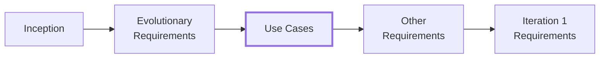
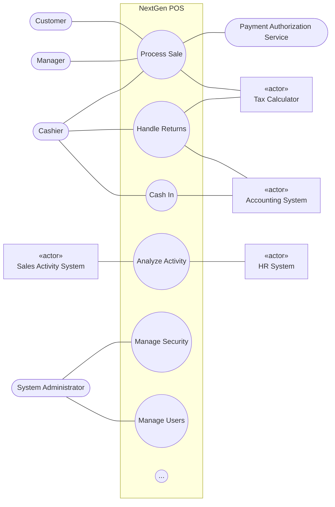
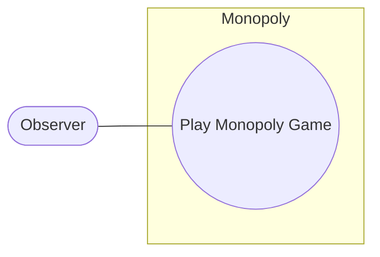

# Use Cases (Larman, kap. 6)

## Metadata

| Felt | Værdi |
|---|---|
| **Kilde** | Craig Larman, *Applying UML and Patterns*, 3. udg., Prentice Hall PTR — kap. 6 "Use Cases", s. 61–100 |
| **Kursus** | SWISE-01 Indledende System Engineering |
| **Type** | lærebogskapitel (kondenserede studienoter; tex-transskriptionen `02_Larman_Ch6_UseCases.tex` er den fulde kilde) |
| **Sprog** | engelsk |
| **Emner dækket** | actors (primary/supporting/offstage), scenarios, use cases, Use-Case Model, brief/casual/fully dressed format, Cockburn template, NextGen POS *Process Sale*, extensions notation, essential vs. concrete style, black-box use cases, actor-goal list, Boss/EBP/Size tests, use case diagrams, activity diagrams, feature lists, Monopoly case, use cases in UP iterations |

> Note: This file is a structured, condensed rendering of the chapter — every section heading, figure, table, example and guideline is covered, but prose is paraphrased and the long NextGen *Process Sale* example is rendered in outline form rather than word for word. Consult the .tex source for the exact wording.

---

**Objectives** of the chapter:

- Identify and write use cases.
- Use the brief, casual and fully dressed formats, in an essential style.
- Apply tests to identify suitable use cases.
- Relate use case analysis to iterative development.

Chapter epigraph (Ben Stein): the first step to getting what you want out of life is deciding what you want.

## Introduction

> Larman s. 61–62

- Use cases are **text stories**, widely used to discover and record requirements. They influence many aspects of a project — including OOAD — and are input to many later artifacts in the case studies.
- The chapter covers basic concepts: how to write use cases and how to draw a UML use case diagram. Key point: **analysis skill beats notation knowledge** — the use case diagram is trivial to learn; the guidelines for identifying and writing good use cases take weeks or longer to digest.
- **What's next?** Kap. 5 introduced requirements; this chapter covers use cases for functional requirements; kap. 7 covers other UP requirements incl. the Supplementary Specification for non-functional requirements.

Chapter roadmap (flow):

*Figur 6.1: Sample UP artifact influence.* The figure shows how text use cases feed other artifacts:

| From | To | What flows |
|---|---|---|
| Use case diagram (Cashier — Process Sale) | Use case text | use case names |
| Use case text | Domain Model (Sale 1—1..* SalesLineItem, ...) | objects, attributes, associations |
| Use case text | Vision | scope, goals, actors, features |
| Use case text | Glossary | terms, attributes, validation |
| Use case text | System Sequence Diagrams (`:Cashier` → `:System`: `makeNewSale()`, `enterItem(id, quantity)`) | system events |
| System Sequence Diagrams | Operation Contracts (`enterItem(...)`, post-conditions) | system operations |
| Use-Case Model as a whole | Supplementary Specification | non-functional reqs, quality attributes |
| Requirements (Use-Case Model) | Design Model (interaction diagram `:Register` → `:ProductCatalog` `getProductSpec(itemID)`, `:Register` → `:Sale` `addLineItem(spec, quantity)`) | requirements |

Disciplines on the figure: Business Modeling (Domain Model), Requirements (Use-Case Model, Vision, Glossary, Supplementary Specification), Design (Design Model). High-level goals and use case diagrams are input to the use case text; the text in turn influences analysis, design, implementation, project management and test artifacts.

## Example

> Larman s. 62

Informally: use cases are text stories of some actor using a system to meet goals. **Brief-format** example:

> **Process Sale:** A customer arrives at a checkout with items to purchase. The cashier uses the POS system to record each purchased item. The system presents a running total and line-item details. The customer enters payment information, which the system validates and records. The system updates inventory. The customer receives a receipt from the system and then leaves with the items.

- Use cases are **not diagrams, they are text**. Novices commonly focus on the secondary-value UML diagram instead of the important text.
- Use cases often need more detail/structure than this, but the essence is discovering and recording functional requirements by writing stories of using a system to fulfil user goals — "cases of use". (Footnote: the original Swedish term translates literally as "usage case".)

## Definition: What are Actors, Scenarios, and Use Cases?

> Larman s. 63

| Term | Informal definition |
|---|---|
| **Actor** | Something with behavior: a person (identified by role), computer system or organization. E.g. a cashier. |
| **Scenario** | A specific sequence of actions and interactions between actors and the system; also called a **use case instance**. One particular story or path through the use case — e.g. successfully purchasing items with cash, or failing to purchase because credit payment is denied. |
| **Use case** | A collection of related success and failure scenarios describing an actor using a system to support a goal. |

**Casual-format** example with alternate scenarios — *Handle Returns*:

- *Main Success Scenario:* a customer arrives at checkout with items to return; the cashier uses the POS system to record each returned item.
- *Alternate Scenarios:* (1) credit reimbursement rejected → inform customer, pay cash; (2) item identifier not found → notify Cashier, suggest manual entry (code may be corrupted); (3) failure to communicate with external accounting system → notify Cashier, record error.

RUP definition (makes sense once scenarios/instances are defined):

> A set of use-case instances, where each instance is a sequence of actions a system performs that yields an observable result of value to a particular actor [RUP].

## Use Cases and the Use-Case Model

> Larman s. 63–64

- UP defines the **Use-Case Model** within the Requirements discipline: primarily the set of all written use cases — a model of the system's functionality and environment.
- **Use cases are text documents, not diagrams; use-case modeling is primarily an act of writing text, not drawing diagrams.**
- Other UP requirement artifacts: Supplementary Specification, Glossary, Vision, Business Rules — useful, but secondary at this point.
- The Use-Case Model *may* optionally include a UML use case diagram showing use case and actor names and their relationships — a nice context diagram and a quick way to list use cases by name.
- Nothing object-oriented about use cases; writing them is not OO analysis. That is a strength (broad applicability). Still, they are a key requirements input to classic OOAD.

## Motivation: Why Use Cases?

> Larman s. 64

- We have goals and want computers to help meet them. The best ways to capture goals are **simple and familiar**, so customers can contribute to their definition and review — lowering the risk of missing the mark. Complex analysis methods send business people "into a coma".
- Lack of user involvement is near the top of the list of project-failure causes [Larman03]; anything that keeps users involved is desirable. Use cases make it possible for domain experts or requirements donors to write (or co-write) them.
- Use cases emphasise **user goals and perspective**: "Who is using the system, what are their typical scenarios of use, and what are their goals?" — more user-centric than a list of system features.
- Warning sign of a novice (or "Type-A analyst"): over-concern with use case diagrams, relationships, packages etc. rather than the hard work of writing the text stories.
- Strength: use cases scale both up and down in sophistication and formality.

## Definition: Are Use Cases Functional Requirements?

> Larman s. 64–65

- Use cases *are* requirements — primarily functional/behavioral ("what the system will do"). In FURPS+ terms they emphasise the **F**, but can carry other types when those relate strongly to a use case. In UP and many modern methods they are the central mechanism for discovering and defining requirements.
- Related viewpoint: a use case defines a **contract** of how a system will behave [Cockburn01].
- Not all requirements are use cases, and requirements are not only "the system shall..." feature lists. A key idea of use cases is to (usually) reduce the importance of detailed old-style feature lists and write use cases for functional requirements instead.

## Definition: What are Three Kinds of Actors?

> Larman s. 65

An actor is anything with behavior — **including the system under discussion (SuD) itself** when it calls on services of other systems (a refinement over earlier UML/UP definitions that inconsistently excluded the SuD [Cockburn97]; any entity may play multiple roles). Actors are roles played by people, organizations, software and machines. Primary and supporting actors appear in the action steps of the use case text.

| Kind | Definition | Example | Why identify? |
|---|---|---|---|
| **Primary actor** | Has user goals fulfilled through using services of the SuD | Cashier | To find user goals, which drive the use cases |
| **Supporting actor** | Provides a service (e.g. information) to the SuD. Often a computer system, but can be an organization or person | Automated payment authorization service | To clarify external interfaces and protocols |
| **Offstage actor** | Has an interest in the behavior of the use case but is neither primary nor supporting | Government tax agency | To ensure all necessary interests are identified and satisfied — offstage interests are subtle and easy to miss unless named explicitly |

## Notation: What are Three Common Use Case Formats?

> Larman s. 66

| Format | Description | When? |
|---|---|---|
| **brief** | Terse one-paragraph summary, usually of the main success scenario (e.g. *Process Sale* above) | Early requirements analysis, to get a quick sense of subject and scope. Minutes to create. |
| **casual** | Informal multi-paragraph format covering various scenarios (e.g. *Handle Returns* above) | As above. |
| **fully dressed** | All steps and variations written in detail, plus supporting sections such as preconditions and success guarantees | After many use cases are identified and written in brief format; during the first requirements workshop a few (≈10 %) of the architecturally significant, high-value use cases are written in detail. |

## Example: Process Sale, Fully Dressed Style

> Larman s. 66–72

- Fully dressed use cases are detailed and structured; they dig deeper.
- In iterative/evolutionary UP requirements analysis, 10 % of the critical use cases are written this way in the first requirements workshop; design and programming then starts on the most architecturally significant use cases or scenarios from that 10 %.
- Most widely used template since the early 1990s: **Alistair Cockburn's** (alistair.cockburn.us), author of the most popular use-case book.

*Tabel 6.1: Fully dressed use case template.*

| Use Case Section | Comment |
|---|---|
| **Use Case Name** | Start with a verb. |
| **Scope** | The system under design. |
| **Level** | "user-goal" or "subfunction". |
| **Primary Actor** | Calls on the system to deliver its services. |
| **Stakeholders and Interests** | Who cares about this use case, and what do they want? |
| **Preconditions** | What must be true on start, and worth telling the reader? |
| **Success Guarantee** | What must be true on successful completion, and worth telling the reader. |
| **Main Success Scenario** | A typical, unconditional happy path scenario of success. |
| **Extensions** | Alternate scenarios of success or failure. |
| **Special Requirements** | Related non-functional requirements. |
| **Technology and Data Variations List** | Varying I/O methods and data formats. |
| **Frequency of Occurrence** | Influences investigation, testing, and timing of implementation. |
| **Miscellaneous** | Such as open issues. |

Larman's note: this is the book's primary case-study example of a detailed use case. It shows more than you ever wanted to know about a POS system, but it is based on a real POS and demonstrates that use cases can capture complex real-world requirements and deeply branching scenarios.

### Use Case UC1: Process Sale

> Larman s. 67–72. Outline rendering — structure, all step/extension labels and the substance of each; see the .tex for the verbatim text.

| Preface element | Value |
|---|---|
| **Scope** | NextGen POS application |
| **Level** | user goal |
| **Primary Actor** | Cashier |
| **Preconditions** | Cashier is identified and authenticated. |
| **Success Guarantee (Postconditions)** | Sale is saved. Tax is correctly calculated. Accounting and Inventory are updated. Commissions recorded. Receipt is generated. Payment authorization approvals are recorded. |
| **Frequency of Occurrence** | Could be nearly continuous. |

**Stakeholders and Interests:**

| Stakeholder | Interests |
|---|---|
| Cashier | Accurate, fast entry; no payment errors (cash drawer shortages are deducted from salary). |
| Salesperson | Sales commissions updated. |
| Customer | Purchase and fast service with minimal effort; easily visible display of entered items and prices; proof of purchase to support returns. |
| Company | Accurately record transactions and satisfy customer interests; ensure Payment Authorization Service receivables are recorded; fault tolerance so sales can be captured even if server components (e.g. remote credit validation) are unavailable; automatic and fast update of accounting and inventory. |
| Manager | Quickly perform override operations; easily debug Cashier problems. |
| Government Tax Agencies | Collect tax from every sale; possibly multiple agencies (national, state, county). |
| Payment Authorization Service | Receive digital authorization requests in the correct format and protocol; accurately account for payables to the store. |

**Main Success Scenario (Basic Flow):**

1. Customer arrives at POS checkout with goods and/or services to purchase.
2. Cashier starts a new sale.
3. Cashier enters item identifier.
4. System records sale line item and presents item description, price, and running total. Price calculated from a set of price rules.
   *Cashier repeats steps 3–4 until indicates done.*
5. System presents total with taxes calculated.
6. Cashier tells Customer the total, and asks for payment.
7. Customer pays and System handles payment.
8. System logs completed sale and sends sale and payment information to the external Accounting system (for accounting and commissions) and Inventory system (to update inventory).
9. System presents receipt.
10. Customer leaves with receipt and goods (if any).

**Extensions (Alternative Flows)** — label, condition, and handling in outline:

| Label | Condition | Handling (summary) |
|---|---|---|
| *a | At any time, Manager requests an override operation | System enters Manager-authorized mode → Manager/Cashier performs one Manager-mode operation (cash balance change, resume suspended sale on another register, void sale, ...) → System reverts to Cashier-authorized mode. |
| *b | At any time, System fails | All transaction-sensitive state and events must be recoverable from any step. Cashier restarts System, logs in, requests recovery → System reconstructs prior state. **2a** anomalies prevent recovery: System signals error, records it, enters clean state → Cashier starts a new sale. |
| 1a | Customer or Manager indicate to resume a suspended sale | Cashier performs resume operation and enters the sale ID → System displays resumed sale with subtotal (**2a** sale not found: error; Cashier probably starts new sale and re-enters items) → Cashier continues with sale. |
| 2–4a | Customer tells Cashier they have tax-exempt status | Cashier verifies and enters tax-exempt status code → System records status for use in tax calculation. |
| 3a | Invalid item ID (not found in system) | System signals error and rejects entry → Cashier responds: **2a** human-readable ID (e.g. numeric UPC): manual entry, System displays description and price (2a invalid again: error, try alternate method); **2b** no ID but price on tag: Manager override, then manual price entry with standard taxation (no product info, so tax engine can't deduce tax); **2c** Cashier performs *Find Product Help* to obtain true ID and price; **2d** otherwise ask an employee and do manual ID or price entry. |
| 3b | Multiple of same item category, unique identity not important | Cashier enters item category identifier and quantity. |
| 3c | Item requires manual category and price entry | Cashier enters special manual category code plus price. |
| 3–6a | Customer asks to remove an item from the purchase (only legal if item value is below the Cashier void limit) | Cashier enters item identifier for removal → System removes item, displays updated running total. **2a** price exceeds void limit: System signals error, suggests Manager override → Cashier gets override and repeats. |
| 3–6b | Customer tells Cashier to cancel sale | Cashier cancels sale on System. |
| 3–6c | Cashier suspends the sale | System records sale for retrieval on any POS register → presents a "suspend receipt" with line items and a sale ID for resuming. |
| 4a | System-supplied item price not wanted | Cashier requests Manager approval → Manager performs override → Cashier enters manual override price → System presents new price. |
| 5a | System detects failure to communicate with external tax calculation service | System restarts the service on the POS node and continues. **1a** service does not restart: System signals error; Cashier may manually calculate/enter tax or cancel the sale. |
| 5b | Customer says they are eligible for a discount | Cashier signals discount request, enters Customer identification → System presents discount total based on discount rules. |
| 5c | Customer has account credit to apply | Cashier signals credit request, enters Customer identification → System applies credit up to price = 0 and reduces remaining credit. |
| 6a | Customer intended to pay cash but lacks enough cash | Cashier asks for alternate payment method. **1a** Customer cancels: Cashier cancels sale on System. |
| 7a | Paying by cash | Cashier enters cash tendered → System presents balance due and releases cash drawer → Cashier deposits cash and returns balance → System records the cash payment. |
| 7b | Paying by credit | Customer enters credit account information → System displays payment for verification → Cashier confirms (**3a** Cashier cancels payment step: System reverts to "item entry" mode) → System sends authorization request to external Payment Authorization Service (**4a** failure to collaborate: error; Cashier asks for alternate payment) → System receives approval, signals Cashier, releases cash drawer for the signed receipt (**5a** denial: signal denial, ask alternate payment; **5b** timeout: signal timeout, Cashier may retry or ask alternate payment) → System records the credit payment incl. approval → System presents signature input mechanism → Cashier asks Customer for signature; Customer signs → if paper receipt, Cashier places it in drawer and closes it. |
| 7c | Paying by check ... | (not elaborated) |
| 7d | Paying by debit ... | (not elaborated) |
| 7e | Cashier cancels payment step | System reverts to "item entry" mode. |
| 7f | Customer presents coupons | Before payment, Cashier records each coupon; System reduces price and records used coupons for accounting. **1a** coupon not for any purchased item: System signals error. |
| 9a | Product rebates | System presents rebate forms and rebate receipts for each item with a rebate. |
| 9b | Customer requests gift receipt | Cashier requests it; System presents it. |
| 9c | Printer out of paper | System signals problem if it can detect it → Cashier replaces paper → Cashier requests another receipt. |

**Special Requirements:**

- Touch screen UI on a large flat panel monitor; text visible from 1 meter.
- Credit authorization response within 30 seconds 90 % of the time.
- Robust recovery when access to remote services (e.g. inventory system) is failing.
- Language internationalization of displayed text.
- Pluggable business rules insertable at steps 3 and 7.
- ...

**Technology and Data Variations List:**

| Step | Variation |
|---|---|
| *a | Manager override entered by swiping an override card through a card reader, or entering an authorization code via keyboard. |
| 3a | Item identifier entered by bar code laser scanner (if present) or keyboard. |
| 3b | Item identifier may be any UPC, EAN, JAN or SKU coding scheme. |
| 7a | Credit account information entered by card reader or keyboard. |
| 7b | Credit payment signature captured on paper receipt; within two years many customers are expected to want digital signature capture. |

**Open Issues:** tax law variations; the remote service recovery issue; customization needed for different businesses; whether a cashier must take their cash drawer on logout; whether the customer can use the card reader directly or the cashier must do it.

Closing remark: the use case is illustrative rather than exhaustive, but based on a real POS system's requirements (developed with an OO design in Java). It shows that a fully dressed use case can record many requirement details and serves as a model for many use case problems.

## What do the Sections Mean?

> Larman s. 72–78

### Preface Elements

#### Scope

Bounds the system(s) under design. Typically one software (or hardware+software) system → a **system use case**. At broader scope, use cases can describe how a business is used by customers and partners → a **business use case** (enterprise-level process description; not covered in the book).

#### Level

Cockburn classifies use cases as **user-goal level** or **subfunction level** (among others).

- *User-goal level*: the common kind — scenarios to fulfil a primary actor's goal to get work done; roughly an **elementary business process (EBP)**.
- *Subfunction level*: substeps supporting a user goal; usually created to factor out duplicate substeps shared by several regular use cases (e.g. *Pay by Credit*).

#### Primary Actor

The principal actor calling on system services to fulfil a goal.

#### Stakeholders and Interests List — Important!

More important and practical than it looks: it **suggests and bounds what the system must do**. Cockburn: the system operates a contract between stakeholders, with use cases detailing the behavioral parts of that contract; the use case captures all and only the behaviors related to satisfying the stakeholders' interests [Cockburn01].

- Answers "what should be in the use case?": that which satisfies all stakeholders' interests.
- Listing stakeholders and interests *first* reminds you of the system's detailed responsibilities — e.g. salesperson commission handling would likely have been missed in a first session without first listing the salesperson stakeholder.

### Preconditions and Success Guarantees (Postconditions)

Only state preconditions/success guarantees that are **non-obvious and noteworthy**. Don't add noise.

#### Preconditions

What must always be true before a scenario begins. Not tested within the use case — assumed true. Typically implies a completed scenario of another use case (e.g. logging in). Trivial truths ("the system has power") are not worth writing.

#### Success guarantees

What must be true on successful completion — main success scenario or an alternate path. Must meet the needs of all stakeholders.

Example (NextGen): Preconditions — Cashier is identified and authenticated. Success Guarantee — sale saved, tax correctly calculated, Accounting and Inventory updated, commissions recorded, receipt generated, payment authorization approvals recorded.

### Main Success Scenario and Steps (or Basic Flow)

Also called the "happy path", "Basic Flow" or "Typical Flow". A typical success path satisfying stakeholder interests; usually **no conditions or branching**. Not illegal to include them, but more comprehensible and extendible to **defer all conditional and branching statements to the Extensions section**.

Three kinds of steps:

1. An interaction between actors (the SuD counts as an actor when collaborating with other systems).
2. A validation (usually by the system).
3. A state change by the system (recording or modifying something).

Step 1 often doesn't fit this classification — it is the **trigger event** starting the scenario.

Idioms: **capitalize actor names** for easy identification; indicate repetition with an unnumbered line such as "Cashier repeats steps 3–4 until indicates done."

### Extensions (or Alternate Flows)

- Normally the **majority of the text**; all other scenarios/branches, success and failure. In the example the Extensions section is much longer than the main scenario — this is common.
- Happy path + extensions should satisfy "nearly" all stakeholder interests; some interests are better captured as non-functional requirements in the Supplementary Specification (e.g. the customer's interest in a visible display is a usability requirement).
- Extensions branch from main-scenario steps 1…N and are labelled accordingly: at step 3 → "3a"; alternates at the same step → "3b", etc.
- An extension has two parts: **condition** and **handling**.
- Write the condition as something the system or an actor **can detect**. Preferred: "5a. System detects failure to communicate with external tax calculation system service" over "5a. External tax calculation system not working" (the latter is an inference).
- Handling can be a single step or a sequence. Range notation for conditions spanning steps: "3–6a. Customer asks Cashier to remove an item from the purchase".
- After handling, the scenario **merges back** into the main success scenario by default, unless the extension says otherwise (e.g. halting).
- A complex extension point (e.g. "paying by credit") can motivate a separate use case.
- Failures within extensions use nested labels: inside 7b, step 2 → "2a. System detects failure to collaborate with external system: 1. System signals error to Cashier. 2. Cashier asks Customer for alternate payment."
- Conditions possible during any (or most) steps use labels **\*a, \*b, …** — e.g. "*a. At any time, System crashes": ensure all transaction-sensitive state can be recovered at any step; Cashier restarts, logs in, requests recovery; System reconstructs prior state.

### Performing Another Use Case Scenario

A use case can branch into another use case's scenario — e.g. *Find Product Help* (show description, price, picture/video) is a distinct use case sometimes performed within *Process Sale* when the item ID can't be found. Cockburn notation: **underline** the use case name, e.g. "2c. Cashier performs <u>Find Product Help</u> to obtain true item ID and price." With a hyperlinking tool, clicking the name shows its text.

### Special Requirements

Non-functional requirements, quality attributes or constraints relating specifically to a use case are recorded with it: performance, reliability, usability, and design constraints (often I/O devices) that are mandated or likely. Example: touch screen UI visible from 1 m; credit authorization within 30 s 90 % of the time; language internationalization; pluggable business rules at certain steps.

Classic UP advice is to record them in the use case; many practitioners later **move and consolidate all non-functional requirements into the Supplementary Specification** for content management, comprehension and readability — they are usually considered as a whole during architectural analysis.

### Technology and Data Variations List

Records technical variations in *how* something must be done (not *what*) — typically I/O technology constraints imposed by stakeholders ("must support credit account input using a card reader and the keyboard"). These are early design decisions/constraints; generally avoid premature design decisions, but they are sometimes obvious or unavoidable, especially for I/O. Also record data-scheme variations (UPC vs. EAN in bar code symbology) and variations in data captured at a step. Example entries: 3a laser scanner or keyboard; 3b UPC/EAN/JAN/SKU; 7a card reader or keyboard; 7b paper signature now, digital signature expected within two years.

> **Congratulations: Use Cases are Written and Wrong (!)** — sidebar summary. The NextGen team writes a few use cases in multiple short requirements workshops, in parallel with short timeboxed iterations of production-quality programming and testing, incrementally refining based on feedback from programming, tests and demos; subject matter experts, cashiers and developers all participate. That is good evolutionary analysis — but "requirements realism" is still needed: written specifications and models give an illusion of correctness, yet **models lie (unintentionally); only code and tests reveal what is really wanted and works**. Use cases and UML diagrams will lack critical information and contain wrong statements — guaranteed. The solution is neither the waterfall attitude (near-perfect specs up front) nor rushing to code without analysis: the middle way is iterative and evolutionary development, where use cases and models are incrementally refined, verified and clarified through early programming and testing. Wrong path: trying to write all or most use cases in detail before the first development iteration — or the opposite.

## Notation: Are There Other Formats? A Two-Column Variation

> Larman s. 78–79

The **two-column (conversational) format** emphasises the interaction between actors and system. First proposed by Rebecca Wirfs-Brock [Wirfs-Brock93]; also promoted by Constantine and Lockwood for usability analysis and engineering [CL99].

*Tabel 6.2: Two-column variation for Process Sale.*

| Actor Action (or Intention) | System Responsibility |
|---|---|
| 1. Customer arrives at a POS checkout with goods and/or services to purchase. | |
| 2. Cashier starts a new sale. | |
| 3. Cashier enters item identifier. | |
| | 4. Records each sale line item and presents item description and running total. |
| Cashier repeats steps 3–4 until indicates done. | |
| | 5. Presents total with taxes calculated. |
| 6. Cashier tells Customer the total, and asks for payment. | |
| 7. Customer pays. | |
| | 8. Handles payment. |
| | 9. Logs the completed sale and sends information to the external accounting and inventory systems. System presents receipt. |

### The Best Format?

No single best format; some prefer one column, some two. Sections and heading names may vary — none of this matters much. **The key is to write the details of the main success scenario and its extensions, in some form.** [Cockburn01] summarises many usable formats.

*Personal practice (Larman, not a recommendation):* used two-column for years for its clear visual separation; reverted to one-column because it is more compact and easier to format, and the parties (Customer, System, …) remain easy to identify if each party's actions and System responses get their own steps.

## Guideline: Write in an Essential UI-Free Style

> Larman s. 79–80

### New and Improved! The Case for Fingerprinting

A cashier in a workshop may name "log in" as a goal — thinking of a GUI, dialog box, user ID and password. That is a **mechanism**, not the goal. Asking "what is the goal of that goal?" up the goal hierarchy yields a mechanism-independent goal: "identify myself and get authenticated", or higher: "prevent theft…". Root-goal discovery opens the vision to new solutions — e.g. biometric (fingerprint) readers on keyboards, now common and cheap. Answering properly still requires usability analysis (greasy fingers? do they have fingers?).

### Essential Style Writing

Summarised in guidelines as "keep the user interface out; focus on intent" [Cockburn01]; explored by Larry Constantine for better UIs and usability engineering [Constantine94, CL99]. Constantine calls the style **essential** when it avoids UI details and focuses on real user intent (term from "essential models" in Essential Systems Analysis [MP84]). The narrative is expressed at the level of **user intentions and system responsibilities**, free of technology and mechanism details, especially UI.

**Write use cases in an essential style; keep the user interface out and focus on actor intent.** All prior examples (e.g. *Process Sale*) aim at this style.

### Contrasting Examples

#### Essential Style

*Manage Users* requiring identification and authentication:

1. Administrator identifies self.
2. System authenticates identity.
3. …

The design solution is wide open: biometric readers, GUIs, etc.

#### Concrete Style — Avoid During Early Requirements Work

UI decisions embedded in the text — screen shots, window navigation, GUI widget manipulation:

1. Administrator enters ID and password in dialog box (see Picture 3).
2. System authenticates Administrator.
3. System displays the "edit users" window (see Picture 4).
4. …

Concrete use cases may help detailed GUI design later, but are unsuitable during early requirements analysis.

## Guideline: Write Terse Use Cases

> Larman s. 80

Nobody likes reading lots of requirements. Delete "noise" words; even small changes add up — "System authenticates…" rather than "The System authenticates…".

## Guideline: Write Black-Box Use Cases

> Larman s. 80–81

Black-box use cases are the most common and recommended kind: they do not describe internal workings, components or design; the system is described as having **responsibilities** (the unifying OO metaphor — software elements have responsibilities and collaborate with other elements that have responsibilities).

Specify *what* the system must do (behavior/functional requirements) without deciding *how* (design). "Analysis vs. design" ≈ "what vs. how". During requirements analysis avoid "how" decisions; specify external behavior as a black box; later, in design, create a solution meeting the specification.

*Tabel 6.3: Black-box wording avoids design decisions.*

| Black-box style | Not |
|---|---|
| The system records the sale. | The system writes the sale to a database. |
| | The system generates a SQL INSERT statement for the sale. |

## Guideline: Take an Actor and Actor-Goal Perspective

> Larman s. 81

RUP definition from Ivar Jacobson (use case founder): a set of use-case instances, each a sequence of actions a system performs that yields an **observable result of value to a particular actor**. That phrase is subtle but critical; it stresses two attitudes in requirements analysis:

- Write requirements focusing on the users/actors, asking about their goals and typical situations.
- Focus on understanding what the actor considers a valuable result.

The software industry is littered with failed projects that didn't deliver what people really needed; the old feature/function-list approach contributed because it did not encourage asking who uses the product and what provides value.

## Guideline: How to Find Use Cases

> Larman s. 82–86

Use cases satisfy the goals of the primary actors. Basic procedure:

1. **Choose the system boundary.** Just a software application? Hardware + application as a unit? That plus a person using it? An entire organization?
2. **Identify the primary actors** — those with goals fulfilled through the system's services.
3. **Identify the goals** for each primary actor.
4. **Define use cases** satisfying user goals; name them after the goal. Usually one-to-one with user goals, with at least one exception (CRUD, see Step 4).

In iterative/evolutionary development not all goals or use cases are fully or correctly identified near the start — it is an evolving discovery.

### Step 1: Choose the System Boundary

For the case study the POS system itself is the system under design; everything else (cashier, payment authorization service, …) is outside. If the boundary is unclear, clarify it by defining what is *outside* — the external primary and supporting actors. E.g.: is payment authorization fully within the boundary? No — there is an external payment authorization service actor.

### Steps 2 and 3: Find Primary Actors and Goals

Strictly linearising actors-before-goals is artificial; in a workshop people brainstorm a mixture. Goals reveal actors and vice versa. Still: **brainstorm the primary actors first**, as this frames further investigation.

#### Are There Questions to Help Find Actors and Goals?

Questions to catch actors/goals that may be missed:

- Who starts and stops the system?
- Who does user and security management?
- Who does system administration?
- Is "time" an actor because the system does something in response to a time event?
- Is there a monitoring process that restarts the system if it fails?
- How are software updates handled? Push or pull?
- Besides human primary actors, are there external software or robotic systems calling on the system's services?
- Who evaluates system activity or performance?
- Who evaluates logs? Are they remotely retrieved?
- Who gets notified on errors or failures?

#### How to Organize the Actors and Goals?

Two approaches: (1) draw results directly into a use case diagram as they are discovered, naming goals as use cases; (2) write an **actor-goal list** first, review and refine it, then draw the diagram. In UP terms an actor-goal list may be a section of the **Vision** artifact.

*Tabel 6.4: Sample actor-goal list.*

| Actor | Goal | Actor | Goal |
|---|---|---|---|
| **Cashier** | process sales; process rentals; handle returns; cash in; cash out; … | **System Administrator** | add users; modify users; delete users; manage security; manage system tables; … |
| **Manager** | start up; shut down; … | **Sales Activity System** | analyze sales and performance data |
| … | … | … | … |

The Sales Activity System is a remote application that frequently requests sales data from each POS node in the network.

#### Why Ask About Actor Goals Rather Than Use Cases?

Actors have goals and use applications to satisfy them. Instead of "What are the tasks?", start with "Who uses the system and what are their goals?" The use case name should reflect the goal: Goal: process a sale → use case *Process Sale*.

Key idea — in a requirements workshop, ask either "What do you do?" (task-oriented) or **"What are your goals whose results have measurable value?" — prefer the second.** Answers to the first reflect current solutions, procedures and their complications; answers to the second, especially combined with moving up the goal hierarchy ("what is the root goal?"), open the vision for new solutions, focus on business value, and get to the heart of what stakeholders want.

#### Is the Cashier or Customer the Primary Actor?

Depends on the system boundary and who the system is primarily designed for (*Figur 6.2*). If the enterprise or checkout service is the aggregate system, the customer is primary (goal: get goods/services and leave). From the viewpoint of just the POS system (this case study's boundary), the system serves the goal of a trained cashier (and the store) to process the customer's sale — assuming a traditional checkout (self-checkout POS systems are increasingly common).

*Figur 6.2: Primary actors and goals at different system boundaries.* Nested boundaries: **Enterprise Selling Things** ⊃ **Checkout Service** ⊃ **POS System**. Actors and goals: Sales Tax Agency (outside enterprise) — Goal: Collect taxes on sales; Customer (outside enterprise) — Goal: Buy items; Sales Activity System (inside enterprise, outside checkout service) — Goal: Analyze sales and performance data; Cashier (inside checkout service, outside POS System) — Goal: Process sales.

- The customer is an actor but not primary for NextGen POS: the system is optimised for the cashier's "power user" goals (quickly process a sale, look up prices), with UI and functionality that a customer couldn't use effectively. The cashier is not merely a proxy for the customer.
- Contrast: a ticket-buying website identical for a direct customer and a phone agent — the agent *is* a proxy, the system isn't designed for the agent's unique goals, so the customer is correctly the primary actor.

#### Other Ways to Find Actors and Goals? Event Analysis

Identify external events: what are they, where from, why? Often a group of events belongs to the same use case.

*Tabel 6.5: Event analysis example.*

| External Event | From Actor | Goal/Use Case |
|---|---|---|
| enter sale line item | Cashier | process a sale |
| enter payment | Cashier or Customer | process a sale |
| … | … | … |

### Step 4: Define Use Cases

One use case per user goal, named like the goal (Goal: process a sale → *Process Sale*). **Start the name of use cases with a verb.**

Common exception: collapse separate **CRUD** goals (create, retrieve, update, delete) into one use case idiomatically named *Manage \<X\>* — e.g. "edit user", "delete user", … → *Manage Users*.

## Guideline: What Tests Can Help Find Useful Use Cases?

> Larman s. 86–88

Which of these is a valid use case? *Negotiate a Supplier Contract*, *Handle Returns*, *Log In*, *Move Piece on Game Board*. Arguably all are, at different levels depending on boundary, actors and goals. The practical question is rather: **what is a useful level to express use cases for application requirements analysis?** Rules of thumb: the Boss Test, the EBP Test, the Size Test.

### The Boss Test

Boss asks "What have you been doing all day?" — "Logging in." Boss not happy → fails the Boss Test: not strongly related to results of measurable value. May be a use case at some low goal level, but not the desired focus for requirements analysis. Don't always ignore failing use cases — user authentication may fail the test yet be important and difficult.

### The EBP Test

**Elementary Business Process (EBP)** — from business process engineering: a task performed by one person in one place at one time, in response to a business event, which adds measurable business value and leaves the data in a consistent state (e.g. Approve Credit, Price Order). **Focus on use cases that reflect EBPs.**

Similar to the Boss Test, especially on measurable business value. Don't take the definition too literally (two people? walking around?) — the feel is right: not a single small step ("delete a line item", "print the document"); the main success scenario is probably 5–10 steps; done in a single session, a few minutes to an hour, not days ("negotiate a supplier contract"); adds observable/measurable business value; ends with system and data in a stable, consistent state. (EBP ≈ *user task* in usability engineering, loosely.)

### The Size Test

A use case is seldom a single action; typically many steps, and in fully dressed format often **3–10 pages** of text. Common mistake: defining one step in a series as its own use case, e.g. *Enter an Item ID* — the name suggests a single step and its fully dressed text would be extremely short.

### Example: Applying the Tests

| Candidate | Verdict |
|---|---|
| **Negotiate a Supplier Contract** | Much broader and longer than an EBP; could be a business use case rather than a system use case. |
| **Handle Returns** | OK with the boss; seems like an EBP; size is good. |
| **Log In** | Boss not happy if this is all you do all day! |
| **Move Piece on Game Board** | Single step — fails the size test. |

### Reasonable Violations of the Tests

Most use cases should satisfy the tests, but exceptions are common:

- Separate **subfunction-level** use cases for subtasks repeated in several base use cases (e.g. "paying by credit") — write once, link from several base use cases, even though they fail the EBP and size tests.
- *Authenticate User* may fail the Boss test but be complex enough to warrant careful analysis (e.g. "single sign-on").

## Applying UML: Use Case Diagrams

> Larman s. 88–91

UML use case diagram notation shows the names of use cases and actors and their relationships (*Figur 6.3*). ("Cash In" = a cashier arriving with a cash drawer insert, logging in and recording the cash amount in it.)

**Use case diagrams and use case relationships are secondary in use case work. Use cases are text documents. Doing use case work means to write text.** Preoccupation with diagrams and relationships marks a novice (or academic) modeler. Experts such as Fowler and Cockburn downplay them. With that caveat: a simple use case diagram is a succinct visual **context diagram** of the system — external actors and how they use the system.

*Figur 6.3: Partial use case context diagram* (system boundary "NextGen POS"; primary actors left, supporting actors right; «actor» boxes as alternate notation for computer system actors; lines = communication):

**Draw a simple use case diagram in conjunction with an actor-goal list.** It is an excellent picture of system context: boundary, what lies outside, how it gets used — a communication tool summarising the behavior of the system and its actors.

### Guideline: Diagramming

*Figur 6.4: Notation suggestions.*

| Suggestion | Detail |
|---|---|
| Limit content | For a use case context diagram, limit the use cases to **user-goal level** use cases. |
| Computer actors | Show computer system actors with an alternate notation to human actors — e.g. a box labelled «actor» Payment Authorization Service. |
| Layout | **Primary actors on the left**, **supporting actors on the right** of the system boundary. |

The «actor» box uses UML **keyword/stereotype** notation with **guillemets** — single-character brackets best known from French typography for quotes.

*Figur 6.5: Alternate actor notation.* Three UML alternatives for an external computer-system actor, e.g. the Payment Authorization Service: (1) stick figure with the stereotype «system» above the name; (2) plain stick figure with the name; (3) a class box with «actor» and the name. Note: the class box style can be used for any actor, computer or human; using it for computer actors provides visual distinction.

### Guideline: Downplay Diagramming, Keep it Short and Simple

The important work is writing text, not diagramming or use case relationships. Spending hours (or days) on a use case diagram and relationship discussions is misplaced effort.

## Applying UML: Activity Diagrams

> Larman s. 91

UML **activity diagrams** visualise workflows and business processes. Since use cases involve process and workflow analysis, activity diagrams can be a useful alternative or adjunct to the use case text — especially for **business use cases** with complex workflows involving many parties and concurrent actions.

## Motivation: Other Benefits of Use Cases? Requirements in Context

> Larman s. 91–93

- Use cases focus on who the key actors are, their goals and common tasks, in a simple, widely understood story/scenario form.
- Another motivation: replace **detailed, low-level function lists** (common in 1970s traditional requirements methods) with use cases.

*Tabel 6.6: Low-level function list example.*

| ID | Feature |
|---|---|
| FEAT1.9 | The system shall accept entry of item identifiers. |
| … | … |
| FEAT2.4 | The system shall log credit payments to the accounts receivable system. |

- As in the title *Use Cases: Requirements in Context* [GK00]: use cases organise requirements in the context of typical scenarios of use — improving cohesion and comprehension by grouping requirements along user-oriented scenarios. Example: an air traffic control project whose requirements were originally volumes of incomprehensible, unrelated function-list specifications; a new leadership team reorganised them primarily by use cases, giving a unifying, understandable structure.
- Use cases are not the only requirements artifact: non-functional requirements, report layouts, domain rules and other hard-to-place elements belong in the UP **Supplementary Specification** (Larman s. 104).

### High-Level System Feature Lists Are Acceptable

Detailed function lists are undesirable, but a terse **high-level feature list** ("system features") in the **Vision** document (Larman s. 109) usefully summarises functionality — a few dozen items rather than 50 pages, independent of the use case view. Example — *Summary of System Features*: sales capture; payment authorization (credit, debit, check); system administration for users, security, code and constants tables, etc.; …

### When Are Detailed Feature Lists Appropriate Rather than Use Cases?

Some applications cry out for a feature-driven viewpoint: application servers, database products, middleware and other back-end systems evolve in terms of features ("We need Web Services support in the next release"). Use cases are not a natural fit there.

## Example: Monopoly Game

> Larman s. 93–94

The only significant use case in the Monopoly system is *Play Monopoly Game* — even though it fails the Boss Test. The game runs as a computer simulation watched by one person: an **observer**, not a player.

This case shows that use cases aren't always best for behavioral requirements: capturing all game rules in use case format is awkward. Game rules are **domain rules** (business rules); in UP they can be part of the Supplementary Specification (SS), whose "domain rules" section would reference the official rules booklet or a website, with a pointer from the use case text.

*Figur 6.6: Use case diagram ("context diagram") for Monopoly system.*

The text differs greatly from NextGen POS: a simple simulation, with the many possible (simulated) player actions captured in the domain rules rather than in Extensions.

### Use Case UC1: Play Monopoly Game

| Element | Value |
|---|---|
| **Scope** | Monopoly application |
| **Level** | user goal |
| **Primary Actor** | Observer |
| **Stakeholders and Interests** | Observer: wants to easily observe the output of the game simulation. |

**Main Success Scenario:**

1. Observer requests new game initialization, enters number of players.
2. Observer starts play.
3. System displays game trace for next player move (see domain rules, and "game trace" in glossary for trace details).
   *Repeat step 3 until a winner or Observer cancels.*

**Extensions:**

- **\*a. At any time, System fails:** To support recovery, System logs after each completed move. 1. Observer restarts System. 2. System detects prior failure, reconstructs state, and prompts to continue. 3. Observer chooses to continue (from last completed player turn).

**Special Requirements:** provide both graphical and text trace modes.

## Process: How to Work With Use Cases in Iterative Methods?

> Larman s. 95–100

Use cases are central to UP and many iterative methods. UP encourages **use-case driven development**, meaning:

- Functional requirements are primarily recorded in use cases (the Use-Case Model); other techniques (function lists) are secondary, if used at all.
- Use cases are an important part of **iterative planning**: an iteration's work is (partly) defined by choosing use case scenarios or whole use cases; use cases are a key input to **estimation**.
- **Use-case realizations drive the design**: the team designs collaborating objects and subsystems to realise the use cases.
- Use cases often influence the organisation of **user manuals**.
- Functional/system **testing** corresponds to use case scenarios.
- UI "wizards"/shortcuts may be created for the most common scenarios of important use cases.

### How to Evolve Use Cases and Other Specifications Across the Iterations?

Key idea in evolutionary iterative development: the timing and level of specification effort across iterations. *Tabel 6.7* is a sample, **not a recipe**.

- The technical team starts building the production core when perhaps only **10 %** of requirements are detailed, and deliberately delays deeper requirements work until near the end of the first elaboration iteration.
- Key difference from waterfall: production-quality development of the core starts quickly, long before all requirements are known.
- Near the end of elaboration iteration 1: a second requirements workshop writes perhaps **30 %** of use cases in detail. Staggered analysis benefits from feedback from having built a little core software — user evaluation, testing, improved "knowing what we don't know". Building software surfaces assumptions and questions.
- UP encourages writing use cases in a **requirements workshop** (*Figur 6.7*).

*Tabel 6.7: Sample requirements effort across the early iterations; this is not a recipe.*

| Discipline | Artifact | Incep (1 week) | Elab 1 (4 weeks) | Elab 2 (4 weeks) | Elab 3 (3 weeks) | Elab 4 (3 weeks) |
|---|---|---|---|---|---|---|
| Requirements | Use-Case Model | 2-day requirements workshop. Most use cases identified by name and summarised in a short paragraph. Pick 10 % from the high-level list to analyse and write in detail — the most architecturally important, risky and high-business-value. | Near the end of the iteration, 2-day requirements workshop. Obtain insight and feedback from implementation work, then complete 30 % of the use cases in detail. | Near the end, 2-day workshop; feedback from implementation; complete 50 % in detail. | Repeat; complete 70 % of all use cases in detail. | Repeat, aiming at 80–90 % clarified and written in detail. Only a small portion of these have been built in elaboration; the rest are done in construction. |
| Design | Design Model | none | Design for a small set of high-risk, architecturally significant requirements. | repeat | repeat | Repeat. High-risk and architecturally significant aspects should now be stabilised. |
| Implementation | Implementation Model (code etc.) | none | Implement these. | Repeat. 5 % of the final system is built. | Repeat. 10 % built. | Repeat. 15 % built. |
| Project Management | SW Development Plan | Very vague estimate of total effort. | Estimate starts to take shape. | a little better… | a little better… | Overall project duration, major milestones, effort and cost estimates can now be rationally committed to. |

### When Should Various UP Artifact (Including Use Cases) be Created?

*Tabel 6.8* shows sample UP artifacts and their start/refinement schedule. The Use-Case Model starts in inception with perhaps 10 % of the architecturally significant use cases written in any detail; the majority are written incrementally over elaboration, so that by the end of elaboration a large body of detailed use cases and other requirements (Supplementary Specification) exists — a realistic basis for estimation through to project end.

*Tabel 6.8: Sample UP artifacts and timing. s = start; r = refine.*

| Discipline | Artifact | Incep. I1 | Elab. E1..En | Const. C1..Cn | Trans. T1..T2 |
|---|---|---|---|---|---|
| Business Modeling | Domain Model | | s | | |
| Requirements | **Use-Case Model** | s | r | | |
| Requirements | Vision | s | r | | |
| Requirements | Supplementary Specification | s | r | | |
| Requirements | Glossary | s | r | | |
| Design | Design Model | | s | r | |
| Design | SW Architecture Document | | s | | |

*Figur 6.7: Process and setting context for writing use cases.* A drawing of a requirements-workshop room (people, calendars for January/February, two projected use cases *Capture a Sale* and *Handle Returns*, laptop, two projectors) with callouts:

| Aspect | Guidance |
|---|---|
| **When** | Once during inception — short; do not try to define or polish all requirements. Several times during elaboration iterations. |
| **Where** | At a requirements workshop. |
| **Who** | Many, including end users and developers, play the role of requirements specifier, helping to write use cases. Led by a system analyst responsible for requirements definition. Shown participants: End User, System Analyst, Customer, Developer, Software Architect. |
| **How: Tools — Software** | For use case text, a web-enabled requirements tool integrating with a popular word processor; for use case diagrams, a UML CASE tool. Hyperlink the use cases; present them on the project website. |
| **How: Tools — Hardware** | Two projectors on dual video cards with doubled display width, to enlarge the drawing area or show two adjacent word-processor windows ("two adjacent projections"). |

### How to Write Use Cases in Inception?

(Expands *Tabel 6.7*.) Not all use cases are fully dressed in inception. Picture a two-day workshop early in the NextGen investigation: the first part identifies goals and stakeholders and speculates what is in/out of scope; an actor-goal-use case table is written and projected; a use case context diagram is started. After a few hours perhaps **20 use cases are identified by name** (*Process Sale*, *Handle Returns*, …). Most interesting/complex/risky ones are written in **brief** format (~2 minutes each). The team forms a high-level picture of functionality.

Then **10–20 %** of the use cases — core complex functions, those requiring the core architecture, or especially risky — are rewritten **fully dressed**, to comprehend magnitude, complexities and "hidden demons" through deep investigation of a small sample. For NextGen perhaps two: *Process Sale* and *Handle Returns*.

### How to Write Use Cases in Elaboration?

(Expands *Tabel 6.7*.) Multiple timeboxed iterations (e.g. four) in which risky, high-value or architecturally significant parts are incrementally built, and the "majority" of requirements identified and clarified. Feedback from programming informs the understanding of requirements, which are iteratively and adaptively refined. Perhaps a two-day requirements workshop per iteration (four workshops), prioritised — early workshops focus on the most important subset. Each workshop adapts and refines the vision of the core requirements: unstable early, stabilising later — an iterative interplay between requirements discovery and building parts of the software.

Per workshop: refine user goals and use case list; write and rewrite more use cases fully dressed. By end of elaboration **80–90 %** are written in detail — for a POS with 20 user-goal use cases, 15 or more of the most complex and risky. Elaboration includes programming: at its end the team has both better-defined use cases and some quality executable software.

### How to Write Use Cases in Construction?

Timeboxed iterations (e.g. 20 iterations of two weeks) focused on completing the system once the risky, core unstable issues settled in elaboration. Some minor use case writing and perhaps requirements workshops may remain, but much less than in elaboration.

### Case Study: Use Cases in the NextGen Inception Phase

*Tabel 6.9: Use-Case Model detail in the NextGen inception phase.*

| Fully Dressed | Casual | Brief |
|---|---|---|
| Process Sale, Handle Returns | Process Rental, Analyze Sales Activity, Manage Security, … | Cash In, Cash Out, Manage Users, Start Up, Shut Down, Manage System Tables, … |

## History

> Larman s. 99

Use cases for functional requirements were introduced in **1986 by Ivar Jacobson** [Jacobson92], a main contributor to UML and UP. The most influential and coherent next step in defining use cases and how to write them came from **Alistair Cockburn** (trained by Jacobson), based on his work from 1992 onwards [e.g. Cockburn01].

## Recommended Resources

> Larman s. 99–100

| Resource | Note |
|---|---|
| *Writing Effective Use Cases* [Cockburn01] | Most popular use-case guide, translated into several languages; the primary reference this chapter is based on and consistent with. (Cockburn rhymes with *slow burn*.) |
| *Patterns for Effective Use Cases* — Adolph and Bramble | Picks up where *Writing* leaves off: tips in pattern format on the process of creating use cases (team organisation, methodology, editing) and on structuring/writing them. |
| *Requirements by Collaboration: Workshops for Defining Needs* — Ellen Gottesdiener | Guide to running a requirements workshop; use cases are best written with a partner in a workshop. |
| *Use Case Modeling* — Bittner and Spence | Two experienced modelers who understand iterative/evolutionary development and RUP; use case analysis in that context. |
| "Structuring Use Cases with Goals" [Cockburn97] | Most widely cited use case paper; online at alistair.cockburn.us. |
| *Use Cases: Requirements in Context* — Kulak and Guiney | Emphasises that use cases are not just another requirements artifact but the central vehicle driving requirements work. |
