# Vejledning i softwaretest (SPU)

## Metadata

| Felt | Værdi |
|---|---|
| **Kursus** | SWISE-01 Indledende System Engineering |
| **Kilde** | Stephen Biering-Sørensen, Finn Overgaard Hansen, Susanne Klim, Preben Thalund Madsen, *Struktureret Program-Udvikling* (SPU), Teknisk Forlag, ISBN 87-571-1046-8 — "Vejledning i softwaretest", s. 171–207 (ISE Book-kompendiet s. 57–76; LaTeX-transskription `04_Vejledning_softwaretest.tex`) |
| **Type** | lærebogskapitel |
| **Sprog** | dansk |
| **Emner dækket** | hvorfor/hvad er systematisk test, testbehov, testplanlægning (SPU's V-model), testteknikker (testomgivelser, interaktive/automatiske kørsler, instrumentering, debuggere), testbemanding, modultest (driver/stub), integrationstest (trinvis vs. big bang, bottom-up/top-down, modul- og procesintegration), accepttest og kvalitetsfaktortests, testaktiviteter (specificer/design/implementer/kør/evaluer), blackbox- (ækvivalensklasser, grænseværdier, fejlgætning) og whiteboxtest, testdokumentation (testspecifikation, testrapport) |

> Gengivelsen er en kondenseret parafrase i egne ord af vejledningens indhold (alle afsnit, figurer, eksempler og tabeller er med), ikke en ordret afskrift. Se `.tex`-kilden for den fulde ordlyd. Kompendiet dækker s. 171–207; indholdsfortegnelsens kap. 7 (Debugging), 8 (Testværktøjer), 9 (Vejledningens hovedpunkter) og Litteraturliste (s. 208–211) er ikke med i kilden. Spillover-filen `05_to_04.tex` (Konklusion + Figur 15) er en dublet af afsnit 6.3–6.4 og er ikke gentaget.

---

*SPU, Vejledning i softwaretest, s. 171–207.*

## Indhold

| Afsnit | Side |
|---|---|
| 1. Indledning | 172 |
| 1.1 Hvorfor teste? | 172 |
| 1.2 Hvad er systematisk test? | 173 |
| 2. Generelt om test | 174 |
| 2.1 Testbehov | 174 |
| 2.2 Testplanlægning | 175 |
| 2.3 Testteknikker | 177 |
| 2.4 Testbemanding | 180 |
| 3. SPU-tests | 181 |
| 3.1 Modultests | 181 |
| 3.2 Integrationstests | 182 |
| 3.3 Accepttest | 187 |
| 4. Testforberedelse og -udførelse | 190 |
| 4.1 Specificer testemner | 190 |
| 4.2 Design testen | 192 |
| 4.3 Implementer testcases og testomgivelser | 193 |
| 4.4 Kør testen | 193 |
| 4.5 Evaluer testforløbet | 194 |
| 5. Udvælgelse af effektive testcases | 195 |
| 5.1 Design af testcases til blackboxtests | 195 |
| 5.2 Design af testcases til whiteboxtests | 198 |
| 5.3 Strategi for udvælgelse af testdata | 199 |
| 6. Testdokumentation | 200 |
| 6.1 Referencedokumenter | 201 |
| 6.2 Indholdsfortegnelse for en testspecifikation | 201 |
| 6.3 Indholdsfortegnelse for en testrapport | 204 |
| 6.4 Testdokumentationens udvikling gennem faserne | 206 |
| 7. Debugging *(ikke i kompendiet)* | 208 |
| 8. Testværktøjer *(ikke i kompendiet)* | 209 |
| 9. Vejledningens hovedpunkter *(ikke i kompendiet)* | 210 |
| Litteraturliste *(ikke i kompendiet)* | 211 |

## Indledning

Vejledningens formål: sætte udviklere i stand til at planlægge og udføre *systematisk* softwaretest. Testplanlægningen starter ved projektets begyndelse (projektetableringen), ikke i testfasen. Testarbejdet opdeles svarende til SPU-modellen i **modultest, integrationstest og accepttest**, og hver af disse igen i aktiviteterne **forberedelse, kørsel og evaluering**. Arbejdsgang og dokumentationsstruktur er den samme uanset testtype.

Kapiteloversigt: kap. 2 testbehov/planlægning/teknikker/bemanding; kap. 3 SPU's tre testtyper; kap. 4 forberedelse og udførelse; kap. 5 udvælgelse af testcases (blackbox/whitebox); kap. 6 testdokumentation; kap. 7 kort om fejlfinding; kap. 8 testværktøjer.

> SPU s. 172

### Hvorfor teste?

Fem grundfakta:

- Mennesker laver fejl → tests skal designes til at *jagte* fejl; jo flere fundne, jo bedre.
- Fejlfinding tager tid → test skal ind i projektplanen med realistiske estimater (store projekter: ca. 50 % af udviklingstiden er gået til test; systematisk planlægning sænker tallet).
- Fejl skal findes tidligt — at udskyde al test til slutfaserne er dårlig økonomi.
- Udviklere er blinde for egne fejl → ingen bør teste sit eget program alene.
- Test kan ikke redde et dårligt program — kvalitet skal bygges ind løbende.

> SPU s. 172

### Hvad er systematisk test?

Kendetegn ved systematisk test:

- Vid *hvad* du tester, og *hvorfor* (hvor kritisk er en fejl i produktet?).
- Opdel testarbejdet i små, overskuelige aktiviteter.
- Vælg testdata omhyggeligt for hver test, og *forudsig* resultatet.
- Vær ikke alene om både at planlægge og køre testen.
- Tests skal kunne *gentages*.
- Skeln mellem **test** (nøje planlagte kørsler for at finde fejl) og **debugging** (at lokalisere en allerede fundet fejl) — undgå "lige at prøve noget" foran skærmen.
- Kør en passende mængde tests, tag resultaterne med til skrivebordet, sammenlign med det forudsagte, planlæg næste trin.
- Systematisér med fortrykte formularer, ringbind med faneblade, evt. en database til testdata og resultater.
- Giv resultaterne en form, der direkte kan bruges i en testrapport.

> SPU s. 173

## Generelt om test

Kapitlet dækker fire grundspørgsmål: *testbehov* (hvorfor investere i test?), *testplanlægning* (hvordan opdeles testarbejdet i SPU?), *testteknikker* (hvordan tester man i praksis?) og *testbemanding* (hvem tester?).

> SPU s. 174

### Testbehov

Grundig test koster tid og energi, så behovet skal vurderes pr. projekt: projektets størrelse, programmets kompleksitet, produktets levetid og hvor kritiske fejl er. Vejledningen stiller fire vurderingsspørgsmål og illustrerer hvert med typiske svar fra praksis:

| Spørgsmål | Typiske svar (spænd) |
|---|---|
| Hvordan gik afleveringen af sidste system? | Fra "vi afleverede til tiden og måtte rejse ud og rette fejl bagefter" over "en måned fra eller til betød intet" til "kunden ville ikke betale før systemet virkede som aftalt". |
| Er en fejl kritisk i det endelige system? | Fra "menneskeliv på spil" / "produktionsstop koster 50.000 kr. i timen" / "firmaets rygte og markedsandel" til "nej, den retter vi bare". |
| Er en fejl svær (dyr) at rette? | Fra "systemet står på Nordpolen" / "50.000 apparater om året, kan ikke rettes efter salg" til "udstyret står i vores eget laboratorium". |
| Skal der bygges/testes videre på programmet? | Fra "mange varianter skal sælges" / "vi vil ikke have én person hængende på vedligeholdelse for evigt" til "det er kun et demo-program". |

> SPU s. 174–175

### Testplanlægning

Testarbejdet i et projekt opdeles i **modultest, modulintegration, procesintegration og accepttest**. Forberedelsen skal ligge tidligt, fordi den hænger sammen med de specifikationer og designbeslutninger, der træffes undervejs.

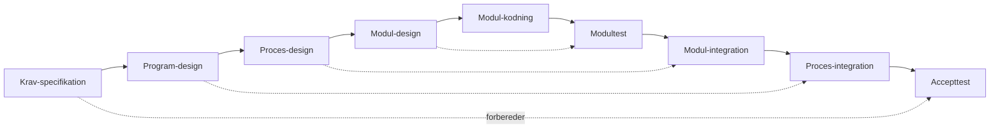

*Figuren er tegnet som et "V": udviklingsfaserne går ned ad venstre ben, testfaserne op ad højre ben. De stiplede pile viser hvilken udviklingsfase der forbereder hvilken testfase.*

*Figur 1: SPU's "V"-model for testaktiviteter.*

V-modellen kobler testfaser til udviklingsfaser:

- accepttesten forberedes ud fra **kravspecifikationen**,
- procesintegrationen ud fra **programdesignet**,
- modulintegrationen ud fra **procesdesignet**,
- modultesten ud fra **moduldesignet**.

*Figuren er en matrix: rækker = de fire tests, kolonner = projektets faser. Cellerne angiver hvilke testaktiviteter der ligger i hvilken fase. Kolonnerne Krav–Kodning udgør "Forberedelse", kolonnerne Modultest–Accept udgør "Udførelse".*

| Test \ Fase | Krav | Program | Proces | Modul | Kodning | Modultest | Modulint. | Procesint. | Accept |
|---|---|---|---|---|---|---|---|---|---|
| Accepttest | specificer | design | | | | | | | implementer, kør, evaluer |
| Procesintegration | | specificer | design | | | | | implementer, kør, evaluer | |
| Modulintegration | | | specificer | design | | | implementer, kør, evaluer | | |
| Modultest | | | | specificer, design | | implementer, kør, evaluer | | | |

*Figur 2: Testaktiviteter i projektets faser.*

Fordele ved at starte tidligt: uklarheder i specifikationerne opdages, projektplanlægningen bliver bedre, og testomgivelser/hjælpeprogrammer kan udvikles i tide.

> SPU s. 175–176

### Testteknikker

Teknikken afhænger af testniveau og af hvor meget man ved om programmet. Et modul kan ofte styres direkte på input og observeres fuldt; ved integrations- og accepttest kan der kun testes gennem de grænseflader, der er synlige i det samlede system.

#### Testomgivelser

Til test er tastatur, skærm, printer og disk praktisk, men målmiljøet har det ofte ikke — så må der bygges særlige testomgivelser.

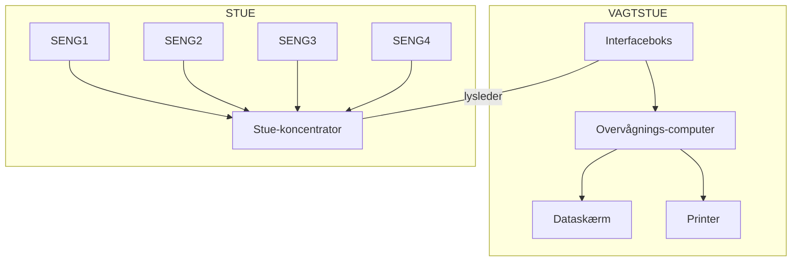

*Eksempel 1. Eksisterende testfaciliteter i PM (patientmonitorsystemet): en vagtstue med overvågningscomputer, dataskærm, printer og interfaceboks, forbundet via lysleder til en stuekoncentrator på stuen, som fire senge er koblet til.*

Forskellige tests stiller forskellige krav: nogle kræver præcis styring af alle input, andre realistiske omgivelser. Det er en afvejning mellem effektiv test og tiden det tager at bygge omgivelserne.

#### Interaktive testkørsler

Testeren påtrykker selv input og kontrollerer output; resultater logges på papir eller som udskrevne skærmbilleder. Fordel: hurtig at etablere. Ulempe: gentagelse bliver let upræcis.

#### Automatiske testkørsler

Testdata på filer → programmet kører automatisk; resultater opsamles på filer og sammenlignes med forventede. Særligt nyttigt når mange testcases skal gentages efter rettelser.

#### Test-instrumentering

Ekstra kode der kun bruges under test: udskriv variable, tæl gennemløb af bestemte programdele, stop ved bestemte betingelser. Typisk styret af test-flag, fx:

```
IF TEST1 THEN <udskriv en enkelt parameter>;
IF TEST3 THEN <udskriv en hel tabel>;
```

#### Debuggere

Symbolske debuggere: kør instruktion for instruktion, sæt stoppunkter, inspicér variable. Gode til *fejlfinding* — når en test allerede har vist, at programmet fejler.

> SPU s. 177–179

### Testbemanding

Programmøren er ikke nødvendigvis den bedste til at teste sit eget program alene — man overser egne fejl, fordi man ved hvad man *mente*. Andre end programmøren skal derfor med i planlægning og kontrol af testen. I små projekter: lad en kollega gennemgå testspecifikation, testdata og resultater. I større projekter: placér testansvaret tydeligt i projektplanen.

> SPU s. 180

## SPU-tests

Vejledningen omhandler fire testtyper: **modultest, modulintegration, procesintegration, accepttest**.

> SPU s. 181

### Modultests

Formål: vise om ét modul opfylder sin modulspecifikation. Modulet testes så isoleret som muligt, hvilket kræver en **testdriver** (kalder modulet) og **stubbe** (erstatter de moduler, modulet selv kalder).

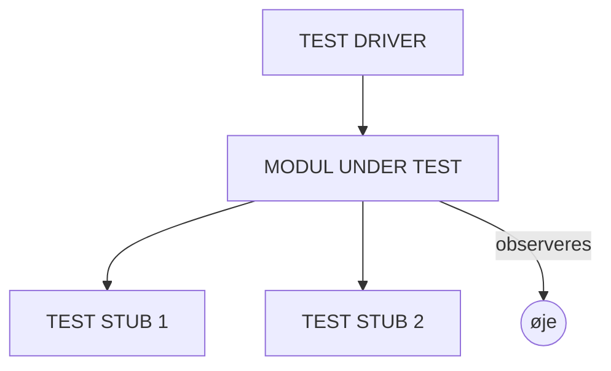

*Figur 3: Modultestomgivelser.*

At modulteste alle moduler er et stort arbejde; omfanget planlægges efter modulets kompleksitet, risikoen ved fejl, og hvor let modulet kan testes senere i det samlede system.

> SPU s. 181

### Integrationstests

To principielt forskellige aktiviteter: allerede testede enheder sættes sammen, *og* grænsefladerne mellem dem testes. Integrationstest er en test af samspillet — ikke en gentagelse af modultesten. Planlægning af integrationsrækkefølgen er en vigtig del af arbejdet. To grundformer:

**Trinvis integration.** Enheder tilføjes én ad gangen eller i små grupper, og hvert trin testes før næste. Fordel: fejl kan lokaliseres til det senest tilføjede.

**Samlet integration.** Alle enheder samles på én gang efter individuel test ("BIG BANG"-test). Virker hurtigt, men fejl er svære at lokalisere.

#### Modulintegration

Grundlaget er moduloversigten. Et modulhierarki kan integreres **bottom-up**, **top-down** eller som en kombination.

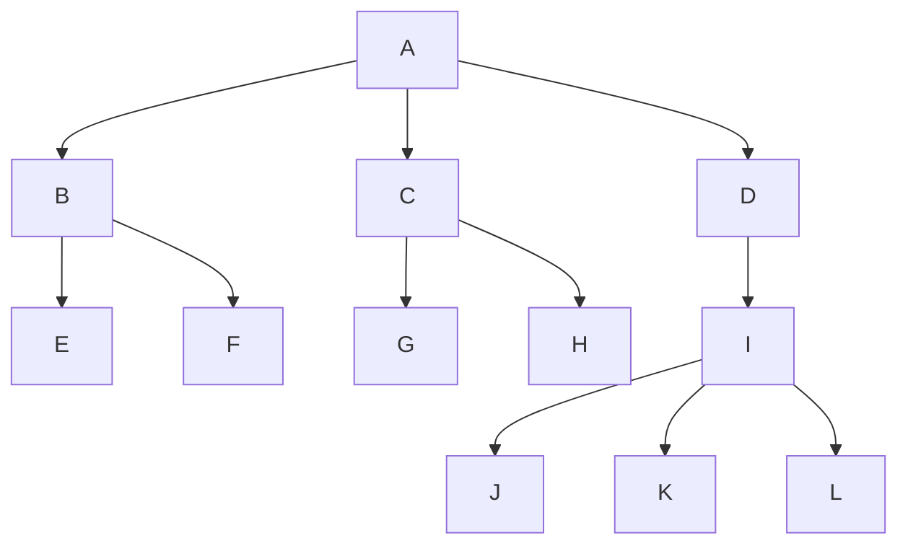

*Figur 4: Et eksempel på et modulhierarki, som skal trinvis integreres.*

*Bottom-up:* start med de nederste moduler og tilføj moduler højere oppe; drivere kalder de moduler, hvis rigtige overordnede modul endnu ikke er med.

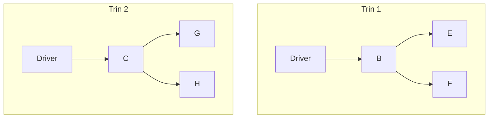

*Figur 5: To integrationstrin i en bottom-up-integration af modulhierarkiet i figur 4.*

*Top-down:* start med toppen og erstat manglende underordnede moduler med stubbe. Fordel: programstruktur og de øverste funktioner kan demonstreres hurtigt.

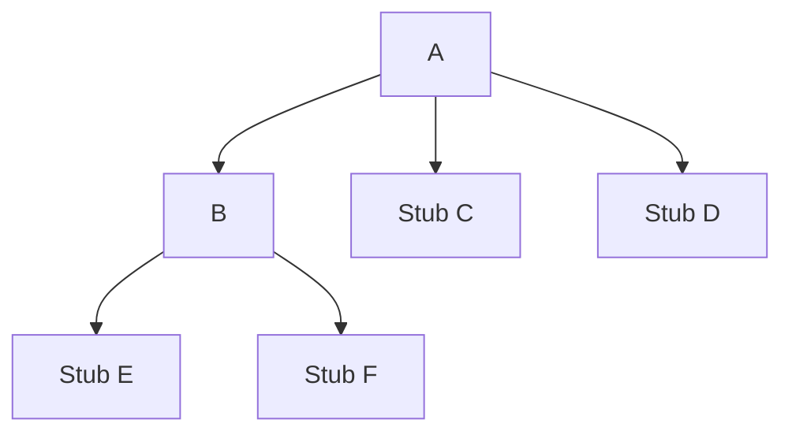

*Figur 6: Et integrationstrin i en top-down-integration af modulhierarkiet i figur 4.*

I praksis vælges ofte et kompromis. Valget afhænger af programmets struktur, hvilke moduler der er færdige først, om hardwaren er tilgængelig, testfaciliteterne, og om nogle funktioner er særligt vigtige at afprøve tidligt.

#### Procesintegration

Før processer integreres, bør hver proces være modultestet og modulintegreret. Procesintegration samler processerne og kontrollerer, at kommunikation og tidsmæssig samordning virker.

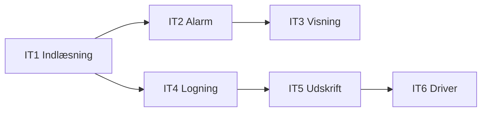

*Eksempel 2. Procesintegrationsplan for Patientmonitorsystemet (indgår i programdokumentationen): integrationstrin IT1–IT6 for processerne Indlæsning, Alarm, Visning, Logning, Udskrift og Driver.*

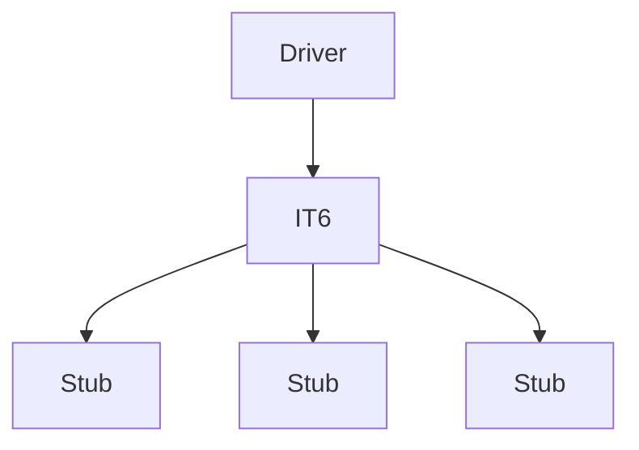

*Eksempel 3. Integrationstest af driver IT6 med den nødvendige driver og de nødvendige stubbe.*

> SPU s. 182–186

### Accepttest

Accepttesten skal vise, om systemet opfylder **kravspecifikationen**, og planlægges ud fra den og aftalerne med kunden. Selv hvis kunden ikke deltager i udarbejdelsen, bør projektgruppen formulere testen, så den kan bruges som afleveringsgrundlag — og gruppen bruger den selv til at afgøre, om produktet er klar.

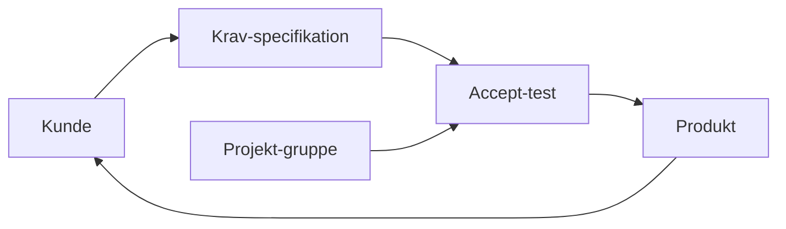

*Figur 7: Det er nødvendigt med et aftalegrundlag, som kan sikre at afleveringen af produktet kan ske til alles tilfredshed.*

Ud over funktionel test omfatter accepttesten test/demonstration af de ønskede kvalitetsfaktorer:

| Testtype | Spørgsmål |
|---|---|
| *Stress-test* | Virker programmet under de værst tænkelige påvirkninger? |
| *Volumentest* | Håndteres maksimalt input over lang tid? |
| *Brugertest* | Er systemet brugervenligt nok? |
| *Sikkerhedstest* | Kan systemet snydes? Er data sårbare? |
| *Test af ydeevne* | Overholdes svartidskrav, også ved spidsbelastning? |
| *Lagertest* | Bruges mere lager end estimeret? Hvor stor en procentdel er i brug? |
| *Konfigurationstest* | Fungerer systemet i andre konfigurationer (lagerstørrelse, inputenhed …)? |
| *Kompatibilitetstest* | Kører programmet på forskellige datamater? Erstatter det et gammelt program fuldt ud? |
| *Pålidelighedstest* | Særlige pålidelighedskrav — fx 48 timers drift uden fejl? |
| *Fejlbehandlingstest* | Kommer systemet korrekt ud af enhver fejlsituation (strømsvigt, fejl på ydre enheder …)? |

> SPU s. 187–189

## Testforberedelse og -udførelse

Modultest, integrationstest og accepttest bygges op af de samme aktivitetstyper: **specificer → design → implementer → kør → evaluer**. Forberedelsen (de tre første) ligger så tidligt som muligt; udførelsen i den egentlige testfase. Hver testtype har sit referencedokument:

| Testtype | Referencedokument |
|---|---|
| Accepttest | Kravspecifikation |
| Procesintegration | Programdesign (kap. 2, 3 og 4 i Programdokumentationen) |
| Modulintegration | Procesdesign (afsnit 6.4 ff. i Programdokumentationen) |
| Modultest | Modulspecifikation |

> SPU s. 190

### Specificer testemner

- **IDENTIFICER** testemner — de enkelte krav der skal testes — ved grundig gennemlæsning af grundspecifikationen med test for øje.
- **IDENTIFICER** uklarheder, modstridende krav og krav, der er svære eller umulige at teste.
- **SPECIFICER** testemnerne som en nummereret liste, hvor hvert emne kan spores tilbage til grundspecifikationen.

> **Eksempel 4.** Testemner til blackboxtest af modulet *IndlæsPatientVærdier*, udledt afsnit for afsnit af modulspecifikationen:
>
> | Kilde i modulspec. | Testemner |
> |---|---|
> | "Funktion" | TE1 patientværdier indlæses fra stuekoncentrator; TE2 alarm kan optræde ved 1., 2., 3. eller 4. læsning; TE3 tidspunkt registreres; TE4 patientværdier skaleres |
> | "Input" | TE5 sengenummer kan vælges (1–6); TE6 valg af patientværdier (TEMP, PULS, BPSYS, BPDIA); TE7 antal patientværdier der læses (1–4) |
> | "Output" | TE8 læste patientværdier returneres med tidsangivelse (1–250, 19.1–44.0); TE9 alarmtype returneres (ingen alarm, LINIEALARM1–3); TE10 modulet er en boolsk funktion, der returnerer alarm-status (TRUE/FALSE) |

> SPU s. 190–191

### Design testen

- **STRUKTURER** testen — skal den opdeles i flere selvstændige dele?
- **DESIGN** testomgivelser — hvordan påtrykkes input, hvordan observeres resultater?
- **IDENTIFICER** vanskeligheder med betydning for projektplanen (særlige hjælpeprogrammer, særligt udstyr).
- **DESIGN** testcases — testinput og forventet output for hver test.

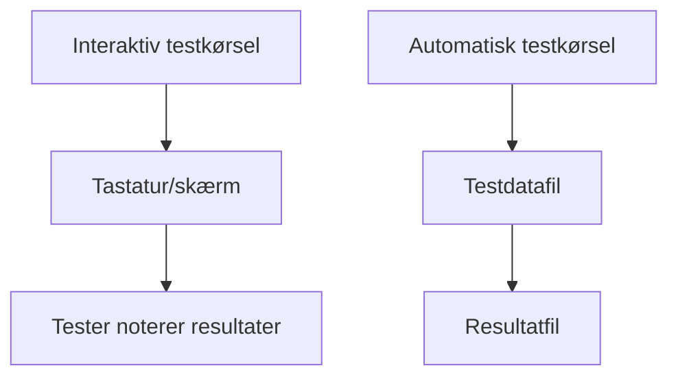

*Eksempel 5. Testomgivelser kan opbygges enten til interaktive testkørsler (tastatur/skærm, tester noterer resultater) eller til automatiske testkørsler (testdatafil → resultatfil).*

> SPU s. 192

### Implementer testcases og testomgivelser

- **IDENTIFICER** nye testemner, hvis implementationen afslører forhold, der ikke var synlige i grundspecifikationen.
- **UDFYLD** testcases med konkrete inputdata og forventede resultater.
- **SUPPLER** med testcases valgt ud fra kodens struktur (whiteboxtest).
- **BESKRIV** opbygning af testomgivelser og hvilke hjælpeprogrammer, drivere og stubbe der bruges.
- **CHECK** at alle nødvendige testfaciliteter findes.
- **BEGYND** på testrapporten.

> SPU s. 193

### Kør testen

- **KØR** testen som beskrevet i testspecifikationen og registrér resultaterne (log til disk/print hvis muligt).
- **NOTER** afvigelser fra den planlagte kørsel (tastefejl, strømsvigt, hjælpeprogram der ikke virker) i testrapporten.
- **REGISTRER** fundne fejl i problem-/ændringsrapporter, så de kan spores og behandles systematisk.

> SPU s. 193

### Evaluer testforløbet

Faktiske resultater sammenlignes med forventede. Evalueringen skal svare på: Blev testen kørt som planlagt? Stemmer resultaterne? Dækker testen de specificerede testemner? Skal der rettes fejl og køres nye tests? Skal testspecifikation eller testomgivelser ændres?

> SPU s. 194

## Udvælgelse af effektive testcases

Alle inputkombinationer kan ikke testes; kunsten er at vælge testcases med stor sandsynlighed for at afsløre fejl. To synsvinkler: **blackboxtest** og **whiteboxtest**.

*Figur: to kasser med Input-pil ind fra venstre og Output-pil ud til højre. Den øverste er helt sort og mærket BLACK BOX (programmets indre er usynligt). Den nederste er hvid, mærket WHITE BOX, og har et kryds tegnet indeni (programmets indre struktur er synlig).*

*Figur 8: Blackboxtest contra whiteboxtest.*

> SPU s. 195

### Design af testcases til blackboxtests

Blackboxtest = *funktionel test*: designet ud fra specifikationen uden hensyn til programmets indre struktur.

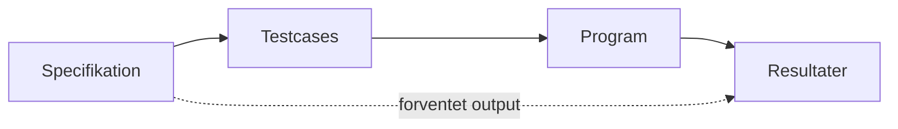

*Figur 9: Blackboxtest – funktionel afprøvning.*

Fremgangsmåde for en systematisk blackboxtest:

1. Find alle testemner i specifikationen.
2. Opdel input i **ækvivalensklasser**, der forventes behandlet ens.
3. Vælg både gyldigt og ugyldigt input.
4. Vælg **grænseværdier** — fejl findes ofte ved grænser.
5. **Fejlgætning** ud fra erfaring med tilsvarende programmer.
6. Husk specielle værdier: max, min, én over/under grænsen, nul som parameter, ASCII Null og Blank, tomme elementer.
7. Udarbejd de konkrete testcases.
8. Angiv forventet resultat for hver testcase.
9. Kontrollér at alle testemner er dækket.

Eksempel 6 (første trin i testdesignet for testemnerne "Puls" og "Valg af patientværdi"):

| Testemne | Arbejdstrin | Gyldigt input | Ugyldigt input |
|---|---|---|---|
| *Puls — digital 8-bits værdi indlæst fra stuekoncentratoren* | | | |
| Puls | Klassedeling | $0<x\leq250$ (T1) | $x=0$ (T2); $250<x<256$ (T3); intet nummer – ikke mulig |
| Puls | Grænseværdi | $x=1$ (T4); $x=2$ (T5); $x=250$ (T6); $x=249$ (T7) | $x=0$ (T2); $x=-1$ ikke mulig; $x=251$ (T8); $x=255$ (T9) |
| Puls | Fejlgætning | blank gyldig | Null ikke mulig; blank ikke mulig |
| *Valg af patientværdi — boolsk array med 4 parametre* | | | |
| Valg af patientværdi | Klassedeling | 0000 til 1111 (T1) | ikke mulig |
| Valg af patientværdi | Grænseværdi | 0000 (T2); 0001 (T3); 1110 (T4); 1111 (T5) | ikke mulig |
| Valg af patientværdi | Fejlgætning | 0001 (T6); 0010 (T7); 0100 (T8); 1000 (T9) | |

*Eksempel 6. Første trin i designet af tests til "Puls" og "Valg af patientværdi".*

> SPU s. 195–197

### Design af testcases til whiteboxtests

Whiteboxtest = *strukturel afprøvning*: designet ud fra programmets indre struktur, for at sikre at væsentlige dele af koden faktisk gennemløbes.

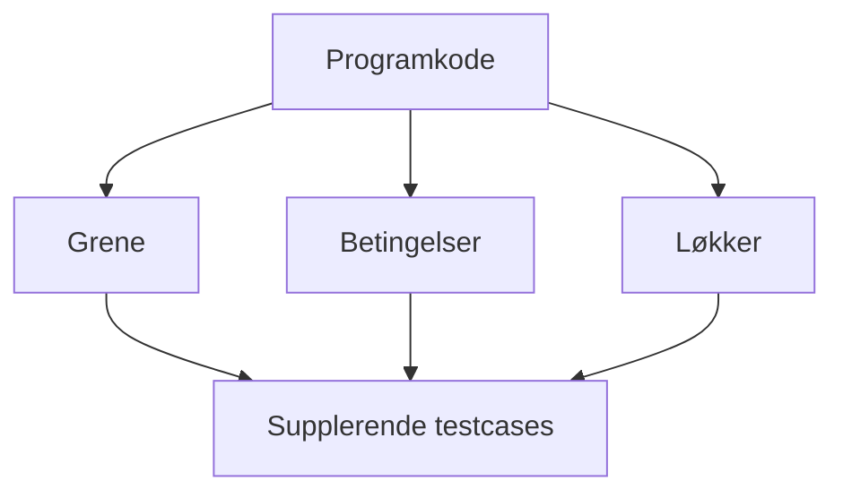

*Figur 10: Whiteboxtest – strukturel afprøvning.*

Typiske dækningskriterier: er alle instruktioner udført mindst én gang, er alle grene i hver beslutning taget, og har alle simple betingelser i sammensatte udtryk været både sande og falske — fx for udtryk som:

```
IF A AND B THEN ...
IF X > 0 THEN ...
```

Whiteboxtest erstatter ikke blackboxtest; den *supplerer*, fordi den afslører programdele, som de valgte testdata ikke berører. Testdækning kan måles automatisk med et værktøj, der registrerer gennemløbne instruktioner, grene og betingelser.

> SPU s. 198

### Strategi for udvælgelse af testdata

Design først blackboxtests ud fra specifikationen; supplér derefter med whiteboxtests ud fra programteksten. Ret fundne fejl og gentag relevante tests. Gem testdata, så testen kan gentages efter ændringer.

> SPU s. 199

## Testdokumentation

Testdokumentationen skal gøre det muligt at planlægge, gennemføre, gentage og vurdere testen. Et projekt kan have mange testspecifikationer og testrapporter.

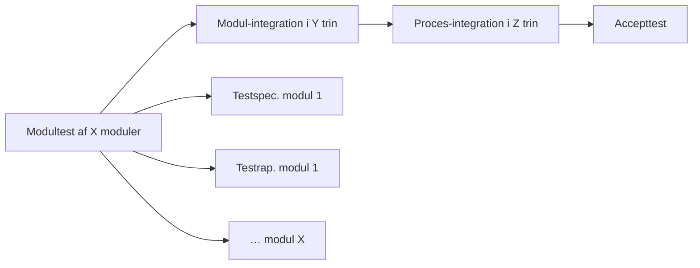

*Figur 11: Testdokumentation for et projekt.*

Et projekt kan altså indeholde testspecifikationer + testrapporter for hver modultest, for hvert modulintegrationstrin, for hvert procesintegrationstrin, samt én accepttestspecifikation + accepttestrapport. I SPU er kun accepttestdokumentationen selvstændige dokumenter; resten indgår som afsnit i programdokumentationen. Indholdsfortegnelserne beskrives i 6.2 og 6.3.

> SPU s. 200

### Referencedokumenter

Enhver test kontrollerer mod ét referencedokument: kravspecifikationen (accepttest), programdesignet (procesintegration), procesdesignet (modulintegration), modulspecifikationen (modultest).

> SPU s. 201

### Indholdsfortegnelse for en testspecifikation

Testspecifikationen beskriver hvad der testes, hvordan testen designes, implementeres og køres.

> **1. Indledning**
>   1.1 Formål
>   1.2 Referencer
>   1.3 Testens omfang og begrænsninger
>   1.4 Godkendelse
>
> **2. Testemner**
>
> **3. Testdesign**
>
> **4. Testimplementation**
>
> **5. Udførelse af test**
>
> **Bilag**

*Figur 12: Indholdsfortegnelse til en testspecifikation.*

#### Indledning

Hvordan dokumentet og testen hænger sammen med projektets øvrige aktiviteter.

**Formål.** Præcisering af formålet med den specificerede test.

**Referencer.** Identifikation af den grundspecifikation, testen er udledt af.

**Testens omfang og begrænsninger.** Hvilke programmer/moduler specifikationen dækker — og ikke dækker, hvis der kan være tvivl.

**Godkendelse.** Hvem er ansvarlig for frigivelse/aflevering, og hvilke kriterier afgør om testen er bestået. Et objektivt kriterium (fx "testspecifikationen er kørt igennem fejlfrit") forhindrer, at aflevering alene bestemmes af, at en dato er nået.

*Figur: tegneserie med to personer. Den ene udbryder "FINT, DET KØRER! – SÅ AFLEVERER VI!!", den anden svarer tøvende "DET VIRKER DA… … MEN JEG VED IKKE RIGTIG…". Mellem dem et udråbstegn.*

*Figur 13: Det er desværre ofte tidspunktet mere end objektive godkendelseskriterier, der bestemmer, når et produkt skal afleveres.*

#### Testemner

Alt det der skal testes — "testens kravspecifikation". Udfyldes ved analyse af grundspecifikationen (afsnit 1.2). Opstilles nummereret på listeform, hvert emne med reference til et enkelt afsnit i grundspecifikationen.

#### Testdesign

Overordnet beskrivelse af hvordan testen designes, så alle testemner testes hensigtsmæssigt: nedbrydning i velafgrænsede enkelt-tests, der kan specificeres uafhængigt og udføres i vilkårlig eller veldefineret rækkefølge. For hver test beskrives (verbalt eller med tegning af testomgivelserne) hvordan den tænkes udført, så godt som muligt på planlægningstidspunktet. Af hensyn til projektplanen identificeres behov for testprogrammer og hjælpeudstyr (stubbe, drivere, ekstra printer, patientsimulator …). Ud fra en blackbox-analyse beskrives for hver test de testcases der skal bruges, med både gyldigt og ugyldigt input.

#### Testimplementation

Svarende til testdesignet angives præcist hvordan gyldigt og ugyldigt input ser ud (fx *Patient: PETER HANSEN, Patientnummer 637*) og hvordan forventet output ser ud. Hvor resultater må variere inden for tolerancer, angives det. Ligger testdata på selvstændige filer, kan kapitlet reduceres til en reference til eller kopi af filerne. Testcases tilføjet for at nå et bestemt dækningskriterium mærkes separat, så formålet med hver testcase er sporbart.

#### Udførelse af test

For hver test en brugsanvisning: hvordan bygges testomgivelserne op, hvordan startes testen, hvordan køres den, hvordan observeres og opsamles resultater, hvordan afbrydes og genstartes den midlertidigt, hvordan afsluttes den normalt.

#### Bilag

Faciliteter der bruges specielt i denne test, fx beskrivelse af og kildetekst til testprogrammer.

> SPU s. 201–203

### Indholdsfortegnelse for en testrapport

Testrapporten behøver ikke være et selvstændigt dokument — den kan være en kopi af testspecifikationen påført testdato, kommentarer og konklusion. En egentlig testrapport har følgende indhold:

> **1. Indledning**
>   1.1 Reference
>   1.2 Identifikation
>
> **2. Testresultater**
>
> **3. Afvigelser og kommentar**
>   3.1 Afvigelser fra normal afvikling
>   3.2 Problem/ændringsrapporter
>
> **4. Konklusion**

*Figur 14: Indholdsfortegnelse til en testrapport.*

#### Indledning

**Reference.** Reference til testspecifikationen.

**Identifikation.** Den testede software identificeres — nu med faktisk versionsnummer, opbevaringsmedium osv. De faktiske testomgivelser identificeres så præcist, at de kan genetableres.

#### Testresultater

Testresultaterne registreres; præsentationsform afhænger af systemet. Hver test refererer tilbage til et underpunkt i testspecifikationen.

#### Afvigelser og kommentarer

**Afvigelser fra normal afvikling.** Fx sekvenser der er kørt om på grund af trivielle operatørfejl.

**Problem/ændringsrapporter.** Fejl påvist ved uoverensstemmelse mellem forventet og opnået resultat registreres på den fortrykte formular fra *Vejledning i Konfigurationsstyring*; en kopi indsættes her.

#### Konklusion

Hvordan gik testen? Er softwaren i orden, eller skal alt laves om? Kan en midlertidig version evt. frigives?

> SPU s. 204–205

### Testdokumentationens udvikling gennem faserne

Testaktiviteterne udføres løbende gennem projektet, og dokumentationen udarbejdes tilsvarende. Figur 15 kobler aktiviteterne (kap. 4) til dokumentationen (kap. 6). For integrations- og modultests indgår dokumentationen i programdokumentationen; accepttestdokumentationen er selvstændige dokumenter på linje med kravspecifikationen.

*Figuren viser de fem testaktiviteter som en lodret kæde (SPECIFICER → DESIGN → IMPLEMENTER → KØR → EVALUER) med den tilhørende dokumentation ud for hver:*

| Testaktivitet | Dokumentation der udarbejdes |
|---|---|
| SPECIFICER | Testspecifikation: Kap. 1 Indledning, Kap. 2 Testemner |
| DESIGN | Testspecifikation: Kap. 3 Testdesign |
| IMPLEMENTER | Testspecifikation: Kap. 4 Testimplementation, Kap. 5 Udførelse af test |
| KØR | Testrapport: Kap. 1 Indledning, Kap. 2 Testresultater, Kap. 3 Afvigelser og kommentarer, Kap. 4 Konklusion |
| EVALUER | Projektændring opdateres. |

*Figur 15: Tidsmæssig sammenhæng mellem testaktiviteter og udarbejdelsen af testdokumentationen.*

> SPU s. 206–207
