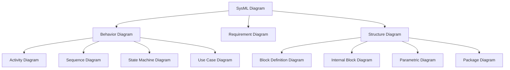
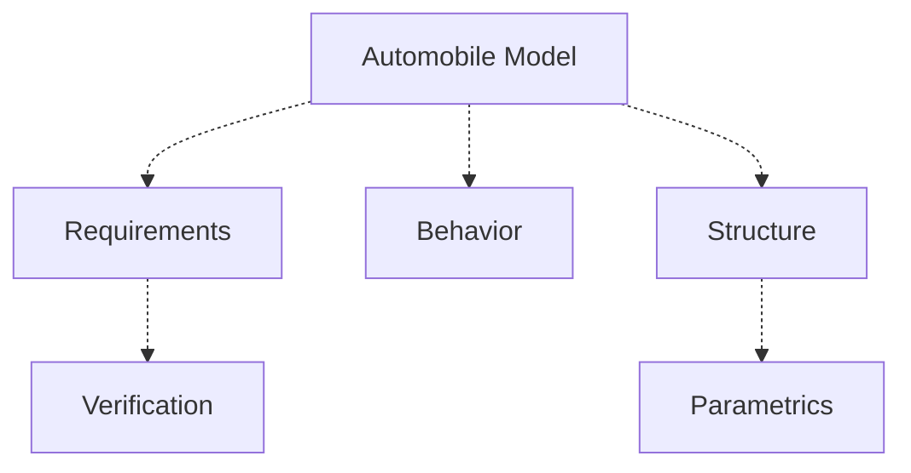
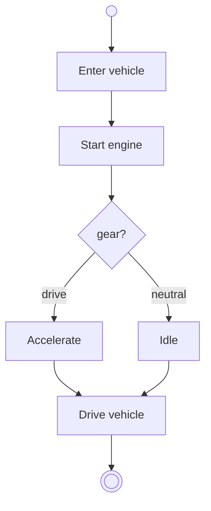
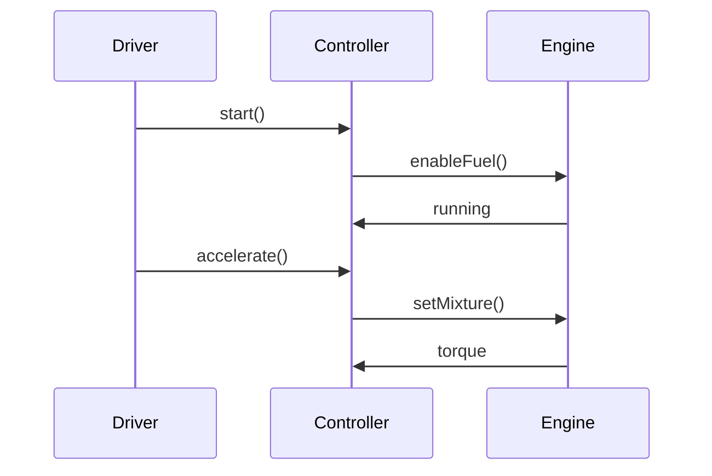
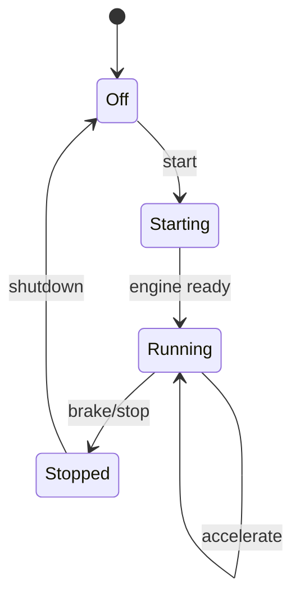
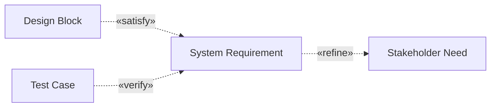

# SysML Language Overview (Friedenthal, Moore & Steiner, kap. 3)

## Metadata

| Felt | Værdi |
|---|---|
| **Kursus** | SWISE-01 Indledende System Engineering |
| **Kilde** | Sanford Friedenthal, Alan Moore, Rich Steiner, *A Practical Guide to SysML*, Morgan Kaufmann, ISBN 978-0-123-74379-4 — Chapter 3 *SysML Language Overview*, pp. 29–60 (ISE Book-kompendiet s. 77–109; LaTeX-transskription `05_Friedenthal_Ch3_SysML.tex`) |
| **Type** | lærebogskapitel |
| **Sprog** | engelsk |
| **Emner dækket** | SysML formål og de ni diagramtyper (req, act, sd, stm, uc, bdd, ibd, par, pkg), SysML i MBSE, automobile-eksemplet: requirement diagram, use cases, sequence/activity/state machine, context IBD, BDD-hierarki, IBD for power subsystem, parametrics, allocation, traceability, package diagram, model interchange (XMI) |

> Gengivelsen er en kondenseret parafrase i egne ord (alle afsnit og figurer er med), ikke en ordret afskrift. Transskriptionen i `.tex` er selv en *forenklet rekonstruktion* af bogens figurer og tekst; afsnitsteksten er derfor kort i forhold til bogen. Figurplaceringen følger tex-filen — bemærk at Figure 3.5 (activity) står under sekvensdiagram-afsnittet og Figure 3.7 (state machine) under activity-afsnittet, mens afsnittene *State Machine Diagram for Drive Vehicle States*, *Vehicle Context Using an IBD* og *Activity Diagram for Provide Power* er uden figur i kilden.

---

*Friedenthal, Moore & Steiner, ch. 3, pp. 29–60.*

## SysML Purpose and Key Features

The chapter walks through SysML by applying it to the automobile design problem from Chapter 1 (details in Part II, larger method examples in Part III).

SysML is a general-purpose *graphical* modeling language for analysis, specification, design, verification and validation of complex systems — hardware, software, data, personnel, procedures, facilities and other natural or man-made elements. It is meant for specifying and architecting systems and their components; the components are then designed in domain-specific languages (UML for software, VHDL for hardware, …).

What SysML can express about a system, component or other entity:

- structure — composition, interconnection, classification;
- behavior — function-based, message-based, state-based;
- constraints on physical and performance properties;
- allocations between behavior, structure and constraints;
- requirements and their relationships to other requirements, design elements and test cases.

> Friedenthal s. 29–30

## SysML Diagram Overview

Nine diagram types. Each is a *view* of the underlying model repository and restricts which elements/notation may appear; a diagram is never the whole model. Tabular views (e.g. allocation tables) can complement the diagrams.

*Behavior Diagram og Structure Diagram er abstrakte kategorier (generaliseringer af SysML Diagram); de konkrete diagramtyper er bladene.*

*Figure 3.1: SysML diagram taxonomy.*

| Diagram | Kind | Represents |
|---|---|---|
| Requirement diagram (req) | requirements | text-based requirements and their relations to other requirements, design elements and test cases → traceability |
| Activity diagram (act) | behavior | ordering of actions driven by inputs, outputs and control; how actions transform inputs to outputs |
| Sequence diagram (sd) | behavior | behavior as a sequence of messages exchanged between parts |
| State machine diagram (stm) | behavior | states of an entity and event-triggered transitions between them |
| Use case diagram (uc) | behavior | functionality as how external actors use the system to reach goals |
| Block definition diagram (bdd) | structure | blocks and their composition and classification |
| Internal block diagram (ibd) | structure | interconnection and interfaces between the parts of a block |
| Parametric diagram (par) | structure | constraints on property values (e.g. $F = m \cdot a$) for engineering analysis |
| Package diagram (pkg) | structure | organization of the model into packages of model elements |

> Friedenthal s. 30–32

## Using SysML in Support of MBSE

SysML captures modeling information for an MBSE approach *without prescribing a method*. The method chosen decides which activities are done, in what order, and which artifacts represent the system — e.g. structured analysis (decompose functions, allocate to components) or a use-case-driven approach (derive functionality from scenarios and interactions among parts).

A typical iteration of specify-and-design activities, in language terms:

1. Capture/analyze black-box system requirements: text requirements in a requirements-management tool → import into the SysML tool; top-level functionality as use cases; trace use cases to requirements; model scenarios as activity/sequence/state machine diagrams; build the system context diagram; identify system test cases for verification.
2. Develop candidate architectures satisfying the requirements: decompose with bdd; define interactions among parts with act/sd; define interconnections with ibd; engineering and trade-off analysis with par; specify component requirements and trace them to system requirements.
3. Verify that the design satisfies the requirements by executing system-level test cases.

Configuration management, risk management and other SE activities run alongside.

> Friedenthal s. 32–33

## A Simple Example Using SysML for an Automobile Design

The example shows at least one diagram of each of the nine types, highlighting selected language features only. Diagram order reflects one typical model-based approach; it varies with process and method.

> Friedenthal s. 33

### Example Background and Scope

A simplified automobile design: marketing wants better acceleration and fuel efficiency. A trade-off analysis compares alternative configurations — 4-cylinder vs. 6-cylinder engines — against the acceleration and fuel-efficiency requirements. The design also includes a controller with software to manage the fuel–air mixture for efficiency and performance. Only enough of the design is modeled to support the initial trade-off and demonstrate the language.

### Problem Summary

The automobile is modeled as a system with external users and environment: the driver commands the vehicle through controls, the vehicle interacts with road and surroundings, and engine and controller cooperate to produce propulsion. The example is deliberately small but touches requirements, behavior, structure, parametrics, allocation and packaging.

> Friedenthal s. 33–34

### Capturing the Automobile Specification in a Requirement Diagram

The text specification is captured as requirement elements, giving each requirement model identity so it can be related to other requirements, design elements, rationale and test cases.

*Pakkerne i automobile-modellen; stiplede pile = afhængigheder (containment/import) mellem pakkerne.*

*Figure 3.2: Automobile model package organization.*

### Defining the Vehicle and Its External Environment Using a Block Definition Diagram

The bdd establishes the main blocks of the automobile domain and how vehicle, driver, road and external environment relate.

*Requirement diagram. Fire «requirement»-blokke og én «testCase»:*

| Element | id | text |
|---|---|---|
| «requirement» Vehicle Requirement | R0 | The automobile shall provide transportation with improved performance and fuel efficiency. |
| «requirement» Acceleration | R1 | The vehicle shall meet the acceleration target. |
| «requirement» Fuel Economy | R2 | The vehicle shall meet the fuel-efficiency target. |
| «requirement» Emissions | R3 | The vehicle shall satisfy emission constraints. |
| «testCase» Vehicle Road Test | — | verify acceleration and fuel economy |

*Relationer: Vehicle Requirement* contain *Acceleration, Fuel Economy og Emissions. Vehicle Road Test* «verify» *Acceleration og* «verify» *Fuel Economy.*

*Figure 3.3: Automobile requirements.*

### Use Case Diagram for Operate Vehicle

Use cases capture the black-box services expected of the automobile. The driver is the primary actor; maintainer, fuel source and external environment are further actors. Use cases bridge stakeholder goals to scenarios and test cases.

*Use case diagram med systemgrænse "Automobile". Fire use cases inden for grænsen: Drive Automobile, Start Vehicle, Refuel, Maintain Vehicle. To aktører (stick figures) uden for grænsen:*

| Aktør | Associerede use cases |
|---|---|
| Driver | Drive Automobile, Start Vehicle, Refuel |
| Maintainer | Maintain Vehicle |

*Figure 3.4: Operate Vehicle use case diagram.*

### Representing Drive Vehicle Behavior with a Sequence Diagram

Drive Vehicle can be shown as a sequence diagram: the driver–vehicle interaction over time.

*Activity diagram: initial node → Enter vehicle → Start engine → decision node "gear?" med to udgange (drive → Accelerate, neutral → Idle) → begge fører til Drive vehicle → final node.*

*Figure 3.5: Control Power activity diagram.* *(placeret her i tex-kilden)*

### Referenced Sequence Diagram to Start Vehicle

The Start Vehicle interaction is *referenced* from Drive Vehicle: the higher-level scenario stays readable while the start sequence is modeled separately.

*Figure 3.6: Referenced Start Vehicle sequence diagram.*

### Control Power Activity Diagram

Continuous behavior such as power control suits an activity diagram; actions are partitioned between driver and vehicle responsibilities and linked by control and object flows.

*Figure 3.7: Drive Vehicle state machine diagram.* *(placeret her i tex-kilden)*

### State Machine Diagram for Drive Vehicle States

The state machine shows how the vehicle changes state on events such as start, accelerate, brake and shutdown (see Figure 3.7 above).

### Vehicle Context Using an Internal Block Diagram

The context ibd identifies the external actors and environmental blocks that interact with the vehicle, defining the system boundary and external interfaces. *(No figure in the tex source.)*

### Vehicle Hierarchy Represented on a Block Definition Diagram

The bdd defines the structural vocabulary: the automobile block is composed of engine, transmission, controller, fuel system, wheels and driver interface. Composition captures part–whole structure; generalization captures classification.

*Block definition diagram (bdd). Blokke med values (2. rum) og operations (3. rum):*

| Blok | Values | Operations |
|---|---|---|
| Automobile | mass, fuelEconomy | accelerate(), brake() |
| Engine | displacement, power | produceTorque() |
| Controller | softwareVersion | controlMixture() |
| Transmission | gearRatio | transmitTorque() |
| 4-Cylinder Engine | configuration=4 cyl | — |
| 6-Cylinder Engine | configuration=6 cyl | — |

*Relationer:*
- *Komposition (sort ruder-ende ved Automobile): Automobile ◆— engine : Engine, Automobile ◆— controller : Controller, Automobile ◆— transmission : Transmission.*
- *Generalisering (hul trekant ved Engine): 4-Cylinder Engine —▷ Engine, 6-Cylinder Engine —▷ Engine.*

*Figure 3.8: Vehicle hierarchy block definition diagram.*

### Activity Diagram for Provide Power

Provide Power refines the power behavior, showing how inputs, outputs and control move through the functional decomposition. *(No figure in the tex source.)*

### Internal Block Diagram for the Power Subsystem

An ibd shows how a block's parts are interconnected and what flows over the connectors: the controller talks to the engine and receives driver commands; the engine delivers torque through the transmission to the wheels.

*Internal block diagram med ramme `ibd [Block] Automobile`. Seks parts: driver interface, controller, engine, fuel system, transmission, wheels. Connectors med item flows:*

| Fra part | Til part | Item flow |
|---|---|---|
| driver interface | controller | commands |
| controller | engine | fuel-air control |
| fuel system | engine | fuel |
| engine | transmission | torque |
| transmission | wheels | wheel torque |

*Figure 3.9: Power subsystem internal block diagram.*

### Defining the Equations to Analyze Vehicle Performance

Parametric diagrams bind property values to engineering equations. Here: constraints on acceleration, mass, force, power and fuel efficiency, used to compare candidate architectures.

*Parametric diagram. To constraint blocks (afrundede) og bindinger til value properties (firkanter):*

| Constraint | Bundne parametre/properties |
|---|---|
| `F=m*a` | force, mass, acceleration |
| `fuelUsed = f(power)` | power, fuel economy |

*De to constraint blocks er desuden forbundet indbyrdes (F=m*a — fuelUsed).*

*Figure 3.10: Vehicle acceleration analysis parametric diagram.*

### Analyzing Vehicle Acceleration Using the Parametric Diagram

The acceleration analysis binds vehicle properties to constraint-block parameters, so candidate engine/drivetrain configurations can be evaluated.

### Analysis Results from Analyzing Vehicle Acceleration

Results are compared with the acceleration and fuel-efficiency requirements. A result is not just a number — it becomes model information that supports design decisions.

### Using the Vehicle Controller to Optimize Engine Performance

The controller and its software are in the model to optimize engine performance by controlling the fuel–air mixture and related engine behavior.

> Friedenthal s. 34–52

### Specifying the Vehicle and Its Components

Allocations relate requirements, behavior, structure and constraints: a function allocated to a component, a constraint allocated to a physical property, a test verifying a requirement.

*Allokerings-/traceability-relationer (stiplede pile med stereotype):*

| Fra | Relation | Til |
|---|---|---|
| Provide Propulsion (function) | «allocate» | Engine |
| Acceleration Constraint | «satisfy» | Acceleration Requirement |
| Road Test | «verify» | Acceleration Requirement |
| Provide Propulsion | «trace» | Acceleration Requirement |

*Figure 3.11: Vehicle and component allocation relationships.*

### Requirements Traceability

End-to-end traceability: stakeholder requirements are refined into system requirements; system requirements are satisfied by design blocks and constraints; tests verify requirements. This supports impact analysis when a requirement, design decision or test changes.

*Figure 3.12: Requirement diagram showing the traceability of the Max Acceleration requirement.*

### Package Diagram for Organizing the Model

The package diagram shows how model elements are grouped into packages and how elements in one package relate to elements in another (cf. Figure 3.2). The tex source places two further figures here:

*Trade-off mellem to kandidatarkitekturer (afrundede kasser) mod tre kriterier:*

| Arkitektur | Kriterium | Vurdering |
|---|---|---|
| 4-cylinder architecture | fuel economy | better |
| 4-cylinder architecture | cost | (pil, ingen mærkat) |
| 6-cylinder architecture | acceleration | better |
| 6-cylinder architecture | cost | (pil, ingen mærkat) |

*Figure 3.13: Candidate architecture trade-off.*

*To «requirement»-blokke og to test cases (afrundede):*

| Element | Indhold |
|---|---|
| «requirement» Acceleration | 0–60 mph target |
| «requirement» Fuel Economy | mileage target |
| Acceleration Test | test case |
| Fuel Economy Test | test case |

*Relationer: Acceleration Test* «verify» *Acceleration; Fuel Economy Test* «verify» *Fuel Economy; Acceleration Test* «trace» *Fuel Economy Test.*

*Figure 3.14: Test cases verify requirements.*

### Model Interchange

A SysML model in a repository can be exported/imported by any SysML-compliant tool via **XMI** (XML Metadata Interchange), so other XMI-capable tools can exchange the data — e.g. exporting parts of the model to a UML tool for controller-software development, importing/exporting requirements with a requirements-management tool, or exchanging parametric diagrams with engineering-analysis tools. Seamless interchange depends on model quality and tool implementation, and keeps improving.

> Friedenthal s. 53–58

## Summary

SysML is a general-purpose graphical language for systems that may include hardware, software, data, people, facilities and other elements of the physical environment. It models requirements, structure, behavior and parametrics for a robust description of a system, its components and its environment. Its semantics allow an *integrated* model: elements on one diagram relate to elements on others, and the diagrams capture and view repository information for specification, design, analysis and verification. Repository data can be exchanged via XMI and other mechanisms. SysML is a critical enabler of MBSE and works with many processes and methods — but effective use still requires a well-defined MBSE method. The automobile example illustrates one such method; Part III has more.

> Friedenthal s. 59

## Questions

Eleven end-of-chapter questions (paraphrased): which aspects of a system SysML can represent; what each of the nine diagram types is used for (requirement, activity, sequence, state machine, use case, block definition, internal block, parametric, package); and what the primary unit of structure in SysML is (the *block*).

> Friedenthal s. 60
