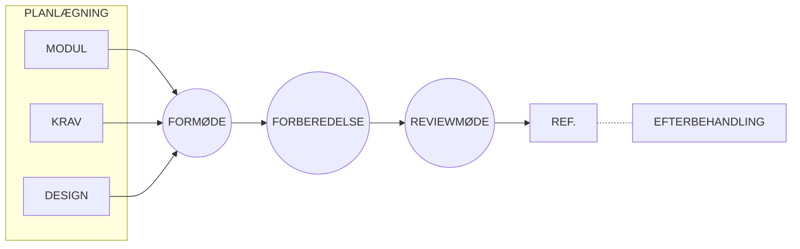

# Vejledning i review (SPU)

## Metadata

| Felt | Værdi |
|---|---|
| **Kursus** | SWISE-01 Indledende System Engineering |
| **Kilde** | Stephen Biering-Sørensen, Finn Overgaard Hansen, Susanne Klim og Preben Thalund Madsen: *Struktureret Program-Udvikling (SPU)*, Teknisk Forlag, ISBN 87-571-1046-8. "Vejledning i review", s. 215–236. Kompendie-kapitel 06 (`06_Vejledning_review.tex` + spillover `07_to_06.tex`) |
| **Type** | lærebogskapitel |
| **Sprog** | dansk |
| **Emner dækket** | Formelle reviews: komponenter (materiale, deltagere, resultat), de fem faser (planlægning, formøde, forberedelse, reviewmøde, efterbehandling), roller (forfatter, reviewer, reviewleder, referent, tilhører), regler for reviewere, tidsforbrug, varianter (uformelle reviews, korrekturlæsning, tekniske gennemgange, kodegranskning, inspektioner) |

> Gengivelsen følger kapitlets struktur afsnit for afsnit med alle lister, tabeller, tal og regler. Løbende prosa er sammenfattet, ikke citeret ordret; den ordrette tekst findes i `.tex`-kilden.

---

## Indhold

| Afsnit | Side (SPU) |
|---|---|
| 1. Indledning | 217 |
| 1.1 Reviewets komponenter | 218 |
| 1.2 Reviewets faser | 219 |
| 2. Planlægning | 220 |
| 2.1 Fastsættelse af tidspunkt | 220 |
| 2.2 Udvælgelse af deltagere | 221 |
| 2.3 Klargøring af dokumentet | 223 |
| 2.4 Fremfinding af materiale | 223 |
| 2.5 Indkaldelse | 224 |
| 3. Formøde | 225 |
| 3.1 Reviewets formål | 225 |
| 3.2 Deltagernes roller | 225 |
| 3.3 Overordnet gennemgang af produktet | 226 |
| 3.4 Overordnet gennemgang af dokumentet | 226 |
| 4. Forberedelse | 227 |
| 5. Reviewmøde | 228 |
| 5.1 Reviewmødets forløb | 229 |
| 5.2 Andre forløb | 229 |
| 5.3 Reviewernes opgaver | 231 |
| 5.4 Reviewlederens opgaver | 232 |
| 5.5 Referentens opgaver | 232 |
| 5.6 Tilhørernes opgaver | 232 |
| 6. Efterbehandling | 233 |
| 6.1 Referat | 233 |
| 6.2 Opfølgning | 233 |
| 6.3 Registrering af tidsforbrug | 233 |
| 7. Variationer af reviewteknikken | 234 |
| 7.1 Uformelle reviews | 234 |
| 7.2 Korrekturlæsning | 234 |
| 7.3 Tekniske gennemgange | 235 |
| 7.4 Kodegranskning | 235 |
| 7.5 Inspektioner | 235 |
| 8. Vejledningens hovedpunkter | 236 |
| Litteraturliste | 237 |

## 1. Indledning

**Definition.** Et review er et møde, hvor personer uden for projektet ("reviewere") fremlægger deres kritik af et dokument.

Dokumenter der kan reviewes (dvs. stort set alt skriftligt materiale i projektet, også ikke-tekniske dokumenter som projektgrundlag):

- kravspecifikationer
- testspecifikationer
- program- og procesdesign
- modulspecifikationer
- kildetekster

Hvornår i udviklingsforløbet der holdes review beskrives i *Vejledning i struktureret programudvikling*. Reviews lægges typisk ved milepæle, fx ved afslutning af en fase.

**Formål:** dels at finde *fejl og mangler* i dokumentet, dels at påpege hvad der er godt (*fortræffeligheder*).

Et review kan desuden have til formål at godkende/forkaste dokumentet. Forkastes det, rettes fejlene og der holdes nyt review. Det almindelige er dog, at reviewet ikke ender med "karaktergivning", men blot konstaterer fejl og mangler og overlader beslutningen om dokumentets videre skæbne til projektgruppen.

*Figur: "FRISKE ØJNE" – illustration af otte øjne.*

Hvorfor virker teknikken? Dokumentet ses med *friske øjne* — det er lettere at finde fejl i andres dokumenter end i sit eget.

Biprodukt: *uddannelseseffekten*. Reviewerne lærer af at se andres måde at gøre tingene på; forfatteren lærer ved at blive gjort opmærksom på oversete problemer.

Varianter af review (alle anvendelige i projektarbejde; behandles i kapitel 7 — vejledningen fokuserer på det formelle review):

- uformelle reviews
- korrekturlæsning
- tekniske gennemgange
- kodegranskning
- inspektioner

De følgende fem kapitler dækker hver sin fase af det formelle review:

- planlægning
- formøde
- forberedelse
- reviewmøde
- efterbehandling

> SPU s. 217

### 1.1 Reviewets komponenter

Tre komponenter: *materialet*, *deltagerne* og *resultatet*.

#### Materialet

Skriftligt materiale, der skal foreligge:

- **dokumentet** — den specifikation eller kildetekst, der reviewes
- **baggrundsmateriale** — den information, der er nødvendig for at forstå dokumentet
- **en standard** for dokumentets udformning og indhold (retningslinjer for hvordan dokumentet skal se ud; ikke en absolut nødvendighed)
- **checklister** (hvis de findes og ikke allerede er del af standarden)

#### Deltagerne

| Rolle | Funktion |
|---|---|
| **Forfatteren** | den/de person(er) der har skrevet dokumentet |
| **Reviewerne** | gennemgår dokumentet for at finde fejl, mangler og fortræffeligheder |
| **Reviewlederen** | står for det praktiske: indkaldelse, kopiering og uddeling af materiale, mødeledelse på formøde og reviewmøde |
| **Referenten** | noterer kritikpunkterne på reviewmødet; normalt forfatteren selv |
| **Tilhørerne** | typisk folk fra projektgruppen; også folk fra andre projekter, der vil lære teknikken før de selv skal deltage |

#### Resultatet

Det synlige resultat er **referatet** med reviewernes kritik, evt. også mødets *godkendelse* eller *forkastelse* af dokumentet. Skrives af referenten.

> SPU s. 218

### 1.2 Reviewets faser

| Fase | Indhold |
|---|---|
| *Planlægning* | deltagere udvælges, materiale gøres klar |
| *Formøde* | forfatteren præsenterer dokumentet; formål præciseres; forløb fastlægges |
| *Forberedelse* | reviewerne gennemgår hver for sig dokumentet kritisk |
| *Reviewmøde* | reviewerne fremlægger deres kritik |
| *Efterbehandling* | referat udgives; dokumentet rettes for påpegede fejl og mangler |

*Figur: Reviewets faser.*

> SPU s. 219

## 2. Planlægning

Aktiviteter i planlægningsfasen:

- fastsættelse af tidspunkt for review
- udvælgelse af deltagere
- klargøring af dokument
- fremfinding af materiale
- indkaldelse

### 2.1 Fastsættelse af tidspunkt

Der planlægges dato, klokkeslet og varighed.

#### Dato

- Reviews skal indgå i projektplanen fra starten, men det præcise tidspunkt fastsættes af **forfatteren**: dokumentet må ikke sendes til review *før det er færdigt*. Review af et halvfærdigt dokument giver intet — højst irritation over fejl forfatteren allerede kender.
- Udskyd ikke et review fordi der "ikke er tid lige nu". Projektet gør sig selv en bjørnetjeneste ved at arbejde videre på et fejlbehæftet dokument.
- Forfatteren må gerne arbejde videre på dokumentets *efterfølger* (fx kildeteksten, hvis dokumentet er modulspecifikationen) under forberedelsesfasen — men husk at rette de påpegede fejl også i efterfølgeren.

#### Klokkeslet

Læg reviewet først på formiddagen, fx kl. 9.30–11.30, hvor folk er mest oplagte.

*Figur: Klokkeslet – tegning af et ur.*

#### Reviewmødets varighed

**Aldrig længere end 2 timer.** Erfaringen viser at koncentrationen falder væsentligt efter 2 timer. Er dokumentet for stort, deles reviewet over flere dage. Undtagelse: udenbys reviewere — så holdes i stedet gode pauser med passende mellemrum.

> SPU s. 220

### 2.2 Udvælgelse af deltagere

- Find deltagerne så tidligt som muligt (helst allerede når reviewet planlægges i projektplanen), så de kan indpasse det i egne tidsplaner.
- **Ledelsen deltager ikke.** Det er *dokumentet*, der reviewes, ikke *forfatteren*. Med ledelsen til stede fokuseres der uundgåeligt på forfatteren, som går i forsvarsposition i stedet for at lægge dokumentet åbent frem — i yderste konsekvens vil ingen frivilligt lade deres dokument reviewe.
- Ved review af kravspecifikationer kan repræsentanter for kunden, salgsafdelingen eller andre relevante afdelinger være gode reviewere.

*Figur: Reviewets deltagere – fire tændstikmænd: REVIEWLEDER, REVIEWERE, REFERENT, og "LEDELSEN DELTAGER IKKE" (overstreget).*

#### Reviewlederen

Udvælges først. Udpeges af ledelsen i samarbejde med projektgruppen. Kan være en anden projektdeltager, men bedst en person uden for projektgruppen (lettere at være neutral).

Reviewlederen er reviewets "praktiske gris": skal være god organisator og god mødeleder — styrke til at afbryde begyndende skænderier og personlighed til at skabe god stemning.

#### Reviewerne

Findes af reviewlederen i samarbejde med ledelsen. Krav til reviewere:

- teknisk kompetente inden for området
- diplomatisk sans
- kunne være i stue sammen

Tre modeller for udvælgelse:

1. **Vagtordning** — fx 4 personer har "review-vagten" i 3 måneder; reviewlederen har da aldrig problemer med at finde reviewere, og alle software-folk med de rette kvalifikationer kommer til.
2. **Faste reviewere for et helt projekt** — samme personer reviewer kravspecifikation, program-/procesdesign, modulspecifikationer osv. Fordel: de skal kun sætte sig ind i dokumentets omgivelser første gang.
3. **Fra gang til gang** — mere arbejde for reviewlederen, men man kan "håndplukke" folk med interesse for netop emnet. Den der skal arbejde videre med dokumentet i næste fase er en god kandidat: man er mere motiveret for at finde fejl i noget, man selv skal overtage.

Antal: normalt **to** reviewere; i enkelte tilfælde flere (fx kravspecifikation, hvor flere synspunkter ønskes). Ikke mere end 3–4: engagementet falder ("de andre finder nok fejlene"), og 2-timers-grænsen bliver svær at holde. To grundige reviewere finder som regel fejlene, manglerne og fortræffelighederne alligevel.

#### Referenten

Kan være en projektdeltager, men i praksis er forfatteren selv en god referent.

#### Tilhørerne

Dukker op af sig selv, men reviewet skal annonceres ordentligt. Personer, der ikke har deltaget i review før, bør inviteres specielt som tilhørere for at lære teknikken.

> SPU s. 221–222

### 2.3 Klargøring af dokument

- Dokumentet skal være færdigt og følge standarden for dokumenttypen. **Forfatteren** bestemmer, hvornår det er klar.
- Forfatteren kan lave en liste af spørgsmål eller særligt kritiske områder, som reviewerne skal overveje.
- Udskriv dokumentet med linjenumre (eller kopiér på papir med linjenumre) — letter referencer på mødet.
- Typisk størrelse: **20–30 sider** (det man kan nå på 2 timer). Større dokumenter → del mødet over flere dage.

### 2.4 Fremfinding af materiale

Baggrundsmateriale, der skal findes frem (af **forfatteren**):

- en overordnet, introducerende beskrivelse af produktet, dokumentet indgår i
- forgængerdokumentet (for en modulspecifikation er forgængeren procesdesignet)
- skrifter der henvises til, eller som er nødvendige for forståelsen — fx beskrivelser af fælles datastrukturer eller grænseflader

Desuden: dokumentets standard (hvis den findes) og evt. checklister for udformning og indhold (ofte del af standarden).

> SPU s. 223

### 2.5 Indkaldelse

Der indkaldes til både formøde og reviewmøde i god tid. **Reviewlederen** er ansvarlig for indkaldelse og kopiering.

*Figur: Indkaldelse – person med megafon: "Sammen med indkaldelsen til formødet bør udleveres den overordnede beskrivelse af produktet."*

- Med indkaldelsen til *formødet* udleveres den overordnede produktbeskrivelse (hvis den findes), så reviewerne kan sætte sig ind i problemstillingen på forhånd.
- Nye reviewere får også denne *Vejledning i review* sammen med indkaldelsen.
- Indkaldelsen annonceres offentligt (fx opslagstavler) af hensyn til tilhørere; personer med særlig interesse i dokumentet inviteres specielt som tilhørere.

Kopieres til reviewerne:

- dokumentet (evt. i to eksemplarer: ét til korrekturrettelser, ét til øvrige kommentarer)
- baggrundsmateriale
- checklister
- spørgsmål til reviewerne
- evt. denne *Vejledning i review*

Materialet kan samles i et ringbind med faneblade.

> SPU s. 224

## 3. Formøde

Formål: reviewerne får et klart billede af, hvad der forventes af dem, og dokumentet introduceres.

*Figur: Dagsorden for formøde.*

> **Dagsorden:**
>
> 1. Reviewets formål (ved reviewlederen)
>    - Hvad skal reviewes?
>    - Reviewets formål
> 2. Deltagernes roller (ved reviewlederen)
>    - Diskussion af reviewets teknik
>    - Dagsorden for selve reviewmødet
>    - Udlevering af spørgsmål til reviewerne
> 3. Overordnet gennemgang af produktet (ved en fra projektgruppen)
> 4. Overordnet gennemgang af dokumentet (ved forfatteren)
>    - Formål
>    - Funktioner
>    - Grænseflader (hvis relevant)
>    - Datastruktur (hvis relevant)
>    - Logisk struktur (hvis relevant)
>    - Gennemgang af det udleverede baggrundsmateriale
>    - Gennemgang af spørgsmål til reviewerne

### 3.1 Reviewets formål

Reviewlederen fortæller hvad der reviewes og hvorfor; evt. baggrund og tidligere reviews (dokumentets forgængere). Ringbindet med dokument, baggrundsmateriale og standard udleveres her.

### 3.2 Deltagernes roller

Reviewerne skal vide præcis, hvad der forventes. Med "nye" reviewere bruges tid på selve teknikken og reviewernes "rollebeskrivelse" (se kap. 5). Reviewlederen gennemgår dagsordenen for reviewmødet, så reviewerne kan tilrettelægge deres fremlæggelse — fx om alle kommentarer til et afsnit tages på én gang, eller om væsentlige kritikpunkter skal afleveres skriftligt af hensyn til referenten.

> SPU s. 225

### 3.3 Overordnet gennemgang af produktet

En person fra projektgruppen (gerne forfatteren) fortæller om produktet, så reviewerne forstår sammenhængen. Kan være forberedt via den udleverede introduktion. Overflødigt hvis reviewerne er "faste reviewere" på projektet.

### 3.4 Overordnet gennemgang af dokumentet

Forfatteren gennemgår dokumentet på overordnet plan (formål, struktur, kommunikation med andre moduler osv.) og baggrundsmaterialet (hvor findes hvad). Har forfatteren forberedt *spørgsmål til dokumentet*, gennemgås de her.

> SPU s. 226

## 4. Forberedelse

Reviewerne studerer hver for sig dokumentet for at finde logiske fejl, mangler, afvigelser fra standarden og fortræffeligheder. **Reviewets vigtigste fase.**

*Længden* afhænger af:

- dokumentets kompleksitet
- baggrundsmaterialets omfang
- reviewernes erfaring

Typisk forberedelsestid: **3–6 minutter pr. side** (jf. /Skogstad86/). Standardens checklister over "almindeligt forekommende fejl" kan bruges.

Kommentarerne deles i tre grupper:

| Gruppe | Indhold | Håndtering |
|---|---|---|
| *Trykfejl, stavefejl og andre korrekturrettelser* | | noteres med rødt direkte i dokumentet; udleveres til forfatteren ved mødets start |
| *Afvigelser fra standarden* | fx forkert side-/afsnitsnummerering, udeladte afsnit | vedrører dokumentets form; gennemgås først på mødet, så hold dem adskilt |
| *Logiske fejl og mangler samt fortræffeligheder* | logiske fejl: fx uopfyldelige krav i en kravspecifikation, oversete muligheder i et programdesign; fortræffeligheder: fx en god løsning på et bestemt problem, en overskuelig struktur | reviewernes fornemmeste opgave; checklister hjælper; fortræffeligheder påpeges, så de ikke forsvinder ved rettelse |

> SPU s. 227

## 5. Reviewmøde

Kapitlet dækker mødets forløb og deltagernes roller under mødet.

### 5.1 Reviewmødets forløb

Der findes mange måder at strukturere mødet på; den her beskrevne er blot én. Dagsordenen skal ikke følges stift — en kommentar, der hører under et allerede behandlet punkt, tages med alligevel.

Punkter:

- Korrekturfejl
- Kommentarer til dokumentets form
- Generelle kommentarer til dokumentet
- Detaljeret gennemgang af dokumentet
- Evt. konklusion (godkendelse/forkastelse)

Referenten noterer under hele mødet de rejste punkter.

#### Korrekturfejl

Stave-/trykfejl o.lign. afleveres skriftligt til forfatteren (fx markeret med rødt i en kopi) — hurtigt overstået.

#### Kommentarer til dokumentets form

Afvigelser fra standarden. Fejlen kan ligge i standarden i stedet for dokumentet — så skal standarden laves om. Men diskussion af standarden hører *ikke* hjemme på reviewmødet.

#### Generelle kommentarer

Reviewernes overordnede kommentarer — enten én ad gangen på skift, eller hver reviewer alle sine på én gang.

#### Detaljeret gennemgang

Afvigelser fra standarden, logiske fejl, mangler og fortræffeligheder. Samme to fremlæggelsesformer som ovenfor; fx side for side eller funktion for funktion.

#### Konklusion

Behandles sidst, hvis reviewet skal ende med en konklusion. Reviewerne forpligter sig både ved godkendelse og forkastelse — de bliver medansvarlige for korrektheden, men det fritager ikke forfatteren for ansvar. Dokumentet kan godkendes med kommentarer. Husk: det er lige så slemt at godkende et dårligt dokument som at forkaste et godt.

> SPU s. 228–229

### 5.2 Andre forløb

Alternativer til "hele dokumentet under ét (generelt → detaljeret)":

- afsnit for afsnit: først generelle, så detaljerede kommentarer til det pågældende afsnit
- side for side / afsnit for afsnit, hvor reviewerne selv bestemmer rækkefølgen af deres kommentarer
- struktureret efter de udleverede spørgsmål

> SPU s. 229–230

### 5.3 Reviewernes opgaver

Gode råd for reviewere fra /Freedman82/:

- Vær forberedt
- Vær solidarisk
- Tal pænt
- Giv også positiv kritik
- Påpege, ikke løse
- Undgå diskussion om stil
- Kun tekniske emner

#### Vær forberedt

Har du ikke haft tid til grundig forberedelse: sig det til reviewlederen *inden* mødet, så det kan udsættes. Forsøg ikke at "bluffe dig igennem": i bedste fald bliver du gennemskuet og spilder de andres tid; i værste fald lykkes det, og de fejl, du skulle have fundet, forbliver uopdagede.

#### Vær solidarisk

Vær ikke bedrevidende over for forfatteren — man skiftes til at reviewe hinandens dokumenter, og næste gang er det måske dig, der er forfatter. Fokusér på dokumentet, ikke forfatteren.

#### Tal pænt

Forfatteren er i en sårbar position. Formulér kritikken diplomatisk. Ikke:

- "Det er da for dumt, at der ikke er taget højde for overløb. Enhver kan da se med et halvt øje, at programmet går i indeksfejl, når kataloget bliver fuldt."

Men fx:

- "Jeg tror nok, der er et problem med overløb. Er det ikke rigtigt, at programmet går i indeksfejl, hvis kataloget løber fuldt?"

Så bladrer forfatteren i sin specifikation, siger "nåh jo, det har jeg vist ikke tænkt på" og er glad for hjælpen i stedet for sur over at være gjort til grin.

*Figur: Tal pænt – taleboble med "# & ? !" ved en tændstikmand.*

Spørgsmål der starter med "Hvorfor …" opfattes mere negativt end "Jeg forstår ikke helt …".

#### Giv også positiv kritik

Negativ kritik glider bedre ned med ros: "Jeg kan godt lide den overskuelige måde dette modul er beskrevet på, men er der ikke et problem med …". Man behøver ikke indlede *hver* negativ kritik med noget positivt. Fortræffelighederne forebygger også, at de gode dele ændres.

#### Påpege, ikke løse

Reviewerens opgave er at påpege problemer, *ikke løse* dem — det er forfatterens opgave, på forfatterens egen måde. Mødets korte tid tillader heller ikke diskussion af alternativer. Løsningsforslag kan gives i et separat møde efter reviewmødet, hvis forfatteren er interesseret.

#### Undgå diskussion om stil

Spørgsmålet er ikke om du kan lide forfatterens stil, men om indholdet er korrekt, opfylder specifikationerne og overholder standarden. Undtagelse: hvis standarden omhandler stil, kan det diskuteres. Bemærk: et dokument, der er svært at vedligeholde, er *ikke* et spørgsmål om stil.

#### Kun tekniske emner

Kun tekniske problemer i dokumentet. Betingelserne dokumentet er lavet under (tidsplaner, bemanding) er irrelevante.

> SPU s. 231

### 5.4 Reviewlederens opgaver

Reviewlederens ansvar:

- reviewet struktureres bedst muligt
- den praktiske afvikling forløber bedst muligt
- ingen brænder inde med kommentarer
- diskussionen løber ikke af sporet

*Ikke* reviewlederens ansvar (men *alle deltageres*):

- at alle kommer til tiden
- at alle er forberedte

Reviewlederen kan dog være "indpisker" og minde om mødet i forvejen.

I reviews med afsluttende godkendelse/forkastelse har reviewlederen *pligt* til at holde øje med om alle er forberedte eller nogen "bluffer": én der hele tiden snakker de andre efter munden ("ja, det mener jeg også!"), kun kommer med generelle kommentarer, eller "læser foran" og finder på kommentarer undervejs. I så fald afbrydes reviewet, det noteres i referatet hvorfor, og der fastsættes nyt tidspunkt. Kun i den situation skal reviewlederen være vagthund — i et almindeligt review uden karaktergivning ødelægger overvågning stemningen.

### 5.5 Referentens opgaver

- referere reviewernes kritikpunkter så objektivt som muligt
- få referatet udgivet så hurtigt som muligt (ikke det mindst vigtige!)

Hjælpemidler: "offentligt referat" (skrives på overheads/flip-over så alle kan se det undervejs og misforståelser undgås); referenten kan læse svære passager højt; reviewerne kan aflevere kritikpunkter skriftligt, som referenten sammenskriver. At forfatteren selv er referent fritager ikke for et godt og fyldigt referat.

### 5.6 Tilhørernes opgaver

*Hold mund* og forstyr så lidt som muligt. Har en tilhører et væsentligt bidrag, bedes reviewlederen om ordet — men konstant indblanding irriterer de andre deltagere.

> SPU s. 232

## 6. Efterbehandling

### 6.1 Referat

Udgives så hurtigt som muligt.

*Figur: Referat – dokument-ikon mærket "REFERAT".*

- Skal indeholde alle kritikpunkter — også de positive.
- En evt. konklusion tages med, gerne i indledningen.
- *Distribueres* til deltagerne (så reviewerne kan tjekke, at de ikke er misforstået). Ved review med godkendelsesfunktion også til ledelsen.

### 6.2 Opfølgning

Påpegede fejl og mangler overvejes og rettes evt. Normalt retter forfatteren blot fejlene, og så sker der ikke mere. Er kritikken alvorlig nok (eller rettelserne dybtgående), skal dokumentet gennem nyt review. Ved kravspecifikationer beslutter ofte ledelsen dette; ellers projektgruppen eller forfatteren.

### 6.3 Registrering af tidsforbrug

Til planlægning af fremtidige reviews indsamler reviewlederen deltagernes tidsforbrug (kan medtages i referatet).

Typisk tidsforbrug (persontimer) for et review med reviewleder, to reviewere og forfatter:

$$20 + 0{,}16 \cdot \text{AntalSider}$$

baseret på:

| Aktivitet | Persontimer |
|---|---|
| Planlægning | 4 |
| Formøde | 5 |
| Reviewmøde | 8 |
| Opfølgning | 3 |

og forberedelse sat til 5 minutter pr. reviewer pr. side.

> SPU s. 233

## 7. Variationer af reviewteknikken

### 7.1 Uformelle reviews

Eneste væsentlige forskel fra det formelle review: holdes *inden for* projektgruppen, uden folk udefra. Løsningsforslag er tilladt. Holdes ofte på dokumenter, der ikke er helt færdige (det formelle review holdes altid på et færdigt dokument, der formodes fejlfrit).

### 7.2 Korrekturlæsning

Ikke et egentligt "review". Forfatteren uddeler dokumentet til én eller flere, som læser og kommenterer — skriftligt, men helst suppleret mundtligt. Mindre effektivt end review, men brugbart hvis et rigtigt review er svært at gennemføre.

> SPU s. 234

### 7.3 Tekniske gennemgange

Et review holdes *efter* dokumentet er færdigt; en teknisk gennemgang (walk-through) kan forfatteren bruge *under* fremstillingen (kan dog også erstatte et review efterfølgende). Holdes typisk inden for projektgruppen; løsnings-/ændringsforslag er velkomne. Forfatteren gennemgår dokumentet (typisk en mindre del) på tavlen med et par projektdeltagere som tilhørere. Kræver ingen forberedelse af deltagerne.

### 7.4 Kodegranskning

Review af kildetekster. En slags "skrivebordstest", hvor granskeren gennemspiller koden med tænkt input.

### 7.5 Inspektioner

En endnu mere formel udgave: klassificering og optælling af fejl, oplæsning af hele dokumentet på mødet, speciel uddannelse af reviewlederen osv. "Opfundet" af Michael F. Fagan i 1976; beskrevet i /Fagan76/, /Fagan86/ og /Skogstad86/.

> SPU s. 235

## 8. Vejledningens hovedpunkter

Reviewet er opdelt i faserne planlægning, formøde, forberedelse, reviewmøde og efterbehandling.

- Under **planlægningen**: dokumentet skal være klar til review, og der skal vælges kompetente reviewere.
- Under **reviewmødet**: reviewerne fremlægger deres kommentarer høfligt, og mødet forløber i en positiv stemning.

> SPU s. 236
