# Larman, Chapter 9: Domain Models

## Metadata

| Felt | Værdi |
|---|---|
| **Kursus** | SWISE-01 Indledende System Engineering |
| **Kilde** | Craig Larman: *Applying UML and Patterns*, 3rd ed., Chapter 9 "Domain Models", pp. 131–159. Kompendie-kapitel 07 (`07_Larman_Ch9_DomainModels.tex`) |
| **Type** | lærebogskapitel |
| **Sprog** | engelsk |
| **Emner dækket** | Domain model (conceptual perspective), conceptual classes (symbol/intension/extension), domain model vs. data model vs. domain layer, representational gap, finding conceptual classes (reuse, category list, noun phrase identification), POS and Monopoly case studies, agile modeling guidelines, description classes (Item-Descriptor), associations (need-to-remember, UML notation, naming, roles, multiplicity, common associations list), attributes (UML attribute notation, where to record attribute requirements) |

> The chapter is rendered section by section with all guidelines, lists, tables and figures. Running prose is condensed rather than quoted verbatim; the verbatim text is in the `.tex` source. Figure numbers follow the book (9.1–9.20, Tables 9.1–9.2).

---

> *It's all very well in practice, but it will never work in theory.* — anonymous management maxim

### Objectives

- Identify conceptual classes related to the current iteration.
- Create an initial domain model.
- Model appropriate attributes and associations.

## Introduction

The domain model is the most important and classic model in OO analysis. It illustrates noteworthy concepts in a domain, serves as inspiration for designing software objects, and is input to several other artifacts. Notation is trivial; the subtle part is the modeling guidelines — expertise takes weeks or months. Footnote: use cases are an important requirements artifact but are not object-oriented; they emphasize an activity view. (More advanced domain modeling: Larman p. 507.)

In the agile-modeling/UP spirit the domain model is optional. It is bounded by the use-case scenarios of the current iteration, takes use-case concepts and expert insight as input, and in turn influences operation contracts, the glossary, and the Design Model (especially the domain layer, p. 136).

*Figure 9.1: Sample UP artifact influence.*

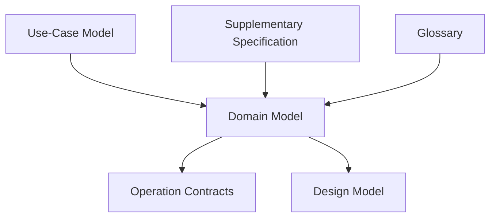

> Larman p. 131–132

## 9.1 Example

Figure 9.2 is a partial domain model in UML class diagram notation. It says that Payment and Sale are significant conceptual classes in this domain, that a Payment is related to a Sale in a way worth noting, and that a Sale has date and time attributes we care about.

*Figure 9.2: Partial domain model — a visual dictionary.*

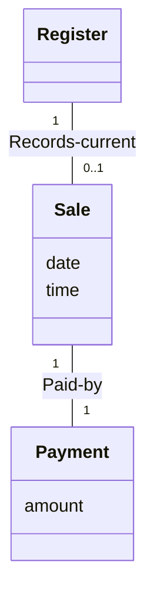

Applying UML class diagram notation to a domain model yields a *conceptual perspective* model (p. 12). Identifying a rich set of conceptual classes is the heart of OO analysis; done with skill and a short time investment (no more than a few hours per early iteration), it pays off in design through better understanding and communication.

**Guideline.** Avoid a waterfall-mindset big-modeling effort aiming at a thorough or "correct" domain model — it never will be, and over-modeling leads to analysis paralysis with little or no return.

> Larman p. 133

## 9.2 What is a Domain Model?

The quintessential OO analysis step is decomposing a domain into noteworthy concepts or objects. A domain model is a visual representation of conceptual classes or real-situation objects in a domain [MO95, Fowler96]. Also called *conceptual model* (1st edition of the book), *domain object model*, *analysis object model*. Related to conceptual entity-relationship models, which have been widely reinterpreted as data models — domain models are *not* data models.

**Definition.** In the UP, "Domain Model" means a representation of real-situation conceptual classes, *not* software objects. It does not mean diagrams of software classes, the domain layer of a software architecture, or software objects with responsibilities.

The UP defines the Domain Model as an artifact of the Business Modeling discipline: a specialization of the UP Business Object Model (BOM) "focusing on explaining 'things' and products important to a business domain" [RUP]. The Domain Model covers one domain (e.g. POS things); the BOM is a much larger multi-domain model covering the whole business — not covered here and not encouraged (too much up-front modeling).

In UML notation, a domain model is a set of class diagrams with **no operations** (method signatures). It may show:

- domain objects or conceptual classes
- associations between conceptual classes
- attributes of conceptual classes

### Definition: Why Call a Domain Model a "Visual Dictionary"?

Figure 9.2 visualizes and relates words/concepts in the domain, and shows an abstraction of them (there is much more one could say about registers and sales). The same information could be written as plain text in the UP Glossary, but terms and especially their relationships are easier to grasp visually. Hence: the domain model is a *visual dictionary* of the noteworthy abstractions, domain vocabulary, and information content of the domain.

### Definition: Is a Domain Model a Picture of Software Business Objects?

No. A UP Domain Model visualizes things in a real-situation domain, not software objects (Java/C# classes) or software objects with responsibilities. Not suitable in a domain model:

- Software artifacts such as a window or a database — unless the domain being modeled *is* software concepts (e.g. a model of GUIs).
- Responsibilities or methods. (Responsibilities belong to design work — important, but not part of this model.)

*Figure 9.3: A domain model shows real-situation conceptual classes, not software classes.* — `Sale {date, time}` associated with `Payment {amount}`, annotated "real sale" / "real payment".

*Figure 9.4: A domain model does not show software artifacts or classes.* — `SaleWindow`, `Database`, `JFrame` boxes, each crossed out.

### Definition: What are Two Traditional Meanings of "Domain Model"?

1. UP meaning (this chapter): a conceptual perspective of real-world objects.
2. Smalltalk-community meaning: *the domain layer of software objects* — the layer below the presentation/UI layer, composed of software objects representing problem-domain things with "business logic"/"domain logic" methods (e.g. a `Board` software class with a `getSquare` method).

Both are correct — long-established uses in different communities. Confusion arises when people use the term without saying which meaning they intend. In this book, **domain layer** is used for the second, software-oriented meaning.

### Definition: What are Conceptual Classes?

Informally, a conceptual class is an idea, thing, or object. Formally [MO95] it has:

| Part | Meaning |
|---|---|
| **Symbol** | words or images representing the conceptual class |
| **Intension** | the definition of the conceptual class |
| **Extension** | the set of examples to which the conceptual class applies |

*Figure 9.5: A conceptual class has a symbol, intension, and extension.*

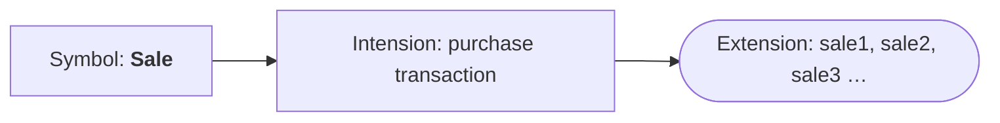

Example: the conceptual class for a purchase-transaction event, named by the symbol *Sale*. Its intension: "represents the event of a purchase transaction, and has a date and time." Its extension: all sale instances in the universe.

### Definition: Are Domain and Data Models the Same Thing?

No. A data model by definition shows persistent data to be stored. Do not exclude a conceptual class just because the requirements show no need to remember information about it, or because it has no attributes. Attributeless conceptual classes and classes with a purely behavioral (not informational) role are valid.

> Larman p. 134–137

## 9.3 Motivation: Why Create a Domain Model?

Anecdote: early 1990s, a funeral-services business system in Smalltalk, Vancouver. Larman knew nothing of the business; one reason to make a domain model was to learn its key concepts and vocabulary. The team also wanted a domain layer of Smalltalk objects. About one hour was spent sketching an OMT-ish domain model (OMT notation inspired UML), ignoring software and just identifying key terms. Terms from the sketch, such as *Service* (flowers in the funeral room, playing "You Can't Always Get What You Want"), then became the names of key software classes in the Smalltalk domain layer (p. 206). Same naming in domain model and domain layer → lower gap between software representation and mental model.

### Motivation: Lower Representational Gap with OO Modeling

Key OO idea: name software classes in the domain layer after names in the domain model, with objects carrying domain-familiar information and responsibilities. This gives a *low representational gap* between mental and software models — with practical time-and-money impact. Contrast a 1953 payroll program: `1000010101000111101010101010001010101010101111010101 …` — it runs, but the gap to our mental model of payroll is huge, which profoundly affects comprehension and modification.

*Figure 9.6: Lower representational gap with OO modeling.*

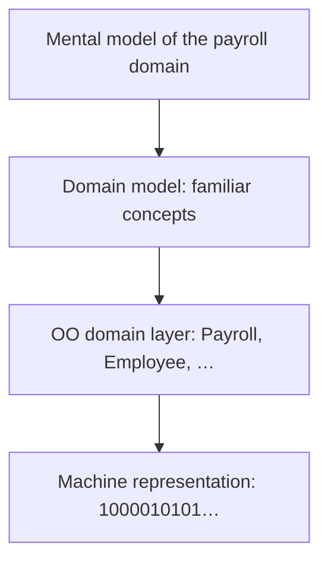

Objects are also valuable because they support elegant, loosely coupled, scalable, extensible designs; the lowered representational gap is useful but arguably secondary to ease of change/extension and managing/hiding complexity.

> Larman p. 137–138

## 9.4 Guideline: How to Create a Domain Model?

Bounded by the current iteration's requirements:

1. Find the conceptual classes (see the following guideline).
2. Draw them as classes in a UML class diagram.
3. Add associations and attributes (p. 149 and p. 158).

## 9.5 Guideline: How to Find Conceptual Classes?

### What are Three Strategies to Find Conceptual Classes?

1. **Reuse or modify existing models.** First, best, and usually easiest. Published domain/data models exist for inventory, finance, health, etc. — e.g. *Analysis Patterns* (Fowler), *Data Model Patterns* (Hay), *Data Model Resource Book* vol. 1–2 (Silverston). Excellent but outside this book's scope.
2. **Use a category list.**
3. **Identify noun phrases.**

### Method 2: Use a Category List

Kick-start the model by listing candidate conceptual classes from common categories (Table 9.1), emphasizing business information system needs. The guideline column suggests priorities. Examples are drawn from 1) POS, 2) Monopoly, 3) airline reservation.

*Table 9.1: Conceptual Class Category List.*

| Conceptual Class Category | Examples | Guideline |
|---|---|---|
| business transactions | Sale, Payment; Reservation | These are critical (they involve money), so start with transactions. |
| transaction line items | SalesLineItem | Transactions often come with related line items, so consider these next. |
| product or service related to a transaction or transaction line item | Item; Flight, Seat, Meal | Transactions are for something (a product or service). Consider these next. |
| where is the transaction recorded? | Register, Ledger; FlightManifest | Important. |
| roles of people or organizations related to the transaction; actors in the use case | Cashier, Customer, Store; MonopolyPlayer; Passenger, Airline | We usually need to know about the parties involved in a transaction. |
| place of transaction; place of service | Store; Airport, Plane, Seat | |
| noteworthy events, often with a time or place we need to remember | Sale, Payment; MonopolyGame; Flight | |
| physical objects | Item, Register; Board, Piece, Die; Airplane | Especially relevant when creating device-control software, or simulations. |
| descriptions of things | ProductDescription; FlightDescription | See p. 147 (section 9.13) for discussion. |
| catalogs | ProductCatalog; FlightCatalog | Descriptions are often in a catalog. |
| containers of things (physical or information) | Store, Bin; Board; Airplane | |
| things in a container | Item; Square (in a Board); Passenger | |
| other collaborating systems | CreditAuthorizationSystem; AirTrafficControl | |
| records of finance, work, contracts, legal matters | Receipt, Ledger; MaintenanceLog | |
| financial instruments | Cash, Check, LineOfCredit; TicketCredit | |
| schedules, manuals, documents that are regularly referred to in order to perform work | DailyPriceChangeList; RepairSchedule | |

> Larman p. 139–140

### Method 3: Finding Conceptual Classes with Noun Phrase Identification

Linguistic analysis [Abbot83]: identify nouns and noun phrases in textual descriptions of the domain and treat them as candidate conceptual classes or attributes. (Has since become more sophisticated as *natural language modeling*, e.g. [Moreno97].)

**Guideline.** Apply care: a mechanical noun-to-class mapping isn't possible, and natural-language words are ambiguous.

The fully dressed use cases are an excellent source. Example — the Process Sale use case, current scenario:

**Main Success Scenario (Basic Flow):**

1. Customer arrives at a POS checkout with goods and/or services to purchase.
2. Cashier starts a new sale.
3. Cashier enters item identifier.
4. System records sale line item and presents item description, price, and running total. Price calculated from a set of price rules. *Cashier repeats steps 2–3 until indicates done.*
5. System presents total with taxes calculated.
6. Cashier tells Customer the total, and asks for payment.
7. Customer pays and System handles payment.
8. System logs the completed sale and sends sale and payment information to the external Accounting (for accounting and commissions) and Inventory systems (to update inventory).
9. System presents receipt.
10. Customer leaves with receipt and goods (if any).

**Extensions (Alternative Flows):** … 7a. Paying by cash:

1. Cashier enters the cash amount tendered.
2. System presents the balance due, and releases the cash drawer.
3. Cashier deposits cash tendered and returns balance in cash to Customer.
4. System records the cash payment.

Noteworthy terms are found in use cases, other documents, and experts' minds; use cases are one rich source. Some noun phrases are candidate conceptual classes, some refer to classes ignored this iteration (e.g. "Accounting", "commissions"), some are merely attributes (p. 160 on distinguishing). Weakness: natural-language imprecision — different noun phrases may denote the same class or attribute. Recommended in combination with the category list.

> Larman p. 141–142

## 9.6 Example: Find and Draw Conceptual Classes

### Case Study: POS Domain

From the category list and noun-phrase analysis, focusing first on business transactions and their relationships, constrained to iteration-1 (basic cash-only Process Sale scenario; iteration-1 requirements p. 124):

| | | |
|---|---|---|
| Sale | Cashier | ProductDescription |
| CashPayment | Customer | Register |
| SalesLineItem | Store | ProductCatalog |
| Item | | Ledger |

There is no "correct" list — it is a somewhat arbitrary collection of abstractions and vocabulary the modelers consider noteworthy — but following the identification strategies, different modelers produce similar lists. In practice Larman does not write a text list first but draws the UML class diagram directly as classes are uncovered.

*Figure 9.7: Initial POS domain model* — the twelve classes above drawn as class boxes without associations or attributes: Register, Item, Store, Sale, SalesLineItem, Cashier, Customer, Ledger, CashPayment, ProductDescription, ProductCatalog.

### Case Study: Monopoly Domain

For the iteration-1 simplified Play a Monopoly Game scenario. Since this is a simulation, the emphasis is on noteworthy tangible, physical objects.

*Figure 9.8: Initial Monopoly domain model* — class boxes: MonopolyGame, Player, Piece, Die, Board, Square.

> Larman p. 143–144

## 9.7 Guideline: Agile Modeling — Sketching a Class Diagram

Note the sketching style in Figure 9.8: bottom and right sides of the class boxes left open, so classes are easy to grow as new elements are discovered. Boxes are grouped compactly in the book; on a whiteboard, spread them out.

## 9.8 Guideline: Agile Modeling — Maintain the Model in a Tool?

It is normal to miss significant conceptual classes early and discover them during design sketching or programming. In an agile approach the domain model exists to quickly understand and communicate a rough approximation of key concepts; perfection is not the goal, and agile models are usually discarded soon after creation (take a digital snapshot of the whiteboard). So there is no inherent motivation to maintain it — but updating is not wrong either.

If someone wants it maintained, redraw it in a UML CASE tool or draw it with a tool and projector from the start. Ask: who will use the updated model, and why? Without a practical reason, don't bother. The evolving domain layer of the software usually reveals most noteworthy terms, and a long-lived OO analysis domain model adds little.

## 9.9 Guideline: Report Objects — Include 'Receipt' in the Model?

Receipt is a noteworthy POS term, but perhaps only a report of a sale and payment — duplicate information. Factors:

- A report of other information is generally not useful in a domain model, since its information is derived/duplicated from other sources → reason to exclude.
- It has a special role in business rules: the paper receipt confers the right to return bought items → reason to include.

Since item returns are not in this iteration, Receipt is excluded. In the iteration handling the Handle Returns use case, including it would be justified.

> Larman p. 144–145

## 9.10 Guideline: Think Like a Mapmaker; Use Domain Terms

**Guideline.** Make a domain model the way a cartographer works:

- Use the existing names in the territory. For a library, call the customer "Borrower" or "Patron" — the terms library staff use.
- Exclude irrelevant or out-of-scope features. In iteration-1 Monopoly, cards ("Get out of Jail Free") are not used, so no Card class this iteration.
- Do not add things that are not there.

Similar to the Use the Domain Vocabulary strategy [Coad95].

## 9.11 Guideline: How to Model the Unreal World?

Some domains have little analogy in the natural or business world (e.g. telecommunications software). A domain model is still possible; it requires a high degree of abstraction, stepping back from familiar non-OO designs, and listening carefully to the core vocabulary of domain experts. Candidate conceptual classes for a telecommunication switch: Message, Connection, Port, Dialog, Route, Protocol.

## 9.12 Guideline: A Common Mistake with Attributes vs. Classes

Perhaps the most common domain-modeling mistake: representing something as an attribute when it should be a conceptual class.

**Guideline.** If we do not think of some conceptual class X as a number or text in the real world, X is probably a conceptual class, not an attribute.

- Should *store* be an attribute of Sale, or a class Store? A store is not a number or text — it is a legal entity, an organization, something occupying space → conceptual class **Store**.
- Should *destination* be an attribute of Flight, or a class Airport? A destination airport is a massive thing occupying space → concept **Airport**.

> Larman p. 146

## 9.13 Guideline: When to Model with 'Description' Classes?

A description class contains information that describes something else — e.g. a ProductDescription recording the price, picture, and text description of an Item. First named the Item-Descriptor pattern in [Coad92].

### Motivation: Why Use 'Description' Classes?

This may look like a rare, specialized issue, but description classes are needed in many domain models. Assume:

- An Item instance represents a physical item in a store; it may even have a serial number.
- An Item has a description, price, and itemID, recorded nowhere else.
- Everyone working in the store has amnesia.
- Every time a physical item is sold, the corresponding software Item instance is deleted.

Scenario: the popular new vegetarian burger ObjectBurger sells out, so all ObjectBurger Item instances are deleted from memory. Problem: asked "How much do ObjectBurgers cost?", no one can answer — the price lived only on the deleted inventoried instances. Related problems: a software model built like this has duplicate data, is space-inefficient, and error-prone, because description, price, and itemID are replicated on every Item of the same product.

Solution: a **ProductDescription** class recording information about items. A ProductDescription does not represent an Item; it represents a description of information about items (Figure 9.9). A particular Item may have a serial number (physical instance); a ProductDescription would not. From a software perspective: even if all inventoried items are sold and their Item instances deleted, the ProductDescription remains.

*Figure 9.9: Descriptions about other things. The `*` means a multiplicity of "many": one ProductDescription may describe many Items.*

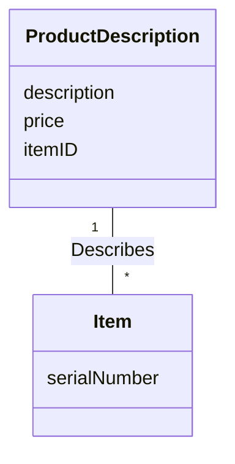

Description classes are common in sales, product, and service domains, and in manufacturing (description of a manufactured thing distinct from the thing itself).

### Guideline: When Are Description Classes Useful?

**Guideline.** Add a description class (e.g. ProductDescription) when:

- There needs to be a description about an item or service, independent of the current existence of any examples of those items or services.
- Deleting instances of the things described (e.g. Item) would lose information that needs to be maintained but was incorrectly attached to the deleted thing.
- It reduces redundant or duplicated information.

### Example: Descriptions in the Airline Domain

An airline suffers a fatal crash; all flights are cancelled for six months pending investigation; cancelled flights' Flight software objects are deleted. If the only record of which airport a flight goes to lives in the Flight instances (specific flights on a specific date/time), the airline no longer has a record of its routes. Solved — conceptually and in software — with a **FlightDescription** describing a flight and its route even when no particular flight is scheduled (Figure 9.10).

*Figure 9.10: Descriptions about other things.*

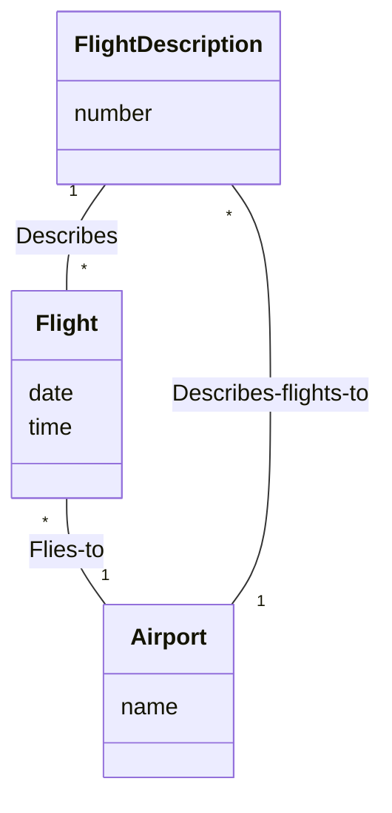

This example is about a *service* (a flight) rather than a good (a veggieburger); descriptions of services or service plans are commonly needed. Another example: a mobile phone company sells "bronze"/"gold" packages. The description of the package (a service plan: rates per minute, wireless Internet content, cost, …) must be separate from an actual sold package ("gold package sold to Craig Larman on Jan. 1, 2047 at $55 per month"). Marketing needs to define and record the MobileCommunicationsPackageDescription before any are sold.

> Larman p. 147–149

## 9.14 Associations

Find and show the associations needed to satisfy the information requirements of the current scenarios and that aid understanding of the domain.

**Definition.** An association is a relationship between classes (more precisely, between instances of those classes) that indicates some meaningful and interesting connection. UML: "the semantic relationship between two or more classifiers that involve connections among their instances."

*Figure 9.11: Associations* — `Register` —Records-current— `Sale` —Paid-by— `Payment`; the line labeled "association".

### Guideline: When to Show an Association?

Noteworthy associations usually imply knowledge of a relationship that must be preserved for some duration (milliseconds or years). Between what objects do we need some *memory* of a relationship?

- Must we remember which SalesLineItem instances belong to a Sale? Definitely — otherwise no reconstructing a sale, printing a receipt, or calculating a total.
- Completed Sales must be remembered in a Ledger (accounting, legal reasons).
- These "need to remember" statements refer to the real situation (conceptual perspective), not software — though many of the same needs recur in implementation.
- Monopoly: remember which Square a Piece (or Player) is on, which Piece a Player owns, which Squares belong to a Board — the game doesn't work otherwise.
- Not needed: that the Die total indicates the Square to move to (true, but no ongoing memory after the move); that a particular Cashier looked up particular ProductDescriptions.

**Guideline.** Consider including:

- Associations for which knowledge of the relationship needs to be preserved for some duration ("need-to-remember" associations).
- Associations derived from the Common Associations List (Table 9.2).

### Guideline: Why Should We Avoid Adding Many Associations?

In a graph with n nodes there can be n·(n−1)/2 associations — 20 classes could have 190 association lines. Too many lines obscure the diagram with "visual noise". Be parsimonious; focus on need-to-remember associations.

**Perspectives: Will the Associations Be Implemented in Software?** During domain modeling an association says nothing about data flows, foreign keys, instance variables, or object connections; it states that a relationship is meaningful in the real domain. Many will later be implemented as navigation/visibility paths in the Design Model and Data Model — but the domain model is not a data model; associations highlight our rough understanding of noteworthy relationships, not object or data structures.

> Larman p. 149–151

### Applying UML: Association Notation

A line between classes with a capitalized association name (Figure 9.12).

*Figure 9.12: The UML notation for associations.*

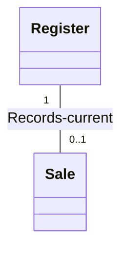

- Association ends may carry a multiplicity expression (numerical relationship between instances).
- An association is inherently bidirectional: logical traversal from instances of either class to the other is possible — purely abstract, not a statement about software connections.
- An optional *reading direction arrow* shows the direction to read the name; it does **not** indicate visibility or navigation. Absent an arrow, the convention is left-to-right or top-to-bottom (not a UML rule).

**Caution.** The reading direction arrow has no meaning in the model; it only aids the reader.

### Guideline: How to Name an Association in UML?

**Guideline.** Name associations in **ClassName-VerbPhrase-ClassName** format, where the verb phrase makes a readable, meaningful sequence.

Simple names like "Has" or "Uses" are usually poor; they seldom add understanding.

| Good | Bad (doesn't enhance meaning) |
|---|---|
| Sale Paid-by CashPayment | Sale Uses CashPayment |
| Player Is-on Square | Player Has Square |

Names start with a capital letter (an association is a classifier of links between instances; UML classifiers are capitalized). Two equally legal formats for compound names: `Records-current` and `RecordsCurrent`.

### Applying UML: Roles

Each end of an association is a *role*. Roles may optionally have:

- multiplicity expression
- name
- navigability

### Applying UML: Multiplicity

Multiplicity defines how many instances of class A can be associated with one instance of class B (Figure 9.13). E.g. a single Store can be associated with "many" (zero or more, `*`) Item instances.

*Figure 9.13: Multiplicity on an association.*

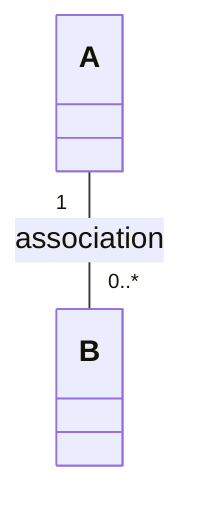

*Figure 9.14: Multiplicity values.*

| Expression | Meaning |
|---|---|
| `1` | exactly one |
| `0..1` | zero or one |
| `*` | zero or more ("many") |
| `1..*` | one or more |
| `3..5` | three to five |

Multiplicity states how many instances can validly be associated *at a particular moment*, not over time. A used car may be sold back to dealers repeatedly, but at any moment it is Stocked-by only one dealer. Under monogamy laws a person is Married-to one person at a time, though many over a lifetime.

The value depends on the modeler's interest: it communicates a domain constraint that will (or could) be reflected in software (Figure 9.15). Rumbaugh's example [Rumbaugh91]: Person Works-for Company — one or many depends on context: the tax department is interested in many, a union probably in only one. The choice usually depends on why we build the software.

*Figure 9.15: Multiplicity is context dependent.*

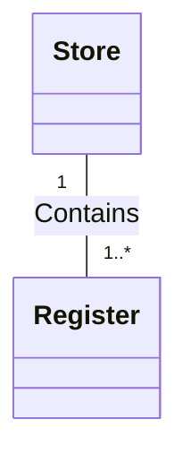

### Applying UML: Multiple Associations Between Two Classes

Two classes may have several associations between them — not uncommon. No outstanding POS/Monopoly example; in the airline domain a Flight (more precisely a FlightLeg) and an Airport have distinct Flies-to and Flies-from associations, shown separately (Figure 9.16).

*Figure 9.16: Multiple associations.*

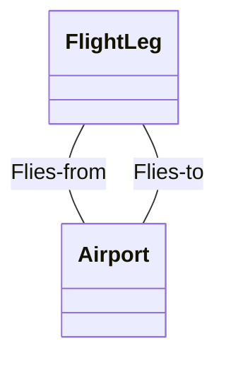

> Larman p. 151–154

### Guideline: How to Find Associations with a Common Associations List

Start adding associations with Table 9.2, especially for business information systems. Examples from 1) POS, 2) Monopoly, 3) airline reservation.

*Table 9.2: Common Associations List.* (Pairs read "A — B".)

| Category | Examples |
|---|---|
| A is a transaction related to another transaction B | CashPayment—Sale; Cancellation—Reservation |
| A is a line item of a transaction B | SalesLineItem—Sale |
| A is a product or service for a transaction (or line item) B | Item—SalesLineItem (or Sale); Flight—Reservation |
| A is a role related to a transaction B | Customer—Payment; Passenger—Ticket |
| A is a physical or logical part of B | Drawer—Register; Square—Board; Seat—Airplane |
| A is physically or logically contained in/on B | Register—Store, Item—Shelf; Square—Board; Passenger—Airplane |
| A is a description for B | ProductDescription—Item; FlightDescription—Flight |
| A is known/logged/recorded/reported/captured in B | Sale—Register; Piece—Square; Reservation—FlightManifest |
| A is a member of B | Cashier—Store; Player—MonopolyGame; Pilot—Airline |
| A is an organizational subunit of B | Department—Store; Maintenance—Airline |
| A uses or manages or owns B | Cashier—Register; Player—Piece; Pilot—Airplane |
| A is next to B | SalesLineItem—SalesLineItem; Square—Square; City—City |

> Larman p. 155–156

## 9.15 Example: Associations in the Domain Models

### Case Study: NextGen POS

Figure 9.17 shows candidate conceptual classes and associations for the POS domain model, derived mainly from the need-to-remember criteria of this iteration's requirements and the Common Associations List:

- Transactions related to another transaction — Sale Paid-by CashPayment.
- Line items of a transaction — Sale Contains SalesLineItem.
- Product for a transaction (or line item) — SalesLineItem Records-sale-of Item.

*Figure 9.17: NextGen POS partial domain model.*

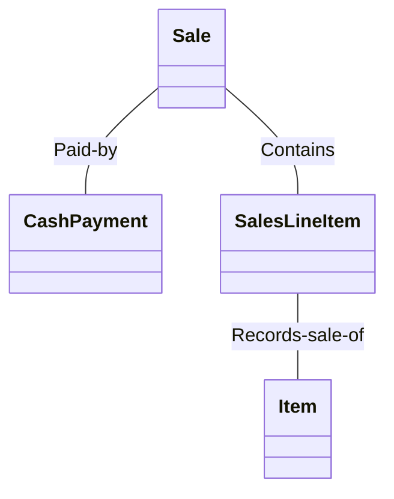

### Case Study: Monopoly

Figure 9.18, same derivation:

- A is contained in or on B — Board Contains Square.
- A owns B — Player Owns Piece.
- A is known in/on B — Piece Is-on Square.
- A is member of B — Player Member-of (or Plays) MonopolyGame.

*Figure 9.18: Monopoly partial domain model.*

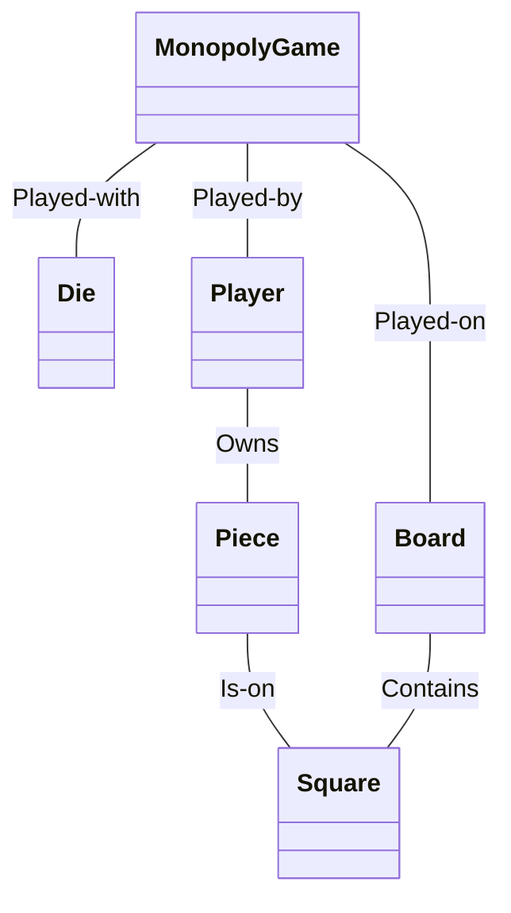

> Larman p. 157

## 9.16 Attributes

Identify the attributes of conceptual classes needed to satisfy the information requirements of the current scenarios. **An attribute is a logical data value of an object.**

### Guideline: When to Show Attributes?

Include attributes that the requirements (e.g. use cases) suggest or imply a need to remember. A receipt in Process Sale normally shows date and time, store name and address, and cashier ID (among other things). Therefore:

- Sale needs a `dateTime` attribute.
- Store needs `name` and `address`.
- Cashier needs an `ID`.

### Applying UML: Attribute Notation

Attributes go in the second compartment of the class box (Figure 9.19); type and other information are optional.

*Figure 9.19: Class and attributes.*

| Class | Attribute compartment |
|---|---|
| Sale | `dateTime`<br>`/ total : Money` |

### More Notation

Full UML attribute syntax:

```
visibility name : type multiplicity = default {property-string}
```

(Detailed class diagram notation: Larman p. 249 and the back inside cover.)

*Figure 9.20: Attribute notation in UML.*

| Class | Attribute compartment |
|---|---|
| Sale | `- dateTime : Date`<br>`- / total : Money` |
| Math | `+ pi : Real = 3.14 {readOnly}` |
| Person | `firstName`<br>`middleName : [0..1]`<br>`lastName` |

- Convention: attributes are assumed private (`-`) unless shown otherwise, so the visibility symbol is usually omitted.
- `{readOnly}` is probably the most common property string.
- Multiplicity can indicate an optional value or the number of objects in a collection attribute: `middleName : [0..1]` means 0 or 1 values present (first and last name required, middle name optional).

### Guideline: Where to Record Attribute Requirements?

`middleName : [0..1]` is subtly a requirement or domain rule embedded in the domain model; it probably implies that the software should allow a missing middleName in the UI, the objects, and the database. Leaving such specifications only in the domain model is error-prone and scattered — people rarely read the domain model in detail or for requirements guidance, and rarely maintain it. Larman's suggestion: record all such attribute requirements in the **UP Glossary**, which serves as a data dictionary — e.g. after an hour sketching with a domain expert, spend 15 minutes transferring implied attribute requirements to the Glossary. Alternative: a tool that integrates UML models with a data dictionary.

*(The kompendium transcription ends here, mid-sentence, at p. 159.)*

> Larman p. 158–159
