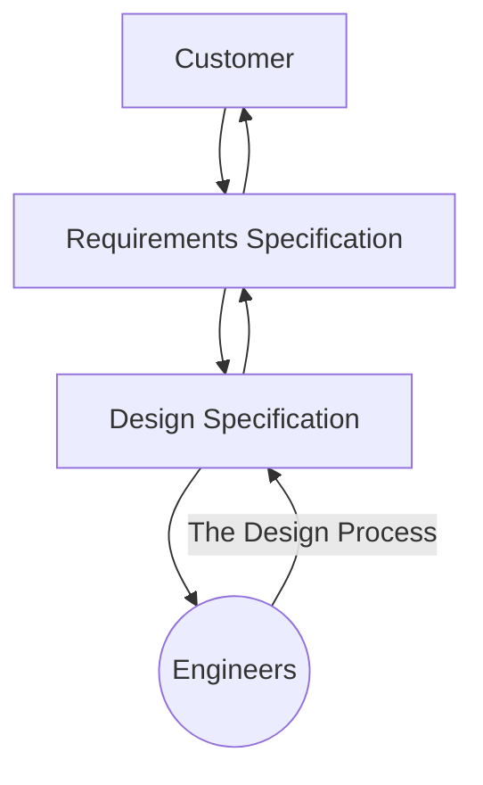
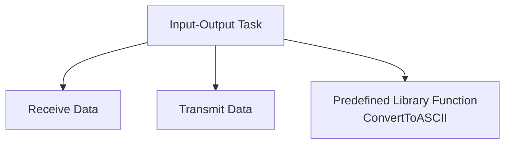
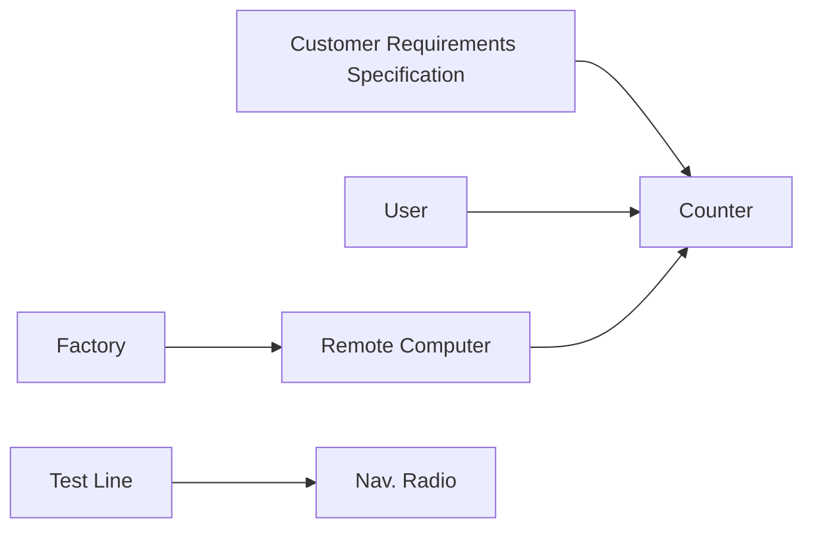
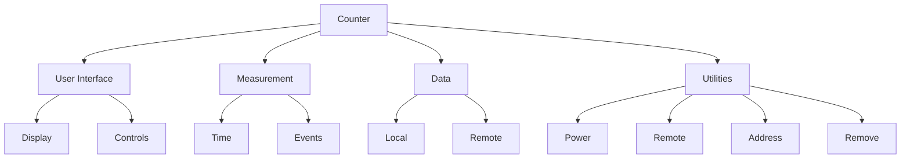
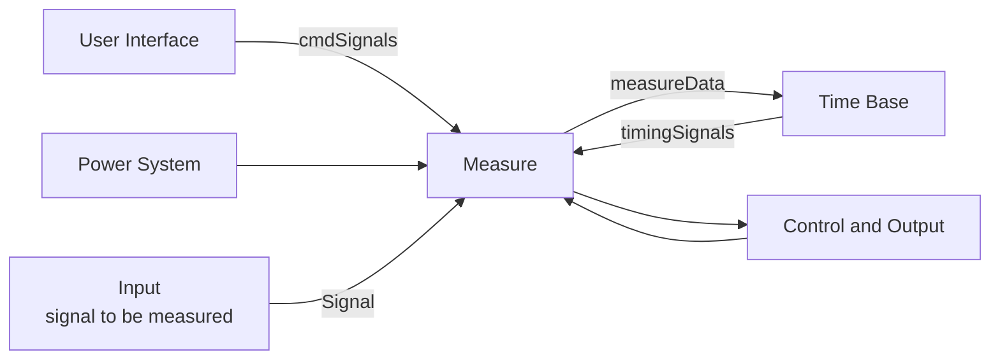
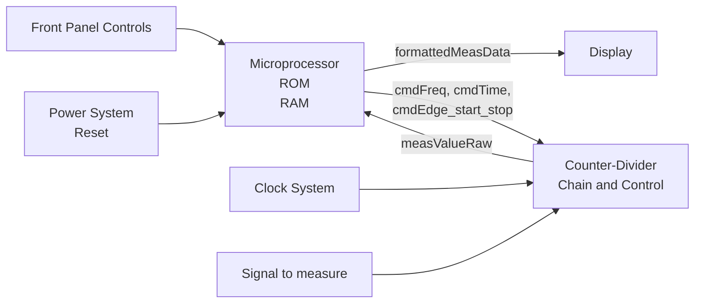
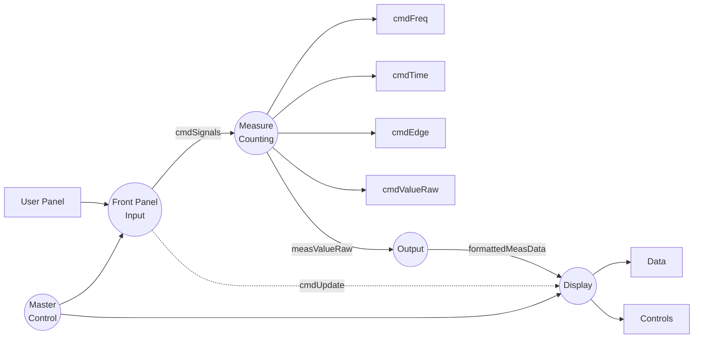

# Peckol, Chapter 9: System Design

## Metadata

| Felt | Værdi |
|---|---|
| **Kursus** | SWISE-01 Indledende System Engineering |
| **Kilde** | James K. Peckol: *Embedded Systems Design, A Contemporary Design Tool*, Wiley, ISBN 978-0-471-72180-2. Chapter 9 "System Design", pp. 366–369 and 376–391 (kompendiet springer s. 370–375 over). Kompendie-kapitel 08 (`08_Peckol_Ch9_SystemDesign.tex` + spillover `09_to_08.tex`) |
| **Type** | lærebogskapitel |
| **Sprog** | engelsk |
| **Emner dækket** | System Design Specification vs. Requirements Specification, quantifying I/O and functional/operational/technological specs, safety and reliability, partitioning and decomposition, coupling, cohesion (7 types), functional design and functional model, hierarchical decomposition, architectural design and HW/SW mapping (co-design), software specification with UML, Rate-Monotonic Scheduling, functional vs. architectural model (shared variable / synchronization / message-by-port), prototyping, static analysis (coupling, cohesiveness, complexity), dynamic analysis (behavior, performance, trade-off). Running example 9.0: a digital counter |

> The chapter is rendered section by section with all lists, tables, design notes/heuristics and figures. Running prose is condensed rather than quoted verbatim; the verbatim text is in the `.tex` source. Section numbers (9.7–9.13) and figure numbers (9.19–9.27) follow the book.

---

## Example 9.0, Designing a Counter (cont.) — end of Requirements Specification

Time and frequency measurements have three user-selectable resolution ranges: high frequency / shorter duration signals; midrange frequency / midrange duration; low frequency / longer duration. Events measurement supports two selectable counting durations (shorter, longer).

Frequency, period, and events: user selects positive or negative edge trigger. Interval: polarity of start and stop signals selectable independently.

#### Operating Specifications

Standard commercial/industrial environment:

- Temperature Range 0–85 C
- Humidity up to 90 % RH noncondensing
- Power 120–240 VAC 50 Hz, 60 Hz, 400 Hz, 15 VDC

Minimum 8 hours of operation on a fully charged battery.

Time base:

| Parameter | Spec |
|---|---|
| Temperature stability 0–50 C | < 6 × 10⁻⁶ |
| Aging rate, 90 day | < 3 × 10⁻⁸ |
| Aging rate, 6 month | < 6 × 10⁻⁷ |
| Aging rate, 1 year | < 25 × 10⁻⁶ |

#### Reliability and Safety Specification

| Area | Standards / value |
|---|---|
| Safety | UL-3111-1, IEC-1010, CSA 1010.1 |
| EMC | CISPR-11, IEC 801-2, -3, -4, EN50082-1 |
| MTBF | Minimum of 10,000 hours |

> Peckol p. 366

## 9.7 The System Design Specification

The *System Design Specification* is based on the *System Requirements Specification* and specifies the **how** of the design, not the **what**. Written in the designer's language and from the designer's point of view; a bridge between customer and designer (Figure 9.19).

*Figure 9.19: The Customer, the Requirements, the Design, and the Engineer.*

The Requirements Specification views the system from outside looking in; the Design Specification views it from inside looking out as well. The Design Specification has two masters:

- It must specify the system's public interface from inside the system.
- It must specify how the requirements defined for and by the public interface are met by the internal functions of the system.

The Requirements Specification is written in less formal terms to capture the customer's view; the Design Specification must formalize those requirements in precise, unambiguous language. It should be clear, robust, and complete enough that a group of engineers could develop the product without ever talking to its author.

> **Design Note.** Litmus test: "If I send this to my colleague (working for one of our subcontractors), will he or she understand this?" If no, reexamine the specification.

### 9.7.1 The System

Formalizing and quantifying the requirements means attaching concrete numbers, tolerances, and constraints to all input and output signals, defining all timing relationships, and describing functional and operational behavior in detail.

### 9.7.2 Quantifying the System

Quantification starts with inputs and outputs, based on the specified requirements, adding the technical detail the engineer needs to execute the design.

**System Inputs and Outputs** — for each I/O variable specify:

- the name of the signal
- its use as input or output
- its nature: event, data, state variable, etc.

Starting from the requirements specification, add detail and any technical/technological constraints:

- complete signal specification: nominal value, range, level tolerances, timing, timing tolerances
- interrelationships with other signals, including constraints on those relationships

**Responsibilities — Activities**

**Functional and Operational Specifications** — quantify the dynamic behavior. The functional requirements specification identifies the major functions at a high level; the operational specification captures how those functions behave in the operating environment: manner of operation, conditions imposed, range of operation. Use concrete numbers: precisions and tolerances, ordinary and extraordinary operating modes, limits, expected operating ranges — all details the designer/implementer needs. Design requirements may be stated with bullet equations or algorithms, formal design language, or pseudo code, plus detailed UML diagrams (state charts, sequence diagrams, timing diagrams). Schematics, code, and parts lists are not included except in limited circumstances.

**Technological (and Other) Specifications** — all detailed, concrete specs relevant to hardware and software design. Areas to consider:

1. *Geographical constraints.* Distributed applications may span a room, a campus, a country, or a worldwide communications system.
2. *Characterization of and constraints on interface signals.* Signals to/from the external world are assumed electrical, optical, or wireless, convertible to/from digital form.
3. *User interface requirements.* For interfaces to external devices (medical, instrumentation) consider how information is presented and any associated protocols.
4. *Temporal constraints.* Hard or soft real-time constraints: delays on signals from external entities, responses to system outputs, internal delays.
5. *Electrical infrastructure considerations.* Power consumption, necessary supplies, tolerances and capacities, tolerance to degraded power, power management schemes.
6. *Safety and Reliability.* Focus shifts to detailed objectives and the strategy for achieving them.

Safety: understand and specify environmental and safety issues. Reliability: requirements for diagnostic tests, remote maintenance, remote upgrade and their details; concrete MTTF/MTBF numbers for built-in self-test circuitry and for the system itself; system performance under partial or full failure.

> Peckol p. 367–368

#### Example 9.0 (cont.) — Quantifying the specification

The Design Specification follows but extends the Requirements Specification, now giving specific numbers, ranges, and tolerances for signals inside the system.

**Environment.** No changes from the earlier discussion.

**Counter.**

- Measurement/stimulus equipment is generally specified 10× (one order of magnitude) better than the signals it must measure or generate.
- That margin is applied to the range and tolerances of the counter's measurement capabilities.
- Event-counting specs are based on the granularity of the timing of the counting interval.
- Values to be displayed at the measurement boundaries are now defined.

> **System Design Specification for a Digital Counter**
>
> *System Description.* Defines the basic requirements for a digital counter measuring frequency, period, time interval, and events; three measurement ranges per signal and two for events; manually operated with support for remote operation; low cost and flexible for a variety of applications.
>
> *Specification of External Environment.* Industrial environment, commercial-grade temperature and lighting; line power or battery operation. Details under Operating Specifications.

---

*[Kompendiet springer originalbog-sider 370–375 over.]*

---

Ideally a specification document is complete, consistent, comprehensible, traceable to the requirements, unambiguous, modifiable, and able to be written; as formal a language/notation as possible yet readable; and executable. A *System Specification* focuses precisely on the system itself: a complete description of its externally visible characteristics — its public interface. External visibility separates what is functionally visible to the environment from what reflects internal structure.

> Peckol p. 368–369, 376

## 9.9 Partitioning and Decomposing a System

All requirements are now captured and formalized in the System Design Specification. Next: move inside the system and specify/design the functionality behind the external behavior. Modularity and encapsulation have been stressed throughout; first *why*, then *what to consider* when decomposing and partitioning into hardware and software modules.

### 9.9.1 Initial Thoughts

Reasons for partitioning:

- **Reuse.** With each new design look to the previous and the next project: what can be reused from the last, how can this design support a future feature, can parts be used in future projects?
- **Compiler/memory behavior.** Many compilers generate object code per module, which can impose size restrictions. Poor module builds affect memory accesses, increase cache misses, promote thrashing, and reduce performance.
- **Work assignment and subcontracting.** Work is often assigned module by module; module boundaries should minimize interfaces between parts. Simplifies subcontracting. Security: on government or sensitive work, decomposition helps identify what can be outsourced and what must be kept in-house.
- **Stable interfaces, robustness.** Package modules to stabilize interfaces early. Well-defined, loosely coupled modules keep a failure in one part from propagating into another.

Process: start with the top-level system model and *progressively refine* it into smaller, more manageable pieces. Initially focus on a **functional view**, not on specific hardware/software; capture behavior at a high level, then map functions onto the hardware and software elements that satisfy the constraints identified early. Partitioning helps first to attack complexity, later to arrive at a sound physical architecture.

General thoughts before partitioning:

1. Every rule or guideline must leave room for exceptions.
2. Each module should solve one well-defined piece of the problem.
3. Mixing functionality across modules makes development and support much harder.
4. Connections between modules should only be introduced because of connections between pieces of the problem.
5. Connections between modules should be as independent as possible.
6. Partitioning also serves the economic goals of the design.

Consider partitioning from several viewpoints; if the system meets neither customer expectations nor performance specs, the architecture must change. Decomposition proceeds first from a functional point of view; the outcome is a functional model used to define the architecture. Two early considerations: **coupling** and **cohesion**.

> Peckol p. 376–377

### 9.9.2 Coupling

Coupling is a heuristic estimating how interdependent modules are. Tightly coupled modules share data or exchange control information. More interdependence → harder to manage, debug during development, troubleshoot field failures, maintain, and modify/extend. Goal: modules as independent as possible; minimize coupling.

> **Design Heuristic.** The lower the coupling, the better job that has been done during partitioning.

To reduce coupling early:

1. Eliminate all unessential interaction between modules.
2. Minimize the amount of essential interaction between modules.
3. Loosen the essential interaction between modules, if possible.

Unnecessary interaction demands a high degree of coordination between modules for a task or for error-free communication. Instead: pass the module the information needed to do the job; wait for an indication that the task completed; execute some other part of the task.

### 9.9.3 Cohesion

Coupling addresses partitioning; cohesion addresses bringing pieces together. Cohesion measures the strength of functional relatedness of elements within a module. Goal: strong, highly cohesive modules whose elements are genuinely and tightly related, and not strongly related to elements in other modules. **Maximize cohesion, minimize coupling.**

| Type | Definition |
|---|---|
| **Functional cohesion** | The module implements a single task; all elements contribute to that one task. |
| **Sequential cohesion** | The module implements a task as a sequential set of procedures; output of each becomes input to the next; all elements are involved in one of those procedures. |
| **Communicational cohesion** | A number of procedures work on the same set of input data (e.g. an image-processing task). |
| **Procedural cohesion** | A number of procedures that may or may not relate to a common activity; control rather than data flows from one to the next. |
| **Temporal cohesion** | A number of unrelated procedures/activities that are sequentially ordered in time. |
| **Logical cohesion** | A number of procedures that are alternative methods for a task; an outside user selects a subset to execute. |
| **Coincidental cohesion** | An aggregate of unrelated procedures. Should not be used. |

*Table 9.0: Comparison of Coupling and Types of Cohesion from Different Perspectives* (5 = best, 1 = worst).

| Cohesion | Coupling | Ease of Modification | Ease of Understanding | Ease of Maintenance |
|---|---|---|---|---|
| Functional | 5 | 5 | 5 | 5 |
| Sequential | 4 | 4 | 4 | 3–4 |
| Communicational | 3 | 3 | 3 | 3 |
| Procedural | 2–3 | 3 | 2–3 | 2 |
| Temporal | 1 | 2–3 | 3 | 2 |
| Logical | 1 | 3 | 2–3 | 1 |
| Coincidental | 1 | 1 | 1 | 1 |

Cohesion and coupling analyses give a good starting set of metrics for assessing high-level architecture; the work is subjective and must be guided by experience, context, and specific requirements.

### 9.9.4 More Considerations

- **Spatial viewpoint** — an external view yielding a *distributed functional architecture*; performance and communication costs are considered.
- **Resource allocation** — closely associated; yields a *resource architecture*; performance, cost, and dependability are factors.
- **Hardware and software** — decomposition becomes a design process leading to a *hardware architecture*; performance must be considered. Embedded developers directly influence both hardware platform and software environment; intelligent trade-offs here go a long way toward a safe, robust, high-quality/high-performance system.

> Peckol p. 377–379

## 9.10 Functional Design

Purpose: find an appropriate **internal functional architecture** — begin formalizing how the identified requirements can be implemented. The focus is on analyzing the problem so that understanding of the design can be transformed into a precise (textual or graphical) description: a complete, consistent functional definition of the required tasks.

Aircraft example: the top-level functional model should probably consist of just *take-off, fly, land*. That view says nothing about support structure, propulsion, control surfaces, or method of lift — those decisions are postponed. Advantage: early flexibility; explore before constraining. A functional description simply formalizes intended behavior.

The functional description must be understandable by application-domain experts and by hardware/software developers, reviewable by diverse interested parties, and testable against reality.

**Functional model:** a first functional decomposition is based on a search for essential internal variables and events. Each function is then successively refined/decomposed with the same process until elementary (leaf) functions are reached. The collection of functions forms the functional model, which should suffice to verify design quality and evaluate behavior and performance. During modeling and verification, operations and performance requirements are allocated to internal functions and the relations between functions are defined — allowing an estimate of expected system performance.

Three different things:

| Model | Describes |
|---|---|
| Specification | the *external* behavior of the system |
| Functional model | the *internal* behavior leading to that external behavior |
| Architectural model | the physical hardware and software components onto which the functions are mapped |

*Figure 9.20: First-Level I/O Task Decomposition* — a system must receive data from and transmit data to the outside world, with an ASCII code conversion.

Each function may be decomposed further; second-level functions may be refined again until the detail needed to understand and execute the design is reached. Next: identify the messages flowing between the user / other active external objects and the system, and the internal signals between major functional blocks.

> Peckol p. 379–380

#### Example 9.0 (cont.) — Functional design of the counter

*Figure 9.21: A Model of the Environment and the Counter as an Aggregation of Objects.* The measurement system is a collection of the User, the Factory, the future Remote Computer, and the Counter (the system to be designed, driven by the Customer Requirements Specification). The Factory is an aggregation of Test Lines and numbers of Navigation Radios to be tested. User and Remote Computer interact with the Counter; the Factory contains the Remote Computer; a Test Line acts on a Nav. Radio. User is peripheral to the system.

The design specification's high-level block diagram is a good starting point for hierarchical decomposition. Figure 9.22 gives one possible decomposition of the counter.

*Figure 9.22: A Possible Hierarchical Decomposition of the Counter System.*

Front-panel operations tend to be straightforward; remote operations can be more involved. These are not the only choices.

*Figure 9.23: The Counter–Environment Interface.* External entities and what they send to the Counter:

| Source | Signals to Counter |
|---|---|
| User | Mode, Range, Edge, Preset, Measurement |
| Radio | Signal |
| Test Line | Event |
| Remote Computer | Mode, Range, Edge, Preset, Measurement |

Modes: Frequency / Period / Interval / Events. Ranges: High / Medium / Low. Edges: Rising / Falling. Signals: Frequency / Period / Interval.

*Figure 9.24: A Functional Partition of the Counter System* — signal flow between the major functional blocks.

Next: formulate the system architecture and map functions onto its hardware and software blocks.

> Peckol p. 380–382

## 9.11 Architectural Design

Goal: select the most appropriate solution to the original problem by exploring a variety of architectures and choosing the best-suited hardware/software partitioning and allocation of functionality.

### 9.11.1 Mapping Functions to Hardware

The partition view now reflects a more detailed understanding and involves **mapping/allocating** each functional module onto the appropriate physical hardware or software block(s); the mapping completely describes the hardware implementation.

Broaden the scope of the architectural design so as not to preclude future enhancements — a balance between generality and practicality while satisfying other requirements. Plan for a system that evolves over its lifetime; inevitable add-ons then become much easier.

Work is based on the detailed functional structure; performance requirements are analyzed; constraints from available technologies and from the hardware/software specifications are considered. Important constraints:

- geographical distribution
- physical and user interfaces
- system performance specifications
- timing constraints and dependability requirements
- power consumption
- legacy components and cost

These strongly decide what goes in software vs. hardware. For much of the system the assignment is obvious: power supply, display, communication port, and package are necessarily hardware; the operating system and drivers, if present, are generally software.

*Figure 9.25: The Hardware–Software Continuum* — a vertical gradient from Hardware (top, hardware design techniques) through a gray "Hardware or Software" zone to Software (bottom, software design techniques). In the gray area the implementation approach is not precisely defined.

The mapping completely defines the hardware implementation. The hardware portion is a physical architecture that may comprise one or more microprocessors, complex logic devices or arrayed logic, and custom ICs; microprocessors/microcontrollers may be CISC, RISC, or DSP.

For most applications a substantial portion of the software can be separated from the hardware, permitting concurrent development. The remaining part — the hardware boundary — is harder to partition and falls under **co-design**.

> Peckol p. 382–384

### 9.11.2 Hardware and Software Specification and Design

The system specification identifies inputs, outputs, and functional behavior from the original requirements; functional decomposition is analogous to the steps taken in defining requirements. As the architecture takes shape, determine as fully as possible the specification of each physical component and the interfaces between them.

For each **software component**, a detailed software specification expresses the priority of each task and the temporal and spatial information. UML diagrams — detailed state charts, timing diagrams, sequence diagrams, activity diagrams, collaboration diagrams — are very useful here.

**Real-time kernel or not?** An off-the-shelf real-time kernel reduces development time, but not factory cost or time-based performance specs. Without a kernel one can better optimize for high-speed, hard real-time constraints: the solution is hand-tailored to the specific problem rather than a general-purpose solution adapted to a specific case.

Software design decisions:

- whether to use a real-time kernel
- whether several functions can be combined to reduce the number of software tasks
- a priority for each task
- an implementation technique for each intertask relationship

A frequent choice is the **Rate-Monotonic Scheduling** policy. Permanent functions get higher priority; cyclic functions without timing constraints usually go in a background task.

For intertask relationships, use procedure calls as much as possible — simplifies organization and reduces intertask overhead; only possible between functions with increasing relative priorities. Tasks triggered by hardware events are invoked through the processor interrupt or polling systems.

Where the partition is not obvious, a detailed specification is written for that subpart; the final hardware/software partition is determined through successive refinement.

> Peckol p. 384–385

#### Example 9.0 (cont.) — Counter architecture

First the hardware architecture, then the software architecture; then the functions identified earlier are mapped onto it.

*Figure 9.26: The Hardware Architecture of the Counter.*

Microprocessor, display, front panel controls, and power system are clearly hardware. The clock system and the counter-divider chain/control could in theory be software, but the intended operating frequency decides for hardware.

*Figure 9.27: A Data and Control Flow Diagram for the Counter System* — major software tasks (circles), shared data (boxes), and I/O.

Task behavior:

- **Front panel task** — continually checks (by polling, or indirectly by interrupt) the state of the front panel for user input; a change is captured and passed to the display task (which updates the display) and to the measurement task.
- **Measurement task** — issues commands to the external counter-divider chain control block; at the end of each measurement reads raw data from the counter-divider and passes it to the output task.
- **Output task** — formats the data and sends it to the display task for display on the front panel.
- **Master control task** — manages scheduling of all tasks and any housekeeping.

> Peckol p. 385–386

## 9.12 Functional Model versus Architectural Model

Why both? Any system — hardware, software, or mixed — is internally organized as a collection of components and interconnections. An appropriate model needs elements at both the functional and the architectural level to represent and evaluate a hardware/software system.

### 9.12.1 The Functional Model

Describes the system as a set of *interacting functional elements*, at a high level, without initial bias toward any implementation; best described hierarchically and graphically. Functional modules interact through one of three relations:

| Relation | Meaning |
|---|---|
| *Shared variable relation* | data exchange without temporal dependencies |
| *Synchronization relation* | specifies temporal dependency |
| *Message transfer by port* | implies a producer/consumer relationship |

All three are critical in today's embedded systems; discussed further under processes and interprocess communication.

### 9.12.2 The Architectural Model

Describes the *physical architecture*: real components — microprocessors, arrayed logic, special-purpose processors, analog and digital components — and the interconnections between them.

### 9.12.3 The Need for Both Models

Neither view alone suffices for contemporary systems. Add the **mapping** between the functional viewpoint and the architectural one: it defines a functional partition and the allocation of functional components to hardware elements — also called *architectural configuration*.

The functional model sits between the specification model and the architectural model; it represents internal organization, explaining all necessary functions and the coupling between them from the point of view of the original problem — a technology-independent solution. It is the basis for a *coarse-grain* partitioning, which naturally leads to the choice of what to implement in hardware or software. The architectural structure is *fine-grained*, generally follows from the functional model, but may also be imposed a priori.

> Peckol p. 386–387

## 9.13 Prototyping

The prototype phase yields an operational system prototype; implementation includes detailed design, debugging, validation, and testing.

Prototyping is naturally **bottom-up**: assemble individual parts and flesh out more and more of the abstract functionality. Each level must be validated — checked for compliance with the specification at the corresponding level of the top-down design.

Hardware and software implementations can be developed simultaneously with specialists in both domains, hopefully reducing total implementation time — often not the case in reality; typically software leads hardware. A complete solution can be generated/synthesized for both (ASICs, standard cores, software blocks), and the resulting prototype verified.

### 9.13.1 Implementation

Highly technology-dependent. The prototype is a tool for understanding and confirming the system design — a proof of concept. Cautions: don't rush analysis or design to get to a prototype; don't be afraid to throw the prototype away (though for large projects the rule is usually to transform it into the final product).

Hurrying design and coding "because a lot of testing needs to be done" leads to long nights debugging and longer nights with unhappy customers — customers whose purchased product just cost them several million dollars have little sense of humor. For a general market the company has lost the R&D cost, has no product, and has missed the sales opportunity because the product is poorly conceived or not ready.

### 9.13.2 Analyzing the System Design

With the first-level design in place, analyze it critically. First and foremost: verify that it meets the original requirements and specifications. Architectural and functional aspects may need to be traded off at this stage.

#### Static Analysis

Three areas:

1. **Coupling.** Related to the number and complexity of relationships among modules; also measures the implications of a change. Goal: loose coupling.
2. **Cohesiveness.** Measure of functional homogeneity of the elements comprising modules — applies to components and relations, external and internal views. External cohesion starts with appropriate naming and meaning of elements; internally, the structure and relationships among components are analyzed. E.g. coupling through shared data is more cohesive than messages, since messages imply a temporal dependency.
3. **Complexity.** Two kinds: *functional* and *behavioral*.

   Functional complexity is characterized by:
   - the number of internal functions and relational components — keep small; fewer functions and relations generally means lower complexity (without sacrificing clarity)
   - interconnections among elements within each module — the coupling discussion applies; keep it simple

   Behavioral complexity is characterized by:
   - the number of inputs and outputs — smaller is the target
   - the length and readability of the module's description — if several paragraphs or a page of sub-6-point text are needed, the module is probably too complex; simplify with tables, logical equations, or pseudocode
   - flow of control through the module and the number/structure of state variables — a single major thread of control, few states

#### Dynamic Analysis

Determine how the system behaves in a context closely approximating the ultimate working environment:

- **Behavior Verification.** Ensure the behavior in its operating environment meets the operational specification — does it perform the intended functions, including at the boundaries of those functions? Requires a good specification to begin with.
- **Performance Analysis.** Ensure the system meets the performance specification; focus on specific values for inputs and outputs (later chapter).
- **Trade-off Analysis.** Determine the optimal solution for the given constraints and objectives; even an analysis based on a small set of performance criteria may decide the product's success or failure.

> Peckol p. 387–391
