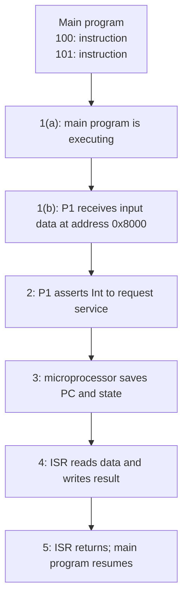
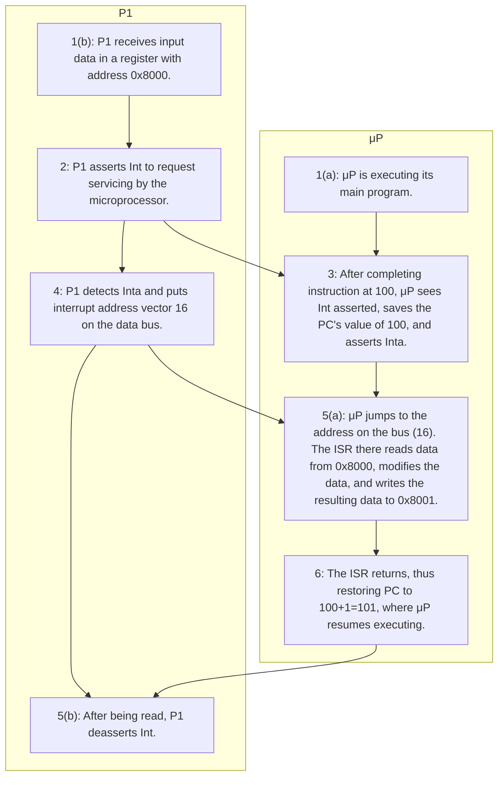

# Interfacing (Vahid & Givargis, kap. 6, s. 137–153)

## Metadata

| Felt | Værdi |
|---|---|
| **Kursus** | SWISE-01 Indledende System Engineering (SW4PRJ4-02) |
| **Kilde** | Frank Vahid & Tony Givargis, *Embedded System Design: A Unified Hardware/Software Introduction*, Wiley — Chapter 6 *Interfacing*, pp. 137–153 |
| **Kilde-fil** | ISE Book-kompendium: `chapters/09_Vahid_Ch6_Interfacing_137-153.tex` + `spillover/10_to_09.tex` (sidste side, indsat til sidst) |
| **Type** | lærebogskapitel |
| **Sprog** | engelsk (bogtekst ikke oversat; figurbeskrivelser og noter på dansk) |
| **Emner dækket** | Bus, port, pin, timing-diagrammer, ISA-bus, time multiplexing, master/servant, strobe vs. handshake, port-based vs. bus-based I/O, memory-mapped vs. standard I/O, polling vs. interrupts, fixed vs. vectored ISR, maskable/nonmaskable interrupts, traps, software interrupts, DMA (introduktion) |

Note om transskriptionen: Kilden er en LaTeX-transskription af fotograferede bogsider. Enkelte sætninger er tydeligt garblede i transskriptionen (markeret med *(transskription: ...)* hvor det er relevant). Intet er rettet eller opfundet. Figurer er TikZ-rekonstruktioner og gengives her som prosa + tabel; signalnavne og timing-parametre er ordret fra kilden.

---

**Kapitlets indhold (bogens egen oversigt):**

| Afsnit | Titel |
|---|---|
| 6.1 | Introduction |
| 6.2 | Communication Basics |
| 6.3 | Microprocessor Interfacing: I/O Addressing |
| 6.4 | Microprocessor Interfacing: Interrupts |
| 6.5 | Microprocessor Interfacing: Direct Memory Access |
| 6.6 | Arbitration |
| 6.7 | Multilevel Bus Architectures |
| 6.8 | Advanced Communication Principles |
| 6.9 | Serial Protocols |
| 6.10 | Parallel Protocols |
| 6.11 | Wireless Protocols |
| 6.12 | Summary |
| 6.13 | References and Further Reading |
| 6.14 | Exercises |

Kun 6.1–6.5 (s. 137–153) er med i dette uddrag. 6.5 (DMA) fortsætter i `10-vahid-ch6-interfacing-166-169.md`, som også dækker 6.8 og starten af 6.9.

## 6.1 Introduction

As stated in Chapter 5, we use processors to implement processing, memory to implement storage, and buses to implement communication. The earlier chapters described processors and memory. This chapter describes implementing communication with buses, known as interfacing. Communication is the transfer of data among processors and memories. For example, a general-purpose processor reading or writing a memory is a common form of communication. A general-purpose processor reading or writing a peripheral's register is another common form.

We begin by defining some basic communication concepts. We then introduce several issues relating to the common task of interfacing to a general-purpose processor: addressing, interrupts, and direct memory access. We also describe several schemes for arbitrating among multiple processors attempting to access a single bus or memory simultaneously. We show that many systems may include several hierarchically organized buses. We then discuss some more advanced communication principles and survey several common serial, parallel, and wireless communication protocols.

## 6.2 Communication Basics

### Basic Terminology

We begin by introducing a very basic communication example between a processor and a memory, shown in Figure 1. Figure 1(a) shows the bus structure, or the wires connecting the processor and the memory. A line *rd'/wr* indicates whether the processor is reading or writing. An *enable* line is used by the processor to carry out the read or write. Twelve address lines *addr* indicate the memory address that the processor wishes to read or write. Eight data lines *data* are set by the processor when writing or set by the memory when the processor is reading. Figure 1(b) describes the read protocol over these wires: the processor sets *rd'/wr* to 0, places a valid address on *addr*, and strobes *enable*, after which the memory will place valid data on the *data* lines. Figure 1(c) shows a write protocol: the processor sets *rd'/wr* to 1, places a valid address on *addr*, places data on *data*, and strobes *enable*, causing the memory to store the data.

*Figur 1: A simple bus example: (a) bus structure, (b) read protocol, (c) write protocol.*

**(a) Bus structure.** To bokse, *Processor* (venstre) og *Memory* (højre), forbundet med fire linjer:

| Signal | Retning | Bredde |
|---|---|---|
| `rd'/wr` | Processor → Memory | 1 |
| `enable` | Processor → Memory | 1 |
| `addr[0–11]` | Processor → Memory | 12 |
| `data[0–7]` | Processor ↔ Memory (bidirektionel) | 8 |

**(b) Read protocol** — timing-diagram med fire spor (`rd'/wr`, `enable`, `addr`, `data`), tid mod højre:

| Spor | Forløb |
|---|---|
| `rd'/wr` | Skifter niveau ved transaktionens start og holder det nye niveau resten af diagrammet (teksten: 0 = read). |
| `enable` | Strobe: går høj kort efter `addr` er blevet gyldig, holdes høj og går lav igen før `addr` bliver ugyldig. |
| `addr` | Gyldigt vindue (tegnet som "valid window", ikke som enkeltværdi) fra før `enable` går høj til efter `enable` går lav. |
| `data` | Gyldigt vindue begynder et stykke efter at `enable` er gået høj (memory driver data) og slutter omtrent samtidig med `addr`. |
| `t_setup` | Måles fra `addr` gyldig til `enable` går høj. |
| `t_read` | Måles fra `enable` går høj til `data` bliver gyldig. |

**(c) Write protocol** — samme fire spor:

| Spor | Forløb |
|---|---|
| `rd'/wr` | Samme spor som i (b) i transskriptionen (teksten: 1 = write). |
| `enable` | Strobe: går høj efter både `addr` og `data` er gyldige, går lav igen før begge bliver ugyldige. |
| `addr` | Gyldigt vindue fra før `enable` til efter `enable`. |
| `data` | Gyldigt vindue begynder *før* `enable` går høj (processoren driver data) og slutter sammen med `addr`. |
| `t_setup` | Måles fra `data` gyldig til `enable` går høj. |
| `t_write` | Måles fra `enable` går høj til `enable` går lav. |

Wires may be unidirectional, meaning they transmit in only one direction, as did *rd'/wr*, *enable*, and *addr*; or they may be bidirectional, meaning they transmit in two directions, though only in one direction at a time, as did *data*. A set of wires with the same function is typically drawn as a thick line and/or as a line with a small angled line drawn through it, as was the case with *addr* and *data*.

The term *bus* can refer to a set of wires with a single function within a communication. For example, we can refer to the "address bus" and the "data bus" in the above example. The term bus can also refer to the entire collection of wires used for the communication along with the communication protocol over those wires. Both uses are common and are often used together.

The bus connects to ports of a processor or memory. A *port* is the actual conducting device, like metal, on the periphery of a processor, through which a signal is input to or output from the processor. A port may refer to a single wire, or to a set of wires with a single function, such as an address port consisting of twelve wires. A related term is *pin*. When a processor is packaged as its own IC, there are actual pins extending from the package. Today, however, a processor commonly coexists on a single IC with other processors and memories. Such a processor may not have actual pins on its periphery, but rather pads of metal in the IC. Even so, the term pin is still commonly used for connections to a port.

The distinction between a bus and a port is similar to the distinction between a street and a driveway. The bus is like the street, which connects various driveways. A processor's port is like a house's driveway, which provides access between the house and the street.

The most common method for describing a hardware protocol is a timing diagram. Time proceeds to the right along the horizontal axis. Control lines are shown as either high or low. A single control line may be asserted or deasserted depending on whether active high or active low logic is used. Data and address values are drawn only as valid windows, because the exact value is often irrelevant when describing the protocol.

### The ISA Bus Protocol – Memory Access

The Industry Standard Architecture bus protocol shows how a processor can access a memory or a peripheral using a conventional set of bus signals. Figure 2 shows a read operation. The processor places the address and read command on the bus, waits until the addressed device returns data, and then completes the bus cycle. The same bus lines are shared by many devices, so the protocol defines which device is responsible for driving each signal during each interval.

*Figur 2: The ISA bus protocol: (a) timing diagram for a read operation, (b) interface schematic.*

**(a) Timing-diagram.** Syv spor ovenfra og ned: `CYCLE`, `CLOCK`, `D[7–0]`, `A[19–0]`, `ALE`, `MEMR`, `CHRDY`. Fire lodrette stiplede cyklusmarkører `C1`, `C2`, `C3`, `C4` med jævn afstand.

| Spor | Forløb (relativt til C1–C4) |
|---|---|
| `CYCLE`, `CLOCK` | Kun basislinje i transskriptionen (ingen klokkeflanker tegnet). |
| `D[7–0]` | Gyldigt vindue mærket **DATA** fra kort efter C1 til C3. |
| `A[19–0]` | Gyldigt vindue mærket **ADDRESS** fra før C1 til efter C4 (adressen holdes hele cyklen). |
| `ALE` | Kort puls omkring C1 (starter lige før C1, slutter før C2). |
| `MEMR` | Asserted fra mellem C1 og C2 til lige efter C4. |
| `CHRDY` | Asserted fra kort efter `MEMR` til lige før `MEMR` deasserteres. |

Polaritet (aktiv høj/lav) er ikke gengivet i TikZ-figuren; alle spor er tegnet som pulser over basislinjen.

**(b) Interface schematic.** Tre bokse: `80x86` (venstre), `74373` (latch, øverst til højre), `HM6264` (SRAM, nederst til højre).

| Fra | Til | Label |
|---|---|---|
| `80x86` | `74373` | `AD[7..0]` |
| `80x86` | `HM6264` | `A, /CS, /OE` |
| `74373` | `HM6264` | `addr/data` |

During the bus cycle, address and data may share the same physical pins. A latch captures the address when *ALE* is asserted; later in the cycle the same pins carry data. The *CHRDY* signal can stretch the cycle when a memory or peripheral is not ready.

### Time-Multiplexed Data Transfer

A bus may reduce the number of wires by using time multiplexing. In one form, a narrow bus serializes a wider data value over several cycles. In another form, the same set of physical wires carries address information during one part of a transaction and data during another part.

*Figur 3: Time-multiplexed data transfer: (a) data serializing, (b) address/data muxing.*

**(a) Data serializing.** Boks *Master / data / mux* → boks *Servant / data / demux* med to linjer: `req` (øverst) og `data(8)` (nederst). Under linjerne tre små bokse i rækkefølge, der viser de serialiserede dataelementer: `15.8`, `7.0`, og en tom boks.

**(b) Address/data muxing.** Boks *Master / addr/data / mux* → boks *Servant / addr / data / demux* med linjerne `req` og `addr/data`. Under linjen to små bokse i rækkefølge: `addr`, derefter `data` — samme fysiske ledninger bærer først adresse, derefter data.

### Basic Protocol Concepts

The processor-memory protocol above is a simple one. Hardware protocols can be much more complex. However, several basic protocol concepts recur: actors, data direction, addresses, time multiplexing, control methods, and clock cycles.

An *actor* is a processor or memory involved in a data transfer. A protocol typically involves two actors: a master and a servant. A master initiates the data transfer. A servant responds to the initiation request. In the example of Figure 1, the processor is the master and the memory is the servant. The servant could also be another processor. Masters are usually general-purpose processors, and servants are usually peripherals and memories.

Data direction denotes the direction that the transferred data moves between actors. Some transfers are independent of direction, but most specify whether the master writes data to, or reads data from, the servant. Addresses select which internal register, memory location, or peripheral location is the target of the transfer.

Control methods define how transfer timing is controlled. Figure 4 shows two common methods. In a *strobe* method, a single control line indicates when the data is valid. In a *handshake* method, the master and servant exchange request and acknowledge signals so that transfer timing can adapt to a slow servant or to variable latency.

*Figur 4: Two protocol control methods: (a) strobe, (b) handshake. The main difference is undefined, fixed-time access versus acknowledged access.*

**(a) Strobe.** Blokdiagram: *Master* → *Servant* `req`; *Servant* → *Master* `data`. Timing-diagram med to spor:

| Spor | Forløb |
|---|---|
| `req` | Kort puls (tegnet som en bue) fra master. |
| `data` | Gyldigt vindue, der begynder et fast tidsrum efter `req`-pulsen og slutter af sig selv — ingen bekræftelse fra servant. |

**(b) Handshake.** Blokdiagram: *Master* → *Servant* `req`; *Servant* → *Master* `ack`; *Servant* → *Master* `data`. Timing-diagram med tre spor:

| Spor | Forløb |
|---|---|
| `req` | Master asserterer `req` og holder den høj. |
| `ack` | Servant asserterer `ack` et stykke efter `req`; `ack` og `req` deasserteres omtrent samtidig. |
| `data` | Gyldigt vindue begynder lige efter `ack` asserteres og varer lidt længere end `req`/`ack`. |

Another protocol concept is time multiplexing. To multiplex means to share a single set of wires for multiple pieces of data. In time multiplexing, pieces of data are sent over the shared wires, one at a time. This reduces pins and wires at the cost of a longer transfer and often more complex control.

*Figur 5: A strobe/handshake compromise: (a) fast-response, (b) slow-response.*

**(a) Fast-response.** Blokdiagram som strobe: *Master* → *Servant* `req`; *Servant* → *Master* `data`. Timing: `req` asserteres og deasserteres igen som en puls; `data` bliver gyldig *mens* `req` stadig er høj (hurtig servant) og forbliver gyldig efter at `req` er gået lav — ingen `ack` nødvendig.

**(b) Slow-response.** Blokdiagram som handshake: `req` (Master → Servant), `ack` og `data` (Servant → Master). Timing: `req` asserteres og holdes; `ack` asserteres senere, når den langsomme servant er klar; `data` bliver gyldig lige efter `ack`; `req`, `ack` og `data` afsluttes samtidig.

## 6.3 Microprocessor Interfacing: I/O Addressing

### Port-Based I/O

A microprocessor may have tens or hundreds of pins, many of which are control pins for selecting the microprocessor, resetting the microprocessor, clock input and output, and other functions. Other pins communicate data to and from the microprocessor. Two common methods for using pins to support I/O are port-based I/O and bus-based I/O.

In *port-based I/O*, also known as *parallel I/O*, a peripheral is connected to a dedicated port of the microprocessor. For example, a processor can have ports A, B, and C, each of which is a set of pins mapped to registers. The program reads and writes those registers in order to read and write the external pins.

*Figur 6: Parallel I/O: (a) adding parallel I/O to a bus-based I/O processor, (b) standard parallel I/O.*

**(a)** Bokse *Processor* og *Memory* (Memory over Processor, pil Memory → Processor). *Processor* → *Parallel I/O peripheral* via en linje mærket `system bus`. Fra peripheral-boksen går tre bidirektionelle pile nedad mærket `Port A`, `Port B`, `Port C`.

**(b)** Boks *Processor* forbundet direkte til boksen *Parallel I/O peripheral* med fire bidirektionelle linjer mærket `Port 0`, `Port 1`, `Port 2`, `Port 3`. Fra peripheral-boksen går tre bidirektionelle pile nedad mærket `Port A`, `Port B`, `Port C`.

In *bus-based I/O*, the microprocessor has address, data, and control ports corresponding to bus lines, and it uses the bus to access memory as well as peripherals. The microprocessor has the bus protocol built into its hardware. Specifically, the software does not implement the bus protocol but merely executes a single instruction that in turn causes the bus access to occur. We normally consider the access to the peripheral as a peer of the access to memory, since both are carried out by the microprocessor.

### Memory-Mapped I/O and Standard I/O

In bus-based I/O, there are two methods for a microprocessor to communicate with peripherals, known as *memory-mapped I/O* and *standard I/O*. In memory-mapped I/O, peripherals occupy specific addresses in the existing address space. For example, consider a bus with a 16-bit address. The lower 32K addresses may correspond to memory addresses, while the upper 32K may correspond to I/O addresses.

*Figur 7: A basic memory protocol: (a) timing diagram for read operation, (b) interface schematic.*

**(a) Timing-diagram.** Samme opbygning som Figur 2(a), men med `IOR` i stedet for `MEMR`. Spor: `CYCLE`, `CLOCK`, `D[7–0]`, `A[19–0]`, `ALE`, `IOR`, `CHRDY`; cyklusmarkører `C1`–`C4`.

| Spor | Forløb |
|---|---|
| `D[7–0]` | Vindue **DATA** fra efter C1 til lige før C3. |
| `A[19–0]` | Vindue **ADDRESS** fra før C1 til efter C4. |
| `ALE` | Puls omkring C1. |
| `IOR` | Asserted fra mellem C1 og C2 til lige efter C4. |
| `CHRDY` | Asserted fra lige før C2 til omkring C4. |

**(b) Interface schematic.** Bokse `8086`, `74373` (øverst til højre) og `8255` (nederst til højre).

| Fra | Til | Label |
|---|---|---|
| `8086` | `74373` | `AD[7..0]` |
| `8086` | `8255` | `/IOR, /CS` |
| `74373` | `8255` | (umærket) |

Standard I/O includes an additional pin, *M/IO*, which indicates whether the access is to memory or to a peripheral. Thus a microprocessor can preserve its memory address space while still supporting I/O addresses. In some processors, special instructions such as `MOV` or `IN`/`OUT` are used for I/O transfers.

## 6.4 Microprocessor Interfacing: Interrupts

Another microprocessor I/O issue is that of interrupt-driven I/O. To introduce this issue, suppose a program running on a microprocessor must, among other tasks, read and process data from a peripheral. If the program continuously checks the peripheral, the technique is called *polling*. Polling wastes many cycles when new data arrives infrequently. The processor may instead continue with other work and be notified only when the peripheral needs service.

An *interrupt* is a signal that indicates a peripheral has new data or requires service. The processor suspends its current execution, saves its state, and jumps to an interrupt service routine (ISR). The ISR performs the required service, restores the state, and returns to the interrupted program.

*Figur 8: Interrupt-driven I/O using fixed ISR locations: summary of flow of actions.*

Lodret kæde af bokse (tid nedad, markeret med en klamme "Time" til højre for trin 2–5):

One method for associating an interrupt with an ISR is to use fixed locations. After an interrupt, the microprocessor jumps to a location reserved for that interrupt source. The ISR at that fixed location performs the service and then returns. This approach is simple, but it requires the processor to assign known addresses for interrupt routines.

Whenever a peripheral has new data, such processing is called servicing. The peripheral can indicate new data at unpredictable intervals. A straightforward approach is checking the peripheral repeatedly in a register bit; this repeated checking is called polling. Polling may be acceptable in small systems, but often wastes cycles in systems with several peripherals or infrequent events.

Interrupts solve the problem with polling by allowing the peripheral to notify the processor. Most microprocessors have a pin, often called *Int*. If a future called interrupt exists at a particular address, the controller checks *Int*. If *Int* is asserted, a subroutine that services the interrupt is called an interrupt service routine, or ISR. Such I/O is called interrupt-driven I/O.

*(transskription: sætningen "If a future called interrupt exists at a particular address, the controller checks Int" er garbled i kilden og gengivet uændret. Meningen i originalen er at processoren efter hver instruktion tjekker Int-pinnen.)*

One method is to use a fixed ISR location for each interrupt source. Another method is vectored interrupts, in which the interrupting peripheral supplies an address or vector that identifies the ISR.

*Figur 9: Interrupt-driven I/O using vector-driven locations: summary of flow of actions.*

Tre bokse på række: *Program memory / main program* (venstre), *uP / PC / ISR logic* (midt), *Peripheral / status/data* (højre).

| Fra | Til | Label |
|---|---|---|
| Peripheral | uP | `Int` |
| uP ↔ Peripheral | (bidirektionel) | `data bus` |
| uP | Program memory | `vector address` |

Under uP-boksen en trinboks (pil fra uP):

1. peripheral asserts *Int*
2. processor acknowledges
3. peripheral places vector
4. processor jumps to ISR

Interrupt processing, like any peripheral transaction, must also decide what happens while an ISR is executing. In many systems interrupts are nonmaskable, meaning they cannot be disabled, or maskable, meaning they can be temporarily disabled. Nested interrupts can allow a higher priority interrupt to interrupt a lower priority ISR, but this requires careful handling of saved state and priorities.

## 6.5 Microprocessor Interfacing: Direct Memory Access

Direct memory access (DMA) allows a peripheral or DMA controller to move a block of data directly between a peripheral and memory without forcing the processor to execute an instruction for every byte or word. DMA is useful for high-throughput devices such as disks, displays, and communication interfaces.

In a typical DMA transfer, the processor initializes a DMA controller with the source address, destination address, transfer size, and direction. The DMA controller requests the bus, becomes the bus master after arbitration, performs the transfers, and then interrupts the processor when the transfer is complete.

---

### Spillover: sidste side af kapitlet (`spillover/10_to_09.tex`)

*(Indholdet nedenfor er transskriberet fra venstre side af det første foto i mappe 10 og hører til slutningen af dette uddrag — dvs. slutningen af afsnit 6.4 om interrupts. Brødteksten starter midt i en sætning om maskable interrupts; den foregående del af sætningen mangler i transskriptionen.)*

*Figur 10: Interrupt-driven I/O using vectored interrupt: summary of flow of actions.*

To kolonner — μP (venstre) og peripheral P1 (højre) — med tidsaksen nedad ("Time." langs venstre kant). Trin i tidsrækkefølge:

| Trin | Aktør | Handling |
|---|---|---|
| 1(a) | μP | μP is executing its main program. |
| 1(b) | P1 | P1 receives input data in a register with address 0x8000. |
| 2 | P1 | P1 asserts *Int* to request servicing by the microprocessor. |
| 3 | μP | After completing instruction at 100, μP sees *Int* asserted, saves the PC's value of 100, and asserts *Inta*. |
| 4 | P1 | P1 detects *Inta* and puts interrupt address vector 16 on the data bus. |
| 5(a) | μP | μP jumps to the address on the bus (16). The ISR there reads data from 0x8000, modifies the data, and writes the resulting data to 0x8001. |
| 5(b) | P1 | After being read, P1 deasserts *Int*. |
| 6 | μP | The ISR returns, thus restoring PC to 100+1=101, where μP resumes executing. |

Pile i figuren: 1(a)→3→5(a)→6 (μP-kolonnen), 1(b)→2→4→5(b) (P1-kolonnen), samt krydspile 2→3, 4→5(a) og 6→5(b).

[...] programmer may include an instruction that disables interrupts at the beginning of the routine, and another instruction reenabling interrupts at the end of the routine. *Nonmaskable interrupt*s cannot be masked by the programmer. It requires a pin distinct from maskable interrupts. It is typically used for very drastic situations, such as power failure. In this case, if power is failing, a nonmaskable interrupt can cause a jump to a subroutine that stores critical data in nonvolatile memory, before power is completely gone.

In some microprocessors, the jump to an ISR is handled just like the jump to any other subroutine, meaning that the state of the microprocessor is stored on a stack, including contents of the program counter, datapath status register, and all other registers. The state is then restored upon completion of the ISR. In other microprocessors, only a few registers are stored, like just the program counter and status registers. The assembly programmer must be aware of what registers have been stored, so as not to overwrite nonstored register data with the ISR. These microprocessors need two types of assembly instructions for subroutine return.

A regular return instruction returns from a regular subroutine, which was called using a subroutine call instruction. A return from interrupt instruction returns from an ISR, which was jumped to not by a call instruction but by the hardware itself, and which restores only those registers that were stored at the beginning of the interrupt. The C programmer is freed from having to worry about such considerations, as the C compiler handles them.

The reason we used the term *external interrupt* is to distinguish this type of interrupt from internal interrupts, also called *traps*. An internal interrupt results from an exceptional condition, such as divide-by-0, or execution of an invalid opcode. Internal interrupts, like external ones, result in a jump to an ISR. A third type of interrupt, called *software interrupts*, can be initiated by executing a special assembly instruction.
