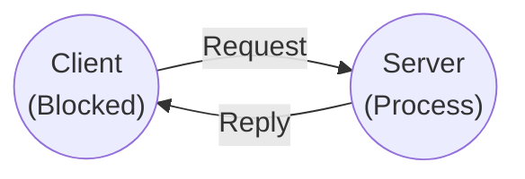
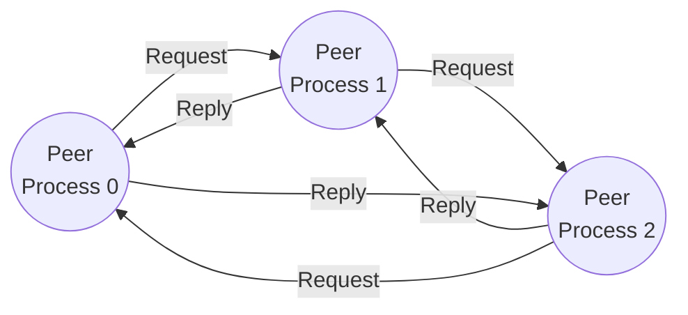
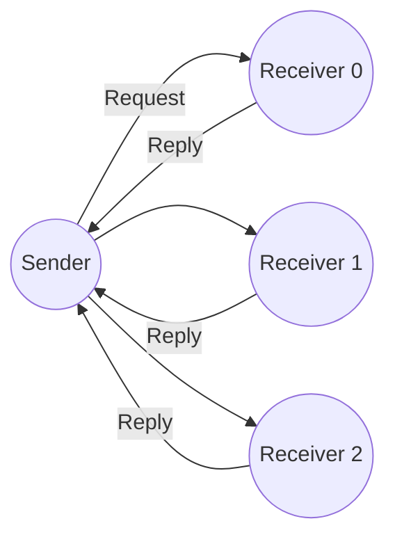
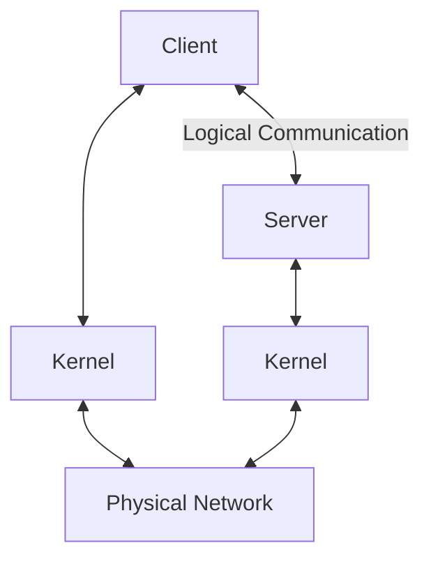

# Network Architecture (Peckol, kap. 16.7, s. 627–637)

## Metadata

| Felt | Værdi |
|---|---|
| **Kursus** | SWISE-01 Indledende System Engineering (SW4PRJ4-02) |
| **Kilde** | James K. Peckol, *Embedded Systems Design: A Contemporary Design Tool* — chapter 16.7 *Network Architecture* (16.7–16.9), pp. 627–637 |
| **Kilde-fil** | ISE Book-kompendium: `chapters/11_Peckol_Ch16-7_NetworkArchitecture.tex` + `spillover/12_to_11.tex` (sidste side, indsat til sidst) |
| **Type** | lærebogskapitel |
| **Sprog** | engelsk (bogtekst ikke oversat; figurbeskrivelser og noter på dansk) |
| **Emner dækket** | Remote device model, N-layer network architecture, OSI vs. TCP/IP protocol stacks (transport, session, network/Internet, host-to-network, application), client-server, peer-to-peer, group multicast, message structure (header/payload, frames/datagrams/packets), header-indhold, connection-oriented vs. connectionless (circuit vs. packet switching), datagram / acknowledged datagram / request-reply, remote tasks, duplicate requests, at most once semantics, atomic transactions, node/link failure, RPC/RPI, stubs |

Note om transskriptionen: Kilden er en LaTeX-transskription af fotograferede bogsider. Figurer er TikZ-rekonstruktioner og gengives her som tabel/prosa (mermaid hvor topologien er entydig). Sidste side (`spillover/12_to_11.tex`, venstre side af første foto i mappe 12) begynder midt i en sætning og er placeret sidst. Intet er rettet eller opfundet.

---

## 16.7 Implementing the Remote Device Model — A First Step

We now begin the message-exchange portion of the remote device model. Communication between electronic devices depends on a protocol for transmitting and receiving messages. This is the transport level we start with.

Distributed embedded applications may use a proprietary network or one built from a standard. In either case the transport topology is typically serial and the information flow is full duplex. A transport architecture is usually a hierarchy of virtual networks. Above the physical portion of the transport mechanism sits a stack of software layers, and each layer on one machine interacts with the corresponding layer on the other machine.

*Figur 1 (Peckol Figure 16.40): An N Layer Network Architecture*

To identiske lodrette lagstakke (venstre maskine og højre maskine), hver med syv lag ovenfra og ned: Application Layer, Presentation Layer, Session Layer, Transport Layer, Network Layer, Data Link Layer, Physical Layer. Nabolag er forbundet lodret. Mellem stakkene står en høj skraveret blok mærket *Software Boundary* (ud for de øverste lag) og under den en blok mærket *Hardware* (ud for de nederste lag). Vandrette pile forbinder hvert lag med det tilsvarende lag på den anden maskine:

| Lag (begge maskiner) | Pil-label |
|---|---|
| Application Layer | layer *n* protocol |
| Presentation Layer | layer *n−1* protocol |
| Session Layer | layer *n−2* protocol |
| Transport Layer | layer 1 protocol |
| Network Layer | layer 0 protocol |
| Data Link Layer | (umærket) |
| Physical Layer | (umærket) |

At each level, a potentially different language is spoken. The language is the protocol for that level. The service at a level is provided to the level above, so the relationship between layers is that of a service provider and a service consumer. Typically, the lower levels are implemented in hardware and the upper levels in software.

In distributed systems the layers are often described through the OSI and TCP/IP protocol stacks. OSI was proposed and standardized by the International Organization for Standardization. TCP/IP is the practical protocol family that became the backbone of networked systems. Many embedded applications use one of these stacks, or a commercial derivative, rather than a proprietary design.

### The OSI and TCP/IP Protocol Stacks

The OSI model specifies seven layers. The TCP/IP model is usually represented as a five-layer hierarchy. The physical and data-link functions of OSI are combined into the host-to-network layer in TCP/IP. The transport layer appears in both models. The OSI session and presentation layers do not have direct counterparts in TCP/IP, while the application layer in TCP/IP absorbs the upper OSI responsibilities.

*Figur 2 (Peckol Figure 16.41): Layers in the Network Architectures for the OSI and TCP/IP Models*

| OSI | TCP/IP |
|---|---|
| Physical | Host to Network |
| Data Link | Host to Network |
| Network | Internet |
| Transport | Transport |
| Session | Not Present |
| Presentation | Not Present |
| Application | Application |

The following diagrams compare the two architectures. Notice that the network layer and everything below it are hardware-oriented, while the upper layers are software-oriented.

*Figur 3 (Peckol Figure 16.42): The Network Architectures for the OSI and TCP/IP Models*

To hierarkier side om side.

**OSI Hierarchy** (venstre): syv bokse ovenfra og ned — Application, Presentation, Session, Transport, Network, Data Link, Physical — hver med en pil til en høj blok til højre mærket *Software Boundary*. Under stakken en bred blok *Physical Network*.

**TCP/IP Hierarchy** (højre): fire bokse ovenfra og ned — Application, Transport, Internet, Host to Network — hver med en pil til en høj blok til højre mærket *Software Boundary / Hardware*. Under stakken en bred blok *Physical Network*.

| | OSI Hierarchy | TCP/IP Hierarchy |
|---|---|---|
| Lag (top → bund) | Application, Presentation, Session, Transport, Network, Data Link, Physical | Application, Transport, Internet, Host to Network |
| Sideblok | Software Boundary | Software Boundary / Hardware |
| Bund | Physical Network | Physical Network |

**OSI — Transport Layer.** The transport layer accepts data from the session layer and subdivides it into packets that can be exchanged with a corresponding transport layer on another machine. The intent is to isolate the application from the underlying mechanics of the network.

**TCP/IP — Transport Layer.** The TCP/IP transport layer serves the same purpose as the OSI transport layer. The two transport protocols named here are TCP and UDP.

**OSI — Session Layer.** The session layer permits users on different machines to communicate. It supports dialog control, synchronization, and token management, and it can help reassemble a message if a transfer is interrupted.

**TCP/IP — Host to Network.** At this level the host system simply has to connect to the network and transmit or receive IP packets. The OSI network layer corresponds to the TCP/IP Internet layer.

**OSI — Network Layer.** The network layer handles routing of a transmission from source to destination. It must accommodate addressing, message size, and protocol differences between networks.

**TCP/IP — Internet Layer.** The Internet layer is the core element of TCP/IP. It defines the packet format and the Internet Protocol, IP. Its job is to move data between source and destination across the network.

**OSI — Application Layer.** The application layer is the software side of the OSI model. A number of incompatibilities that matter in embedded systems, such as file systems and remote procedure execution, show up here.

**TCP/IP — Application Layer.** The application layer in TCP/IP duplicates much of the responsibility already identified in OSI. In practice one usually selects a commercially available protocol stack rather than inventing a proprietary one.

### The Models

Most distributed embedded systems implement a message-based exchange using one of three communication patterns: client-server, peer-to-peer, and group multicast.

#### The Client-Server Model

The client-server model closely parallels the producer-consumer model studied earlier. A server, or a set of servers, exists to provide a service required by a client. The pattern uses request-reply messages.

*Figur 4 (Peckol Figure 16.43): The Client-Server Model for Message-Based Exchange*

To cirkler: *Client (Blocked)* og *Server (Process)*. Pil fra Client til Server mærket *Request* (øverst), pil fra Server til Client mærket *Reply* (nederst).

The client transmits a request to the server process and blocks. The server executes the request and returns the reply. In this model the server is aware of the message as soon as it arrives, while the sending process waits until the reply is received.

#### The Peer-to-Peer Model

The peer-to-peer model follows naturally from client-server. There is no predesignated server. Any member of the network may request a service from or provide one to any other member. Several clients may interact with a single server at the same time, and the peer-to-peer model permits several nodes to provide the requisite services.

*Figur 5 (Peckol Figure 16.44): The Peer-to-Peer Model for Message-Based Exchange*

Tre cirkler *Peer Process 0*, *Peer Process 1*, *Peer Process 2* i en trekant. Hvert par er forbundet med et Request/Reply-pilepar:

| Request fra → til | Reply fra → til |
|---|---|
| Peer Process 0 → Peer Process 1 | Peer Process 1 → Peer Process 0 |
| Peer Process 1 → Peer Process 2 | Peer Process 2 → Peer Process 1 |
| Peer Process 2 → Peer Process 0 | Peer Process 0 → Peer Process 2 |

Synchronization is achieved through the message exchange itself, as in the client-server model, but the roles are distributed across peers.

#### The Group Multicast Model

The group multicast model comprises a single sender and multiple receivers. It is useful when information must be sent to a group of interested processes. The same task can also be used to discover services or announce presence. The approach can be fault tolerant because the same message can reach several servers.

*Figur 6 (Peckol Figure 16.45): The Group Multicast Model for Message-Based Exchange*

Én cirkel *Sender* til venstre og tre cirkler *Receiver 0*, *Receiver 1*, *Receiver 2* til højre. Pile fra Sender til hver Receiver (den øverste mærket *Request*; de to andre umærkede) og en pil mærket *Reply* fra hver Receiver tilbage til Sender.

## 16.8 Implementing the Remote Device Model — A Second Step

We now examine the client-server and group multicast communication schemes in more detail. Peer-to-peer follows naturally from client-server. We begin with the client-server model by looking at the fundamental components of such systems, including the data structures and the messages.

### The Messages

When designing distributed embedded systems, one quickly discovers that remote operations make up a substantial proportion of the interactions between processes. Such operations are initiated by one process sending a request message to another process. The receiving process responds with an acknowledgment or a reply indicating that the operation has been or will be carried out.

At the most abstract level, a message is a collection of bits, and the exchange is the movement of those bits from one place to another. To make message-based communication tractable, rules are applied to the exchange and to the interpretation of the bits.

*Figur 7 (Peckol Figure 16.46): An Abstraction of the Basic Message*

Én rektangulær boks mærket *Data*.

### The Message Structure

One interpretation views some of the bits as data or payload and other bits as header information. The payload is the information being transported. Moving the payload from one place to another is the ultimate objective of sending the message. The header information is added by the communication driver to provide addressing, control, and synchronization information.

Not all messages are the same size. They may be simple and occupy only a few words of memory, or they may be complex and comprise a large number of blocks of data. The design of the exchange process is cleaner and more robust if the bits are organized so that fixed-size groupings are always transferred. Such groupings are often referred to as frames, datagrams, or packets.

*Figur 8 (Peckol Figure 16.47): A Header Added to the Basic Message*

Én rektangulær boks opdelt i to felter: *Header* (venstre, mørkere) og *Data* (højre).

| Header | Data |
|---|---|

*Figur 9 (Peckol Figure 16.48): The Basic Message Decomposed into Packets*

Én bred boks: felt *Header* til venstre, derefter *Data*-delen opdelt af stiplede lodrette linjer i pakker mærket P0, P1, P2, P3, P4, P5, P6, P7, P8, P9, P10.

| Header | P0 | P1 | P2 | P3 | P4 | P5 | P6 | P7 | P8 | P9 | P10 |
|---|---|---|---|---|---|---|---|---|---|---|---|

### Message Control and Synchronization

There are actually two kinds of control and synchronization in a message-based exchange: the header information and the data-transfer scheme.

#### The Header

The header information is overhead that is necessary for getting the data from one place to another. It is added at each level within the protocol stack by the communication driver, based on the requirements of the exchange protocol at that level. Potential header elements include the destination address or a message identifier. At minimum, the header identifies the destination for the message. In a networked context it may also provide routing information and identify both sender and receiver.

The header may indicate the size of the message in several ways. There may be unique start and end identifiers, or a start identifier and a length field. The header generally includes information about the message type or structure. It may be useful to distinguish between data-type messages and command-type messages, for example.

#### The Transfer Scheme

The physical information transfer may follow a proprietary protocol or one of the standards, or a derivative of one of those standards. Two kinds of service are commonly identified: connection-oriented and connectionless.

A connection-oriented service establishes a specific connection between the source and destination before the exchange of any data. The exchange then follows, and the connection is terminated afterward. Messages enter one end and are extracted from the other end, and ordering is preserved. The exchange is designated as reliable because the reply is effectively an acknowledgment. This kind of exchange is often described as circuit switching, and each packet uses the same physical path.

A connectionless service does not establish a specific connection before the exchange begins. Each packet carries full address information, and packets may arrive through different routes and need not arrive in the same order in which they were sent. Such a scheme is referred to as packet switching. A connectionless exchange is best effort.

Messages may be sent as a datagram service, in which the receiver does not acknowledge; as an acknowledged datagram service, in which the receiver acknowledges; or as a request-reply service, in which the sender transmits a datagram containing a request and the receiver returns a datagram containing the answer. The last scheme is commonly used in the client-server model.

| Service | Modtagerens respons | Typisk brug |
|---|---|---|
| Datagram | ingen acknowledgment | best effort |
| Acknowledged datagram | acknowledgment | — |
| Request-reply | datagram med svar | client-server |

*Figur 10 (Peckol Figure 16.49): The Basic Message Decomposed into Packets* *(kildens caption er identisk med Figur 9)*

Én boks opdelt i *Header* (venstre) og *Data* (højre) — en enkelt pakke med sin egen header.

*Figur 11 (Peckol Figure 16.50): Address Information Added to Each Packet*

Ti pakkebokse på række. Hver boks er delt lodret i et venstre felt (adresse + type) og et højre felt (pakkenummer):

| Pakke | P0 | P1 | P2 | P3 | P4 | P5 | P6 | P7 | P8 | P9 |
|---|---|---|---|---|---|---|---|---|---|---|
| Venstre felt | Adx Hdr | Adx Hdr | Adx Data | Adx Data | Adx Data | Adx Data | Adx Data | Adx Data | Adx Data | Adx Data |

Dvs. de to første pakker bærer adresse + header, de otte følgende adresse + data.

*Figur 12 (Peckol Figure 16.51): A High-Level View of a Client-Server Model*

Fem bokse: *Client* (øverst venstre) og *Server* (øverst højre) forbundet med en bidirektionel pil mærket *Logical Communication*. Under Client en boks *Kernel*, under Server en boks *Kernel* (bidirektionelle pile Client↔Kernel og Server↔Kernel). Nederst en boks *Physical Network* med bidirektionelle pile til begge Kernel-bokse.

## 16.9 Working with Remote Tasks

The next step in examining the inner workings of message-based remote operations begins with the client-server model. In this model, processes, whether local or remote, either provide a service or request one. The former are servers and the latter are clients. Any process may play either or both roles.

### Preliminary Thoughts on Working with Remote Tasks

Before proceeding with the development of remote functionality, it is important to keep several major differences between local and remote tasks in mind. The initial view of distributed client-server interaction is shown in Figure 12. The client and the server each assume direct communication with the other, but the communication link actually passes through the local kernel to the network and then to the remote node, where the message is interpreted and passed to the local process.

One important issue is the possibility that the complete message may not be received, or that the remote request may be interrupted and rejected. Consequently, the remote procedure may never be executed, may be only partially executed, or may be completely executed. These alternatives can create serious safety problems. Even when a requested remote procedure is completed, a failure to confirm that completion may cause additional requests to be made.

#### Repeated Task Execution

The repetitive nature of request and reply traffic makes it necessary to consider what happens if a task is restarted, duplicated, or only partially completed. The design has to anticipate message loss, retries, and uncertain completion.

If all components in an external system speak the same language, there may be no need for conversion. More often, however, the outside world is made up of a heterogeneous collection of devices, communication methods, and data representations. The interface must therefore cope with differences in size, endianness, and the structure of exchanged data.

---

### Spillover: sidste side af kapitlet (`spillover/12_to_11.tex`)

*(Indholdet nedenfor er transskriberet fra venstre side af det første foto i mappe 12 og hører til slutningen af dette uddrag. Brødteksten starter midt i en sætning — "... may cause additional requests to [be issued]" — dvs. den fortsætter afsnittet om gentagne remote requests ovenfor.)*

### Working with Remote Tasks

[...] be issued. If the request is of the form, "decrease flow rate of an inhibitor or increase the temperature of a process," repeated requests may create serious safety problems. When designing the exchange, one must consider

- how to avoid such duplicate messages;
- how to handle missed acknowledgments;
- how to handle both the success and failure of an operation.

In an attempt to anticipate and manage such situations, contemporary distributed embedded applications incorporate what are called *at most once* semantics and *atomic transactions*. We will examine both of these shortly.

### Node Failure, Link Failure, Message Loss

A distributed system is susceptible to a variety of failure modes not seen in the local model. One can generally detect failure, but often it is not possible to distinguish between a link failure, a node failure, or a message loss. Once a fault is detected, the appropriate action can be taken.

### Procedures and Remote Procedures

In a traditional software application, perhaps the most commonly used means for encapsulating a set of software instructions is the procedure. A procedure call is executed on the main processor by writing the name of the procedure followed by the associated parameters enclosed in parentheses. When that procedure resides in a remote address space, we would still like to be able to use similar semantics. Such an invocation is known as a remote procedure call (RPC). One may also see the terminology *remote procedure invocation* (RPI) used.

Remote procedure calls are similar to, yet different from, the familiar local procedure calls. Support for the remote call generally includes an interface language processor, a binding service, and a communication driver. The invocation is most commonly based on a request-reply protocol. The client invokes a service by sending request messages to the server. The server performs the requested service and sends a reply back to the client. Generally, the client waits for a reply before proceeding, analogous to a local call.

#### Calling a Remote Procedure — RPC Semantics

The remote procedure call (RPC) paradigm combines the familiar (local) procedure call model with the client-server model. The goal of the RPC model is to have tasks interact with local and remote procedures seamlessly.

When a local procedure is called, parameters and any return value are usually passed into and returned from that procedure via a stack. Following the call, the calling procedure then blocks waiting for the return. Such an approach is not possible with a remote procedure. Nonetheless, it is desirable that the remote call appear as if it had been local.

The first step in creating such an illusion is to write stubs for the procedure that are then placed on the client and server. These stubs have the same public interface — the same procedure name, return type, and signature — as the full procedure. The public interface masks the behind-the-scenes magic.

When the server process is ready, it will execute a blocking receive. When the client performs the call, the input parameters are passed to the server as values to arguments in a …

*(transskription: uddraget slutter her, midt i sætningen.)*
