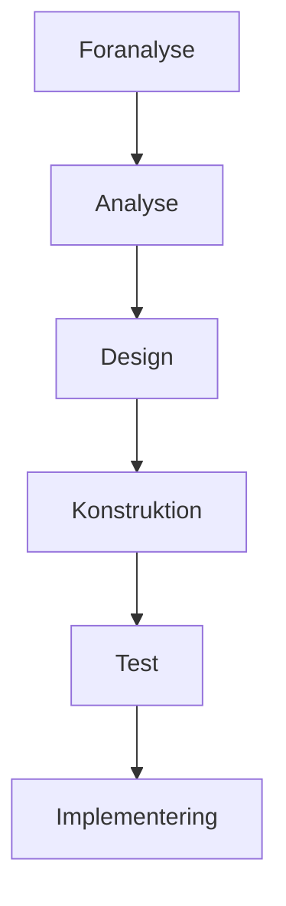
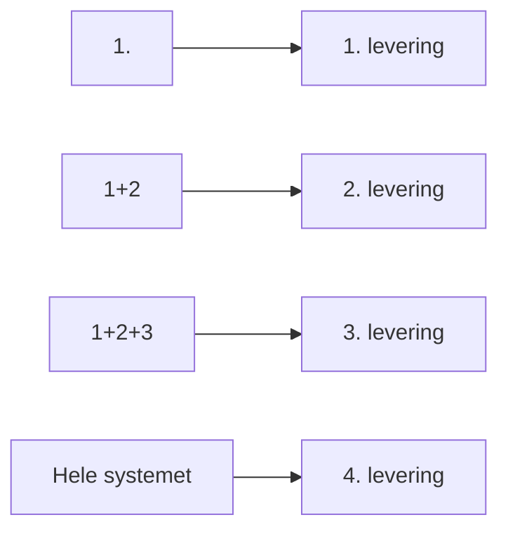
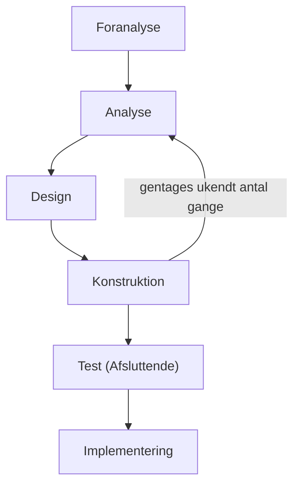
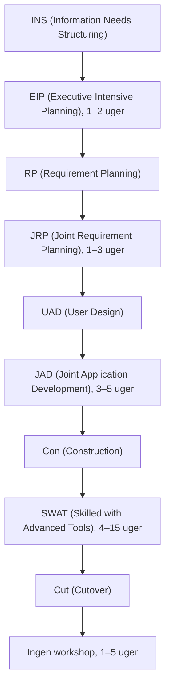
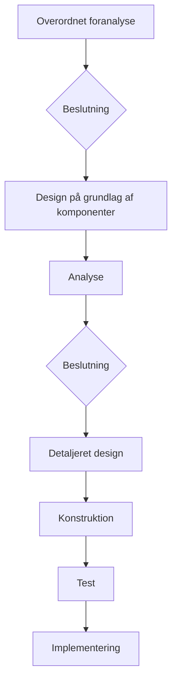
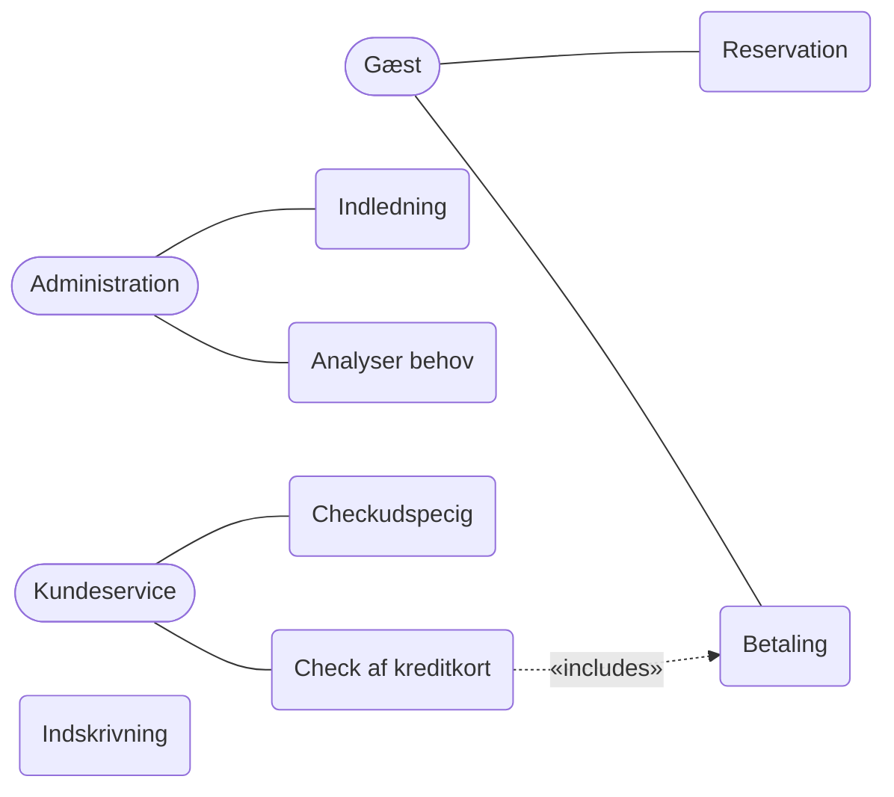

# Udviklingsprocesser (Vinje)

## Metadata

| Felt | Værdi |
|---|---|
| **Kursus** | SWISE-01 Indledende System Engineering |
| **Kilde** | Poul Staal Vinje, *Projektledelse af systemudvikling*, Nyt Teknisk Forlag, 3. udgave. Kap. 5.8–5.9 (s. 100–103), kap. 6.3 (s. 119–131), kap. 10.1–10.7 (s. 259–277). Transskription: `ISE Book/chapters/13_Vinje_Udviklingsprocesser.tex` |
| **Type** | lærebogskapitel |
| **Sprog** | dansk |
| **Emner dækket** | Projektmodel, udviklingsmetodik, strategier (udviklings-, test- og indføringsstrategi), vandfald, delleveringer, cyklisk udvikling, versionsvis udvikling, RAD, RAP, genbrug, teststrategier (traditionel, V-model, 0-fejl), agile metoder, RUP (faser, workflows, roller, artifacts), Use Cases |

Form: kondenseret gengivelse af kapitlets faglige indhold, sektion for sektion med samme overskriftsstruktur som kilden. Ikke en ordret afskrift. Alle figurer er rekonstrueret fra tex-kildens TikZ-noder. Steder hvor transskriptionen er afbrudt eller ulæselig er markeret.

---

## 5.8 Projektmodel

> Vinje s. 100–102

### Formål

En projektmodel bruges både som projektlederværktøj og som produktivitetsfremmende foranstaltning (det samme gælder udviklingsmetodik, afsnit 5.9). Formålet er at planlægge projektforløbet ud fra en generel model. Bogens definition:

> *En projektmodel er en teoretisk og forenklet model af et projektforløb.*

- **Teoretisk**: modellen bliver aldrig identisk med det konkrete forløb; der er altid afvigelser fra standardforløbet.
- **Forenklet**: den indeholder kun aktiviteter, der forekommer i flertallet af projekter, beskrevet kort og generelt.

Trods det er modellen nyttig på tre områder:

- **Udvikling** — skelet for aktivitetsplanlægning og fremgangsmåde. Faser, de fleste hovedaktiviteter og en del detailaktiviteter fås direkte fra modellen. Projektet bruger derfor ingen tid på rammerne, lidt tid på det sædvanlige og mest tid på det projektspecifikke.
- **Kommunikation** — interessenter ved på forhånd, hvad et oplæg fra projektgruppen forventes at indeholde (fx om krav til svartider og tilgængelighed fastlægges i dette oplæg eller et senere).
- **Dokumentation** — løbende dokumentation i et standardiseret udseende.

### Kreativitet og standardisering

En model begrænser ikke kreativiteten; den fjerner planløshed og sikrer, at alle aktiviteter huskes. Erfarne projektledere har ofte egne, solide retningslinjer, så behovet virker lille — problemet viser sig, når medarbejderne forlader organisationen.

### Modeltyper

Der findes modeller rettet mod administrative systemer, mod bestemte udviklingsmetodikker og mod integrationsprojekter (hvor udvikling er en mindre del af arbejdet).

Til et almindeligt målstyret projekt findes mange "færdige" vandfaldsmodeller med faserne:

1. Foranalyse
2. Analyse
3. Design
4. Konstruktion
5. Test

Hver fase er detaljeret i 10–20 hovedaktiviteter og flere hundrede detailaktiviteter.

Til et cyklisk (iterativt) forløb nævnes DSDM (Dynamic Systems Development Method), skræddersyet til iteration med prototyper, med faserne:

1. Business Study
2. Functional Model Iteration
3. Design and Build Iteration
4. Implementation

*Modellens faser gennemføres flere gange med stigende detaljeringsgrad.*

### Sammensatte modeller

*(Overskriften står i kilden uden brødtekst.)*

### Gennemførelse

Ved opstart vurderes modellens aktiviteter: hvilke er overflødige i dette projekt, og hvilke skal tilføjes? Den reviderede model bruges derefter som:

- skelet for aktivitetsplanlægningen,
- grundlag for tidsestimeringen,
- grundlag for kalenderfastsættelsen,
- skelet for bemanding.

En gennemarbejdet model indeholder også forslag til reviews og milepæle.

### Resultat og anvendelse

Modellen giver en grundlæggende systematik og fungerer som skelet for aktiviteter knyttet til bestemte tidspunkter: økonomiopfølgning, kvalitetsstyring, styregruppegodkendelser, uddannelsesmateriale, brugervejledninger.

Modellen kan udbygges med formelle udviklingsmetodikker (fx E/R- eller OO-analyse) ved at placere de nødvendige aktiviteter i modellen; resultaterne integreres i den samlede systemdokumentation efter hver fase.

---

## 5.9 Udviklingsmetodik

> Vinje s. 102–103

### Formål

Kun relevant for udviklingsprojekter (ikke integrations-/implementeringsprojekter). Metodikker understøtter en systematisk analyse- og designproces — fejl i disse faser er de dyreste at rette og mest afgørende for interessenternes tilfredshed. Teknikkerne kan være enkeltstående eller integrerede (fx Rational Unified Process med værktøjsstøtte).

### Valg af metodik

- En god metodik giver produkter, som interessenterne kan læse og forstå.
- Den skal rumme værktøjer til tre formål: den kreative udredende fase, dokumentation af udredningen (grafer/modeller) og verifikation/test af resultatet. Automatisering er en fordel.
- Grundvalg: **totalmetode** (købes typisk sammen med en udviklingsmodel, anvendes integreret, kræver ofte tilsvarende omlægning af hele udviklingsafdelingen og omfattende uddannelse) versus **kombination af flere uafhængige metodikker** (mere situationsbestemt; det naturlige valg for de fleste organisationer).
- Har organisationen ingen standard, bør projektlederen selv vælge metodikker til projektet.

### Gennemførelse

Metodikken kan anvendes i samarbejde mellem interessenter og projektgruppe; det kræver, at alle kan afsætte tid, og at direkte medvirkende uddannes i metodikken.

### Værktøjsstøtte

Automatisering giver markant gevinst, men metodikken skal være formel og anerkendt i litteraturen. Automatisering garanterer ikke systematisk indførelse; når metodik er valgt og uddannelse gennemført, understøtter værktøjer den praktiske brug — især vedligehold af modeller og grafiske fremstillinger, som ellers kræver meget manuel tid.

### Resultat og anvendelse

Metoderne indeholder normalt en fremgangsmåde og en eller flere diagrammeringsteknikker, fx til dokumentation af data-, proces- og … *(transskriptionen er afbrudt her.)*

---

## 6.3 Strategier

> Vinje s. 119–131

### Indledning

Strategierne dokumenterer projektets overordnede styring af forløbet. Godkendte strategier påvirker organisation, fremgangsmåde, sammensætning af projektdeltagere og valg af værktøjer. Valget baseres på forandrings-, system- og projektmålene.

Observation om projektledere: IT-baggrund giver ofte manglende erfaring med (og bevidsthed om) strategisk planlægning; relevant videregående uddannelse giver bevidsthed, men mangler indsigt i systemudviklingsprojekters natur. Strategisk planlægning er derfor et uddannelsesbehov uanset baggrund — og et argument for at rekruttere projektledere med forskellig baggrund.

### Styr på projektet

- Projektlederen skal styre forløbet, ikke omvendt; strategier er midlet.
- Strategier tager udgangspunkt i målene og øger sandsynligheden for at nå dem; de giver aktiviteterne mening og indbyrdes sammenhæng.
- Udarbejdes af projektlederen; godkendes af styregruppe/liniechef, projektdeltagere og nøgleinteressenter. Effekt: fælles opfattelse og fælles forventninger til styringen, færre løbende beslutninger, overordnede retningslinjer for projektlederens handlerum.
- Eksempel: et mål om "0-fejl" skal bakkes op af en teststrategi, der beskriver hvornår, hvem og hvordan.

### Indholdets omfang

- En strategi er et dokument i projektets formelle dokumentation: mål + midler (taktiske tiltag der sikrer målet).
- Virksomhedsplanlægningens tre niveauer — strategisk, taktisk, operationelt — bruges også til projektet (et projekt er en minivirksomhed med begrænset levetid).
- Strategien dokumenterer de to øverste niveauer; projektplanen dokumenterer det operationelle niveau (aktiviteterne). Projektets fysiske planlægning = et antal strategier + en projektplan.
- En strategi fylder sjældent mere end et par sider: væsentlig, konkret, kortfattet.

### Taktisk planlægning

Strategiske mål realiseres med taktiske tiltag inden for fire områder:

| Område | Spørgsmål |
|---|---|
| *Opgaver* | Hvilke aktiviteter skal udføres for at nå målet? |
| *Aktører* | Hvilke typer medarbejdere skal udføre aktiviteterne? |
| *Organisation* | Hvilke styrende relationer skal etableres mellem aktørerne? |
| *Teknologi* | Hvilke metoder, teknikker og værktøjer er nødvendige? |

Der er typisk flere mulige svar; valget af taktisk løsning giver planen dens projektspecifikke præg. Områderne kan gennemgås i fri rækkefølge, i praksis i flere omgange, fordi analysen af ét element skaber behov for at behandle de øvrige. *(Afsnittet er afbrudt midt i en sætning i transskriptionen.)*

### Strategiske områder

Strategiske mål grupperes i en eller flere strategier, hver dækkende et væsentligt område. Et systemudviklingsprojekt har normalt brug for tre:

- **Udviklingsstrategi** — mål for og beskrivelse af udviklingsforløbet
- **Teststrategi** — mål for og beskrivelse af afprøvningsforløbet
- **Strategi for indføring** — mål for og beskrivelse af implementeringen

### Udviklingsstrategier

Grundtyper, som gennemgås:

- Vandfald
- Delleveringer
- Eksperimentel eller cyklisk udvikling
- Versionsvis udvikling
- Rapid Application Development (RAD)
- Rapid Application Prototyping (RAP)
- Genbrug

Genbrug virker umiddelbart som et taktisk produktivitetsmiddel, men når målet er at øge mængden af muligt genbrug, giver det mening at beskrive det som strategisk mål.

#### Vandfald

Princip: en hel fase gøres færdig, før den næste startes (foranalyse færdig → analyse → osv.). Man kan ikke gå tilbage mod strømmen. Betingelser for at bruge den: veldefineret og velkendt opgave, kort varighed (under ca. 3 måneder), kendt forretningsområde, udviklingsmetodik, platform og testmiljø. Er betingelserne ikke opfyldt, er strategien forkert.

*Figur 6.3: Vandfald med overlappende faser.* (Kildens figur viser faserne som en trappe med overlap mellem naboer; TikZ-rekonstruktionen i tex viser kun den lineære kæde.)

| | |
|---|---|
| **Anvendelighed** | Små og korte projekter; kendt forretningsområde; kendt teknologi; veldefinerede mål som projektgrundlag |
| **Fordele** | Let at styre; let at planlægge; billig når den er anvendelig |
| **Ulemper** | Sårbar over for ændringer i projektets grundlag; maksimalt sårbar over for risici |
| **Anbefalinger** | Stram styring af ændringer; overlap mellem faser; inspektion af mål og kravspecifikation |

Figur 6.3 er praktisk talt en grovplan. Den primære ulempe er sårbarhed over for kravændringer, så der er brug for stram, formel ændringsstyring. Overlappet mellem faser betyder, at næste fase åbnes, før den aktuelle lukkes endeligt — for at se, om der dukker overraskelser op, som kræver, at projektet bliver lidt længere i den aktuelle fase.

#### Delleveringer

Systemet udvikles og leveres i flere fysiske delleveringer, når nogle dele har større betydning end andre. Opdeling og udvælgelse styres af brugernes eller leverandørorganisationens forretnings-/markedsmæssige behov (fx Time-to-Market: det vigtigste for kunder/markedet leveres først; mindre afgørende dele kommer senere, end de ellers kunne).

*Figur 6.4: Delleveringer.* Hver levering indeholder de foregående dele plus den nye.

| | |
|---|---|
| **Anvendelighed** | Lange projekter; kort Time-to-Market; stramme tidsplaner |
| **Fordele** | Antal og indhold af leverancer kan styres; det mindst brugbare leveres aldrig (konstant nedprioritering) |
| **Ulemper** | Forvaltningsbehov parallelt med udvikling; ressourcer til ændringsstyring |
| **Anbefalinger** | Lad interessenterne vælge opsplitning; faste leveringsintervaller, fx 3 eller 6 mdr. |

- Største ulempe: vedligeholdelsesbehov opstår efter første dellevering (som i sagens natur er den vigtigste); forvaltnings- og supportgrupper skal etableres.
- Projektlederen bestemmer ikke antal og indhold af leverancer — det overlades til køber/salgsafdeling. Til gengæld defineres en formel, aftalt leveringsplan.
- Hver dellevering køres som et isoleret vandfald; den første skaber den overordnede arkitektur og bereder vejen for de næste.

#### Eksperimental strategi/cyklisk udvikling

Her forlades den målstyrede udvikling. Ægte eksperimentel strategi arbejder med et ukendt antal versioner; planlægning er vanskelig, fordi naturlige milepæle mangler. Nødvendig ved nye forretningsområder eller ny teknologi, hvor den optimale løsning ikke kan besluttes, men kun findes ved at lære mere. Strategien er "naturlig" for udviklere og slutbrugere — ændringshåndtering er nem, hvor den i andre strategier er en risiko — men den er heller ikke begrænset af budgetter eller leveringsdatoer.

*Figur 6.5: Eksperimentel/Cyklisk.* Løkken Analyse → Design → Konstruktion gennemløbes et ukendt antal gange før afsluttende test.

| | |
|---|---|
| **Anvendelighed** | Søge-lære-processer; nyt forretningsområde; ny teknologi; uklare krav eller mål |
| **Fordele** | "Naturlig" for udviklere og brugere; ændringskrav kan absorberes |
| **Ulemper** | Ingen planlægning; ingen opfølgning; testen skal gentages, og i fuldt omfang til sidst |
| **Anbefalinger** | Brug et prototypeværktøj; brugerne skal være aktive deltagere; annoncér lukketider; strategien skal være ønsket af interessenterne |

Kompetente brugere med tid og evner til konkret deltagelse styrker forløbet.

#### Versionsvis udvikling

Giver interessenterne indflydelse undervejs uden at være egentlig eksperimentel: prototyper/versioner udvikles i en søge-lære-proces, men **antallet af versioner aftales fra start**. Hver version omfatter i princippet hele systemet med stigende detaljeringsgrad; versionerne kan ikke sættes i drift, kun bruges til at afgøre det videre forløb. Figur 6.6 i bogen viser et forløb med fire versioner *(ingen TikZ-rekonstruktion i kilden)*.

| | |
|---|---|
| **Fordele** | Brug af prototypeværktøj; brug/køb af bestemte versioner; planlægges med kendte milepæle; interessenter forbereder sig på formelle godkendelsesreviews |
| **Ulemper** | Kræver stort brugerengagement, når en version skal vurderes |
| **Anbefalinger** | Vælg kompetente og motiverede brugere omhyggeligt; afsæt tid til ændringer efter hver version |

Typisk forløb: første version er en ren brugergrænseflade-prototype, næste tydeliggør hvilke data der bliver tilgængelige, derefter et par versioner med den færdige funktionalitet. Ulempen: koordinering af mange menneskers indsats og planlægning af, hvordan en version gøres tilgængelig for brugerne — det kræver meget af projektlederen at sikre interessenternes medvirken.

#### Rapid Application Development (RAD)

Det rigtige valg ved kort leveringstid og faste datoer. Bygger på at samle de rigtige personer på de rigtige tidspunkter i det nødvendige tidsrum: workshops af 1–3 ugers varighed. De første workshops involverer beslutningstagerne direkte — de beskriver selv, hvad de vil have, i stedet for at vurdere projektgruppens arbejde bagefter. Første workshop beslutter hvilke data/informationer systemet skal håndtere (fx som "Business Objects"); næste fastlægger funktionskrav; derefter 3–5 ugers samarbejde mellem slutbrugere og udviklere om systemets udseende; til sidst 4–15 ugers konstruktion. Figur 6.7 viser et forløb på ca. et halvt år.

*Figur 6.7: Rapid Application Development.* Hvert trin består af en fase (INS, RP, UAD, Con, Cut) og den tilhørende workshop-form med varighed.

| | |
|---|---|
| **Anvendelighed** | Overholdelse af leveringsdato; projekter med tidspres; ikke fuldt specificerede mål |
| **Fordele** | Høj produktivitet; involverer beslutningstagere; forcerer nødvendige kompromiser og beslutninger |
| **Ulemper** | Isolerede løsninger; stort ressourceforbrug uden for projektet; afhængig af de rette ressourcer; planlægning bliver personafhængig |
| **Anbefalinger** | Nøje udvælgelse af deltagere; brug værktøjer i hele forløbet; anvend Time-Boxes og milepæle |

Fokuseret, intenst arbejde giver høj produktivitet — men risiko for skyklapper og manglende integration med andre systemer og forretningsområder.

#### Rapid Application Prototyping (RAP)

RAP har samme grundstruktur som versionsvis udvikling, men lægger mere vægt på det prototypeudviklende element. RAP ligner DSDM og andre "Agile" metoder, der hurtigt kommer i gang med prototyper. DSDM bygger på en veldefineret strategi: dynamisk samarbejde mellem udviklere og interessenter støttet af navngivne prototyper; DSDM ser sig selv som et RAD-koncept, men med prototyping i centrum. Et rigtigt RAD-forløb sammenlignes derimod med at affyre en kanon mod et mål — ingen trinvis forfining. *(Resten af afsnittet er delvist ulæseligt i transskriptionen; pointen er, at model og arbejdsproces begge skal passe til det system, der udvikles.)*

#### Genbrug

To formål:

- **Strategisk**: skabe nye komponenter til fremtidens systemer.
- **Taktisk**: genbruge/købe allerede udviklede komponenter.

Fælles: beslutningen skal træffes tidligt, og bruger/køber/marked skal acceptere, at løsningen ikke er 100 % skræddersyet. Genbrug er især et produktivitetsmiddel; skabelse af genbrugelige komponenter giver fremtidig produktivitet, men koster tid i det skabende projekt.

Genbrug kan omfatte: design, kode, databeskrivelser, Design Patterns, Use Cases, testdata, planer, varigheder (realiserede estimater), kravspecifikationer, dokumentation, risikoanalyser (forsigtigt) m.m. Genbrug er ofte et supplement til en anden strategi, men skal have strategisk status, for at det taktiske apparat kommer på plads.

*Figur 6.8: Genbrug.* To beslutningspunkter: efter den overordnede foranalyse (hvilke komponenter designes der ud fra?) og efter analysen (før detaljeret design).

| | |
|---|---|
| **Anvendelighed** | Alle projekttyper undtagen "Mission critical"; stram Time-to-Market og stram økonomi (kun anvendelse, ikke skabelse af genbrug) |
| **Fordele** | Høj produktivitet; standardisering |
| **Ulemper** | "80 %'s løsninger"; vanskelige beslutninger i starten af projektet |
| **Anbefalinger** | Opbyg en kritisk masse af muligt genbrug; hold fokus på emnet fra start til slut |

### Teststrategi

Målet for testens effektivitet fastlægges ud fra købers behov for korrekthed og pålidelighed samt konkurrenternes formåen. Fejlfri produkter foretrækkes, men alt har en pris — projektlederen må tage udgangspunkt i testbudgettet. Som minimum bør projektlederen undlade at skubbe testen til sidste øjeblik, undlade at lade som om planlægning er gratis, og faktisk opstille et testbudget.

Tre basisstrategier: **den traditionelle** (vent til sidst), **V-modellen** (planlæg tidligst muligt) og **"0-fejl"** (udfør tidligst muligt).

#### Den traditionelle

Testen planlægges og udføres sidst i forløbet. Velegnet til mindre opgaver på velkendte forretningsområder. Fordel: testen baseres på et færdigt system. Ulempe: dyrere, fordi fejl findes sent. Testaktiviteterne optræder først på projektplanen efter konstruktionsfasen.

#### V-modellen

Testen planlægges tidligt — det er i sig selv en kontrol af, at objekt-/data-/funktionsmodellerne er forståelige og konsistente:

| Testniveau | Planlægges detaljeret efter |
|---|---|
| Accepttest | Foranalysen |
| Bruger- og systemtest | Analysefasen |
| Integrationstest | Designfasen |
| Komponenttest | Uændret i forhold til den traditionelle strategi |

Udførelsen ligger stadig sidst i forløbet — testfaserne planlægges altså i modsat rækkefølge af den, de udføres i. V-modellen er grundlaget for IEEE's teststandarder. Den største forskel for testerne: planlægningen baseres på tidlige modeller, ikke det færdige system. For OO-systemer bygger system- og brugertest på tre grundmodeller: objektmodellen (klassehierarki og relationer), kommunikationsmodellen ("messages") og den funktionelle model (Events/Use Cases). Udvides V-modellen med reviews og inspektioner, bevæger projektet sig — afhængigt af hvor tidligt og omfattende — over mod "0-fejl".

#### 0-fejl

Også kaldet "zero-defect". Fejl hindres i overhovedet at opstå; verifikation og validering udføres parallelt med udviklingen. Ulempe: høj pris. Resultat: fejlfrit, stabilt og vedligeholdelsesvenligt system, og leveringsdatoer overholdes — testindsatsen bliver ikke forkortet, fordi udviklingen forsinkes. Udfordring: at kunne teste i hver fase med en detaljering og pålidelighed, der finder alle fejl; produktet skal være fejlfrit på ethvert tidspunkt. Testerne (inkl. brugere/købere) skal tage det alvorligt og bruge testscenarier, der er lige så gennemarbejdede som i en traditionel test af et færdigt system. Kræver mere omfattende brug af prototyper, formelle metoder og løbende inspektioner og verifikationer.

### Opsummering af teststrategier

| Strategi | Planlægning | Udførelse |
|---|---|---|
| Traditionel | Til sidst, "som i gamle dage" | Til sidst |
| V-model | I modsat rækkefølge af udførelsen (tidligt) | Som vanligt (til sidst) |
| Udvidet V-model | Som V-model + et passende antal reviews og inspektioner — der "lånes" fra 0-fejl, så meget budgettet tillader | Som vanligt |
| Ægte 0-fejl | Modsat vanetænkningen | Modsat vanetænkningen (løbende) |

- V-modellen er den for tiden mest anvendte, eller i det mindste mest ønskede.
- Gør man ikke noget aktivt, ender man med et traditionelt forløb.
- Betatesten er kun vist skematisk i bogens figur 6.9 *(ingen TikZ-rekonstruktion i kilden)*; nogle placerer den før accepttest, andre efter. Den er strategisk set ikke afgørende.
- Henvisning: "Struktureret test" i litteraturlisten.

---

## 10.1 Indledning

> Vinje s. 259–260

Valget af styringsprocesser kan angribes fra flere vinkler. Én er **veldefineret** tilgang kontra **"Agile"** tilgang:

- Veldefineret: projektet planlægges med roller, processer og resultater, der er kendt på forhånd. Bedste model: Rational Unified Process (RUP).
- Agile: mindre vægt på det formelle, mere på kommunikation. Eksempel: Extreme Programming (XP).

"Agile" betyder behændig eller smidig. Andre agile metoder end XP:

| Metode | Karakteristik |
|---|---|
| **SCRUM** | Supplerer XP ved i højere grad at sigte på ledelsesprocessen; velegnet til ustabile krav, konfliktende interesser og krav om effektiv levering af fejlfri software |
| **Crystal Clear** | Medlem af en familie af processer; Alastair Cockburn (kendt fra Use Cases) er drivkraften |
| **ASD** (Adaptive Software Development) | Tilpasser sig situationen, gerne ved selvorganisering på tværs af organisationen og af virtuelle teams |
| **DSDM** (Dynamic Systems Development Method) | En gammel kending; ikke udbygget med de teknikker, der gør den rigtigt agil. Væsentligste bidrag: "Prototyping" og "Timeboxing" |

Fællestræk for agile metoder: iterative, drevet af konkrete brugerønsker, "Timeboxed", sigter på fejlfri software, risikodrevne (kende og forholde sig til risici), tolerante over for ændringer, og kommunikative — mennesker i dialog frem for kommunikation via dokumenter.

URL: www.agilealliance.com

---

## 10.2 RUP — konceptet

> Vinje s. 260–261

- RUP (Rational, nu IBM) er en projektmodel og et eksempel på formel udvikling med et veldefineret forløb.
- Fordele for projektledere: stærk kravstyring, fokus på risikostyring, iterativ, værktøjsstøttet. Værktøjerne er integrerede og giver sporbarhed fra krav til testcases og retur.
- Moderne testsyn: løbende verifikation og validering — nødvendigt i et iterativt forløb.
- Dokumenteret elektronisk, tilgængelig via browser; skabeloner nås via links.
- Støttes direkte af UML, som visuelt understøtter systemet. UML-modeller bruges både til kommunikation med forretningssiden og mellem udviklere.
- RUP (model af processen) og UML (model af systemet) kan bruges hver for sig, men giver størst udbytte sammen.

---

## 10.3 RUP i praksis

> Vinje s. 261–264

RUP består af:

| Element | Antal |
|---|---|
| Faser | 4 |
| Processer ("Workflows") | 9 |
| Roller | 33 |
| Aktiviteter | mange |
| Produkter ("Artifacts") | 63 |
| Skabeloner ("Templates") | mange |
| Retningslinjer ("Guidelines") | mange |

*Figur 10.1: Rational Unified Process* ("pukkeldiagrammet"). Kildens TikZ er en forenklet skitse med henvisning til originalfiguren; strukturen er:

| Workflow \ Fase | Inception | Elaboration | Construction | Transition |
|---|---|---|---|---|
| Forretningsanalyse | ● | | | |
| Kravstyring | ● | ● | | |
| Analyse og design | ● | ● | ● | |
| Implementering | | ● | ● | ● |
| Test | ● | ● | ● | ● |
| Udrulning | | | ● | ● |
| Konfigurationsstyring | ● | ● | ● | ● |
| Projektledelse | ● | ● | ● | ● |
| Miljø | ● | ● | ● | ● |

Faserne løber vandret over tid og er opdelt i iterationer (#1 … #8 i skitsen); for hvert workflow viser en "pukkel"-kurve, hvor tyngden af arbejdet ligger. Prikkerne ovenfor er afledt af teksten i 10.4–10.5 (hvilke workflows der er aktive i hver fase), ikke af selve figuren.

- De fire faser: "Inception", "Elaboration", "Construction", "Transition".
- Når en eller flere iterationer har frembragt grundlaget for næste fase, afholdes et review (evt. som workshop), der formelt afgør, om milepælen er nået. Faseafslutning = vigtig milepæl.
- Faserne er tidsmæssige forløb; langs faserne gennemføres iterationer. Projektets produktionsplan er derfor en **iterationsplan**. I en iteration udføres arbejde defineret af workflows — alle workflows kan være aktive i en iteration.
- Iterationslængde: få uger i små projekter, 2–4 måneder i store.
- Hele processen drives af **Use Cases** (brugsmønstre) i en Use Case Model. Use Cases er både RUP- og UML-begreb. Projektlederen bruger dem som drivende element i udvikling (aftalegrundlag med omverdenen) og test (grundlag for testscenarier).

*Figur 10.2: Use Case Model* (hotel-eksempel, forenklet udvalg). Aktører: Gæst, Administration, Kundeservice. Use casen "Indskrivning" står i kildens figur uden forbindelse til en aktør. Navnet "Checkudspecig" er gengivet som i transskriptionen (formodentlig OCR-fejl).

Oversættelse af workflow-navne brugt i teksten:

| RUP | Dansk |
|---|---|
| Business Modeling | Forretningsanalyse |
| Requirements | Kravstyring |
| Analysis & Design | Analyse og design |
| Implementation | Implementering |
| Test | Test |
| Deployment | Udrulning |
| Configuration & Change Management | Konfiguration- og ændringsstyring |
| Project Management | Projektledelse |
| Environment | Miljø |

---

## 10.4 Faserne

> Vinje s. 264–269

### Fase: Inception

Formål: etablere en **vision** for produktet — konkret i dokumentet "Vision", som beskriver omfang, indhold, økonomi og andre væsentlige forhold. Visionens indhold dokumenterer de fleste af fasens aktiviteter:

- Problembeskrivelse
- Afgrænsning af produktets omfang
- Indholdet
- Prioritering af funktionalitet
- Risikoanalyse
- Overordnet arkitektur

Øvrige produkter: liste over de centrale Use Cases, de første prototyper, accepttestkriterier, estimat på samlet tidsforbrug og et budget.

Ofte én iteration, men kan være flere. Aktive workflows: Forretningsanalyse, Kravstyring, Analyse og design, Test, Projektledelse, Miljø.

Iterationer allerede her er en fordel: mere information ud af projektgruppen tidligt → mindre risiko for at gå i forkert retning.

#### Milepæl: Inception er slut

Nøgleinteressenterne godkender "Visionen", estimater og budget, og det checkes, at de er indbyrdes enige. Milepælen sikrer formelt, at **målet er det rigtige**.

### Fase: Elaboration

"Elaboration" = at sætte detaljer på. Fasen skal styres håndfast — mange muligheder for misforståelser, som viser sig som fejl, når systemet bruges.

- Drives af arbejdet med Use Cases. Ved fasens slutning skal 80 % af de identificerede Use Cases være skrevet så detaljeret, at der ikke er risiko for misforståelser — og det skal være de vigtigste og mest risikofyldte. Risici er i centrum.
- Use Cases skal foreligge i en Use Case Model med sammenhæng og aktører.
- Aktive workflows: Kravstyring, Analyse og design, Implementering, Test, Projektledelse, Miljø.
- Arbejde med de centrale UML-modeller: Use Cases, klassemodeller, sekvensdiagrammer, aktivitetsdiagrammer, samarbejdsdiagrammer.
- Dokumentationsmængden vokser; det er svært at holde den konsistent med mange interessenter og aktører. Inspektioner og reviews holder projektgruppen på sporet.
- Ikke-funktionelle egenskaber (robusthed, brugervenlighed, performance) skal gøres kontrollerbare nu — at vente til konstruktionsfasen kan være for sent. Workflowet "Kravstyring" indeholder trin og retningslinjer til at specificere dem.
- Brug risikoanalysen til kvalitetsstyring: reviews, inspektioner og demonstrationer (bl.a. med prototyper) rettes mod de identificerede risici.

#### Milepæl: Elaboration er slut

Interessenterne er enige om, at **indholdet er det rigtige**, og der foreligger sammenhængende dokumentation, som er udviklet og dokumenteret på den rigtige måde.

### Fase: Construction

Leverer kode, tabeller, ASP'er og øvrige fysiske dele — hurtigst muligt noget, brugerne kan teste. Bygger på UML-diagrammerne og -modellerne.

- Tænk både horisontalt og vertikalt: hvor detaljeret arbejdes der på langs af faserne, og hvor omfattende er iterationerne?
- Råd: detaljér elaboration maksimalt, så risici er fjernet, og konstruktion bliver så simpel som muligt — men brug korte iterationer for ikke at ende i vandfaldstankegang.
- Alle workflows kan være aktive; naturligt aktive: Implementering, Test, Udrulning.
- Test: komponent- og integrationstest af færdige dele; systemtest når iterationerne har givet et sammenhængende produkt; derefter **alfatest** (brugere tester i udviklernes miljø); hold øje med **betakandidater**, så brugerne kan prøve systemet i det endelige miljø.

#### Milepæl: Construction er slut

Systemets kvalitet er god nok som betakandidat — det vil ikke være spild af brugernes tid.

### Fase: Transition

Formål: implementering. Efter konstruktionsiterationerne gennemføres en eller flere Transition-iterationer: samlet alfatest samt beta- og accepttest. Før, under eller efter: produktmodning (afpudsning, fejlrettelser, dokumentation, konverteringer, integration til andre systemer) og aktiviteter uden for egentlig test (uddannelse, opdatering af helpdesk osv.).

Alle workflows kan teoretisk være aktive (pga. rettelser og modning); de centrale: Implementering, Test, Udrulning.

#### Milepæl: Transition

Projektet er færdigt, når den oprindelige "Vision" er opfyldt, og en godkendt accepttest dokumenterer det.

---

## 10.5 Workflows

> Vinje s. 269–274

Workflows er det bærende element i en procesbaseret model som RUP: de binder **roller, aktiviteter og artifacts** sammen. RUP giver oversigter både med udgangspunkt i roller og i artifacts. Til hvert workflow hører vejledninger og skabeloner. Alle workflows er teoretisk mulige i hver fase — kun "Udrulning" er ikke aktiv i "Inception" — men i praksis har hver proces sin tyngde i en eller flere faser.

### Workflow: Forretningsanalyse

Spænder fra videreudvikling inden for et eksisterende forretningsområde over bredere analyse af et forretningsområde til analyse af hele forretningen — forskellige veje gennem workflowet afhængigt af ambitionsniveau. Resultatet er i alle tilfælde grundlaget for kravene til IT-systemerne. 35 vejledninger til rådighed (forretningsmodellering, Use Case Model m.m.). Dokumenteres med UML-diagrammer:

- Use Case Model
- Use Cases
- Klassemodel
- Objektmodel
- Samarbejdsdiagrammer (Collaboration Diagrams)
- Sekvensdiagrammer
- Aktivitetsdiagrammer
- Tilstandsdiagrammer

### Workflow: Kravstyring

Kravstyring er projektets grundstruktur; forretningsanalysens resultater er grundlaget for kravene. *(Andet afsnit i transskriptionen er ulæseligt.)*

### Workflow: Analyse og Design

Aktiviteter inden for de væsentligste områder — dem, der sætter brugerne i stand til at bruge produktet. *(Kort og delvist korrumperet i transskriptionen.)*

### Workflow: Implementering

Ud over selve systemet kan der være behov for uddannelse og næsten altid for supportfunktioner. Andet element i en god implementering: et produktionslignende miljø, hvor betafasen tester i det endelige produktionsmiljø.

### Workflow: Test

Gennemgående workflow. Slutkriterium: kvaliteten er på det ønskede niveau, alle tests er udført, og de er defineret på grundlag af Use Cases.

### Workflow: Udrulning

Produkt: en selvstændig "Deployment Plan". *(Transskriptionen er ellers ulæselig.)*

### Workflow: Konfiguration- og ændringsstyring

*(Én ulæselig sætning i transskriptionen; hovedpointen er, at styringen hænger sammen med et velfungerende produkt.)*

### Workflow: Projektledelse

Giver konkrete, realistiske planer for projektet.

### Workflow: Miljø

Miljøet skal understøtte projektets gennemførelse.

---

## 10.6 Rollerne

> Vinje s. 274–275

- Hver rolle i RUP er beskrevet med de artifacts, rollen styrer og producerer.
- Projektlederen får via rollerne (med tilknyttede opgaver, ansvar og kompetencer) fuldt indblik i et workflow.
- **Fordele**: bedre styring af aktiviteter, bedre brug af vejledningerne, tydeligere ansvar, klar arbejdsfordeling; rollerne er velbeskrevne og umiddelbart anvendelige.
- **Ulemper**: ikke alle roller passer alle mennesker; med erfaring opdager man, at roller kan være for begrænsende og ikke altid dækker den samlede kompetence, man vil bringe i spil.

---

## 10.7 Artifacts

> Vinje s. 275–277

Artifacts er alle produkter, der fremstilles i projektet: modeller, dokumenter, kode m.m. RUP's faktiske arbejde starter, når en artifact produceres; projektets tidsplan viser, hvornår de kan forventes.

RUP's «Artifact Overview» med de væsentligste dokumentationsenheder:

- Interessenternes ønsker
- Vision
- Forretningsmodel
- Risici
- Kravspecifikation, herunder Use Case Model og supplerende krav til egenskaber
- Begreber – forklaringer
- Udviklingsplan
- Udrulningsplan
- Arkitektur, software
- Analysemodel
- Designmodel
- Implementeringsmodel
- Testplan

---

## 10.8 Use Cases

> Vinje s. 277

Use Cases er scenarier udbygget med nøjere definerede oplysninger i et standardiseret format — "formelle scenarier". Dansk: «Brugsmønster».

En Use Case beskriver tre ting:

1. Et hændelsesforløb, som det foregår forretningsmæssigt (fx «kunde beder om levering af vare»).
2. Brugerens reaktion på hændelsen (fx «brugeren aktiverer skærmbillede til levering af vare»).
3. Systemets forventede reaktion på det, brugeren gør (fx «viser skærmbillede xxx …»).

En Use Case svarer til én forretningsmæssig hændelse og dækker alle varianter inden for hændelsen.
