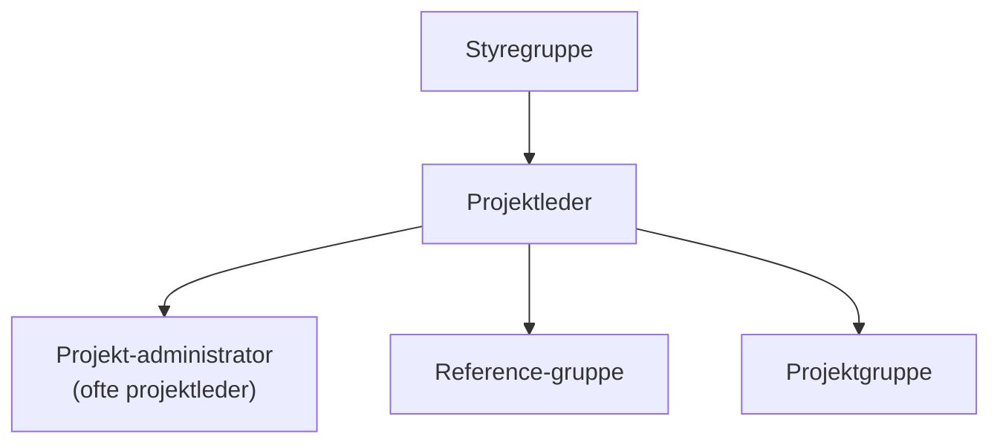

# Projektledelse af systemudvikling (Vinje)

## Metadata

| Felt | Værdi |
|---|---|
| **Kursus** | SWISE-01 Indledende System Engineering |
| **Kilde** | Poul Staal Vinje, *Projektledelse af systemudvikling*, Nyt Teknisk Forlag, 3. udgave. Kap. 3.1–3.4 (s. 22–37), 3.7 (s. 50–60), 5.4 (s. 83–92), 5.5 (s. 94), 5.6, 6.4 (s. 137–140), 6.5 (s. 140–141), 6.7 (s. 178–183). Transskription: `ISE Book/chapters/14_Vinje_Projektledelse.tex` |
| **Type** | lærebogskapitel |
| **Sprog** | dansk |
| **Emner dækket** | Projektorganisation (styregruppe, projektleder, projektadministration, referencegruppe, projektgruppe), lederroller, projektlederens egenskaber, motivation, projektkultur og image, risikoanalyse (S/K/P-model), SWOT, projektopstartsseminar, aktivitetsplanlægning, tidsestimering, fysiske planer (milepæle, grundplaner, detailplaner) |

Form: kondenseret gengivelse af kapitlets faglige indhold, sektion for sektion med samme overskriftsstruktur som kilden. Ikke en ordret afskrift. Transskriptionen af dette kapitel er stedvis stærkt korrumperet (OCR-støj); de steder er markeret, og der er ikke gættet på indhold.

---

## 3.1 Generelt

> Vinje s. 22–23

- Projektorganisationen i fuldt udviklet form er et fleksibelt og effektivt instrument. Fleksibiliteten er nødvendig, fordi opgaverne er forskellige — men den skaber også problemstillinger, der skal løses i det enkelte projekt.
- Projektledelse og organisatoriske forhold bestemmes af opgavens karakter. Man kan vælge en delmængde af elementerne eller den fulde form.
- Hvert element kan etableres mere eller mindre formelt. Eksempel: en referencegruppe kan være en formel gruppe, der samarbejder om fælles løsninger, eller enkeltpersoner, der yder ad hoc-bistand.
- Yderpunkter: kun en deltids-projektleder, der får aktiviteter udført via underleverandører i andre afdelinger — til fuld form med alle dele bemandet med fuldtidsressourcer.
- Problemet ved fleksibiliteten: styringsgrundlaget (ansvar, opgaver, kompetence) varierer tilsvarende. Forudsætningen er, at den valgte struktur og kompetence er kendt og anerkendt af den øvrige organisation.
- I praksis er det projektlederen, der får de daglige arbejdsgange til at fungere uanset form.

---

## 3.2 Den fuldt udviklede organisation

> Vinje s. 23–26

*Figur 3.1: Projektorganisationen.* Projektadministrator og referencegruppe er stabsfunktioner under projektlederen; projektgruppen er linjen. (Kildens figur har etiketten "Ofte projektleder" ved projektadministratoren og "Videre" ved referencegruppen.)

| Element | Rolle |
|---|---|
| **Styregruppen** | Løser de problemer, der ligger uden for projektlederens kompetence — dens kompetence begynder, hvor projektlederens slutter. Projektets organisatoriske forankring. |
| **Projektlederen** | Ansvar for at idégrundlaget realiseres; dagligt ansvar for projektgruppen. |
| **Projektadministrationen** | Ansvar for planlægning og opfølgning. Varetages ofte af projektlederen, men kan udskilles som stabsfunktion, der refererer til projektlederen. |
| **Referencegruppen** | Eksperter, der stiller viden til rådighed. Typisk kortvarig; sjældent konstruerende — oftere vurderinger af produkter og indstillinger om det videre forløb. Også kaldet høringsgruppe. Der kan være flere. Stabsfunktion under projektlederen. |
| **Projektgruppen** | Gennemfører aktiviteterne på projektplanen. Hel- eller deltid, men refererer altid til projektlederen mht. det faglige indhold. |

### Opgaver, ansvar og kompetence

Alle opgaver skal løses, og de skal løses ét sted i organisationen. Hvert organisatorisk element skal kende og anerkende sin kompetence og bruge den tilsvarende. *(Afsnittet er delvist korrumperet i transskriptionen.)*

---

## 3.3 Styregruppen

> Vinje s. 26–31

Styregruppen sikrer et kompetent beslutningsgrundlag. Sammensætningen skal repræsentere flere interessenter, og beslutningerne skal afbalancere interessenternes hensyn til én samlet interesse. *(De følgende tre afsnit i transskriptionen er ulæselige; de handler om styregruppens forhold til linjeorganisationen og til leverandører i andre afdelinger.)*

### Styregruppens sammensætning

Sammensættes, så projektet får det beslutningsgrundlag, det har brug for. *(Én korrumperet sætning i kilden.)*

### Kalibrering af projekters resultat

En af styregruppens vigtigste funktioner: at afstemme projektets resultat med, hvad der er brug for. *(Korrumperet i transskriptionen.)*

### Brugen af projektets resultat

Styregruppen repræsenterer brugen af resultatet — det er en del af dens formål. *(Korrumperet i transskriptionen.)*

### Projektlederens bindsæl

Overskriften er som transskriberet (formodentlig "bindeled"). Pointen: liniechefen har en særlig interesse i beslutningerne, fordi de hænger sammen med linjeorganisationens aktiviteter, afdelingsstrategi og organisationsindstillinger. *(Ellers ulæseligt.)*

### Underleverandører

Kun aftagere/underleverandører med en reel rolle bør sidde i styregruppen. *(Korrumperet.)*

### Styregruppens opgaver

- Vurdere og følge de ændringer, projektet kan overveje; styregruppen står over projektet og skal acceptere løsningen og den aftalte metode.
- Vurdere konsekvenserne af ændringer i projektets omgivelser: lovgivning, strategier, markedsforhold.
- Ændringer kan ikke undgås; det er ændringernes konsekvenser, der skal styres. *(Resten korrumperet.)*

### Styregruppens ansvar

- Ansvar for at projektet har en passende sammensætning og tilstrækkelige ressourcer; den udviser tillid ved at godkende de nødvendige projektkonsekvenser.
- Styregruppen er afhængig af projektledelsens evner; den kan ikke selv bære det operationelle ansvar.
- Projektadministratoren lægger op til projektlederens formidling af status og bemærkninger til styregruppen. *(Korrumperet i detaljerne.)*

### Styregruppens kompetence

- Kompetence til at ændre projektets rammer: ressourcer, tidsplan og indhold. Uden den kompetence har den heller ikke ansvar for sammenhængen mellem disse forhold.
- Kompetence til at udskifte projektlederen.

### Succesfaktorer

Tre faktorer for et succesfuldt samarbejde med projektgruppen:

1. **Informationsbehovet fastlægges tidligt** (gerne ved projektopstarten). Uden løbende, rigtig information vurderer projektgruppen, at beslutninger træffes på for spinkelt grundlag — i værste fald opstår et modsætningsforhold mellem projekt- og styregruppe.
2. **Forsvarlig behandling af problemstillinger.** Undgå "her og nu"-beslutninger, også når de er motiveret af ikke at ville forsinke projektet. Tommelfingerregel: et problem, der ikke var formuleret ved mødets begyndelse og derfor ikke er behandlet af projektgruppen, kan ikke finde sin løsning på samme møde.
3. **Uddannelse** i både projektarbejde og domæneviden. Ledelse kan udøves uden teknisk viden, men projektledelse er tæt på den virkelige verden; styregruppens beslutninger har konsekvenser for projektledelsen.

Forsømmes disse, risikerer styregruppen at blive stemplet som "politisk" — en negativ vurdering: beslutninger ude af takt med virkeligheden eller med skjulte motiver. Skjulte motiver er sjældne; misforståelser forhindres med tilstrækkelig information, tilstrækkelig tid og uddannelse.

Navnet "styregruppe" antyder, at hovedopgaven er at træffe beslutninger — men den er i højere grad at løse projektets problemer. Medlemmernes opfattelse af den forskel har betydning.

### Styregruppens uddannelse

Relevant uddannelse/træning for styregruppemedlemmer:

| Aktivitet | Omfang |
|---|---|
| Projektopstartsseminar (god træning i projektarbejde og effektiv introduktion til konkrete projekter) | 1–2 dage pr. gang |
| Strategier, teori (udviklingsforløb, test, implementering — basis for at diskutere omkostninger) | 2 dage |
| Projektlederkursus | 5 dage |
| Internt seminar for nuværende og kommende medlemmer (afpudse holdninger, revidere retningslinjer) | 1 dag om året |

Uddannelsen er en god investering, der bl.a. skaber opmærksomhed på succesfaktorerne.

---

## 3.4 Projektlederen

> Vinje s. 31–37

Projektlederen er en nøgleperson: organisationens nye produkter fremstilles i projekter, og projektlederen har afgørende indflydelse på virksomhedens kultur og image.

### Virksomhedens kultur

*(De tre afsnit i transskriptionen er ulæselige. Hovedpointen fra indledningen: kulturen præges af projektlederens evne til at skabe fokus og resultater i projektorganisationen.)*

### Om projektlederen

- Primær opgave: sikre, at de nødvendige udviklingsaktiviteter er planlagt og afviklet, og at resultaterne er tilfredsstillende for alle interessenter.
- Normalt fuldtidsansat; sørger for daglig planlægning og opfølgning på de centrale ledelsesfunktioner.
- Funktionen er forankret i det konkrete projekt; opgaverne fastlægges i forankringen. *(Øvrige afsnit korrumperede.)*

### Hvad fungerer som projektleder?

*(Første afsnit ulæseligt.)* Central sætning: en projektgruppes samlede lederpotentiale er større end summen af medlemmernes, fordi samspillet mellem forskellige egenskaber giver ekstra muligheder.

### Lederegenskaber

Sammensætningen af lederegenskaber præger lederstilen så meget, at den reelt er en klassificering — men ikke en kvalitetsforskel; hver type kan fungere mere eller mindre succesfuldt. Ud fra personlig opfattelse af god ledelse, lederfærdigheder og erfaring får lederen stærke og svage sider som:

| Type | Kendetegn |
|---|---|
| **Stifinder** | Leder projektet forbi forhindringer. Findes der en vej frem, bruges den. Ændrer holdninger hos interessenter, finder det eneste mulige kompromis, lægger en strategi, der udnytter alle muligheder i omverdenen. Har planlagt så langt forud, at organisationen ikke registrerer, at en blindgyde er undgået eller en vanskelig passage forceret. |
| **Iværksætter** | Skaber fremdrift gennem et dynamisk og idérigt forløb; formulerer nye idéer og inspirerer andre til det samme. Idéer omsættes til konkrete arbejdsopgaver; udnytter eksisterende strømninger til fordel for projektet. Begejstrer ved at påpege muligheder. |
| **Kulturskaber** | Skaber resultater gennem en stærk kultur: fælles klare mål, som alle slutter op om. Projektorganisationen oplever sammenhæng i hverdagen, og aktiviteterne giver mening. Frigør ekstra reserver hos andre uden at det opleves som belastning. |
| **Psykolog** | Opfanger signaler fra omverdenen og enkeltpersoner; aflæser mekanismer og reaktioner og kan forudsige udfaldet af en beslutningsproces. Forstår baggrunde og motiver; kommunikerer meningsfuldt med mange forskellige mennesker. Resultat: roligt forløb uden misforståelser pga. fejlkommunikation. |

En projektleder er sjældent lige stærk i alle roller. Det er ikke i sig selv et problem (fremdrift kan sikres på mange måder), men en leder med udpræget profil i én kategori må i visse situationer søge hjælp hos andre.

### Projektlederens personlige egenskaber

Ud over ledelsesteoretiske begreber kan man tale om almindelige menneskelige egenskaber. Hvilke der kræves, afhænger af virksomhed, gruppe og opgave — men tilstedeværelsen af mange af følgende træk fremmer projektet:

- Kommunikere med forskellige mennesker, socialt og fagligt — i projektorganisationen og over for kunder, leverandører og liniechefer.
- Fornemmelse for situationsbestemte resultater: timing er vigtigere end at kunne arbejde mange timer i døgnet.
- Tro på sig selv, gerne formidlet ligefremt og ukompliceret.
- Skabe tiltro til planer og strategier (forudsat indholdet berettiger det).
- Komme videre fra fastlåste stillinger med mange vindere og få eller ingen tabere.
- Talent for problemløsning og for at formulere kompromiser; holde sig fri af ydersynspunkterne frem for at vælge side.
- Både lede en proces og lede enkeltpersoner samtidig.
- Øge produktiviteten uden særlige motivationsmidler — kræver åbenhed, villighed og en vis frygtløshed.
- Håndtere katastrofer (og almindelige problemer og kriser) roligt og behersket; ikke lægge en urolig problemløsning oven på en problemfyldt situation.
- Formulere sin ledelsesfilosofi uden at fortabe sig i den.
- Formulere acceptable mål for projektet og for enkeltpersoner; den enkeltes mål skal udvikle uden at stresse.
- Kritisere andres resultater, så det opfattes som vurdering af resultatet, ikke af personen.
- Acceptere, at mennesker begår fejl — som naturligt resultat af udviklingsarbejde, selvom alle bestræber sig på fejlfrihed.
- Åbenhed over for pragmatiske løsninger; dogmer og principper kan fraviges, når fravigelsen er velovervejet og synlig.

### Rekruttering af projektledere

Projektledere rekrutteres generelt fra tre grupper: (1) nøglekompetencer i projektledelse, (2) nabofunktioner i virksomhedsorganisationen (forudsætter tilsvarende projektledelseskompetence), (3) underleverandører. *(Afsnittets uddybninger er ulæselige i transskriptionen; det slutter med en pointe om, at projektlederkompetence kan udvikles i det aktive projekts tid.)*

### Ledelsesindholdet

Ledelsesindholdet deles i **internt** og **eksternt**:

- *Internt*: den daglige ledelse og planlægning — aktiviteternes ledelse og fordeling, herunder specialisterne i projektet. Aktiviteterne hører til planlæggerne, som sikrer, at de er veldisponerede. Alle projektdeltagere er bemandede; projektlederen skal skelne mellem det nødvendige og det uvæsentlige for planlægningen.
- *Eksternt*: projektets relationer til andre interessenter — en konstruktiv opgave over for kunder, leverandører og alle interessenter.
- *Underleverandører*: kun aftalte underleverandører er en del af leverancerne.

*(Afsnittet er stærkt korrumperet; ovenstående er de læsbare pointer.)*

---

## 3.7 Projektgruppen

> Vinje s. 50–60

Projektdeltagerne er en af projektlederens vigtigste ressourcer, men de vanskeligste at lede. Gruppen er afgørende for, at projektet lykkes.

> *«At skabe resultater gennem andre»* — projektlederen står med en opgave, der skal løses af andre, sat i gang med mål og hensigt i et antal aktiviteter.

### Motivation og udvikling

Motivation og udvikling er afgørende for den daglige ledelse. Medarbejdere motiveres af nye udfordringer, muligheder og individuel udvikling; motivationen er et middel til det. Kontrol og pres giver negativ effekt. Projektlederens opgave: identificere den konkrete, situationsbestemte motivationstilstand. *(Delvist korrumperet.)*

#### Motivationsfaktorer

1. **Variation/fleksibilitet.** Får medarbejderen mulighed for at bruge forskellige færdigheder — ud over det tekniske arbejde også at løse en del af problemerne i virksomheden?
2. **Arbejdsidentitet.** Kan medarbejderen identificere resultatet af sit arbejde og følge opgaven fra start til slut?
3. **Arbejdets betydning.** Opleves arbejdet som nyttigt for andre i virksomheden eller omverdenen?
4. **Selvstændighed.** Kan medarbejderen selv tilrettelægge og gennemføre arbejdet og sætte en del af rammerne?
5. **Mulighed for tilbagemelding.** Kan medarbejderen selv aflæse sin effektivitet, eller gives der tilbagemelding fra projektlederen?

### Personalledelse på lang sigt

Personaleledelse deles i kortsigtede mål (knyttet til det, der er nødvendigt nu) og langsigtede mål (knyttet til projektets og medarbejderens fremtidige tilstand). En af projektlederens langsigtede roller er feedback rettet mod personaleudvikling. *(Korrumperet.)*

### Projektdeltagernes færdigheder

- Klar udvikling mod større faglig kompetence hos den enkelte.
- Konstruktøren: det er ikke nok at programmere; man skal beherske udviklings- og testværktøjer (selvstændige dokumentationsværktøjer eller integrerede udviklingsværktøjer), prototyping (egne teknikker, værktøjer og samarbejdsformer) og evt. objektorienteret design og programmering.
- Planlæggere skal håndtere værktøjer til virksomheds- og systemanalyse, «Information Engineering» og/eller objektorienteret analyse.
- Konsekvens: projektlederen oplever projektet som bestående af specialister — også når virksomheden ikke ser dem som specialister — fordi de:
  - selv planlægger og gennemfører deres faglige uddannelse,
  - selv nedbryder hovedaktiviteter til kalendersatte detailaktiviteter,
  - *arbejdstilrettelæggelsen*: selv koordinerer med andre projektdeltagere, afdelinger og specialistfunktioner,
  - *værktøjsvalget*: selv vælger værktøj, når der er flere lige gode muligheder.
- Positiv konsekvens: projektlederen kan koncentrere sig om ledelse og styring. Omvendt vokser behovet for klare fælles mål.

### Projektkultur

- Kulturen opstår som syntese af de holdninger og regler, projektdeltagerne demonstrerer og udtrykker.
- Man kan acceptere den kultur, der opstår af sig selv — enten fordi holdningerne ikke strider mod hinanden, eller fordi en stærk kultur har overtaget. Er deltagerne uenige, er en stærk kultur nødvendig; de bagvedliggende holdninger ændres kun langsomt.
- Eksempler på generelle træk i en projektkultur:
  - Tolerance over for forskellige faglige orienteringer (udviklere accepterer tid til analyse og vurderinger, og omvendt).
  - Accept af at der begås fejl.
  - Åbenhed over for vurdering af resultater — vurderingen gælder produktet, ikke personen.
  - Aktiv konfliktløsning med kompromiser, der tilfredsstiller alle; konflikter behandles åbent.
  - Trufne beslutninger bakkes op af hele gruppen i holdning og handling.
- Lignende træk kan formuleres for møder, koordinering, dokumentation og ledelse. Eksemplerne er positive, men kan også formuleres negativt; en kulturbeskrivelse skal beskrive kendsgerninger, ikke hensigtserklæringer.
- Holdninger er ofte filosofiske i grundudtrykket og oftest enkeltpersoners; er de fælles, giver de markante projektforløb. Bogens eksempler på "slogans" med tilhørende tolkning:

| Holdning (parafrase) | Tolkning i bogen |
|---|---|
| Erfaring er billetten til gårsdagens tog | Nytænkning og det uopdagede i højsædet |
| Rigtige programmører sover aldrig | Arbejdstid sættes over fritid |
| Livet er at være på linje, resten er ventetid | Risikovillighed |
| Når alle er enige, har middelmådigheden sejret | Uenighed vurderes positivt |
| Nemmere at bede om tilgivelse end om tilladelse | Tro på egne vurderinger |
| Initiativ er lig indflydelse | Handlings- og beslutningsvillighed |
| Svært at være ydmyg, når man er de bedste | Positiv selvopfattelse |

Kulturændringer gennemføres med omhu i overskuelige, kontrollerbare skridt:

1. Enighed i gruppen om, at kulturen skal ændres (i en eller anden form og grad).
2. Afklaring af den eksisterende kultur — fælles opfattelse, eller som minimum kendskab til hinandens opfattelse.
3. Beskrivelse af den ønskede kultur — kulturen selv er svær at beskrive, men reglerne, holdningerne og mulighederne, der skal fremmes, kan beskrives.
4. Fastlæggelse af aktiviteter, der skal gennemføres for at nå den ønskede tilstand.

Proceduren kan starte med et ønske om mere samarbejde, kvalitetsbevidsthed, fælles mål osv. og naturligt ende med enighed om flere reviews og inspektioner — nemmere som led i kulturudvikling end som ordrer eller topstyrede opstramninger. Kulturen skal vurderes, udvikles og vedligeholdes løbende: processen bag produktet er væsentlig både for det faglige resultat, og fordi mennesker har krav på sammenhæng og indflydelse i hverdagen.

### Projektets image

- Image = omverdenens opfattelse af projektet. Det eksisterer, uanset om man ønsker det. Det er den faktiske opfattelse, der gælder; vil man ændre image, skal omverdenen påvirkes.
- Hvorfor interessere sig for det? Et godt image fremmer samspillet med interessenter i og uden for virksomheden; et dårligt reducerer mulighederne for succes.
- Projekter opfattes både i generelle nuancer (aggressivt — åbent — omhyggeligt — ubeslutsomt — afslappet — kvalitetsbevidst) og i indirekte imagetræk («de bruger al deres tid i mødelokaler», «de er opmærksomme på kundens behov», «de er temmelig sociale»).
- Man kan selv påvirke image ved at lægge vægt på udvalgte aktiviteter — dels ved at være det, dels ved at fremhæve, at man er det.
- Procedure som ved kulturændring, med den komplikation at analysen af det eksisterende image kræver, at interessenterne involveres (direkte interviews eller indirekte analyse af deres opfattelse).

### Ansvar, opgaver og kompetence

Teoretisk kræver projektdeltagere ingen ledelsesmæssige retningslinjer — «menige» udfører ordrer, og retten til at lede og fordele arbejdet ligger hos projektlederen. Det holder ikke i praksis.

**Ansvar.** Medarbejderne har ansvaret for, at aktiviteterne på projektplanen gennemføres i den fastsatte kvalitet og inden for de aftalte rammer.

**Opgaver.** Medarbejderens hovedopgaver:

- Nedbrydning af hovedaktiviteter til detailaktiviteter
- Estimering af detailaktiviteter
- Fremstilling af testgrundlag til egen test af komponenter
- Gennemførelse af detailaktiviteter
- Egen test af komponenter
- Rapportering af færdiggørelse

**Kompetence.** Kompetencen skal understøtte ansvaret: fuld kompetence inden for aktivitetens indhold; kompetence til at tilrettelægge arbejdet, koordinere med andre, fastlægge indstillinger og fastlægge behovet for projektlederens støtte.

### Faldgruber og fejl

Listen i transskriptionen er delvist korrumperet (flere punkter er gentagelser med ordfejl). De læsbare pointer:

- At tænke i opgaver uden at supplere med den form, der er bedst for projektet.
- At give større opgaver eller mere ansvar, end der er brug for — eller det modsatte: ikke at delegere ansvar og kompetence tilpas.
- At glemme at etablere fælles beslutnings- og ændringsprocesser; deltagere med stærkt projekttilhørsforhold kan ikke uden videre underordne sig ledelse i andre situationer.
- At lade den langsigtede personaleledelse tilhøre projektlederen.
- At projektkulturen ikke behandles.

Afsluttende pointe: mennesker har to forskellige behov — at fungere som enkeltpersoner og som medlem af en gruppe. Det tilgodeses med samarbejde, teambuilding og coaching. Gruppen skal også kunne se et klart formål. De fleste projekter er født med en identitet i form af opgaven; er det uklart, hvorfor projektet kører, og hvorfor netop denne gruppe skal arbejde sammen, skal projektlederen forklare det. "Hvorfor er vi her, hvad er meningen?" lyder filosofisk, men klare svar betyder meget for produktiviteten.

---

## 5.4 Risikoanalyse

> Vinje s. 83–92

### Formål

Afdække de risici, som — hvis de indtræffer — kan have negativ virkning på projektet. Afdækningen giver mulighed for at overveje alternative løsninger og supplere planen med aktiviteter, der imødegår risiciene. Bidrager dermed til kvalitetsstyring: «at kunne forudsige forløbet og resultaterne».

### Baggrund

Projektplanlægning er neutral — man har forsøgt at være objektiv uden at tage højde for alle tænkelige uheld. Det er i sig selv et udtryk for en ideel verden.

### Dokumentation

Risikoanalysen er et obligatorisk produkt. Projektlederen kan supplere med en SWOT, der uddyber årsagerne til risici og afdækker flere muligheder for at imødegå dem. Der findes mange modeller til vurdering af sandsynlighed, kompleksitet, risici, trusler og usikkerhed — fra omfangsrige, teoretiske/matematiske til løst formulerede rammer, hvor deltagerne selv definerer spørgsmålene.

### Gennemførelse

Foretages i forbindelse med planlægningen. Opstartsmødet udnyttes til enten den indledende analyse eller gennemgang af resultatet; under alle omstændigheder afsættes tid til at tænke i risici. Opgaven kan formuleres direkte:

> *«Hvilke forhold, i form af uheld eller mulige trusler, kan vælte planen?»*

Dokumenteres i minimumsmodellen «Risikoanalyse». For hver risiko udfyldes:

| Kolonne | Skala |
|---|---|
| **S = Sandsynlighed** | 1 = sker sandsynligvis ikke, men er muligt · 2 = lige så sandsynligt at det sker som ikke · 3 = sker sandsynligvis |
| **K = Konsekvens** | 1 = kan opsuges af planens nuværende aktiviteter · 3 = der skal gøres noget for at afbøde · 10 = planen skrider |
| **P = Produkt** | P = S × K |

**Mulige foranstaltninger.** Hvad skal der gøres? Enten fjerne/reducere risikoen eller definere et beredskab.

*Figur 5.3: Risikomodel* (minimumsmodel med fem identificerede risici):

| Risici | S | K | P | Mulige foranstaltninger |
|---|---|---|---|---|
| 1. Ændringer til kravspecifikationen | 2 | 10 | 20 | Godkendende review efter hvert faseskift |
| 2. Manglende ressourcer til test | 2 | 10 | 20 | Aftale med ekstern underleverandør om ressourcer |
| 3. Udskiftning i projektgruppen | 1 | 10 | 10 | Videnspredning via reviews og workshops |
| 4. Forsinket levering af hjælpetekster | 3 | 3 | 9 | Formel aftale om underleverance med leveringstidspunkt |
| 5. Ændringer til dialogstandarden | 1 | 3 | 3 | Stram ændringsstyring, når det sker |

### Behandling

- Risici med **P ≥ 9** giver umiddelbart anledning til handling; de øvrige vurderes.
- Handlinger er **forebyggende** (præventive) eller **beredskabsgivende**. Vælg forebyggende, når omkostningerne tillader det.

| Kombination | Handling |
|---|---|
| Høj sandsynlighed og høj konsekvens | Forebyggende aktiviteter |
| Høj sandsynlighed | Behov for beredskab |
| Lav sandsynlighed, lav konsekvens | Beredskab er nok |

Eksempel: S = 3 og K = 10 betyder "sker sandsynligvis, og planen skrider". P < 9 udløser normalt kun beredskab — eller ingen handling.

### Parathed

Et uheld kan ikke gøres usket, men der er ingen grund til rådvildhed. En beredskabsplan kan være guld værd: de beredskabsgivende aktiviteter definerer, hvad der gøres, når en risiko materialiserer sig, og øger «paratheden», hvor den behøves mest.

### Tilbageværende risici

Kriterier for, om en risiko overhovedet skal imødegås:

- Lille sandsynlighed for at den indtræffer
- Begrænsede konsekvenser
- Tilstrækkelig accept blandt interessenterne
- Dyrere at imødegå end at bære
- Kan det nås, eller er tiden forpasset?
- Vi evner det ikke
- Introducerer vi nye risici?

### Figur 5.4: Risikomodel for nyudviklingsprojekt

Eksempel på færdig model til et generelt nyudviklingsprojekt i fire kategorier. Per risikoelement angives sandsynlighed (høj = 3, medium = 2, lav = 1), konsekvens K, produkt P og forslag til risikostyring. Transskriptionen har tomme celler mange steder; for de nederste kategorier er der i stedet for tal angivet tre-fire udfaldsklasser (fra høj til lav risiko), gengivet her adskilt med " / ".

| Risikoelement | høj=3 | med=2 | lav=1 | K | Risikostyring |
|---|---|---|---|---|---|
| **Projektet i IT-organisationen** | | | | | |
| Projektlederens kvalifikationer | 3 | 2 | 1 | 6 | Kollegial coaching / Projektleder |
| Projektlederens ansvar og kompetence | 3 | 2 | 1 | 6 | Møde m/styregruppen / Projektleder |
| Styregruppe for projektet | 3 | 2 | 1 | 6 | Detaljeret model for information & rapport |
| Opgavens vigtighed | 3 | 1 | 0 | | |
| Fuldtids projektleder | 3 | 0 | 0 | | |
| Projektgruppens kendskab til forretningsområdet | 3 | 1 | 0 | 10 | Workshop med brugere / Projektleder |
| Projektgruppens kendskab til udviklingsmetoder | 3 | 2 | 1 | 10 | Seminarer med leverandørerne / Projektgruppen |
| Motivation i projektgruppen | 3 | 2 | 0 | | |
| Referencegruppe | 3 | 2 | 1 | | |
| Interne ressourcer versus konsulenter | 3 | 1 | 0 | | |
| **Projektplanlægning og -opfølgning** | | | | | |
| Målbeskrivelse | | | | 5 | Ingen målbeskrivelse / Opgaven er blot defineret som levering af et system |
| Projektstørrelse | | | | | Over 10.000 mandtimer / 1.000–10.000 mandtimer / Under 1.000 mandtimer |
| Antal underprojekter | | | | | Tre eller flere / To / Ingen |
| Tidspunkt for estimat | | | | | Før foranalyse / Før kravspecifikation / Før design / Efter design er godkendt |
| Metode anvendt til estimering | | | | | Ingen metode / Metodeelementer anvendt / Metode, der tager højde for usikkerheder |
| Usikkerhed ved estimater | | | | | > 25 % / 15–25 % / 5–15 % / < 5 % |
| **Løsning og teknik** | | | | | |
| Antal systemer | | | | | Mere end 5 afdelinger involveret / 3–6 afdelinger / Kun én afdeling |
| Eksisterende systemer | | | | | Mere end 3 eksterne underleverandører / 1–2 / Ingen |
| Underleverandørers kendskab | | | | | Ingen eller ringe kendskab til produktet / Nogen kendskab, men kan ikke klare komplicerede projekter / Solidt kendskab |
| **Brugerorganisationen** | | | | | |
| Afhængighed af andre projekter | | | | | Afhængighed af projekter med høj risiko / Afhængighed, men lav forventet risiko / Ingen afhængighed |

### Løbende model

En løbende model har flere kolonner pr. risikoelement, så analysen kan uddybes over tid og bruges til planlægningsformål. *(Korrumperet i transskriptionen.)*

#### Forebyggende droger

Overskriften er som transskriberet (formodentlig "Forebyggende tiltag"). *(Afsnittet er ulæseligt.)*

#### Separate »forebyggende« og »beredskabsgivende« aktiviteter — én praktisk opdeling

- **Hvem handler?** Enten de, der er knyttet til aktiviteterne, eller den kontraherede leverandør. *(Korrumperet.)*
- **Hvornår?** Afgøres, når det er tid til at "gøre det".

#### Risici for planskredet

En gruppe planlæggere vurderede, hvilke områder der har størst sandsynlighed for planskred. Teksten nævner 14 punkter; transskriptionen indeholder 8. Ment som inspiration til det konkrete projekt:

1. Urealistisk antal aktiviteter i planlægningen
2. Problemer med at tilknytte egnede ressourcer og bemande positioner
3. Problemer med at få interessenternes godkendelse af planen
4. Ingen procedure for behandling af ændringer
5. For svag håndtering af konflikter
6. Svært at vurdere risici
7. Projektorganisationen er ikke klar for alle
8. Uklare roller og ansvar for driftsprocesserne

---

## 5.5 SWOT

> Vinje s. 94

*Strengths, Weaknesses, Opportunities, Threats*

- Udvides risikoanalysen til en SWOT, kan man identificere både flere trusler og flere handlinger til at imødegå dem.
- **SW** = interne faktorer i projektgruppen; varierer med gruppens sammensætning og arbejdsmåde.
- **OT** = ydre faktorer; invariante i forhold til, hvilket projekt der sammensættes.

### Imødegå »svagheder« og »trusler« med »styrker« og »muligheder«

Princip: frem for at lære nye metoder, teknikker eller værktøjer er det mere effektivt at bruge eksisterende muligheder i projektet eller dets nære omverden.

### Indholdet i en SWOT

*Tabel: Indholdet i en SWOT (eksempel på nyudviklingsprojekt).*

| | Interne faktorer | |
|---|---|---|
| | **Strengths (styrker)** | **Weaknesses (svagheder)** |
| | Høj motivation | Ringe kendskab til metoder og teknikker |
| | Erfarne brugere | Ikke direkte adgang til brugere i projektgruppen |
| | Faglige færdigheder i top | Ringe viden om teknisk platform |
| | Velfungerende organisation | Manuel dokumentation |
| | Intet behov for uddannelse | Uerfarne udviklere |
| | Stabile krav | Urealistiske planer |
| | Formel kvalitetsstyring | |
| | **Eksterne faktorer** | |
| | **Opportunities (muligheder)** | **Threats (trusler)** |
| | Nye versioner af værktøjer | Høj kompleksitet af nuværende systemer |
| | Afslutning af andet projekt | Begrænsede maskinressourcer |
| | Implementering af andet produkt | Interessenternes engagement er lavt |
| | Erfaren ledelse | Urealistiske tidskrav |
| | Stabil hardware | |

---

## 5.6 Projektopstartsseminar

> Vinje kap. 5.6 (sidetal ikke angivet i kilden)

### Formål

Sikre en effektiv opstart. Seminarets indhold er aktiviteter, der under alle omstændigheder er nødvendige — formålet er at gennemføre dem effektivt og med de rigtige ressourcer. Kan afholdes, når projektet er forankret, eller efter et kravstudie.

Seminaret systematiserer brugen af en række værktøjer: interessentanalyse, informationsanalyse, risikoanalyse og tidsestimering er velegnede emner. Emnerne bearbejdes før seminaret, resultatet gennemgås af deltagerne, og der er afsluttende bearbejdning og dokumentation efter.

### Gennemførelse

- Deltagere: projektdeltagerne, evt. projektadministrator, styregruppen og nøgleinteressenterne; evt. referencegruppemedlemmer.
- Varighed: tre timer til tre dage. Bedst uden for virksomheden.
- Dagsorden (start):
  1. **Godkendelse af dagsordenen** — projektlederens forslag.
  2. **Oprettelse af projekthåndbog** — strukturen præsenteres; opret et site med let adgang og adgangskontrol svarende til informationen.
  3. **Gennemgang af projektets organisation** — kendte medlemmer præsenteres ved navn; hvert elements opgaver, ansvar og kompetence slås fast.

#### Aktører og teknologi (testeksempel)

Eksempel på taktiske tiltag for en teststrategi:

**Aktører:**
- Køberen stiller ressourcer til accept- og brugertest
- Leverandøren stiller ressourcer til systemtest
- En uafhængig testleder udpeges; koordinerer planlægning og gennemførelse, opsamling og behandling af fejlrapporter, godkendelse af gentaget test og rapportering af fremdrift

**Teknologi:**
- Testværktøjer til Capture/Replay
- Testværktøjer til load/performance-test
- Reviews og inspektioner
- Kategorisering af hver fejl samt måling af antal pr. Function Point

**Organisation:**
- Testlederen refererer til styregruppen

#### Implementeringsstrategi

*Strategiske mål og overvejelser (eksempel):* Første leverance må koste én dags instruktørstøttet undervisning pr. brugssted; resten klares af indbygget hjælp. Efterfølgende leverancer må koste ½ dag. Teknisk strategi: både system- og brugertest gennemføres under virkelighedslignende forhold. Betatest på 2 måneder på 4 brugssteder. Det gamle system bruges kun til paralleltest.

*Taktiske tiltag.* Opgaver: arrangér betatest; beskriv den mulige paralleltest. Aktører: brugere fra købers organisation; projektdeltagere.

---

## 6.4 Aktivitetsplanlægning

> Vinje s. 137–140

Planlægning = identificere og dokumentere de aktiviteter, der realiserer målene og de valgte strategier. Resultat: en opgaveliste — i første omgang uden tidsestimater og ressourcenavne; det kommer på plads, når de fysiske planer fremstilles.

### Hvorfor er planlægning så vigtig?

- Oversete aktiviteter vælter planen. En glemt aktivitet på 5 dage, der viser sig nødvendig, giver 5 dages forsinkelse — oversete aktiviteter svarer til **100 % underestimering**. Med 2–3 oversete aktiviteter fra start er skredet indbygget, før projektet er i gang.
- Planlægning kaster lys over opgaven og problemerne; man "løser" til en vis grad opgaven ved at planlægge den detaljeret.

### Planlæg test og kvalitetsstyring

Synlig kvalitetsstyring: specificér konkrete test- og reviewaktiviteter. Vis hvert review som en selvstændig, bemandet aktivitet — det øger sandsynligheden for, at det afholdes. To kontrolspørgsmål:

- Hvilke aktiviteter skal med for at udvikle det rigtige produkt til aftalt tid og pris? (udviklingsaktiviteter)
- Er der tilstrækkelig kontrol af de produkter, projektet leverer? (testaktiviteter)

### Afhængigheder mellem aktiviteter

Når alle aktiviteter er identificeret, defineres afhængighederne mellem dem. Det kan vente, til de fysiske planer fremstilles, men giver indsigt allerede under identifikationen. *(Delvist korrumperet.)*

### Standardaktivitetslister

En standardaktivitetsliste er den "talte" projektmodel og et værdifuldt grundlag for planlægningsprocessen; aktiviteter hentes fra listen til det konkrete projekt. Lister kan findes for:

- Et traditionelt (rationelt) projekt
- Agile/iterative udviklingsprocesser
- Videreudviklingsprojekter
- Et konkret projekt

### Andre metoder til at identificere aktiviteter

| Metode | Brug |
|---|---|
| **Aktivitetslisten** | Læs den igennem for at finde tilsvarende aktiviteter |
| **Kravspecifikationen** | Læs den igennem for at finde oversete aktiviteter |
| **Strategiens særlige krav** | Den valgte strategi kan give anledning til særlige aktiviteter |
| **Interessenterne** | Inddrag dem og andre projektdeltagere i gennemgangen |
| **Egne erfaringer** | Brug erfaringer fra tidligere forløb |
| **Andre projekter** | Sammenlign med andre projekters aktiviteter |
| **MindMap** | En teknik (ikke en kilde), der kan bruges til at nedbryde hovedaktiviteter til detailaktiviteter |

### Fordele ved god aktivitetsplanlægning

- Bedre overblik fra start
- Mere præcis opfølgning
- Hurtigere reaktion på ændringer
- Gennemført kvalitetsstyring
- Korrekt placering af milepæle
- Grundlag for planlægning frem mod milepæle

*(Listen i kilden har 7 punkter med ordfejl; ovenstående er de læsbare.)*

---

## 6.5 Tidsestimering

> Vinje s. 140–141

Bemærk: transskriptionen af dette afsnit er meget korrumperet. Der optræder ingen PERT-formel (eller anden formel) i tex-kilden; kun "±10 %"-reglen nedenfor er læsbar som tal.

### Generelt

Et estimat er et skøn med en sandsynlighed for at ligge over eller under det realiserede. Ser man på alle realiserede estimater, ses den gennemsnitlige afvigelse. *(Ellers ulæseligt.)*

### Hvornår er estimater lige pjælt?

Overskriften er som transskriberet. Læsbar pointe: et rimeligt mål er, at estimater ligger inden for **±10 %** — "±10 %-reglen".

### Usikkerheden

Et estimat er meget lidt værd uden viden om usikkerheden; bruges estimater uden kendskab til den underliggende usikkerhed, er der en risiko.

### Estimeringsbetingelser

Forudsætninger, der påvirker estimatets grundlag:

- Ingen viden om forudsætningerne
- Ustabile/ingen testspecifikationer
- Stabilt/ustabilt udviklingsmiljø
- Erfarne/nybegyndere som projektdeltagere
- Stabil/ustabil kravspecifikation
- Afhængighed af et veldefineret systems produkter

### Estimereteknikker

Teknikkerne inddeles i grupper (beskrivelserne i kilden er delvist korrumperede):

| Teknik | Primært |
|---|---|
| **Algoritmiske** | Opmåling af funktioner og data |
| **Ekspertvurdering** | Aktiviteter estimeret af eksperter (evt. med en database) |
| **Andre projekter** | Sammenligning med tilsvarende aktiviteter i andre projekter |
| **Egne erfaringer** | "Second guess" og løse estimater |
| **Ressourceprioritering** | Estimering ud fra tilgængelige ressourcer |

---

## 6.7 Fysiske planer

> Vinje s. 178–183

En work-package er en samling af aktiviteter, der logisk hører sammen. *(Resten af indledningen er ulæselig.)*

### Milepæle

En milepæl repræsenterer en begivenhed i forløbet med stor ledelsesmæssig betydning; aktiviteterne planlægges frem mod milepæle. En milepæl er afgrænset i tid. For mange milepæle/planlægningsmøder tilfører kompleksitet. *(Delvist korrumperet.)*

### Ressourceoversigt

Viser projektets ressourcers ledighed og overbelastning over tid i forhold til de planlagte aktiviteter. *(Delvist korrumperet.)*

### Plantyper

Kilden giver under denne overskrift en liste over milepæle/godkendelsespunkter i et forløb:

- Opstartsmøder er godkendt
- Designplanen er godkendt
- Analyseplanen er godkendt
- Objekt-/data-/funktions-/interaktionsmodel er godkendt
- Grovplaner er godkendt
- Brugergrænsefladen er godkendt
- Use Cases er skrevet og godkendt
- Testplanen er skrevet og godkendt
- Accepttesten er gennemført og godkendt
- Brugerafprøvningen er gennemført og godkendt
- Brugertest er gennemført
- Brugertesten er gennemført og godkendt

### Karakteristisk for en god plan og en god aktivitet

**En god detailplan:**

- Indeholder milepæle på den kritiske vej
- Viser de anvendte estimater, så der kan holdes styr på aktiviteterne
- Viser alle aktiviteter, der involverer interessenter
- Godkendes af styregruppen og de involverede interessenter
- Viser eksterne ressourcer, herunder underleverancer og godkendelser

**En god aktivitet på detailplanen:**

- Kort varighed (ideelt 1–2 arbejdsdage)
- Uafhængig af andre aktiviteter, med veldefineret sammenhæng til projektet
- Stabilt udviklingsmiljø
- *(Fjerde punkt ulæseligt.)*

### Hvad er en god plan og en god aktivitet?

*(Afsnittet er stærkt korrumperet.)* Læsbare pointer: vælg et grundlag, der giver aktiviteter med den rette detaljering; vurdér og tilpas aktiviteter og leverancer, herunder underleverancer; hold resultater op mod milepæle.

### Planer som aftalegrundlag

Den fysiske plan er et aftalegrundlag mellem projektlederen og interessenterne — også kunden. Planen skal være realistisk. *(Ellers korrumperet.)*

#### Grundplaner

En grundplan er en work-package: en samling aktiviteter. Grundplanen bruges som aftalegrundlag og model til at styre projektplaner; forudsætningerne kan opdeles i de samme fire kategorier som risikomodellen:

- Projektet i IT-organisationen
- Teknik og løsning
- Planlægning og opfølgning
- Brugerorganisationen

#### Detailplaner

Detailplaner supplerer grundplanen med alle aktiviteter i tilstrækkelig detaljering. Kendetegn (læsbare punkter fra en delvist korrumperet liste):

- Alle aktiviteter er bemandede
- Alle aktiviteter er planlagte og tilstrækkeligt detaljerede
- Specifikation af milestones
- Reviews
- Viser projektgruppens egne aktiviteter og underleverancerne
