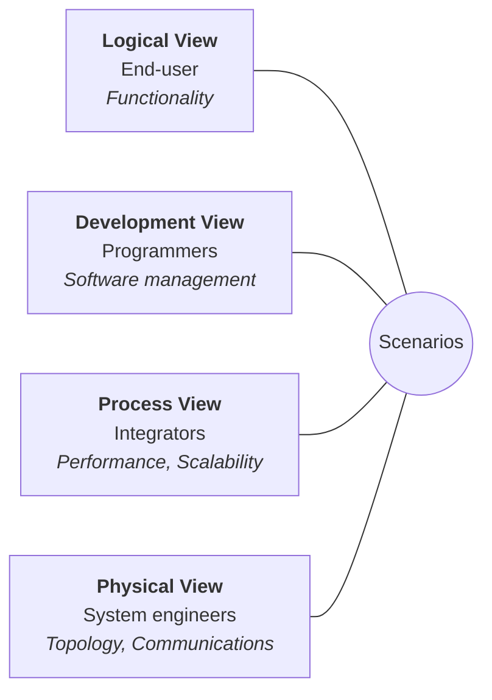
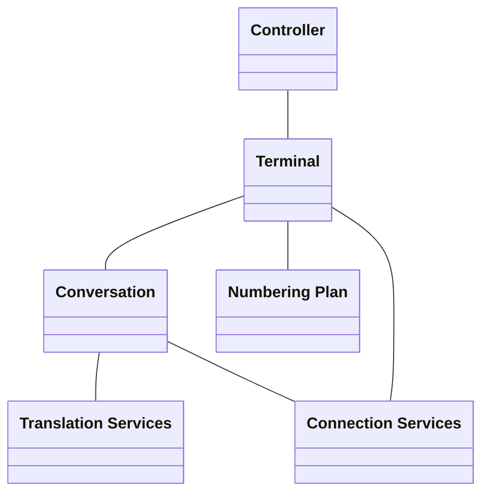
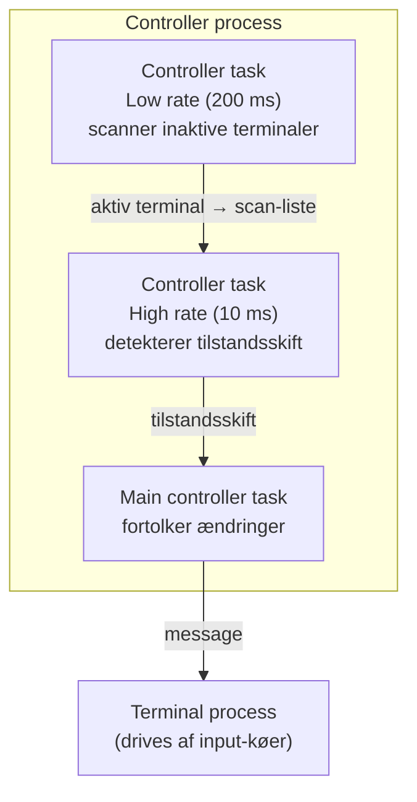
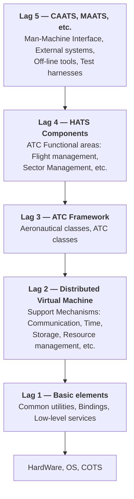
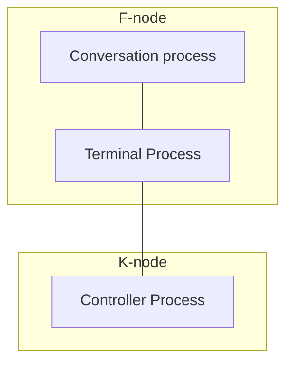
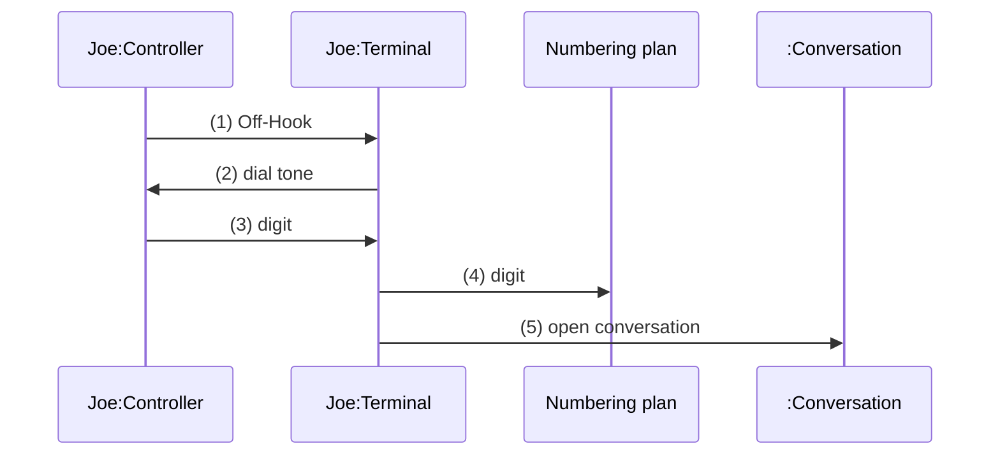
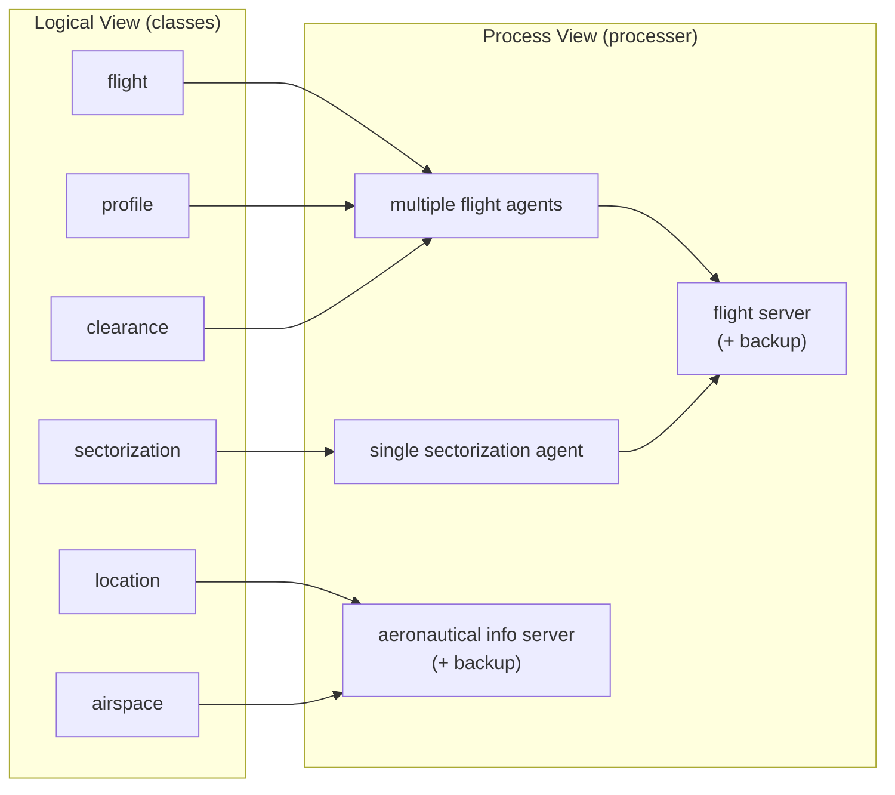
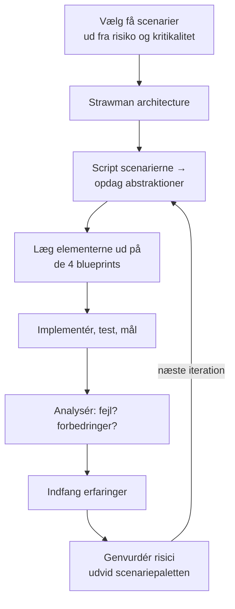

# Architectural Blueprints — The "4+1" View Model of Software Architecture

| Felt | Værdi |
|---|---|
| **Type** | Artikel (peer-reviewed, originalpublikation) |
| **Kursus** | Softwaredesign (SW4SWD-01) |
| **Hører til** | Uge 5 — Architecture & Architecture Documentation |
| **Kilde** | `41view-architecture_1995.pdf` — IEEE Software 12 (6), november 1995, pp. 42-50, 15 sider |
| **Forfatter** | Philippe Kruchten, Rational Software Corp. |
| **Emner dækket** | Software architecture, multiple concurrent views, Logical View, Process View, Development View, Physical View, Scenarios, stakeholder concerns, korrespondance mellem views, iterativ scenariedrevet arkitekturproces, Software Architecture Document |

> **Læsevejledning.** Dette er **originalartiklen** — kilden til hele 4+1-tankegangen. Den er skrevet i 1995, to år før UML overhovedet fandtes, og bruger derfor **præ-UML Booch-notation**. Symbolerne er forældede; ideerne er ikke. Se [`SW4SWD-01_4plus1_View_UML2.md`](SW4SWD-01_4plus1_View_UML2.md) for 2007-opdateringen, der mapper de samme fem views til UML 2's diagramtyper, og [`SW4SWD-01_C4_Model.md`](SW4SWD-01_C4_Model.md) for en moderne konkurrerende tilgang. Forelæsningen er [`../slides/SW4SWD-01_W05_Architecture_Documentation.md`](../slides/SW4SWD-01_W05_Architecture_Documentation.md).

> **Om notationen i figurerne.** Artiklen bruger gennemgående Grady Boochs notation fra *Object-Oriented Analysis and Design with Applications* (1993). Classes tegnes som **skyformede, punkterede figurer** — ikke som UML's rektangler med tre rum. Processes tegnes som **parallelogrammer**. Denne notation er i dag komplet erstattet af UML. Når du læser figurbeskrivelserne nedenfor, så oversæt symbolerne i hovedet: Boochs sky = UML's class-rektangel, Boochs parallelogram = det man i dag ville modellere med et component- eller deployment-diagram. Det er en pointe kurset selv gør: **ideerne er dem, der lever videre i UML — symbolerne er ikke.**

---

## Abstract

> This article presents a model for describing the architecture of software-intensive systems, based on the use of multiple, concurrent views. This use of multiple views allows to address separately the concerns of the various 'stakeholders' of the architecture: end-user, developers, systems engineers, project managers, etc., and to handle separately the functional and non functional requirements. Each of the five views is described, together with a notation to capture it. The views are designed using an architecture-centered, scenario-driven, iterative development process.

**Keywords:** software architecture, view, object-oriented design, software development process

## Introduction

Vi har alle set mange bøger og artikler, hvor ét enkelt diagram forsøger at indfange essensen af et systems arkitektur. Men ser man nøje på det sæt af kasser og pile, der vises på disse diagrammer, bliver det klart, at forfatterne har kæmpet hårdt for at repræsentere mere på ét blueprint, end det faktisk kan udtrykke. Repræsenterer kasserne kørende programmer? Eller stykker kildekode? Eller fysiske computere? Eller blot logiske grupperinger af funktionalitet? Repræsenterer pilene compile-afhængigheder? Eller control flows? Eller data flows? Som regel er det lidt af det hele.

Har en arkitektur brug for én enkelt architectural style? Nogle gange bærer softwarearkitekturen ar efter et systemdesign, der gik for langt i at partitionere softwaren for tidligt, eller efter en overbetoning af ét enkelt aspekt af softwareudvikling: data engineering, eller run-time efficiency, eller udviklingsstrategi og teamorganisering. Ofte adresserer arkitekturen heller ikke alle sine "kunders" (eller *stakeholderes*, som de kaldes på USC) concerns. Problemet er blevet bemærket af flere forfattere: Garlan & Shaw, Abowd & Allen på CMU, Clements på SEI.

Som modtræk foreslår vi at organisere beskrivelsen af en softwarearkitektur ved hjælp af **flere samtidige views**, hvor hvert view adresserer ét specifikt sæt concerns.

## An Architectural Model

Software architecture beskæftiger sig med design og implementering af softwarens overordnede struktur. Det er resultatet af at samle et vist antal arkitektoniske elementer i nogle velvalgte former, så de opfylder systemets væsentligste funktionalitets- og performancekrav såvel som andre, non-funktionelle krav såsom reliability, scalability, portability og availability. Perry og Wolfe udtrykker det meget elegant i denne formel, modificeret af Boehm:

> Software architecture = {Elements, Forms, Rationale/Constraints}

Software architecture handler om abstraktion, om dekomposition og komposition, om stil og æstetik. Til at beskrive en softwarearkitektur bruger vi en model sammensat af flere views eller perspektiver. For i sidste ende at kunne håndtere store og udfordrende arkitekturer består den model, vi foreslår, af fem hovedviews:

- **The logical view**, som er designets object model (når der bruges en objektorienteret designmetode),
- **the process view**, som indfanger designets concurrency- og synkroniseringsaspekter,
- **the physical view**, som beskriver mapping(erne) af softwaren til hardwaren og afspejler dens distribuerede aspekt,
- **the development view**, som beskriver softwarens statiske organisering i udviklingsmiljøet.

Beskrivelsen af en arkitektur — de trufne beslutninger — kan organiseres omkring disse fire views og derefter illustreres af nogle få udvalgte use cases eller **scenarier**, som bliver et femte view. Arkitekturen er faktisk delvist udviklet ud fra disse scenarier, som vi vil se senere.

### Figur 1 — The "4+1" view model

Figuren viser de fire views arrangeret i et kvadrat med Scenarios i midten. Rundt om kanten står de stakeholdere og concerns, hvert view tjener: øverst til venstre **End-user / Functionality** (Logical View), øverst til højre **Programmers / Software management** (Development View), nederst til venstre **Integrators / Performance / Scalability** (Process View), nederst til højre **System engineers / Topology / Communications** (Physical View).



Vi anvender Perry & Wolfs ligning uafhængigt på hvert view: for hvert view definerer vi det sæt elementer, der skal bruges (components, containers og connectors), vi indfanger de forms og patterns, der virker, og vi indfanger rationale og constraints, som forbinder arkitekturen til nogle af kravene.

Hvert view beskrives af et blueprint med sin egen særlige notation. For hvert view kan arkitekterne også vælge en bestemt architectural style, hvilket tillader flere styles at eksistere side om side i ét system.

Vi ser nu på hvert af de fem views efter tur og angiver for hvert af dem formålet — hvilke concerns det adresserer, en notation til det tilsvarende arkitektur-blueprint og de værktøjer, vi har brugt til at beskrive og administrere det. Små eksempler er hentet fra designet af en **PABX** (telefoncentral), afledt af vores arbejde hos Alcatel Business System, og fra et **Air Traffic Control**-system, men i stærkt forenklet form. Hensigten er blot at give en fornemmelse af views og deres notation, ikke at definere disse systemers arkitektur.

"4+1"-viewmodellen er ret *generisk*: andre notationer og værktøjer kan bruges, andre designmetoder kan bruges — især til den logiske og den procesmæssige dekomposition — men vi har angivet dem, vi har brugt med succes.

## The Logical Architecture

### The Object-Oriented Decomposition

Den logiske arkitektur understøtter primært de funktionelle krav — hvad systemet skal levere i form af services til sine brugere. Systemet dekomponeres i et sæt **key abstractions**, taget (hovedsageligt) fra problemdomænet, i form af *objects* eller *object classes*. De udnytter principperne om abstraktion, indkapsling og nedarvning. Denne dekomposition sker ikke kun for den funktionelle analyses skyld, men tjener også til at identificere fælles mekanismer og designelementer på tværs af systemets forskellige dele.

Vi bruger Rational/Booch-tilgangen til at repræsentere den logiske arkitektur ved hjælp af *class diagrams* og *class templates*. Et class diagram viser et sæt classes og deres logiske relationer: association, usage, composition, inheritance osv. Sæt af relaterede classes kan grupperes i **class categories**. Class templates fokuserer på hver enkelt class; de fremhæver de vigtigste class-operationer og identificerer nøgleobjektkarakteristika. Hvis det er vigtigt at definere et objekts interne adfærd, gøres det med state transition diagrams eller state charts. Fælles mekanismer eller services defineres i **class utilities**.

Som alternativ til en OO-tilgang kan en applikation, der er meget datadrevet, bruge en anden form for logical view, såsom E-R-diagrammer.

### Notation for the logical view

Notationen for det logiske view er afledt af Booch-notationen. Den er betydeligt forenklet, så den kun tager hensyn til de elementer, der er arkitektonisk signifikante. Især er de talrige *adornments* ikke særligt nyttige på dette designniveau. Vi bruger Rational Rose® til at understøtte designet af den logiske arkitektur.

**Figur 2 — Notation for the logical blueprint.** *(præ-UML Booch-notation — forældede symboler.)* Figuren er en to-kolonners legende:

| Components (Booch-symbol) | UML-modstykke i dag |
|---|---|
| **Class** — skyformet, punkteret omrids | Rektangel med tre rum (`Class`) |
| **Class Utility** — sky med skyggekant | Class med stereotypen `«utility»` / static class |
| **Parameterized Class** — sky med lille rektangel i hjørnet | Template/generic class med stiplet parameterkasse |
| **Class category** — stort tomt rektangel | Package |

| Connectors (Booch) | UML-modstykke i dag |
|---|---|
| Ubrudt linje — **Association** | Association (ubrudt linje) |
| Linje med udfyldt cirkel i enden — **Containment, Aggregation** | Composition/aggregation (udfyldt/åben rombe) |
| Linje med åben cirkel i enden — **Usage** | Dependency (stiplet pil, `«use»`) |
| Ubrudt linje med udfyldt trekantspil — **Inheritance** | Generalisering (ubrudt linje, åben trekant) |
| Stiplet linje med udfyldt trekantspil — **Instanciation** | `«instantiate»`-dependency |

Bemærk hvordan Boochs pil for inheritance er **udfyldt** og peger modsat af, hvad UML-læsere er vant til at aflæse. Det er præcis den slags forvirring, UML blev skabt for at rydde op i. Ideerne — association, aggregering, brug, nedarvning, instantiering — er derimod uændrede og genkendelige i dag.

### Style for the logical view

Den style, vi bruger til det logiske view, er en objektorienteret style. Hovedretningslinjen for designet af det logiske view er at forsøge at holde **én enkelt, sammenhængende objektmodel på tværs af hele systemet** for at undgå for tidlig specialisering af classes og mekanismer per site eller per processor.

### Examples of Logical blueprints

**Figur 3a — Logical blueprint for the Télic PABX.** Diagrammet viser hovedklasserne som skyformede Booch-symboler forbundet af associations: `Conversation`, `Translation Services`, `Terminal`, `Connection Services`, `Controller` og `Numbering Plan`.



En PABX etablerer kommunikation mellem terminaler. En terminal kan være et telefonapparat, en trunk line (dvs. linje til central-office), en tie line (dvs. privat PABX-til-PABX-linje), en feature phone line, en datalinje, en ISDN-linje osv. Forskellige linjer understøttes af forskellige line interface cards.

Ansvaret for et **line controller**-objekt er at afkode og injicere alle signaler på line interface card'et og oversætte kortspecifikke signaler til og fra et lille, ensartet sæt events: start, stop, digit osv. Controlleren bærer også alle de hårde realtidsbegrænsninger. Denne class har mange subclasses for at dække forskellige typer interfaces.

Ansvaret for **terminal**-objektet er at vedligeholde en terminals tilstand og forhandle services på vegne af den linje. For eksempel bruger den numbering plan'ens services til at fortolke opkaldet i selektionsfasen. **Conversation** repræsenterer et sæt terminaler, der er engageret i en samtale. Conversation bruger translation services (directory, mapping fra logisk til fysisk adresse, routes) og connection services til at etablere en talevej mellem terminalerne.

**Figur 3b — Blueprint for an Air Traffic Control System.** For et meget større system, som indeholder nogle få dusin arkitektonisk signifikante classes, viser figuren det øverste class diagram for et air traffic control-system med **8 class categories** (dvs. grupper af classes): `Display & User Interface`, `External Interfaces - Gateways`, `Simulation and Training`, `Flight management`, `Air Traffic Management`, `Aeronautical Information`, `Basic elements` og `Mechanisms Services`.

## The Process Architecture

### The Process Decomposition

Procesarkitekturen tager hensyn til nogle non-funktionelle krav såsom performance og availability. Den adresserer spørgsmål om concurrency og distribution, om systemets integritet, om fault-tolerance, og om hvordan hovedabstraktionerne fra det logiske view passer ind i procesarkitekturen — på hvilken thread of control en operation for et objekt faktisk eksekveres.

Procesarkitekturen kan beskrives på flere abstraktionsniveauer, hvor hvert niveau adresserer forskellige concerns. På det højeste niveau kan procesarkitekturen ses som et sæt uafhængigt eksekverende **logiske netværk af kommunikerende programmer** (kaldet "processes"), distribueret over et sæt hardwareressourcer forbundet af et LAN eller WAN. Flere logiske netværk kan eksistere samtidigt og dele de samme fysiske ressourcer. For eksempel kan uafhængige logiske netværk bruges til at understøtte adskillelse af det online operationelle system fra offline-systemet, såvel som til at understøtte sameksistens af simulerings- eller testversioner af softwaren.

En **process** er en gruppering af tasks, der udgør en eksekverbar enhed. Processes repræsenterer det niveau, hvor procesarkitekturen kan kontrolleres taktisk (dvs. startes, genoprettes, rekonfigureres og lukkes ned). Derudover kan processes replikeres for øget distribution af processeringsbelastningen eller for forbedret availability.

Softwaren partitioneres i et sæt uafhængige **tasks**. En task er en separat thread of control, som kan skeduleres individuelt på én processing node.

Vi kan så skelne mellem **major tasks**, som er de arkitektoniske elementer, der kan adresseres entydigt, og **minor tasks**, som er ekstra tasks introduceret lokalt af implementeringsmæssige årsager (cykliske aktiviteter, buffering, time-outs osv.). De kan implementeres som fx Ada-tasks eller light-weight threads.

Major tasks kommunikerer via et sæt veldefinerede inter-task-kommunikationsmekanismer: synkrone og asynkrone message-baserede kommunikationsservices, remote procedure calls, event broadcast osv. Minor tasks kan kommunikere via rendezvous eller shared memory. Major tasks må ikke gøre antagelser om, at de er samlokaliserede i samme process eller processing node.

Message-flow og procesbelastninger kan estimeres ud fra process-blueprintet. Det er også muligt at implementere en "hollow" procesarkitektur med dummy-belastninger for processerne og måle dens performance på målsystemet, som beskrevet af Filarey et al. i deres Eurocontrol-eksperiment.

### Notation for the Process view

Notationen, vi bruger til process view, er udvidet fra den notation, Booch oprindeligt foreslog til Ada tasking. Igen fokuserer notationen på de elementer, der er arkitektonisk signifikante.

**Figur 4 — Notation for the Process blueprint.** *(præ-UML Booch-notation — forældede symboler.)*

| Components (Booch-symbol) | Betydning |
|---|---|
| **Process** — parallelogram med små indlejrede rektangler langs venstre kant (tasks) | En process, der grupperer flere tasks |
| **Simplified Process** — tomt parallelogram | En process uden detaljering af tasks |
| **Periodic process adornment** — en cirkulær pil | Angiver en cyklisk (periodisk) process |

| Connectors (Booch) | Betydning |
|---|---|
| Ubrudt linje uden pil | **Unspecified** |
| Enkelt pil | **Message** |
| Dobbelt pil (to parallelle streger med pilespids) | **Remote Procedure Call** |
| Pil i begge ender | **Message, bidirectional** |
| Stiplet pil | **Event broadcast** |

Der findes intet direkte UML-modstykke til Boochs parallelogram-process. I dag ville man modellere det samme med en kombination af **component diagrams**, **sequence-** eller **activity diagrams** (jf. UML 2-artiklen, hvor Process View netop tildeles Sequence, Communication, Activity, Timing og Interaction Overview).

Vi har brugt produktet Universal Network Architecture Services (UNAS) fra TRW til at arkitekte og implementere sættet af processes og tasks (og deres redundanser) i netværk af processer. UNAS indeholder et værktøj — Software Architects Lifecycle Environment (SALE) — som understøtter en sådan notation. SALE tillader grafisk afbildning af procesarkitekturen, herunder specifikation af de mulige inter-task-kommunikationsveje, hvorfra den tilsvarende Ada- eller C++-kildekode genereres automatisk. Fordelen ved denne tilgang er, at ændringer let kan indarbejdes uden større indvirkning på applikationssoftwaren.

### Style for the process view

Flere styles ville passe til process view. For eksempel kan vi fra Garlan og Shaws taksonomi vælge: **pipes and filters** eller **client/server**, med varianter som multiple client/single server og multiple clients/multiple servers. Til mere komplekse systemer kunne man bruge en style, der ligner process groups-tilgangen fra ISIS-systemet, som beskrevet af K. Birman, med en anden notation og værktøjskasse.

### Example of a Process blueprint

**Figur 5 — Process blueprint for the Télic PABX (partial).** Diagrammet viser en `Terminal process` og en `Controller process`. Controller-processen indeholder tre tasks: `Controller task Low rate`, `Controller task High rate` og `Main controller task`. Pile viser message-flow mellem controller-processen og terminal-processen.

Beskrivelsen i teksten:

Alle terminaler håndteres af én enkelt **terminal process**, som drives af messages i sine input-køer. Controller-objekterne eksekveres på én af tre tasks, der udgør **controller-processen**:

1. En **low cycle rate task** scanner alle inaktive terminaler (200 ms) og placerer enhver terminal, der bliver aktiv, i scan-listen for
2. den **high cycle rate task** (10 ms), som detekterer enhver signifikant tilstandsændring og sender den videre til
3. den **main controller task**, som fortolker ændringerne og kommunikerer dem via message til den tilsvarende terminal.

Her sker message passing inden for controller-processen via shared memory.



## The Development Architecture

### Subsystem decomposition

Development-arkitekturen fokuserer på den faktiske organisering af softwaremoduler i softwareudviklingsmiljøet. Softwaren pakkes i små bidder — **program libraries** eller **subsystems** — som kan udvikles af én eller et lille antal udviklere. Subsystemerne organiseres i et hierarki af **layers**, hvor hvert lag tilbyder et snævert og veldefineret interface til lagene over det.

Systemets development-arkitektur repræsenteres af module- og subsystem-diagrammer, der viser *export*- og *import*-relationerne. Den komplette development-arkitektur kan først beskrives, når alle softwarens elementer er identificeret. Det er dog muligt at opliste de regler, der styrer development-arkitekturen: partitioning, grouping, visibility.

For det meste tager development-arkitekturen hensyn til interne krav relateret til udviklingsvenlighed, software management, genbrug eller fælleshed, samt til de begrænsninger, værktøjskassen eller programmeringssproget pålægger. Development view fungerer som grundlag for kravallokering, for allokering af arbejde til teams (eller endda for teamorganisering), for omkostningsvurdering og planlægning, for at monitorere projektets fremdrift, og for at ræsonnere om softwaregenbrug, portabilitet og sikkerhed. Det er grundlaget for at etablere en **line-of-product**.

### Notation for the Development Blueprint

Igen en variation af Booch-notationen, begrænset til de elementer, der er arkitektonisk signifikante.

**Figur 5 (anden) — Notation for the Development blueprint.** *(præ-UML Booch-notation — forældede symboler.)*

| Components (Booch-symbol) | UML-modstykke i dag |
|---|---|
| **Module** — rektangel med lille "fane"-rektangel foroven til venstre | Component (UML 2) / fil eller class |
| **Subsystem** — større rektangel, der indeholder moduler | Package eller component |
| **Layer** — bredt rektangel, der omslutter subsystemer | Package med stereotypen `«layer»` |

| Connectors (Booch) | Betydning |
|---|---|
| Enkel linje — **Reference** | Reference mellem moduler |
| Linje mærket **Compilation dependency** | Compile-time-afhængighed (`include`, `with`) |

Boochs module-symbol med "fanen" foroven er i praksis det, der senere blev UML 1's component-ikon. I UML 2 er component-notationen ændret til et rektangel med stereotypen `«component»` og et lille ikon i hjørnet.

Apex Development Environment fra Rational understøtter definitionen og implementeringen af development-arkitekturen, den beskrevne lagdelingsstrategi og håndhævelsen af designreglerne. Rational Rose kan tegne development-blueprints på modul- og subsystemniveau — både forward engineering og reverse engineering fra udviklingskildekode, for Ada og C++.

### Style for the Development View

Vi anbefaler at anvende en **layered style** til development view og definere omkring 4 til 6 lag af subsystemer. Hvert lag har et veldefineret ansvar. Designreglen er, at et subsystem i et bestemt lag **kun må afhænge af subsystemer i samme lag eller i lagene under**, for at minimere udviklingen af meget komplekse netværk af afhængigheder mellem moduler og for at tillade simple release-strategier lag for lag.

### Example of Development architecture

**Figur 6 — The 5 layers of Hughes Air Traffic Systems (HATS).** Figuren viser fem vandrette lag stablet oven på hinanden, nummereret 1 (nederst) til 5 (øverst), med `HardWare, OS, COTS` helt i bunden som fundament.



Figuren repræsenterer udviklingsorganiseringen i fem lag for en line-of-product af Air Traffic Control-systemer udviklet af Hughes Aircraft of Canada. Dette er den development-arkitektur, der svarer til den logiske arkitektur i figur 3b.

Lag 1 og 2 udgør en **domæneuafhængig distribueret infrastruktur**, som er fælles på tværs af produktlinjen og skærmer den mod variationer i hardwareplatform, operativsystem eller off-the-shelf-produkter såsom database management-systemer. Oven på denne infrastruktur tilføjer lag 3 et **ATC framework**, som danner en domænespecifik softwarearkitektur. Ved hjælp af dette framework bygges en palet af funktionalitet i lag 4. Lag 5 er meget kunde- og produktafhængigt og indeholder det meste af brugergrænsefladen og grænsefladerne til de eksterne systemer.

Omkring **72 subsystemer** er fordelt over de 5 lag, hvor hvert indeholder fra 10 til 50 moduler, og de kan repræsenteres på yderligere blueprints.

## The Physical Architecture

### Mapping the software to the hardware

Den fysiske arkitektur tager primært hensyn til systemets non-funktionelle krav såsom availability, reliability (fault-tolerance), performance (throughput) og scalability. Softwaren eksekverer på et netværk af computere eller **processing nodes** (eller blot *nodes*). De forskellige identificerede elementer — networks, processes, tasks og objects — skal mappes til de forskellige nodes.

Vi forventer, at flere forskellige fysiske konfigurationer vil blive brugt: nogle til udvikling og test, andre til deployment af systemet på forskellige sites eller til forskellige kunder. Mappingen af softwaren til nodes skal derfor være **meget fleksibel og have minimal indvirkning på selve kildekoden**.

### Notation for the Physical Blueprint

Fysiske blueprints kan blive meget rodede i store systemer, så de antager flere former, med eller uden mappingen fra process view.

**Figur 7 — Notation for the Physical blueprint.** *(præ-UML Booch-notation — forældede symboler.)*

| Components (Booch-symbol) | UML-modstykke i dag |
|---|---|
| **Processor** — 3D-kasse | UML `«device»`/node (3D-kasse — dette symbol overlevede faktisk ind i UML) |
| **Other device** — mindre kasse | `«device»`-node |

| Connectors (Booch) | Betydning |
|---|---|
| Ubrudt linje | **Communication line** |
| Stiplet linje | **Communication (non permanent)** |
| Enkelt pil | **Uni-directional communication** |
| Tyk/dobbelt linje | **High bandwidth communication, Bus** |

Physical view er det view, hvis notation er tættest på UML: den 3D-kasse, Booch brugte til en processor, er stort set identisk med UML's node-symbol i deployment diagrams.

UNAS fra TRW giver os her datadrevne midler til at mappe procesarkitekturen på den fysiske arkitektur, hvilket tillader en stor klasse af ændringer i mappingen uden ændringer i kildekoden.

### Example of Physical blueprint

**Figur 8 — Physical blueprint for the PABX.** Figuren viser en hardwarekonfiguration for en stor PABX i et hierarkisk træ: øverst to `C`-computere (primary og backup), derunder fire `F`-computere (parvis primary/backup) og nederst otte `K`-computere. C, F og K er tre typer computere med forskellig kapacitet, som understøtter tre forskellige eksekverbare filer.

**Figur 9 — A small PABX physical architecture with process allocation.** Én enkelt `F`-node kører `Conversation process` og `Terminal Process`, mens en `K`-node kører `Controller Process`.



**Figur 10 — Physical blueprint for a larger PABX showing process allocation.** Den store konfiguration viser en `C`-node med `Central Process` (plus back-up nodes), derunder flere `F`-noder, som hver kører `Pseudo Central process`, `Conversation process` og `Terminal Process`, og nederst flere `K`-noder, som hver kører en `Controller Process` og styrer `line cards`. Pointen er, at **den samme software mappes til to vidt forskellige hardwarekonfigurationer** afhængigt af, om der er tale om en lille eller stor PABX.

## Scenarios

### Putting it all together

Elementerne i de fire views vises at fungere gnidningsfrit sammen ved brug af et lille sæt vigtige **scenarier** — instanser af mere generelle use cases — hvortil vi beskriver de tilsvarende *scripts* (sekvenser af interaktioner mellem objekter og mellem processer) som beskrevet af Rubin og Goldberg. Scenarierne er på en måde en abstraktion af de vigtigste krav. Deres design udtrykkes med object scenario diagrams og object interaction diagrams.

Dette view er redundant i forhold til de andre (heraf "+1"), men det tjener to hovedformål:

- som **driver** til at opdage de arkitektoniske elementer under arkitekturdesignet
- som **validering og illustration** efter arkitekturdesignet er færdigt — både på papir og som udgangspunkt for testene af en arkitekturprototype

### Notation for the Scenarios

Notationen minder meget om det logiske view for komponenterne, men bruger process view'ets connectors til interaktioner mellem objekter. Bemærk, at objektinstanser angives med **ubrudte linjer** (mens classes tegnes med punkterede). Ligesom for det logiske blueprint indfanger og administrerer vi object scenario diagrams med Rational Rose.

### Example of a Scenario

**Figur 11 — Embryo of a scenario for a local call — selection phase.** Diagrammet viser fire objektinstanser — `Joe:Controller`, `Joe:Terminal`, `Numbering plan` og `:Conversation` — forbundet af nummererede pile.

Det tilhørende script lyder:

1. Controlleren for Joes telefon detekterer og validerer overgangen fra on-hook til off-hook og sender en message for at vække det tilsvarende terminal-objekt.
2. Terminalen allokerer nogle ressourcer og beder controlleren om at udsende klartone (dial tone).
3. Controlleren modtager cifre og videresender dem til terminalen.
4. Terminalen bruger numbering plan til at analysere cifferstrømmen.
5. Når en gyldig sekvens af cifre er indtastet, åbner terminalen en conversation.



> **Bemærk:** originalfiguren er ikke et sequence diagram — den er et Booch object scenario diagram, hvor objekterne står som skyer forbundet af nummererede pile uden lodret tidsakse. Mermaid-diagrammet ovenfor gengiver *sekvensen* korrekt, men bruger moderne UML-notation. Netop denne type diagram er det, der i UML blev til sequence- og communication-diagrammer.

## Correspondence Between the Views

De forskellige views er ikke fuldt ortogonale eller uafhængige. Elementer i ét view er forbundet til elementer i andre views efter bestemte designregler og heuristikker.

### From the logical to the process view

Vi identificerer flere vigtige karakteristika ved classes i den logiske arkitektur:

- **Autonomy:** er objekterne *active*, *passive* eller *protected*?
  - Et **active** object tager initiativet til at invokere andre objekters operationer eller sine egne operationer og har fuld kontrol over andre objekters invokation af dets egne operationer.
  - Et **passive** object invokerer aldrig spontant nogen operationer og har ingen kontrol over andre objekters invokation af dets egne operationer.
  - Et **protected** object invokerer aldrig spontant nogen operationer, men udfører en form for arbitrering over invokationen af sine operationer.
- **Persistence:** er objekterne *transient* eller *permanent*? Overlever de en process' eller processors fejl?
- **Subordination:** afhænger et objekts eksistens eller persistens af et andet objekt?
- **Distribution:** er et objekts tilstand eller operationer tilgængelige fra mange nodes i den fysiske arkitektur, fra flere processer i procesarkitekturen?

I arkitekturens logiske view betragter vi **hvert objekt som active** og potentielt "concurrent", dvs. som om det opfører sig "parallelt" med andre objekter, og vi lægger ikke mere vægt på den præcise grad af concurrency, vi behøver for at opnå denne effekt. Den logiske arkitektur tager altså kun hensyn til kravenes funktionelle aspekt.

Når vi derimod skal definere procesarkitekturen, er det ikke rigtig praktisk med den nuværende teknologi at implementere hvert objekt med sin egen thread of control (fx sin egen Unix-process eller Ada-task) på grund af det enorme overhead, det medfører. Og hvis objekterne er concurrent, må der desuden være en eller anden form for arbitrering ved invokation af deres operationer.

På den anden side er der brug for **multiple threads of control** af flere grunde:

- For hurtigt at reagere på visse klasser af eksterne stimuli, herunder tidsrelaterede events
- For at udnytte flere CPU'er i en node eller flere nodes i et distribueret system
- For at øge CPU-udnyttelsen ved at allokere CPU'en til andre aktiviteter, mens en thread of control er suspenderet og venter på, at en anden aktivitet fuldføres (fx adgang til en ekstern enhed eller til et andet active object)
- For at prioritere aktiviteter (og potentielt forbedre responsiveness)
- For at understøtte systemets scalability (med yderligere processer, der deler belastningen)
- For at adskille concerns mellem forskellige områder af softwaren
- For at opnå højere system-availability (med backup-processer)

Vi bruger samtidigt to strategier til at bestemme den "rigtige" mængde concurrency og definere det sæt processer, der er behov for. Med de potentielle fysiske målarkitekturer i baghovedet kan vi gå frem enten:

- **Inside-out:** Med udgangspunkt i den logiske arkitektur defineres **agent tasks**, som multiplexer en enkelt thread of control hen over flere active objects i en class; objekter, hvis persistens eller livstid er underordnet et active object, eksekveres også på samme agent; flere classes, som skal eksekveres i gensidig udelukkelse, eller som kun kræver små mængder processering, deler én enkelt agent. Denne clustering fortsætter, indtil vi har reduceret processerne til et rimeligt lille antal, der stadig tillader distribution og udnyttelse af de fysiske ressourcer.
- **Outside-in:** Med udgangspunkt i den fysiske arkitektur identificeres eksterne stimuli (requests) til systemet, der defineres **client processes** til at håndtere stimuli og **server processes**, som kun leverer services og ikke initierer dem; problemets dataintegritets- og serialiseringsbegrænsninger bruges til at definere det rigtige sæt servere, og objekter allokeres til client- og server-agents; det identificeres, hvilke objekter der skal distribueres.

Resultatet er en mapping af classes (og deres objekter) på et sæt tasks og processes i procesarkitekturen. Typisk er der én agent task per active class, med visse variationer: flere agents for en given class for at øge throughput, eller flere classes mappet til én enkelt agent, fordi deres operationer sjældent invokeres, eller for at garantere sekventiel eksekvering.

Bemærk, at dette **ikke er en lineær, deterministisk proces**, der fører til en optimal procesarkitektur; det kræver nogle iterationer at nå frem til et acceptabelt kompromis.

**Figur 12 — Mapping from Logical to Process view.** Figuren viser, hvordan et lille sæt classes fra et hypotetisk air-traffic control-system mappes til processer. Øverst står de logiske classes (`flight`, `sectorization`, `clearance`, `profile`, `location`, `airspace`); nederst deres mapping til processer.



Teksten forklarer mappingen:

- **`flight`-class'en** mappes til et sæt **flight agents**: der er mange flights at processere, en høj rate af eksterne stimuli, responstid er kritisk, og belastningen skal spredes over flere CPU'er. Desuden er persistens- og distributionsaspekterne af flight-processeringen udskudt til en **flight server**, som er dubleret af availability-hensyn.
- **`profile` og `clearance`** er altid underordnet en `flight`, og selvom de er komplekse classes, deler de `flight`-class'ens processer. Flights distribueres til flere andre processer, især til display og eksterne interfaces.
- **`sectorization`-class'en**, som etablerer en partitionering af luftrummet til tildeling af controlleres jurisdiktion over flights, kan på grund af sine integritetsbegrænsninger kun håndteres af **én enkelt agent**, men kan dele server-processen med `flight`: opdateringer er sjældne.
- **`location`, `airspace`** og anden statisk aeronautisk information er **protected objects**, delt mellem flere classes og sjældent opdateret; de mappes til deres egen server og distribueres til andre processer.

### From logical to development

En class implementeres normalt som ét **module** — for eksempel en type i den synlige del af en Ada-package. Store classes dekomponeres i flere packages. Samlinger af tæt beslægtede classes — class categories — grupperes i **subsystems**. Yderligere begrænsninger skal tages i betragtning ved definitionen af subsystemer, såsom teamorganisering, forventet kodemængde (typisk 5K til 20K SLOC per subsystem), grad af forventet genbrug og fælleshed, strenge lagdelingsprincipper (visibility-spørgsmål), release-politik og configuration management. Derfor ender vi som regel med et view, som **ikke har en 1:1-korrespondance med det logiske view**.

Det logiske og det development view ligger meget tæt på hinanden, men adresserer meget forskellige concerns. Vi har erfaret, at **jo større projektet er, desto større er afstanden mellem disse views.** Det samme gælder for process- og physical view: jo større projekt, desto større afstand.

Hvis vi for eksempel sammenligner figur 3b og figur 6, er der ingen 1:1-mapping fra class categories til lag. Tager vi kategorien 'External interfaces — Gateway', er dens implementering spredt over flere lag: kommunikationsprotokoller ligger i subsystemer i eller under lag 1, generelle gateway-mekanismer i subsystemer i lag 2, og de faktiske specifikke gateways i subsystemer i lag 5.

### From process to physical

Processes og process groups mappes til den tilgængelige fysiske hardware i forskellige konfigurationer til test eller deployment. Birman beskriver nogle meget udførlige skemaer for denne mapping i Isis-projektet.

Scenarierne relaterer sig hovedsageligt til det logiske view — i form af hvilke classes der bruges — og til process view, når interaktionerne mellem objekter involverer mere end én thread of control.

## Tailoring the Model

Ikke alle softwarearkitekturer har brug for de fulde "4+1" views. Views, der er unyttige, kan udelades fra arkitekturbeskrivelsen:

- **Physical view** kan udelades, hvis der kun er én processor.
- **Process view** kan udelades, hvis der kun er én process eller ét program.
- For meget små systemer er det endda muligt, at det logiske view og development view er så ens, at de ikke kræver separate beskrivelser.

**Scenarierne er derimod nyttige under alle omstændigheder.**

## Iterative process

Witt et al. angiver 4 faser i designet af en arkitektur: sketching, organizing, specifying og optimizing, underinddelt i omkring 12 trin. De angiver, at noget backtracking kan være nødvendigt. Vi mener, at denne tilgang er **for "lineær"** til et ambitiøst og relativt hidtil uset projekt. Der vides for lidt ved afslutningen af de 4 faser til at kunne validere arkitekturen.

Vi går ind for en mere **iterativ udvikling**, hvor arkitekturen faktisk prototypes, testes, måles, analyseres og derefter forfines i efterfølgende iterationer. Ud over at det tillader at mitigere de risici, der er forbundet med arkitekturen, har en sådan tilgang andre sidegevinster for projektet: teambuilding, træning, fortrolighed med arkitekturen, anskaffelse af værktøjer, indkøring af procedurer og værktøjer osv. (Vi taler her om en **evolutionær prototype**, som langsomt vokser og bliver til systemet — ikke om engangs-, eksplorative prototyper.) Denne iterative tilgang tillader også, at kravene forfines, modnes og forstås bedre.

### A scenario-driven approach

Systemets mest kritiske funktionalitet indfanges i form af scenarier (eller use cases). Med *kritisk* mener vi: funktioner, der er de vigtigste, systemets *raison d'être*, eller som har den højeste anvendelsesfrekvens, eller som udgør en betydelig teknisk risiko, der skal mitigeres.

**Start:**

- Et lille antal scenarier vælges til en iteration baseret på risiko og kritikalitet. Scenarier kan syntetiseres for at abstrahere et antal brugerkrav.
- En **strawman architecture** sættes på plads. Scenarierne bliver derefter "scripted" for at identificere hovedabstraktionerne (classes, mechanisms, processes, subsystems) som angivet af Rubin og Goldberg — dekomponeret i sekvenser af par (object, operation).
- De opdagede arkitektoniske elementer lægges ud på de 4 blueprints: logical, process, development og physical.
- Denne arkitektur implementeres derefter, testes og måles, og analysen kan afdække nogle fejl eller potentielle forbedringer.
- De erfaringer, der er gjort, indfanges.

**Loop:**

Den næste iteration kan derefter starte med:

- at genvurdere risiciene,
- at udvide paletten af scenarier, der skal overvejes,
- at udvælge nogle få yderligere scenarier, som vil muliggøre risikomitigering eller større arkitekturdækning.

Derefter:

- Forsøg at "scripte" disse scenarier i den foreløbige arkitektur
- Opdag yderligere arkitektoniske elementer eller nogle gange betydelige arkitektoniske ændringer, som skal ske for at rumme disse scenarier
- Opdatér de 4 hovedblueprints: logical, process, development, physical
- Revidér de eksisterende scenarier baseret på ændringerne
- Opgradér implementeringen (arkitekturprototypen) til at understøtte det nye udvidede sæt scenarier
- Test. Mål under belastning, i det reelle målmiljø hvis muligt.
- Alle fem blueprints gennemgås derefter for at afdække potentiale for forenkling, genbrug og fælleshed.
- Designretningslinjer og rationale opdateres.
- Indfang de erfaringer, der er gjort.

**End loop**



Den indledende arkitekturprototype udvikler sig til at blive det egentlige system. Forhåbentlig bliver arkitekturen selv stabil efter 2 eller 3 iterationer: ingen nye hovedabstraktioner findes, ingen nye subsystemer eller processer, ingen nye interfaces. Resten af historien hører til softwaredesignets område, hvor udviklingen i øvrigt kan fortsætte med meget lignende metoder og processer.

Varigheden af disse iterationer varierer betydeligt — med projektets størrelse, med antallet af involverede personer og deres fortrolighed med domænet og metoden, og med graden af "hidtil usethed" i systemet i forhold til udviklingsorganisationen. En iteration kan derfor vare **2-3 uger** for et lille projekt (fx 10 KSLOC) eller op til **6-9 måneder** for et stort command and control-system (fx 700 KSLOC).

## Documenting the architecture

Den dokumentation, der produceres under arkitekturdesignet, indfanges i to dokumenter:

- Et **Software Architecture Document**, hvis organisering følger "4+1"-views tæt
- **Software Design Guidelines**, som (blandt andet) indfanger de vigtigste designbeslutninger, der skal respekteres for at bevare systemets arkitektoniske integritet

**Figur 13 — Outline of a Software Architecture Document:**

```
Title Page
Change History
Table of Contents
List of Figures
1.  Scope
2.  References
3.  Software Architecture
4.  Architectural Goals & Constraints
5.  Logical Architecture
6.  Process Architecture
7.  Development Architecture
8.  Physical Architecture
9.  Scenarios
10. Size and Performance
11. Quality
Appendices
  A. Acronyms and Abbreviations
  B. Definitions
  C. Design Principles
```

Bemærk hvordan kapitel 5-9 er præcis de fem views i rækkefølge. Dette er skabelonen, der senere blev til RUP's Software Architecture Document.

## Conclusion

Denne "4+1"-viewmodel er blevet brugt med succes på flere store projekter, med eller uden lokal tilpasning og justering af terminologi. Den har faktisk gjort det muligt for de forskellige stakeholdere at finde netop det, de vil vide om softwarearkitekturen:

- **Systems engineers** griber den an fra Physical view, derefter Process view.
- **End-users, kunder og dataspecialister** fra Logical view.
- **Projektledere og software configuration-personale** ser den fra Development view.

Andre sæt views er blevet foreslået og diskuteret, både inden for Rational og andre steder — for eksempel af Meszaros (BNR), Hofmeister, Nord og Soni (Siemens) samt Emery og Hilliard (Mitre) — men vi har erfaret, at disse andre foreslåede views som regel kan foldes ind i ét af de 4, vi har beskrevet. For eksempel folder et **Cost & Schedule view** ind i Development view, et **Data view** ind i Logical view, og et **Execution view** ind i en kombination af Process og Physical view.

### Tabel 1 — Summary of the "4+1" view model

| | **Logical** | **Process** | **Development** | **Physical** | **Scenarios** |
|---|---|---|---|---|---|
| **Components** | Class | Task | Module, Subsystem | Node | Step, Scripts |
| **Connectors** | association, inheritance, containment | Rendez-vous, Message, broadcast, RPC, etc. | compilation dependency, "with" clause, "include" | Communication medium, LAN, WAN, bus, etc. | |
| **Containers** | Class category | Process | Subsystem (library) | Physical subsystem | Web |
| **Stakeholders** | End-user | System designer, integrator | Developer, manager | System designer | End-user, developer |
| **Concerns** | Functionality | Performance, availability, S/W fault-tolerance, integrity | Organization, reuse, portability, line-of-product | Scalability, performance, availability | Understandability |
| **Tool support** | Rose | UNAS/SALE, DADS | Apex, SoDA | UNAS, Openview, DADS | Rose |

Bemærk, at kolonnen **Tool support** er ren 1995-arkæologi: Rational Rose, UNAS/SALE, Apex, SoDA og DADS er alle enten døde eller uigenkendeligt forandrede i dag. Rækkerne **Components, Connectors, Containers, Stakeholders og Concerns** er derimod stadig fuldt anvendelige — det er dem, tabellen bruges til i dag.

## References

1. D. Garlan & M. Shaw, "An Introduction to Software Architecture," *Advances in Software Engineering and Knowledge Engineering*, Vol. 1, World Scientific Publishing Co. (1993).
2. D. E. Perry & A. L. Wolf, "Foundations for the Study of Software Architecture," *ACM Software Engineering Notes*, 17, 4, October 1992, 40-52.
3. Ph. Kruchten & Ch. Thompson, "An Object-Oriented, Distributed Architecture for Large Scale Ada Systems," *Proceedings of the TRI-Ada '94 Conference*, Baltimore, November 6-11, 1994, ACM, p. 262-271.
4. G. Booch, *Object-Oriented Analysis and Design with Applications*, 2nd edition, Benjamin-Cummings Pub. Co., Redwood City, California, 1993, 589p.
5. K. P. Birman & R. Van Renesse, *Reliable Distributed Computing with the Isis Toolkit*, IEEE Computer Society Press, Los Alamitos CA, 1994.
6. K. Rubin & A. Goldberg, "Object Behavior Analysis," *CACM*, 35, 9 (Sept. 1992) 48-62.
7. B. I. Witt, F. T. Baker & E. W. Merritt, *Software Architecture and Design — Principles, Models, and Methods*, Van Nostrand Reinhold, New York (1994) 324p.
8. D. Garlan (ed.), *Proceedings of the First Internal Workshop on Architectures for Software Systems*, CMU-CS-TR-95-151, CMU, Pittsburgh, 1995.

---

## Opsummering

Artiklen løser ét problem: **ét diagram kan ikke bære en hel arkitektur.** Kruchten åbner med observationen, at når man ser nøje på de sædvanlige kasse-og-pil-diagrammer, kan man ikke afgøre, om kasserne er programmer, kildekode, computere eller logiske grupperinger — og pilene er lige så tvetydige. Løsningen er at splitte beskrivelsen i fem views, hvor hvert view har sin egen notation, sin egen stakeholder og sit eget sæt concerns.

De fem views og hvem de er til for:

- **Logical View** — end-users, funktionalitet. OO-dekomposition i key abstractions fra problemdomænet.
- **Process View** — integratorer. Concurrency, distribution, fault-tolerance, performance. Processes og tasks.
- **Development View** — programmører og projektledere. Modulorganisering i udviklingsmiljøet, lagdeling (4-6 lag), work breakdown.
- **Physical View** — system engineers. Mapping af software til hardware-nodes, topologi, kommunikation.
- **Scenarios (+1)** — alle. Redundant i forhold til de fire, men driver opdagelsen af arkitekturelementer og validerer, at de fire views faktisk hænger sammen.

Tre pointer, der er lette at overse:

1. **Views er ikke ortogonale.** Kruchten bruger et helt afsnit på korrespondancen mellem dem — logical→process (inside-out vs. outside-in for at finde den rigtige mængde concurrency), logical→development (aldrig 1:1; og jo større projekt, desto større afstand), process→physical.
2. **Modellen skal tilpasses.** Har systemet én processor, dropper man physical view. Én process, drop process view. Scenarierne beholder man altid.
3. **Processen er iterativ og scenariedrevet.** Man vælger få kritiske scenarier, bygger en strawman-arkitektur, scripter scenarierne for at opdage abstraktioner, implementerer, måler, og gentager. Kruchten afviser eksplicit den lineære fasetilgang som utilstrækkelig til ambitiøse projekter. Prototypen er evolutionær — den vokser til at blive systemet.

**Om notationen.** Alle figurer i artiklen bruger Booch-notation fra 1993: classes som punkterede skyer, processes som parallelogrammer, moduler som rektangler med fane. Det er to år før UML 1.0. Symbolerne er døde; ideerne er ikke. Kort sagt blev Boochs skyer til UML's class-rektangler, hans object scenario diagrams til sequence- og communication-diagrammer, og hans modul-symbol til UML 1's component-ikon. Kun processor-kassen i physical view overlevede stort set uændret som UML's node.

Se [`SW4SWD-01_4plus1_View_UML2.md`](SW4SWD-01_4plus1_View_UML2.md) for den præcise mapping fra disse fem views til UML 2's 13 diagramtyper, og [`SW4SWD-01_C4_Model.md`](SW4SWD-01_C4_Model.md) for C4-modellen, som angriber samme kommunikationsproblem med zoom-niveauer i stedet for stakeholder-views.
