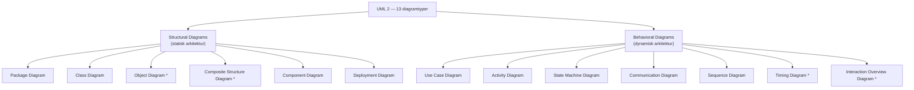
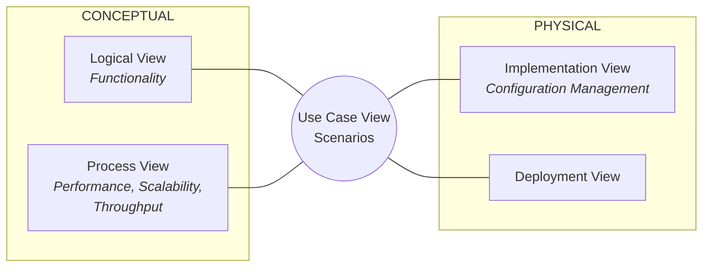
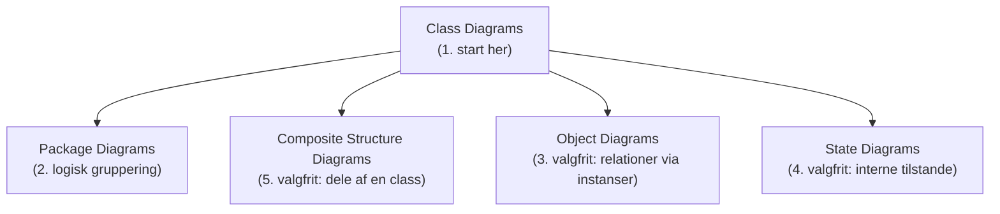
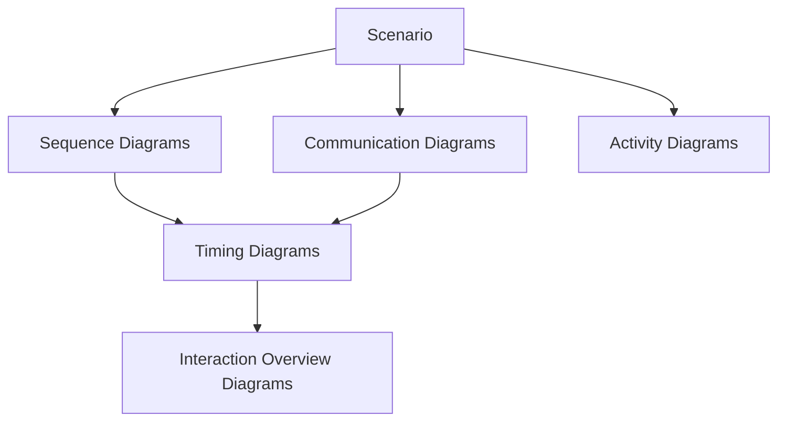
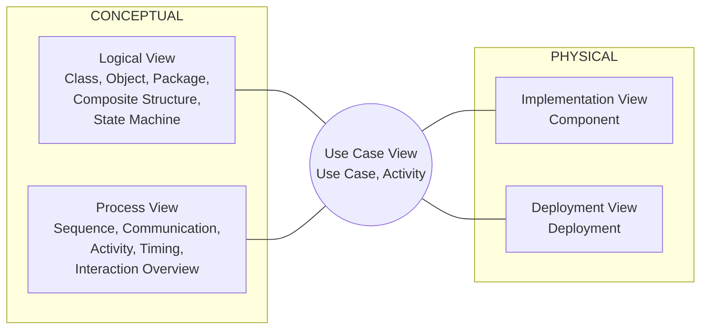
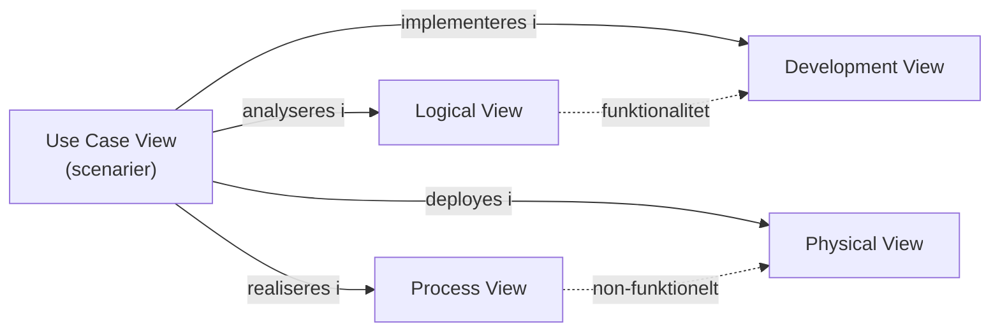

# Applying 4+1 View Architecture with UML 2

| Felt | Værdi |
|---|---|
| **Type** | Artikel (white paper) |
| **Kursus** | Softwaredesign (SW4SWD-01) |
| **Hører til** | Uge 5 — Architecture & Architecture Documentation |
| **Kilde** | `41view-architecture_UML2.pdf`, FCG Software Services white paper, 2007, 11 sider |
| **Forfatter** | Veer Muchandi, Senior Technical Architect, FCG Software Services |
| **Emner dækket** | 4+1 View Model, Logical View, Process View, Implementation/Development View, Deployment/Physical View, Use Case View, UML 2's 13 diagramtyper, structural vs. behavioral diagrams, allokering af UML 2-diagrammer til views, relationer mellem views |

> **Læsevejledning.** Denne artikel er 2007-opdateringen af Philippe Kruchtens 4+1-model fra 1995. Den tilføjer ikke nye views — den kortlægger hvilke **UML 2**-diagrammer der hører til hvilket view. Originalartiklen ligger i [`SW4SWD-01_4plus1_View_Kruchten_1995.md`](SW4SWD-01_4plus1_View_Kruchten_1995.md), og en moderne konkurrent til samme problem findes i [`SW4SWD-01_C4_Model.md`](SW4SWD-01_C4_Model.md). Forelæsningen er [`../slides/SW4SWD-01_W05_Architecture_Documentation.md`](../slides/SW4SWD-01_W05_Architecture_Documentation.md).

---

## Introduction

Unified Modeling Language (UML) har været tilgængeligt siden 1997, og UML 2 udkom i 2004 som en videreudvikling af den allerede succesfulde UML 1.x-standard. UML 2 kommer med 13 grundlæggende diagramtyper, der understøtter Model Driven Architecture (MDA) og Model Driven Development (MDD).

Philippe Kruchten præsenterede oprindeligt 4+1 View Model som en måde at beskrive arkitekturen af software-intensive systemer. Tilgangen bruger flere views til at adskille de forskellige stakeholderes concerns. 4+1 View-tilgangen er bredt accepteret i softwareindustrien som repræsentation af application architecture blueprints. Industrien har dog endnu ikke fuldt ud taget UML 2 til sig: IT-arkitekter fortsætter med UML 1.x-artefakter til at repræsentere arkitektur og går dermed glip af de kraftige fordele ved forbedringerne i UML 2.

Denne artikel præsenterer en tilgang til 4+1 View Architecture med UML 2-diagrammer. Den udbygger det oprindelige koncept med de aktuelle modelleringsstandarder og -teknikker, og har som mål at opmuntre application architects til at tage relevante UML 2-artefakter i brug. Artiklen gennemgår hvert af de fem views og allokerer UML 2-diagrammerne til disse views. Den underviser derimod **ikke** i semantik og modellering med UML 2-notation. Læseren forventes at have en grundlæggende forståelse af UML og at kunne slå detaljer op i UML 2-specifikationen.

## UML 2 Diagrams

Lad os kort gennemgå de diagrammer, der er tilgængelige i UML 2-specifikationen.

UML 2 Superstructure Specification deler de 13 grundlæggende diagramtyper i to hovedkategorier:

- **Part I – Structural Diagrams:** Disse diagrammer bruges til at definere *statisk* arkitektur. De består af statiske konstruktioner såsom classes, objects og components, samt relationerne mellem disse elementer. Der er seks structural diagrams: **Package Diagrams, Class Diagrams, Object Diagrams, Composite Structure Diagrams, Component Diagrams og Deployment Diagrams.**
- **Part II – Behavioral Diagrams:** Disse diagrammer bruges til at repræsentere *dynamisk* arkitektur. De består af behavioral constructs såsom activities, states, timelines og de messages, der løber mellem forskellige objekter. Diagrammerne bruges til at repræsentere interaktionerne mellem forskellige modelelementer og øjebliksbilleder af tilstande over en tidsperiode. Der er syv behavioral diagrams: **Use Case Diagrams, Activity Diagrams, State Machine Diagrams, Communication Diagrams, Sequence Diagrams, Timing Diagrams og Interaction Overview Diagrams.**

UML 2 har introduceret Composite Structure-, Object-, Timing- og Interaction Overview-diagrammer. De resterende diagrammer er arvet fra UML 1.x, om end nogle af dem er ændret betydeligt.

*(\* = nye i UML 2)*

## 4+1 View Architecture

Den fundamentale organisation af et softwaresystem kan repræsenteres ved:

- **Structural elements** og deres interfaces, som udgør eller danner et system
- **Behavior** repræsenteret ved kollaboration mellem de strukturelle elementer
- **Composition** af strukturelle og adfærdsmæssige elementer til større subsystemer

Sådanne sammensætninger styres af ønskede *abilities* (non-functional requirements) som usability, resilience, performance, re-use, comprehensibility, økonomiske og teknologiske begrænsninger og trade-offs osv. Derudover findes der cross-cutting concerns (som security og transaction management), der går på tværs af alle de funktionelle elementer.

> Software Architecture is the fundamental organization of a system, embodied in its components, their relationships to each other and the environment, and the principles governing its design and evolution.
>
> — definitionen af Software Architecture jf. IEEE Recommended Practice for Architectural Description of Software-Intensive Systems (IEEE 1471-2000)

Arkitektur betyder også forskellige ting for forskellige stakeholdere. En Network Engineer vil kun være interesseret i systemets hardware- og netværkskonfiguration; en Project Manager i de nøglekomponenter, der skal udvikles, og deres tidsplaner; en Developer i de classes, der udgør en component; og en Tester i scenarier. Vi har derfor brug for **flere view points til distinkte stakeholderes behov**, som viser hvad der er relevant, mens de detaljer der er irrelevante, maskeres væk.

4+1 View-tilgangen er en *architecture style* til at organisere en applikations arkitekturrepræsentationer i views, der matcher den enkelte stakeholders behov.

### Figur 1 — 4+1 View Model

Figuren er et kvadrat delt i fire felter med Use Case View i midten. Venstre halvdel er mærket **CONCEPTUAL**, højre halvdel **PHYSICAL**. Langs venstre kant står de drivende concerns: Functionality ud for Logical View, og Performance / Scalability / Throughput ud for Process View. Configuration Management står ud for Implementation View.

## Logical View (Object Oriented Decomposition)

Dette view fokuserer på at realisere applikationens funktionalitet i form af strukturelle elementer, key abstractions og mechanisms, separation of concerns og fordeling af ansvar. Arkitekter bruger dette view til funktionel analyse.

Den logiske arkitektur repræsenteres på forskellige abstraktionsniveauer og udvikler sig progressivt i iterationer.

1. **Vertikale og horisontale opdelinger**
   - Applikationen kan opdeles **vertikalt** i væsentlige funktionelle områder (fx order capture subsystems, order processing subsystems).
   - Eller den kan opdeles **horisontalt** i en layered architecture, der fordeler ansvar mellem disse lag (fx presentation layers, services layers, business logic layers og data access layers).
2. **Repræsentation af strukturelle elementer** som classes eller objects og deres relationer.

UML 2 tilbyder et omfattende sæt diagrammer til at skabe et Logical View:

1. **Class Diagrams eller Structural Diagrams:** Disse diagrammer definerer modellens grundlæggende byggesten. De fokuserer på hver enkelt class, de vigtigste operationer og relationerne til andre classes' associations, usage, composition, inheritance osv.
2. **Object Diagrams:** Disse diagrammer viser, hvordan instanser af strukturelle elementer er relateret. De hjælper med at forstå class diagrams, når relationerne er komplekse. Object diagrams blev brugt uformelt i UML 1.x-verdenen; i UML 2 er de formelle artefakter.
3. **Package Diagrams:** Disse diagrammer bruges til at inddele modellen i logiske containere eller *packages*. De kan bruges til at repræsentere vertikale og horisontale opdelinger som packages.
4. **Composite Structure Diagrams:** Disse diagrammer hjælper med at modellere de dele, en class indeholder, og relationerne mellem delene. Når delene er relaterede, forenkler sådanne diagrammer relationerne mellem classes betydeligt. **Ports** bruges til at repræsentere, hvordan en class kobler sig på omgivelserne. Diagrammerne understøtter collaborations, som kan bruges til at repræsentere design patterns af samarbejdende objekter. UML 2 har introduceret disse diagrammer som en væsentlig forbedring i forhold til tidligere strukturelle konstruktioner.
5. **State Machine Diagrams:** Disse diagrammer er nødvendige for at forstå de øjeblikkelige tilstande for et object defineret af en class. De bruges valgfrit, når der er behov for at forstå de mulige tilstande for en class.

Diagramnotationerne er bevidst holdt uden for dokumentets scope. Se Sparx Systems' online-tutorial for at forstå notationerne (`http://sparxsystems.com/resources/uml2_tutorial/`).

Når man modellerer Logical View, starter man med Class- og Package-diagrammer og udvider efter behov.

UML tilbyder også profiles til datamodellering med Entity Relationship (ER) Diagrams. ER-diagrammer kan også betragtes som en anden form for Logical View. Nogle arkitekter foretrækker at fange ER-diagrammer i et separat view kaldet **Data View**.

### Figur 2 — Modeling Logical View

Figuren viser rækkefølgen for modellering af Logical View: Class Diagrams i centrum, med Package Diagrams og Composite Structure Diagrams over og Object Diagrams og State Diagrams under.

Rækkefølgen som artiklen angiver:

1. Start med class diagrams til at modellere systemet
2. Brug package diagrams til logisk at gruppere diagrammer

*Valgfri brug:*

3. Object diagrams når relationer mellem classes skal forklares gennem instanser
4. State charts når interne tilstande i en specifik class skal forklares
5. Composite structures når dele af en class og relationer mellem delene skal modelleres

## Process View (Process Decomposition)

Dette view betragter non-funktionelle aspekter som performance, scalability og throughput. Det adresserer spørgsmål om concurrency, distribution og fault tolerance. Det viser hovedabstraktionerne fra Logical View eksekverende over en thread som en operation. En **process** er en gruppe af tasks, der udgør en eksekverbar enhed; et softwaresystem er partitioneret i sæt af tasks. Hver **task** er en thread of control, der eksekverer i samarbejde med forskellige strukturelle elementer (fra Logical View). Process View omfatter også genanvendelige interaktionsmønstre til at løse tilbagevendende problemer og til at opfylde non-funktionelle serviceniveauer.

Procesarkitekturen kan repræsenteres på forskellige abstraktionsniveauer, såsom interaktioner mellem systemer, subsystemer og objekter, alt efter behov.

Process View kan repræsenteres med følgende UML 2-diagrammer:

1. **Sequence Diagrams:** Viser sekvensen af messages, der sendes mellem objekterne på en lodret tidslinje. UML 2 har foretaget betydelige forbedringer af sequence-diagrammernes notation for at understøtte Model Driven Development. Fragment-typerne `loop`, `assert`, `break` og `alt` gør det muligt at diagrammere til et detaljeniveau, der holder kode og modeller synkroniseret — ikke bare strukturelt, men også adfærdsmæssigt. Nutidens modelleringsværktøjer har endnu ikke indhentet den fulde styrke i UML 2's sequence diagrams.
2. **Communication Diagrams:** Viser kommunikationen mellem objekter på runtime under en collaboration-instans. Diagrammerne er tæt beslægtede med sequence diagrams. Hvor sequence diagrams fokuserer på strømmen af messages gennem en interaktion over en tidslinje, fokuserer communication diagrams på **links** mellem deltagerne. De hed tidligere Collaboration Diagrams. Ud over navneskiftet har UML 2 foretaget forbedringer relativt til sequence diagrams.
3. **Activity Diagrams:** Ligner flowcharts og har bred anvendelse i forskellige view points. I process view kan de bruges til at afbilde programflows og kompleks forretningslogik med actions, decision points, branching, merging og parallel processing. UML 2 har foretaget flere forbedringer og standardiseret Activity Diagram-konstruktionerne. Nu kan man også repræsentere time events samt eksternt afsendte og modtagne signaler i activity diagrams.
4. **Timing Diagrams:** Timing diagrams adresserer specifikt modellering for performance. De afbilder den mængde tid, en deltager har til at modtage events og skifte mellem tilstande, og hvor længe en deltager kan forblive i en specifik tilstand. Diagrammerne blev introduceret i UML 2 og kan bruges til performance design.
5. **Interaction Overview Diagrams:** Giver et overblik over, hvordan flere interaktioner arbejder sammen om at implementere et systemhensyn. De er en fusion af Activity-, Sequence- og Timing-diagrammer. Hver del af en interaktion kan repræsenteres af en distinkt diagramtype. UML 2 introducerer disse diagrammer, og de kan bruges til overordnede oversigter og til at forstå den samlede systemadfærd.

Når man modellerer Process View, kan man starte med enten Sequence- eller Communication-diagrammer. Begge diagrammer kan udledes af hinanden, så det er ren personlig præference, hvilket man bruger. Efterhånden som scenarierne bliver komplekse, kan man tage de øvrige diagrammer i brug.

### Figur 3 — Modeling Process View

Rækkefølgen som artiklen angiver:

1. Brug enten Sequence- eller Communication-diagrammer til at modellere simple interaktioner i use case-realiseringer

*Valgfri brug:*

2. Tilføj Activity-diagrammer for at realisere scenarier, hvor forretningslogikken er en sekvens af actions og involverer branching og parallel processing
3. Tilføj Timing-diagrammer når der modelleres for performance
4. Til komplekse scenarier, der kan sammensættes af andre scenarier, brug Interaction Overview-diagrammer

## Implementation or Development View (Subsystem Decomposition)

Dette er det view af systemets arkitektur, der omfatter de components, som bruges til at samle og udgive et fysisk system. Viewet fokuserer på **configuration management** og på den faktiske organisering af softwaremoduler i udviklingsmiljøet. Softwaren pakkes reelt i components, som kan udvikles og testes af udviklingsteamet. Hvor Logical View ligger på det konceptuelle niveau, repræsenterer diagrammerne i dette view de **artefakter på fysisk niveau**, som teamet bygger.

**Component Diagrams** bruges til at repræsentere Implementation View. Disse diagrammer viser forskellige components, de tilgængelige ports og afhængighederne af omgivelserne i form af *provided* og *required interfaces*. UML 2 har forbedret Component Diagrams specifikt med hensyn til interfaces og ports. Componentsne kan knyttes til de classes og composite structures, som realiserer dem. Diagrammerne kan nu bruges til præcist at repræsentere de softwarecomponents, der bygges i et system, og deres afhængigheder — både i black-box- og white-box-views.

## Deployment or Physical View (Mapping Software to Hardware)

Dette view omfatter de **nodes**, der udgør systemets hardwaretopologi, som systemet eksekverer på; det fokuserer på distribution, kommunikation og provisionering.

Softwaren eksekverer på et netværk af computere eller processing nodes. De forskellige elementer såsom processes, tasks og objects skal mappes til de nodes, hvor de eksekverer. Disse fysiske konfigurationer kan være forskellige mellem produktions-, udviklings- og testmiljøer. Softwaren bør bygges, så den fleksibelt kan skalere hen over disse hardwareændringer. Derfor rummer dette view de non-funktionelle krav som availability, reliability, performance, throughput og scalability.

Viewet leverer alle mulige hardwarekonfigurationer og mapper componentsne fra Implementation View til disse konfigurationer.

**Deployment Diagrams** viser artefakternes fysiske placering i den virkelige verden. UML tilbyder konstruktioner til at repræsentere nodes såsom devices, execution environment og middleware; artefakter såsom jar-filer og connections; samt afhængigheder mellem disse devices. Nodes kan indlejres — for eksempel så en applikationsserver kører inde i det fysiske device. UML bruger en meget simpel notation for nodes og artefakter. De nuværende modelleringsværktøjer tillader dog, at man importerer eksterne billeder til at afbilde disse nodes.

## Use Case View or Scenarios (putting all together)

Ud over de fire views ovenfor er dette det centrale view til at fange **scenarier**. Use Case View omfatter de use cases, der beskriver systemets adfærd, som den ses af slutbrugerne og andre stakeholdere. Selvom det traditionelt diskuteres som det sidste view, er det det **første view, der skabes** i systemudviklingens livscyklus.

Viewet repræsenterer de scenarier, der binder de fire views sammen, og udgør grunden til, at alle de andre views overhovedet eksisterer. Når alle de andre views er på plads, kan viewet virke redundant (heraf "+1"). Det repræsenterer dog de **arkitektonisk signifikante krav** i form af scenarier. Det hjælper også med at verificere, at alle de påkrævede scenarier er opfyldt.

UML 2 tilbyder **Use Case Diagrams** til at repræsentere dette view. Diagrammerne består af use cases og actors. De er tæt knyttet til detaljerede scenariebeskrivelser i tekst. Som arkitekturview er vi kun interesserede i signifikante use cases, som er værd at modellere.

**Activity Diagrams** kan også bruges til at repræsentere scenarier og forretningsprocesser. De nuværende UML-værktøjer er godt rustet til at generere business process automation-kode ud fra activity diagrams. Activity diagrams kan altså både bruges til at repræsentere kravene i Use Case View og til de eksekverbare processer i Process View.

### Figur 4 — 4+1 View Model with UML 2

Den samlede allokering af UML 2-diagrammer til de fem views:

| View | UML 2-diagrammer |
|---|---|
| **Logical View** | Class, Object, Package, Composite Structure, State Machine |
| **Process View** | Sequence, Communication, Activity, Timing, Interaction Overview |
| **Implementation View** | Component |
| **Deployment View** | Deployment |
| **Use Case View** | Use Case, Activity |

## Relationships between Views

Logical View og Process View ligger på et **konceptuelt niveau** og bruges fra analyse til design. Implementation View og Deployment View ligger på det **fysiske niveau** og repræsenterer de faktiske applikationskomponenter, der bygges og deployes.

Logical View og Implementation View er tættere knyttet til **funktionalitet**. De afbilder, hvordan funktionalitet modelleres og implementeres. Process View og Deployment View realiserer de **non-funktionelle** aspekter via behavioral og fysisk modellering.

Use Case View fører til, at strukturelle elementer analyseres i Logical View og implementeres i Development View. Scenarierne i Use Case View realiseres i Process View og deployes i Physical View.

## Conclusion

UML 2 har foretaget betydelige forbedringer i sine konstruktioner, og de påvirker især repræsentationerne i Logical og Process View. Arkitekter har i dag flere diagrammer til rådighed til at modellere de funktionelle og non-funktionelle aspekter og kommunikere dem til teamene.

Typisk er de views, der indgår i 4+1-tilgangen, tilstrækkelige til at modellere **Application Architecture**. Yderligere views som **Security View** og **Data View** kan tilføjes afhængigt af den specifikke applikations krav. Det skal også bemærkes, at 4+1 View-tilgangen er bedst egnet til at repræsentere Application Architecture. Mere komplekse view points er nødvendige, hvis man skal afbilde **Enterprise Architecture** for en hel organisation.

## References and Further Reading

1. Philippe Kruchtens originale publikation om 4+1 View-tilgangen, `www.win.tue.nl/~mchaudro/sa2004/Kruchten4+1.pdf` — findes i denne samling som [`SW4SWD-01_4plus1_View_Kruchten_1995.md`](SW4SWD-01_4plus1_View_Kruchten_1995.md)
2. UML 2 Superstructure Specification fra OMG, `http://www.omg.org/technology/documents/modeling_spec_catalog.htm`
3. Grady Boochs præsentation om Software Architecture, `www.booch.com/architecture/blog/artifacts/Software%20Architecture.ppt`
4. *Learning UML 2.0* (O'Reilly), Russ Miles & Kim Hamilton
5. *UML 2.0 in a Nutshell* (O'Reilly), Dan Pilone & Neil Pitman
6. UML 2 Tutorials fra Sparx Systems, `http://sparxsystems.com/resources/uml2_tutorial/`

## About the Author

Veer Muchandi er Senior Technical Architect hos FCG Software Services. Han har leveret IT-løsninger i over 14 år. Hans ekspertiseområder omfatter requirements, business modeling og solution architecture. Han er Sun Certified Enterprise Architect og OMG Certified UML Professional.

---

## Opsummering

Artiklen er en kortlægning, ikke en nyskabelse: den tager Kruchtens fem views fra 1995 og siger, hvilke af UML 2's 13 diagrammer der hører hjemme hvor. Kernebudskabet er, at ét diagram aldrig kan bære en hel arkitektur — forskellige stakeholdere har forskellige concerns, og hvert view maskerer bevidst det, der er irrelevant for sin læser.

De fem views og deres UML 2-artefakter:

- **Logical View** — funktionalitet, OO-dekomposition. Class, Object, Package, Composite Structure, State Machine.
- **Process View** — concurrency, performance, scalability, throughput. Sequence, Communication, Activity, Timing, Interaction Overview.
- **Implementation/Development View** — configuration management, modulorganisering. Component.
- **Deployment/Physical View** — mapping af software til hardware-nodes. Deployment.
- **Use Case View (+1)** — scenarierne, der binder de fire sammen. Use Case, Activity.

Aksen conceptual/physical adskiller Logical+Process (analyse og design) fra Implementation+Deployment (det der faktisk bygges og deployes). Aksen functional/non-functional adskiller Logical+Implementation fra Process+Deployment.

Det, UML 2 tilføjede i forhold til UML 1.x, rammer især Logical og Process View: Composite Structure Diagrams (dele af en class og deres ports), Object Diagrams som formelle artefakter, Timing Diagrams til performance-modellering og Interaction Overview Diagrams til at sammensætte komplekse scenarier.

Modellen er tiltænkt Application Architecture. Til Enterprise Architecture rækker den ikke, og til specifikke behov kan man tilføje views som Security View eller Data View.

Sammenlign med [`SW4SWD-01_C4_Model.md`](SW4SWD-01_C4_Model.md), som løser samme kommunikationsproblem med en anden strategi: i stedet for views efter stakeholder-concern bruger C4 zoom-niveauer (Context → Container → Component → Code) over én og samme model.
