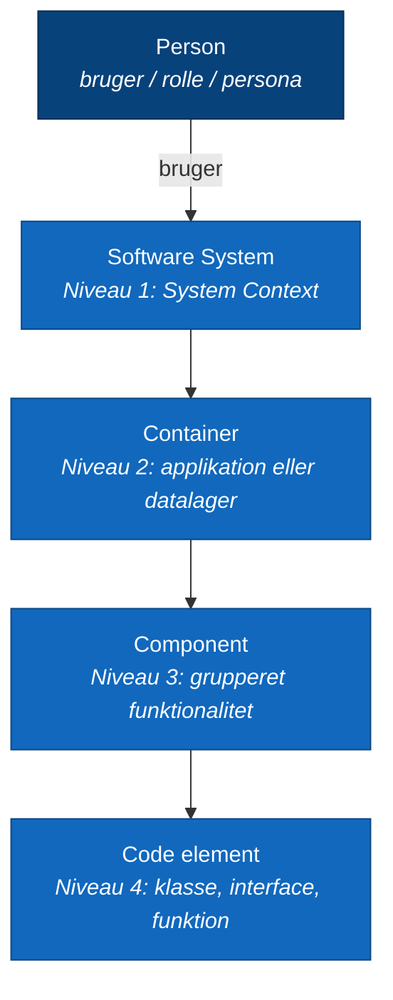
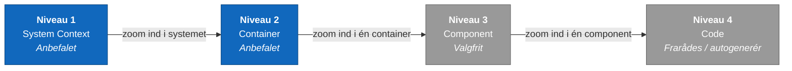
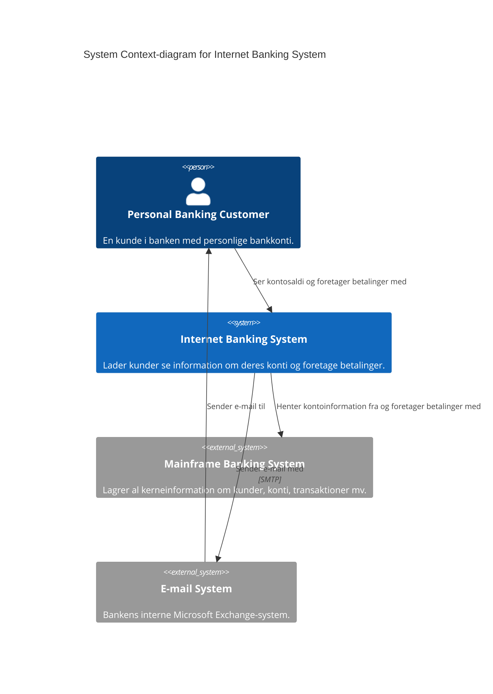
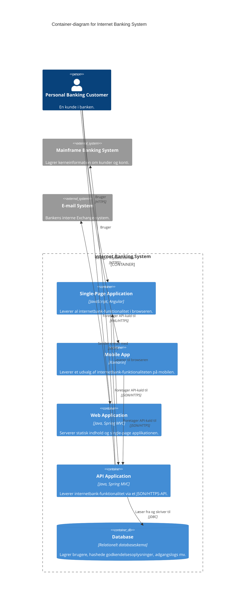

# C4-modellen — visualisering af softwarearkitektur

| Felt | Værdi |
|---|---|
| **Type** | Artikel / webressource |
| **Kursus** | Softwaredesign (SW4SWD-01) |
| **Hører til** | Uge 5 — Software Architecture Documentation |
| **Kilde** | [c4model.com](https://c4model.com/) (hele sitet: `/introduction`, `/abstractions`, `/abstractions/container`, `/abstractions/component`, `/abstractions/microservices`, `/diagrams`, `/diagrams/system-context`, `/diagrams/container`, `/diagrams/component`, `/diagrams/system-landscape`, `/diagrams/dynamic`, `/diagrams/deployment`, `/diagrams/notation`, `/diagrams/checklist`, `/tooling`, `/faq`) |
| **Forfatter** | Simon Brown |
| **Licens** | Creative Commons Attribution 4.0 International |
| **Emner dækket** | Abstraktioner (person, software system, container, component, code); de fire diagramniveauer; supplerende diagrammer (System Landscape, Dynamic, Deployment); notation og navngivning; review-checkliste; microservices; tooling (Structurizr, C4-PlantUML, Mermaid m.fl.); FAQ |
| **Se også** | [`SW4SWD-01_C4_Talk_Simon_Brown.md`](SW4SWD-01_C4_Talk_Simon_Brown.md) · [`../slides/SW4SWD-01_W05_Architecture_Documentation.md`](../slides/SW4SWD-01_W05_Architecture_Documentation.md) |

---

## 1. Hvad C4-modellen er

C4-modellen er en letlært, udviklervenlig tilgang til at tegne diagrammer over softwarearkitektur. Den er skabt af Simon Brown og består af fire dele, som er værd at holde adskilt:

1. **Et hierarki af abstraktioner** — software system, container, component, code.
2. **Et hierarki af diagrammer** — System Context, Container, Component, Code.
3. **Supplerende diagramtyper** — System Landscape, Dynamic, Deployment.
4. **Uafhængighed af notation og værktøj** — modellen foreskriver ikke en bestemt notation eller et bestemt tegneprogram.

Navnet "C4" kommer af de fire diagramniveauer: **C**ontext, **C**ontainers, **C**omponents, **C**ode.

Modellen blev til fordi arkitekturdiagrammer i praksis er et rod. Byggebranchen har standardiserede repræsentationer — situationsplan, plantegning, facadeopstalt — mens softwareteams typisk producerer det Brown kalder "a confused mess of boxes and lines". Formålet er at hjælpe udviklingsteams med at beskrive og kommunikere arkitektur, både under design op front og når man dokumenterer en eksisterende kodebase bagudrettet.

### De typiske problemer med arkitekturdiagrammer

Sitet opregner de gengangere, C4 forsøger at rette op på:

- **Inkonsistent notation** — farver, former og linjestile bruges uforklaret eller varierende.
- **Tvetydig betydning** — det er uklart hvad elementerne er, og hvad relationerne betyder.
- **Manglende teknisk detalje** — teknologivalg og akronymer forklares ikke.
- **Blandede abstraktionsniveauer** — ét diagram rummer flere detaljeringsgrader på én gang.
- **Problemer på tværs af en diagramserie** — navngivning og notation skifter fra diagram til diagram.

### Kort-analogien

Den bærende metafor er et kort eller Google Maps. Man zoomer ind og ud af det område, man er interesseret i, og hvert zoomniveau fortæller en anden historie til et andet publikum:

1. **System Context** — hvordan systemet passer ind i sine omgivelser.
2. **Container** — de applikationer og datalagre systemet består af.
3. **Component** — byggeklodserne inde i én container.
4. **Code** — implementeringsdetaljer på klasse- og funktionsniveau.

Pointen er, at diagrammerne ikke er alternative "views" af samme ting i 4+1-forstand. De er samme model set i forskellige forstørrelser.

### Abstractions first, notation second

Simon Browns hovedtese er, at **abstraktionerne er vigtigere end notationen**. To landkort over samme område viser de samme ting — byer, togbaner, skoler, kirker — men bruger forskellige farvekoder, linjestile og symboler. Det, der gør kortet læsbart, er nøglen (`key`/`legend`). Samme princip gælder arkitekturdiagrammer: bliv enige om abstraktionerne først, vælg notation bagefter, og forklar altid notationen i en signaturforklaring.

Abstraktionerne fungerer desuden som et **ubiquitous language** — et fælles ordforråd, som hele teamet kan bruge, både i diagrammer og i samtalen om systemet.

---

## 2. Abstraktionerne

C4 bygger på et bevidst lille sæt abstraktioner. Et **software system** består af en eller flere **containers** (applikationer og datalagre), som hver indeholder en eller flere **components**, som igen er implementeret af et eller flere **code elements** (klasser, interfaces, objekter, funktioner osv.). Uden om det hele står **people** — aktører, roller, personaer, navngivne individer.

### Person

En person er en menneskelig bruger af softwaresystemet: aktører, roller, personaer eller navngivne individer. På et System Context-diagram er det fx "Personal Banking Customer" eller "Customer Service Staff".

### Software system

Det højeste abstraktionsniveau — den samlede softwareleverance, som leverer værdi til sine brugere. Et software system kan være det, du selv bygger, eller et eksternt system, du afhænger af (typisk noget uden for dit eget teams kontrol eller ejerskab).

### Container

Dette er C4's mest misforståede begreb, og navnet er historisk uheldigt. En container er **en applikation eller et datalager** — "a runtime boundary around some code that is being executed or some data that is being stored". Altså noget, der skal køre eller være tilgængeligt, for at systemet fungerer, og noget du typisk deployer separat.

Eksempler på containers:

- Server-side webapplikationer (Java EE, ASP.NET, Node.js)
- Client-side webapplikationer (Angular, jQuery i browseren)
- Desktop-applikationer (WPF, JavaFX)
- Mobilapplikationer (iOS, Android)
- Console- og batch-applikationer
- Serverless functions (AWS Lambda, Azure Functions)
- Databaser (MySQL, MongoDB, PostgreSQL)
- Storage (S3-buckets, blob stores, CDN'er)
- Filsystemer, lokale eller netværksbaserede
- Shell-scripts

Hvad der **ikke** er en container: "A container is a runtime construct, like an application; whereas Java JAR files, C# assemblies, DLLs, modules, etc are used to organise the code within those applications." JAR-filer og DLL'er er altså kodeorganisering, ikke containers.

**Om Docker:** sitet anerkender eksplicit, at mange udviklere i dag forbinder ordet "container" med Docker. C4's container er et ældre og bredere arkitekturbegreb, som bevidst blev valgt teknologi-agnostisk — det går forud for containerteknologien. Simon Brown siger det direkte i sit foredrag: "Not Docker."

### Component

En component er "a grouping of related functionality encapsulated behind a well-defined interface" — en gruppering af relateret funktionalitet bag et veldefineret interface.

Vigtige egenskaber:

- **Ikke separat deployerbar.** I modsætning til containers eksisterer components *inde i* en container, og alle components i samme container kører i samme proces. Hvordan de pakkes — én JAR pr. component eller alle i én — er uden for C4's interesse.
- **Sprogafhængig realisering.** I objektorienterede sprog (Java, C#) er en component en samling klasser og interfaces. I C er det filer organiseret i mapper. I JavaScript moduler med objekter og funktioner. I funktionelle sprog logiske grupperinger af funktioner og typer.
- **Ikke det samme som en package eller et namespace**, selvom der i visse arkitekturmønstre kan opstå en 1:1-mapping.

Eksemplet fra sitet er Spring PetClinic: webapplikationen indeholder en række Java-klasser organiseret som controllers, services og repositories. I stedet for at vise alle klasser — hvilket bare bliver støj — grupperes relaterede klasser til components. Hver web-controller bliver en component for sig, mens service- og repository-klasser slås sammen efter funktionel sammenhæng.

### Code

Det laveste niveau: klasser, interfaces, objekter, funktioner, databaseskemaer og lignende. Her anbefaler C4 at bruge eksisterende notation — typisk UML-klassediagrammer, ER-diagrammer — og at generere diagrammerne automatisk fra IDE'en frem for at vedligeholde dem i hånden.

### Microservices — container eller software system?

Et tilbagevendende spørgsmål er, hvor microservices hører hjemme. Svaret afhænger af **ejerskab og teamstruktur**, ikke af teknik:

- **Ét team ejer hele systemet.** Hver microservice modelleres som en gruppe af containers inde i systemgrænsen — typisk en API-container plus en database-schema-container. Microservice-arkitekturen er en implementeringsdetalje inde i systemet.
- **Flere teams, ét team pr. service (Conway's Law).** Hver service "forfremmes" fra containergruppering til sit eget software system med egne Context- og Container-diagrammer.

Beslutningen skal afspejle organisationens ejerskabsgrænser, ikke den tekniske implementering.

---

## 3. De fire kernediagrammer

De fire niveauer er statiske strukturdiagrammer. Vigtigt forbehold fra sitet: *"you don't need to use all 4 levels of diagram; only those that add value."* De fleste udviklingsteams klarer sig med System Context og Container.

### Niveau 1 — System Context

| | |
|---|---|
| **Viser** | Dit system som en boks i midten, omgivet af sine brugere og de andre systemer, det interagerer med |
| **Scope** | Ét enkelt software system |
| **Primære elementer** | Det software system, diagrammet handler om |
| **Understøttende elementer** | People (brugere, aktører, roller, personaer) og eksterne software systems, der er direkte forbundet — typisk noget uden for din organisations kontrol |
| **Publikum** | Alle — både tekniske og ikke-tekniske, inden for og uden for udviklingsteamet |
| **Anbefalet?** | Ja. *"A system context diagram is recommended for all software development teams."* |

Fokus er på mennesker og systemer, ikke på teknologi, protokoller eller andre detaljer på lavt niveau. Diagrammet skal kunne læses af nogen, der ikke er programmør.

Eksempel — internetbank-systemet, som Simon Brown bruger gennem hele sit foredrag:

### Niveau 2 — Container

| | |
|---|---|
| **Viser** | Den overordnede form af softwarearkitekturen, og hvordan ansvar er fordelt på tværs af den. Desuden de væsentligste teknologivalg og kommunikationsmønstre mellem containers |
| **Scope** | Ét enkelt software system |
| **Primære elementer** | Containers inde i systemet — webapplikationer, mobilapps, databaser, filsystemer, storage-buckets |
| **Understøttende elementer** | People og eksterne software systems, der er direkte forbundet til containerne |
| **Publikum** | *"Technical people inside and outside the software development team; including software architects, developers and operations/support staff."* |
| **Anbefalet?** | Ja — for alle udviklingsteams |

Diagrammet udelader bevidst deployment-detaljer som clustering, replikering og load balancers, fordi de varierer fra miljø til miljø. Den slags hører hjemme i et separat Deployment-diagram.

Eksempel — samme internetbank, zoomet ind:

Bemærk at hver linje er navngivet med hensigt *og* teknologi, og at hver boks angiver både navn, type/teknologi og en kort ansvarsbeskrivelse.

### Niveau 3 — Component

| | |
|---|---|
| **Viser** | Én container dekomponeret i sine components, deres ansvar og deres teknologi-/implementeringsdetaljer |
| **Scope** | Én enkelt container |
| **Primære elementer** | Components inde i den valgte container |
| **Understøttende elementer** | Andre containers inde i systemet plus people og software systems, der er direkte forbundet til componenterne |
| **Publikum** | Softwarearkitekter og udviklere |
| **Anbefalet?** | Nej — valgfrit. *"Only create component diagrams if you feel they add value, and consider automating their creation for long-lived documentation."* |

Advarslen om automatisering er reel: componentdiagrammer tegnet i hånden bliver hurtigt forældede, fordi de ligger tættest på koden af de tre anbefalede niveauer. Derfor rådes man til at generere dem, hvis de skal leve længe.

### Niveau 4 — Code

Det laveste niveau — klassediagrammer, ER-diagrammer og lignende for én component. C4 anbefaler i praksis **ikke** at tegne dette niveau: det er for detaljeret, det ændrer sig for hurtigt, og moderne IDE'er kan generere det on demand. Brug det kun til komplicerede components eller hvor der foregår noget usædvanligt.

---

## 4. Supplerende diagramtyper

Ud over de fire kernediagrammer definerer C4 tre supplerende typer.

### System Landscape

| | |
|---|---|
| **Viser** | Et kort over de software systems, der findes inden for det valgte scope, og hvordan de hænger sammen. Reelt "et System Context-diagram uden et specifikt fokus på ét bestemt software system" |
| **Scope** | En virksomhed, organisation, afdeling eller lignende enhed |
| **Elementer** | People og software systems relateret til det valgte scope |
| **Publikum** | Tekniske og ikke-tekniske, inden for og uden for udviklingsteamet |
| **Anbefalet?** | Ja — sitet fremhæver det som "a bridge into the enterprise architecture world" for større organisationer med mange systemer |

### Dynamic

| | |
|---|---|
| **Viser** | Hvordan elementer i den statiske model samarbejder på runtime for at realisere en user story, use case eller feature |
| **Scope** | En bestemt feature, user story, use case eller lignende |
| **Elementer** | Efter behov: software systems, containers eller components |
| **Nummerering** | Interaktionerne nummereres for at vise rækkefølgen, elementerne kommunikerer i |
| **Publikum** | Tekniske og ikke-tekniske, inden for og uden for teamet |
| **Anbefalet?** | Brug sparsomt — kun til interessante eller tilbagevendende mønstre og features med et kompliceret samspil |

Forskellen fra et UML-sekvensdiagram er, at et Dynamic-diagram tillader **fri placering af elementerne**. Både collaboration-stil (fri placering, nummererede pile) og sequence-stil (lodrette livslinjer) formidler samme information — vælg den, teamet foretrækker.

### Deployment

| | |
|---|---|
| **Viser** | Hvordan instanser af software systems og containers er deployet på infrastruktur i ét bestemt miljø. Baseret på UML's deployment-diagram |
| **Scope** | Et eller flere software systems inden for ét deployment-miljø (production, staging, development osv.) |
| **Primære elementer** | **Deployment nodes** (fysiske servere, virtuelle maskiner, Docker-containere, eksekveringsmiljøer — de kan være indlejrede i hinanden), **container instances** og **software system instances** |
| **Understøttende elementer** | **Infrastructure nodes** som DNS-services, load balancers og firewalls |
| **Publikum** | *"Technical people inside and outside of the software development team; including software architects, developers, infrastructure architects, and operations/support staff."* |
| **Anbefalet?** | Ja |

Her er det legitimt at bruge cloududbyderes ikonsæt (AWS, Azure) — så længe ikonerne forklares i signaturforklaringen. Sitet viser tre eksempler: udviklingsmiljø, produktionsmiljø og et AWS-baseret setup.

Bemærk relationen mellem niveau 2 og deployment: Container-diagrammet viser den *logiske* struktur, Deployment-diagrammet viser den *fysiske* udrulning. Én container kan have mange instanser på tværs af mange noder.

---

## 5. Notation og navngivning

C4 foreskriver ingen bestemt notation. Standardvalget er simple **boxes and lines**, men alternative visualiseringer opfordres. Til gengæld er der klare anbefalinger til, hvad der skal stå i og på diagrammerne.

### Indholdet i en boks

Hvert element bør bære tre ting:

1. **Navn** — kort og genkendeligt.
2. **Type** — *"the type of every element should be explicitly specified (e.g. Person, Software System, Container or Component)."* For containers og components skrives teknologien eksplicit, fx `[Container: Java, Spring MVC]` eller `[Component: Spring Bean]`.
3. **Beskrivelse** — en kort sætning eller nogle få punkter om elementets væsentligste ansvar.

Netop punkt 3 er det, folk oftest springer over. Simon Browns argument er, at navne alene ikke fortæller noget: en boks med teksten "Content Updater" fortæller kun, at den opdaterer indhold. Med to linjers beskrivelse under bliver diagrammet selvforklarende, selv når navnet er kryptisk. Men hold det kort — ingen essays i boksene.

### Relationer og pile

- Hver linje er **én rettet relation**. Undgå linjer uden pilehoved og linjer med pilehoved i begge ender.
- *"Every line should be labelled, the label being consistent with the direction and intent of the relationship."* Retning og tekst skal stemme overens.
- Undgå vage etiketter som "Uses". Vær specifik: "Makes API calls to", "Sends e-mail using", "Reads from and writes to".
- Relationer mellem containers skal have teknologi eller protokol på: `[JSON/HTTPS]`, `[JDBC]`, `[SMTP]`.
- De fleste relationer er reelt tovejs (request/response), men tegn dem som én pil, der opsummerer hensigten — ellers bliver diagrammet hurtigt ulæseligt. Tegn kun begge retninger, når de to retninger er væsensforskellige (fx et synkront opslag ved opstart plus en asynkron eventstrøm på runtime).
- **Læs diagrammet højt.** Hvis "Trade Data System sends trade data to Financial Risk System" giver mening som en sætning, er relationen formentlig korrekt formuleret.

### Farver, former og ikoner

C4 kræver ingen bestemte farver. Eksemplerne på sitet bruger blåt og gråt, men det er ikke påbudt. Reglerne er:

- **Vær konsistent** inden for og på tværs af diagrammer.
- **Tag højde for tilgængelighed** — rød/grøn-farveblindhed er udbredt, og diagrammer bliver før eller siden printet i sort/hvid.
- **Brug form og farve som supplement, ikke som bærende information.** Fjerner man al farve og alle særlige former, skal diagrammet stadig give mening, fordi informationen ligger i teksten.
- Samme regel gælder ikoner. AWS- og Azure-ikonsæt ser pæne ud, men siger sjældent noget arkitektonisk. Brug dem som ekstra informationslag oven på et diagram, der allerede fungerer, og forklar dem i signaturforklaringen.

### Signaturforklaring (key/legend)

Alle diagrammer skal have en nøgle, der forklarer former, farver, kantstile, linjestile og pilehoveder — også når notationen er standardiseret som UML eller ArchiMate, og også når det virker indlysende for tegneren. Brown har et konkret eksempel fra sine workshops: folk tegner om formiddagen med forskellige tuschfarver, går til frokost, og kan efter frokost ikke huske, hvorfor en bestemt linje er rød.

### Titler

*"Every diagram should have a title describing the diagram type and scope"* — fx "System Context diagram for Internet Banking System" eller "Container diagram for Financial Risk System". Både **type** og **scope** skal fremgå.

### Akronymer

Akronymer og forkortelser skal enten være forståelige for hele det tiltænkte publikum eller forklares i signaturforklaringen. Til rent tekniske diagrammer er MVC, JDBC og lignende typisk uproblematiske. Farligst er de **domænespecifikke og virksomhedsinterne** akronymer — kodenavne på systemer og teams — som slår nyansatte ud.

---

## 6. Review-checkliste

Sitet stiller en checkliste til rådighed (også som en enkelt PDF-side) til at reviewe et diagram. Den er nyttig som eksamensmæssig huskeliste, fordi den destillerer hele notationsafsnittet til ja/nej-spørgsmål.

**Generelt**

- Har diagrammet en titel?
- Forstår du, hvilken diagramtype det er?
- Forstår du, hvad diagrammets scope er?
- Har diagrammet en signaturforklaring?

**Elementer**

- Har hvert element et navn?
- Forstår du elementernes type og abstraktionsniveau?
- Forstår du, hvad hvert element gør?
- Er teknologivalgene tydelige, hvor det er relevant?
- Forstår du betydningen af alle akronymer og forkortelser?
- Forstår du betydningen af alle anvendte farver?
- Forstår du betydningen af alle anvendte former?
- Forstår du betydningen af alle anvendte ikoner?
- Forstår du betydningen af alle kantstile (fx heltrukken, stiplet)?
- Forstår du betydningen af de forskellige elementstørrelser (fx små vs. store bokse)?

**Relationer**

- Har hver pil en etiket, der beskriver relationens hensigt?
- Stemmer beskrivelsen overens med pilens retning?
- Er teknologivalgene for relationerne tydelige, hvor det er relevant?
- Forstår du betydningen af alle akronymer og forkortelser?
- Forstår du betydningen af alle anvendte farver?
- Forstår du betydningen af alle anvendte pilehoveder?
- Forstår du betydningen af alle anvendte linjestile (fx heltrukken, stiplet)?

---

## 7. Tooling

### Diagramming vs. modelling

Sitet skelner skarpt mellem to tilgange, og det er den vigtigste pointe i tooling-afsnittet:

**Diagramming** — værktøjet har "bokse og linjer" som sit domænesprog. Det kan ikke validere noget, kan ikke svare på forespørgsler om elementer, og kræver copy-paste af de samme elementer på tværs af diagrammer. Omdøber du en container, skal du gøre det manuelt hvert eneste sted.

**Modelling (anbefalet)** — man opbygger først en ikke-visuel, struktureret model af arkitekturen, og genererer derefter diagrammer som views ind i modellen. Det giver genbrug af elementer, semantisk forståelse, mulighed for at forespørge modellen, og gør vedligehold og omdøbning trivielt.

### Kriterier for valg af værktøj

- Forfatterens tekniske niveau og det tiltænkte publikums
- "Diagrams as code" vs. drag-and-drop
- Data i Git vs. i en cloudtjeneste
- Hvor åbent formatet er, og om det kan diffes i versionsstyring
- Cloud-hosted eller selv-hostet
- Open source vs. kommerciel licens

### Konkrete værktøjer

Sitet vedligeholder en liste opdelt i "Modelling (recommended)" og "Diagramming". De mest relevante i kursussammenhæng:

- **Structurizr** — Simon Browns eget økosystem og modellens referenceimplementering. Man definerer modellen én gang og udleder flere views af den.
  - **Structurizr DSL** — en tekstbaseret, Git-venlig DSL til at beskrive model og views. Open source.
  - **Structurizr Lite** — gratis, selvhostet, kører lokalt mod en `workspace.dsl`- eller `workspace.json`-fil. Det oplagte udgangspunkt.
  - **Structurizr Cloud / on-premises** — kommercielle hostede varianter med deling og versionering.
- **C4-PlantUML** — et sæt makroer, der giver PlantUML et C4-agtigt domænesprog. Simon Brown fremhæver netop dette som sin første anbefaling i foredraget. Fordelen er, at det er ren tekst med automatisk layout.
- **Mermaid** — har indbygget C4-syntaks (`C4Context`, `C4Container`, `C4Component`, `C4Dynamic`, `C4Deployment`). Renderes direkte i GitHub, GitLab og de fleste Markdown-værktøjer — det er derfor, denne note bruger den.
- **IcePanel**, **LikeC4** og en række andre modelleringsværktøjer, der specifikt understøtter C4.
- **Generelle tegneværktøjer** — Visio, Lucidchart, draw.io, Gliffy, OmniGraffle, Excalidraw. De virker, men kender intet til softwarearkitektur, og hører derfor i "diagramming"-kategorien. Simon Brown fraråder dem direkte i sit foredrag: *"Do not use Visio."*

Sitet tager imod indsendelse af nye værktøjer; open source-værktøjer optages gratis.

---

## 8. FAQ

**Hvad er baggrunden for C4-modellen?**
Simon Brown udviklede tilgangen, mens han underviste i softwarearkitektur. Rødderne går tilbage til omkring 2006–2009, diagramtyperne fik navne i starten af 2010, og selve navnet "C4" blev første gang brugt i 2011.

**Hvad er inspirationen?**
Modellen opstod, da agile-påvirkede teams gjorde modstand mod UML. *"The C4 model was inspired by UML and the 4+1 model for software architecture"* — den forenkler begreberne og forsøger at mindske afstanden mellem arkitekturbeskrivelsen og selve kildekoden.

**Hvem bruger C4?**
Simon Brown har undervist over 10.000 mennesker i ca. 40 lande. Blandt de nævnte virksomheder er Spotify, Decathlon og Co-op. Modellen er refereret på Wikipedia, i InfoQ-artikler og i Open Group-standarder.

**Er C4 ikke et skridt tilbage? Hvorfor genopfinde UML?**
Svaret er kontekstafhængigt: virker UML for jeres team, så fortsæt med det. Men *"many teams have reverted to using ad hoc boxes and lines diagrams"*, og for dem giver C4 en struktur, de ellers ikke havde.

**C4 vs. UML, ArchiMate og SysML?**
Mange teams bruger ikke de etablerede notationer, fordi de opleves som for komplekse eller uforenelige med agil udvikling. Brug det, der virker, og supplér C4 med andre diagramtyper efter behov.

**Hvorfor dækker C4 ikke forretningsprocesser, workflows, tilstandsmaskiner, domænemodeller osv.?**
*"The focus of the C4 model is the static structures that make up a software system, at different levels of abstraction."* Alt andet supplerer man med andre diagramtyper.

**Kan man kombinere C4 og arc42?**
Ja, de er kompatible. System Context svarer til Context/Scope, Container til Building Block level 1, Component til level 2, og Code til level 3.

**Indebærer C4 en bestemt designproces eller teamstruktur?**
Nej. *"The C4 model is just a way to describe a software system, from different levels of abstraction, and it implies nothing about the process of delivering software."* Rækkefølgen 1→2→3→4 er en fortællerækkefølge, ikke en designrækkefølge.

**Kan man beskrive biblioteker, frameworks og SDK'er med C4?**
C4 sigter mod komplette systemer. Til biblioteker og frameworks er UML ofte bedre — alternativt kan man bruge C4 til at vise anvendelseseksempler og farvekode, hvad der er ens eget, og hvad der kommer fra frameworket.

**Er C4 universelt anvendelig?**
Den passer til *"custom-built, bespoke software systems"* på tværs af arkitekturstile og platforme. Mindre velegnet til embedded systemer og tungt tilpassede standardløsninger — men System Context- og Container-diagrammer kan stadig give værdi.

**Skalerer C4?**
Store systemer kræver, at man splitter komplekse diagrammer op i flere, som hver fokuserer på et bestemt forretnings- eller funktionsområde. Modelleringsværktøjer håndterer det markant bedre end tegneværktøjer, og alternative visualiseringer kan supplere de klassiske bokse og linjer.

---

## 9. Opsummering

C4-modellen er et forsøg på at give softwareteams det, byggebranchen har haft i århundreder: et sæt standardiserede repræsentationer på forskellige detaljeringsniveauer.

Kernen består af **fire abstraktioner** — person, software system, container, component (plus code) — som er nøje afgrænsede. En container er en applikation eller et datalager, ikke en Docker-container. En component er en gruppering bag et interface, som kører inde i en container og ikke deployes for sig.

Oven på abstraktionerne ligger **fire diagramniveauer**, der fungerer som zoomniveauer på et kort. System Context og Container er anbefalet til alle teams. Component er valgfrit og bør automatiseres, hvis det skal vedligeholdes. Code frarådes i praksis — generér det fra IDE'en. Dertil kommer tre supplerende typer: System Landscape (organisationens systemer), Dynamic (runtime-samarbejde med nummererede interaktioner) og Deployment (hvor tingene faktisk kører).

Modellens vigtigste enkeltstående princip er **abstractions first, notation second**. C4 dikterer ingen farver, former eller symboler. Til gengæld stiller den håndfaste krav til indhold: hver boks skal have navn, type og en kort ansvarsbeskrivelse; hver pil skal have en retning og en etiket, der matcher retningen; hvert diagram skal have en titel med type og scope samt en signaturforklaring. Testen er, at diagrammet skal kunne stå alene — fjerner man farver og former, skal teksten stadig bære betydningen, og en nyansat skal kunne læse det uden at opsøge den, der tegnede det.

På værktøjssiden er anbefalingen at **modellere frem for at tegne**: byg én struktureret model og generér views fra den, i stedet for at vedligeholde de samme bokse i flere uafhængige tegninger. Structurizr (særligt DSL og Lite), C4-PlantUML og Mermaids C4-syntaks er de oplagte valg; generelle tegneværktøjer som Visio og draw.io fraråder Simon Brown eksplicit.

For Simon Browns egen mundtlige gennemgang af det samme stof — med internetbank-eksemplet bygget op trin for trin og hans kritik af konkrete dårlige diagrammer — se [`SW4SWD-01_C4_Talk_Simon_Brown.md`](SW4SWD-01_C4_Talk_Simon_Brown.md). For kursets egen behandling af arkitekturdokumentation, se [`../slides/SW4SWD-01_W05_Architecture_Documentation.md`](../slides/SW4SWD-01_W05_Architecture_Documentation.md).
