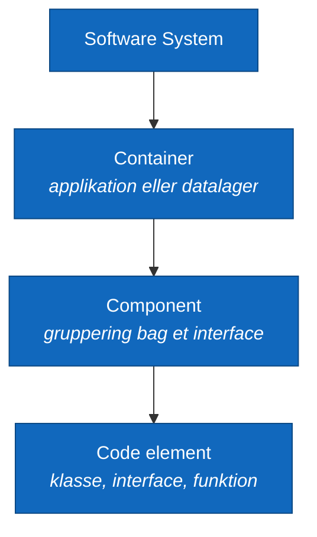
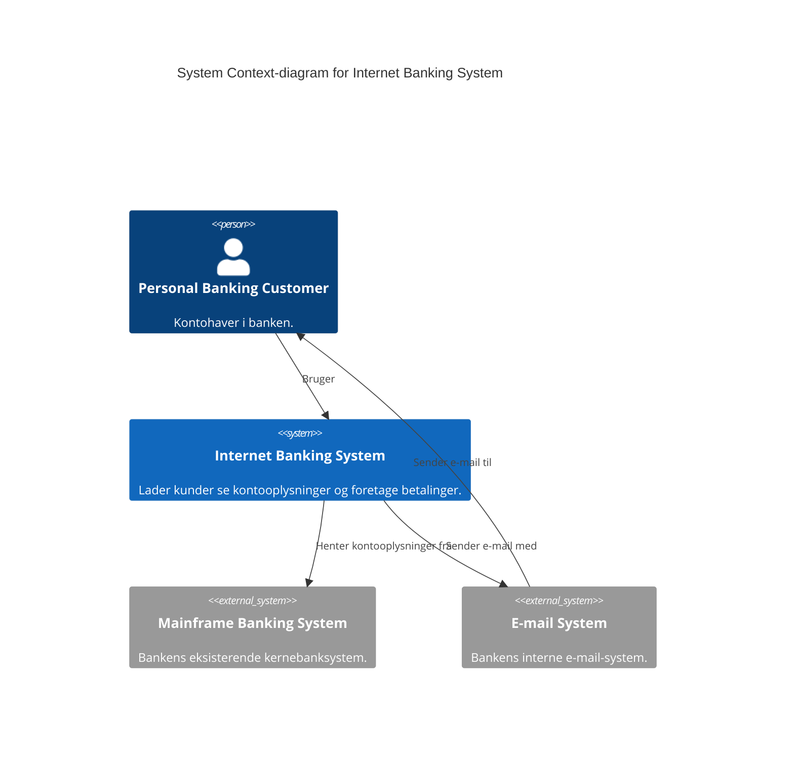
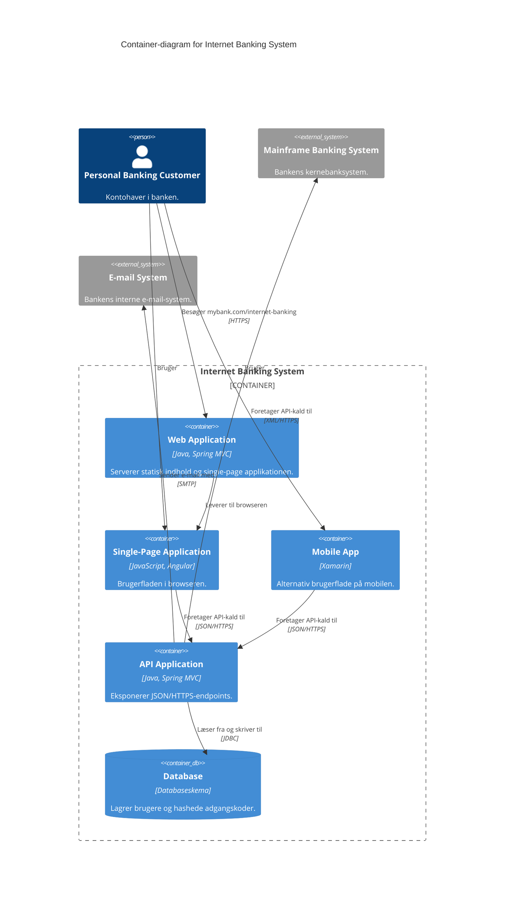

# Visualising software architecture with the C4 model — Simon Brown

| Felt | Værdi |
|---|---|
| **Type** | Foredrag (struktureret referat) |
| **Kursus** | Softwaredesign (SW4SWD-01) |
| **Hører til** | Uge 5 — Software Architecture Documentation |
| **Kilde** | "Visualising software architecture with the C4 model", Agile on the Beach 2019 — transskription `c4_talk_raw.txt`, længde 35:26 |
| **Forfatter** | Simon Brown, uafhængig konsulent med speciale i softwarearkitektur |
| **Emner dækket** | Hvorfor arkitekturdiagrammer fejler; UML-modstand; abstractions first, notation second; de fire C4-abstraktioner; de fire diagramniveauer med internetbank-eksemplet; notationstips (titler, tekst i bokse, ensrettede pile, key/legend, farver og ikoner); anbefalet tooling |
| **Se også** | [`SW4SWD-01_C4_Model.md`](SW4SWD-01_C4_Model.md) · [`../slides/SW4SWD-01_W05_Architecture_Documentation.md`](../slides/SW4SWD-01_W05_Architecture_Documentation.md) |

> **Om dette dokument.** Dette er et struktureret referat, ikke en ordret udskrift. Tidsstemplerne i overskrifterne henviser til positionen i videoen, så man kan springe direkte til det relevante afsnit. Tekniske termer, som transskriptionen har hørt forkert, er rettet efter konteksten — fx "structurizer" → **Structurizr**, "plant UML" → **PlantUML**, "Lucidcharch" → **Lucidchart**, "Omnigraphyl" → **OmniGraffle**, "draw the IO" → **draw.io**, "Zamarin" → **Xamarin**, "NBC" → **MVC**, "carters/cartons" → **katas**, "raw cast" → **broadcast**.

---

## 1. Problemet: arkitekturdiagrammer er et rod (00:00–04:30)

Brown åbner med et håndsoprækning: *hvem bruger UML?* Cirka 10 % på verdensplan, lidt flere i salen end forventet. Det er, siger han med et skævt smil, måske forklaringen på, hvorfor virksomheder hyrer ham ind.

Grundene til at droppe UML er mange og delvist mytologiske — "man ser gammeldags ud", "det forventes ikke i agile", "værdien ligger i samtalen". Han refererer spøgefuldt til en bog med titlen *97 Ways to Sidestep UML*. Problemet er, at anbefalingen, der erstattede UML — "brug bare en whiteboardtavle" — aldrig blev fulgt op af undervisning i, hvordan man så tegner.

Han rejser verden rundt og afholder **arkitektur-katas**: deltagerne får et sæt krav og bliver bedt om at tegne. Resultaterne viser han frem. Ét diagram ligner London Heathrow Airport. Et andet oplyser, at "vores system laver forretningslogik". Et tredje er "the logical view" og består af stormtroopers. Der er overstregninger og omdøbninger.

Den virkelig afslørende del er peer review-øvelsen. Grupperne bytter diagrammer og giver hinanden karakter fra 1 til 10. Stort set alle diagrammer får **7**. Også dem, der intet fortæller. Det mest afslørende: ét diagram, der faktisk indeholdt *mere* detalje end de andre, fik en lavere karakter, fordi gruppen syntes det var for meget og ikke forstod det. Konklusionen er, at "brug bare en whiteboardtavle"-tilgangen ikke virker af sig selv.

**Er problemet så bare, at folk har for lidt tid, eller at de tegner i hånden?** Nej. Brown googler "software architecture diagram" og gennemgår resultaterne: de ser pænere ud — pæne firkantede bokse, pæne farver — men lider af nøjagtig de samme fejl som de håndtegnede.

De gennemgående fejl:

- Bokse uden linjer imellem
- Forskellige former, uden at man ved hvorfor
- Forskellige farver, uden at man ved hvorfor
- Forskellige boksstørrelser, uden betydning
- Lag, både vandret og lodret
- Akronymer uden forklaring
- Ingen titel

---

## 2. Analogien til byggebranchen (04:30–06:10)

Beder man en arkitekt om en plantegning over ens bolig, får man en plantegning. Vinduer, døre, mål — man forstår den umiddelbart.

Beder man en softwareudvikler om en plantegning over sit hus, får man Browns eget eksempel: et diagram, hvor de røde prikker markerer wi-fi-hotspottet, "fordi det er vigtigt", og hvor han ikke selv kan huske, hvad de stiplede linjer betyder. *"Logisk og konceptuelt giver det perfekt mening"* — for tegneren, lige der og da.

Hans pointe: **vi burde være ingeniører, men opfører os som kunstnere.** Og konsekvensen er ikke kosmetisk. Han har besøgt organisationer, hvor manglende kommunikation direkte bremser leverancen, fordi teams ikke deler en fælles forestilling om, hvad de skal bygge, hvad de er ved at bygge, eller hvad de allerede har bygget.

Et andet argument mod UML er, at det er meget teknisk. Til udviklere og arkitekter er det fint. Men product owners, scrum masters og testere kender det sjældent. Som fortæller må man **målrette sin historie til forskellige publikum**.

Hans hovedråd her: **når du tegner arkitekturdiagrammer, så tænk ikke som en arkitekt — tænk som en udvikler.** Det lyder bagvendt, men det matcher hans erfaring fra workshopperne: deltagerne kan sagtens *designe* en løsning. Men i det øjeblik de skal *tegne* den, tager de arkitekthatten på og producerer højtsvævende, konceptuelle billeder uden indhold. Målet er, at diagrammet **afspejler virkeligheden** — så en anden udvikler kan se på det og sige: "ja, det er præcis det, vi bygger."

---

## 3. Abstractions first, notation second (06:10–08:00)

UML giver to ting: et standardsæt af *ting* og en standardnotation til at tegne dem. Brown mener, at **tingene — abstraktionerne — er langt vigtigere end notationen**. Og eftersom netop notationens kompleksitet er en af de hyppigst nævnte grunde til at droppe UML, er det det rigtige sted at give slip.

Analogien er landkortet. Tager man to forskellige kort over samme område, viser de de samme ting: byer, togbaner, busruter, skoler, kirker, museer, seværdigheder. Samme abstraktioner. Men de bruger forskellige farvekoder, linjestile, skraveringer og symboler.

Og nøglen til at forstå et kort er **nøglen**. Signaturforklaringen fortæller, hvad hvert symbol betyder. Et enkelt, kraftfuldt koncept, som softwarebranchen bare kan låne.

> **Mantraet, han gentager til sidst i foredraget: abstractions first, notation second.**

---

## 4. De fire abstraktioner (08:00–09:35)

Brown bygger hierarkiet op nedefra og op:

**Software system** → består af en eller flere **containers** → som indeholder **components** → som er bygget af **code elements**.

**Container.** *"Not Docker."* Han har undervist i tilgangen i over ti år, og så blev Docker populært og "stjal ordet". Med container mener han **en applikation eller et datalager** — noget der kører din kode, noget du skal deploye og køre et sted, eller noget hvor dine data bliver gemt. Konkret: en mobilapp på din telefon, en server-side backend-app, en console-app, en Windows-service i C#, et Python-script, et databaseskema, en mappe på et fildrev, en Amazon S3-bucket, en DynamoDB-tabel.

**Component.** Et hårdt overbelastet ord. Brown definerer det pragmatisk: **en gruppering af ting — modularitet, en pæn afgrænsning, et pænt og enkelt interface — som kører inde i en container.** Det sidste er det væsentlige: der er et hierarki, components ligger inde i containers.

**Code.** Kigger man ind i en component, består den for det meste af kodeniveau-elementer. Bygger man en Java-app, er componenterne lavet af Java-klasser og interfaces.

Og det er det. Et simpelt hierarki af strukturelle elementer, som man kan bruge til at beskrive softwarearkitektur.

---

## 5. C4-modellen og diagrammer som kort (09:35–11:30)

C4 står for **Context, Containers, Components, Code** — fire diagramniveauer, der mapper direkte på de fire abstraktionsniveauer. Ressourcen er `c4model.com`.

Her indskyder Brown et **vigtigt forbehold**, som han understreger, at folk konstant overser:

> *"The one thing I do not want you to take away is: Simon says we must draw diagrams in this order."*

Han fortæller historien lineært, fordi man er nødt til at fortælle den i en rækkefølge. Men mange lytter og konkluderer derefter, at man også skal *designe* i den rækkefølge. Det er ikke pointen. Det er en **samling diagrammer, man kan tegne i vilkårlig rækkefølge** for at beskrive systemet på forskellige detaljeringsniveauer.

Måden at tænke det på er **diagrammer som kort**. Brown bor på Jersey i Kanaløerne. Søger man "Jersey" i sin kort-app, zoomer den direkte ind på øen. Ved man i forvejen hvor Jersey ligger, er det brugbart. Har man aldrig hørt om stedet, er det værdiløst — man mangler kontekst. Så man zoomer ud eller ind for at fortælle forskellige historier på forskellige informationsniveauer. Præcis sådan fungerer C4's fire niveauer: **forskellige detaljeringsniveauer til forskellige publikum.**

Foredraget dækker primært de statiske strukturdiagrammer. Men når man først har styr på den statiske struktur og kan tale om den, kan man bruge de samme begreber til runtime-diagrammer, sekvensdiagrammer og deployment-diagrammer.

---

## 6. Niveau 1 — System Context-diagrammet (11:30–13:35)

Alle eksempler bygger på ét gennemgående scenarie: **vi arbejder for en bank, og banken vil have bygget et internetbank-system.**

Et System Context-diagram viser **den ting, du arbejder på eller bygger**, plus **det, der ligger omkring den**: andre systemer, den taler med, og de mennesker, der bruger den.

Brown bygger det op trin for trin:

1. **En boks i midten** — Internet Banking System, et software system. (Formen og farven kommer vi til senere.)
2. **Hvem bruger det?** Her kigger man på roller, brugere og personaer. I eksemplet kun én type: *personal banking customers* — kontohavere som dig og mig, der vil se kontooplysninger og foretage betalinger.
3. **Hvor får systemet sine data fra?** Banken har allerede et eksisterende system: et **mainframe backend banking system**, hvor alle kernebankdata ligger. Der skal være en integration.
4. **Hvad ellers?** Vi skal sende e-mails til kunderne. I stedet for at bygge vores eget e-mail-system bruger vi bankens interne.

Det er et simpelt diagram, der viser hvad vi arbejder på, og hvilke omgivelser det står i — mennesker og andre systemer. Til større miljøer får man flere bokse, og så opstår spørgsmålet om, hvordan man håndterer store diagrammer (Brown henviser det til Q&A).

Niveau 1 er **højt niveau, uden mange teknologivalg, og egnet til et meget bredt publikum**.

---

## 7. Niveau 2 — Container-diagrammet (13:35–16:45)

Nu vil vi som udviklere og arkitekter vide mere: hvad er der inde i internetbank-systemet? Hvilken teknologi er det bygget af? Hvordan fungerer det? Vi *knibezoomer* ind i boksen og lander på niveau 2.

Et **Container-diagram viser alle dine applikationer og datalagre, og hvordan de forholder sig til hinanden på runtime.**

Den tomme boks i midten er internetbank-systemet fra forrige diagram — det er den, vi åbner. Menneskene og de eksterne systemer, vi afhænger af, bliver stående.

Brown indskyder et forbehold: *"Det, I nu ser, er, hvordan **jeg** kunne finde på at designe et internetbank-system. I er måske ikke enige i mit design. Det er fint. Parkér de tanker."* Han var nødt til at designe noget for at kunne vise et diagram.

Opbygningen, trin for trin:

1. **Web Application** — du åbner browseren, går til `mybank.com/internet-banking` og får statisk indhold tilbage: HTML, CSS, JavaScript. Det serveres af en backend-webapp, her en **Java Spring MVC-app**.
2. **Single-Page Application** — når det statiske indhold er landet i browseren, kører det som en single-page app client-side. Det modelleres som en **separat boks**, fordi det er JavaScript-kode, der kører i browseren og udgør brugerfladen. Her **JavaScript og Angular**.
3. **Mobile App** — en alternativ brugerflade til kunderne, bygget cross-platform med **Xamarin**.
4. **API Application** — hvordan får single-page appen og mobilappen data fra backend-banksystemet? De skal igennem noget. Altså en separat API-applikation, der eksponerer **JSON over HTTPS**-endpoints, deployet separat som endnu en **Java Spring MVC**-webapplikation. *Nu har vi to server-side webapplikationer.* (Man kunne have haft én — Brown vælger to.)
5. **Database** — vi skal kunne logge ind med brugernavn og adgangskode. Vi spørger banken, om vi må lægge credentials ind i backend-banksystemet. Svaret er nej. Så vi har brug for vores eget sted at gemme data: **et eget databaseskema**.

To definerende egenskaber ved niveauet:

- Hver container er **for det meste** en separat deploybar enhed. (Han vender tilbage til, hvorfor der står "for det meste".)
- Linjerne mellem containere er **for det meste inter-proceskommunikation** — altså noget, hvor der typisk er et netværk involveret.

Diagrammet viser applikationerne og datalagrene, de teknologier de er bygget med, lidt om deres ansvar, og hvordan de forbinder på runtime.

---

## 8. Niveau 3 — Component-diagrammet (16:45–19:15)

Forestil dig nu, at vi sidder i det team, der arbejder på **API-applikationen**, og vil se, hvordan den kodebase er struktureret. Vi knibezoomer igen og lander på niveau 3.

Samme metode: den tomme boks er API-applikationen fra forrige diagram. Den bruges af single-page appen og mobilappen, og nu fylder vi indhold i:

- **Sign In Controller** — du åbner mobilappen og skal logge ind. Der skal være et sign-in-API.
- **Security Component** — som sign-in-controlleren bruger til at autentificere mod vores credentials i databasen. Forhåbentlig med hashede adgangskoder og det hele.
- **Accounts Summary Controller** — når du er logget ind, får du en liste over dine konti. Det serviceres af et separat endpoint.
- **Mainframe Banking System Facade** — den, Brown selv kalder *"this really horribly named component"*, som taler med det ligeledes horrible backend-banksystem. Bruges af accounts summary-controlleren.
- **Reset Password Controller** plus tilhørende komponenter — hvis nogen vil nulstille sin adgangskode.

I et rigtigt system ville der være **mange flere** components på diagrammet, og igen melder spørgsmålet om store diagrammer sig.

Det er også her, **de lavere teknologivalg** kommer ind: Spring Beans, Spring MVC REST Controllers og andre frameworkvalg.

Browns centrale krav til niveau 3:

> *"If I were to open the code base for this API application, I would expect to see very clearly these six things somewhere in my code base."*

På componentniveau skal arkitekturdiagrammet altså **afspejle kodestrukturen på et overordnet niveau**. Der skal være en pæn **1:1-mapping mellem begreberne på diagrammet og begreberne i kodebasen** — hvad enten de manifesterer sig som sprogniveau-moduler, Maven-moduler, Gradle-moduler, components, packages, namespaces, JAR-filer eller DLL'er. Der skal findes *en eller anden* organiseringsstruktur i koden, som diagrammet afspejler.

---

## 9. Niveau 4 — Code, og hvorfor du ikke skal tegne det (19:15–20:15)

Brown er utvetydig, og siger det bevidst to gange, fordi folk altid overhører det:

> *"I do not recommend doing level four, because it's not worth it."*

Begrundelserne: det er ikke arbejdet værd, og man kan som regel bare **generere niveau 4 automatisk fra sin IDE**.

For historiens skyld viser han alligevel et eksempel: vi zoomer ind i den grimt navngivne mainframe banking system facade og får et **klassediagram**. Og det er netop her, **UML er super nyttigt** — til at dokumentere og diagrammere de lavere niveauer.

Undtagelsen: har du en **kompliceret component**, eller foregår der noget usædvanligt, så tegn endelig niveau 4. Men i **99 % af tilfældene: lad være. Automatisér det i stedet.**

---

## 10. Notation, del 1 — titler, layout og akronymer (20:15–22:15)

Diagrammerne er dækket. Nu følger notationen, som Brown betoner er vigtig, og som rummer en række detaljer, der let overses.

**Tip 1: Sæt titler på billederne.** Det lyder banalt, men i hans workshops mangler **80 % af diagrammerne en titel** i første forsøg — og så aner man ikke, hvad man kigger på. En titel skal være eksplicit om **to** ting: **hvilken diagramtype** det er, og **hvad dets scope** er. Tegner han et System Context-diagram for et financial risk system, skriver han bogstaveligt "System Context diagram for Financial Risk System".

**Layout.** Har man ikke whiteboard og tegner på papir, er det svært at viske ud. Brug **post-its eller indekskort** som bokse, flyt rundt på dem, find et layout du kan lide. Men *aflevér* ikke diagrammer som en samling post-its — de falder af, og det ser rodet ud.

**Visuel konsistens.** Har man flere detaljeringsniveauer, skal man tilstræbe konsistens på tværs: hold menneskene samme sted på diagrammet, og brug **samme farvekoder og former på alle niveauer**. Det er præcis, hvad man kan se i hans egne eksempler.

**Akronymer.** Vær forsigtig — men vær det målrettet. Tegner du til teknikere, behøver du ikke forklare MVC, ASP eller JDBC; det forstår vi. Fokusér i stedet på de **domænespecifikke akronymer, forretningsforkortelserne og den interne jargon**: kodenavne på systemer, kodenavne på teams. Det er dem, der slår nyansatte ud lynhurtigt.

---

## 11. Notation, del 2 — bokse og teksten i dem (22:15–24:52)

Når Brown tegner et diagram første gang, **glemmer han bevidst form og farve** og tegner kedelige, almindelige bokse. Indholdet er tekst.

På de **tre øverste niveauer** — Context, Containers, Components — er der kun **fire elementtyper** i spil. Det gør sproget nemt at lære:

| Diagram | Elementtyper |
|---|---|
| System Context | Person, Software System |
| Container | Person, Software System, Container |
| Component | Person, Software System, Container, Component |

Hver boks indeholder:

1. **Et navn.** Navngivning er svært, men målet er et enkelt, letforståeligt navn.
2. **Elementets type, eksplicit.** Han skriver bogstaveligt i boksen: *dette er en Person*, *dette er et Software System*. Så ved man, hvad man får, og der skal ikke gættes. For de to tekniske typer — containers og components — er det her, **teknologivalgene** væves ind: *dette er et databaseskema*, *dette er en Spring MVC-app*.
3. **En kort beskrivelse.** Enten som en sætning eller som fem til syv punkter, der lister elementets væsentligste ansvar.

Her kommer indvendingen altid: *"hvorfor putter du så meget tekst i dine bokse? Sådan gør man ikke arkitekturdiagrammer."* Browns svar: **det er præcis derfor, der er problemer.**

Han viser to versioner af samme diagram. Til venstre den typiske: bare navngivne bokse. Til højre hans egen med tekst i.

> Peger man på boksen "Content Updater" til venstre og spørger, hvad den gør, er svaret: "den opdaterer indhold". Og "File System"? "Den gemmer filer."

Navnene fortæller altså ingenting. I versionen til højre kan man — selv når navnene er mærkelige, tvetydige eller vage — læse teksten og forstå: *okay, navnet giver ikke mening, men nu ved jeg, hvad tingen gør.* Man tilføjer **eksplicithed**.

Forbeholdet: **hold det kort.** Han har set folk skrive hele essays i boksene, og det er ikke pointen.

---

## 12. Notation, del 3 — linjer og relationer (24:52–28:10)

Linjer fortjener opmærksomhed, fordi de giver strukturen — de limer elementerne sammen.

**Kun ensrettede linjer.** Alle Browns pile peger én vej. Man ser aldrig linjer uden pilehoved eller med pilehoved i begge ender i hans diagrammer.

**Hvilken vej peger pilen?** Det er op til dig — der er ingen faste regler. Hans egen præference er *A kalder B* eller *A afhænger af B*. Vil man i stedet vise events, beskeder eller informationsstrøm, er det helt fint. Det afgørende er, at **pilens retning matcher den tekst, man skriver på den**.

**Fælden med tovejs-relationer.** De fleste relationer er reelt tovejs. Single-page appen sender et request til API-applikationen, og API-applikationen sender et response tilbage. Men viser man begge retninger for hver eneste relation, får man **meget hurtigt et meget rodet diagram**. Løsningen er at **opsummere hensigten med de to pile i én**: "The Single-Page Application makes API calls to the API Application."

**Undgå "Uses".** For generelt og vagt. Vær så specifik som muligt — men hold det kort.

**Undtagelsen.** Nogle gange *skal* man vise begge retninger: når de to retninger er **væsensforskellige i natur og hensigt**. Hans eksempel: to microservices A og B. Ved opstart henter A en liste fra B med et **synkront kald**. På runtime kører der samtidig en **broadcast** af events. To fundamentalt forskellige relationstyper — dem vil han vise hver for sig.

**Fælden med at skjule den egentlige historie.** Forestil dig et Container-diagram over en microservice-arkitektur, hvor alt går ind og ud af en message bus. Så får man et **hub-and-spoke-diagram**: alle services peger på bussen. Det er faktuelt korrekt — men man mister vigtig information om, hvem der egentlig taler med hvem.

Alternativet: **udelad message bussen** og tegn i stedet den reelle **punkt-til-punkt-relation mellem A og B**, med noten om, at Kafka eller RabbitMQ er transportmekanismen. Igen ingen faste regler — spørgsmålet er, om **diagrammet fortæller den historie, du vil fortælle**.

**Læs diagrammet højt.** Et enkelt, effektivt trick. "The Trade Data System sends trade data to the Financial Risk System." Giver det mening som en sætning, er relationen formuleret rigtigt. Meget af dette handler bare om at **tilføje flere ord for at gøre tingene eksplicitte**.

---

## 13. Notation, del 4 — key/legend, farver, former og ikoner (28:10–33:00)

**Hav en signaturforklaring.** Hvert diagramsæt skal have en konsistent **key eller legend**, der beskriver former, farver, linjestile, kanter, akronymer og så videre — **også når det virker indlysende for dig**.

Hans bevis fra workshopperne: deltagerne tegner om formiddagen med forskellige tuschfarver. De går til frokost. Når de kommer tilbage, spørger de: *"hvorfor er den linje rød?"* De tegnede den selv for to timer siden og har glemt det.

Han viser sit eget Container-diagram for internetbank-systemet med tilhørende legend: den stiplede kasse er systemgrænsen; de blå bokse er containers, hvor **forskellige former markerer forskellige containertyper**; menneskeformerne er people; de grå bokse er eksterne software systems. I det eksempel siger han blot, at *der er relationer* — uden at skelne mellem dem.

Men man **kan** skelne, hvis man vil:

- **Heltrukne linjer for synkrone relationer, stiplede for asynkrone** — og så skriver man det i sin legend.
- **Farver til protokoller** — fx grønne linjer for sikre forbindelser (HTTPS) og røde for usikre.

To advarsler: pas på **rød/grøn-farveblindhed**, og pas på **sort/hvid-printere** — for det sker på et tidspunkt.

**Den bærende regel om form og farve:**

> *"Use shape and colour to complement a diagram that already makes sense."*

Med andre ord: **fjerner man al farve og alle særlige former, skal diagrammet stadig give mening.** Og grunden til, at det gør, er den tekst, man har lagt i boksene.

Han viser to versioner af samme diagram — én rå og én med former og farver — og salen foretrækker forudsigeligt den pæne. Hans analyse er interessant: den pæne version er hurtigere at **forstå**, fordi form og farve **bekræfter, hvad man tror man ser** (de ting foroven ligner mennesker — og teksten bekræfter, at det er mennesker; de ting forneden ligner datalagre). Men **informationsmængden er den samme i begge**, og den information ligger i teksten.

**Ikoner følger samme regel.** Folk tegner diagrammer med AWS- eller Azure-ikonsæt. De ser flotte ud og er glimrende, hvis man vil vise, hvilke Amazon-services man bruger — men de er *"basically pointless"* fra et arkitekturperspektiv: han forstår ikke halvdelen af ikonerne, og han ved ikke, hvorfor de er valgt. Diagrammerne fortæller ham ikke nok.

Vil man bruge ikoner, skal de altså tilføje **et ekstra informationslag**. Han viser en alternativ version af sit Container-diagram, hvor farven er fjernet og erstattet af ikoner: kender man dem, ser man to Java Spring-apps, et databaseskema, Angular og Xamarin. Kender man dem ikke, gør det ikke noget — **al information ligger i teksten**. Og legenden skal naturligvis vise eksempler på, hvad ikonerne betyder.

**Målet: diagrammer, der kan stå alene.** Normalt kræver et arkitekturdiagram en samtale for at give mening, fordi diagrammet i sig selv er håbløst. Det er fint, så længe tegneren står ved siden af. Men det, der faktisk sker, er:

1. Nogen tegner et diagram på en whiteboardtavle.
2. Der tages et foto.
3. Fotoet lægges på Confluence, og der bliver det liggende for evigt.
4. En ny kollega starter og bliver henvist til Confluence.
5. Vedkommende forstår intet og må opsøge den, der tegnede det.
6. Den person sagde op for fire måneder siden.
7. Så bruger man tre timer med en anden gruppe mennesker ved den samme tavle på at gentegne — ikke det samme billede, men noget man håber ligner.
8. Og så gentager det sig, og man bremser sig selv.

Enhver fortælling, præsentation eller supplerende dokumentation skal derfor lægge sig **oven på et diagram, der allerede giver mening**. Formålet er at flytte tiden fra *"hvorfor er den boks blå og den her rød?"* til at fortælle **mere værdifulde historier**.

**Notationschecklisten.** Brown henviser til en **checkliste på c4model.com** — en enkelt PDF-side, gratis at downloade, med ja/nej-spørgsmål til at forbedre sin arkitekturdokumentation. Den er gengivet i sin helhed i [`SW4SWD-01_C4_Model.md`](SW4SWD-01_C4_Model.md#6-review-checkliste).

---

## 14. Tooling-anbefalinger (33:00–35:26)

Brown giver "to anbefalinger" og retter sig straks selv til tre.

**1. Brug ikke Visio.** Og med Visio mener han hele kategorien: **Visio, OmniGraffle, Lucidchart, draw.io og Gliffy**. Begrundelsen er ikke, at de er dårlige programmer, men at de er **generelle tegneværktøjer, der ikke ved noget som helst om softwarearkitektur**. Hans dom: *"the worst category of tools you can use — they're the most common, but they're the worst."*

**2. C4-PlantUML.** PlantUML er en måde at tegne diagrammer på ud fra ren tekst: man skriver noget tekst, kører det gennem værktøjet, og det håndterer layoutet automatisk. Nogen har lavet et sæt **makroer og plugins til PlantUML**, som gør det muligt at tegne C4-diagrammer i et C4-agtigt domænespecifikt sprog — fuldt kompatibelt med PlantUML.

**3. Hans eget værktøj — Structurizr.** Han har været utilfreds med de eksisterende værktøjer og har derfor bygget sit eget. Noget er gratis, noget er open source, noget er kommercielt. Der findes et helt økosystem af værktøjer, som specifikt understøtter C4-modellen.

**Afslutningen** samler mantraet og de tre ting, man skal tage med hjem, hvis man vil indføre C4 i sit team:

> Uanset hvilket værktøj I bruger: **abstractions first, notation second.** Sørg for, at alle forstår **de fire abstraktionsniveauer** og **de fire diagramtyper**, fortæl dem at de **ikke skal bruge niveau 4**, og gå videre derfra.

---

## 15. Opsummering

Foredraget er i praksis en argumentation i tre led.

**Diagnosen (00:00–06:00).** Arkitekturdiagrammer er dårlige, og det er dokumenterbart. Browns katas producerer diagrammer, der ligner Heathrow Airport, og som deltagerne alligevel giver 7 ud af 10 — også de intetsigende. Google-billeder viser samme fejl i pænere indpakning. Fejlene er altid de samme: manglende titler, uforklarede farver og former, uforklarede akronymer, blandede abstraktionsniveauer og umærkede linjer. Konsekvensen er reel: teams uden fælles billede af systemet bremser sig selv.

**Kuren, del 1 — abstraktionerne (06:00–20:15).** Bliv enige om et lille, veldefineret sæt begreber, før I diskuterer notation. Et **software system** består af **containers** (applikationer og datalagre — ikke Docker), som indeholder **components** (grupperinger bag et interface, som kører i samme proces), som er bygget af **code elements**. Oven på det ligger fire diagramniveauer som zoomniveauer på et kort. Internetbank-eksemplet bygges op trin for trin: Context (kunde, mainframe, e-mail) → Container (web app, single-page app, mobile app, API app, database) → Component (controllers, security component, mainframe facade). Niveau 4 skal man **ikke** tegne — generér det fra IDE'en; UML er glimrende netop dér. Og rækkefølgen er en fortællerækkefølge, ikke en designproces.

**Kuren, del 2 — notationen (20:15–33:00).** Sæt **titel** på med både type og scope. Put **navn, eksplicit type og en kort ansvarsbeskrivelse** i hver boks — navne alene fortæller ingenting, som "Content Updater"-eksemplet viser. Brug **ensrettede pile med etiketter, der matcher retningen**, opsummér tovejs-relationer i én pil, undgå "Uses", og **læs diagrammet højt** som kontrol. Hav altid en **key/legend**, også når det virker indlysende — folk glemmer deres egen farvekode over frokost. Brug **form, farve og ikoner som supplement, aldrig som bærer af information**: fjern alt det, og diagrammet skal stadig give mening, fordi informationen ligger i teksten. Testen er, om diagrammet **kan stå alene** for en nyansat, der finder det på Confluence to år senere.

**Værktøjer (33:00–35:26).** Undgå generelle tegneværktøjer (Visio, draw.io, Lucidchart, OmniGraffle, Gliffy). Brug C4-specifikt værktøj: **C4-PlantUML** eller **Structurizr**.

Den fulde skriftlige reference til alt dette — inklusive de supplerende diagramtyper (System Landscape, Dynamic, Deployment), som foredraget kun strejfer, samt FAQ og den komplette tooling-liste — findes i [`SW4SWD-01_C4_Model.md`](SW4SWD-01_C4_Model.md). Kursets egen behandling af emnet ligger i [`../slides/SW4SWD-01_W05_Architecture_Documentation.md`](../slides/SW4SWD-01_W05_Architecture_Documentation.md).
