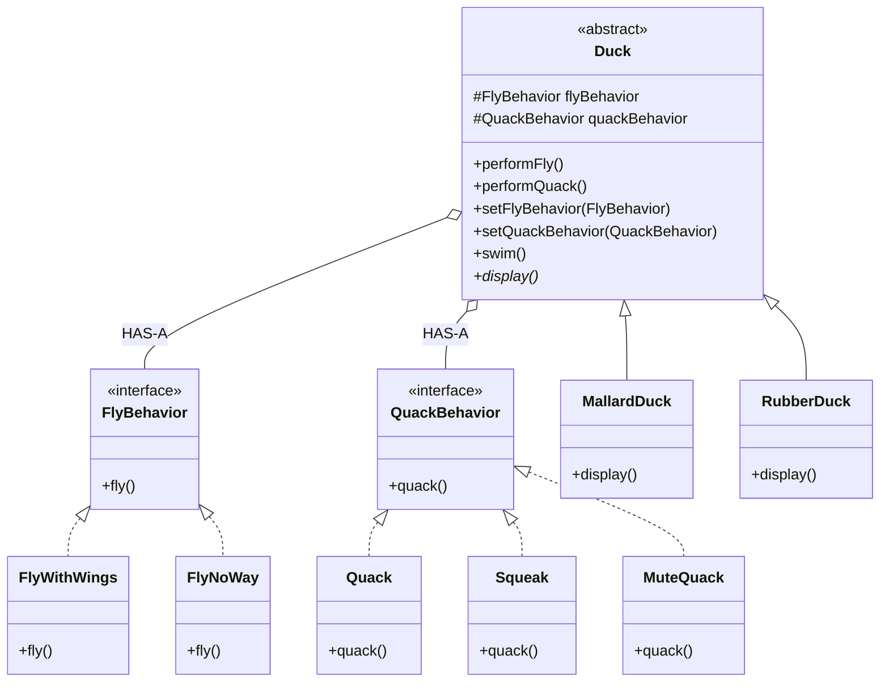

# Head First Design Patterns — kapitel 1: Strategy Pattern

## Metadata

| Felt | Værdi |
|---|---|
| **Type** | Lærebogskapitel |
| **Kursus** | Softwaredesign (SW4SWD-01) |
| **Bog** | Head First Design Patterns, 2nd edition (Freeman & Robson) |
| **Kapitel** | 1 — Intro to Design Patterns: Welcome to Design Patterns |
| **PDF-sider** | 39–74 i `SWD_Head-First-Design-Patterns-2nd-Edition.pdf` |
| **Hører til** | Uge 7 — Template Method og Strategy, se `../slides/SW4SWD-01_W07.1_GoF_Template_Method_Strategy.md` |
| **Sprog/kode** | Java (bogen) — kurset bruger C# |
| **Emner dækket** | Arv som genbrugsmekanisme og dens grænser, interfaces uden implementering, encapsulate what varies, program to an interface, favor composition over inheritance, Strategy-mønsteret, HAS-A vs. IS-A, delegation, runtime-udskiftning af adfærd, patterns som fælles vokabular |

---

## Kapitlets case

**SimUDuck** — et andespil. Den oprindelige model er en klassisk arvehierarki: en superklasse `Duck` med `quack()`, `swim()` og en abstrakt `display()`, og en række subklasser (`MallardDuck`, `RedheadDuck`, …) der arver alt.

Så beslutter ledelsen at ænderne skal kunne flyve. Joe tilføjer `fly()` i `Duck`. Resultatet er gummiænder der flyver hen over skærmen på aktionærmødet.

> HFDP s. 4 (PDF s. 42): "A localized update to the code caused a non-local side effect (flying rubber ducks)!"

Casen er selve pointen: hver gang et stykke adfærd varierer på tværs af subklasser, er arv den forkerte mekanisme til at dele den.

---

## 1. Problemet

**Forsøg 1 — arv.** `fly()` i superklassen giver flyveevne til *alle* ænder, også `RubberDuck` og `DecoyDuck`. Man kan override'e `fly()` til at gøre ingenting, men for hver ny andetype skal man huske at kigge på både `fly()` og `quack()`. Med et krav om produktopdatering hver sjette måned bliver det en vedligeholdelsesbyrde uden ende.

Ulemperne ved arv her (bogens egen liste):

- kode duplikeres på tværs af subklasser
- adfærd kan ikke ændres på runtime
- det er svært at få overblik over al andeadfærd
- ændringer rammer utilsigtet andre ænder

**Forsøg 2 — interfaces.** Tag `fly()` ud af `Duck` og lav `Flyable` og `Quackable`, som kun de relevante ænder implementerer. Det løser problemet med flyvende gummiænder, men Java-interfaces har typisk ingen implementering, så *al* kodegenbrug ryger: 48 flyvende subklasser skal hver især implementere `fly()`. Ændrer flyveadfærden sig, skal man rette 48 steder.

> HFDP s. 7 (PDF s. 45): interfacet "completely destroys code reuse for those behaviors, so it just creates a different maintenance nightmare."

Den ene konstant i softwareudvikling er **change**. Designet skal kunne tage imod ændringer med mindst mulig påvirkning af eksisterende kode.

---

## 2. Mønsteret

Bogens vej til løsningen går gennem tre designprincipper (se afsnit 5), og ender i Strategy.

**Trin 1 — separér det der varierer.** `fly()` og `quack()` varierer på tværs af ænder. De trækkes helt ud af `Duck` og ind i to *sæt* af klasser, ét per adfærd.

**Trin 2 — programmér mod et interface.** Hvert sæt får et interface: `FlyBehavior` og `QuackBehavior`. Implementeringerne er små klasser hvis eneste eksistensberettigelse er at repræsentere én adfærd:

```java
public interface FlyBehavior {
    public void fly();
}

public class FlyWithWings implements FlyBehavior {
    public void fly() { System.out.println("I'm flying!!"); }
}

public class FlyNoWay implements FlyBehavior {
    public void fly() { System.out.println("I can't fly"); }
}
```

Tilsvarende `QuackBehavior` med `Quack`, `Squeak` og `MuteQuack`.

**Trin 3 — delegér.** `Duck` holder en reference til hver adfærd og delegerer:

```java
public abstract class Duck {
    FlyBehavior flyBehavior;
    QuackBehavior quackBehavior;

    public void performFly()   { flyBehavior.fly(); }
    public void performQuack() { quackBehavior.quack(); }

    public void setFlyBehavior(FlyBehavior fb)     { flyBehavior = fb; }
    public void setQuackBehavior(QuackBehavior qb) { quackBehavior = qb; }

    public abstract void display();
    public void swim() { System.out.println("All ducks float, even decoys!"); }
}
```

En konkret and vælger sine adfærd i constructoren:

```java
public class MallardDuck extends Duck {
    public MallardDuck() {
        quackBehavior = new Quack();
        flyBehavior = new FlyWithWings();
    }
    public void display() { System.out.println("I'm a real Mallard duck"); }
}
```

Fordi felterne er af interfacetype, kan adfærden udskiftes mens programmet kører — det er setter-metoderne til for:

```java
Duck model = new ModelDuck();
model.performFly();                                // "I can't fly"
model.setFlyBehavior(new FlyRocketPowered());
model.performFly();                                // "I'm flying with a rocket!"
```

> HFDP s. 21 (PDF s. 59): "To change a duck's behavior at runtime, just call the duck's setter method for that behavior."

**Formel definition:**

> **The Strategy Pattern** defines a family of algorithms, encapsulates each one, and makes them interchangeable. Strategy lets the algorithm vary independently from clients that use it.
>
> — HFDP s. 24 (PDF s. 62)

Bemærk sprogbrugen: bogen skifter fra at kalde `FlyWithWings`/`FlyNoWay` "adfærd" til at kalde dem en **family of algorithms**. Teknikken er den samme, uanset om algoritmerne er måder at flyve på eller måder at beregne moms i forskellige delstater.

---

## 3. Struktur



| Klasse/rolle | GoF-rolle | Ansvar |
|---|---|---|
| `Duck` | Context | Holder reference til en strategi og delegerer arbejdet til den |
| `FlyBehavior`, `QuackBehavior` | Strategy | Fælles interface for en familie af algoritmer |
| `FlyWithWings`, `MuteQuack` … | ConcreteStrategy | Én konkret implementering af algoritmen |
| `MallardDuck` … | — | Konkret Context der vælger startstrategi |

De tre relationer bogen beder læseren tegne: `MallardDuck` **IS-A** `Duck`, `FlyWithWings` **IMPLEMENTS** `FlyBehavior`, `Duck` **HAS-A** `FlyBehavior`.

---

## 4. Konsekvenser og trade-offs

**Fordele**

- Adfærd kan udskiftes på runtime via setters.
- Nye algoritmer tilføjes uden at røre `Duck` eller de eksisterende adfærdsklasser (OCP).
- Adfærdsklasserne kan genbruges af klasser der *ikke* er ænder — bogens eget eksempel er en *duck call*, et jagtredskab der efterligner andelyde, og som bruger `Quack` uden at arve fra `Duck`.
- Testbarhed: hver algoritme kan testes isoleret.

**Omkostninger**

- Flere klasser og flere filer. En simpel `if`-forgrening bliver til et helt hierarki.
- Klienten (eller constructoren) skal kende de konkrete strategier for at kunne vælge en. Bogen indrømmer selv, at `new Quack()` i `MallardDuck`s constructor er programmering mod en implementering — problemet løses først senere med Factory-mønsteret.

> HFDP s. 17 (PDF s. 55): "Good catch, that's exactly what we're doing… for now. Later in the book we'll have more patterns in our toolbox that can help us fix it."

- Objektet får en indirektion mere: `performFly()` gør ikke selv noget, den videresender.

**Vokabular.** Kapitlet bruger en pointe på at mønstre først og fremmest er et *fælles sprog*. "We're using the Strategy Pattern" kommunikerer i fire ord, at adfærden er indkapslet i sit eget klassehierarki og kan udvides og skiftes på runtime. Det holder designdiskussionen på designniveau i stedet for at falde ned i implementeringsdetaljer.

---

## 5. Designprincipper introduceret i kapitlet

> **Identify the aspects of your application that vary and separate them from what stays the same.**
>
> — HFDP s. 9 (PDF s. 47)

Formuleret som handling: tag det der varierer, og *encapsulate* det, så du senere kan ændre eller udvide de dele uden at påvirke dem der ikke varierer. Bogen kalder det grundlaget for stort set alle mønstre: "All patterns provide a way to let some part of a system vary independently of all other parts."

> **Program to an interface, not an implementation.**
>
> — HFDP s. 11 (PDF s. 49)

Vigtig nuance: "interface" betyder her *supertype*, ikke nødvendigvis Java-konstruktionen `interface`. En abstrakt klasse gør det samme. Pointen er polymorfi — den deklarerede type på variablen skal være supertypen, så det konkrete objekt ikke er låst fast i koden:

```java
Animal animal = new Dog();   // program to interface
animal.makeSound();

Dog d = new Dog();           // program to implementation
d.bark();
```

Endnu bedre: undgå `new` i det hele taget og få objektet udefra (`a = getAnimal()`).

> **Favor composition over inheritance.**
>
> — HFDP s. 23 (PDF s. 61)

`Duck` **har en** `FlyBehavior` i stedet for **at være** noget der kan flyve. Composition giver to ting arv ikke kan: indkapsling af en algoritmefamilie i sit eget klassesæt, og ændring af adfærd på runtime.

Guru-dialogen i kapitlet leverer argumentet: der bruges mere tid på vedligeholdelse og ændring end på oprindelig udvikling, så genbrug via arv er en dårlig handel hvis den koster fleksibilitet.

---

## Opsummering

- Arv er stærkt til genbrug og elendigt til varierende adfærd. Rammer varierende adfærd et arvehierarki, spreder problemet sig til hver ny subklasse.
- Interfaces uden implementering løser typeproblemet, men dræber kodegenbrug.
- Strategy løser begge dele: interface for typen, konkrete klasser for genbrug, composition for fleksibiliteten.
- Definitionen skal kunne siges ordret: *defines a family of algorithms, encapsulates each one, and makes them interchangeable. Strategy lets the algorithm vary independently from clients that use it.*
- De tre principper fra kapitlet — encapsulate what varies, program to an interface, favor composition over inheritance — bærer resten af bogen.
- Til eksamen: kunne tegne diagrammet, kunne pege på Context/Strategy/ConcreteStrategy, og kunne forklare hvorfor runtime-skift af strategi er umuligt med arv.

**Se også:** `../slides/SW4SWD-01_W07.1_GoF_Template_Method_Strategy.md` (kurset gennemgår samme Duck-eksempel og sammenligner Strategy med Template Method: delegation vs. inheritance), `../slides/SW4SWD-01_W06a_Design_Patterns_Intro.md`, `../slides/SW4SWD-01_W02b_SOLID_SRP_OCP.md` (OCP), `../slides/SW4SWD-01_W03b_SOLID_ISP_DIP.md` (DIP — "program to an interface" er DIP's kerne).
