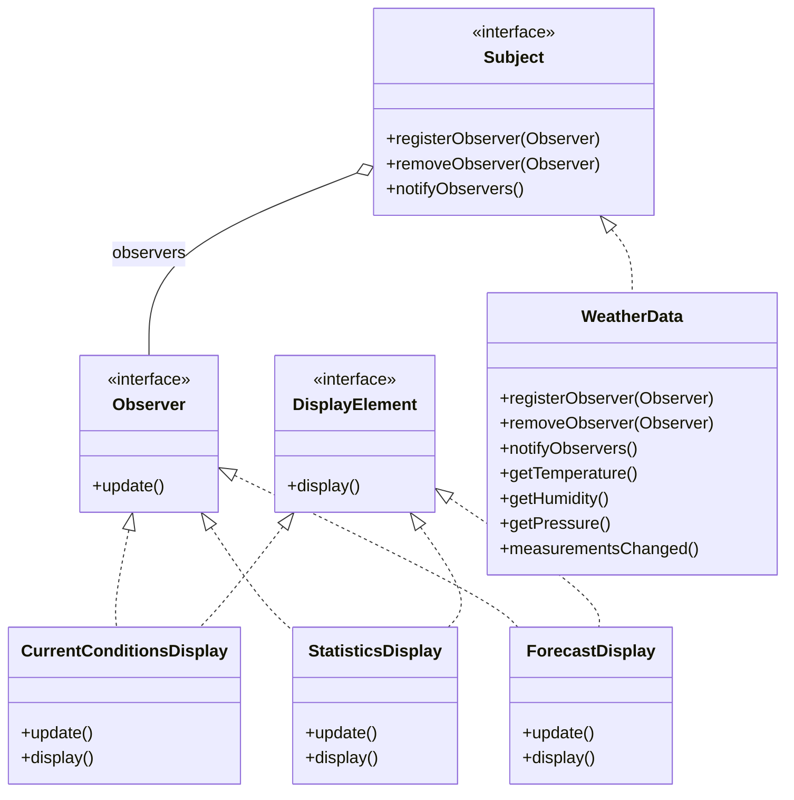

# Head First Design Patterns — kapitel 2: Observer Pattern

## Metadata

| Felt | Værdi |
|---|---|
| **Type** | Lærebogskapitel |
| **Kursus** | Softwaredesign (SW4SWD-01) |
| **Bog** | Head First Design Patterns, 2nd edition (Freeman & Robson) |
| **Kapitel** | 2 — The Observer Pattern: Keeping your Objects in the Know |
| **PDF-sider** | 75–116 i `SWD_Head-First-Design-Patterns-2nd-Edition.pdf` |
| **Hører til** | Uge 6 — GoF Observer, se `../slides/SW4SWD-01_W06b_GoF_Observer.md` |
| **Sprog/kode** | Java (bogen) — kurset bruger C# |
| **Emner dækket** | One-to-many-afhængighed, Subject og Observer, register/remove/notify, loose coupling, push vs. pull, Observer i Swing og JavaBeans, lambdaer som observers |

---

## Kapitlets case

**Weather-O-Rama** — en internetbaseret vejrstation. Firmaet leverer et `WeatherData`-objekt der taler med den fysiske vejrstation og har tre gettere: `getTemperature()`, `getHumidity()`, `getPressure()`. Hver gang der kommer nye målinger, kaldes `measurementsChanged()`.

Opgaven: bygge tre displays — *current conditions*, *statistics* og *forecast* — der opdateres hver gang målingerne ændrer sig. Og et strækmål: tredjeparter skal kunne udvikle deres egne displays og tilføje eller fjerne dem **på runtime**.

Analogien bogen bruger til at huske mønsteret: et avisabonnement. Forlaget (Subject) udgiver; abonnenterne (Observers) tegner og opsiger abonnement; alle abonnenter får den nye udgave automatisk.

---

## 1. Problemet

Den naive implementering skriver displayopdateringen direkte ind i `measurementsChanged()`:

```java
public void measurementsChanged() {
    float temp = getTemperature();
    float humidity = getHumidity();
    float pressure = getPressure();

    currentConditionsDisplay.update(temp, humidity, pressure);
    statisticsDisplay.update(temp, humidity, pressure);
    forecastDisplay.update(temp, humidity, pressure);
}
```

Hvad er galt (bogens egen analyse, HFDP s. 43 / PDF s. 81):

- Vi koder mod **konkrete implementeringer**, ikke interfaces. Hvert nyt display kræver en ændring i `WeatherData`.
- Displays kan ikke tilføjes eller fjernes på runtime — listen er hardcodet.
- Den del der varierer — *mængden af displays* — er ikke indkapslet.

Det eneste der er rigtigt: alle displays har allerede en fælles `update()`-signatur. Det er kimen til Observer-interfacet.

---

## 2. Mønsteret

**Subject** ejer tilstanden. **Observers** abonnerer på Subject'et og bliver notificeret automatisk når tilstanden ændrer sig. En observer kan melde sig til og fra når som helst; Subject'et kender kun observers gennem `Observer`-interfacet.

> **The Observer Pattern** defines a one-to-many dependency between objects so that when one object changes state, all of its dependents are notified and updated automatically.
>
> — HFDP s. 51 (PDF s. 89)

Interfaces:

```java
public interface Subject {
    public void registerObserver(Observer o);
    public void removeObserver(Observer o);
    public void notifyObservers();
}

public interface Observer {
    public void update(float temp, float humidity, float pressure);
}

public interface DisplayElement {
    public void display();
}
```

`WeatherData` bliver ConcreteSubject:

```java
public class WeatherData implements Subject {
    private List<Observer> observers = new ArrayList<Observer>();
    private float temperature, humidity, pressure;

    public void registerObserver(Observer o) { observers.add(o); }
    public void removeObserver(Observer o)   { observers.remove(o); }

    public void notifyObservers() {
        for (Observer observer : observers) {
            observer.update(temperature, humidity, pressure);
        }
    }

    public void measurementsChanged() { notifyObservers(); }
}
```

Og et display bliver ConcreteObserver — bemærk at det selv registrerer sig i sin constructor:

```java
public class CurrentConditionsDisplay implements Observer, DisplayElement {
    private float temperature, humidity;
    private WeatherData weatherData;

    public CurrentConditionsDisplay(WeatherData weatherData) {
        this.weatherData = weatherData;
        weatherData.registerObserver(this);
    }

    public void update(float temperature, float humidity, float pressure) {
        this.temperature = temperature;
        this.humidity = humidity;
        display();
    }

    public void display() {
        System.out.println("Current conditions: " + temperature
            + "F degrees and " + humidity + "% humidity");
    }
}
```

Referencen til `weatherData` gemmes, selvom den kun bruges i constructoren — det er for at kunne afmelde sig senere.

### Push vs. pull

Første version **pusher**: Subject'et sender alle tre værdier med i `update()`. Det er bekvemt, men skrøbeligt. Tilføjer Weather-O-Rama senere vindhastighed, skal `update()` ændres i *alle* observers, også dem der er ligeglade med vind.

Anden version **puller**: `update()` tager ingen argumenter, og hver observer henter selv de værdier den skal bruge via Subject'ets gettere:

```java
public void notifyObservers() {
    for (Observer observer : observers) {
        observer.update();
    }
}

// i CurrentConditionsDisplay
public void update() {
    this.temperature = weatherData.getTemperature();
    this.humidity = weatherData.getHumidity();
    display();
}
```

Bogens "fireside chat" mellem Subject og Observer er argumentationen i kortform: push betyder færre kald, men Subject'et kan umuligt forudse hvad enhver fremtidig observer har brug for. Pull skalerer bedre — udvider Subject'et sin tilstand, tilføjer man bare en getter i stedet for at rette hver observer. Bogen konkluderer at **pull generelt anses for mere "korrekt"**.

---

## 3. Struktur



| Klasse/rolle | GoF-rolle | Ansvar |
|---|---|---|
| `Subject` | Subject | Interface til at registrere, fjerne og notificere observers |
| `WeatherData` | ConcreteSubject | Ejer tilstanden, holder listen af observers, kalder `notifyObservers()` når tilstanden ændres |
| `Observer` | Observer | Fælles interface med `update()` — det eneste Subject'et kender til sine observers |
| `CurrentConditionsDisplay` m.fl. | ConcreteObserver | Registrerer sig hos Subject'et og reagerer på `update()` |
| `DisplayElement` | — | Ekstra interface specifikt for casen; adskiller "at være observer" fra "at kunne vises" |

Bemærk at de tre displays også har en reference tilbage til `WeatherData` (subject) — nødvendig i pull-varianten og til afmelding. Bogen udelader pilene i sit eget diagram for læselighedens skyld.

---

## 4. Konsekvenser og trade-offs

Kapitlets centrale gevinst er **loose coupling**. Bogen ridser fem konkrete udslag op (HFDP s. 54 / PDF s. 92):

1. Det eneste Subject'et ved om en observer er, at den implementerer `Observer`-interfacet.
2. Nye observers kan tilføjes når som helst — også på runtime.
3. Subject'et behøver **aldrig** ændres for at understøtte en ny observertype. Ny klasse, implementér interfacet, registrér.
4. Subject og observers kan genbruges uafhængigt af hinanden.
5. Ændringer i den ene påvirker ikke den anden, så længe kontrakterne overholdes.

**Omkostninger og faldgruber**

- Notifikationsrækkefølgen er ikke defineret. JDK'ets egne implementeringer advarer eksplicit mod at afhænge af en bestemt rækkefølge.
- Push kobler `update()`-signaturen til Subject'ets tilstand; pull kræver at Subject'et åbner sig med gettere. Subject'et i bogens dialog siger det selv: "I'd have to open myself up even more."
- Observers der glemmer at afmelde sig, holder Subject'et i live — lækagerisiko.
- I `CurrentConditionsDisplay` kalder `update()` direkte `display()`. Bogen indrømmer selv at det er en genvej og peger frem mod Model-View-Controller for en pænere adskillelse.

**Observer i naturen.** Swings `AbstractButton` har `addActionListener()`/`removeActionListener()` — observers hedder bare *listeners*. Samme mønster i JavaBeans (`PropertyChangeListener`), RxJava, RMI, Cocoa/Swifts Key-Value Observing og JavaScripts events. Javas gamle `Observable`-klasse og `Observer`-interface blev **deprecated i Java 9** — folk skriver hellere deres eget eller bruger noget mere robust.

Fra Java 8 kan en observer være et lambda-udtryk i stedet for en klasse:

```java
button.addActionListener(event ->
    System.out.println("Don't do it, you might regret it!"));
button.addActionListener(event ->
    System.out.println("Come on, do it!"));
```

**Observer ≠ Publish/Subscribe.** Pub/Sub er et mere komplekst mønster hvor subscribers kan udtrykke interesse i forskellige *typer* af beskeder, og hvor publisher og subscriber er yderligere adskilt af en mellemliggende infrastruktur. Typisk i middleware.

---

## 5. Designprincipper introduceret i kapitlet

> **Strive for loosely coupled designs between objects that interact.**
>
> — HFDP s. 54 (PDF s. 92)

Løst koblede designs minimerer indbyrdes afhængighed og gør systemet i stand til at tage imod ændringer.

Kapitlet genbruger desuden de tre principper fra kapitel 1, og beder eksplicit læseren om at forklare hvordan Observer bruger dem:

> **Identify the aspects of your application that vary and separate them from what stays the same.**

Det der varierer er *mængden og typen af observers*, samt Subject'ets tilstand. Det der er fast er selve notifikationsmekanismen.

> **Program to an interface, not an implementation.**

Både Subject og Observer er interfaces. Subject'et notificerer gennem `Observer`, observers henter tilstand gennem `Subject`. Ingen af siderne kender den andens konkrete klasse.

> **Favor composition over inheritance.**

Relationen mellem Subject og Observers er ikke arv, men composition: Subject'et *har en* liste af observers, sat sammen på runtime frem for kompileret ind i et hierarki.

---

## Opsummering

- Observer definerer en one-to-many-afhængighed: ét Subject, mange Observers, automatisk notifikation ved tilstandsændring.
- Kernen er tre operationer på Subject'et: `registerObserver`, `removeObserver`, `notifyObservers`.
- Subject'et kender kun observers gennem `Observer`-interfacet — det er hele kilden til den løse kobling.
- **Push** sender data med i `update()`; **pull** lader observeren hente det den skal bruge via gettere. Pull er mere robust over for udvidelser og regnes for mere korrekt.
- Observers kan meldes til og fra på runtime, og Subject'et skal aldrig ændres for at understøtte en ny observertype.
- Til eksamen: kunne definitionen ordret, kunne tegne Subject/Observer-diagrammet, kunne forklare push vs. pull med et konkret argument (vindhastighed-eksemplet), og kunne pege på GUI-event-lyttere som det virkelige eksempel.

**Se også:** `../slides/SW4SWD-01_W06b_GoF_Observer.md` (kurset dækker samme mønster i C#, med `IObserver<T>`, events og delegates, samt varianterne "flere subjects af samme type" og "subjects af forskellige typer med generics"), `../slides/SW4SWD-01_W06a_Design_Patterns_Intro.md`.
