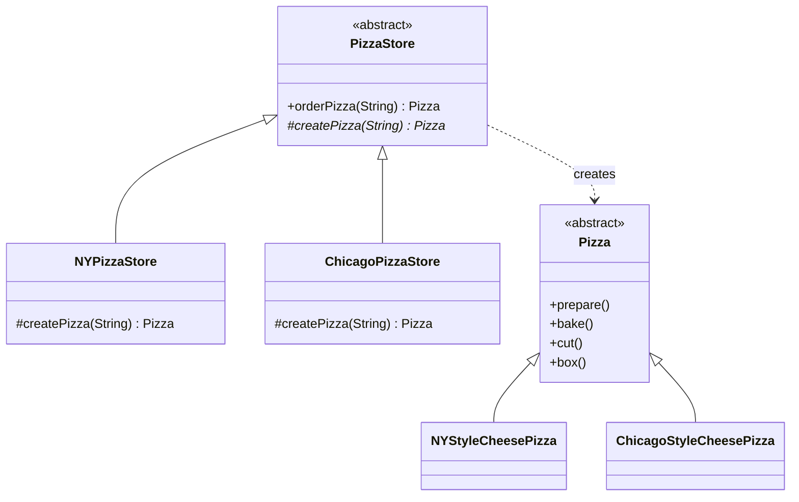
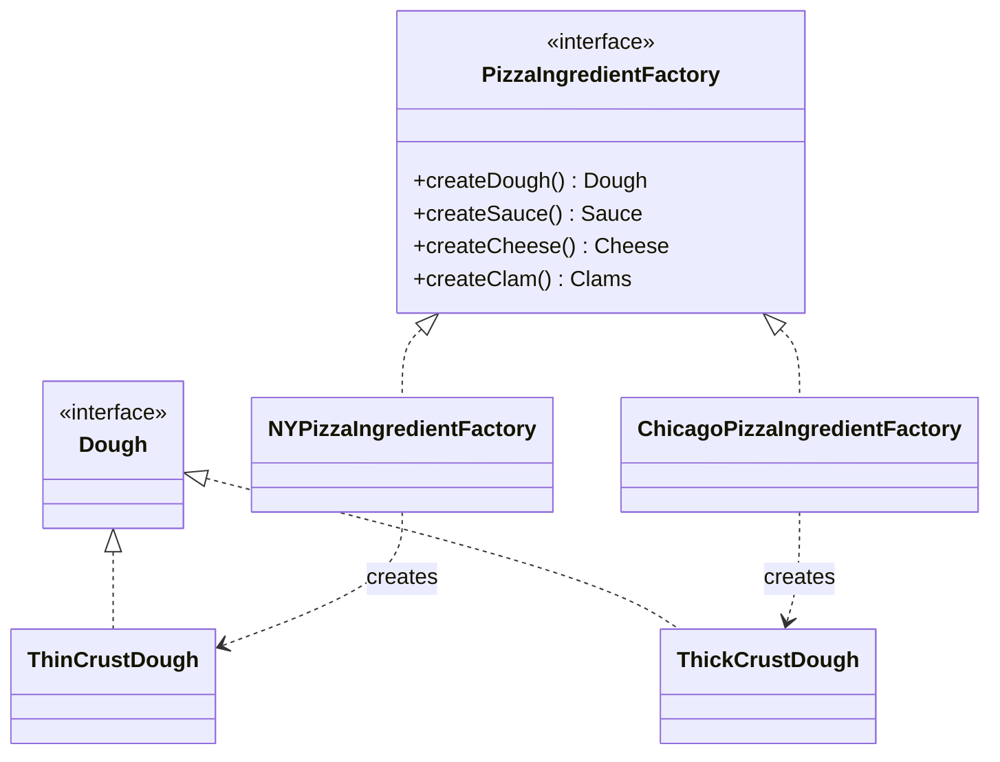

# Head First Design Patterns — kapitel 4: Factory Pattern

## Metadata

| Felt | Værdi |
|---|---|
| **Type** | Lærebogskapitel |
| **Kursus** | Softwaredesign (SW4SWD-01) |
| **Bog** | Head First Design Patterns, 2nd edition (Freeman & Robson) |
| **Kapitel** | 4 — The Factory Pattern: Baking with OO Goodness |
| **PDF-sider** | 147–206 i `SWD_Head-First-Design-Patterns-2nd-Edition.pdf` |
| **Hører til** | Uge 7 — GoF Factory og Abstract Factory, se `../slides/SW4SWD-01_W07.2_GoF_Factory_Abstract_Factory.md` |
| **Sprog/kode** | Java (bogen) — kurset bruger C# |
| **Emner dækket** | Problemet med `new`, Simple Factory (idiom), Factory Method Pattern, Abstract Factory Pattern, parallelle klassehierarkier, parameteriseret factory method, Dependency Inversion Principle, sammenligning af de tre factory-varianter |

---

## Kapitlets case

**Objectville Pizza Store.** En pizzabutik med en `orderPizza()`-metode der altid gør det samme — `prepare()`, `bake()`, `cut()`, `box()` — men som skal kunne lave stadig flere pizzatyper.

Casen udvikler sig i tre trin, og hvert trin svarer til én af kapitlets tre teknikker:

1. **Simple Factory** — `if/else`-kæden flyttes ud i en `SimplePizzaFactory`.
2. **Factory Method** — butikken bliver et framework: `NYPizzaStore`, `ChicagoPizzaStore`, hver med sin egen `createPizza()`.
3. **Abstract Factory** — franchisetagerne snyder med ingredienserne, så der indføres en `PizzaIngredientFactory` per region der leverer hele *familier* af ingredienser.

---

## 1. Problemet

Der er teknisk set ikke noget galt med `new`. Problemet er `new` kombineret med **change**:

```java
Duck duck;
if (picnic)        { duck = new MallardDuck(); }
else if (hunting)  { duck = new DecoyDuck(); }
else if (inBathTub){ duck = new RubberDuck(); }
```

> HFDP s. 110 (PDF s. 148): "When you see 'new,' think 'concrete.'"

Kode med mange konkrete klasser er **ikke closed for modification**. Hver ny konkret type kræver at man åbner koden igen. Og den slags `if`-kæder har det med at optræde flere steder i applikationen.

I pizzabutikken ser det sådan ud:

```java
Pizza orderPizza(String type) {
    Pizza pizza;
    if (type.equals("cheese"))     { pizza = new CheesePizza(); }
    else if (type.equals("greek")) { pizza = new GreekPizza(); }
    // …flere for hver ny pizza på menuen  ← dette varierer

    pizza.prepare();                       // ← dette varierer ikke
    pizza.bake(); pizza.cut(); pizza.box();
    return pizza;
}
```

Det der **varierer** er hvilke konkrete pizzaer der findes. Det der **er fast** er tilberedningssekvensen. Klassisk anvendelse af princip nr. 1 fra kapitel 1: indkapsl det der varierer.

---

## 2. Mønsteret

### 2a. Simple Factory (ikke et rigtigt mønster)

Instansieringskoden flyttes til én klasse hvis eneste opgave er at lave pizzaer:

```java
public class SimplePizzaFactory {
    public Pizza createPizza(String type) {
        Pizza pizza = null;
        if (type.equals("cheese"))         { pizza = new CheesePizza(); }
        else if (type.equals("pepperoni")) { pizza = new PepperoniPizza(); }
        // …clam, veggie
        return pizza;
    }
}
```

`PizzaStore` komponeres med fabrikken og kalder `factory.createPizza(type)` i stedet for `new`.

> HFDP s. 117 (PDF s. 155): "The Simple Factory isn't actually a Design Pattern; it's more of a programming idiom."

Gevinsten: ét sted at vedligeholde, og fabrikken kan have flere klienter (`PizzaShopMenu`, `HomeDelivery` osv.). En variant er den **static factory** — bekvem, fordi man ikke skal instansiere fabrikken, men den kan til gengæld ikke subklasses.

### 2b. Factory Method

Simple Factory løser ikke kvalitetsproblemet: franchisetagerne bruger fabrikken, men laver deres egne varianter af `bake()` og `cut()`. Løsningen er at trække fabriksmetoden **tilbage ind i** `PizzaStore` — som abstrakt metode:

```java
public abstract class PizzaStore {

    public Pizza orderPizza(String type) {
        Pizza pizza = createPizza(type);   // ← factory method
        pizza.prepare();
        pizza.bake();
        pizza.cut();
        pizza.box();
        return pizza;
    }

    protected abstract Pizza createPizza(String type);
}
```

Hver region subklasser og bestemmer selv de konkrete produkter:

```java
public class NYPizzaStore extends PizzaStore {
    Pizza createPizza(String item) {
        if (item.equals("cheese"))      { return new NYStyleCheesePizza(); }
        else if (item.equals("veggie")) { return new NYStyleVeggiePizza(); }
        // …clam, pepperoni
        else return null;
    }
}
```

`orderPizza()` er defineret i superklassen og ved intet om hvilken konkret pizza der bliver lavet — den er dekoblet.

> **The Factory Method Pattern** defines an interface for creating an object, but lets subclasses decide which class to instantiate. Factory Method lets a class defer instantiation to subclasses.
>
> — HFDP s. 134 (PDF s. 172)

Om ordet "decide": subklasserne træffer ikke en beslutning på runtime. Beslutningen ligger i *hvilken subklasse man vælger at bruge*. Fra `orderPizza()`s synspunkt afgør subklassen dog reelt hvilken pizza der laves.

Fordi `createPizza(String type)` tager en parameter, er dette en **parameterized factory method** — én factory method der kan lave flere produkter. Begge former (med og uden parameter) er gyldige. Bagsiden: en tastefejl som `"CalmPizza"` giver først en runtime-fejl; enums eller typeobjekter er mere typesikre.

### 2c. Abstract Factory

Nyt problem: franchiserne bruger billige ingredienser. Løsningen er en fabrik per region der producerer en hel **familie** af ingredienser:

```java
public interface PizzaIngredientFactory {
    public Dough createDough();
    public Sauce createSauce();
    public Cheese createCheese();
    public Veggies[] createVeggies();
    public Pepperoni createPepperoni();
    public Clams createClam();
}

public class NYPizzaIngredientFactory implements PizzaIngredientFactory {
    public Dough createDough()   { return new ThinCrustDough(); }
    public Sauce createSauce()   { return new MarinaraSauce(); }
    public Clams createClam()    { return new FreshClams(); }   // Chicago får FrozenClams
    // …
}
```

Pizzaen komponeres med en ingrediensfabrik og henter alt derfra:

```java
public class CheesePizza extends Pizza {
    PizzaIngredientFactory ingredientFactory;

    public CheesePizza(PizzaIngredientFactory f) { this.ingredientFactory = f; }

    void prepare() {
        dough  = ingredientFactory.createDough();
        sauce  = ingredientFactory.createSauce();
        cheese = ingredientFactory.createCheese();
    }
}
```

Bemærk den store gevinst: `NYStyleCheesePizza` og `ChicagoStyleCheesePizza` forsvinder. Der er nu **én** `CheesePizza` — de regionale forskelle ligger udelukkende i fabrikken. `NYPizzaStore.createPizza()` instansierer `new CheesePizza(new NYPizzaIngredientFactory())`.

> **The Abstract Factory Pattern** provides an interface for creating families of related or dependent objects without specifying their concrete classes.
>
> — HFDP s. 156 (PDF s. 194)

Og en pointe der ofte eksamineres: **metoderne i en Abstract Factory er typisk implementeret som factory methods.** De to mønstre er ikke konkurrenter — det ene bruges ofte inde i det andet.

---

## 3. Struktur

### Factory Method



| Klasse | GoF-rolle | Ansvar |
|---|---|---|
| `PizzaStore` | Creator | Definerer den abstrakte factory method og den kode (`orderPizza()`) der arbejder på produktet |
| `NYPizzaStore`, `ChicagoPizzaStore` | ConcreteCreator | Implementerer factory method'en og bestemmer den konkrete produkttype |
| `Pizza` | Product | Abstraktionen som Creator-koden er skrevet imod |
| `NYStyleCheesePizza` m.fl. | ConcreteProduct | De faktiske produkter |

De to hierarkier er **parallelle**: til hver ConcreteCreator hører typisk et helt sæt ConcreteProducts. Factory method'en er lige præcis det sted hvor viden om "hvordan man laver NY-pizzaer" er indkapslet.

### Abstract Factory



Produktfamilierne (samme roller, forskellige implementeringer):

| AbstractProduct | New York | Chicago |
|---|---|---|
| `Dough` | `ThinCrustDough` | `ThickCrustDough` |
| `Sauce` | `MarinaraSauce` | `PlumTomatoSauce` |
| `Cheese` | `ReggianoCheese` | `MozzarellaCheese` |
| `Clams` | `FreshClams` | `FrozenClams` |

| Klasse | GoF-rolle | Ansvar |
|---|---|---|
| `PizzaIngredientFactory` | AbstractFactory | Interface med én create-metode per produkt i familien |
| `NYPizzaIngredientFactory` | ConcreteFactory | Producerer hele den regionale produktfamilie |
| `Dough`, `Sauce`, `Cheese`, `Clams` | AbstractProduct | Abstraktioner klienten er skrevet imod |
| `ThinCrustDough`, `FreshClams` … | ConcreteProduct | Konkrete implementeringer |
| `NYPizzaStore`, `Pizza` | Client | Bruger fabrikken uden at kende de konkrete produkter |

---

## 4. Konsekvenser og trade-offs

**Factory Method**

- Bruger **arv**: objektskabelsen delegeres til en subklasse.
- Klienten (superklassekoden) kender kun den abstrakte produkttype.
- Nyttig selv med kun én ConcreteCreator — implementeringen af produktet er afkoblet fra brugen af det.
- Prisen: en ny subklasse per variation. Har man mange dimensioner af variation, eksploderer klasseantallet.

**Abstract Factory**

- Bruger **composition**: klienten får en fabrik ind udefra.
- Garanterer at produkter der bruges sammen, *hører* sammen (marinara + reggiano + fresh clams).
- Prisen — kapitlets ærligste indrømmelse: interfacet er stort, og **tilføjer man et nyt produkt til familien, skal interfacet og alle konkrete fabrikker ændres.**

> HFDP s. 159 (PDF s. 197), Abstract Factory: "my interface has to change if new products are added, which I know people don't like to do…" Factory Method: "Changing your interface means you have to go in and change the interface of every subclass!"

**Sammenligning (kapitlets egen tabel, HFDP s. 160–161 / PDF s. 198–199)**

| | Factory Method | Abstract Factory |
|---|---|---|
| Mekanisme | Arv (subklasse implementerer metoden) | Composition (fabriksobjekt sendes ind) |
| Skaber | Ét produkt | En familie af relaterede produkter |
| Intent | Lade en klasse udskyde instansiering til sine subklasser | Skabe familier af relaterede objekter uden at afhænge af deres konkrete klasser |
| Interfacestørrelse | Én metode | Én metode per produkt i familien |
| Brug den når | Du ikke på forhånd ved hvilke konkrete klasser du får brug for | Du har familier af produkter og vil sikre at klienten bruger produkter der hører sammen |

| | Simple Factory | Factory Method |
|---|---|---|
| Status | Idiom, ikke et GoF-mønster | GoF-mønster |
| Struktur | Fabrikken er et separat objekt komponeret ind i klienten | Fabriksmetoden er abstrakt i klienten selv, implementeret af subklasser |
| Fleksibilitet | Ét sted at ændre objektskabelsen — men produkterne kan ikke varieres | Et framework: subklasser bestemmer hvilken implementering der bruges |

---

## 5. Designprincipper introduceret i kapitlet

> **Depend upon abstractions. Do not depend upon concrete classes.**
>
> — **Dependency Inversion Principle**, HFDP s. 139 (PDF s. 177)

Princippet lyder som "program to an interface", men er stærkere: det siger at **high-level components ikke må afhænge af low-level components** — begge skal afhænge af abstraktioner.

I den afhængige `DependentPizzaStore` er `PizzaStore` high-level (dens adfærd er defineret i termer af pizzaer) og de otte konkrete pizzaklasser er low-level. Pilene peger ovenfra og ned. Efter Factory Method peger *begge* på `Pizza` — afhængighedsgrafen er **inverteret**. Det er navnets oprindelse.

Bogens tre tommelfingerregler til at overholde princippet (HFDP s. 143 / PDF s. 181):

- Ingen variabel bør holde en reference til en konkret klasse (brug en fabrik).
- Ingen klasse bør nedarve fra en konkret klasse (nedarv fra en abstraktion).
- Ingen metode bør override en implementeret metode i en baseklasse (var baseklassen egentlig en abstraktion?).

Og bogens egen forsigtighed: reglerne kan ikke overholdes 100 %. Alle Java-programmer bryder dem. `new String(...)` er fint, fordi `String` ikke kommer til at ændre sig. Bryder man reglen bevidst og med grund, er man i orden.

Kapitlet genbruger desuden:

> **Identify the aspects of your application that vary and separate them from what stays the same.**

Det der varierer er *hvilke konkrete typer der instansieres* — derfor indkapsles selve `new`.

> **Classes should be open for extension but closed for modification.** (OCP, fra kapitel 3)

`orderPizza()` behøver aldrig ændres når der kommer nye regioner eller pizzatyper til.

---

## Opsummering

- Alle factory-mønstre indkapsler objektskabelse og afkobler klientkoden fra konkrete klasser.
- **Simple Factory** er et idiom, ikke et mønster: ét objekt med al instansieringslogik. Simpelt, men produkterne kan ikke varieres.
- **Factory Method** bygger på **arv**: en abstrakt metode i Creator, implementeret af ConcreteCreators. Intent: *lade en klasse udskyde instansiering til sine subklasser*.
- **Abstract Factory** bygger på **composition**: et fabriksinterface med en metode per produkt. Intent: *skabe familier af relaterede objekter uden at specificere deres konkrete klasser*.
- Metoderne i en Abstract Factory implementeres typisk som factory methods.
- Dependency Inversion Principle: både high-level og low-level moduler skal afhænge af abstraktioner. Factory Method er en af de kraftigste teknikker til det.
- Til eksamen: kunne begge definitioner ordret, kunne tegne begge diagrammer, og — vigtigst — kunne forklare forskellen mellem de to (arv vs. composition; ét produkt vs. en produktfamilie).

**Se også:** `../slides/SW4SWD-01_W07.2_GoF_Factory_Abstract_Factory.md` (kursets gennemgang i C#), `../slides/SW4SWD-01_W03b_SOLID_ISP_DIP.md` (DIP i SOLID-sammenhæng), `../slides/SW4SWD-01_W02b_SOLID_SRP_OCP.md` (OCP), `SW4SWD-01_HFDP_Ch01_Strategy.md` (kapitel 1 lover at Factory løser `new Quack()`-problemet i `MallardDuck`s constructor).
