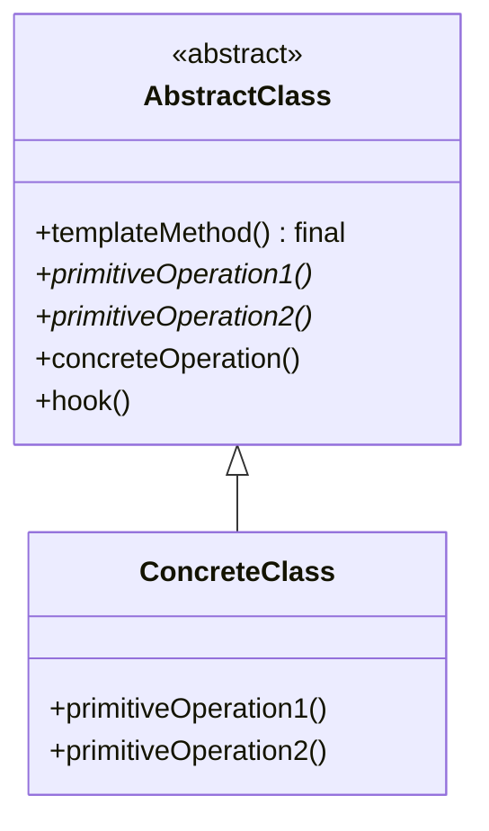
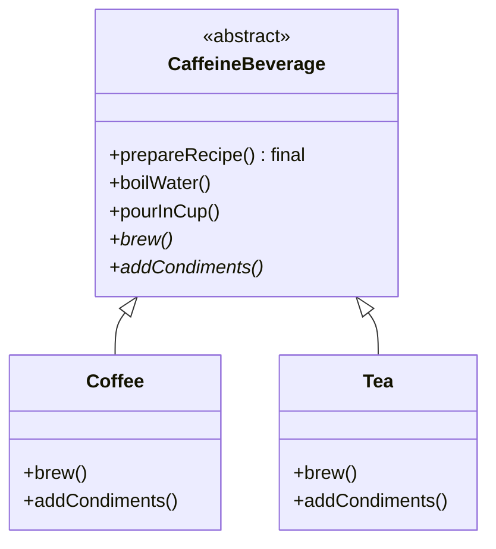

# Head First Design Patterns — kapitel 8: Template Method Pattern

## Metadata

| Felt | Værdi |
|---|---|
| **Type** | Lærebogskapitel |
| **Kursus** | Softwaredesign (SW4SWD-01) |
| **Bog** | Head First Design Patterns, 2nd edition (Freeman & Robson) |
| **Kapitel** | 8 — The Template Method Pattern: Encapsulating Algorithms |
| **PDF-sider** | 315–354 i `SWD_Head-First-Design-Patterns-2nd-Edition.pdf` |
| **Hører til** | Uge 7 — Template Method og Strategy, se `../slides/SW4SWD-01_W07.1_GoF_Template_Method_Strategy.md` |
| **Sprog/kode** | Java (bogen) — kurset bruger C# |
| **Emner dækket** | Kodeduplikering og generalisering, template method, primitive operations, hooks, `final` på template method'en, Hollywood-princippet, Template Method vs. Strategy, Template Method i Java API (`Arrays.sort()`, `JFrame.paint()`, `AbstractList.subList()`) |

---

## Kapitlets case

**Starbuzz Coffee** — kaffe og te. To opskrifter fra baristamanualen:

| Coffee | Tea |
|---|---|
| 1. Boil some water | 1. Boil some water |
| 2. Brew coffee in boiling water | 2. Steep tea in boiling water |
| 3. Pour coffee in cup | 3. Pour tea in cup |
| 4. Add sugar and milk | 4. Add lemon |

Opskrifterne er *strukturelt identiske*. Kun trin 2 og 4 adskiller sig — og selv de er analoge: brygge/trække er begge "brew", sukker+mælk/citron er begge "condiments".

---

## 1. Problemet

Naiv implementering: en `Coffee`-klasse og en `Tea`-klasse, hver med sin egen `prepareRecipe()` og sine fire trin.

```java
public class Coffee {
    void prepareRecipe() {
        boilWater();
        brewCoffeeGrinds();
        pourInCup();
        addSugarAndMilk();
    }
    public void boilWater() { System.out.println("Boiling water"); }
    public void pourInCup() { System.out.println("Pouring into cup"); }
    // …
}
```

`Tea` er en næsten ordret kopi. `boilWater()` og `pourInCup()` er **identiske** i begge klasser.

Første refaktorering — træk `boilWater()` og `pourInCup()` op i en abstrakt `CaffeineBeverage`, lad `prepareRecipe()` være abstrakt — er ikke nok. Den overser den vigtigste fælleshed: **selve algoritmens struktur** er den samme.

> HFDP s. 282 (PDF s. 320): "Did we do a good job on the redesign? Hmmmm, take another look. Are we overlooking some other commonality?"

---

## 2. Mønsteret

Generalisér de varierende trin til fælles navne — `brew()` og `addCondiments()` — og flyt hele `prepareRecipe()` op i superklassen:

```java
public abstract class CaffeineBeverage {

    final void prepareRecipe() {      // ← template method
        boilWater();
        brew();
        pourInCup();
        addCondiments();
    }

    abstract void brew();             // ← primitive operations
    abstract void addCondiments();

    void boilWater() { System.out.println("Boiling water"); }
    void pourInCup() { System.out.println("Pouring into cup"); }
}
```

Subklasserne leverer kun de trin der varierer:

```java
public class Tea extends CaffeineBeverage {
    public void brew()          { System.out.println("Steeping the tea"); }
    public void addCondiments() { System.out.println("Adding Lemon"); }
}

public class Coffee extends CaffeineBeverage {
    public void brew()          { System.out.println("Dripping Coffee through filter"); }
    public void addCondiments() { System.out.println("Adding Sugar and Milk"); }
}
```

`prepareRecipe()` er **`final`**. Det er ikke pynt: subklasser må ikke kunne omordne eller udskifte trinnene. Superklassen ejer algoritmen.

> **The Template Method Pattern** defines the skeleton of an algorithm in a method, deferring some steps to subclasses. Template Method lets subclasses redefine certain steps of an algorithm without changing the algorithm's structure.
>
> — HFDP s. 291 (PDF s. 329)

### Hooks

En **hook** er en konkret metode i den abstrakte klasse med en tom eller default-implementering. Subklasser *kan* override den, men behøver ikke.

```java
public abstract class CaffeineBeverageWithHook {

    final void prepareRecipe() {
        boilWater();
        brew();
        pourInCup();
        if (customerWantsCondiments()) {   // ← hook styrer flowet
            addCondiments();
        }
    }

    boolean customerWantsCondiments() { return true; }   // default: ja
    // …
}
```

```java
public class CoffeeWithHook extends CaffeineBeverageWithHook {
    public boolean customerWantsCondiments() {
        String answer = getUserInput();
        return answer.toLowerCase().startsWith("y");
    }
}
```

**Abstract method eller hook?** Bogens regel (HFDP s. 297 / PDF s. 335):

> Use abstract methods when your subclass MUST provide an implementation of the method or step in the algorithm. Use hooks when that part of the algorithm is optional.

Tre anvendelser af hooks:

1. Et valgfrit trin i algoritmen.
2. En mulighed for subklassen at **reagere** på at noget er sket eller er ved at ske (`justReorderedList()`).
3. En mulighed for subklassen at **træffe en beslutning** for den abstrakte klasse — som `customerWantsCondiments()`.

**Granularitetsafvejning:** mange abstrakte metoder giver stor byrde for subklasserne; få giver mindre fleksibilitet. Hooks letter byrden.

---

## 3. Struktur



Anvendt på casen:



| Metodetype | Eksempel | Egenskab |
|---|---|---|
| **Template method** | `prepareRecipe()` | Definerer trinnenes rækkefølge. Bør være `final` |
| **Primitive operation** | `brew()`, `addCondiments()` | Abstrakt — subklassen **skal** implementere |
| **Concrete operation** | `boilWater()`, `pourInCup()` | Fælles implementering i superklassen; kan gøres `final` |
| **Hook** | `customerWantsCondiments()` | Konkret, men tom/default — subklassen **kan** override |

---

## 4. Konsekvenser og trade-offs

Bogens egen før/efter-tabel (HFDP s. 290 / PDF s. 328):

| Uden Template Method | Med Template Method |
|---|---|
| `Coffee` og `Tea` styrer algoritmen | `CaffeineBeverage` styrer og beskytter algoritmen |
| Kode duplikeres på tværs af subklasser | Maksimal genbrug mellem subklasser |
| Ændring i algoritmen kræver ændringer flere steder | Algoritmen lever ét sted |
| Meget arbejde at tilføje en ny drik | Framework: en ny drik implementerer to metoder |
| Viden om algoritmen spredt over mange klasser | Viden samlet i superklassen |

**Prisen:** mønsteret bygger på **arv**, ikke composition. Det betyder:

- Algoritmen kan ikke skiftes på runtime — den er bundet til objektets klasse.
- Superklassen afhænger af metoder implementeret i subklasserne (det er hele pointen, men det er stadig en afhængighed nedad).
- Subklasser kan ikke arve fra andet.

### Template Method vs. Strategy

De to mønstre løser samme problem — variabel algoritme — med hver sin mekanisme. Bogens "fireside chat" er selve svaret på et klassisk eksamensspørgsmål:

| | Template Method | Strategy |
|---|---|---|
| Mekanisme | **Arv** | **Composition/delegation** |
| Hvad varierer | Enkelte *trin* i algoritmen | Hele algoritmen |
| Kontrol | Superklassen ejer strukturen | Klienten vælger strategien |
| Runtime-skift | Nej | Ja |
| Kodeduplikering | Mindre — fælles trin ligger ét sted i superklassen | Hver strategi implementerer hele algoritmen |
| Afhængighed | Superklassen afhænger af subklassernes metoder | Strategien er selvstændig |
| Effektivitet | Færre objekter, mindre indirektion | Flere objekter, men mere fleksibel |

Template Method's egen replik: "I provide a fundamental method for code reuse that allows subclasses to specify behavior… perfect for creating frameworks." Bogen kalder det **det mest anvendte mønster overhovedet**.

### Template Method i Java API

- **`Arrays.sort()`** — `mergeSort()` er template method'en; `compareTo()` er den manglende primitive operation, leveret af `Comparable`. Ikke lærebogsformen: metoden er `static` og bruger ikke arv, fordi man ikke kan subklasse et Java-array. Bogen kalder det "in the spirit of" mønsteret. Bemærk hvorfor det *ikke* er Strategy: i Strategy implementerer den komponerede klasse **hele** algoritmen; her er algoritmen ufuldstændig uden `compareTo()`.
- **`JFrame.paint()`** — en hook. Default gør ingenting; man hooker sig ind i JFrame's opdateringsalgoritme ved at override den.
- **`AbstractList.subList()`** — template method der bygger på de abstrakte `get()` og `size()`.

**Factory Method er en specialisering af Template Method** — en template method hvis primitive operation skaber og returnerer et objekt.

---

## 5. Designprincipper introduceret i kapitlet

> **The Hollywood Principle: Don't call us, we'll call you.**
>
> — HFDP s. 298 (PDF s. 336)

Princippet forhindrer **dependency rot** — den tilstand hvor high-level komponenter afhænger af low-level komponenter der afhænger af high-level komponenter, indtil ingen kan gennemskue designet.

Løsningen: low-level komponenter må gerne *hooke sig ind* i systemet, men high-level komponenten bestemmer **hvornår** og **hvordan** de bliver kaldt. `Tea` og `Coffee` kalder aldrig `CaffeineBeverage` — de bliver kaldt.

**Hollywood vs. Dependency Inversion** (HFDP s. 300 / PDF s. 338): DIP er den generelle og stærkere udmelding — undgå afhængigheder af konkrete typer, arbejd med abstraktioner. Hollywood-princippet er en konkret *teknik* til at bygge frameworks, så low-level komponenter kan deltage uden at skabe afhængigheder opad. Begge sigter mod afkobling.

Bemærk nuancen: en low-level komponent *må* godt kalde en metode længere oppe i arvehierarkiet — det sker konstant via arv. Det man undgår, er eksplicitte cirkulære afhængigheder.

Andre mønstre der bruger Hollywood-princippet: **Factory Method** og **Observer**.

---

## Opsummering

- Template Method definerer algoritmens **skelet** i en metode og udskyder enkelte trin til subklasser.
- Template method'en bør være `final`, så subklasser ikke kan ændre algoritmens struktur.
- Fire metodetyper i den abstrakte klasse: template method, abstrakte primitive operations (skal implementeres), concrete operations (fælles), og hooks (valgfri override).
- Hooks bruges til valgfrie trin, til at reagere på hændelser, og til at lade subklassen træffe en beslutning for superklassen.
- **Hollywood-princippet**: "Don't call us, we'll call you." High-level komponenter styrer hvornår low-level komponenter kaldes.
- Template Method = arv, varierende *trin*. Strategy = composition, varierende *hele algoritme*, kan skiftes på runtime. Kunne forskellen — den eksamineres.
- Factory Method er en specialisering af Template Method.
- Mønsteret er allestedsnærværende i frameworks; i Java API'et fx `Arrays.sort()`, `JFrame.paint()` og `AbstractList.subList()`.

**Se også:** `../slides/SW4SWD-01_W07.1_GoF_Template_Method_Strategy.md` (kurset gennemgår begge mønstre i samme lektion, med hooked methods, frameworks/Hollywood og lab-øvelsen "SuperSorter"), `SW4SWD-01_HFDP_Ch01_Strategy.md`, `SW4SWD-01_HFDP_Ch04_Factory.md`.
