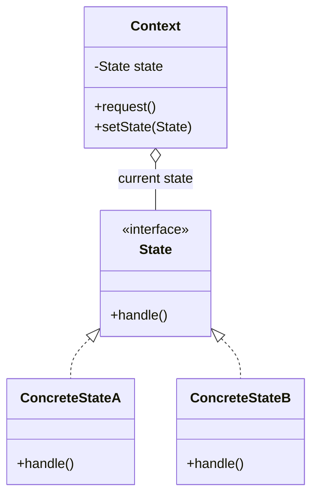
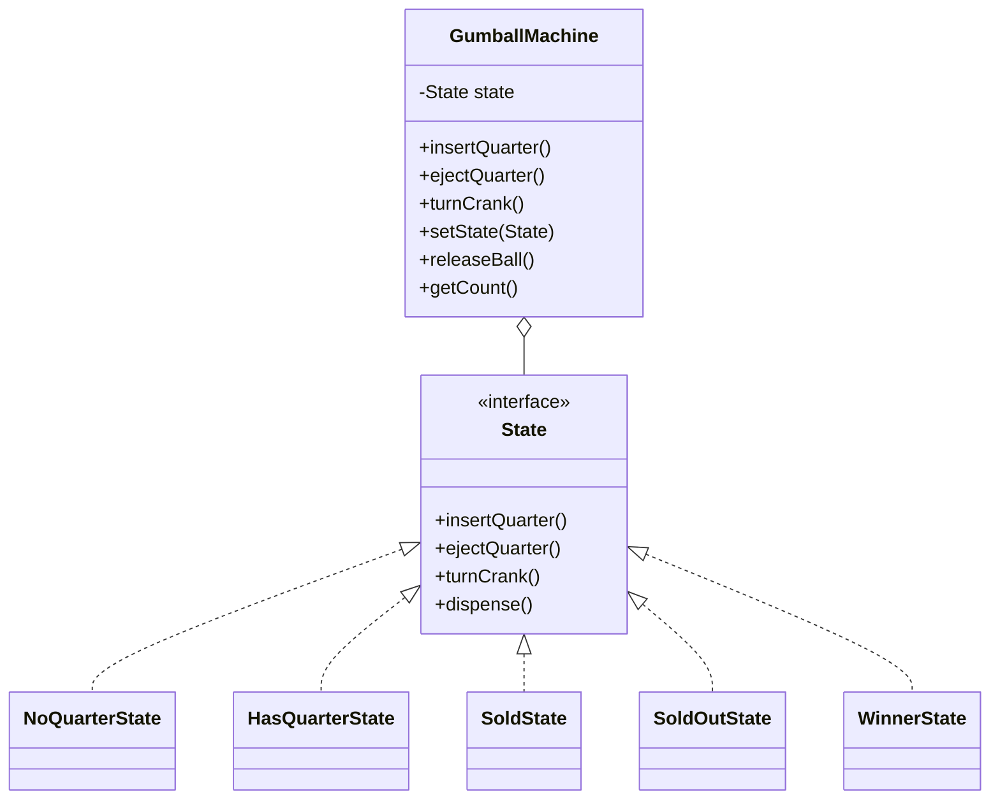

# Head First Design Patterns — kapitel 10: State Pattern

## Metadata

| Felt | Værdi |
|---|---|
| **Type** | Lærebogskapitel |
| **Kursus** | Softwaredesign (SW4SWD-01) |
| **Bog** | Head First Design Patterns, 2nd edition (Freeman & Robson) |
| **Kapitel** | 10 — The State Pattern: The State of Things |
| **PDF-sider** | 419–462 i `SWD_Head-First-Design-Patterns-2nd-Edition.pdf` |
| **Hører til** | Uge 8 — GoF State, se `../slides/SW4SWD-01_W08a_GoF_State.md` |
| **Sprog/kode** | Java (bogen) — kurset bruger C# |
| **Emner dækket** | Tilstandsdiagrammer, naiv state machine med int-konstanter og `if`-kæder, State Pattern, Context og ConcreteStates, hvem der styrer transitionerne, deling af state-objekter, State vs. Strategy |

---

## Kapitlets case

**Mighty Gumball** — en tyggegummiautomat med CPU. Fire tilstande og fire handlinger.

Tilstande: `No Quarter`, `Has Quarter`, `Gumball Sold`, `Out of Gumballs` (kaldet `Sold Out`).
Handlinger: `insert quarter`, `eject quarter`, `turn crank`, `dispense`.

`dispense` er en intern handling — maskinen kalder den på sig selv; brugeren kan ikke bede om den.

Undervejs kommer den uundgåelige ændringsanmodning: **1-ud-af-10-spillet**. 10 % af gangene skal et krankdrej give to gumballs i stedet for én. Det er den ændring der afslører hvor skrøbelig den første implementering var.

---

## 1. Problemet

Den klassiske "state machine 101"-opskrift:

1. Saml tilstandene.
2. Lav en instansvariabel til den aktuelle tilstand, og en konstant per tilstand.
3. Saml handlingerne.
4. Lav en metode per handling, med en `if`-kæde over alle tilstande.

```java
public class GumballMachine {
    final static int SOLD_OUT    = 0;
    final static int NO_QUARTER  = 1;
    final static int HAS_QUARTER = 2;
    final static int SOLD        = 3;

    int state = SOLD_OUT;
    int count = 0;

    public void insertQuarter() {
        if (state == HAS_QUARTER) {
            System.out.println("You can't insert another quarter");
        } else if (state == NO_QUARTER) {
            state = HAS_QUARTER;
            System.out.println("You inserted a quarter");
        } else if (state == SOLD_OUT) {
            System.out.println("You can't insert a quarter, the machine is sold out");
        } else if (state == SOLD) {
            System.out.println("Please wait, we're already giving you a gumball");
        }
    }
    // ejectQuarter(), turnCrank(), dispense() — samme mønster
}
```

Det virker. Og så kommer ændringsanmodningen. En ny `WINNER`-tilstand betyder:

- én ny konstant (harmløst), og
- **en ny gren i hver eneste metode** (ikke harmløst). `turnCrank()` bliver særligt rodet, fordi den nu skal trække lod og vælge mellem `WINNER` og `SOLD`.

Bogens egen diagnose (HFDP s. 392 / PDF s. 430):

- Koden overholder ikke **Open Closed Principle**.
- Designet er dårligt nok næppe objektorienteret.
- **Transitionerne er ikke eksplicitte** — de ligger begravet midt i betingede sætninger.
- Det der varierer, er ikke indkapslet.
- Nye tilføjelser vil sandsynligvis introducere fejl i kode der virkede.

---

## 2. Mønsteret

Planen (HFDP s. 394 / PDF s. 432):

1. Definér et `State`-interface med en metode per handling.
2. Implementér en `State`-klasse per tilstand, ansvarlig for maskinens adfærd i netop den tilstand.
3. Fjern al betinget kode fra `GumballMachine` og **delegér** til det aktuelle state-objekt.

```java
public interface State {
    void insertQuarter();
    void ejectQuarter();
    void turnCrank();
    void dispense();
}
```

Hver konkret tilstand får en reference til `GumballMachine`, så den kan udføre transitionen:

```java
public class NoQuarterState implements State {
    GumballMachine gumballMachine;

    public NoQuarterState(GumballMachine gumballMachine) {
        this.gumballMachine = gumballMachine;
    }

    public void insertQuarter() {
        System.out.println("You inserted a quarter");
        gumballMachine.setState(gumballMachine.getHasQuarterState());   // ← transition
    }

    public void ejectQuarter() { System.out.println("You haven't inserted a quarter"); }
    public void turnCrank()    { System.out.println("You turned, but there's no quarter"); }
    public void dispense()     { System.out.println("You need to pay first"); }
}
```

`SoldState` er der hvor det egentlige arbejde sker — og hvor transitionen afhænger af runtime-data:

```java
public void dispense() {
    gumballMachine.releaseBall();
    if (gumballMachine.getCount() > 0) {
        gumballMachine.setState(gumballMachine.getNoQuarterState());
    } else {
        System.out.println("Oops, out of gumballs!");
        gumballMachine.setState(gumballMachine.getSoldOutState());
    }
}
```

`GumballMachine` bliver Context. Al betinget logik er væk:

```java
public class GumballMachine {
    State soldOutState, noQuarterState, hasQuarterState, soldState;
    State state;
    int count = 0;

    public GumballMachine(int numberGumballs) {
        soldOutState    = new SoldOutState(this);
        noQuarterState  = new NoQuarterState(this);
        hasQuarterState = new HasQuarterState(this);
        soldState       = new SoldState(this);

        this.count = numberGumballs;
        state = (numberGumballs > 0) ? noQuarterState : soldOutState;
    }

    public void insertQuarter() { state.insertQuarter(); }
    public void ejectQuarter()  { state.ejectQuarter(); }
    public void turnCrank()     { state.turnCrank(); state.dispense(); }

    void setState(State state) { this.state = state; }
    void releaseBall() { /* … count-- … */ }
    // gettere for hver tilstand
}
```

Bemærk at `GumballMachine` ikke har en offentlig `dispense()` — den er intern og kaldes fra `turnCrank()`.

> **The State Pattern** allows an object to alter its behavior when its internal state changes. The object will appear to change its class.
>
> — HFDP s. 406 (PDF s. 444)

Anden halvdel af definitionen skal forstås fra klientens synsvinkel: når et objekt fuldstændigt skifter adfærd, *ser det ud som om* det er instantieret fra en anden klasse. I virkeligheden er det composition — Context peger bare på et andet state-objekt.

### Ændringsanmodningen med det nye design

Tilføj `WinnerState` (næsten identisk med `SoldState`, men frigiver to gumballs), og læg lodtrækningen i `HasQuarterState.turnCrank()`:

```java
public void turnCrank() {
    System.out.println("You turned...");
    int winner = randomWinner.nextInt(10);
    if ((winner == 0) && (gumballMachine.getCount() > 1)) {
        gumballMachine.setState(gumballMachine.getWinnerState());
    } else {
        gumballMachine.setState(gumballMachine.getSoldState());
    }
}
```

**Ingen eksisterende tilstandsklasse blev rørt.** Det er OCP i praksis.

Hvorfor ikke bare lade `SoldState` udlevere to gumballs? Fordi den så repræsenterer to tilstande på én gang — det bryder **Single Responsibility Principle**. Bogen kalder det eksplicit et trade-off: mindre kodeduplikering mod dårligere klarhed og flere ansvar.

---

## 3. Struktur



Anvendt på casen:



| Klasse | GoF-rolle | Ansvar |
|---|---|---|
| `GumballMachine` | Context | Holder den aktuelle tilstand, delegerer alle handlinger til den, tilbyder `setState()` og hjælpemetoder (`releaseBall()`, `getCount()`) |
| `State` | State | Fælles interface med én metode per handling — gør tilstandene udskiftelige |
| `NoQuarterState`, `HasQuarterState`, `SoldState`, `SoldOutState`, `WinnerState` | ConcreteState | Implementerer adfærden i netop den tilstand og udfører transitionen til næste tilstand |

Tilstandsdiagrammet (transitionerne):

| Fra | Handling | Til |
|---|---|---|
| `NoQuarter` | insert quarter | `HasQuarter` |
| `HasQuarter` | eject quarter | `NoQuarter` |
| `HasQuarter` | turn crank | `Sold` (eller `Winner`, 10 %) |
| `Sold` | dispense, gumballs > 0 | `NoQuarter` |
| `Sold` | dispense, gumballs = 0 | `SoldOut` |
| `SoldOut` | refill | `NoQuarter` |

---

## 4. Konsekvenser og trade-offs

**Gevinster** (HFDP s. 403 / PDF s. 441):

- Adfærden for hver tilstand er lokaliseret i sin egen klasse.
- Alle de besværlige `if`-sætninger er væk.
- Hver tilstandsklasse er **lukket for ændring**, mens `GumballMachine` er **åben for udvidelse** — nye tilstande er nye klasser.
- Kodestrukturen afspejler tilstandsdiagrammet direkte og er dermed langt lettere at læse.

**Omkostninger**

- **Flere klasser.** Bogen er direkte: "That's often the price you pay for flexibility." Alternativet er én stor monolitisk klasse med kæmpe betingede blokke. Ekstra klasser kan skjules for klienten (fx package private).
- **Afhængigheder mellem tilstandsklasser.** Når tilstandene selv bestemmer næste tilstand, kender de hinanden. Bogen mindsker det ved at gå gennem getters på Context frem for at hardcode konkrete klasser.

**Hvem bestemmer transitionerne?** Kapitlets vigtigste designbeslutning (HFDP s. 408 / PDF s. 446):

> Er transitionerne **faste**, hører de hjemme i **Context**. Er de **dynamiske** (som `Sold` → `NoQuarter` eller `SoldOut` afhængigt af antal gumballs på runtime), hører de typisk hjemme i **tilstandsklasserne**.

Valget afgør *hvilke* klasser der er lukket for ændring når systemet udvikler sig.

**Andre pointer**

- Klienter interagerer **aldrig** direkte med tilstandsobjekterne. Alle kald går gennem Context. Context skal have styr på sin egen tilstand.
- Tilstandsobjekter **kan deles** mellem mange Context-instanser (typisk som `static`), forudsat at de ikke gemmer kontekstspecifik data. Skal de bruge Context'ens data, sendes den ind i hver handler-metode.
- GoF's diagram viser `State` som en **abstrakt klasse**; bogen bruger et interface fordi der ikke var fælles funktionalitet. En abstrakt klasse har den fordel at man kan tilføje metoder senere uden at bryde de konkrete tilstande — og at fælles "fejlbeskeder" kan arves.

### State vs. Strategy

Klassediagrammerne er **identiske**. Forskellen er intent:

| | State | Strategy |
|---|---|---|
| Intent | Lade et objekt ændre adfærd når dets interne tilstand ændres | Definere en familie af udskiftelige algoritmer |
| Hvem vælger | Objektet selv — tilstanden ændrer sig over tid via veldefinerede transitioner | Klienten vælger typisk strategien |
| Klientens viden | Klienten ved normalt intet om tilstandsobjekterne | Klienten kender og udpeger strategien |
| Skift over tid | Indbygget — det er hele pointen | Muligt, men ofte er én strategi den rigtige hele objektets levetid |
| Alternativ til | Store mængder betinget kode i Context | Subklassering til at definere adfærd |

Bogens sammenfatning: tænk på **Strategy** som et fleksibelt alternativ til arv, og på **State** som et alternativ til mange `if`-sætninger i din Context.

---

## 5. Designprincipper introduceret i kapitlet

Kapitlet introducerer **ingen nye** principper — det anvender dem der allerede er kendt:

> **Encapsulate what varies.**

Det der varierer er adfærden per tilstand. Hver tilstand får sin egen klasse.

> **Favor composition over inheritance.**

`GumballMachine` *har en* `State` og delegerer. Den arver ikke sin adfærd.

> **Classes should be open for extension but closed for modification.**

`WinnerState` blev tilføjet uden at røre en eneste eksisterende tilstandsklasse.

> **A class should have only one reason to change.** (SRP, fra kapitel 9)

Argumentet for at `WinnerState` er en selvstændig klasse frem for en gren i `SoldState`.

---

## Opsummering

- State Pattern indkapsler tilstandsafhængig adfærd i separate klasser og delegerer fra Context til den aktuelle tilstand.
- Definitionen ordret: *allows an object to alter its behavior when its internal state changes. The object will appear to change its class.*
- Alternativet — int-konstanter og `if`-kæder — virker, men bryder OCP: hver ny tilstand kræver ændringer i hver eneste metode, og transitionerne er usynlige.
- Roller: **Context** (`GumballMachine`), **State** (interface eller abstrakt klasse), **ConcreteState** (én per tilstand).
- Transitioner i tilstandsklasserne, når de er dynamiske; i Context, når de er faste.
- Klienten rører aldrig tilstandsobjekterne direkte.
- Prisen er flere klasser; gevinsten er lokaliseret, læsbar, udvidelig adfærd.
- **State og Strategy har samme klassediagram, men forskellig intent.** Det er kapitlets vigtigste eksamenspointe: State handler om intern tilstand der ændrer sig over tid; Strategy handler om udskiftelige algoritmer valgt af klienten.

**Se også:** `../slides/SW4SWD-01_W08a_GoF_State.md` (kursets gennemgang i C#), `../slides/SW4SWD-01_W08b_State_Nested_Orthogonal.md` (nested og orthogonal states — statecharts ud over det simple tilstandsdiagram), `SW4SWD-01_HFDP_Ch01_Strategy.md` (tvillingemønsteret).
