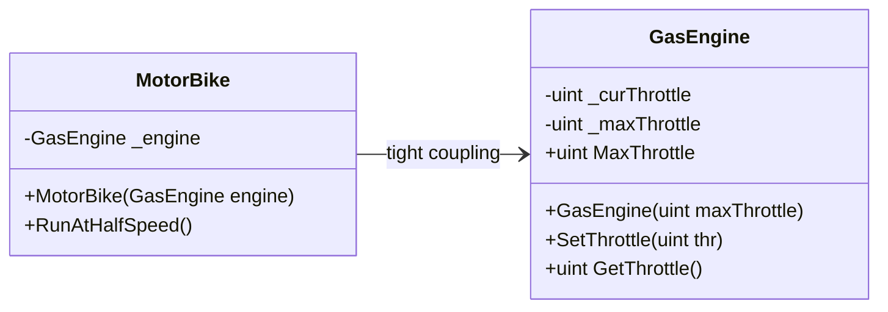
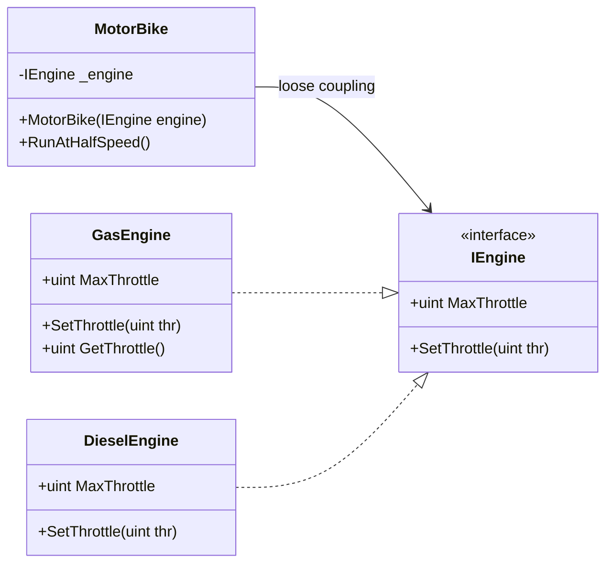

# C# Interfaces — øvelsessæt 1 og 2

| Felt | Værdi |
|---|---|
| **Type** | Øvelsessæt / selvstudie |
| **Kursus** | Softwaredesign (SW4SWD-01) |
| **Hører til** | Uge 00 — opstart / forudsætninger |
| **Kilde** | Brightspace: "C# Interfaces 1 - The very, very basics of interfaces" og "C# Interfaces 2 - A little more advanced" |
| **Sprog** | C# (.NET, Visual Studio 2022) |
| **Emner dækket** | `interface`-nøgleordet, implementering af interfaces, interface-referencer vs. konkrete typer, polymorfi via interface, coding to interfaces frem for implementations, loose coupling, dependency injection via constructor, forberedelse til unit testing |

---

## Indledning

De to øvelser er selvstudiemateriale fra kursets opstart og forudsætter ingenting ud over grundlæggende C#. De skal køres i rækkefølge, og pointen bliver først tydelig i øvelse 2.

**Øvelse 1** er ren mekanik. Man definerer et `interface`, implementerer det i to forskellige klasser og kalder metoderne gennem en interface-reference i stedet for gennem den konkrete type. Øvelsen har med forfatterens egne ord "absolutely no practical use" — den findes udelukkende for at gøre `interface`-syntaksen i C# til rutine.

**Øvelse 2** leverer pointen. Her får man udleveret to klasser, hvor `MotorBike` kender sin motors konkrete type `GasEngine`. Det er **tight coupling**: vil man montere en anden motortype, skal `MotorBike` laves om. Opgaven er at udtrække et `IEngine`-interface, lade `GasEngine` implementere det og refaktorere `MotorBike`, så den kun afhænger af interfacet. Derefter kan man tilføje en `DieselEngine` uden at røre `MotorBike` med én linje.

Det er princippet **coding to interfaces, not implementations** — abstraktionen definerer kontrakten, og de konkrete klasser er udskiftelige bag den. Det samme princip gør unit testing let: kan `MotorBike` tage en vilkårlig `IEngine`, kan den også tage en fake eller mock engine i en test. Øvelsen peger direkte frem mod Dependency Inversion Principle i SOLID (se [`../slides/SW4SWD-01_W03b_SOLID_ISP_DIP.md`](../slides/SW4SWD-01_W03b_SOLID_ISP_DIP.md)) og mod de design patterns, der bygger på samme mekanisme — Strategy og State i særdeleshed.

Bruger du VS Code i stedet for Visual Studio 2022, se [`SW4SWD-01_CSharp_in_VSCode.md`](SW4SWD-01_CSharp_in_VSCode.md) for opsætning af solution og projekter fra kommandolinjen med `dotnet`-CLI'en.

---

## Øvelse 1: De helt basale interfaces

> In this exercise, you will create and use a few simple C# interfaces and play around with these. They have absolutely no practical use and only exist to make you comfortable with interfaces in C#.

### Delopgave 1 — opret interfacet

Opret en ny Visual Studio 2022-solution kaldet **Interfaces-1**. Tilføj et nyt C# class library-projekt kaldet **DoStuff** til solutionen.

Tilføj et interface med navnet `IDoThings` til `DoStuff`. Interfacet skal indeholde følgende metodedefinitioner:

```csharp
void DoNothing()
int DoSomething(int number)
string DoSomethingElse(string input)
```

Altså:

```csharp
namespace DoStuff;

public interface IDoThings
{
    void DoNothing();
    int DoSomething(int number);
    string DoSomethingElse(string input);
}
```

### Delopgave 2 — implementér interfacet

Tilføj en klasse kaldet `DoHickey` til solutionen. `DoHickey` skal implementere `IDoThings`. Hver metode skal skrive klassenavnet, metodenavnet og argumentet (hvis der er et) til konsollen, fx:

```
DoHickey::DoSomething(): 2
```

### Delopgave 3 — brug interface-referencen

Tilføj et C# console application-projekt kaldet **DoStuff.Application** til solutionen. Dette bliver dit applikationsprojekt, som skal bruge det `DoStuff` class library, du oprettede ovenfor. Tilføj en reference til `DoStuff` i `DoStuff.Application`-projektet.

I `Main()`-metoden i det nye projekt (`Program.cs` kan være tom afhængigt af dine IDE-indstillinger) skal du instantiere en `IDoThings`-reference, der peger på et objekt af klassen `DoHickey`:

```csharp
IDoThings myIDoThings = new DoHickey();
```

Kald `DoHickey`-objektets metoder gennem denne interface-reference.

> **Pointen:** variablen har den *statiske* type `IDoThings`, men den *dynamiske* type `DoHickey`. Koden, der kalder metoderne, kender kun kontrakten — ikke implementeringen.

### Delopgave 4 — en implementering mere

Tilføj en ny klasse, `DoDickey`, til `DoStuff`-projektet. `DoDickey` skal også implementere `IDoThings`.

### Delopgave 5 — vælg implementering på runtime

Ændr `Main()` i projektet `DoStuff.Application`, så brugeren bliver spurgt, om han vil have en `DoHickey`- eller en `DoDickey`-instans. Uanset hvad skal **den samme** `IDoThings`-reference bruges til at kalde det oprettede objekts metoder.

> Her ser man polymorfi i praksis: kun ét sted i koden afgør, *hvilken* konkret klasse der instantieres. Resten af koden er uændret, uanset valget.

```csharp
IDoThings myIDoThings;

Console.Write("Vil du have en (h)oHickey eller en (d)oDickey? ");
string? valg = Console.ReadLine();

if (valg == "d")
{
    myIDoThings = new DoDickey();
}
else
{
    myIDoThings = new DoHickey();
}

myIDoThings.DoNothing();
myIDoThings.DoSomething(2);
myIDoThings.DoSomethingElse("hej");
```

---

## Øvelse 2: Lidt mere avanceret

> In this exercise, you will advance your use of interfaces a bit more and catch a glimpse of the power inherit in loosely coupled code – a benefit of coding to interfaces instead of implementations (concrete classes)

### Udgangspunktet — den udleverede kode

Du får udleveret implementeringen af to klasser, `GasEngine` og `MotorBike`:

```csharp
public class GasEngine
{
    private uint _curThrottle = 0;
    private uint _maxThrottle = 0;

    public GasEngine(uint maxThrottle)
    {
        _maxThrottle = maxThrottle;
    }

    public uint MaxThrottle
    {
        get { return _maxThrottle; }
    }

    public void SetThrottle(uint thr)
    {
        _curThrottle = thr;
    }

    public uint GetThrottle()
    {
        return _curThrottle;
    }
}

public class MotorBike
{
    private GasEngine _engine = null;

    MotorBike(GasEngine engine)
    {
        _engine = engine;
    }

    void RunAtHalfSpeed()
    {
        _engine.SetThrottle(_engine.MaxThrottle / 2);
    }
}
```

> **Note om kildeformatering.** Ovenstående kode lå ikke i `<pre>`-tags på Brightspace og kom derfor ud af HTML-eksporten som løs tekst med hver linje for sig og ødelagt indrykning. Koden her er rekonstrueret med korrekt formatering — **logikken er uændret**, kun formateringen er rettet. Bemærk at `MotorBike`s constructor og `RunAtHalfSpeed()` mangler access modifier i originalen og derfor er implicit `private`; det er sådan, opgaven er udleveret.

Som du kan se, kender `MotorBike` sin motors specifikke klasse, `GasEngine`. Det er en ret høj kobling og gør det svært at montere en anden motortype.



### Målet

Vores mål i denne øvelse er at ændre implementeringen, så det bliver lettere at montere nye motortyper. Det du skal gøre er:

1. Opret en Visual Studio 2022-solution **Interfaces-2** og tilføj et C# class library **Vehicles** til solutionen. Tilføj de to klasser `MotorBike` og `GasEngine` som udleveret ovenfor til solutionen.
2. Undersøg `MotorBike` og identificér de metode(r) og properties fra `GasEngine`, som `MotorBike` bruger.
3. Opret et interface `IEngine`, der indeholder metoder og properties med samme signatur som dem, du identificerede i punkt 2 ovenfor.
4. Refaktorér `GasEngine`, så den implementerer `IEngine`.
5. Refaktorér `MotorBike`, så den kun afhænger af `IEngine`-interfacet og ikke af den konkrete `GasEngine`-klasse.
6. Tilføj et C# console-projekt **Vehicle.Application** til solutionen. Tilføj en reference til `Vehicles` i dette projekt.
7. I `Main()` i `Vehicle.Application`-projektet skal du instantiere et `MotorBike`-objekt med en instans af `GasEngine`-klassen. Test det lidt.
8. Tilføj en ny klasse `DieselEngine` til `Vehicles`, som implementerer `IEngine`.
9. I `Main()` i `Vehicle.Application`-projektet skal du også instantiere et `MotorBike`-objekt med en instans af `DieselEngine`-klassen. Test det lidt.

### Hint til punkt 2

`MotorBike` rører kun to ting på sin motor: propertyen `MaxThrottle` (læses) og metoden `SetThrottle(uint)`. Det er derfor præcis dét — og ikke mere — der skal ind i `IEngine`. At `GasEngine` også har `GetThrottle()`, er irrelevant for `MotorBike` og hører ikke nødvendigvis hjemme i kontrakten. Det er Interface Segregation Principle i miniature: interfacet skal indeholde det, klienten bruger, ikke alt hvad implementeringen kan.

### Målstrukturen



Efter refaktoreringen ser `MotorBike` sådan ud — bemærk at kun typen på feltet og constructor-parameteren er ændret:

```csharp
public class MotorBike
{
    private IEngine _engine = null;

    public MotorBike(IEngine engine)
    {
        _engine = engine;
    }

    public void RunAtHalfSpeed()
    {
        _engine.SetThrottle(_engine.MaxThrottle / 2);
    }
}
```

Og `Main()` i `Vehicle.Application`:

```csharp
MotorBike bikeWithGas = new MotorBike(new GasEngine(100));
bikeWithGas.RunAtHalfSpeed();

MotorBike bikeWithDiesel = new MotorBike(new DieselEngine(80));
bikeWithDiesel.RunAtHalfSpeed();
```

### Afslutningsnoten fra opgaven

> **Note** how you can now add new engine types to the project and use them in the motorbike without ever changing the motorbike implementation! Ain't that neat? This is the very foundation upon which we will make unit testing sooo much easier in the future – and now you know how!

---

## Opsummering

To øvelser, der bygger oven på hinanden. Øvelse 1 træner ren mekanik: definér `interface`, implementér det i `DoHickey` og `DoDickey`, og kald metoderne gennem en `IDoThings`-reference i stedet for gennem den konkrete type. Sidste delopgave lader brugeren vælge implementering på runtime — polymorfi i sin simpleste form.

Øvelse 2 er den, der betyder noget. Udgangspunktet er `MotorBike`, som holder et felt af typen `GasEngine` og dermed er tæt koblet til én bestemt motortype. Refaktoreringen består i at identificere, hvad `MotorBike` faktisk bruger — `MaxThrottle` og `SetThrottle(uint)` — samle det i et `IEngine`-interface, lade `GasEngine` implementere det og skifte `MotorBike`s felt- og parametertype til `IEngine`. Derefter kan `DieselEngine` tilføjes uden at ændre en eneste linje i `MotorBike`.

Det, øvelsen demonstrerer:

- **Coding to interfaces, not implementations.** Klienten afhænger af en kontrakt, ikke af en konkret klasse.
- **Loose coupling.** Nye implementeringer kan tilføjes uden ændringer i den kode, der bruger dem — det er reelt Open/Closed Principle i praksis.
- **Constructor injection.** Afhængigheden gives udefra i stedet for at blive oprettet indeni. Det er forudsætningen for at kunne substituere den.
- **Testbarhed.** Kan `MotorBike` tage en vilkårlig `IEngine`, kan den også tage en fake i en unit test. Det er den pointe, opgavens sidste afsnit peger på.

Interfacet skal kun indeholde det, klienten bruger. `GetThrottle()` hører ikke i `IEngine`, fordi `MotorBike` aldrig kalder den — Interface Segregation Principle i praksis.

Herfra går vejen videre til SOLID-principperne (ISP og DIP i [`../slides/SW4SWD-01_W03b_SOLID_ISP_DIP.md`](../slides/SW4SWD-01_W03b_SOLID_ISP_DIP.md)) og til de design patterns, der hviler på præcis denne mekanisme — Strategy og State bytter begge implementeringer bag et interface på runtime.
