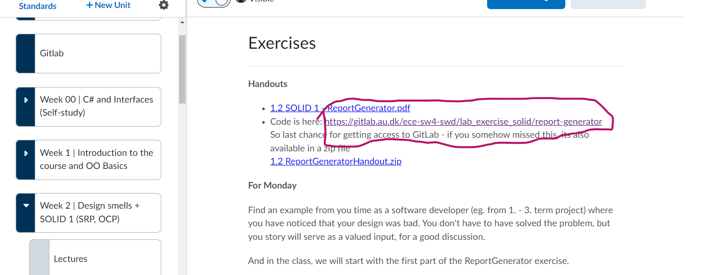
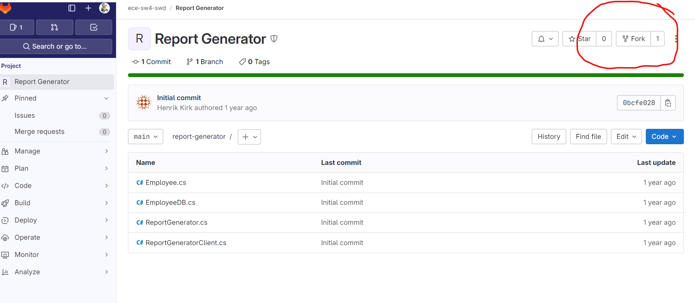
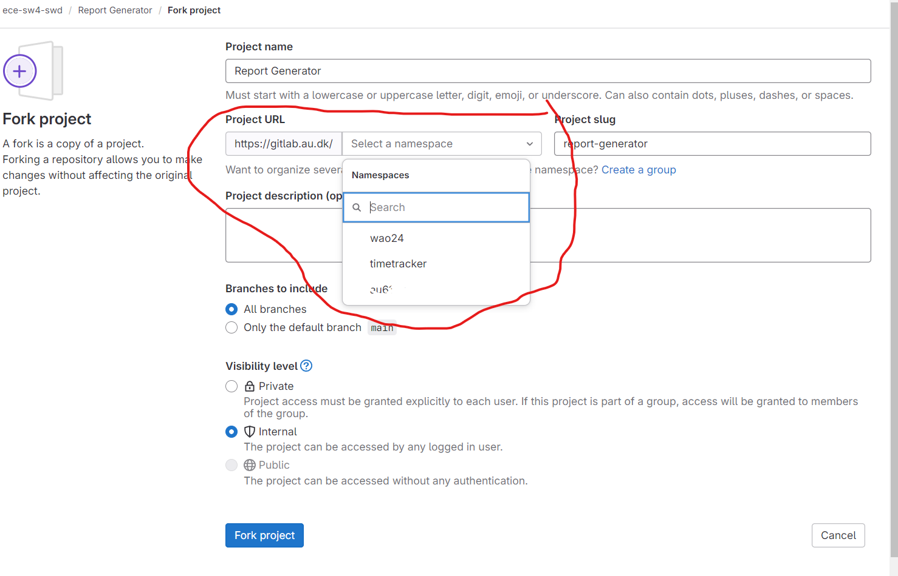
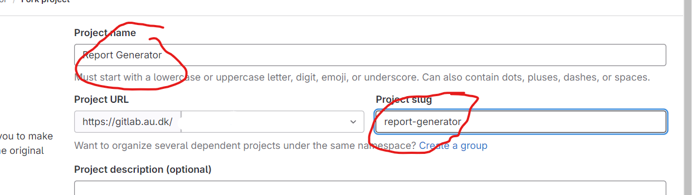
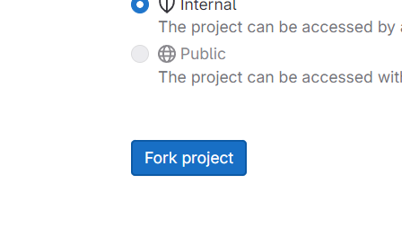
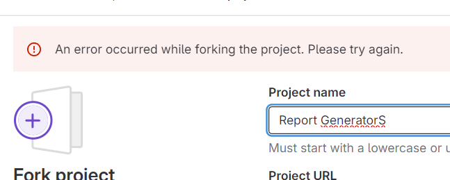
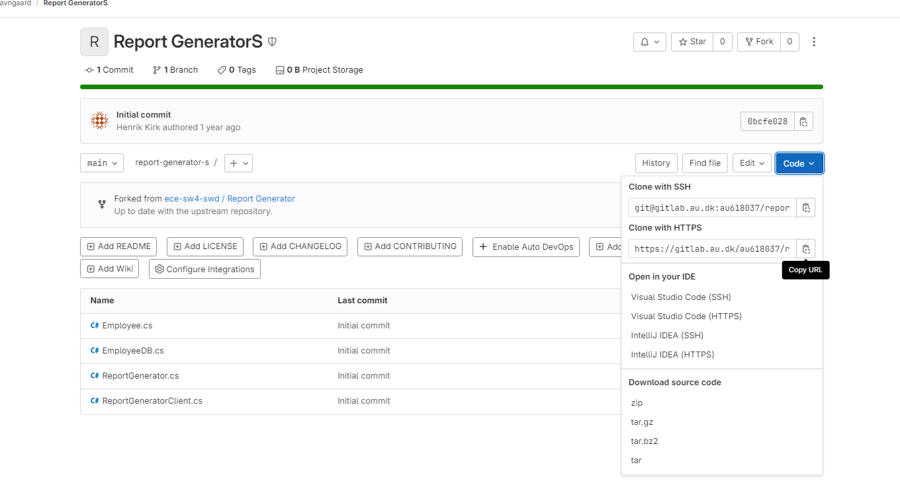
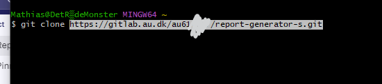

# Git — fork-workflow (GitLab)

## Metadata

| Felt | Værdi |
|---|---|
| **Type** | Praktisk vejledning |
| **Kursus** | Softwaredesign (SW4SWD-01) |
| **Emne** | Fork af kursus-repository på GitLab, arbejde i egen kopi |
| **Kilde** | `Mathias Git Tips - Fork.html` + 8 skærmbilleder (Brightspace) |
| **Bemærk** | Den medfølgende `Fork Repository.mp4` er ikke transskriberet — skærmbillederne dækker samme flow |

---

## Git Tips

**TB translated**

### Fork from gitlab:

For at gøre det mega nemt at bruge udleveret code kan man lave en kopi af Ece-Sw4-Swd ' s repository og så gøre det til sit eget!

Det er efter min mening den nemmeste måde at hente "handout" code ned.

Der er 5 steps

- Tryk på link til Gitlab repository

- Tryk på fork knappen **Fork

**

- Vælg hvilken Gitlab Gruppe skal have Forken (copien)

Her valgte jeg bare min egen, men man kan jo laver grupper på gitlab og invitere sine **v**enner. / studie gruppe

- lav et navn/url

- indstil resten (default er fint) og Tryk Fork

- fix Fejl - Den her er kommer fx ved allerede oprettet repo i det navn...

- Clone Repoet for at arbejde på det. fx med https:

-  brug fx en terminal :

Se evt video for Demo
