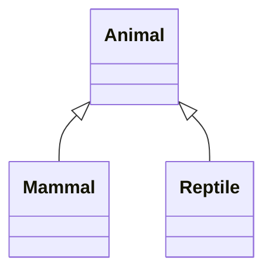
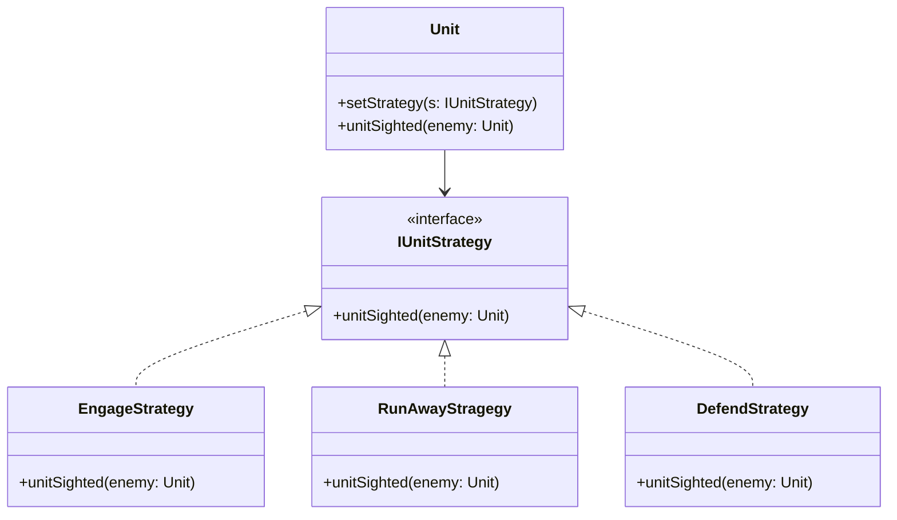

# Uge 1.1b — OO Basics: Object-Oriented Programming

## Metadata

| Felt | Værdi |
|---|---|
| **Lektion** | Uge 1 — OO Basic |
| **Kursus** | Softwaredesign (SW4SWD-01) |
| **Forelæser** | Henrik Bitsch Kirk (HK) |
| **Kilde** | `OO Basic.pdf` (19 slides) |
| **Sprog/kode** | C# |
| **Emner dækket** | OOP-grundbegreberne, encapsulation, evil client, abstraction, inheritance, is-a vs. behaves-like, Liskov Substitution Principle (teaser), polymorphism, strategy-eksempel |

---

## Agenda

1. OOP's grundbegreber — overblik
2. Encapsulation
3. Evil Client — hvorfor encapsulation ikke er en formalitet
4. Abstraction
5. Inheritance — is-a og behaves-like
6. Polymorphism

---

## 1. OOP's grundbegreber

Objektorienteret programmering (OOPs — Object-Oriented Programming System) hviler på seks begreber, som lektionen bruger som ramme:

- **Abstraction**
- **Encapsulation**
- **Class**
- **Object**
- **Inheritance**
- **Polymorphism**

> Slide 2

De fire af dem — encapsulation, abstraction, inheritance og polymorphism — er dem lektionen går i dybden med. Class og object antages bekendt fra tidligere kurser.

---

## 2. Encapsulation

> "Write shy code - modules that don't reveal anything unnecessary to other modules and that don't rely on other modules' implementations."
> — Dave Thomas

> Slide 3

Formuleringen "shy code" fanger encapsulation fra to sider: et modul skal hverken *afsløre* mere end nødvendigt, eller *afhænge* af andre modulers interne detaljer. Begge retninger tæller.

Encapsulation betyder konkret at klassen samler sine metoder og variabler bag en kontrolleret grænseflade — kapslen indeholder både data og adfærd, og kun det udvalgte slipper ud.

Kernereglen på sliden:

> "Details required to return a result from a class method should be hidden from the calling method"

> Slide 4

Til diskussion på sliden: Hvad er fordelene ved encapsulation? Og hvad er ulemperne? Ulemperne er værd at tage alvorligt — stram indkapsling koster i form af flere metoder, mere boilerplate og mindre fleksibilitet for klienten, og der findes tilfælde hvor det ikke betaler sig.

---

## 3. Evil Client

Argumentet for encapsulation gøres konkret med et vindmølle-eksempel. Tankegangen er: antag at klienten er ondsindet (eller bare uopmærksom) — hvad kan han ødelægge gennem dit interface?

> Slide 5

### Iteration 1 — offentligt felt

```csharp
public class TurbineManager {
  public List<WindTurbine> turbines;
}
```

```csharp
public class EvilClient {
  public void DestroyTurbines(TurbineManager tm)
  {
      tm. turbines.Clear();
  }
}
```

Listen er offentlig, så klienten kan tømme hele samlingen. Ingen kontrol overhovedet.

### Iteration 2 — privat felt, men getter der udleverer objektet

```csharp
public class TurbineManager {
  private List<WindTurbine> turbines;
  public WindTurbine GetTurbine(string id);
}
```

```csharp
public class EvilClient {
  public void DestroyTurbines2(TurbineManager tm) {
    tm.GetTurbine("A323").Id = "PWND";
    tm.GetTurbine("PWND").MaxSpeed = -1000;
  }
}
```

Listen er nu privat, men det hjælper ikke: `GetTurbine` returnerer en reference til det egentlige `WindTurbine`-objekt, og klienten kan ændre både `Id` og `MaxSpeed` direkte. At gøre feltet privat er ikke nok når man udleverer sine interne objekter.

### Iteration 3 — kun operationer, ingen objekter ud

```csharp
public class TurbineManager {
  private List<WindTurbine> turbines;
  public void SetMaxSpeed(string tag, int speed);
  public void SetLocation(string tag, Coord coord);
}
```

```csharp
public void DestroyTurbines3(TurbineManager tm)
{
  tm.SetMaxSpeed("A323", -1000);
}
```

Nu udleveres ingen objekter — klienten kan kun bede `TurbineManager` om at udføre operationer. Det giver `TurbineManager` et sted at validere: den kunne afvise en `MaxSpeed` på -1000. Bemærk at eksemplet stadig viser et angreb, fordi klassen som vist ikke validerer noget. Pointen er at det tredje design er det *eneste* af de tre hvor validering overhovedet er mulig.

> Slide 6

---

## 4. Abstraction

> "The purpose of abstraction is not to be vague, but to create a new semantic level in which one can be absolutely precise"
> — Edsger Dijkstra

> Slide 7

Citatet er en korrektion af en udbredt misforståelse: abstraktion handler ikke om at være upræcis eller vag. Den skaber et nyt begrebsniveau, hvor man kan være fuldstændig præcis — bare om noget andet end det underliggende niveau.

Slide 8 stiller spørgsmålet til diskussion: Hvad betyder abstraktion?

### Abstraction — et eksempel

Bob er studerende. Afhængigt af hvilken kontekst han optræder i, er de relevante egenskaber ved ham helt forskellige:

| Kontekst | Relevante egenskaber |
|---|---|
| **Lecture** | Name, Hand-ins, Group number |
| **Office** | AU-id, Study program, Passed courses |
| **Student** | Name, Group number, Active courses |
| **Friend** | … |
| **ORBIT Lab** | … |

Det er alle sammen forskellige abstraktioner af Bob. Hvilken man skal bruge afhænger fuldstændigt af den kontekst Bob repræsenteres i.

At skabe den rigtige abstraktion af entiteterne er meget vigtigt for dit design: **inkludér det relevante, og udelad det irrelevante.**

> Slide 9

Der findes altså ikke én rigtig `Student`-klasse. Der findes den rigtige abstraktion *for det system du bygger* — og en abstraktion der forsøger at dække alle kontekster på én gang, ender med at være dårlig i dem alle.

---

## 5. Inheritance

> "There is nothing wrong with inheritance, or even multiple inheritance. It's a language feature just like any other. It can be used wisely or foolishly"
> — Robert C. Martin

> Slide 10

Slide 11 stiller til diskussion: Nedarvning beskrives ofte som en "is-a relationship" mellem klasser — hvordan forstår du det? Og forklar begreberne "specialization" og "generalization" i forhold til nedarvning.

Hierarkiet der bruges som eksempel:



> Slide 11

### To betydninger af nedarvning

At **Mammal inherits from Animal** betyder to ting, og de er ikke det samme:

1. **Overalt hvor et objekt af klassen `Animal` bruges, kan et objekt af klassen `Mammal` bruges.** Dette er "compile-time"- eller "is-a"-nedarvning. Det er den del compileren kan kontrollere.

2. **Enhver egenskab der er ønskelig for klienter af klassen `Animal`, skal være den samme for klassen `Mammal`.** Dette er "run-time"- eller "behaves-like"-nedarvning. Compileren kan *ikke* kontrollere dette — det er et krav til semantikken.

Sliden markerer selv at punkt 2 er **Liskov's Substitution Principle** (LSP), som kommer igen i uge 37.

> Slide 12

Den vigtige pointe: at koden kompilerer beviser kun det første. Et hierarki kan være typemæssigt korrekt og alligevel brudt, hvis subklassen opfører sig anderledes end klienterne forventer af superklassen.

### Quiz — Bird, Penguin, Swallow

Øvelse på 10 minutter:

1. Arrangér klasserne `Bird`, `Penguin` og `Swallow` i et nedarvningshierarki.
2. Antag at du skal tilføje en metode `LayEgg()` til `Bird`. Holder dit hierarki stadig?
3. Antag at du skal tilføje en metode `Fly()` til `Bird`. Holder dit hierarki stadig?
4. Hvis hierarkiet bryder sammen: hvordan vil du håndtere det?

> Slide 13

Quizzen er designet til at ramme præcis skellet fra slide 12: `LayEgg()` er uproblematisk, fordi både pingviner og svaler lægger æg. `Fly()` bryder "behaves-like"-kravet for `Penguin`, selvom `Penguin : Bird` kompilerer fint.

---

## 6. Polymorphism

> "So much complexity in software comes from trying to make one thing do two things."
> — Ryan Singer

> Slide 14

"Polymorph" betyder "many forms".

Polymorfi bruges når vi har brug for **type-specifik adfærd** fra vores objekter: adfærden for et givet objekt varierer afhængigt af dets type.

Polymorfi forstås bedst fra klientens side — derfor tages et eksempel: kampstrategier i et realtidsstrategispil.

> Slide 15

### Eksempel — RTS-spil

Når en enhed får øje på en fjendtlig enhed, kan den enten:

- **Engage**
- **Defend**
- **Run away**

> Slide 16

Klienten (`Unit`) skal altså kunne reagere på at have spottet en fjende, uden selv at vide hvilken af de tre reaktioner der er valgt. Implementeringen bruger en polymorf strategi:



> Slide 17

Sliden annoterer implementeringen med noter:

- `Unit.setStrategy(s)` gør: `myStrategy = s;`
- `Unit.unitSighted(enemy)` gør: `myStrategy.unitSighted(enemy)`
- `EngageStrategy.unitSighted` skriver `cout << "Attack!!!"`
- `RunAwayStragegy.unitSighted` skriver `cout << "Run away!"`
- `DefendStrategy.unitSighted` skriver `cout << "Stand up and fight!"`

> Slide 17

(Klassenavnet `RunAwayStragegy` er stavet sådan på sliden.)

Det centrale er hvad `Unit` *ikke* gør: der er ingen `switch` eller `if`-kæde over strategitype. `Unit` kalder blot `myStrategy.unitSighted(enemy)` og lader typen af det konkrete strategiobjekt afgøre hvad der sker. Vil man tilføje en fjerde reaktion, skriver man en ny klasse der implementerer `IUnitStrategy` — `Unit` skal ikke røres.

Dette er i praksis Strategy-mønsteret, som gennemgås formelt i uge 41.

Slide 18 er en Q&A-slide og slide 19 er en afsluttende AU-logo-slide.

---

## Opsummering

- OOP hviler på seks begreber: abstraction, encapsulation, class, object, inheritance, polymorphism.
- **Encapsulation** handler om "shy code" — afslør ikke mere end nødvendigt, og afhæng ikke af andres implementering. Evil Client-eksemplet viser at private felter ikke er nok: udleverer man interne objekter via en getter, er indkapslingen brudt alligevel. Kun et interface af rene operationer giver klassen mulighed for at validere.
- **Abstraction** skaber et nyt begrebsniveau hvor man kan være præcis — ikke vag. Den rigtige abstraktion afhænger af konteksten: inkludér det relevante, udelad det irrelevante.
- **Inheritance** har to lag: "is-a" (compile-time, typesubstituerbarhed) og "behaves-like" (run-time, semantisk substituerbarhed). Kun det første kontrolleres af compileren; det andet er Liskov's Substitution Principle. Bird/Penguin/Swallow-quizzen viser hvor `Fly()` bryder det.
- **Polymorphism** giver type-specifik adfærd og forstås bedst fra klientens side. RTS-strategieksemplet viser hvordan `Unit` slipper for at kende de konkrete strategier — ny adfærd tilføjes ved at implementere `IUnitStrategy`, ikke ved at ændre `Unit`.
