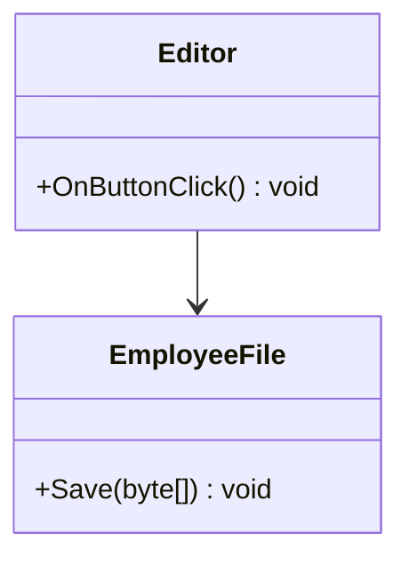
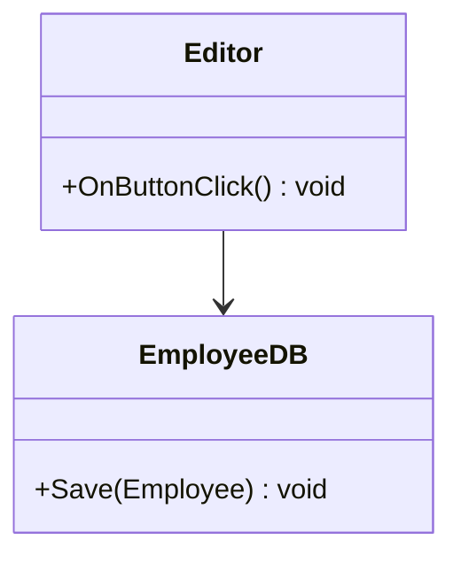
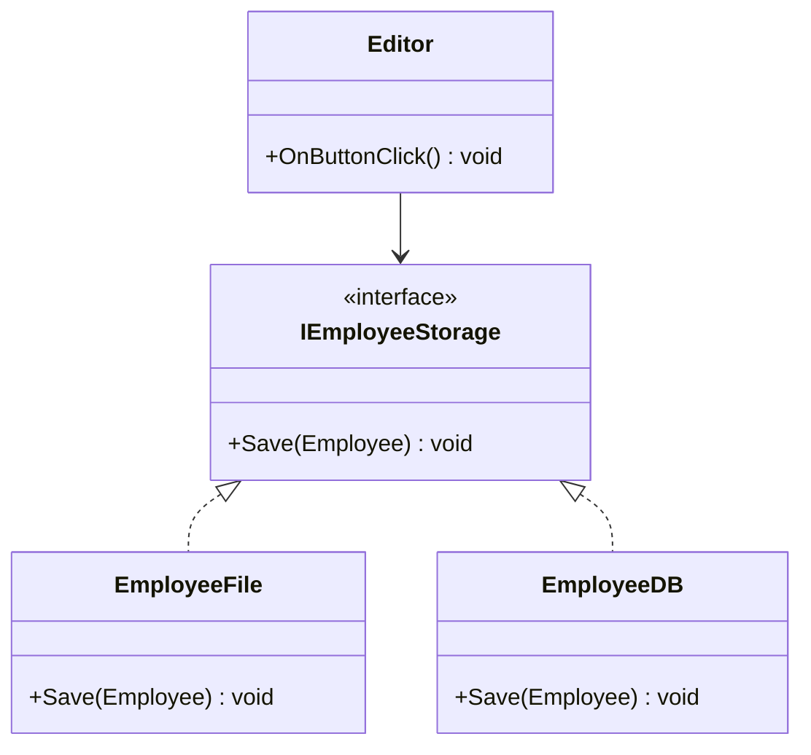

# Uge 2.b — SOLID: Single Responsibility Principle og Open-Closed Principle

## Metadata

| Felt | Værdi |
|---|---|
| **Lektion** | Uge 2 — SOLID (S og O) |
| **Kursus** | Softwaredesign (SW4SWD-01) |
| **Forelæser** | Jørn Martin Hajek (HAJ) |
| **Kilde** | `SOLID - SO.pdf` (20 slides) |
| **Sprog/kode** | C# |
| **Emner dækket** | SOLID-akronymet, Single Responsibility Principle (SRP), aspekter af krav, SRP-eksempler (IModem, Person), Open-Closed Principle (OCP), open for extension / closed for modification, storage-eksempel før og efter OCP |

---

## Agenda

1. SOLID-akronymet — de fem principper
2. Single Responsibility Principle (SRP)
3. SRP i praksis: `IModem` og `Person`
4. Open-Closed Principle (OCP)
5. OCP i praksis: storage uden og med OCP
6. Recap

---

## 1. SOLID

> *"The critical design tool for software development is a mind well educated in design principles"*

> Slide 1

Designprincipper er ikke værktøjer man installerer — det er noget man lærer og bruger til at vurdere designs med.

### SOLID-akronymet

SOLID er sammensat af forbogstaverne i fem designprincipper:

| Bogstav | Princip | Forkortelse |
|---|---|---|
| **S** | Single Responsibility Principle | (SRP) |
| **O** | Open Closed Principle | (OCP) |
| **L** | Liskov's Substitution Principle | (LSP) |
| **I** | Interface Segregation Principle | (ISP) |
| **D** | Dependency Inversion Principle | (DIP) |

> Slide 2

Denne lektion dækker de to første: **S** og **O**.

---

## 2. Single Responsibility Principle (SRP)

Sliden illustrerer princippet med en overlæsset schweizerkniv og teksten *"SINGLE RESPONSIBILITY PRINCIPLE — Just Because You Can, Doesn't Mean You Should"*. Pointen: at man *kan* proppe alting ind i én klasse betyder ikke at man *bør*.

> Slide 3

### Formuleringen

> **A class should only have one reason to change**

…why?

> *"A functional unit on a given level of abstraction should only be responsible for a **single aspect** of a system's requirements.*
>
> *An aspect of requirements is a trait or property of requirements, **which can change independently of other aspects**."*

> Slide 4

Kernen er ordet **aspect**. Et aspekt af kravene er en egenskab ved kravene som kan ændre sig uafhængigt af andre egenskaber. En funktionel enhed — på det abstraktionsniveau den befinder sig på — skal kun være ansvarlig for ét sådant aspekt. Det er derfor "én grund til at ændre sig" er samme udsagn med andre ord: hvis to uafhængige aspekter bor i samme klasse, har klassen to uafhængige grunde til at ændre sig.

### Hvorfor det gør ondt at bryde SRP

- Hvis en klasse har flere responsibilities (flere grunde til at ændre sig), kan ændringer forårsaget af den ene få uheldige effekter på de andre.
- At bryde SRP kan føre til designs der er svære at teste, vedligeholde, ændre osv.

> Slide 5

---

## 3. SRP — eksempel: `IModem`

> \* What is the problem with `IModem`?

Udgangspunktet er ét interface der blander to ting:

```csharp
interface IModem
{
    void Dial(string number);
    void Hangup();
    void Send(char c);
    char Recv();
}
```

`Dial`/`Hangup` handler om **connection management** — at etablere og afbryde en forbindelse. `Send`/`Recv` handler om **data exchange** — at flytte data over en allerede etableret forbindelse. Det er to uafhængige aspekter: forbindelsesopsætningen kan ændre sig (modem, TCP, andet) uden at dataudvekslingen ændrer sig, og omvendt. Derfor har `IModem` to grunde til at ændre sig.

Refaktoreringen splitter interfacet i to ansvar, hvor connection-delen returnerer selve dataudvekslingen:

```csharp
interface IModemConnection
{
    IDataExchange Dial(string number);
    void Hangup();
}

interface ITCPConnection
{
    IDataExchange Connect(string server);
    void Disconnect();
}

interface IDataExchange
{
    void Send(char c);
    char Recv();
}
```

Struktur på sliden: `IModem` splittes op i **to** connection-interfaces — `IModemConnection` (med `Dial(number: string) : IDataExchange` og `Hangup()`) og `ITCPConnection` (med `Connect(server: string) : IDataExchange` og `Disconnect()`). Hver af dem har en stiplet afhængighedspil (dependency) til `IDataExchange`, som indeholder `Send(c: char)` og `Recv() : char`.

Gevinsten er at dataudvekslingen nu er genbrugelig på tværs af forbindelsestyper: både en modem-opkaldsforbindelse og en TCP-forbindelse leverer den samme `IDataExchange`.

> Slide 6

---

## 4. SRP — eksempel: `Person`

```csharp
public class Person {
    public string FirstName { get; set; }
    public string LastName  { get; set; }
    public Gender Gender { get; set; }
    public DateTime DateOfBirth { get; set; }
    public string Format(string formatType) {
        switch(formatType) {
            case "JSON":
              // implement JSON formatting here
              return jsonFormattedString;
            case "FirstAndLastName":
             // implementation of first & lastname formatting here
             return firstAndLastNameString;
            default:
             // implementation of default formatting
             return defaultFormattedString;
        }
    }
}
```

> Slide 7

`Person` har to helt uafhængige aspekter samlet i én klasse: den **holder persondata** (FirstName, LastName, Gender, DateOfBirth), og den **formaterer** disse data til forskellige output-formater. De to aspekter ændrer sig uafhængigt — et nyt felt på personen har intet at gøre med et nyt output-format, og et nyt output-format har intet at gøre med persondatamodellen. Formateringsansvaret hører derfor ikke hjemme i `Person`.

Bemærk også at `switch`en på `formatType` gør klassen dyr at udvide: hvert nyt format kræver en ændring i `Format`. Det er præcis det problem som næste princip — OCP — adresserer.

---

## 5. The Open-Closed Principle (OCP)

Sliden illustrerer princippet med billedteksten *"OPEN CLOSED PRINCIPLE — Brain surgery is not necessary when putting on a hat."* Man skal kunne tilføje noget udefra uden at skære i det eksisterende.

> Slide 8

### Formuleringen

> **Software entities should be open for extension but closed for modification**

- OCP hjælper os med at udvikle SW-systemer der kan håndtere ændrede krav i fremtiden.
- Let's have a look…

> Slide 9

### Formuleringen skilt ad

- *"Open for extension"*: You should expect requirements to change, and allow this change to be implemented through **extension** of the existing design.
- *"Closed for modification"*: When the requirements calls for extension of your code, it should **not be necessary to modify**

> Slide 10

Man skal altså forvente at kravene ændrer sig, og designe så ændringen kan implementeres ved at *tilføje* nyt frem for at *rette i* eksisterende kode.

### OCP newbie-dialog

> — *You want to implement changes, but without changing things?*
> — *Basically, yes…*
> — *WTF? Implementing changes without changing stuff?!?*
> — *Yes. Implementing changes do not necessarily mean "changing". It often means "extending".*
> — *Sigh…*
> — *Here, let me show you…*

> Slide 11

Det tilsyneladende paradoks opløses af skelnen mellem *changing* og *extending*: en ændring i krav behøver ikke betyde en ændring i eksisterende kode, hvis designet tillader at ændringen implementeres som en udvidelse.

---

## 6. Storage uden OCP

Første version: `Editor` gemmer medarbejderdata i en fil.



> Slide 12

```csharp
public class Editor {
  private EmployeeFile storage;
  Editor() {
    storage = new EmployeeFile()
  }
  public void OnButtonClick() {
    for (attr in employee) {
        var data = attr.Format();
        var bytes = // convert data to bytes
        storage.Save(bytes);
    }
  }
}
```

```csharp
public class EmployeeFile {
  public void Save(byte[] b) {
    fileStream.Write(b, 0, b.length);
  }
}
```

> Slide 12

Bemærk hvad `Editor` faktisk ved: den kender den konkrete type `EmployeeFile`, den instantierer den selv i konstruktoren, og den kender *formatet* — den løber attributter igennem, formaterer dem og konverterer til bytes, fordi `Save` tager `byte[]`.

### Nye krav

**Need to support database**

> Slide 13

### Anden version — stadig uden OCP



> Slide 14

```csharp
public class Editor {
  private EmployeeDb storage;
  Editor() {
    storage = new EmployeeDB()
  }
  public void OnButtonClick() {
    storage.save(employee);
  }
}
```

```csharp
public class EmployeeDB {
  public void Save(Employee e) {
    db.Save(e);
  }
}
```

> Slide 14

Sammenlign de to versioner af `Editor`: feltets type er ændret, konstruktoren instantierer nu en anden klasse, og hele kroppen af `OnButtonClick` er skrevet om (formateringsløkken er væk, fordi `EmployeeDB.Save` tager et `Employee`-objekt i stedet for `byte[]`). Kravsændringen handlede kun om lagringen — men `Editor` måtte modificeres alligevel.

### Hvorfor det gik galt

> — *Damn…what went wrong? I didn't want to change `Editor`, only the storage it uses!*
> — *`Editor` was too tightly coupled to `Storage`, therefore extensions to the storage type used rippled through — `Editor` was not closed for modifications when changes were needed…*
> — *But how could I ever avoid that? It is a whole new storage type I am trying to use. And what if the supported storage is changed again? Or if we need to support several storages?*
> — *We could apply OCP and make `Editor` open for extension (the new storage or storages) but closed for modifications…let me show you!*

> Slide 15

Diagnosen er **tight coupling**: `Editor` afhang af en konkret storage-klasse, så en udvidelse af storage-typen forplantede sig ind i `Editor`. `Editor` var med andre ord ikke closed for modification.

---

## 7. Storage med OCP

Løsningen er at indføre et interface `IEmployeeStorage` som `Editor` afhænger af, og lade de konkrete lagringsformer implementere det. Storage-instansen leveres udefra gennem konstruktoren i stedet for at blive instantieret inde i `Editor`.



> Slide 16

```csharp
public class Editor {
  private IEmployeeStorage storage;
  Editor(IEmployeeStorage s) {
    storage = s;
  }
  public void OnButtonClick() {
      storage.Save(employee);
    }
} }
```

```csharp
public class EmployeeFile {
  public void Save(Employee e) {
    for (attr in e) {
      var data = attr.Format();
      var b = // convert data
      fileStream.Write(b, 0, b.length);
    }
} }
```

```csharp
public class EmployeeDB {
  public void Save(Employee e) {
    db.Save(e);
  }
}
```

> Slide 16

To ting flyttede sig i forhold til det ikke-OCP-konforme design:

Interfacet fastlægger nu signaturen `Save(Employee)` — altså det *domænemæssige* niveau, ikke `byte[]`. Dermed er formateringen og byte-konverteringen flyttet ned i `EmployeeFile`, hvor den hører hjemme; det er filspecifik viden. `Editor` kender kun `Save(employee)`.

Konstruktoren tager storage som parameter (`Editor(IEmployeeStorage s)`) i stedet for at kalde `new`. `Editor` har dermed ingen kompileringstidsafhængighed til en konkret storage-klasse. En tredje lagringsform — eller flere samtidige — tilføjes ved at skrive en ny klasse der implementerer `IEmployeeStorage`. `Editor` rør man ikke: open for extension, closed for modification.

---

## 8. Afslutning

Sliden viser en figur med en hammer stående i et gulv fuldt af søm — hvis dit eneste værktøj er en hammer, ligner alt et søm. En påmindelse om at principperne er værktøjer der skal vælges med omtanke, ikke bankes ned over enhver situation.

> Slide 17

---

## Recap

- SOLID: 5 principles for good OO design
- **S: SRP — Single Responsible Principle.** A class should have exactly one reason to change
- **O: OCP — Open-Closed Principle.** A class should be open for extension but closed for modifications.

> Slide 18

Slide 19 er *"QUESTIONS?"* og slide 20 er AU-afslutningsslide uden fagligt indhold.

---

## Opsummering

- **SRP**: en klasse må kun have én grund til at ændre sig. Formelt: en funktionel enhed på et givet abstraktionsniveau må kun være ansvarlig for ét *aspekt* af systemets krav — hvor et aspekt er en egenskab ved kravene der kan ændre sig uafhængigt af andre.
- Brud på SRP giver designs der er svære at teste, vedligeholde og ændre, fordi en ændring i ét ansvar kan få utilsigtede konsekvenser for et andet.
- `IModem` bryder SRP ved at blande connection management (`Dial`/`Hangup`) med data exchange (`Send`/`Recv`); løsningen er at splitte i separate interfaces og lade connection returnere `IDataExchange`.
- `Person` bryder SRP ved både at holde persondata og formatere dem; datamodel og outputformat ændrer sig uafhængigt.
- **OCP**: software entities should be open for extension but closed for modification. Forvent at krav ændrer sig, og gør ændringen implementerbar som en *udvidelse* frem for en *modifikation*.
- Storage-eksemplet viser mekanikken: tight coupling til en konkret klasse (`new EmployeeFile()`) tvinger ændringer ind i `Editor`; et interface (`IEmployeeStorage`) plus injektion via konstruktoren gør nye lagringsformer til ren tilføjelse.
