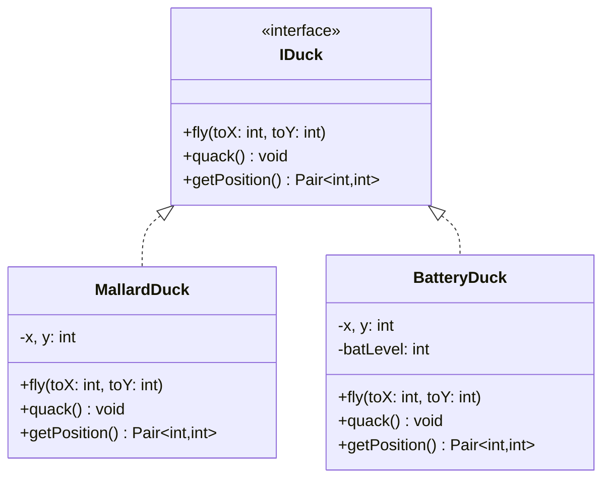
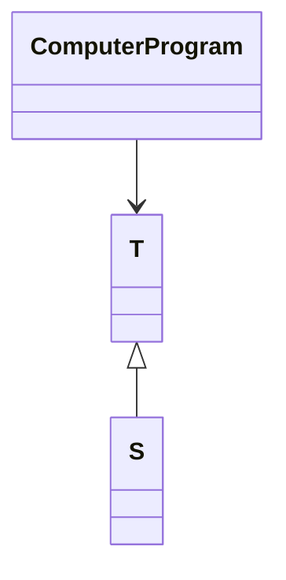
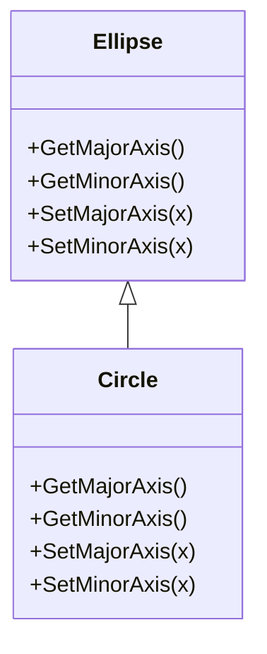
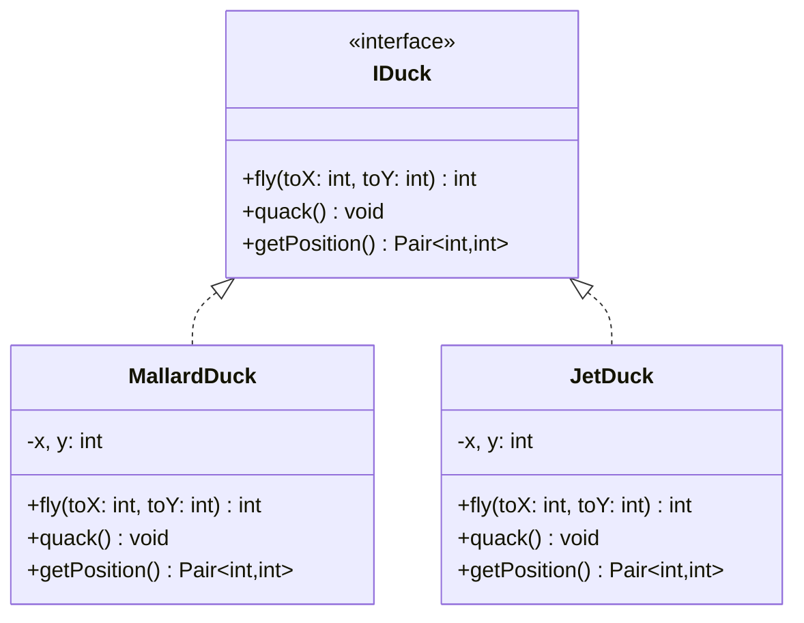
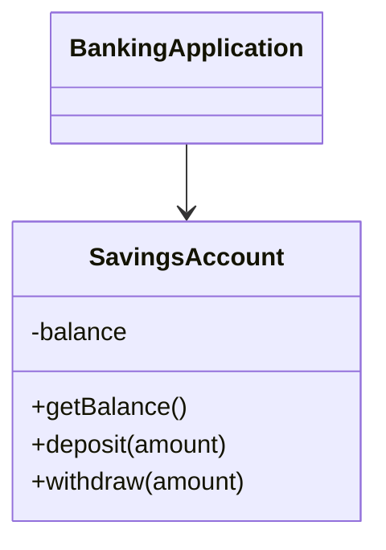
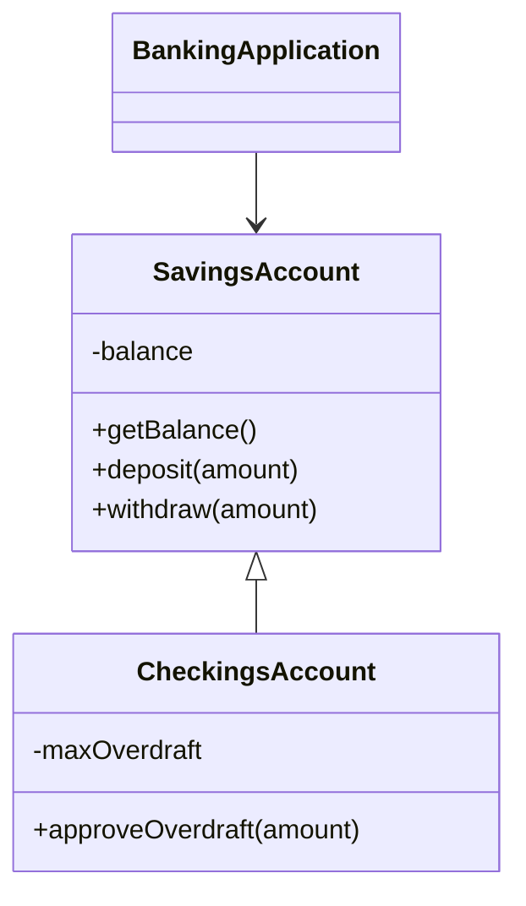

# Uge 3.a — SOLID: Liskov Substitution Principle

## Metadata

| Felt | Værdi |
|---|---|
| **Lektion** | Uge 3 — SOLID (L) |
| **Kursus** | Softwaredesign (SW4SWD-01) |
| **Forelæser** | Henrik Bitsch Kirk (HK) |
| **Kilde** | `SOLID - L.pdf` (35 slides) |
| **Sprog/kode** | C# (enkelte kodeeksempler i pseudokode/Java-syntaks) |
| **Emner dækket** | SOLID-akronymet, Liskov Substitution Principle (LSP), IS-A vs. IS-SUBSTITUTABLE-FOR, duck-eksemplet, circle-ellipse-problemet, Design by Contract, pre- og postconditions, class invariants, account-eksemplet, SOLID-recap (alle fem), kritik af SOLID, CUPID |

---

## Agenda

1. SOLID-akronymet — L er i fokus
2. Liskov Substitution Principle — den formelle definition
3. Duck-programmet: hvordan en subtype bryder klientens forventninger
4. LSP forklaret: IS-A vs. IS-SUBSTITUTABLE-FOR
5. Circle-ellipse-problemet
6. Design by Contract: pre- og postconditions
7. Account-eksemplet
8. Subclassing-tjekliste
9. Recap af hele SOLID
10. Kritik af SOLID og alternativet CUPID

---

## 1. Åbningsslide — XKCD

Forelæsningen åbner med XKCD 1188 (håndskrevet kode), hvor `Ball extends Throwable` misbruges til rekursiv kast/gribning:

```java
class Ball extends Throwable {}
class P{
  P target;
  P(P target) {
    this.target = target;
  }
  void aim(Ball ball) {
    try {
      throw ball;
    }
    catch (Ball b){
      target.aim(b);
    }
  }
  public static void main(String[] args) {
    P parent = new P(null);
    P child = new P(parent);
    parent.target = child;
    parent.aim(new Ball());
  }
}
```

> Slide 1

Vittigheden er selve pointen for lektionen: `Ball` *er* teknisk set en `Throwable` (arven kompilerer), men en bold har intet at gøre i et exception-hierarki. Syntaktisk lovlig arv siger ikke noget om, hvorvidt subtypen giver mening der hvor supertypen bruges.

---

## 2. SOLID

> *"The critical design tool for software development is a mind well educated in design principles"*

> Slide 2

### SOLID-akronymet

| Bogstav | Princip | Forkortelse |
|---|---|---|
| S | Single Responsibility Principle | (SRP) |
| O | Open Closed Principle | (OCP) |
| **L** | **Liskov's Substitution Principle** | **(LSP)** |
| I | Interface Segregation Principle | (ISP) |
| D | Dependency Inversion Principle | (DIP) |

Denne lektion fremhæver **L**; de øvrige fire står nedtonet på sliden.

> Slide 3

---

## 3. Liskov Substitution Principle

Sliden viser memet *"LISKOV SUBSTITUTION PRINCIPLE — If It Looks Like A Duck, Quacks Like A Duck, But Needs Batteries - You Probably Have The Wrong Abstraction"* med en rigtig gråand ved siden af en batteridrevet badeand.

> Slide 4

En subtype der ligner supertypen udadtil, men kræver noget helt andet for at fungere, er et tegn på en forkert abstraktion. Det er præcis det duck-eksemplet uddyber senere.

### Den formelle definition

> LSP: *"In a computer program, if S is a subtype of T, then objects of type T may be replaced with objects of type S without altering any of the desirable properties of that program"*
>
> — Barbara Liskov, 1987

> Slide 5

Formuleret på dansk: hvis `S` er en subtype af `T`, skal man kunne udskifte ethvert objekt af typen `T` med et objekt af typen `S`, uden at nogen af programmets ønskede egenskaber ændrer sig. Bemærk hvad definitionen *ikke* siger — den siger intet om at `S` skal *arve* fra `T` eller have samme metoder. Den handler om **programmets** opførsel: klienten må ikke kunne mærke forskel.

---

## 4. Duck program

```csharp
def migrate(duck: IDuck){
    …
    duck.fly(capetown_x, capetown_y)
    Pair<int,int> p = duck.getPosition()
    assert(p[0] == capetown_x
        && p[1] == capetown_y)
    …
}
```

Klassehierarkiet:



`BatteryDuck.fly` er implementeret sådan:

```csharp
public fly(toX: int, toY:int){
  for(int i=x; i<toX: i++) {
    x++;
    batLevel--;
    if (batLevel==0) return
  }
  for(int j=y; j<toY: i++) {
    y++;
    batLevel--;
    if (batLevel==0) return
  }
}
```

> Slide 6

Her er bruddet. `migrate` forventer af `IDuck`, at når `fly(capetown_x, capetown_y)` er kaldt, så *er* anden i Cape Town — det er assertionen på `getPosition()`. `MallardDuck` opfylder det. `BatteryDuck` gør det ikke: løber batteriet tør undervejs, returnerer `fly` blot, og positionen er et sted midtvejs. Assertionen fejler, og `migrate` er gået i stykker — uden at én linje i `migrate` er ændret.

`BatteryDuck` er altså en `IDuck` i typesystemets forstand, men den er ikke substituerbar for en `IDuck` i `migrate`s forstand.

---

## 5. LSP forklaret

> LSP: *In a computer program, if S is a subtype of T, then objects of type T may be replaced with objects of type S without altering any of the desirable properties of that program*

Strukturen på sliden: `ComputerProgram` bruger `T`; `S` er en subtype (arver fra) `T`.



Slidens forklarende bokse:

- `ComputerProgram` uses `T` and thus expects some specific behavior of `T`
- We can extend ("sub-type") `T` in a derived class, `S`, and use it in `ComputerProgram` instead of `S`.
- However, we must make sure that the behavior that `ComputerProgram` expects of `T` is also implemented in `S`.
- If we don't, `ComputerProgram` is broken because of something changed outside it!

> **So according to LSP, subtyping should not mean `IS-A` but should mean `IS-SUBSTITUTABLE-FOR`.**

> Slide 7

Det sidste er lektionens hovedbudskab. Den klassiske OO-tommelfingerregel "arv når der er et IS-A-forhold" er utilstrækkelig, fordi den kun taler om begreber, ikke om opførsel. En cirkel *er* en ellipse rent geometrisk, og en batteriand *er* en and rent begrebsmæssigt — men ingen af dem er nødvendigvis substituerbare for supertypen i den kontekst klienten bruger den.

Og bemærk konsekvensen: `ComputerProgram` går i stykker på grund af noget der er ændret **uden for** den. Det er den samme smerte som OCP handler om, blot forårsaget af arv i stedet for tight coupling.

---

## 6. Circle-ellipse-problemet

> **Is a circle an ellipsis?**

> Slide 8

Spørgsmålet stilles åbent som diskussion. Matematisk er svaret ja: en cirkel er en ellipse hvor de to akser er lige lange. Spørgsmålet er, om det gør `Circle` til en gyldig subtype af `Ellipse` i kode — og det besvares på næste slide via Design by Contract.

---

## 7. Design by Contract — postconditions

> *"A routine declaration of a derivative may only replace the original precondition with one **equal or weaker**, and the original postcondition with one **equal or stronger**"*
>
> — Bertrand Meyer, Design By Contract

> Slide 9

Reglen på dansk: når en afledt klasse overskriver en metode, må den kun erstatte den oprindelige precondition med en der er lige så svag eller svagere, og den oprindelige postcondition med en der er lige så stærk eller stærkere. Asymmetrien er logisk: klienten har lært supertypens kontrakt at kende. Kræver subtypen *mere* af klienten (stærkere precondition), kan et hidtil lovligt kald pludselig være ulovligt. Lover subtypen *mindre* (svagere postcondition), holder klientens antagelser efter kaldet ikke længere.

### Anvendt på Circle/Ellipse

Klassestrukturen: `Circle` arver fra `Ellipse`. Begge har `GetMajorAxis()`, `GetMinorAxis()`, `SetMajorAxis(x)` og `SetMinorAxis(x)`.



Postconditions:

```
Postcondition for Ellipse.SetMajorAxis(x):
a==x && b == old.b
```

```
Postcondition for Circle.SetMajorAxis(x):
a==x && b==x
```

Sliden markerer `Circle`s postcondition med **"Weaker postcondition!"**

> Slide 9

`Ellipse.SetMajorAxis` lover to ting: at storaksen bliver `x`, **og at lilleaksen er uændret** (`b == old.b`). `Circle` kan umuligt holde den anden halvdel — en cirkel har pr. definition ens akser, så at sætte den ene sætter også den anden (`b==x`). Løftet om `b == old.b` er brudt.

En klient der arbejder med en `Ellipse` og regner med at kunne ændre storaksen uafhængigt af lilleaksen, går i stykker den dag der bliver sendt en `Circle` ind. Så: matematisk er en cirkel en ellipse, men `Circle` er ikke substituerbar for `Ellipse` når `Ellipse` har uafhængige aksesættere. IS-A holder; IS-SUBSTITUTABLE-FOR gør ikke.

---

## 8. Eksempel: stærkere postcondition

Det omvendte tilfælde — hvor en stærkere postcondition er tilladt — vises med en udvidet udgave af duck-programmet, hvor `fly` nu returnerer antallet af dage:

```csharp
def migrate(duck: IDuck){
    …
    int days = duck.fly(capetown_x, capetown_y)
    Pair<int,int> p = duck.getPosi
    assert(p[0] == capetown_x
        && p[1] == capetown_y
        && days<48)
    …
}
```



`JetDuck.fly`:

```csharp
public fly(toX: int, toY:int){
  days = 0;
  for(int i=x; i<toX: i++) {
    x++;
    days=days+0.1;
  }
  for(int j=y; j<toY: i++) {
    y++;
    days=days+0.1;
  }
  return int(days)
}
```

> Slide 10

Her er `JetDuck` hurtigere end en almindelig and. Den kommer altid frem, og den kommer frem på færre dage. Postconditionen er dermed *stærkere* end supertypens — og det er tilladt. Klienten forlangte `days<48`; får den `days<10`, er assertionen stadig opfyldt. En subtype må godt love mere, end klienten forventer; den må bare ikke love mindre.

Bemærk kontrasten til `BatteryDuck` fra slide 6: samme hierarki, men den ene subtype svækker kontrakten (kommer måske ikke frem) og den anden styrker den (kommer hurtigere frem). Kun den første bryder LSP.

---

## 9. Pre- og postconditions

Samme Meyer-citat gentages som ramme for to konkrete tilfælde af preconditions. Strukturen begge steder: `S` arver fra `T`, og begge implementerer `setValue(int val)`.

### Stærkere precondition — ikke tilladt

```csharp
// T
void setValue(int val)
{
  Assert(val <= 10)
  ...
}
```

```csharp
// S
void setValue(int val)
{
  Assert(val <= 5)
  ...
}
```

Sliden markerer `S`s assertion med **"Stronger precondition"**.

> Slide 11

`T` accepterer alle værdier op til 10. `S` accepterer kun op til 5. En klient der har lært `T`s kontrakt og kalder `setValue(8)`, får nu en fejlende assertion, fordi der er sendt en `S` ind i stedet for en `T`. Subtypen kræver mere af klienten end supertypen gjorde — det er et LSP-brud.

### Svagere precondition — tilladt

```csharp
// T
void setValue(int val)
{
  Assert(val <= 10)
  ...
}
```

```csharp
// S
void setValue(int val)
{
  Assert(val <= 15)
  ...
}
```

Sliden markerer `S`s assertion med **"Weaker precondition"**.

> Slide 12

`S` accepterer alt hvad `T` accepterede, og lidt mere. Ingen klient der overholdt `T`s kontrakt, kan komme i klemme. Det er lovligt.

Reglen kan huskes som: **subtypen må kræve mindre og love mere — aldrig omvendt.**

---

## 10. Account-eksemplet

Udgangspunktet: en bankapplikation der bruger en opsparingskonto.



> Slide 13

### Udvidelse med checkkonto

`CheckingsAccount` arver fra `SavingsAccount` og tilføjer `- maxOverdraft` og `+ approveOverdraft(amount)`.



> **Discussion: Is there a problem?**

> Slide 14

Ja. `SavingsAccount` har en implicit class invariant: **balance kan ikke være negativ**. En opsparingskonto kan ikke gå i minus, og `withdraw` afviser derfor hævninger større end saldoen. `BankingApplication` er skrevet under den antagelse — den kan f.eks. regne med at `getBalance()` altid returnerer et ikke-negativt tal.

`CheckingsAccount` er en kassekredit. Hele dens formål er at tillade overtræk, altså negativ saldo op til `maxOverdraft`. Den bryder dermed superklassens invariant. Sender man en `CheckingsAccount` ind hvor applikationen forventer en `SavingsAccount`, kan der pludselig komme negative saldi ud af `getBalance()`, og `withdraw` opfører sig anderledes end kontrakten lovede. Klassisk LSP-brud — og igen: IS-A holder (en checkkonto *er* en slags konto), IS-SUBSTITUTABLE-FOR gør ikke.

---

## 11. Subclassing — tjekliste

Slides 15–18 bygger listen op punkt for punkt:

**When you subclass, think about the class assumptions:**

1. What are the pre- and post-conditions for the superclass, in the context it is used?
2. What are the class invariants?
3. Take care not to break the code by violating those assumptions.
4. **Think `IS-SUBSTITUTABLE-FOR` instead of `IS-A`**

> Slides 15–18

De to første spørgsmål er de to niveauer af antagelser: pre-/postconditions er kontrakter pr. *metode*, class invariants er egenskaber der skal gælde for *objektet* hele tiden (som `balance >= 0` i account-eksemplet). Begge dele skal respekteres af subklassen.

Formuleringen "in the context it is used" er væsentlig: en kontrakt er ikke kun det der står skrevet i superklassen, men også det klienterne faktisk regner med. Derfor kunne `migrate` gå i stykker uden at `IDuck`-interfacet formelt blev overtrådt.

---

## 12. SOLID — recap

Slides 19–24 bygger den fulde recap op:

- **SOLID: 5 principles for good OO design**
- **S: SRP** — Each class/module should only have a single responsibility
- **O: OCP** — Classes should be open for extension but closed for modification
- **L: LSP** — Any client of a class should be able to use subclasses of that class with no problems
- **I: ISP** — Clients should not be forced to depend on methods they do not use
- **D: DIP**
  - A: High-level modules should not depend on low-level modules. Both should depend on abstractions.
  - B: Abstractions should not depend on details. Details should depend on abstractions.

> Slides 19–24

---

## 13. Alternatives to SOLID

**SOLID is hard to apply**

| Princip | Kritik |
|---|---|
| **SRP** | vague |
| **OCP** | replace old code |
| **LSP** | no surprises |
| **ISP** | everything is better than one object/interface |
| **DIP** | reuse is overrated |

> Slide 25

Kritikken er kortfattet, men peger på reelle svagheder: SRP er vag (hvad *er* ét ansvar?), OCP fører i praksis ofte til at man alligevel udskifter gammel kode, LSP koger ned til "ingen overraskelser", ISP til at flere små grænseflader næsten altid slår én stor, og DIP til at genbrug er overvurderet som designmål.

**Instead → Write simple code — Rule of Least Power**

> Slide 26

Rule of Least Power: vælg det mindst kraftfulde værktøj der løser opgaven. Simpel kode slår elegant abstraktion når abstraktionen ikke betaler sig.

---

## 14. CUPID

Alternativet præsenteres bogstav for bogstav over slides 27–32:

| Bogstav | Egenskab |
|---|---|
| **C** | **C**omposable |
| **U** | **U**nix philosophy |
| **P** | **P**redictable |
| **I** | **I**diomatic |
| **D** | **D**omain-based |

> Slides 27–32

CUPID beskriver egenskaber ved kode ("joyful code") frem for regler man skal overholde: kode skal kunne sammensættes med andet, gøre én ting godt (Unix-filosofien), opføre sig som man forventer, følge sprogets og teamets idiomer, og være modelleret efter domænet frem for efter tekniske lag.

---

## 15. Afslutning

Slide 33 er *"ANY QUESTIONS?"* og slide 34 er AU-afslutningsslide — begge uden fagligt indhold.

### References

- XKCD: https://xkcd.com/1188/
- Babara Livskov: https://news.mit.edu/2009/turing-liskov-0310
- Questions: http://sourcesofinsight.com/questions-and-answers-on-the-top-10-leadership-lessons/

> Slide 35

---

## Opsummering

- **LSP formelt** (Barbara Liskov, 1987): hvis `S` er en subtype af `T`, må objekter af type `T` kunne erstattes af objekter af type `S` uden at ændre nogen af programmets ønskede egenskaber.
- **Hovedbudskabet**: subtyping skal ikke betyde `IS-A`, men `IS-SUBSTITUTABLE-FOR`. Begrebsmæssig slægtskab (cirkel er en ellipse, checkkonto er en konto) er ikke tilstrækkeligt grundlag for arv.
- **Design by Contract** (Bertrand Meyer) giver den praktiske testregel: en afledt metode må kun erstatte preconditionen med en lige så svag eller svagere, og postconditionen med en lige så stærk eller stærkere. Subtypen må kræve mindre og love mere — aldrig omvendt.
- `BatteryDuck` bryder LSP (svagere postcondition: kommer måske ikke frem); `JetDuck` gør ikke (stærkere postcondition: kommer hurtigere frem). `Circle.SetMajorAxis` bryder `Ellipse`s postcondition `b == old.b`. `CheckingsAccount` bryder `SavingsAccount`s class invariant om ikke-negativ saldo.
- Ved subclassing: undersøg superklassens pre-/postconditions **i den kontekst den bruges**, dens class invariants, og pas på ikke at bryde dem.
- SOLID kritiseres for at være svær at anvende; alternativerne er "write simple code" (Rule of Least Power) og CUPID: Composable, Unix philosophy, Predictable, Idiomatic, Domain-based.
