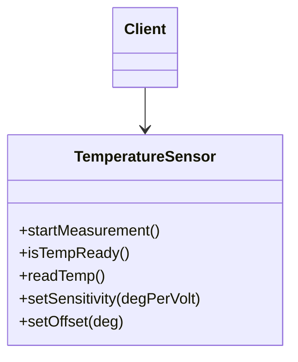
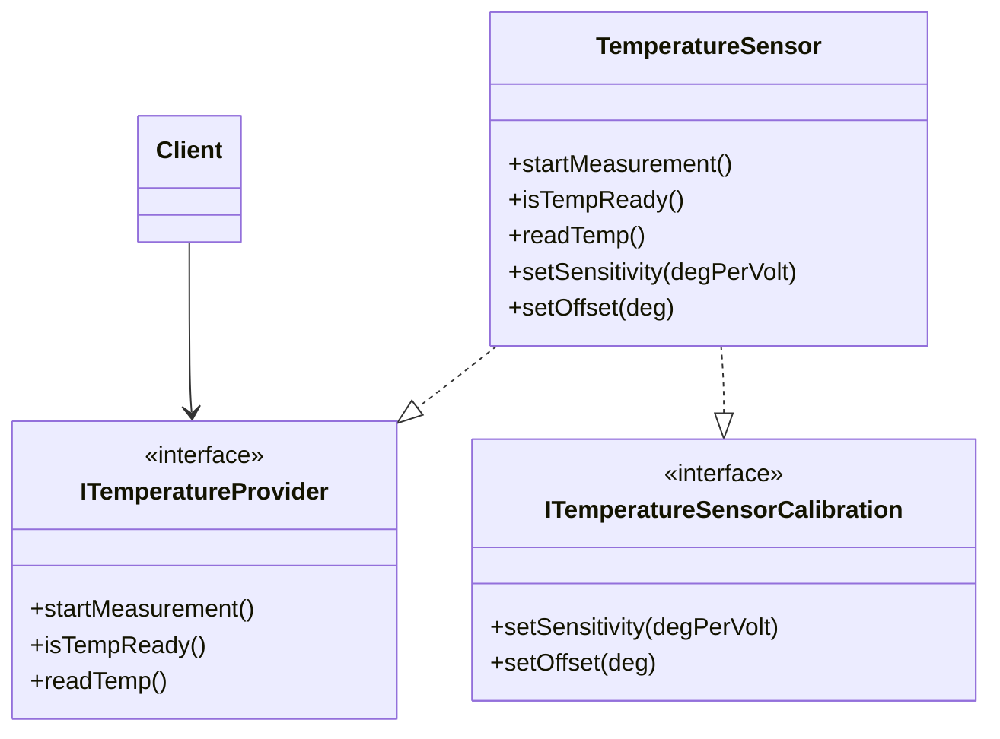
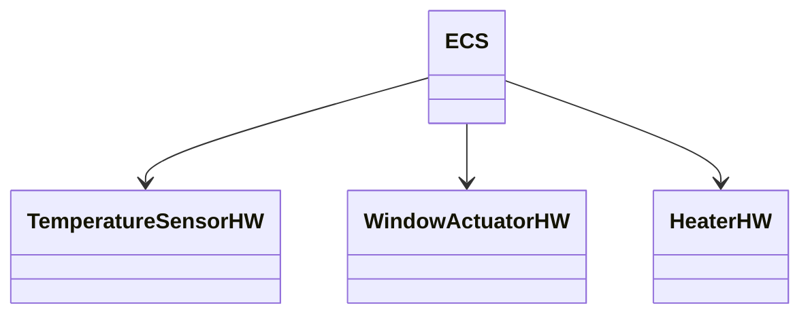
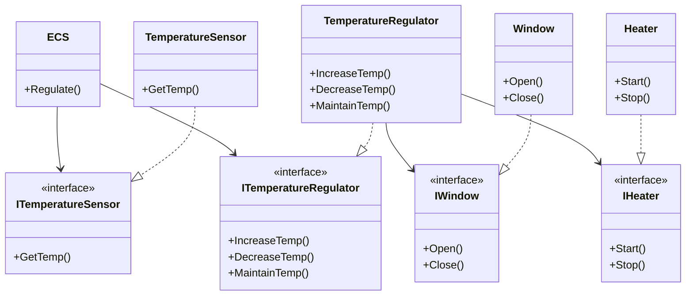

# Uge 3.b — SOLID: Interface Segregation & Dependency Inversion

## Metadata

| Felt | Værdi |
|---|---|
| **Lektion** | Uge 3 — SOLID-principperne, del 2 (ISP og DIP) |
| **Kursus** | Softwaredesign (SW4SWD-01) |
| **Forelæser** | Henrik Bitsch Kirk (HK) |
| **Kilde** | `SOLID - ID.pdf` (35 slides) |
| **Sprog/kode** | C# |
| **Emner dækket** | SOLID-akronymet, Interface Segregation Principle (ISP), ISP-brud set fra consumers, ISP-brud set fra implementors, ISP i .NET (`List<T>`), Dependency Inversion Principle (DIP), high-level vs. low-level modules, ECS-eksempel (greenhouse), refaktorering med interfaces |

---

## Agenda

1. SOLID-akronymet — hvor vi er i rækken
2. Interface Segregation Principle: definition og to fordele
3. ISP-brud fra consumer-siden (temperatursensor)
4. ISP-brud fra implementor-siden (IDoor / TimedDoor)
5. ISP i den virkelige verden — `List<T>`
6. Dependency Inversion Principle: definition
7. High-level vs. low-level modules
8. DIP-eksempel: Environmental Control System før og efter
9. Diskussion

---

## 1. SOLID-akronymet

> "The critical design tool for software development is a mind well educated in design principles"
>
> Slide 1

SOLID er de første bogstaver i fem designprincipper:

| Bogstav | Princip | Forkortelse |
|---|---|---|
| S | Single Responsibility Principle | SRP |
| O | Open Closed Principle | OCP |
| L | Liskov's Substitution Principle | LSP |
| **I** | **Interface Segregation Principle** | **ISP** |
| **D** | **Dependency Inversion Principle** | **DIP** |

> Slide 2

SRP, OCP og LSP blev dækket i forrige lektion. Denne lektion tager de to sidste: ISP og DIP.

---

## 2. Interface Segregation Principle (ISP)

Billedsproget på sliden: du vil have en simpel lommekniv med ét blad ("I want…"), men du får en Wenger-monsterkniv med fyrre værktøjer ("I got"). Det er præcis situationen ISP adresserer — et interface, der er blevet en universalkniv, tvinger alle til at forholde sig til værktøjer, de aldrig bruger.

> Slide 4

### Definitionen

> "Clients should not be forced to depend on methods they do not use"
>
> Slide 5

**Note:** ordet "client" bruges i litteraturen om *både* "consumer" og "implementor" af et interface, hvilket skaber forvirring. Sliden gør det eksplicit, fordi ISP rammer begge grupper — men på hver sin måde.

> Slide 5

### To fordele

ISP kræver, at interfaces holdes **small and cohesive**. Det giver mindst to fordele:

1. **Implementors of an interface do not need to implement "dummy" methods for the parts of an interface that they do not implement.**
2. **Consumers of an interface do not have to consider methods they do not need.**

> Slides 6–8

Resten af ISP-delen udfolder de to fordele hver for sig: først consumer-siden, så implementor-siden.

---

## 3. ISP-brud set fra consumers

En `Client` bruger en `Temperature Sensor` direkte. Sensoren eksponerer alt, hvad den kan:

```
startMeasurement()
isTempReady()
readTemp()
setSensitivity(degPerVolt)
setOffset(deg)
```

`Client` afhænger af hele klassen, selvom den kun skal aflæse temperatur.



> Slide 9

**Problemet:** de to sidste metoder — `setSensitivity` og `setOffset` — er *kalibrering*, ikke *aflæsning*. En klient, der bare vil have en temperatur, er tvunget til at afhænge af et kalibrerings-API, den aldrig kalder. Ændres kalibreringsdelen, rammer det også aflæsnings-klienterne.

### Løsningen: segregér interfacet

Split i to interfaces efter formål, og lad implementationen implementere begge:



> Slide 10

`TemperatureSensor` er uændret som klasse — den kan stadig det hele. Men `Client` afhænger nu kun af `ITemperatureProvider` og ser ikke kalibreringsmetoderne overhovedet. Segregeringen sker i interfacene, ikke i implementationen.

---

## 4. ISP-brud set fra implementors

Det andet perspektiv: et interface, der bliver forurenet af én implementations behov.

Udgangspunktet er et `IDoor`-interface med `Open()`, `Close()` og `IsOpen(): bool`. Tre klasser implementerer det: `TimedDoor`, `HeavyDoor` og `SlidingDoor`. En `AccessProvider` er consumer af `IDoor`.

`TimedDoor` skal kunne registrere sig hos en `Timer` og modtage timeouts. `Timer.Register(int t, ITimerClient c)` kræver en `ITimerClient` med `Timeout()`. Den nemme — og forkerte — løsning er at lade `IDoor` arve fra `ITimerClient`, så `Timeout()` bliver en del af dør-interfacet.

Klassestrukturen i den brudte version:

| Element | Indhold | Relation |
|---|---|---|
| `Timer` | `+ Register(int t, ITimerClient c)` | bruger `ITimerClient` |
| `ITimerClient` | `+ Timeout()` | — |
| `IDoor` | `+ Open()`, `+ Close()`, `+ IsOpen(): bool` | arver `ITimerClient` |
| `TimedDoor` | `+ Open()`, `+ Close()`, `+ IsOpen(): bool`, `+ Timeout()` | implementerer `IDoor`, registrerer sig hos `Timer` |
| `HeavyDoor` | `+ Open()`, `+ Close()`, `+ IsOpen(): bool`, **`+ Timeout()`** (tvunget) | implementerer `IDoor` |
| `SlidingDoor` | `+ Open()`, `+ Close()`, `+ IsOpen(): bool`, **`+ Timeout()`** (tvunget) | implementerer `IDoor` |
| `AccessProvider` | consumer | bruger `IDoor` |

Sliden markerer `+ Timeout()` med rødt på `HeavyDoor` og `SlidingDoor` — det er de dummy-metoder, ISP handler om.

Slidens egne pointer:

- `TimedDoor` exerts a force on the interface `IDoor`.
- `IDoor` is polluted, which impacts **all** implementations of `IDoor`.
- The consumer of `IDoor` now has one more method to worry about.
- Implementors must implement `TimeOut()`.
- Users of implementors must accept a software update for *zero* benefit.

> Slide 11

Den sidste er den dyre: `HeavyDoor` og `SlidingDoor` får en ny release, uden at deres funktionalitet ændrer sig et gram. Kunderne skal opdatere for ingenting.

### Løsningen: adskilte interfaces

Fjern arven mellem `IDoor` og `ITimerClient`. Lad i stedet `TimedDoor` implementere begge interfaces direkte:

| Element | Indhold | Relation |
|---|---|---|
| `Timer` | `+ Register(int t, ITimerClient c)` | bruger `ITimerClient` |
| `ITimerClient` | `+ Timeout()` | — |
| `IDoor` | `+ Open()`, `+ Close()`, `+ IsOpen(): bool` | uafhængig af `ITimerClient` |
| `TimedDoor` | `+ Open()`, `+ Close()`, `+ IsOpen(): bool`, `+ Timeout()` | implementerer `IDoor` **og** `ITimerClient` |
| `HeavyDoor` | `+ Open()`, `+ Close()`, `+ IsOpen(): bool` | implementerer `IDoor` |
| `SlidingDoor` | `+ Open()`, `+ Close()`, `+ IsOpen(): bool` | implementerer `IDoor` |
| `AccessProvider` | consumer | bruger `IDoor` |

Slidens pointer:

- Different implementors now depend on *separate* interfaces.
- `TimedDoor` does not exert forces on other implementations of `IDoor`.
- `HeavyDoor`/`SlidingDoor` remain unchanged.
- Existing implementors remain unchanged.
- Consumers of `IDoor` remain oblivious to change.

> Slide 12

Kernen: den ene klasses ekstra behov skal løses i den ene klasse — ikke i et interface, alle deler.

---

## 5. ISP i den virkelige verden

C#'s `List<T>` er et lærebogseksempel på segregerede interfaces. Én konkret klasse implementerer en hel række små interfaces, så hver consumer kan afhænge af præcis det snit, den har brug for:

- `ICollection<T>`
- `IEnumerable<T>`
- `IList<T>`
- `IReadOnlyCollection<T>`
- `IReadOnlyList<T>`
- `ICollection`
- `IEnumerable`
- `IList`

> Slide 13

Skal en metode kun læse, tager den `IReadOnlyList<T>`. Skal den kun iterere, tager den `IEnumerable<T>`. Signaturen fortæller dermed, hvad metoden faktisk gør ved samlingen.

---

## 6. Dependency Inversion Principle (DIP)

Slidens billede stiller spørgsmålet: *"Would you solder a lamp directly to the electrical wiring in a wall?"* Nej — man bruger et stik og en stikkontakt. Stikket er abstraktionen, begge sider afhænger af den, og lampen kan udskiftes uden at røre ved husets ledningsnet.

> Slide 14

### Definitionen

> Dependency Inversion Principle (DIP):
> - "A: High-level modules should not depend on low-level modules. Both should depend on abstractions."
> - "B: Abstractions should not depend on details. Details should depend on abstractions"
>
> Slide 15

### High-level vs. low-level modules

- **High-level modules** er abstrakte fra detaljer (fx kommunikation, hardware) og indeholder policies, forretningsmodeller osv.
- **Low-level modules**, fx drivere, kender detaljerne om HW, kommunikation osv., men ved intet om high-level-begreber som forretning eller policies.

> Slide 16

Denne opdeling er hele pointen: policy skal kunne overleve, at hardwaren skiftes ud.

---

## 7. DIP-eksempel: Environmental Control System

Et simpelt *Environmental Control System (ECS)* er installeret i et drivhus. ECS'et overvåger temperaturen i drivhuset:

| Betingelse | Handling |
|---|---|
| T > T_max | open windows, stop the heater |
| T_min < T < T_max | close windows, stop the heater |
| T < T_min | close windows, start the heater |

> Slides 17–19

### Den dårlige version

```csharp
class ECS
{
 ...
 void RegulateTemp()
 {
  while(true)
  {
    curTemp = in(TEMP_SENSOR_DATA_ADDR);
    switch(curTemp):
    {
      case curTemp > MAX_TEMP:
        out(WINACT_CMD_ADDR, 1);      // opens window
        out(HEATER_CMD_ADDR, 0x00FF); // stops heater
        break;
      case curTemp < MIN_TEMP:
        out(WINACT_CMD_ADDR, 0);      // closes window
        out(HEATER_CMD_ADDR, 0xFF00); // starts heater
        break;
      default:
        out(WINACT_CMD_ADDR, 0);      // closes window
        out(HEATER_CMD_ADDR, 0x00FF); // stops heater
        break;
    }
    Thread.Sleep(10000);// Sleep 10s before next regulation
  }
 }
}
```

> Slide 20 (vist som `void Main(string args[])`), slides 21–24 (som `void RegulateTemp()`)

**Hvilke afhængigheder er der her?** Sliden peger dem ud én for én:

| Kodelinje | Afhængighed |
|---|---|
| `in(TEMP_SENSOR_DATA_ADDR)` | konkret temperature sensor HW |
| `out(WINACT_CMD_ADDR, …)` / `out(HEATER_CMD_ADDR, …)` | konkret window actuator / heater HW |
| `in()` / `out()` | OS' I/O system |
| `Thread.Sleep(10000)` | OS' scheduling system |

> Slide 20

**Hvad er high-level og low-level her?**

- High-level: ECS, Temperature controller
- Low-level: Heater, window, sensor/actuator, OS

> Slide 22

Det high-level module (`ECS`) implementerer *policy* for, hvordan temperatur reguleres — men det afhænger af low-level implementations for at gøre det.

> Slides 23–24

### Afhængighedsgrafen — det er her det går galt



> Slide 25

Problemet er, at afhængighederne er *inverted* — high-level modules afhænger af low-level modules. DIP siger, at det skal man ikke gøre.

Vi vil have, at high-level **og** low-level modules begge afhænger af abstraktioner. På den måde kan high-level module(s) forholde sig til *what* to do, ikke *how* to do it.

> Slides 26–28

### Den refaktorerede version

Løsningen indfører interfaces mellem lagene og et mid-level `TemperatureRegulator`, som samler window- og heater-styringen bag én temperaturabstraktion:



> Slide 29

Sliden lægger tre DIP-ringe hen over diagrammet — én om `ITemperatureSensor`/`TemperatureSensor`, én om `ECS` og dens to interfaces, én om `TemperatureRegulator` og dens to interfaces. Hver ring er ét sted, hvor afhængigheden er vendt om: pilen peger fra det konkrete op mod abstraktionen i stedet for fra policy ned mod hardware.

Bemærk lagdelingen på sliden: `ECS` og de to interfaces `ITemperatureSensor`/`ITemperatureRegulator` ligger på **high-level**; `TemperatureRegulator`, `IWindow` og `IHeater` ligger på **mid-level**; `TemperatureSensor`, `Window` og `Heater` ligger på **low-level**. Interfacene ejes af det lag, der *bruger* dem — ikke af det, der implementerer dem. Det er den mekaniske kerne i "dependency inversion".

> Slide 29 (annotation: *"A: High-level modules should not depend on low-level modules. Both should depend on abstractions."*)

### Koden efter refaktoreringen

`ECS.Regulate()` — ren policy, ingen hardware:

```csharp
void Regulate()
 {
  while(true)
  {
    curTemp = tempSensor.GetTemp();
    switch(curTemp):
    {
      case curTemp > MAX_TEMP: tempRegulator.DecreaseTemp();
                               break;
      case curTemp < MIN_TEMP: tempRegulator.IncreaseTemp();
                               break;
      default:                 tempRegulator.MaintainTemp();
                               break;
    }
    Thread.Sleep(10000);
  }
 }
```

`TemperatureRegulator` — oversætter temperatur-intention til window/heater-kommandoer:

```csharp
void IncreaseTemp()
{
  Window.Close();
  Heater.Start();
}

void DecreaseTemp()
{
  Window.Open();
  Heater.Stop();
}

void MaintainTemp()
{
  Window.Close();
  Heater.Stop();
}
```

`Window` — hardwaredetaljerne, nu isoleret i den konkrete klasse:

```csharp
void Open() { out(WINACT_CMD_ADDR, 1); }
void Close(){ out(WINACT_CMD_ADDR, 0); }
```

`Heater`:

```csharp
void Start()
{
  out(HEATER_CMD_ADDR, 0x00FF);
}

void Stop()
{
  out(HEATER_CMD_ADDR, 0xFF00);
}
```

> Slide 31

Sammenlign med den oprindelige `RegulateTemp()`: alle `in()`/`out()`-kald og alle hardwareadresser er forsvundet ud af `ECS` og landet i `Window` og `Heater`. Policy-koden læser nu som den regel, den er.

> Slide 30 (VS?-sammenligning af de to designs side om side)

---

## 8. Diskussion

Sliden stiller to spørgsmål til det refaktorerede design:

1. What would be the impact of changing the temperature sensor, window actuator or heater hardware?
2. How is the wording in DIP manifest in this design?

> Slide 32

Svaret på 1 følger direkte af diagrammet: et hardwareskift rammer kun den konkrete low-level klasse (`TemperatureSensor`, `Window`, `Heater`). Interfacene og alt over dem — `TemperatureRegulator`, `ECS` — er urørte. I den oprindelige version ville samme skift kræve ændringer midt i policy-koden.

Svaret på 2: DIP's punkt A ses ved, at `ECS` (high-level) afhænger af `ITemperatureSensor` og `ITemperatureRegulator` og aldrig af `TemperatureSensor`, `Window` eller `Heater`. Punkt B ses ved, at interfacene er formuleret i policy-termer (`GetTemp`, `IncreaseTemp`, `Open`, `Start`) og ikke nævner adresser, registre eller bitmønstre — abstraktionerne afhænger ikke af detaljerne; detaljerne afhænger af abstraktionerne.

---

## Referencer

- Frontpage: https://xkcd.com/2347/
- Dilbert: https://dilbert.com/strip/1996-05-03
- DIP: https://www.abhishekshukla.com/net-2/dependency-inversion-principle-dip/

> Slide 35

---

## Opsummering

- **ISP:** "Clients should not be forced to depend on methods they do not use." Hold interfaces small and cohesive.
- ISP har to sider: **consumers** slipper for at forholde sig til metoder, de ikke bruger, og **implementors** slipper for dummy-implementationer. Ordet "client" dækker begge i litteraturen — hold dem adskilt, når du ræsonnerer.
- Et forurenet interface (`IDoor` med `Timeout()`) tvinger *alle* implementationer til at ændre sig for én implementations skyld — og deres brugere til at tage en opdatering med nul gevinst.
- `List<T>` i C# viser ISP i praksis: én klasse, mange små interfaces, hver consumer afhænger af sit snit.
- **DIP:** high-level modules må ikke afhænge af low-level modules — begge skal afhænge af abstraktioner; og abstraktioner må ikke afhænge af detaljer, det er omvendt.
- Den konkrete teknik er at placere interfacet hos den, der *bruger* det, og lade low-level implementere det. Så peger afhængighedspilen fra hardware op mod policy i stedet for omvendt.
- Resultatet i ECS-eksemplet: policy (`ECS.Regulate()`) er fri for `in()`/`out()` og hardwareadresser, og hardwareskift stopper ved den konkrete klasse.
