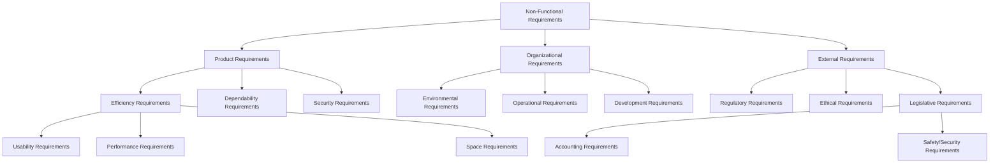
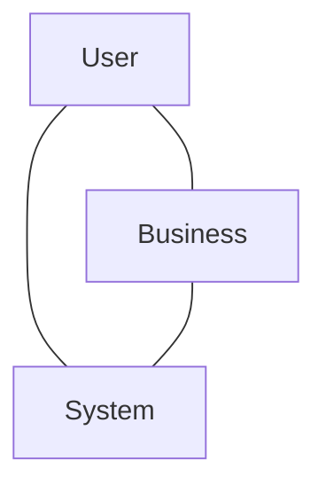
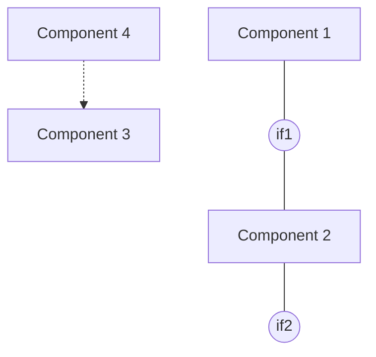
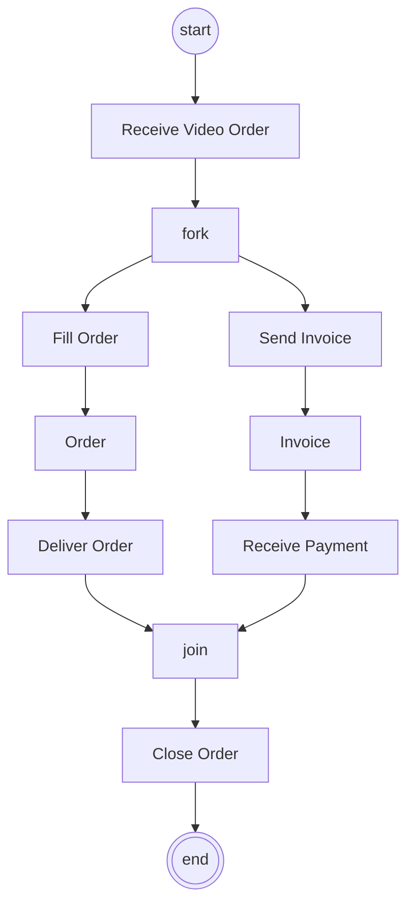
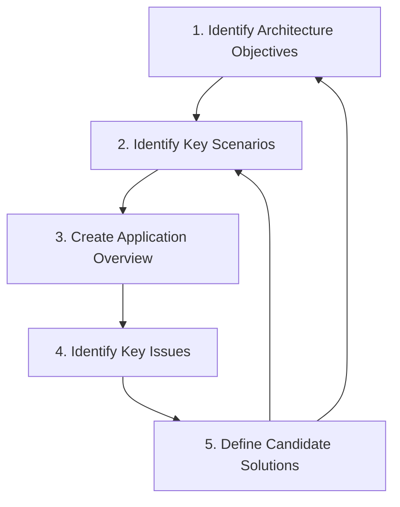

# Uge 4.1 — Software Architecture: Concepts and Process (del 1)

## Metadata

| Felt | Værdi |
|---|---|
| **Lektion** | Uge 4 — Software Architecture: koncepter og proces (del 1 af 2) |
| **Kursus** | Softwaredesign (SW4SWD-01) |
| **Forelæser** | Henrik Bitsch Kirk (HK) — slides udarbejdet af Claudio Gomes |
| **Kilde** | `1-SW-Architecture - Process 1.pdf` (68 sider, version 1.0.1) |
| **Sprog/kode** | C# |
| **Emner dækket** | Definitioner på software architecture, architectural decisions, architectural drivers, functional/non-functional requirements, quality attributes (ISO 25010), \*-ilities, arkitektur som kompromis, stakeholder-views (User/Business/System), architecture som substantiv og verbum (structure/behavior), UML-diagrammer til struktur og adfærd, SOLID på modulniveau, design vs. architecture, Design Stamina Hypothesis, modeller og abstraktion, RUP, Microsofts 5-trins arkitekturproces, Architecture Decision Record (ADR), VideoFlix-øvelsen |

---

## Agenda

Forelæsningen er bygget op om tre spørgsmål — og et fjerde der sniger sig ind undervejs:

1. **What** — hvad er software architecture? (og hvordan forudsiger man fremtiden)
2. **Why** — hvorfor overhovedet arkitektere?
3. **How much** — hvor meget arkitektur er nok?
4. **How** — hvordan arkitekterer man i praksis?

> Slide 3

---

## 1. Hvad er software architecture?

Der findes ingen kanonisk definition. Sliderne præsenterer i stedet fire citater fra to autoriteter i feltet, og pointen er netop at de peger på det samme uden at være enige om ordlyden.

### 1.1 Martin Fowler

> "…the decisions that you **wish** you could get right early"

> Slide 5

> "…the important stuff. Whatever that is."

> Slide 6

Fowlers to formuleringer er bevidst upræcise. Arkitektur er ikke en bestemt type artefakt, men den delmængde af beslutningerne som man gerne ville have ramt rigtigt fra starten — fordi de er dyre at ændre senere.

### 1.2 Simon Brown

> "…it's anything and everything related to the significant elements of a software system; from the structure and foundations of the code through to the successful deployment of that code into a live environment."

> Slide 7

Brown udvider scopet: arkitektur stopper ikke ved kodestrukturen, men rækker hele vejen til deployment i et produktionsmiljø.

> "The architectural decisions are those that you can't reverse without some degree of effort. Or, put simply, they're the things that you'd find hard to refactor in an afternoon."

> Slide 8

Dette er den mest operationelle definition i hele decket. **Eftermiddagstesten:** kan du refaktorere beslutningen om på én eftermiddag? Så er den ikke arkitektonisk. Kan du ikke, er den.

> "…architecture provides structure, firm foundations, vision and technical leadership"

> Slide 9 (kilde: *The Frustrated Architect*, https://www.infoq.com/presentations/The-Frustrated-Architect)

Bemærk at de sidste to — **vision** og **technical leadership** — ikke er tekniske egenskaber ved systemet, men rolleegenskaber ved arkitekten. Arkitektur er også en social funktion i et team.

---

## 2. Anekdoter om at forudsige fremtiden

Arkitektur handler i høj grad om at gætte på, hvad systemet skal kunne i morgen. To korte cases illustrerer hvor galt det kan gå.

**TV Show has a website [1].** Websitet bruges normalt til donationer, nyheder om showets karakterer osv. Antallet af besøgende er stabilt og lavt. Så nævner TV-værten henkastet "visit our website for a chance to win a prize" — og trafikken eksploderer. Arkitekturen var dimensioneret til det stabile, lave niveau.

> Slide 10

**Pinterest's growing pains [2].** Den oprindelige arkitektur var baseret på replikering af databasen. Den var utilstrækkelig og svær at skalere; Pinterest måtte senere gå over til sharding af deres MySQL-fleet.

> Slide 11

Begge cases opsummeres af Karl Kristian Steincke (dansk politiker og minister), citeret på sliden:

> "Det er vanskeligt at spå, især når det gælder Fremtiden." [3]

> Slide 10–11

Kilder på sliden:
[1] https://ilegra.com/en/two-examples-of-bad-software-architecture-that-had-a-negative-impact-on-businesses/
[2] https://medium.com/pinterest-engineering/sharding-pinterest-how-we-scaled-our-mysql-fleet-3f341e96ca6f
[3] https://quoteinvestigator.com/2013/10/20/no-predict/

---

## 3. Input til arkitekturen: architectural drivers

Sektionen "How to Predict the Future — An Introduction" (slide 12) handler reelt om, hvilke krav der driver arkitekturen.

### 3.1 Functional requirements

Functional requirements giver **meget "what" og meget lidt "how"**. Mange af dem har sandsynligvis lille indflydelse på den overordnede arkitektur, selv hvis de ændrer sig. De defineres typisk som **User Stories** eller **Use Cases**.

> Slide 13

Eksemplerne på sliden er graderet efter arkitektonisk impact:

| Krav | Impact |
|---|---|
| User shall be able to search for a video. | Little |
| User shall receive video recommendations. | Medium |
| User shall be able to login with Google, Facebook, or Apple, account. | Little |

> Slide 13

### 3.2 Non-functional requirements

Non-functional requirements ligger **tættere på "how"** end de funktionelle. Mange af dem er meget følsomme over for arkitekturen — og omvendt: hvis de ændrer sig, kan de have stor indflydelse på arkitekturen. De defineres ofte som **(kvantificerede) Quality Attributes**.

> Slide 14

| Krav | Impact |
|---|---|
| System shall play movies to 1000 users simultaneously. | Big |

> Slide 14

Forskellen mellem de to tabeller er hele pointen: et søgefelt kan man tilføje senere, men "1000 samtidige brugere" gennemsyrer hele designet.

### 3.3 Taksonomi over non-functional requirements

Sommerville (Software Engineering, 9th edition) opdeler non-functional requirements i tre hovedgrene. Strukturen på sliden er et træ:

> Slide 15 (kilde: Software Engineering, 9th edition — Ian Sommerville)

Eksemplet "System shall play movies to 1000 users simultaneously" hører hjemme under Performance Requirements.

### 3.4 Quality attributes — ISO 25010

ISO/IEC 25010 opdeler *software product quality* i otte karakteristika med hver deres underkarakteristika:

| Karakteristik | Underkarakteristika |
|---|---|
| **Functional Suitability** | Functional Completeness, Functional Correctness, Functional Appropriateness |
| **Performance Efficiency** | Time Behaviour, Resource Utilization, Capacity |
| **Compatibility** | Co-existence, Interoperability |
| **Usability** | Appropriateness Recognizability, Learnability, Operability, User Error Protection, User Interface Aesthetics, Accessibility |
| **Reliability** | Maturity, Availability, Fault Tolerance, Recoverability |
| **Security** | Confidentiality, Integrity, Non-repudiation, Authenticity, Accountability |
| **Maintainability** | Modularity, Reusability, Analysability, Modifiability, Testability |
| **Portability** | Adaptability, Installability, Replaceability |

> Slide 16 (kilde: http://iso25000.com/index.php/en/iso-25000-standards/iso-25010)

### 3.5 \*-ilities

Ud over ISO-standarden findes der en langt bredere — og mere kaotisk — liste af quality attributes. Wikipedias liste over system quality attributes rummer bl.a.:

accessibility, accountability, accuracy, adaptability, administrability, affordability, agility, auditability, autonomy, availability, compatibility, composability, configurability, correctness, credibility, customizability, debuggability, degradability, determinability, demonstrability, dependability, deployability, discoverability, distributability, durability, effectiveness, efficiency, evolvability, extensibility, failure transparency, fault-tolerance, fidelity, flexibility, inspectability, installability, integrity, interchangeability, interoperability, learnability, localizability, maintainability, manageability, mobility, modifiability, modularity, observability, operability, orthogonality, portability, precision, predictability, process capabilities, producibility, provability, recoverability, relevance, reliability, repeatability, reproducibility, resilience, responsiveness, reusability, robustness, safety, scalability, seamlessness, self-sustainability, serviceability (a.k.a. supportability), securability, simplicity, stability, standards compliance, survivability, sustainability, tailorability, testability, timeliness, traceability, transparency, ubiquity, understandability, upgradability, usability, vulnerability.

> Slide 17 (kilde: https://en.wikipedia.org/wiki/List_of_system_quality_attributes)

Titlen "\*-ilities" er selvironisk: langt de fleste af dem ender på *-ility*, og listen er så lang, at man ikke kan optimere efter dem alle.

---

## 4. Arkitekturen er et kompromis

Det er præcis her, det bliver et kompromis. Man kan ikke maksimere alle quality attributes samtidig — vælger man "fast", får man ikke "safe".

> Slide 18 (tegneserie: https://www.monkeyuser.com/2018/compromise/ — quiz via menti.com, kode 7156 6234)

### 4.1 Tre stakeholder-perspektiver

Et velspecificeret system rummer kravene og forventningerne fra tre overlappende stakeholder-grupper:

De tre cirkler i Venn-diagrammet — **User**, **Business** og **System** — overlapper hinanden; det er i overlappene, de interessante krav og konflikter ligger.

> Slide 19

Kravene og forventningerne beskrives som:

- **User Stories**
- **Quality Attributes**

> Slide 20

Og konklusionen:

> "The Architecture must be a compromise across these"

> Slide 21

Dette Venn-diagram går igen gennem hele resten af decket — det er den mentale ramme, som både architecture objectives (trin 1) og key scenarios (trin 2) skal spejles i.

---

## 5. Architecture som substantiv og verbum

Ordet bruges begge veje: *an architecture* og *to architecture* (eller *to architect*?).

| Ordklasse | Betydning |
|---|---|
| **As a noun** | structure (and behavior) |
| **As a verb** | process |

> Slide 23 (kilde: *Software Architecture for Developers* — Simon Brown)

Sliden ledsages af en tegneserie med replikken: *"I'll go talk to the stakeholders and find out their requirements... in the meantime, you guys start coding."* — en advarsel mod at springe arkitekturarbejdet over.

Resten af decket følger denne opdeling: først substantivet (structure og behavior), derefter verbet (processen).

---

## 6. Structure (and behavior)

> Slide 24

### 6.1 Fire spørgsmål til strukturen

Strukturarbejdet bygges op som en kæde af fire spørgsmål, som afsløres ét ad gangen:

1. **Examine the functional requirements and put functionality into 'boxes' or modules.** (slide 25)
2. **What belongs together?** (slide 26)
3. **What functionality depends on other functionality?** (slide 27)
4. **What should be exposed at the boundaries of the boxes?** (slide 28)

Spørgsmål 2 handler om cohesion, spørgsmål 3 om coupling og afhængighedsretning, spørgsmål 4 om interfaces og indkapsling.

### 6.2 Kasserne kan være UML-pakker

Et initial design for et data collection system består af fem pakker:

- Communication to devices
- DataStorage
- DataCollection
- Synchronization with remote server
- Web configuration

> Slide 29

På sliden er pakkerne tegnet uden indbyrdes relationer — det er en ren funktionsopdeling på dette stadie.

### 6.3 Eller UML-komponenter

Alternativt kan kasserne være UML-komponenter med eksplicitte interfaces. Diagrammet på sliden viser fire komponenter, hvor Component 1 og Component 2 forbindes via interfacet `if1`, Component 2 eksponerer `if2`, og Component 4 har en dependency (stiplet pil) til Component 3.

> Slide 30

Relevante UML-diagrammer til **struktur**:

- Package
- Deployment
- Component
- Composite structure

> Slide 30

### 6.4 SOLID på arkitekturniveau

SOLID-principperne gælder også på arkitekturniveau. Forskellen er blot, at man nu taler om **modules** og ikke om classes.

| Princip | Fuldt navn |
|---|---|
| **S** | Single Responsibility Principle |
| **O** | Open – Closed Principle |
| **L** | Lisskov's Substitution Principle |
| **I** | Interface Segregation Principle |
| **D** | Dependency Inversion Principle |

Målet er det samme som på klasseniveau:

> **High cohesion and Low coupling**

> Slide 31

(Stavemåden "Lisskov's" er slidens egen; principperne er de samme som i uge 2-materialet.)

---

## 7. Behavior

Struktur alene siger intet om, hvordan systemet faktisk kører. To spørgsmål driver adfærdsdelen:

- **How does data flow between the modules?**
- **What is the flow through the software?**

> Slide 32

### 7.1 Brug UML-diagrammer til adfærd

Eksemplet på sliden er et activity diagram med tre swimlanes — **Fulfillment**, **Customer Service** og **Finance** — for en videoordre:

*Receive Video Order* og *Close Order* ligger i Customer Service-banen, *Fill Order* og *Deliver Order* i Fulfillment, og *Receive Payment* i Finance. `Order` og `Invoice` er object nodes.

> Slide 33

Relevante UML-diagrammer til **adfærd**:

- Activity
- Sequence
- State
- Communication

> Slide 33

---

## 8. Design eller architecture?

Grænsen mellem design og arkitektur er glidende og bestemmes af kompleksitet. Sliden opstiller en akse fra lower til higher complexity:

| Niveau | Spørgsmål der besvares | Kursus |
|---|---|---|
| **Coding Ideoms** | How to iterate a collection | OPRG/OORG, ITS1-2 |
| **SW Design Patterns** | How to solve this common problem. | ITS3, SWD |
| **Application Architecture/Design** | How to group functionality? How are quality attributes met? | SWD |
| **System Architecture** | How to organize multiple interacting applications? | SWWAO |

> Slide 34

SWD ligger altså i midten: mønstre og applikationsarkitektur. Systemarkitektur på tværs af applikationer hører til SWWAO.

---

## 9. Why to architect?

> Slide 35

### 9.1 Design Stamina Hypothesis

Fowlers hypotese præsenteres i to trin. Først kun kurven for **No Design**: kumulativ funktionalitet vokser hurtigt i starten, men flader ud over tid — teknisk gæld bremser tilføjelsen af ny funktionalitet.

> Slide 36

Derefter tilføjes kurven for **Good Design**: den starter langsommere (man investerer i struktur), men vokser hurtigere og krydser No Design-kurven på et tidspunkt. Efter krydningspunktet er godt design ren gevinst.

> Slide 37 (kilde: http://martinfowler.com/bliki/DesignStaminaHypothesis.html)

Argumentet for at arkitekturere er altså ikke "godt design er pænere", men "godt design betaler sig efter et vist tidsrum". Er projektet kortere end krydningspunktet, gør det ikke.

---

## 10. How much to architect?

> Slide 38

### 10.1 Modeller

> "Everything should be made **as simple as possible, but not simpler.**"
> — Albert Einstein, Louis Zukofsky, Roger Sessions, William of Ockham

> Slide 39

En arkitektur er **et sæt af modeller**, og en model har tre karakteristika:

1. Must be based on the system
2. Must reflect **a relevant subset of the system's properties**
3. Can be used to think about the system, **in a limited context**

> Slide 39

Marginalnoten på sliden binder det sammen: *Figure out what the goal of the architecture is.*

Illustrationen er tre kort over London: et satellitkort (Google Maps), det officielle tube-kort med Themsen, og det rene topologiske tube-kort uden geografi. Alle tre er korrekte modeller af det samme system — de er blot abstraheret til forskellige formål. Skal du navigere med metro, er det topologiske kort bedst, selvom det er geografisk forkert.

Svaret på "how much to architect" er altså: så meget som formålet kræver, og ikke mere.

---

## 11. How to architect?

> Slide 40

### 11.1 Rational Unified Process (RUP)

RUP inddeler projektet i fire faser — **Inception**, **Elaboration**, **Construction** og **Transition** — og lader ni core workflows løbe med varierende intensitet gennem faserne.

De ni core process workflows:

| Type | Workflow |
|---|---|
| **Core Process Workflows** | Business Modeling |
| | Requirements |
| | Analysis & Design |
| | Implementation |
| | Test |
| | Deployment |
| **Core Supporting Workflows** | Configuration & Change Management |
| | Project Management |
| | Environment |

Pointen i grafen er, at *Analysis & Design* topper i Elaboration-fasen, men aldrig går helt i nul — arkitekturarbejdet fortsætter gennem Construction. Faserne gennemløbes i iterationer (Preliminary Iterations, iter#1, iter#2, … iter#m+1).

> Slide 41 (kilde: https://www.ibm.com/developerworks/rational/library/content/03July/1000/1251/1251_bestpractices_TP026B.pdf)

### 11.2 Microsofts arkitekturproces

Resten af forelæsningen følger Microsofts femtrinsproces, som er **iterativ og inkrementel**. Trin 2–5 danner en cyklus, og trin 1 sidder over cyklen med pile begge veje:

Hver iteration testes mod:

- requirements
- known constraints
- quality attributes

> Slide 42 (kilde: Microsoft Application Architecture Guide, 2nd Edition)

---

## 12. Trin 1 — Architecture objectives

### 12.1 Input

> "Goals and constraints shape your architecture and design process."

> Slide 43

Arkitekturen skal opfylde:

**Functional requirements**

> Slide 44

**Non-functional requirements**, opdelt som hos Sommerville:

- External requirements (e.g. standards)
- Organisational requirements
- Product requirements (quality attributes)

> Slide 45

Og til sidst:

> **Cross cutting concerns!**

> Slide 46

Cross-cutting concerns — logging, sikkerhed, fejlhåndtering, transaktioner — skærer på tværs af modulopdelingen og kan ikke placeres i én enkelt kasse. De skal derfor med i objectives.

### 12.2 Output

Hvem skal bruge outputtet af denne iteration?

- Management?
- Testers?
- Developers?
- Other architects?

> Slide 47

Og hvad er man egentlig i gang med?

- Creating a complete application design?
- Building a prototype?
- Examining technical risks?
- Testing potential options?
- Building shared models to gain an understanding of the system?

> Slide 48

Svaret på begge spørgsmål afgør, hvor detaljeret og hvilken slags arkitektur-artefakt iterationen skal producere. Bygger man en prototype, er kravene til dokumentationen helt anderledes end ved et komplet application design.

---

## 13. Trin 2 — Key scenarios

> "This is where use cases and quality attributes meet!"

At identificere dem kræver øvelse, men sliderne giver nogle pejlemærker.

> Slide 49

### 13.1 Hvad kvalificerer som key scenario?

- **Critical functionality.**
- **Critical non-functional reqs**
- **Exploration (unknown areas)**
- **Risk mitigation**

> Slide 50

### 13.2 Hvordan finder man dem?

> "Look for intersections between the user, business and system views."

> Slide 51

> "Prefer exercising multiple layers in the architecture when you select scenarios for the current iteration"

> Slide 52

Et key scenario, der kun rører ét lag, tester ikke arkitekturen. Et der går fra UI gennem forretningslogik til datalag, gør.

---

## 14. Trin 3 — Create an application overview

En application overview er **ét eller flere forslag til en arkitektur**.

> Slide 53

Fire konkrete opgaver:

1. **Determine your application type.**
2. **Identify your deployment constraints.**
3. **Determine relevant technologies.**
4. **Identify important architectural design styles.** — Use your toolbox of Architectural Patterns (mere i næste forelæsning)

> Slide 54

Arkitekturmønstre behandles altså ikke i dette deck; de er henvist til uge 4.2.

---

## 15. Trin 4 — Identify key issues

Key issues er **problemer, der skal løses med denne (version af) arkitekturen**.

> Slide 55

Konkret spørger man:

**E.g. Key Scenarios, are they solved?**

> Slide 56

**Pose relevant hypothetical future changes:**

- "Can I swap from one third party service to another?"
- "Can I add support for a new client type?"
- "Can I quickly change my business rules relating to billing?"
- "Can I migrate to a new technology for X?"

> Slide 57

**Try it out, analyze and document outcomes**

> Slide 58

De hypotetiske fremtidige ændringer er en direkte modgift mod Pinterest-problemet fra slide 11: man tvinger sig selv til at stress-teste arkitekturen mod ændringer, der endnu ikke er sket.

---

## 16. Trin 5 — Define candidate solutions

**Propose candidate solutions to key issues.**

> Slide 59

### 16.1 Evaluer mod baseline-arkitekturen

Evaluate against "baseline" architecture:

- Does this architecture succeed without introducing any new risks?
- Does this architecture mitigate more known risks than the previous iteration?
- Does this architecture meet additional requirements?
- Does this architecture enable architecturally significant use cases?
- Does this architecture address quality attribute concerns?
- Does this architecture address additional crosscutting concerns?

> Slide 60

Bemærk formuleringen: man sammenligner altid mod den forrige iterations arkitektur (baseline), ikke mod et abstrakt ideal. Er den nye kandidat ikke bedre end baseline på mindst ét af punkterne, er der ingen grund til at skifte.

### 16.2 Architectural spike

> "It may involve coding to validate assumptions (architectural spike)"

> Slide 61

En architectural spike er et lille stykke kode skrevet udelukkende for at afklare en teknisk antagelse — ikke for at ende i produktet.

---

## 17. Architecture Decision Record (ADR)

Arkitekturbeslutninger skal dokumenteres. Sliden viser IASA's ADR-skabelon (V3.07, 2020-11-29), der struktureres i felter:

| Felt | Indhold |
|---|---|
| **Date / Version** | Hvornår og hvilken version af beslutningen |
| **Name** | Navn på beslutningen |
| **Context** | Describe the forces at play, including technological, political, social, and project local. Describe the tensions & dependencies. Describe the facts as you know them |
| **Traceability** | This should link to an ASR or OKR. |
| **Scope and Tier** | How much of the enterprise is affected by the decision? What safety tier is impacted by this decision? |
| **Options** | Compare options by comparing 'areas'. Areas are the attributes such as cost, performance, etc. Use a number system from 1–10 for each option. Circle the final decision made. |
| **Characteristics** | What type of decision is this? Reversability (reversable ↔ irreversable), Duration (hrs ↔ yrs), Information Quality (0% ↔ 100%), Effort ($, time, people) (very small ↔ very large) |
| **Authority** | Decision-owner? (who owns the decision) · Decision-process? (how are we making this decision) · Decision style? (tell, sell, consult, agree, inquire, delegate) |
| **Linked Decisions** | What other decisions are related to this decision? |
| **Principles** | What principles impact the decision? |
| **Biases** | Are there any biases coloring the decision? |
| **Rationale & Consequences** | Why did we choose this option? Are there any side-effects or impacts resulting form this decision? |

> Slide 62 (V3.07 2020-11-29, contributors include Iasa and Gar Mac Críosta; CC BY-NC-SA 4.0)

Karakteristikken **Reversability** er direkte koblet til Simon Browns definition fra slide 8: jo mere irreversibel beslutningen er, jo mere arkitektonisk er den, og jo mere dokumentation fortjener den.

---

## 18. Communicate architecture

Behandles i næste forelæsning.

> Slide 63

---

## 19. Øvelse og hjemmearbejde: VideoFlix

### 19.1 Øvelse 1 og 2 (i timen)

**Identify key scenarios for a new video streaming service.**

Husk at objektivet for denne iteration er at **bygge en prototype**.

Brainstorming foregik i Padlet/Taskcards:
https://aarhusuni.taskcards.app/#/board/d30d672e-df28-4bf0-a34e-e5cd6bac4d9f?token=cc903f50-cd66-4747-8235-6ab65351c647

> Slide 64

Sliden viser både proceshjulet (trin 1–5) og User/Business/System-Venn-diagrammet i margen — det er de to værktøjer, øvelsen skal bruge.

Der følges op på key scenarios i plenum.

> Slide 65

Se den fulde øvelsesbeskrivelse i [../opgaver/SW4SWD-01_Architecture_Exercise_VideoFlix.md](../opgaver/SW4SWD-01_Architecture_Exercise_VideoFlix.md).

### 19.2 Øvelse 3 og 4 (hjemmearbejde)

**Identify *and quantify* quality attributes**

> Slide 66

**Quantifying the quality attributes means to make them measurable.**

Eksempel med scalability:

- "VideoFlix has to stream to a lot of viewers at the same time" ← You can't measure that…
- "VideoFlix has to stream the test video clip to 100.000 viewers in 1080p@30fps" ← This is measurable, even though it may be hard to execute the test.

> Slide 67

Kravet om målbarhed er hele forskellen mellem et ønske og et quality attribute. Et ikke-målbart kvalitetskrav kan ikke testes, og en arkitektur kan derfor ikke evalueres mod det.

> Slide 68 (Aarhus University-slide)

---

## 20. Referencer og billedkilder

**Video(s):**

- Martin Fowler — Making architecture matter: https://www.youtube.com/watch?v=DngAZyWMGR0
- Simon Brown — The Frustrated Architect: https://www.infoq.com/presentations/The-Frustrated-Architect

**Images(s):**

- Kalaha: https://www.lekolar.dk/sortiment/leg/spil-og-puslespil/bord-og-bratspil/kalaha/
- ADR: https://iasa-global.github.io/btabok/architecture_decision_record.html

> Slide 69

(Dilbert-striben på slide 1: http://dilbert.com/strip/2013-02-24 — "code mocking" som ingeniørtradition, hvor den nye udvikler skal håne forgængerens kode offentligt. Nogle gange vinder koden.)

---

## Opsummering

- **Arkitektur er de beslutninger, der er dyre at rulle tilbage.** Simon Browns eftermiddagstest er den mest brugbare operationelle definition: kan du refaktorere det på en eftermiddag, er det ikke arkitektur.
- **Architectural drivers er functional requirements, non-functional requirements (quality attributes) og constraints.** Functional requirements påvirker sjældent arkitekturen; quality attributes gør næsten altid.
- **Arkitekturen er nødvendigvis et kompromis** mellem User-, Business- og System-perspektiverne. Man kan ikke maksimere alle \*-ilities samtidig.
- **Ordet bruges både som substantiv (structure og behavior) og som verbum (proces).** Struktur modelleres med package/component/deployment/composite structure-diagrammer, adfærd med activity/sequence/state/communication.
- **SOLID gælder også på modulniveau** — målet er stadig high cohesion og low coupling.
- **Design Stamina Hypothesis** begrunder investeringen i design: godt design betaler sig efter krydningspunktet, ikke før.
- **En arkitektur er et sæt modeller**, hvor hver model kun afspejler en relevant delmængde af systemets egenskaber i en begrænset kontekst — som London-tube-kortet.
- **Microsofts femtrinsproces** (objectives → key scenarios → application overview → key issues → candidate solutions) er iterativ og inkrementel, og hver iteration testes mod requirements, constraints og quality attributes.
- **Quality attributes skal kvantificeres** for at kunne testes: "mange brugere" er ubrugeligt, "100.000 viewers i 1080p@30fps" kan måles.
- **Arkitekturbeslutninger dokumenteres i en ADR** med context, options, karakteristik (bl.a. reversability), authority og rationale/consequences.
