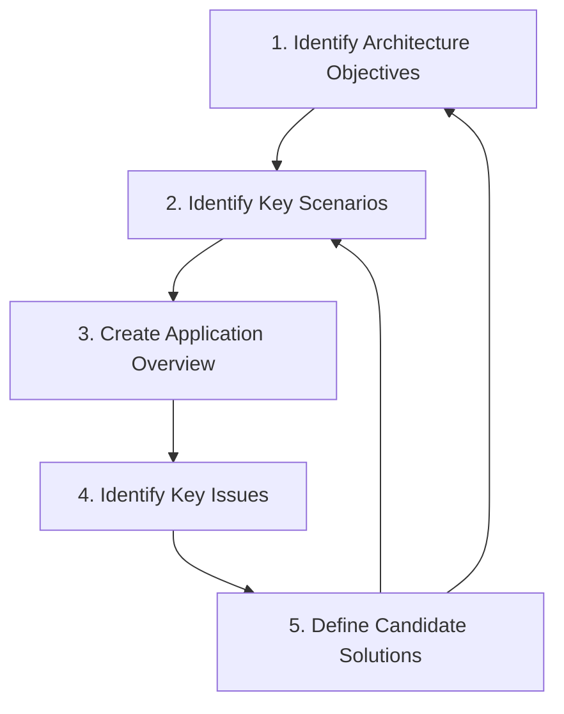
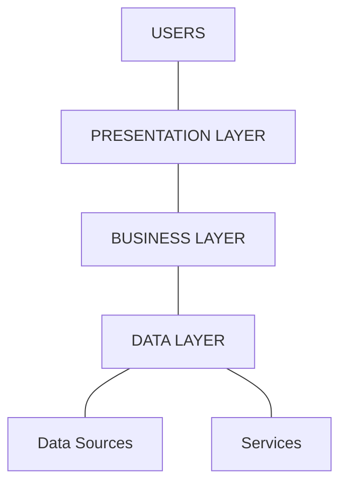
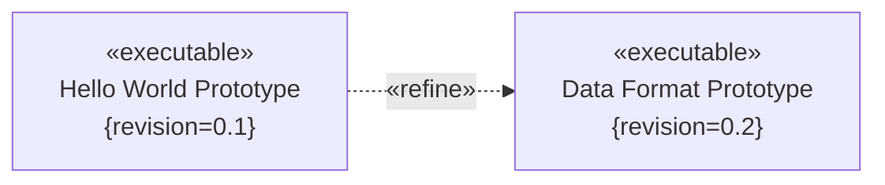
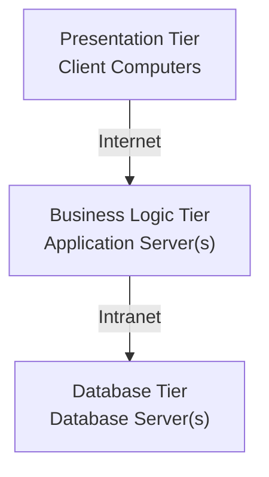
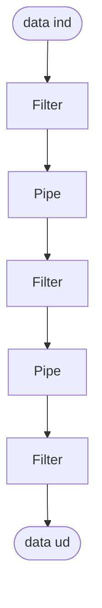
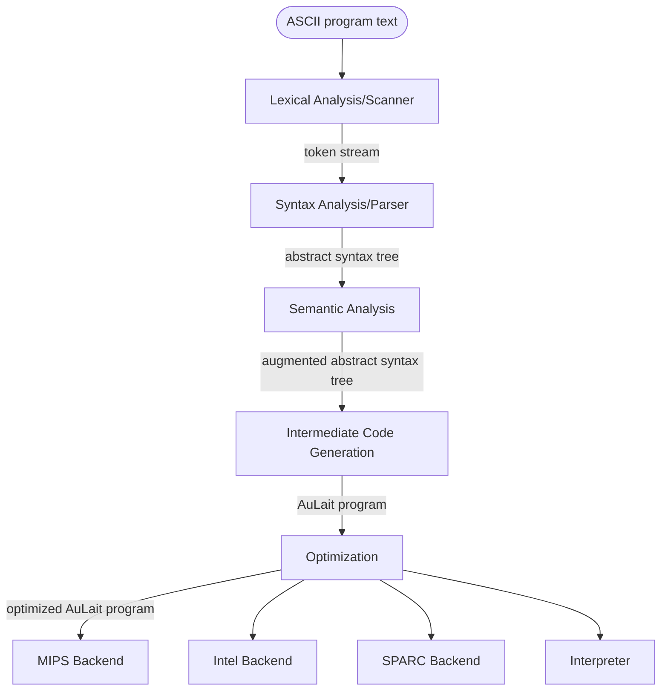
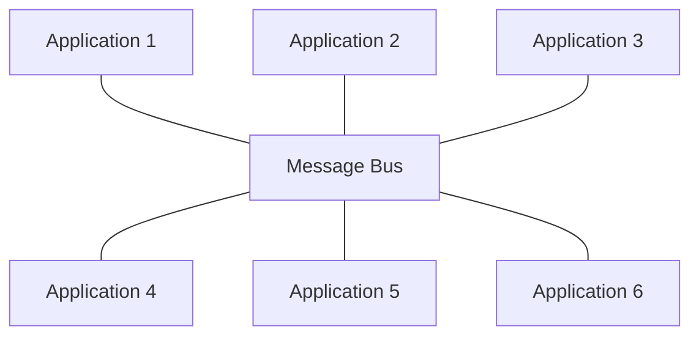
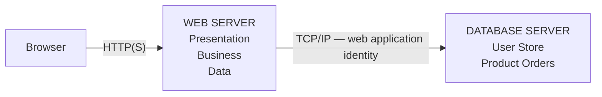

# Uge 4.2 — Software Architecture: Architectural Styles og resten af processen

## Metadata

| Felt | Værdi |
|---|---|
| **Lektion** | Uge 4, anden forelæsning — Software Architecture: Architectural styles and more process |
| **Kursus** | Softwaredesign (SW4SWD-01) |
| **Forelæser** | Henrik Bitsch Kirk (HK) — slides krediteret Claudio Gomes |
| **Kilde** | `2-SW-Architecture - Process 2.pdf` (69 slides, nummereret 1–75 i deck'et) |
| **Sprog/kode** | C# (dette deck indeholder ingen kode) |
| **Emner dækket** | No Silver Bullet, recap af arkitekturprocessen, quality attributes, architectural styles (Layers, Client/Server, N-Tier, Pipes and Filters, Message Bus), VideoFlix key scenarios og quality attributes, Application Overview, Exercise 5 |

Dette deck er anden halvdel af arkitekturblokken. Første halvdel — hvad arkitektur er, arkitektens rolle, stakeholders, views, Microsofts fem procestrin i detaljer — er dækket i `SW4SWD-01_W04.1_Architecture_Process_1.md`. Her recappes trin 1–5 kort, hvorefter fokus flyttes til **værktøjskassen**: de architectural styles man vælger imellem, når man skal producere artefaktet **Application Overview** (procestrin 3). Casen er VideoFlix; opgaveinputtet ligger i `../opgaver/SW4SWD-01_Application_Overview_Input.md`.

---

## Agenda

1. Recap of the first steps in the architecture process
2. Architectural styles
   - Layers — Concerns partitioned in layers
   - Client-server — the client makes requests to the server
   - N-tier — Similar to layers, but each layer is in a separate computer
   - Pipes and filters — data flows and gets transformed in a pipeline
   - Message bus — applications interact via a communication channel
3. Quality attributes for videoflix prototype
4. The next step in the architectural process
5. Exercise: create an application overview

> Slide 4

---

## 1. No Silver Bullet — essential vs. accidental complexity

Deck'et åbner med Walt Kelly-striben ("Yep, son, we have met the enemy and he is us") som kilden til citatet i slutningen af Martin Fowlers artikel.

> Slide 1

Herefter Brooks' skelnen mellem to slags kompleksitet:

| | Essential Complexity | Accidental Complexity |
|---|---|---|
| **Hvad** | The Problem is complex | The Solution is complex |
| **Kan fjernes?** | Cannot be refactored away | Can be refactored away |
| **Udvikling over tid** | Can increase over time, and sometimes faster than we can invent better ways to solve the problem | Hopefully decreases as we invent better ways to solve the problem |
| **Eksempler** | — | invention of high level programming languages; automatic memory management with garbage collection; actor model for concurrency |

Kilde: Brooks, Frederick P. "No Silver Bullet." *Software State-of-the-Art*, 1975, 14–29.

> Slide 2

Pointen for arkitektur: den kompleksitet arkitekturen kan fjerne, er den accidental. Den essentielle skal arkitekturen strukturere, ikke bortforklare.

---

## 2. Recap: arkitekturprocessen fra Microsoft

Processen er **iterativ og inkrementel**. Hver iteration testes mod:

- requirements
- known constraints
- quality attributes

Trin 1 (Identify Architecture Objectives) ligger uden for cyklussen og fodrer ind i den; trin 2–5 kører rundt: Identify Key Scenarios → Create Application Overview → Identify Key Issues → Define Candidate Solutions → tilbage til Key Scenarios, og med feedback op til Architecture Objectives.

> Slide 6 — Source: Microsoft Application Architecture Guide, 2nd Edition

### 2.1 Trin 1: Architecture objectives — input

"Goals and constraints shape your architecture and design process."

The architecture must satisfy:

- Functional requirements
- Non-functional requirements
  - External requirements (e.g. standards)
  - Organizational requirements
  - Product requirements (quality attributes)
- Cross-cutting concerns!

Sliden viser tre overlappende cirkler: **User**, **Business**, **System** — de tre perspektiver krav kommer fra.

> Slide 7

### 2.2 Trin 1: Architecture objectives — output

Hvem skal bruge output fra denne iteration?

- Management?
- Testers?
- Developers?
- Other architects?

Og hvad laver du egentlig:

- Creating a complete application design?
- Building a prototype?
- Examining technical risks?
- Testing potential options?
- Building shared models to gain an understanding of the system?

> Slide 8

Formålet bestemmer detaljeringsgraden. En prototype-iteration skal ikke levere samme artefakt som en komplet applikationsdesign-iteration.

### 2.3 Trin 2: Key scenarios

"This is where use cases and **quality attributes** meet!"

> Slide 9

Pointers til at identificere dem:

- Critical functionality
- Critical non-functional reqs
- Exploration (unknown areas)
- Risk mitigation

Og:

> Look for intersections between the user, business, and system views.
>
> Prefer exercising multiple layers in the architecture when you select scenarios for the current iteration.

> Slide 10

### 2.4 Quality attributes — ISO 25010

Software product quality-træet fra ISO/IEC 25010 med otte karakteristika:

| Karakteristik | Underkarakteristika |
|---|---|
| Functional Suitability | Functional Completeness, Functional Correctness, Functional Appropriateness |
| Performance Efficiency | Time Behaviour, Resource Utilization, Capacity |
| Compatibility | Co-existence, Interoperability |
| Usability | Appropriateness Recognizability, Learnability, Operability, User Error Protection, User Interface Aesthetics, Accessibility |
| Reliability | Maturity, Availability, Fault Tolerance, Recoverability |
| Security | Confidentiality, Integrity, Non-repudiation, Authenticity, Accountability |
| Maintainability | Modularity, Reusability, Analysability, Modifiability, Testability |
| Portability | Adaptability, Installability, Replaceability |

Kilde: <http://iso25000.com/index.php/en/iso-25000-standards/iso-25010>

> Slide 11

Microsofts egen liste (uddybet i kapitel 16 af *Microsoft Application Architecture Guide, 2nd Ed.* på Brightspace): Availability, Conceptual Integrity, Interoperability, Maintainability, Manageability, Performance, Reliability, Reusability, Scalability, Security, Supportability, Testability, User Experience / Usability.

> Slide 12

### 2.5 Selected QA for Course

Denne tabel går igen som refræn gennem hele deck'et — den vises efter hver enkelt architectural style, så man selv kan vurdere, hvilke quality attributes stilen understøtter eller modarbejder.

| Quality Attribute | Explanation |
|---|---|
| Development cost | Reusability. Low complexity – in spite of size |
| Development time | Modular. Time to market – work in parallel |
| Testability | Test principles – from unit tests to acceptance test |
| Maintainability | How easy is it to correct, change and expand |
| Availability | Reliability. 99,99… % |
| Manageability | How easy is it to operate it on a day to day basis |
| Performance | Latency (delay until the first answer); Throughput (how many users can it support) |
| Scalability | Can performance grow? Can the system be downgraded? Is it dynamically scalable? |
| Security | Protect data (protect against unauthorized reading and writing); Protect the system |
| User Experience | User friendliness/experience |

> Slides 13, 30, 40, 48, 56, 61 (samme tabel gentaget)

### 2.6 Trin 3: Create an application overview

- Det er ét eller flere forslag til en arkitektur
- Determine your application type
- Identify your deployment constraints
- Determine relevant technologies
- Identify important architectural design styles

Sliden markerer det sidste punkt som "Topic for today's lecture".

> Slide 14

### 2.7 Trin 4: Identify Key Issues

Key Issues er problemer, der skal løses med denne (version af) arkitekturen. F.eks.: er Key Scenarios overhovedet løst?

Stil relevante hypotetiske fremtidige ændringer:

- "Can I swap from one third party service to another?"
- "Can I add support for a new client type?"
- "Can I quickly change my business rules relating to billing?"
- "Can I migrate to a new technology for X?"

Prøv det af, analysér, og dokumentér udfaldet.

> Slide 15

### 2.8 Trin 5: Define Candidate Solutions

Foreslå kandidatløsninger til key issues og evaluér dem mod "baseline"-arkitekturen:

- Does this architecture succeed without introducing any new risks?
- Does this architecture mitigate more known risks than the previous iteration?
- Does this architecture meet additional requirements?
- Does this architecture enable architecturally significant use cases?
- Does this architecture address quality attribute concerns?
- Does this architecture address additional crosscutting concerns?

Det kan kræve kodning for at validere antagelser — en **architectural spike**.

> Slide 16

---

## 3. Architectural styles — værktøjskassen

"Stand up and jump twice." Derefter: Application overview — Architectural styles — The toolbox for the Application Overview.

> Slide 17

### 3.1 Definition (Garlan og Shaw)

> "…a family of systems in terms of a pattern of structural organization. More specifically, an architectural style determines the vocabulary of components and connectors that can be used in instances of that style, together with a set of constraints on how they can be combined. These can include topological constraints on architectural descriptions (e.g., no cycles). Other constraints—say, having to do with execution semantics—might also be part of the style definition."

[David Garlan and Mary Shaw, January 1994, CMU-CS-94-166, "An Introduction to Software Architecture", <http://www.cs.cmu.edu/afs/cs/project/able/ftp/intro_softarch/intro_softarch.pdf>]

> Slides 18–19 (samme citat vist to gange)

Tre ting definerer altså en style: **vocabulary of components**, **connectors**, og **constraints** på hvordan de må kombineres.

### 3.2 Kategorier efter focus area

| Kategori | Styles | Fokus |
|---|---|---|
| Structure | Layered, Component-based, Object Oriented | Mostly concerned with code |
| Domain | Domain Driven Design | ↕ |
| Communication | Message Bus, SOA, *Event driven*, *CQRS* | ↕ |
| Deployment | Client/Server, N-Tier / 3-Tier, *Microservice*, *Serverless* | Mostly concerned with (physical) structure |

Aksen går fra kode-nær (Structure) i toppen til fysisk struktur (Deployment) i bunden. Kursiverede navne er tilføjelser ud over [MS AAG].

> Slide 20

### 3.3 Styles kombineres

> The architecture of a software system is almost never limited to a single architectural style but is often a combination of architectural styles that make up the complete system.
>
> For example, you might have a message bus design composed of services developed using a layered architecture approach.

> Slide 21

Det er den vigtigste enkeltpointe i deck'et til eksamen: valget er ikke "hvilken én", men "hvilken kombination, og hvor i systemet".

De fem styles deck'et gennemgår: Layers, Client-server, N-tier, Pipes and filters, Message bus.

> Slide 22

---

## 4. Layers

### 4.1 Princip

Partitionerer applikationens concerns i stakkede grupper (layers) af classes/packages/modules/subsystems.

- Dependencies er kun tilladt fra højere layer til lavere layer — samme idé som fra DIP, Dependency Inversion Principle.
- "Don't get confused — this doesn't mean that data cannot flow up!" Decoupling er vigtigt, f.eks. via events. Det lavere layer skal kunne fungere uden det højere.

Strukturen på sliden: USERS øverst, derunder PRESENTATION LAYER, derunder BUSINESS LAYER, derunder DATA LAYER; DATA LAYER er forbundet nedad til Data Sources og til Services.

> Slide 24 — Source: Microsoft Application Architecture Guide, 2nd Edition

### 4.2 Layer vs. Tier

- **Layers** er en logisk separation.
- **Tier** repræsenterer en fysisk separation.

Andre eksempler på lagdeling:

- MVC — Model-View-Control
- MVVM — Model-View-ViewModel
- Boundary-Control-Domain/Entity
- Network Layers (ISO OSI model)

> Slide 25

### 4.3 Iterativ udvikling af layers

To executable-komponenter vist side om side: "Hello World Prototype {revision=0.1}" og "Data Format Prototype {revision=0.2}", forbundet af en «refine»-afhængighed. Begge indeholder de samme seks lag ovenfra og ned: Application layer, Presentation layer, Session layer, Transport layer, Network layer, Data Link layer. I revision 0.2 er der tilføjet nye (blåt markerede) elementer i Application layer, Presentation layer og Data Link layer.

Overskriften på pilen er **vertical slices**: hver iteration tilføjer funktionalitet på tværs af flere lag i stedet for at færdiggøre ét lag ad gangen.

> Slide 26

### 4.4 Benefits of Using Layers

- **Separation of concerns (SRP)** — separation of application-specific from general services; separation of high-level from low-level services
- Reduces coupling and dependencies
- Improves cohesion
- **Increases potential reuse** — lower layers can easily be reused in other applications
- Increases clarity
- Concurrent development by teams is aided by the logical segmentation
- **A layer can be replaced** — if interfaced based programming and dependency injection is used
- Testing is easier

> Slide 27

### 4.5 Typical Layers for a small Application (Larman fig. 13.2)

Tre pakkelag med hver sine underpakker:

| Lag | Pakke | Underpakker |
|---|---|---|
| GUI | UI | Swing, Web |
| BLL | Domain | Sales, Payments, Taxes |
| DAL | Technical Services | Persistence, Logging, RulesEngine |

Noten på sliden ved `Swing`: "not the Java Swing libraries, but our GUI classes based on Swing".

Afhængighederne, der kan aflæses entydigt: `Swing` → `Domain` (Payments-området), `Domain` → `Technical Services` (Logging), og `Web` → `Technical Services` (Logging). Bemærk at UI-laget må springe Domain over og gå direkte til en teknisk service som Logging — logging er en cross-cutting concern.

> Slide 28

### 4.6 Det fulde MS AAG-lagdiagram

Den udvidede version tilføjer et **Services layer** og eksplicitte cross-cutting concerns:

| Element | Indhold |
|---|---|
| USERS | (aktør, forbundet til Presentation Layer) |
| EXTERNAL SYSTEMS | Service Consumers (forbundet til Services Layer) |
| PRESENTATION LAYER | UI Components, Presentation Logic Components |
| SERVICES LAYER | Service Interfaces, Message Types |
| BUSINESS LAYER | Application Façade; Business Workflow, Business Components, Business Entities |
| DATA LAYER | Data Access Components, Data Helpers/Utilities, Service Agents |
| (under DATA LAYER) | Data Sources, Services |
| CROSS-CUTTING (lodret søjle ved siden af alle lag) | Security, Operational Management, Communication |

Cross-cutting-søjlen løber på tværs af alle fire lag — den er netop ikke placeret i ét lag.

> Slide 29 — Image source: [MS AAG]

---

## 5. Client/Server

Stilen bygges op punkt for punkt over slides 32–38, med samme billede: én Server i midten, fire Clients omkring, dobbeltrettede pile mellem hver client og serveren.

### 5.1 Egenskaber

- A client initiates a request, waits for reply, and processes the replies on receipt
- Some kind of network connects the clients and servers
- Multiple clients connect to the same server: **Many to One**
- The Client and the Server have **different roles**
- The clients can vary from **thin to thick clients** based on how much they must process themselves

> Slides 32–36

### 5.2 Rollefordeling

| The server can | The client can |
|---|---|
| Handle the request | Handle user input |
| Save and serve data | Assemble the request |
| Calculate or process data | Receive the data |
| | Process and/or display data |

> Slides 37–38

### 5.3 2-Tier

> This is aka 2-Tier Architectural Style

> Slide 39

Client/server er altså det simpleste tilfælde af N-tier: præsentation på klienten, data og logik på serveren.

---

## 6. N-Tier

Sliden åbner med ordbogsopslaget:

> (EN-EN): tier, n., row, rank, esp. one of several placed one above another as in a theatre
>
> (EN-DK): tier [tiə] sb (trinvis opstigende) række; etage, lag

> Slide 41

### 6.1 Princip

Er en client–server-arkitektur, hvor presentation, application processing og data management-funktioner er **fysisk** adskilt.

- a **tier** is a physical structuring mechanism for the system infrastructure
- a tier executes on a **node** (a processing unit)

> **Important! The software running on a tier may itself consist of multiple layers.**

> Slides 42–44

Deployment-diagrammet på slide 44 viser tre tiers adskilt af netværksgrænser:

> Slide 44

Bemærk sammenhængen med afsnit 4.2: layers er logisk, tiers er fysisk, og en enkelt tier kan indeholde hele lagkagen fra afsnit 4.6.

### 6.2 N-Tier Advantages

| Fordel | Begrundelse |
|---|---|
| **Scalability** | The Application Servers can be deployed on many machines. The Database no longer requires a connection from every client |
| **Reusability** | E.g. different types of clients (web/mobile/other systems) can connect to the same backend |
| **Data Integrity** | The business logic tier can ensure that only valid data is allowed to be updated in the database |
| **Improved Security** | Since the client doesn't have direct access to the database, Data layer is more secure. Business Logic is generally more secure since it is placed on a secured central server |
| **Reduced Distribution** | Changes to business logic only need to be updated on application servers and need not to be distributed on clients |
| **Improved Availability** | Mission Critical Applications can make use of redundant application servers and redundant database servers, so it can recover from network or server failures |

> Slide 46

### 6.3 N-Tier Disadvantages

**Increased Complexity / Effort:**

- In General N-tier Architecture is more complex to build compared to 2-tier Architecture
- Communication between tiers has to be defined, developed, and evolved
- Servers may crash and communication may fail or be slow
- Security has to be considered at all boundaries and also in the communication

> Slide 47

Prisen for scalability og security er altså kompleksitet i kommunikationen og flere fejlkilder — den afvejning er præcis den, Application Overview skal dokumentere.

---

## 7. Pipes and Filters

"Stand up and shake your arms." Derefter Pipes and Filters med en anekdote-henvisning.

> Slide 49

### 7.1 Princip

- A structure for systems that process a stream of data
- Each processing step is encapsulated in a **filter** component
- Data is passed through **pipes** between adjacent filters
- Recombining filters allows you to build **families of related systems**

Diagrammet viser skiftevis filter-komponenter og pipes lodret nedad; pilene viser dataflow (note på sliden: "Arrows show data flow").

> Slide 50 — Source: Pattern-Oriented Software Architecture, Vol 1

### 7.2 Implementation

1. Divide the system's task into a sequence of processing stages.
2. Define the data format to be passed along each pipe.
3. Decide how to implement each pipe connection.
4. Design and implement the filters.
5. Design error handling.
6. Set up the processing pipeline.

> Slide 52 — Source: Pattern-Oriented Software Architecture, Vol 1

### 7.3 Eksempel: thumbnails

Producing thumbnails of images in stages: **Load image > scale image > filter image > display image**.

Slide 51 viser den **sekventielle** udførelse af 4 billeder: hvert billede gennemløber Load → Scale → Filter → Display, og først når ét billede er færdigt, starter det næste. Fire trin gange fire billeder = 16 tidsenheder.

> Slide 51

Slide 53 tilføjer den **pipelinede** variant nedenunder — throughput × 4. Hvert trin får sin egen tråd:

| Stage | Tråd |
|---|---|
| Load | Thread 1 |
| Scale | Thread 2 |
| Filter | Thread 3 |
| Display | Thread 4 |

Mens billede 2 loades, skaleres billede 1 osv. Latency for det enkelte billede er uændret; det er **throughput** der firedobles. Det er koblingen tilbage til threading-stoffet i kurset: pipes and filters er en arkitekturstil, der direkte muliggør parallelisering, fordi filtrene ikke deler tilstand.

> Slide 53

### 7.4 Eksempel: compiler

Another example could be a compiler. Kæden med dataformatet på hver pipe:

> Slide 54 — Source: Pattern-Oriented Software Architecture, Vol 1

De fire backends efter Optimization er netop "families of related systems": samme frontend-filtre genbruges, kun det sidste filter udskiftes.

---

## 8. Message Bus

### 8.1 Princip

- A software system that can receive and send messages using one or more communication channels
- So that applications can interact **without needing to know specific details about each other**

Diagrammet: seks applikationer (Application 1–6) hængt på én vandret Message Bus — tre over, tre under.

> Slide 58 — Source: <https://msdn.microsoft.com/en-us/library/ff647328.aspx>

### 8.2 Tre nøgleelementer

Connect all applications through a logical component known as a message bus. A message bus specializes in transporting messages between applications. A message bus contains three key elements:

1. A set of agreed-upon **message schemas**
2. A set of common **command messages**
3. A **shared infrastructure** for sending bus messages to recipients

> Slide 59

### 8.3 Eksempel: trading-systemer

Sliden stiller point-to-point op mod message bus, før og efter tilføjelsen af et nyt system.

**Uden bus, før:** Trading System 1 og Trading System 2 er forbundet til hinanden og hver især til Portfolio Manager, Risk Analysis, Modeling, Trend Indicator og Ticker — et net af direkte forbindelser.

**Uden bus, efter:** Trading System 3 tilføjes, og der skal trækkes nye forbindelser til alle de samme modtagere plus til de to eksisterende trading-systemer. Antallet af forbindelser vokser kvadratisk.

**Med bus, før:** Trading System 1, Portfolio Manager og Trading System 2 hænger på bussen ovenfra; Risk Analysis, Modeling, Trend Indicator og Ticker hænger på nedefra.

**Med bus, efter:** Trading System 3 (markeret "New Trading System") tilsluttes bussen med én forbindelse. Ingen af de eksisterende systemer ændres.

> Slide 60 — Source: <https://msdn.microsoft.com/en-us/library/ff647328.aspx>

Det er hele argumentet for message bus i ét billede: N direkte forbindelser bliver til N tilslutninger, og udvidelse koster konstant arbejde i stedet for lineært voksende.

---

## 9. VideoFlix: key scenarios og quality attributes

Efter break vendes tilbage til casen fra tirsdagens forelæsning (uge 4.1).

### 9.1 Key scenarios fra tirsdag

Krav placeret i de tre views fra slide 7:

| View | Krav |
|---|---|
| **User** | The system have to stream with the same speed at any time |
| **Business** | System should always be up |
| **System** | The system can facilitate 1 million users at the same time |
| **System** | The system must have close to 100% uptime, to allow the users to watch movie at any time |

> Slide 63

### 9.2 Det destillerede key scenario

> Here, the key scenario for the prototype is to stream video to a lot of users, in a good-enough quality and to do so, share the load on multiple servers so we have little to no downtime.

> Slide 64

Bemærk hvordan de fire spredte krav koges ned til én sætning, der samtidig peger på en arkitekturbeslutning ("share the load on multiple servers"). Det er præcis det, trin 2 skal levere til trin 3.

### 9.3 VideoFlix prototype quality attributes

| Quality attribute (category) | Non-functional requirement | How to test? |
|---|---|---|
| Usability / Performance | Start streaming within 5 seconds of click | *(tom på sliden)* |
| Scalability | 1.000.000 users should be able to stream at the same time | *(tom)* |
| (Compatibility) | *(tom)* | *(tom)* |
| Performance | Start a new server when there is no response to requests in more than 3 seconds | *(tom)* |
| (Security) | Movies should be protected | *(tom)* |
| (Performance) | *(tom)* | *(tom)* |
| (Usability) | Must be learnable within 5 minutes of use of the average user | *(tom)* |

> Attributes in parentheses are important but not considered for the prototype.

> Slide 65

Kolonnen "How to test?" står tom på sliden — det er den, man selv skal udfylde. Et quality attribute uden en testbar formulering er ikke et krav, men en hensigt.

---

## 10. Application Overview — næste skridt i processen

Trin 3 i cyklussen. Artefaktet skal indeholde fire ting:

| Punkt | Indhold |
|---|---|
| **Application type** | mobile, web, service, embedded, … ? |
| **Deployment constraints** | infrastructure; quality attributes, consider: security, reliability, scaleability, performance |
| **Architectural style(s)** | valget fra værktøjskassen i afsnit 3–8 |
| **Technologies** | konkrete teknologier |

> Slides 66–68 — Source: Microsoft Application Architecture Guide, 2nd Edition

### 10.1 Eksempel på en Application Overview-skitse

Slide 68 viser en håndtegnet skitse af, hvordan resultatet kan se ud:

- **Browser** forbundet via **HTTP(S)** til **WEB SERVER**
- WEB SERVER indeholder tre bokse ovenfra og ned: **PRESENTATION**, **BUSINESS**, **DATA**
- WEB SERVER forbundet via **TCP/IP** (annoteret "WEB APPLICATION IDENTITY") til **DATABASE SERVER**
- DATABASE SERVER indeholder **USER STORE (USER NAMES & PASSWORDS)** og **PRODUCT ORDERS**
- Browser–webserver-strækningen er annoteret **FORMS AUTHENTICATION & ROLES**
- Databaseadgangen er annoteret **WINDOWS AUTHENTICATION & DATABASE ROLES**
- Webserveren ligger i et **PROTECTED NETWORK**

> Slide 68 — Source: Microsoft Application Architecture Guide, 2nd Edition

Skitsen kombinerer stilarterne: **layers** inde i webserveren (Presentation/Business/Data), **N-tier** mellem browser, webserver og databaseserver. Præcis den kombination slide 21 forudsagde. Og den viser, hvad "Deployment constraints" og "Technologies" betyder konkret — netværkszoner, protokoller og autentificeringsmekanismer tegnet ind på forbindelserne.

---

## 11. Exercise 5

> **Exercise 5:** Create an application overview for the prototype.
>
> Send your suggestion to haj@ece.au.dk

Pilen på procescirklen peger på **3. Create Application Overview**.

> Slide 69

Input til opgaven: `../opgaver/SW4SWD-01_Application_Overview_Input.md`.

---

## 12. References and image sources

Video(s):

- Martin Fowler — *Making architecture matter*: <https://www.youtube.com/watch?v=DngAZyWMGR0>
- Simon Brown — *The Frustrated Architect*: <https://www.infoq.com/presentations/The-Frustrated-Architect>

> Slide 75

Øvrige kilder brugt gennem deck'et: *Microsoft Application Architecture Guide, 2nd Edition* [MS AAG], *Pattern-Oriented Software Architecture, Vol 1*, Larman fig. 13.2, ISO/IEC 25010, Garlan & Shaw CMU-CS-94-166, Brooks "No Silver Bullet".

Slide 74 er AU-afslutningssliden uden fagligt indhold.

---

## Opsummering

- Arkitektur kan kun fjerne **accidental complexity**; den essentielle skal struktureres, ikke bortforklares. Det er rammen om hele værktøjskassen.
- En **architectural style** er defineret ved tre ting: vocabulary of components, connectors, og constraints på kombinationer. Styles kategoriseres efter focus area — Structure, Domain, Communication, Deployment — hvor Structure er kodenær og Deployment er fysisk.
- Rigtige systemer bruger **kombinationer** af styles, ikke én. Layers inde i en tier, tiers i et N-tier-setup, services på en message bus.
- **Layer er logisk, tier er fysisk.** Softwaren på én tier kan selv bestå af flere layers. Client/server er 2-tier.
- Hver style trækker forskellige **quality attributes**: N-tier giver scalability, security og availability til gengæld for kompleksitet; pipes and filters giver throughput og genbrug via parallelisering; message bus giver udvidelighed ved at gøre tilføjelse af et system til konstant arbejde i stedet for kvadratisk voksende.
- Artefaktet fra trin 3 er **Application Overview**: application type, deployment constraints, architectural style(s) og technologies — plus en skitse, hvor stilarter, netværkszoner og autentificering er tegnet ind.
- Et quality attribute uden en **testbar** formulering er ikke et krav. "How to test?"-kolonnen står tom i VideoFlix-tabellen med vilje.
