# Uge 5 — Software Architecture Documentation (del 1 og 2)

## Metadata

| Felt | Værdi |
|---|---|
| **Lektion** | Uge 5 — Software architecture documentation: abstraktionsniveauer (C4) og viewpoints (4+1) |
| **Kursus** | Softwaredesign (SW4SWD-01) |
| **Forelæser** | HAJ (slides af Claudio Gomes) |
| **Kilde** | `3-SW-Architecture - Documentation 1.pdf` (24 slides) + `4-SW-Architecture - Documentation 2.pdf` (41 slides) |
| **Sprog/kode** | C# |
| **Emner dækket** | Dokumentation som kommunikation, abstraktionsniveau, viewpoints, C4-modellen (System Context, Container, Component, Code), diagram guidelines, arkitekturprocessen (recap), 4+1 View Model (Kruchten), other views (data, security), architectural knowledge = design + decisions + goals/constraints, UML structural diagrams (use case, package, component, deployment), UML behavioral diagrams (sequence, communication, state machine, activity), mapping fra views til UML-diagramtyper, phases in the developer's life |

---

## Agenda

**Del 1 — Documentation 1**

1. Modelling a system: abstraktionsniveau og viewpoints
2. Dokumentation som kommunikation — shared language
3. Simon Browns C4-model: fire abstraktionsniveauer
4. Diagram guidelines
5. Recap af arkitekturprocessen (Microsoft) + øvelse

**Del 2 — Documentation 2**

6. Recap af C4-modellen
7. Architectural views — 4+1 View Model (Kruchten)
8. Other views (data, security)
9. Diagrams are not enough — architectural knowledge
10. UML structural diagram types
11. UML behavioral diagram types
12. Mapping af 4+1-views til UML-diagramtyper
13. How to become a good architect

> Del 1, slide 4 · Del 2, slide 3

**Krydsreferencer:** de to primære artikler bag ugens pensum behandles separat i `../artikler/SW4SWD-01_4plus1_View_Kruchten_1995.md`, `../artikler/SW4SWD-01_4plus1_View_UML2.md`, `../artikler/SW4SWD-01_C4_Model.md` og `../artikler/SW4SWD-01_C4_Talk_Simon_Brown.md`. Arkitekturprocessen selv er dækket i `SW4SWD-01_W04.1_Architecture_Process_1.md` og `SW4SWD-01_W04.2_Architecture_Process_2.md`.

---

# Del 1 — Documentation 1

## 1. Hvorfor dokumentation er svær: tegningen ingen forstår

Del 1 åbner med en tegneserie: en person i toget ser en anden tegne og forestiller sig, at det er kunst — men tegningen viser sig at være et UML-klassediagram med `Document`, `Book` og `EMail`. Pointen er, at arkitekturdiagrammer kun kommunikerer, hvis modtageren deler notationen og abstraktionsniveauet med afsenderen.

> Del 1, slide 2

Slide 5 viser "The Visual Architecting Process" (Bredemeyer Consulting, 2008) som en væg af håndtegnede artefakter: vision story, strategy map, stakeholder profile, capability model, business process models, use cases, system qualities, state diagram / interface protocol, conceptual architecture, logical architecture, execution architecture, interface template, test cases for system qualities. Budskabet: arkitekturarbejde er visuelt og skitsebaseret — grib whiteboardmarkeren.

> Del 1, slide 5

---

## 2. Find det rigtige abstraktionsniveau

Samme by kan tegnes på vidt forskellige niveauer. Sliderne stiller tre kort over London ved siden af hinanden: et satellitfoto fra Google Maps med alle veje, et fuldt tube map med zoner og en forenklet linjeføring uden geografisk korrekthed. Alle tre er "rigtige"; de svarer bare på forskellige spørgsmål. Det samme gælder arkitekturdiagrammer — abstraktionsniveauet er et valg, ikke en tilfældighed.

> Del 1, slide 6

## 3. … og identificér de relevante viewpoints

Derefter kommer tre kort over den *samme* by med forskellige viewpoints:

| Kort | Viewpoint | Hvad kortet svarer på |
|---|---|---|
| London Cycle Lane Map | Cyklistens rute | Hvor er der protected/semi-protected/unprotected cykelstier? |
| London Tube Map — rent prices | Boligøkonomi | Hvad koster husleje nær hver station? |
| London Underground — calorie map | Sundhed | Hvor mange kalorier bruges der mellem to stationer til fods? |

Underliggende netværk er identisk; det er *spørgsmålet*, der bestemmer viewet. Analogien overføres direkte til software: ét diagram kan ikke bære hele historien.

> Del 1, slides 8, 9, 10

---

## 4. Dokumentation er kommunikation

Slidens kernepåstand, ordret:

> "Software architecture documentation is essentially about communication *."
>
> "To communicate, we need a shared language: shared vocabulary, shared notation, shared understanding of abstraction level"
>
> Simon Brown: "Abstractions 1st, notation 2nd."

Fodnoten modificerer påstanden: `* Except on safety, traceability, and external assessment scenarios.` Med andre ord — i sikkerhedskritiske, sporbarheds- eller certificeringssammenhænge er dokumentationen også et formelt artefakt med selvstændig værdi, ikke kun et kommunikationsmiddel.

Rækkefølgen "abstractions first, notation second" er den bærende regel: bliv først enige om *hvad* kasserne betyder (system, container, component, class), og bagefter *hvordan* de tegnes.

> Del 1, slide 12

Overgangssliden opsummerer strukturen for ugen: **Documenting Abstraction Levels** med C4-modellen nu, og **documenting different viewpoints using 4+1 View Model** i næste lektion.

> Del 1, slide 13

---

## 5. C4-modellen — Simon Brown

C4 er fire zoom-niveauer over samme system. Sliden illustrerer det som en trappe, hvor hvert niveau er et "Zoom in" fra det foregående:

| Level | Navn | Element i fokus |
|---|---|---|
| 1 | **Context** | Software system + personer og eksterne systemer omkring det |
| 2 | **Containers** | Separat kørbare/deploybare enheder inde i systemet |
| 3 | **Components** | Strukturelle byggeblokke inde i én container |
| 4 | **Code** | Klasser/interfaces inde i én component (valgfrit) |

> Del 1, slide 14 · Del 2, slide 5

### 5.1 Abstraktionerne i C4

Ordret fra c4model.com, gengivet på sliden:

> A **software system** is made up of one or more **containers** (web applications, mobile apps, desktop applications, databases, file systems, etc), each of which contains one or more **components**, which in turn are implemented by one or more **code elements** (e.g. classes, interfaces, objects, functions, etc).

Hierarkiet er strengt indlejret — hver container hører til ét system, hver component til én container:

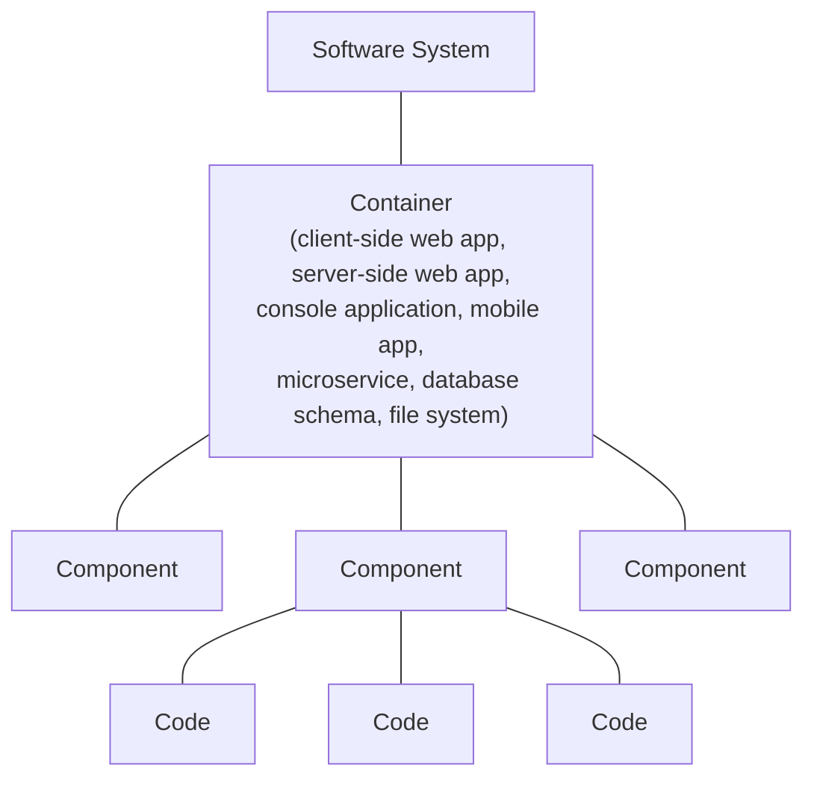

> Del 1, slide 15

### 5.2 Level 1: System Context diagram

> A zoomed out view showing a big picture of the system landscape.
>
> The focus should be on people (actors, roles, personas, etc) and software systems rather than technologies, protocols and other low-level details.
>
> It's the sort of diagram that you could show to non-technical people.

Eksemplet er *Internet Banking System*. Diagrammet indeholder fire elementer: en person (`Personal Banking Customer` — "A customer of the bank, with personal bank accounts"), det system, der dokumenteres (`Internet Banking System` — "Allows customers to view information about their bank accounts, and make payments"), og to eksterne systemer (`E-mail System` — "The internal Microsoft Exchange e-mail system"; `Mainframe Banking System` — "Stores all of the core banking information about customers, accounts, transactions, etc.").

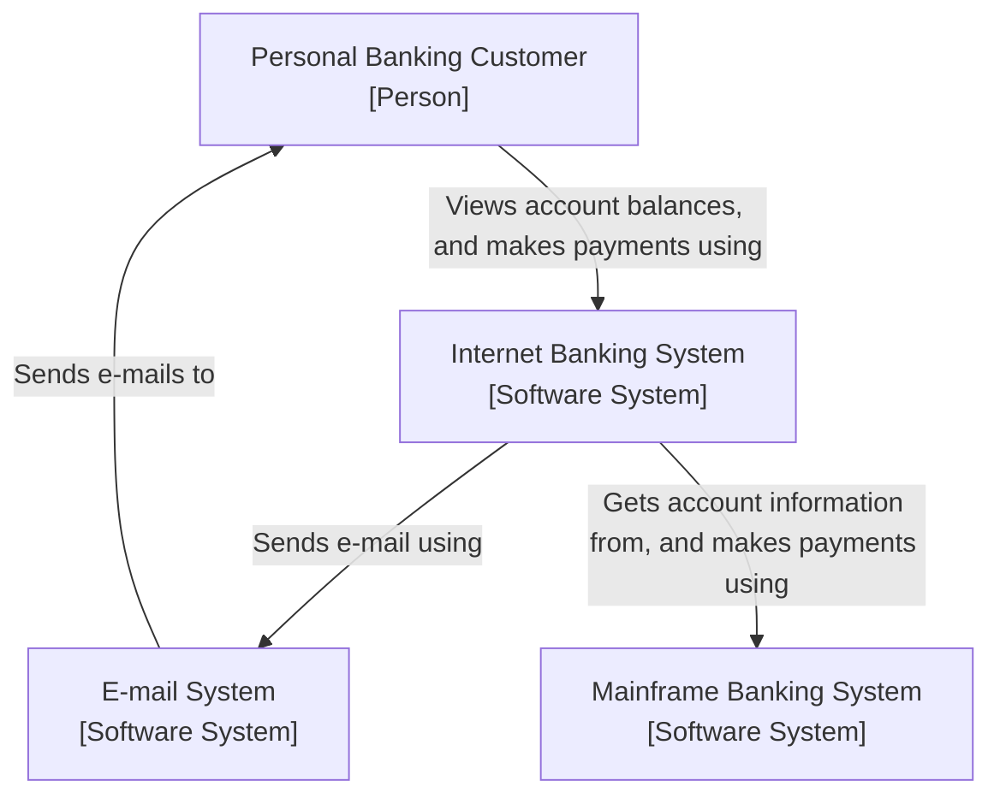

Bemærk at relationerne er navngivet i naturligt sprog, så pilen kan læses højt som en sætning — det er præcis det, diagram guidelines senere kræver.

> Del 1, slide 16

### 5.3 Level 2: Container diagram

> A container is a separately runnable/deployable unit (e.g. a separate process space) that executes code or stores data.
>
> The Container diagram shows the high-level shape of the software architecture and how responsibilities are distributed across it.
>
> It also shows the major technology choices and how the containers communicate with one another.

Internet Banking System dekomponeres i fem containere. Teknologivalget står i firkantparentes under navnet:

| Container | Teknologi | Ansvar |
|---|---|---|
| Web Application | Java and Spring MVC | Delivers the static content and the Internet banking single page application |
| Single-Page Application | JavaScript and Angular | Provides all of the Internet banking functionality to customers via their web browser |
| Mobile App | Xamarin | Provides a limited subset of the Internet banking functionality to customers via their mobile device |
| API Application | Java and Spring MVC | Provides Internet banking functionality via a JSON/HTTPS API |
| Database | Relational Database Schema | Stores user registration information, hashed authentication credentials, access logs, etc. |

Kommunikationen mellem dem, med protokol:

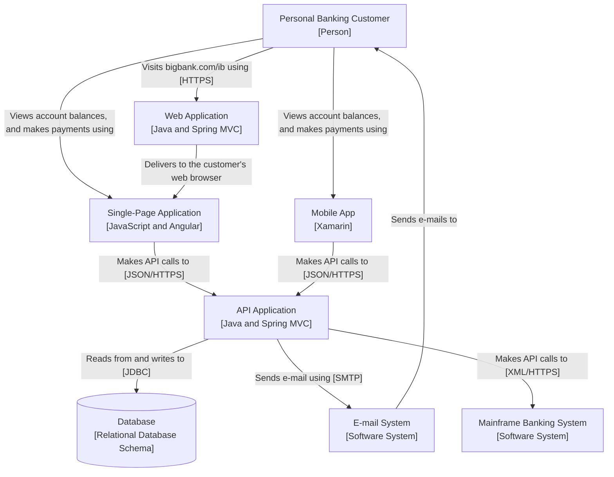

Container-niveauet er der, hvor teknologivalgene bliver synlige — det er også her, deployment og procesgrænser begynder at betyde noget.

> Del 1, slide 17

### 5.4 Level 3: Component diagram

> Zoom in and decompose each container further to identify the major structural building blocks and their interactions.
>
> The Component diagram shows how a container is made up of a number of "components", what each of those components are, their responsibilities and the technology/implementation details.

Eksemplet zoomer ind på `API Application`. Komponenterne:

| Component | Teknologi | Ansvar |
|---|---|---|
| Sign In Controller | Spring MVC Rest Controller | Allows users to sign in to the Internet Banking System |
| Reset Password Controller | Spring MVC Rest Controller | Allows users to reset their passwords with a single use URL |
| Accounts Summary Controller | Spring MVC Rest Controller | Provides customers with a summary of their bank accounts |
| Security Component | Spring Bean | Provides functionality related to signing in, changing passwords, etc. |
| E-mail Component | Spring Bean | Sends e-mails to users |
| Mainframe Banking System Facade | Spring Bean | A facade onto the mainframe banking system |

De relationer, der kan læses entydigt af billedet: de tre controllere kaldes via API-kald fra `Single-Page Application` og `Mobile App`. `Sign In Controller` uses `Security Component`; `Reset Password Controller` uses `Security Component` og uses `E-mail Component`; `Accounts Summary Controller` uses `Mainframe Banking System Facade`. `Security Component` reads from and writes to `Database` [JDBC]; `E-mail Component` sends e-mail using `E-mail System`; `Mainframe Banking System Facade` uses `Mainframe Banking System` [XML/HTTPS].

> Del 1, slide 18

### 5.5 Hvad er en "component" overhovedet?

Ordet er overbelastet, så sliden definerer det eksplicit:

> The word "component" is a hugely overloaded term in the software development industry.
>
> In this context a component is simply **a grouping of related functionality encapsulated behind a well-defined interface**.
>
> If you're using a language like Java or C#, the simplest way to think of a component is that it's a collection of implementation classes behind an interface.
>
> Aspects such as how those components are packaged (e.g. one component vs many components per JAR file, DLL, shared library, etc) is a separate and orthogonal concern.
>
> An important point to note here is that **all components inside a container typically execute in the same process space**.

Sidste sætning er den operationelle skillelinje mellem level 2 og level 3: krydser du en procesgrænse, er det en ny container, ikke en ny component.

I C# svarer definitionen til et interface med en implementering bagved:

```csharp
// En component: relateret funktionalitet bag et veldefineret interface.
public interface ISecurityComponent
{
    bool Authenticate(string username, string password);
    void ChangePassword(string username, string newPassword);
}

internal sealed class SecurityComponent : ISecurityComponent
{
    // en eller flere implementeringsklasser bag interfacet
}
```

> Del 1, slide 19

### 5.6 Level 4: Code (valgfrit)

> You can zoom in to each component to show how it is implemented as code; using UML class diagrams, entity relationship diagrams or similar.
>
> You should consider showing only those attributes and methods that allow you to tell the story that you want to tell.

Eksemplet er pakken `com.bigbankplc.internetbanking.component.mainframe`, som implementerer `Mainframe Banking System Facade`. Det der kan læses entydigt: `MainframeBankingSystemFacadeImpl` realiserer interfacet `MainframeBankingSystemFacade`, throws `MainframeBankingSystemException`, creates `GetBalanceRequest`, uses `BankingSystemConnection` og parses `GetBalanceResponse`. `GetBalanceRequest` arver fra den abstrakte `AbstractRequest`; `GetBalanceResponse` arver fra `AbstractResponse`. `BankingSystemConnection` sends `AbstractRequest` og receives `AbstractResponse`. `MainframeBankingSystemException` arver fra `InternetBankingSystemException`.

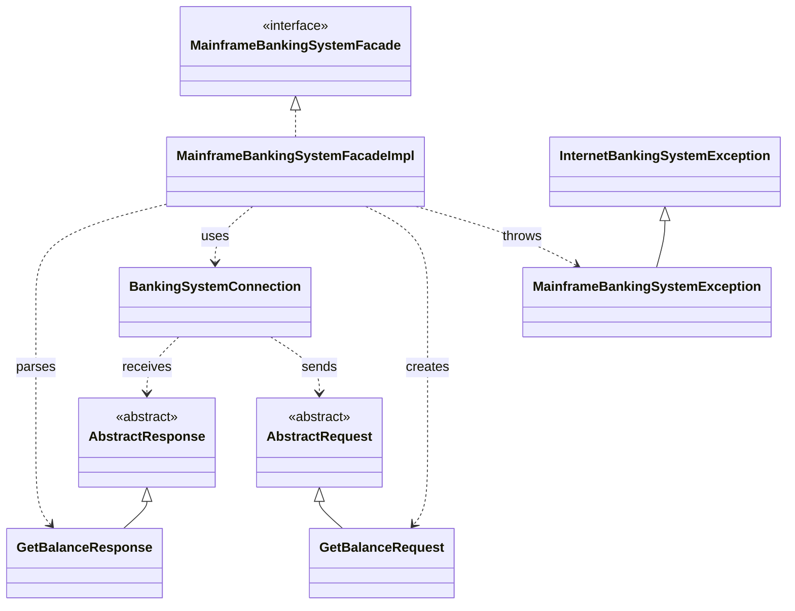

At level 4 er markeret **Optional** er en bevidst pointe: koden ændrer sig hurtigere end noget andet niveau, så et vedligeholdt level 4-diagram er sjældent besværet værd.

> Del 1, slide 20

---

## 6. Diagram guidelines

Reglerne står kort og skal kunne huskes til eksamen:

- Diagrams should be self explaining.
- Specify the legend (explain the notation used).
- Add descriptive text.
- Use color and shapes to optimize readability (but make sure these are just optimizations).
- "A narrative should complement a diagram, not explain it" [Simon Brown].
- You should be able to read the diagram aloud and understand it.

Parentesen om farver er væsentlig: farve og form må *forstærke* læsbarheden, men information må aldrig kun ligge i farven — så falder diagrammet fra hinanden i sort/hvid udskrift eller for en farveblind læser. Og "read the diagram aloud" er den praktiske test: hvis pilen mellem to kasser ikke kan udtales som en meningsfuld sætning, mangler den et label.

> Del 1, slide 21

---

## 7. C4's grænser

> **The C4 model is a way to document structure.**
>
> The C4 model does not mandate any specific notation.
> — Simon Brown has a suggestion.
> — UML can also be used (se the c4model website)
>
> **And remember that behavior is equally as important as structure!**
>
> **So maybe you need some other viewpoints (supported by other diagrams)!**

Tre selvstændige pointer. For det første er C4 en *abstraktionsmodel*, ikke en notation — de blå og grå kasser i eksemplerne er Browns forslag, ikke en del af modellen. For det andet dækker C4 kun struktur. For det tredje følger konklusionen: adfærd kræver andre viewpoints, hvilket er præcis det, 4+1 leverer i del 2.

> Del 1, slide 22 · Del 2, slide 11

---

## 8. Recap: arkitekturprocessen (Microsoft)

Fra uge 4, gentaget som opsamling. Processen er en cyklus med fem trin, hvor trin 1 står uden for cirklen og fodrer den:

1. Identify Architecture Objectives
2. Identify Key Scenarios
3. Create Application Overview
4. Identify Key Issues
5. Define Candidate Solutions

Efter trin 5 vendes tilbage til trin 1 eller trin 2. Sliden fremhæver at processen er **iterative and incremental**, og at hver iteration skal testes mod:

- requirements
- known constraints
- quality attributes

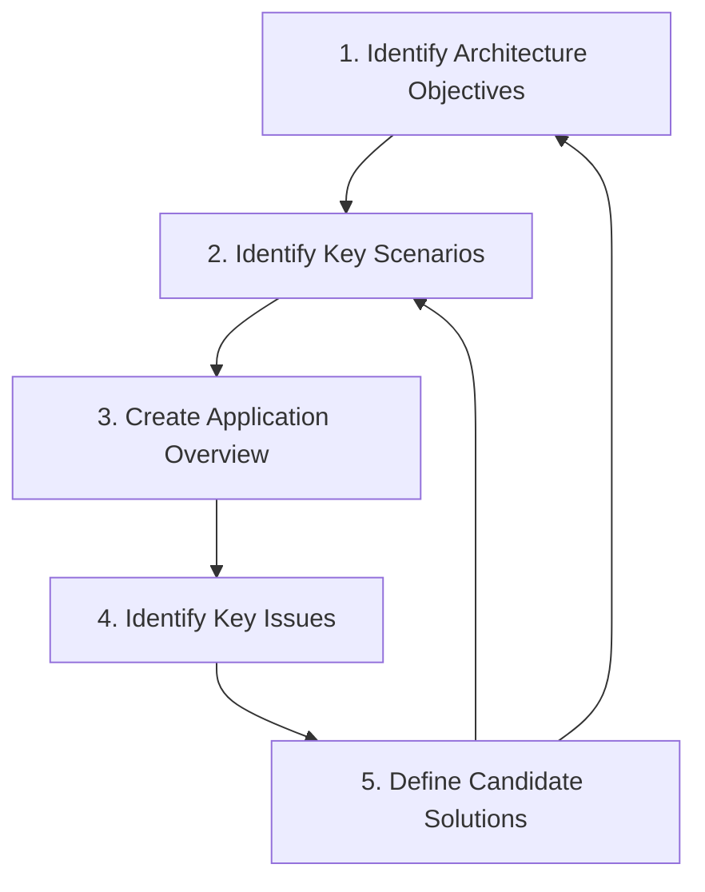

Kilde: Microsoft Application Architecture Guide, 2nd Edition. Detaljerne er behandlet i `SW4SWD-01_W04.1_Architecture_Process_1.md` og `SW4SWD-01_W04.2_Architecture_Process_2.md`.

> Del 1, slide 23

Efterfulgt af overgangssliden "Continue with the process".

> Del 1, slide 24

---

## 9. Øvelse: Draw the architecture

> Pair with someone, who is not working on the same project as you.
>
> You have 10 minutes to **explain the software architecture** of your project to the other person. Then switch roles.
>
> Use paper and pencil (or a whiteboard). PC's and pre-made diagrams are forbidden!

Forbuddet mod færdige diagrammer er øvelsens hele pointe: du kan kun tegne det, du reelt har forstået, og modparten er en ægte test af, om abstraktionsniveauet holder.

> Del 1, slide 25 (gentaget som Del 2, slide 45)

Del 1 slutter med AU-logo (slide 26) og references-sliden, der kun angiver `C4 model: c4model.com` (slide 27).

---

# Del 2 — Documentation 2

## 10. Åbning: arkitekt uden kode

Del 2 åbner med en Dilbert-stribe (18-07-2017): chefen forklarer, at han forfremmede Ted til software architect, *fordi* Ted ikke kan kode — "sometimes monkeys are astronauts". Pointen serveres som selvironi over faget og peger frem mod sidste sektion om, hvordan man rent faktisk bliver en god arkitekt.

> Del 2, slide 1

---

## 11. Architectural views — der findes ikke ét diagram

> - There is no "one diagram to rule them all".
> - Different "Views" of the system each tells a part of the story.
> - Decide what to communicate and choose appropriate diagrams.
>   - And decide on the abstraction level.
>   - What do you want the reader of the diagram to know?

Bemærk de to ortogonale valg, der skal træffes for hvert diagram: **hvilket view** (hvilken del af historien) og **hvilket abstraktionsniveau** (hvor tæt på kode). C4 svarer på det andet spørgsmål, 4+1 på det første.

> Del 2, slides 12, 13

---

## 12. 4+1 View Model — Philippe Kruchten

Modellen består af fire views omkring et centralt femte. Sliden angiver for hvert view både **Audience** (hvem læser det) og **Under Study** (hvad undersøges):

| View | Audience | Under Study |
|---|---|---|
| **Logical View** | End-user | Functionality |
| **Development View** | Programmers, Software management | *(udvikling, kodeorganisering)* |
| **Process View** | Integrators | Performance, Scalability |
| **Physical View** | System engineers | Topology, Communications |
| **Scenarios** | *(binder de fire sammen)* | *(det "+1", der validerer de øvrige)* |

Pilene på diagrammet: Logical View → Development View, Logical View → Process View, Process View → Physical View, Development View → Physical View. Scenarios sidder i midten som ellipsen, der forbinder de fire.

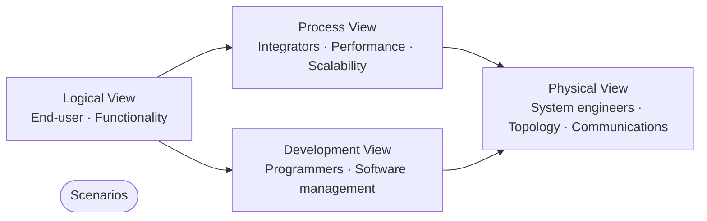

> Del 2, slide 14

### 12.1 Hvilke UML-diagrammer hører til hvilket view

Den følgende slide hænger konkrete UML-diagramtyper op på hvert view. Dette er den tabel, der er værd at kunne til eksamen:

| View | UML-diagramtyper |
|---|---|
| **Logical View** | Package, Component, Composite structure, State, Communication |
| **Development View** | Package, Component |
| **Process View** | Activity, Communication, Deployment, Sequence |
| **Physical View** | Deployment |

Læg mærke til overlappene: `Package` og `Component` optræder i både Logical og Development View, `Communication` i både Logical og Process View, `Deployment` i både Process og Physical View. Det er ikke sjusk — samme diagramtype kan bære forskellige historier afhængigt af, hvad man vælger at vise i den.

> Del 2, slides 15 og 32 (identisk slide, gentaget som opsamling efter UML-gennemgangen)

For den dybere behandling af Kruchtens originale artikel og af UML2-mapningen, se `../artikler/SW4SWD-01_4plus1_View_Kruchten_1995.md` og `../artikler/SW4SWD-01_4plus1_View_UML2.md`.

---

## 13. Other views

4+1 er ikke udtømmende. Sliden nævner tre kandidater til yderligere views:

- **Data**
- **Security**
- **Others…?**

Spørgsmålstegnet er tilsigtet: view-sættet afhænger af systemet og af stakeholderne. Bemærk sammenhængen med agendaens formulering "**N+1** Views" — pointen er, at de fire i Kruchtens model er et startsæt, ikke en lukket liste.

> Del 2, slide 16 · agenda: Del 2, slide 3

---

## 14. Diagrams are not enough

Kruchtens ligning fra 2009, gengivet ordret på sliden:

> **Architectural Knowledge = Architectural Design + Design Decisions**
>
> **+ Goals and Constraints**

Med annotationer:

| Led | Eksempel på repræsentation |
|---|---|
| Architectural Design | Eg. C4 and N+1 views diagrams |
| Design Decisions | Eg. Text |
| Goals and Constraints | *(fremhævet som selvstændigt, nødvendigt led)* |

Konsekvensen for et arkitekturdokument: diagrammerne alene er kun det første led. Uden nedskrevne beslutninger (*hvorfor* blev denne struktur valgt frem for alternativerne) og uden mål og begrænsninger (*hvad* skulle arkitekturen opnå, og hvad kunne ikke ændres) er dokumentet ikke arkitekturviden — det er bare tegninger. Beslutninger og constraints skrives som tekst, ikke som diagrammer.

> Del 2, slide 17

---

## 15. UML — structural diagram types

> Del 2, slide 18 (overgangsslide: "UML - Structural diagram types. And then: Behavioral diagram types")

### 15.1 Use case diagrams

Eksemplet er et videoudlejningssystem med fire aktører. Det der kan læses entydigt: `Customer` er forbundet til use casene `Login`, `Search` og `View`; `Search` har en `<<activates>>`-afhængighed til `View`. `Administrator` er forbundet til `Add Movies`, `Business Owner` til `Get Usage Report`, og `Developer` til `Add System Feature`. Systemgrænsen tegnes som en rektangel omkring alle use cases; aktørerne står udenfor.

Bemærk at aktørerne ikke kun er slutbrugere — `Business Owner` og `Developer` er også stakeholders med krav til systemet.

> Del 2, slide 19

### 15.2 Use case descriptions

Diagrammet siger hvem-gør-hvad; beskrivelsen siger *hvordan*. Skabelonen på sliden (USE CASE 5, "Buy Goods"):

| Felt | Indhold |
|---|---|
| Goal in Context | Buyer issues request directly to our company, expects goods shipped and to be billed. |
| Scope & Level | Company, Summary |
| Preconditions | We know Buyer, their address, etc. |
| Success End Condition | Buyer has goods, we have money for the goods. |
| Failed End Condition | We have not sent the goods, Buyer has not spent the money. |
| Primary Actor | Buyer, any agent (or computer) acting for the customer. |
| Secondary Actors | Credit card company, bank, shipping service |
| Trigger | purchase request comes in. |

Hovedforløbet (DESCRIPTION):

| Step | Action |
|---|---|
| 1 | Buyer calls in with a purchase request |
| 2 | Company captures buyer's name, address, requested goods, etc. |
| 3 | Company gives buyer information on goods, prices, delivery dates, etc. |
| 4 | Buyer signs for order. |
| 5 | Company creates order, ships order to buyer. |
| 6 | Company ships invoice to buyer. |
| 7 | Buyers pays invoice. |

EXTENSIONS (afvigelser fra hovedforløbet):

| Step | Branching Action |
|---|---|
| 3a | Company is out of one of the ordered items: 3a1. Renegotiate order. |
| 4a | Buyer pays directly with credit card: 4a1. Take payment by credit card (use case 44) |
| 7a | Buyer returns goods: 7a. Handle returned goods (use case 105) |

SUB-VARIATIONS (alternative måder at udføre et skridt):

| Step | Branching Action |
|---|---|
| 1 | Buyer may use phone in, fax in, use web order form, electronic interchange |
| 7 | Buyer may pay by cash or money order check credit card |

Skelnen mellem **extensions** (afvigende forløb med andet udfald) og **sub-variations** (samme forløb, anden kanal) er den, man typisk får galt i halsen.

> Del 2, slide 20

### 15.3 Package diagrams

Eksemplet er en flerlags-webarkitektur med fire top-level packages, som hver indeholder underpakker:

| Package | Indeholder |
|---|---|
| `web` | `servlets`, `transformers`, `exceptions`, `config` |
| `business` | `orders`, `exceptions` |
| `plsql` | `datasources`, `sql_pkgs`, `helpers`, `exceptions`, `config` |
| `data` | `dto`, `exceptions`, `types`, `values` |

Uden for lagene ligger `logging` samt de eksterne artefakter `ojdbc14.jar, orai18n.jar` (annoteret "Oracle 10g JDBC driver"). En note på `business` lyder: "Provides business and data access logic with distributed transactions support, if needed."

Den overordnede afhængighedsretning på billedet går nedad gennem lagene: `web` → `business` → `plsql` → `data`, med `logging` som tværgående afhængighed. Det er en klassisk layered architecture, hvor hvert lag kun kender laget under sig.

> Del 2, slide 21

### 15.4 Component diagrams

Eksemplet er en webshop med tre subsystem-komponenter. Notationselementerne, som sliden annoterer eksplicit i rødt, er dét, der skal kunnes:

| Element | Betydning |
|---|---|
| structured classifier — subsystem component | En component med intern struktur, her `«subsystem» WebStore`, `«subsystem» Warehouses`, `«subsystem» Accounting` |
| internal structure compartment | Rummet inde i komponenten, hvor delkomponenterne tegnes |
| port | Den lille firkant på komponentgrænsen |
| provided interface | "Lollipop" — cirkel på en streg; interfacet komponenten tilbyder |
| required interface | "Socket" — halvcirkel; interfacet komponenten har brug for |
| delegation connector | Forbinder en ydre port til en indre delkomponent |
| assembly connector (ball-and-socket) | Kobler et provided til et required interface direkte |
| role, part component | En delkomponent i sin rolle, fx `:SearchEngine`, `:Shopping Cart`, `:Authentication` |
| dependency | Stiplet pil mellem komponenter |

`WebStore` indeholder `:SearchEngine`, `:Shopping Cart` og `:Authentication` og udstiller interfacene `ProductSearch`, `OnlineShopping` og `UserSession`. `Warehouses` indeholder `:Inventory` og udstiller `Search Inventory` og `Manage Inventory`. `Accounting` indeholder `:Orders` og `:Customers` og udstiller `Manage Orders` og `Manage Customers`.

> Del 2, slide 22

### 15.5 Deployment diagrams

Eksemplet "Book Club Web Application" viser den fysiske topologi. Notationselementerne:

| Element | I eksemplet |
|---|---|
| `«device»` | `Sun Fire X4150 Server`, `Sun SPARC Server` |
| execution environment | `«JSP server» Tomcat 7`, `«executionEnvironment» Catalina Servlet Container`, `«database system» Oracle 10g` |
| deployed artifact | `«artifact» book_club_app.war`, `«artifact» user_services.jar`, `web-tools-lib.jar` |
| deployment specification | `«deployment spec» web.xml` |
| `«manifest»` | Relation fra artifact til `«component» OnlineOrders` |
| communication path | Forbindelsen mellem de to devices, stereotypet `«protocol» TCP/IP` |

Indlejringen på billedet: `Sun Fire X4150 Server` indeholder `Tomcat 7`, som indeholder `Catalina Servlet Container`, som indeholder `book_club_app.war`. `Sun SPARC Server` indeholder `Oracle 10g` med skemaerne `Users`, `Orders` og `Inventory`.

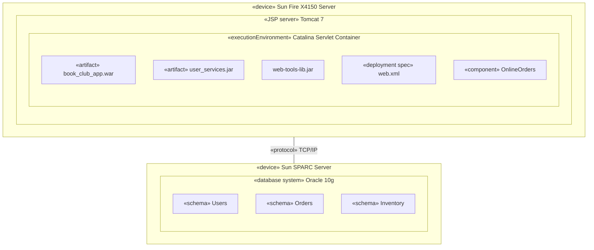

Deployment-diagrammet er det diagram, der bærer **Physical View** i 4+1.

> Del 2, slide 23

---

## 16. UML — behavioral diagram types

> Del 2, slide 24 (overgangsslide)

### 16.1 Sequence diagrams

> Sequence diagrams can be used at different levels of abstraction
> - Between system and context
> - Between containers
> - Between components
> - Between classes

Bemærk at de fire niveauer er præcis C4-niveauerne. Sekvensdiagrammet er altså ikke bundet til ét abstraktionsniveau — det er en notation, du kan bruge på hvert af dem, hvilket er en direkte anvendelse af "abstractions first, notation second".

> Del 2, slide 25

Eksemplet er en tankstation, tegnet **mellem containere** (markeret med en blå kasse "Containers" med pile til `: Benzinstander-styring`, `: Benzinstander` og `: Central Computer`). Lifelines: aktøren, `: Tankstation` (som ramme om `: Benzinstander-styring` og `: Benzinstander`), `: Central Computer` og `: PBS`.

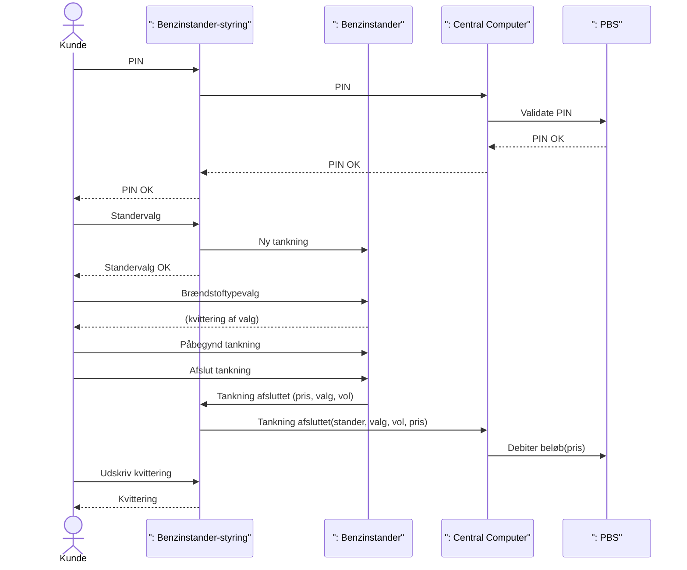

Meddelelsesnavnene er danske i originalen og gengives ordret. Læg mærke til, at PIN-valideringen går hele vejen ud til `PBS` og tilbage — den slags eksterne afhængigheder er netop det, container-niveauet skal afsløre.

> Del 2, slide 26

### 16.2 Communication diagrams

Samme information som et sekvensdiagram, men organiseret efter *struktur* frem for *tid*. Eksemplet er `interaction Online Bookshop`. Notationselementerne, som sliden annoterer:

| Element | Betydning |
|---|---|
| diagram kind | `interaction` |
| frame heading | Rammens overskrift |
| name of owning element or enclosing namespace | `Online Bookshop` |
| diagram frame | Selve rammen |
| lifeline | Deltager i interaktionen |
| lifeline name / class name | Fx `b: Book` |
| selector | Fx `sc[customer]: Shopping Cart` |
| message | Kaldet, fx `search()` |
| sequence expression | Nummereringen, fx `1.1`, `2.3` |
| iteration | `*`, fx `1 *: find_books()` |
| guard | Betingelse i firkantparentes, fx `[order complete]` |

Meddelelserne i eksemplet, ordret med nummerering:

| Nr. | Meddelelse |
|---|---|
| 1 * | `find_books()` |
| 1.1 | `search()` |
| 1.2 [interested] | `view_book()` |
| 1.3 [decided to buy] | `add_to_cart()` |
| 2 | `checkout()` |
| 2.1 | `get_books()` |
| 2.2 [not empty(cart)] | `make_order()` |
| 2.3 [order complete] | `update_inventory()` |

Nummereringen bærer sekvensen, siden diagrammet ikke har en tidsakse — det er forskellen på communication og sequence.

> Del 2, slide 27

### 16.3 State Machine diagrams — to abstraktionsniveauer

> Can be used at different abstraction levels
>
> - To describe the conceptual state of a Domain class that the user and other non-technical stakeholders can understand
> - As a Design pattern for a process or a class at the implementation level
>   - Especially good for asynchronous/event driven activities, as between containers

**Konceptuelt niveau** — domæneklassen `Order`. Tilstandene er dem, en forretningsbruger ville nævne:

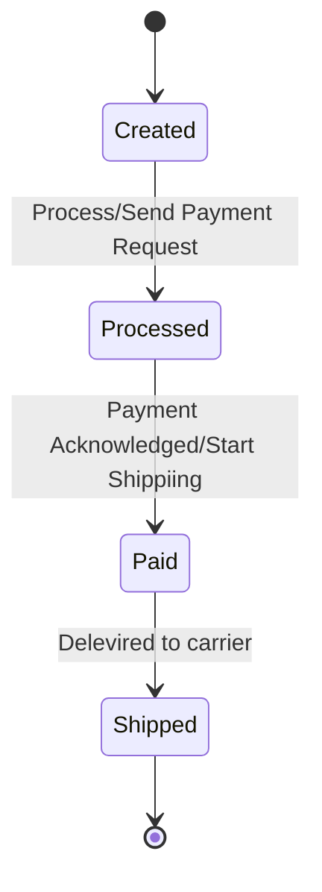

(Stavefejlene `Shippiing` og `Delevired` står sådan på sliden.)

> Del 2, slides 28, 29

**Implementeringsniveau** — en STM for en hæveautomat-transaktion, der kommunikerer med andre containere. Transitionerne har fuld `event [guard] / action`-syntaks:

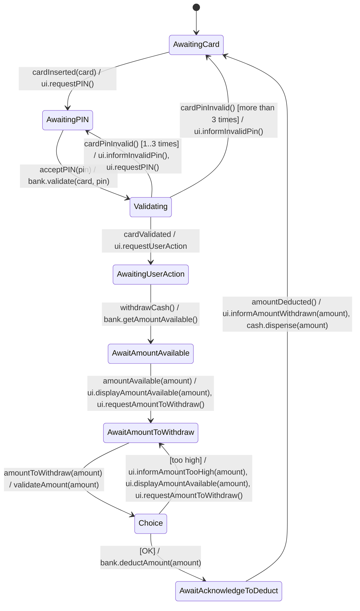

Tilstandsnavnene ordret fra sliden: `Awaiting Card`, `Awaiting PIN`, `Validating`, `Awaiting User Action`, `Await amount available`, `Await amount to Withdraw`, `Await acknow-ledge to deduct`. `Choice` er den rombe (choice pseudostate), sliden tegner efter `validateAmount(amount)`.

Læg mærke til hvorfor STM passer her: alle kald til `bank` er asynkrone svar fra en anden container, så tilstandsmaskinen er det naturlige måde at holde styr på, hvor i forløbet transaktionen befinder sig, mens der ventes.

> Del 2, slide 30

### 16.4 Activity diagrams

Eksemplet er en ordreproces fordelt på tre partitions (swimlanes): `Fulfillment`, `Customer Service` og `Finance`. Notationselementerne annoteres eksplicit:

| Element | Forklaring (ordret fra sliden) |
|---|---|
| **Partitions** | Show different parties involved in the process |
| **Action** | It does something. There is an automatic transition on its completion. |
| **transition** | A transition supports modeling of control flow. |
| **Object Node** | An object produced or used by actions. This allows us to model **data flows** or **object flows**. |
| **Fork** | One incoming transition, and multiple outgoing parallel transitions and/or object flows. |
| **Join** | Multiple incoming transitions and/or object flows; one outgoing transition. The outgoing continuation does not happen until *all* the inputs arrive from *all* flows. |

Forløbet: start i `Customer Service` med `Receive Video Order`, derefter en fork. Den ene gren går til `Fill Order` (Fulfillment), som producerer objektnoden `Order`, og videre til `Deliver Order`. Den anden gren går til `Send Invoice` (Finance), som producerer objektnoden `Invoice`, og videre til `Receive Payment`. De to grene samles i en join, hvorefter `Close Order` udføres og aktiviteten slutter.

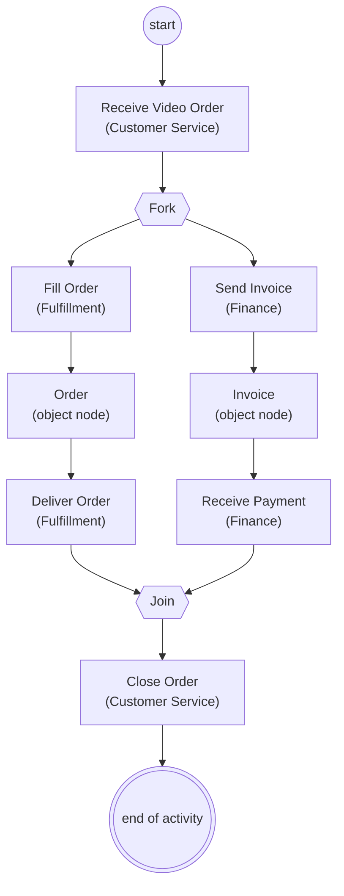

Fork/join-parret er det, der gør activity-diagrammet velegnet til **Process View**: det udtrykker parallelitet direkte.

> Del 2, slide 31

---

## 17. Sammenholdt: C4 og 4+1

De to modeller besvarer forskellige spørgsmål og udelukker ikke hinanden. Sliderne stiller dem op efter hinanden i samme forelæsning netop derfor:

| | **C4-modellen** | **4+1 View Model** |
|---|---|---|
| Ophav | Simon Brown | Philippe Kruchten |
| Akse | **Abstraktionsniveau** — hvor tæt på koden | **Viewpoint** — hvilken del af historien |
| Dækker | Struktur | Struktur *og* adfærd |
| Niveauer / views | System Context, Container, Component, Code | Logical, Development, Process, Physical + Scenarios |
| Notation | Ingen påkrævet (Brown har et forslag; UML kan bruges) | UML-diagramtyper pr. view |
| Målgruppestyring | Level 1 til ikke-tekniske; dybere niveauer til udviklere | Eksplicit audience pr. view (end-user, programmers, integrators, system engineers) |
| Åbenhed | Fire faste niveauer | Udvidelig — "N+1", fx data- og security-views |

Sammenhængen står eksplicit i to slides: C4 slutter med "behavior is equally as important as structure! So maybe you need some other viewpoints", og sequence-diagram-sliden i del 2 anvender direkte C4-niveauerne (system/context, containers, components, classes) som abstraktionsniveauer for samme diagramtype. Sagt kort: **brug C4 til at bestemme zoomniveauet, og 4+1 til at bestemme hvilket view du tegner på det niveau.**

Og over dem begge står Kruchtens ligning fra sektion 14: begge modeller producerer kun *Architectural Design*. Uden design decisions og goals/constraints i tekst er dokumentationen ufuldstændig.

> Del 1, slide 22 · Del 2, slides 11, 17, 25, 32

---

## 18. How to become a good architect

> Del 2, slide 33 (overgangsslide: "How do you become good at architecture?")

### 18.1 Phases in the Developer's Life

Fem faser efter Stefan Tilkov, *Why software architects fail – and what to do about it*, Craft Conference 2019:

| Fase | Karakteristik | Illustration på sliden |
|---|---|---|
| **I. The enthusiastic developer** | "This stuff is cool – let's build programs! For real people!" | Create/Find/List/Edit/Delete × Customer, Product, Order |
| **II. The disillusioned developer** | "Real people have boring problems" | Samme CRUD-matrix — nu som en byrde |
| **III. The enthusiastic architect** | "Generic Solutions!!!" | CRUD kollapset til Create/Find/List/Edit/Delete **Thing** |
| **IV. The disillusioned architect** | Generalisering slår tilbage | KISS, YAGNI, Lean, Minimable viable product, Story focus |
| **V. The "wise" architect** | `Question: *` → `Answer: It depends.` | — |

Kurven er pointen: fase III's trang til at generalisere alt til "Thing" bliver aflivet af fase IV's principper (KISS, YAGNI), og fase V lander på, at der ikke findes universelle svar — kun kontekstafhængige. "It depends" er ikke en undvigelse, det er den modne position.

> Del 2, slides 34–40

### 18.2 Practice

Sliden viser Mr. Miyagi med teksten "WAX ON, WAX OFF" — færdigheden bygges gennem repetition, ikke gennem at læse om den.

> Del 2, slide 41

### 18.3 Learn from others

Anbefalede bøger:

- Microsoft Application Architecture Guide, 2nd Edition
- Simon Brown: *Software Architecture for Developers*, Volume 1 — "Technical leadership and the balance with agility"
- Simon Brown: *Software Architecture for Developers*, Volume 2 — "Visualise, document and explore your software architecture"
- Buschmann, Meunier, Rohnert, Sommerlad, Stal: *Pattern-Oriented Software Architecture — A System of Patterns*, Volume 1 (Wiley)
- Amy Brown & Greg Wilson (red.): *The Architecture of Open Source Applications*, Volume I og II — `http://aosabook.org/en/index.html`

> Del 2, slide 42

### 18.4 Read and watch

| Person | Adresse |
|---|---|
| Simon Brown | `http://www.codingthearchitecture.com/` |
| Martin Fowler | `https://martinfowler.com/` |
| Scott Ambler | `http://www.agilemodeling.com/` |

> Del 2, slide 43

Simon Browns C4-talk er behandlet separat i `../artikler/SW4SWD-01_C4_Talk_Simon_Brown.md`.

### 18.5 SA Research

Forskningsområder i software architecture på AU:

- Domain Specific Languages and Model Driven Engineering
- Consistency Management
- Engineering of Digital Twins

> Del 2, slide 44

Del 2 slutter med samme øvelse som del 1 ("Your turn again! Draw the architecture", slide 45) og AU-logoet (slide 46).

---

## Opsummering

- **Dokumentation er kommunikation** — undtagen ved safety, traceability og external assessment, hvor den også er et formelt artefakt. Kommunikation kræver shared vocabulary, shared notation og shared understanding of abstraction level. Simon Brown: abstractions 1st, notation 2nd.
- **To ortogonale valg pr. diagram:** hvilket abstraktionsniveau (C4's opgave) og hvilket viewpoint (4+1's opgave). London-kortene illustrerer begge akser: samme by, forskellig zoom og forskelligt spørgsmål.
- **C4 = struktur i fire zoomniveauer.** System Context (til ikke-tekniske), Container (separat deploybare enheder + teknologivalg), Component (grupperinger bag interfaces, samme procesrum), Code (valgfrit). C4 påbyder ingen notation.
- **4+1 = fem views med hver sin audience.** Logical (end-user, functionality), Development (programmers, software management), Process (integrators, performance, scalability), Physical (system engineers, topology, communications) — bundet sammen af Scenarios. Hvert view har sit sæt UML-diagramtyper, og view-sættet er udvideligt ("N+1": data, security, …).
- **Adfærd er lige så vigtig som struktur.** C4 dækker kun struktur; sequence, communication, state machine og activity diagrams bærer adfærden — og de kan alle bruges på flere abstraktionsniveauer.
- **Diagrammer er ikke nok:** Architectural Knowledge = Architectural Design + Design Decisions + Goals and Constraints (Kruchten 2009). Beslutningerne og begrænsningerne skrives som tekst.
- **Diagram guidelines:** self explaining, angiv legend, tilføj beskrivende tekst, brug farve/form kun som optimering, og narrativet skal komplementere — ikke forklare — diagrammet. Testen: kan du læse diagrammet højt og forstå det?
- **Vejen til at blive god:** øv (wax on, wax off), lær af andre, og accepter at det modne svar på næsten ethvert arkitekturspørgsmål er "it depends".
