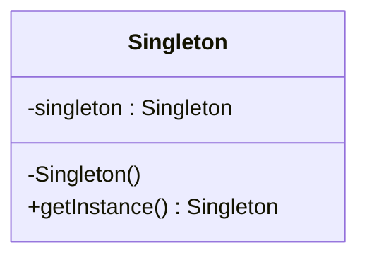

# Uge 6a — Design Patterns: Introduktion

## Metadata

| Felt | Værdi |
|---|---|
| **Lektion** | Uge 6 — Software design patterns, introduktion |
| **Kursus** | Softwaredesign (SW4SWD-01) |
| **Forelæser** | Henrik Bitsch Kirk (HK) |
| **Kilde** | `Design Patterns - Introduction.pdf` (19 slides) |
| **Sprog/kode** | C# |
| **Emner dækket** | Hvad et design pattern er, Christopher Alexander, emerging patterns, pattern language, design vs. arkitektur, Gang-of-Four-katalog, pattern-kategorier (creational/structural/behavioral), SOLID som motivation, GoF Pattern Description Template, andre patterns uden for GoF, anti-patterns, Singleton som grænsetilfælde |

---

## Agenda

1. Hvad er et design pattern?
2. Mønstre opfindes ikke — de opdages
3. Hvad software design patterns giver os
4. Design eller arkitektur? Abstraktionsniveauer
5. Mønstre som fælles vokabular
6. Gang-of-Four-kataloget og dets tre kategorier
7. Hvorfor og hvornår man bruger mønstre — SOLID
8. GoF's beskrivelsesskabelon
9. Andre mønstre uden for GoF
10. Anti-patterns — og grænsetilfældet Singleton

---

## 1. Rammefortælling

Deckets åbningsslide er en *geek & poke*-tegneserie med titlen "MODERN DESIGN PATTERNS" og undertitlen "TODAY: PROMISE". En figur siger:

> "BELIEVE ME! THE MOMENT I WANNA MARRY YOU, I'LL IMMEDIATELY CALL YOU!"

Pointen er, at et mønster som *Promise* — "jeg giver dig ikke svaret nu, men jeg kalder tilbage, når jeg har det" — findes langt uden for softwaren. Mønstre er en måde at navngive en velkendt interaktionsform på.

> Slide 1

Titelsliden: **Software design patterns — Introduction**, version 1.0.1, materialet oprindeligt af Claudio Gomes.

> Slide 2

---

## 2. Hvad er et design pattern?

Definitionen kommer ikke fra softwareverdenen. Den stammer fra arkitekten Christopher Alexander og bogen *A Pattern Language: Towns · Buildings · Construction* (Alexander, Ishikawa, Silverstein, m.fl.).

> "(…) Each pattern describes **a problem** that occurs over and over again in our environment, and then describes the **core of the solution to that problem**, in such a way that you can use this solution a million times over, **without ever doing it the same way twice**."
>
> — Christopher Alexander, architect

> Slide 3

Tre ting er værd at hæfte sig ved i citatet:

- Et mønster er defineret ved **et tilbagevendende problem**, ikke ved en bestemt kodestump.
- Det beskriver **kernen** i løsningen — ikke en færdig implementation.
- Samme mønster kan bruges en million gange **uden nogensinde at blive gjort ens to gange**. Konteksten bestemmer den konkrete udformning.

---

## 3. Mønstre opfindes ikke — de opdages

Slide 4 er et rent Mandelbrot-billede (fraktal), som visuel metafor: strukturer der gentager sig selv, opstår af sig selv, uden at nogen har designet dem enkeltvis.

> Slide 4

Samme baggrund med tekst ovenpå:

> Design patterns are not invented, they emerge.
>
> They are discovered by examing different solutions to common problems.
>
> Often the solutions have something in common, which can be formulated as a pattern.

> Slide 5

Mønstre er altså destillater. Nogen har løst det samme problem mange gange på lidt forskellig vis, og fællesnævneren er blevet skrevet ned. Det er grunden til, at et mønster ikke kan være "forkert" i sig selv — det kan kun være dårligt matchet til den aktuelle kontekst.

---

## 4. Software design patterns — hvad de giver

**Best practices for recurring problems**

- General designs
- Must be customized to context

**Terminology and *pattern language***

**Learning opportunity**

**Maintainable software**

> Slide 6

Fire udbytter, kort:

1. **Best practices.** Prøvede løsninger på problemer, der kommer igen. De er generelle og *skal* tilpasses den konkrete kontekst — de er ikke copy-paste.
2. **Terminologi og et pattern language.** Man får ord for designbeslutninger.
3. **Læringsmulighed.** At læse et mønsterkatalog er at læse andre folks designerfaring i komprimeret form.
4. **Vedligeholdbar software.** Mønstrene er valgt, fordi de gør systemer lettere at ændre.

---

## 5. Design eller arkitektur?

Mønstre ligger på et bestemt abstraktionsniveau. Sliden placerer fire begreber langs en akse fra lavere til højere kompleksitet:

| Placering på aksen | Niveau |
|---|---|
| Lavest kompleksitet | Coding Ideoms *(sic — "idioms")* |
| ↓ | SW Design Patterns |
| ↓ | Application Architecture |
| Højest kompleksitet | System Architecture |

`System Architecture` er tegnet forskudt nedad og overlapper `Application Architecture` i vandret udstrækning — dvs. de to arkitekturniveauer dækker et overlappende kompleksitetsspænd, hvor system-arkitektur strækker sig længst mod højre.

> Slide 7

Design patterns sidder altså mellem sprogets idiomer (`foreach`, `using`, properties) og applikationsarkitektur (lagdeling, MVC, klient/server). Et mønster er større end en kodevending og mindre end en arkitektur.

---

## 6. Mønstre giver os et vokabular

Tre talebobler illustrerer, hvordan mønsternavne fungerer som stenografi i en designdiskussion:

> "Couldn't we just use *Strategy* and *Iterator* to solve that?"

> "Apply *State* and *Command* together, and we're home free!"

> "Should we build the server as a *Reactor*?"

> Slide 8

Værdien er kommunikationsbåndbredde. Ét ord — *Reactor* — erstatter et helt afsnit om event-loop, demultiplexing og handler-registrering. Det er derfor mønsternavne holdes på engelsk, også i dansk fagsnak.

---

## 7. Gang-of-Four

Kataloget stammer fra *Design Patterns: Elements of Reusable Object-Oriented Software* af **Erich Gamma, Richard Helm, Ralph Johnson og John Vlissides** (Addison-Wesley, forord af Grady Booch). De fire forfattere er "the Gang of Four", deraf GoF.

> Slide 9

### De 23 mønstre i tre kategorier

**Creational patterns** — hvordan objekter skabes:

- Abstract Factory
- Builder
- Factory Method
- Prototype
- Singleton

**Structural patterns** — hvordan klasser og objekter sammensættes til større strukturer:

- Adaptive *(sic — hedder Adapter i GoF)*
- Bridge
- Composite
- Decorator
- Façade
- Flyweight
- Proxy

**Behavioral patterns** — hvordan ansvar og kommunikation fordeles mellem objekter:

- Chain of Responsibility
- Command
- Interpreter
- Iterator
- Mediator
- Memento
- **Observer**
- State
- Strategy
- Template
- Visitor

Reference på sliden: `http://www.dofactory.com/Patterns/Patterns.aspx`

> Slide 10

---

## 8. Hvorfor og hvornår bruger man design patterns?

Svaret på sliden er SOLID — mønstrene er værktøjer til at overholde principperne:

- **S**ingle Responsibility Principle
- **O**pen – Closed Principle
- **L**isskov's Substitution Principle *(sic — Liskov)*
- **I**nterface Segregation Principle
- **D**ependency Inversion Principle

> Slide 11

Man vælger altså ikke et mønster, fordi det er et mønster. Man vælger det, fordi det løser en konkret spænding i designet — typisk et behov for at kunne udvide uden at ændre (Open–Closed), eller for at afhænge af abstraktioner frem for konkrete typer (Dependency Inversion).

---

## 9. Kursets udvalg af mønstre

Samme katalogslide gentages, men med kursets egne mønstre markeret med rødt:

| Kategori | Fremhævede mønstre |
|---|---|
| Creational | **Abstract Factory**, **Factory Method** |
| Structural | *(ingen markeret)* |
| Behavioral | **Observer**, **State**, **Strategy**, **Template** |

> Slide 12

Det er de seks, kurset går i dybden med. Observer er den første.

---

## 10. GoF Pattern Description Template

GoF beskriver hvert mønster efter samme faste skabelon. Sliden viser skabelonen med `Observer` udfyldt i navnefeltet og resten tom — som en optakt til næste forelæsning.

| Felt | Indhold |
|---|---|
| **Name** | Observer |
| **Intent** | |
| **Also Known As** | |
| **Motivation** | |
| **Applicability** | |
| **Structure** | |
| **Participants** | |
| **Collaborations** | |
| **Consequences** | |
| **Implementation** | |
| **Sample code** | |
| **Known Uses** | |
| **Related Patterns** | |

> Slide 13

Felterne svarer til den mindstemængde information, man skal kunne om et mønster:

- **Intent** — hvad mønsteret vil opnå, i én sætning.
- **Also Known As** — alternative navne (Observer hedder også Publish-Subscribe).
- **Motivation** — det konkrete scenarie, der gør mønsteret nødvendigt.
- **Applicability** — hvornår man skal bruge det, og hvornår ikke.
- **Structure** — klassediagrammet.
- **Participants** — rollerne og deres ansvar.
- **Collaborations** — hvordan deltagerne kalder hinanden, typisk et sekvensdiagram.
- **Consequences** — fordele *og* ulemper. Den vigtigste sektion, fordi den siger, hvad mønsteret koster.
- **Implementation** — faldgruber og implementationsvalg.
- **Sample code**, **Known Uses**, **Related Patterns**.

Når man i en eksamenssituation skal redegøre for et mønster, er det denne struktur, man svarer efter.

---

## 11. Andre mønstre end GoF's

GoF-kataloget er ikke udtømmende. Sliden viser Wikipedias tabel over *creational patterns* med kolonner for, om mønsteret findes i *Design Patterns* (GoF), i *Code Complete*, eller andetsteds:

| Name | Description | In *Design Patterns* | In *Code Complete* | Other |
|---|---|---|---|---|
| Abstract factory | Provide an interface for creating families of related or dependent objects without specifying their concrete classes. | Yes | Yes | N/A |
| Builder | Separate the construction of a complex object from its representation, allowing the same construction process to create various representations. | Yes | No | N/A |
| Dependency Injection | A class accepts the objects it requires from an injector instead of creating the objects directly. | No | No | N/A |
| Factory method | Define an interface for creating a single object, but let subclasses decide which class to instantiate. Factory Method lets a class defer instantiation to subclasses. | Yes | Yes | N/A |
| Lazy initialization | Tactic of delaying the creation of an object, the calculation of a value, or some other expensive process until the first time it is needed. This pattern appears in the GoF catalog as "virtual proxy", an implementation strategy for the Proxy pattern. | No | No | PoEAA |
| Multiton | Ensure a class has only named instances, and provide a global point of access to them. | No | No | N/A |
| Object pool | Avoid expensive acquisition and release of resources by recycling objects that are no longer in use. Can be considered a generalisation of connection pool and thread pool patterns. | No | No | N/A |
| Prototype | Specify the kinds of objects to create using a prototypical instance, and create new objects from the 'skeleton' of an existing object, thus boosting performance and keeping memory footprints to a minimum. | Yes | No | N/A |
| Resource acquisition is initialization (RAII) | Ensure that resources are properly released by tying them to the lifespan of suitable objects. | No | No | N/A |
| Singleton | Ensure a class has only one instance, and provide a global point of access to it. | Yes | Yes | N/A |

Kilde: `https://en.wikipedia.org/wiki/Software_design_pattern`

> Slide 14

Bemærk især **Dependency Injection** og **RAII**: begge er i dag helt centrale, og ingen af dem står i GoF-bogen. Kataloget fra 1994 er et udgangspunkt, ikke en facitliste.

Næste slide er et skærmbillede af hele Wikipedia-siden i 50 % zoom, hvor man ser alle fire tabeller på én gang: *Creational patterns*, *Structural patterns*, *Behavioral patterns* og — den GoF ikke har — ***Concurrency patterns*** (bl.a. Active Object, Double-checked locking, Lock, Monitor object, Reactor, Read-write lock, Scheduler, Thread pool, Thread-specific storage). Pointen er skalaen: mønsterlandskabet er langt større end de 23.

> Slide 15

---

## 12. Anti-patterns

Et anti-pattern er den samme idé vendt om: en løsning der optræder igen og igen, og som konsekvent gør mere skade end gavn. Sliden viser c2-wikiens `DevelopmentAntiPattern`-katalog:

- AccidentalComplexity
- AccidentalInclusion
- AddingEpicycles
- AlcoholFueledDevelopment
- AmbiguousViewpoint
- AsynchronousUnitTesting
- BearTrap
- BigBallOfMud
- BoatAnchor
- CascadingDialogBoxesAntiPattern
- ContinuousObsolescence
- ControlFreak
- CrciCards
- CreepingFeaturitis
- CopyAndPasteProgramming
- DbClass
- DeadEnd

Kilde: `http://wiki.c2.com/?AntiPatternsCatalog`

> Slide 16

---

## 13. Pattern eller anti-pattern? — Singleton

Sliden stiller spørgsmålet uden at besvare det, og bruger Singleton som eksempel. Klassediagrammet:



Både feltet `singleton` og operationen `getInstance()` er understreget i UML-diagrammet, dvs. de er **static**. Konstruktøren er `private` (`-`), så ingen andre kan instantiere klassen.

C#-implementationen på sliden er den trådsikre double-checked locking-variant:

```csharp
public sealed class Singleton
{
    private static volatile Singleton? _instance;
    private static readonly object _lock = new object();

    private Singleton() { }

    public static Singleton Instance
    {
        get
        {
            if (_instance != null)
            {
                return _instance;
            }

            lock (_lock)
            {
                if (_instance == null)
                    _instance = new Singleton();
            }

            return _instance;
        }
    }
}
```

> Slide 17

Hvorfor spørgsmålet overhovedet stilles: Singleton står i GoF-kataloget, men den er samtidig et globalt tilstandspunkt. Den bryder Dependency Inversion (klienter afhænger af den konkrete type i stedet for en abstraktion), den gør unit-test svær (man kan ikke substituere instansen), og den skjuler afhængigheder, fordi de ikke fremgår af konstruktør eller signatur. Derfor optræder Singleton også på anti-pattern-lister. Svaret er kontekstafhængigt — hvilket er hele pointen med slide 3: mønstre er kerneløsninger, ikke facitter.

Bemærk detaljerne i koden: `sealed` forhindrer nedarvning, `volatile` sikrer at læsningen af `_instance` ikke reordnes, det ydre `if` uden lås er den hurtige sti, og det indre `if` inde i `lock` er den korrekte sti.

---

## 14. Afslutning

Afsluttende AU-slide.

> Slide 18

**References and image sources**

Mandelbrot image: `https://github.com/palle-k/Mandelbrot`

> Slide 19

---

## Opsummering

- Et design pattern beskriver **et tilbagevendende problem** og **kernen i løsningen** — generelt formuleret, så det kan bruges igen og igen uden at blive implementeret ens to gange (Alexander).
- Mønstre **opfindes ikke, de opdages**: de er fællesnævneren mellem mange konkrete løsninger på samme problem.
- Design patterns ligger mellem coding idioms og applikationsarkitektur på kompleksitetsaksen.
- Den største praktiske gevinst er **et fælles vokabular**: "byg serveren som en Reactor" erstatter et helt designafsnit.
- GoF-kataloget rummer 23 mønstre i tre kategorier: **creational** (objektskabelse), **structural** (sammensætning) og **behavioral** (ansvarsfordeling og kommunikation). Kurset behandler Abstract Factory, Factory Method, Observer, State, Strategy og Template.
- Hvert mønster beskrives efter GoF's faste skabelon — især **Intent**, **Structure**, **Participants**, **Collaborations** og **Consequences**.
- Mønstre bruges for at overholde **SOLID**, ikke for deres egen skyld. Bruges de forkert, bliver de anti-patterns — Singleton er det klassiske grænsetilfælde.
