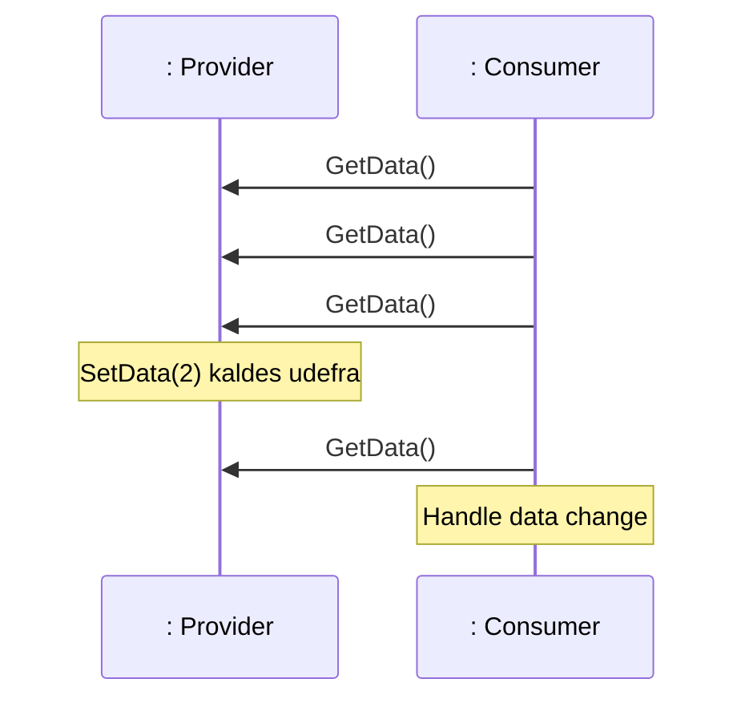
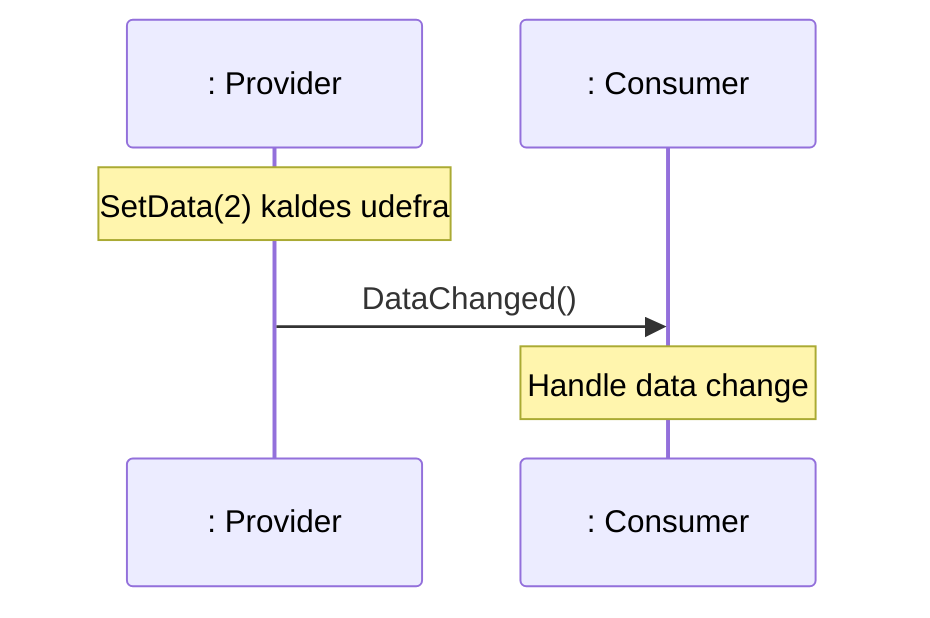
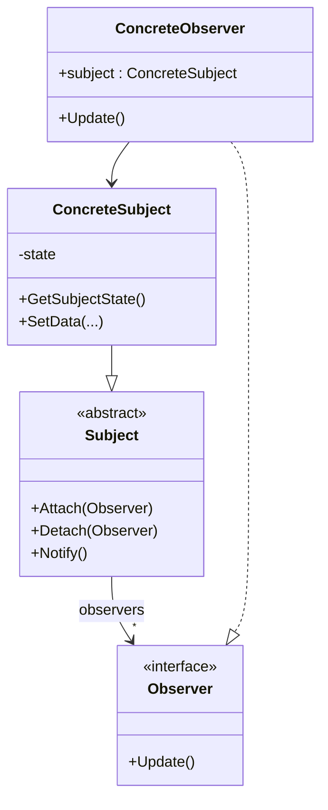
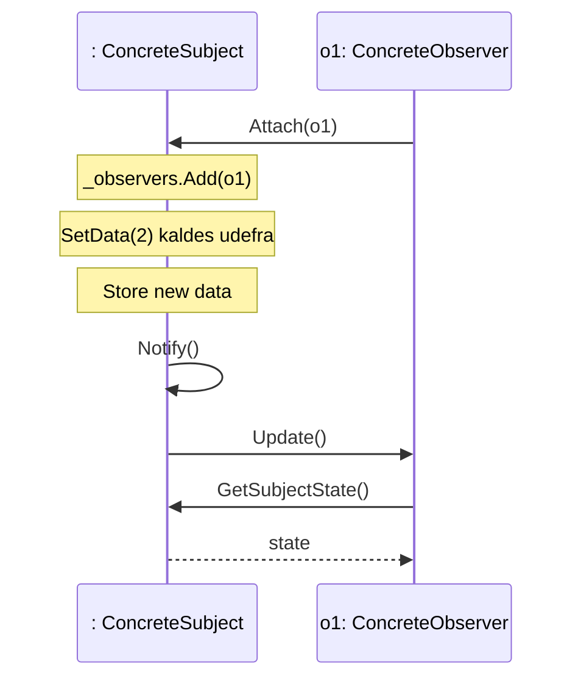
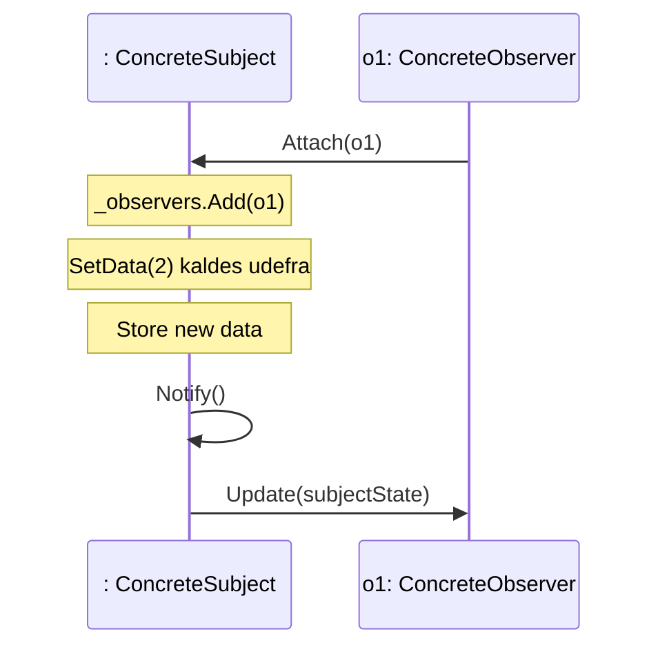
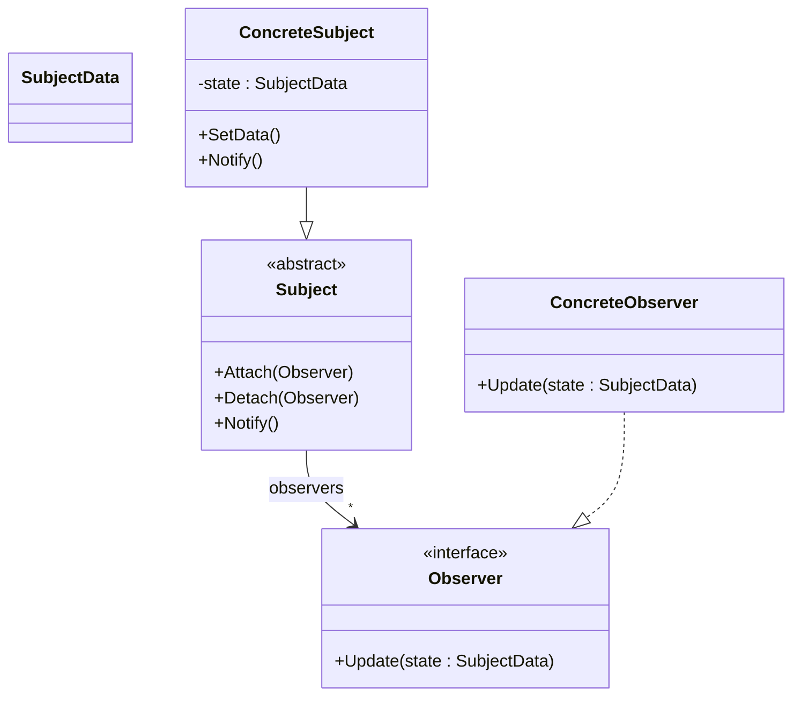
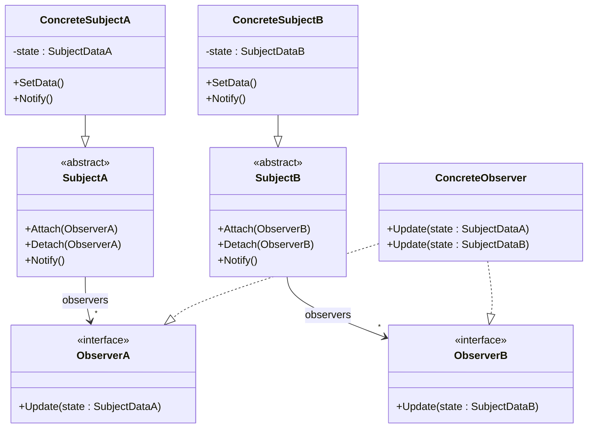
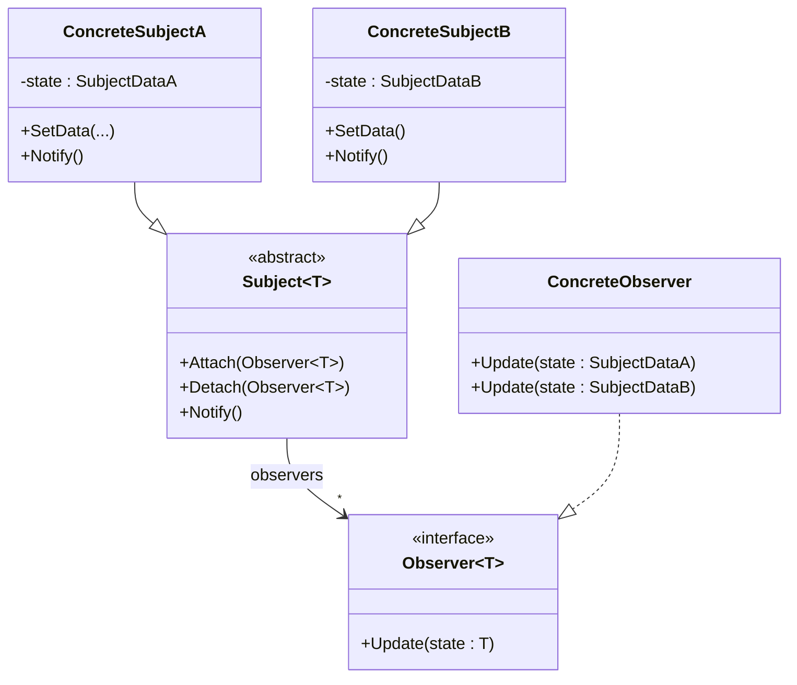

# Uge 6b — GoF Observer

## Metadata

| Felt | Værdi |
|---|---|
| **Lektion** | Uge 6 — Design patterns: GoF Observer |
| **Kursus** | Softwaredesign (SW4SWD-01) |
| **Forelæser** | Henrik Bitsch Kirk (HK) |
| **Kilde** | `Design Patterns - GoF Observer.pdf` (26 slides) |
| **Sprog/kode** | C# |
| **Emner dækket** | Data-update-problemet, polling vs. notifikation, Observer-mønsterets intent, struktur (Subject/Observer/ConcreteSubject/ConcreteObserver), pull-variant, push-variant, sekvenser for begge, kobling og SRP-diskussion, flere subjects af samme type (reference-to-self og tag), subjects af forskellige typer manuelt og med generics, Observer i C# (`IObserver<T>`, events og delegates) |

---

## Agenda

1. Data-update-problemet: Provider og Consumer
2. Polling vs. notifikation
3. Observer to the rescue — mønsterets intent
4. Struktur: Subject, Observer, ConcreteSubject, ConcreteObserver
5. Pull-varianten: sekvens og C#-kode
6. Problemet med pull-varianten
7. Diskussion: forsøg på afkobling — og SRP
8. Push-varianten: sekvens, klassediagram og C#-kode
9. Flere subjects af samme type: reference-to-self eller tag
10. Subjects af forskellige typer: manuelt eller med generics
11. Observer i C#: generics, events og delegates

---

## 1. Rammefortælling

Titelsliden bærer citatet:

> "The critical design tool for software development is a mind well educated in design principles"

Version 1.0.5.

> Slide 1

Sektionsslide: **GoF Observer**, illustreret med en videnskabsmand ved et teleskop, der noterer sine iagttagelser — observatøren, der holder øje og reagerer.

> Slide 2

---

## 2. Data-update-problemet

Udgangspunktet er generelt: to klasser, en der ejer data og en der vil reagere på ændringer i dem.

> **`Provider`** contains data which is changed every now and them by some entity (other than the `Consumer`)

> **`Consumer`** uses data and would like to do some update based on changes in data

> *How can we realize this coupling?*

`Provider` er tegnet som en klassekasse med feltet `- data: uint` og operationen `+ SetData(x: uint)`. `Consumer` er en tom kasse. Mellem dem er der en dobbeltrettet pil — koblingen er endnu ikke besluttet, hvilket er hele spørgsmålet.

> Slide 3

Bemærk detaljen: det er *ikke* `Consumer`, der ændrer data. En tredje part kalder `SetData(x)`. `Consumer` skal derfor på en eller anden måde få at vide, at værdien er blevet en anden.

---

## 3. To løsninger: polling og notifikation

### Polling — Consumer spørger Provider



> Slide 4

Consumer kalder `GetData()` igen og igen. De tre første kald returnerer den uændrede værdi og er spildt arbejde. Først efter `SetData(2)` giver et `GetData()`-kald noget nyt, og først da kan Consumer håndtere ændringen.

Sliden stiller spørgsmålet direkte:

> Consider: What happens if more consumers are added?

Svaret er, at pollingtrafikken vokser lineært med antallet af Consumers, og at latenstiden fra ændring til reaktion afhænger af pollingintervallet. Man betaler enten i CPU-tid (hyppig polling) eller i forsinkelse (sjælden polling).

### Notifikation — Provider giver Consumer besked



> Slide 4

Ét kald i stedet for fire. Ingen spildte forespørgsler, og ingen forsinkelse. Men nu skal `Provider` kende `Consumer` — og det er præcis den kobling, mønsteret skal håndtere pænt.

---

## 4. GoF Observer to the rescue!

Kravene til mekanismen, ordret fra sliden:

- allows `Consumer`s to be added to the `Provider` without changing the `Provider` (i.e. adhere to OCP)
- allows `Provider` to inform `Consumer`s of data changes (i.e. promotes low coupling)
- allows many `Consumer`s to be informed on updates of same data

Og mønsterets intent:

> **Define a one-to-many dependency between objects so that when one object changes state, all its dependents are notified and updated automatically**

> Slide 5

De tre krav svarer til tre designprincipper: **Open–Closed** (nye observers uden at røre subject), **low coupling** (subject kender kun et interface, ikke en konkret klasse) og **en-til-mange** (samme ændring når flere modtagere).

---

## 5. Struktur

Fire roller. Klassediagrammet fra sliden:



Multipliciteten på associationen fra `Subject` til `Observer` er `*` i begge ender, og rollen på Observer-siden hedder `observers`.

Sidernes forklarende noter, ordret:

> `Subject` is an **abstract base class** for all data subjects (i.e. things that get *updated*)

> `Subject` maintains a list of observers

> `Observer` is an **interface** that must be implemented by all classes that wish to be informed of data changes

> `ConcreteSubject` inherits from `Subject`. This is the actual class that must be monitored (in our case, `Provider`)

> `ConcreteObserver` implements the `Observer` interface. This is the actual class that must receive updates (in our case, `Consumer`)

> `ConcreteObserver` depends on `ConcreteSubject` to `GetState`

> Slide 6

Rollernes ansvar i tabelform:

| Rolle | Type | Ansvar |
|---|---|---|
| `Subject` | abstrakt baseklasse | Vedligeholder listen af observers; udstiller `Attach`, `Detach`, `Notify` |
| `Observer` | interface | Definerer den ene metode, `Update()`, som subject kalder |
| `ConcreteSubject` | klasse | Ejer den faktiske tilstand (`state`); kalder `Notify()` når den ændres; udstiller `GetSubjectState()` |
| `ConcreteObserver` | klasse | Implementerer `Update()`; reagerer på notifikationen |

Den afgørende pointe: `Subject` kender kun `Observer`-interfacet. Den ved intet om, hvilke konkrete klasser der lytter, hvor mange der er, eller hvad de gør med beskeden. Det er derfor OCP holder — man tilføjer en ny observer uden at røre subject-koden.

Bemærk dog `ConcreteObserver --> ConcreteSubject`-afhængigheden i bunden af diagrammet. Den er ikke symmetrisk med den pæne afkobling foroven, og den er kilden til problemet i afsnit 7.

---

## 6. Pull-varianten

*Observer pulls state from subject.*

### Sekvens



> Slide 7

Rækkefølgen er værd at lære udenad:

1. `o1` registrerer sig hos subject via `Attach(o1)`. Subject lægger den i `_observers`.
2. En udefrakommende kalder `SetData(2)`.
3. Subject gemmer den nye værdi.
4. Subject kalder sin egen `Notify()` (selvkald — pilen går tilbage til subject selv).
5. `Notify()` løber listen igennem og kalder `Update()` på hver observer. `Update()` er *tom* — den bærer ingen data.
6. Observeren kalder tilbage til subject med `GetSubjectState()` for at hente den nye tilstand.
7. Subject returnerer `state`.

### Interfaces

```csharp
public class SubjectData
{
   public int Measurement { get; set; }
}

public interface ISubject
{
    void Attach(IObserver obs);
    void Detach(IObserver obs);
    void Notify();
}

public interface IObserver
{
   void Update();
}
```

> Slide 8

### Subject-implementation

```csharp
public class ConcreteSubject : ISubject
{
   private List<IObserver> observers = new List<IObserver>();
   private SubjectData state = new SubjectData();

   public void Attach(IObserver obs) { observers.Add(obs); }
   public void Notify()
   {
       foreach (var observer in observers)
       {
           observer.Update();
       }
   }

   public SubjectData GetSubjectState()
   {
       return state;
   }
}
```

> Slide 9

### Observer-implementation

```csharp
public class ConcreteObserver : IObserver
{
   private ConcreteSubject subject;

   public ConcreteObserver(ConcreteSubject subject) {…}

   public void Update()
   {
       // Get subject data
       SubjectData newData = this.subject.GetSubjectState();
       // Handle new value of subject data
   }
}
```

> Slide 10

Læg mærke til feltets type: `private ConcreteSubject subject`. Observeren holder en reference til den **konkrete** subject-klasse, ikke til `ISubject`. Det er nødvendigt, fordi `GetSubjectState()` ikke findes på interfacet — og det er netop problemet.

---

## 7. Problemet med pull-varianten

Slide 11 gentager sekvensdiagrammet og klassediagrammet fra slide 7, men markerer to ting med orange:

- kaldet `GetSubjectState()` fra observer tilbage til subject i sekvensdiagrammet
- associationen `ConcreteObserver --> ConcreteSubject` (feltet `+ subject: ConcreteSubject`) i klassediagrammet

> Slide 11

Det er samme problem set fra to sider. For at kunne hente tilstanden må `ConcreteObserver` kende den konkrete subject-type. Dermed:

- **Koblingen er kun halvt løst.** Subject er pænt afkoblet fra observer, men observer er hårdt koblet til subject.
- **Dependency Inversion brydes.** Observeren afhænger af en konkret klasse frem for en abstraktion.
- **Genbrug lider.** Den samme `ConcreteObserver` kan ikke lytte på en anden subject-type uden ændringer.
- **Ekstra rundtur.** Hver notifikation koster to kald i stedet for ét.

Til gengæld har pull-varianten en reel fordel: observeren henter kun det, den faktisk har brug for, og subject behøver ikke gætte på, hvilke data der er relevante for hvem.

---

## 8. Diskussion: forsøg på afkobling

Slide 12 sætter to klassediagrammer op mod hinanden. Til venstre den kendte struktur fra slide 6. Til højre et ændringsforslag, hvor de tilføjede elementer er markeret med rødt:

- `GetSubjectState(): SubjectData` er flyttet **op** på den abstrakte `Subject`-klasse
- en ny klasse `SubjectData` er indført som den type, tilstanden har
- `ConcreteSubject` har nu `- state: SubjectData`
- `ConcreteObserver`s felt er ændret fra `+ subject: ConcreteSubject` til `+ subject: Subject` (rødt)

Sliden stiller spørgsmålet uden at besvare det:

> **Is this a good design? Hint: does it apply the SR principle?**

> Slide 12

Vurderingen: forslaget fjerner ganske rigtigt afhængigheden til den konkrete subject-klasse — observeren kender nu kun `Subject`-abstraktionen. Men prisen er, at den abstrakte `Subject` nu har to ansvar: at administrere observer-listen (registrering og notifikation) *og* at eksponere en bestemt datatype `SubjectData`. Det bryder Single Responsibility Principle, og det binder samtidig alle subjects til én fælles datatype — hvad hvis to subjects har helt forskellige tilstandstyper? Diagrammet viser også, at `SubjectData` nu er et afhængighedscentrum, som både `Subject`, `ConcreteSubject` og `ConcreteObserver` peger på.

Det er den slags spænding, der motiverer push-varianten og senere generics-løsningen.

---

## 9. Push-varianten

*Subject pushes state to observer.*

### Sekvens



> Slide 13

Forskellen fra pull er ét sted: `Update()` har fået en parameter. Tilstanden følger med notifikationen, og der er intet tilbagekald. Sekvensen slutter efter `Update(subjectState)`.

Sliden stiller opgaven:

> **Question: What is the class diagram of this code?**

### Klassediagram



Afhængighederne til `SubjectData` er tegnet som stiplede pile fra `Observer`, `ConcreteSubject` og `ConcreteObserver` — alle tre bruger typen, men ingen af dem ejer den som association. Noterne på sliden:

> Needed so observer can see the new data. *(om parameteren `state: SubjectData` på `Observer.Update`)*

> Override needed so Update method can be called with state *(om `+ Notify()` i rødt på `ConcreteSubject`)*

> for each observer ob: ob.Update(this.state)

> Slide 14

Det centrale er, at `ConcreteObserver` **ikke længere har et felt af typen `ConcreteSubject`**. Sammenlign med diagrammet på slide 6: den pil er væk. Observeren behøver ikke kende sit subject, fordi dataene kommer med i kaldet.

### Interfaces

```csharp
public class SubjectData
{
   public int Measurement { get; set; }
}

public interface ISubject
{
   void Attach(IObserver obs);
   void Detach(IObserver obs);
   void Notify();
}

public interface IObserver
{
   void Update(SubjectData subjectData);
}
```

> Slide 15

### Subject-implementation

```csharp
public class ConcreteSubject : ISubject
{
   private List<IObserver> observers = new List<IObserver>();
   private SubjectData state = new SubjectData();

   public void Attach(IObserver obs)
   {
       observers.Add(obs);
   }

   public void Notify()
   {
       foreach (var observer in observers)
       {
           observer.Update(state);
       }
   }
}
```

> Slide 16

### Observer-implementation

```csharp
public class ConcreteObserver : IObserver
{
   public ConcreteObserver(ISubject subject)
   {
       subject.Attach(this);
   }

   public void Update(SubjectData subjectData)
   {
       // Handle new value of subject data
       ...
   }
}
```

> Slide 17

To ting værd at bemærke i push-observeren:

- Konstruktørparameteren er `ISubject`, ikke `ConcreteSubject`. Afhængigheden går nu mod abstraktionen.
- Observeren gemmer ikke referencen. Den bruger den én gang til `Attach(this)` og slipper den. Der er ingen `subject`-felt.

### Pull vs. push — sammenligning

| | **Pull** | **Push** |
|---|---|---|
| Signatur | `Update()` | `Update(SubjectData state)` |
| Antal kald pr. notifikation | To (`Update` + `GetSubjectState`) | Ét |
| Observers afhængighed | Kender `ConcreteSubject` | Kender kun `ISubject` (til `Attach`) |
| Hvem bestemmer, hvad der overføres | Observeren henter selv det relevante | Subject beslutter, hvad der sendes |
| Dataoverførsel | Kun det observeren beder om | Alt i `SubjectData`, også hvad observeren ikke bruger |
| Subject skal vide | Intet om observers databehov | Hvilken datatype alle observers skal kunne modtage |

Ingen af varianterne er universelt bedst. Push er tættere afkoblet og billigere pr. notifikation; pull er mere fleksibel, når observers har vidt forskellige databehov eller når tilstanden er dyr at beregne og kun sjældent bruges.

---

## 10. Flere subjects af samme type

Den variant, der er gennemgået indtil nu, håndterer **mange observers på ét subject** — det er den en-til-mange-relation, intent'et taler om. Illustrationen på sliden viser `Subject` med fire pile fra `Observer 1`–`Observer 4`, hver mærket `Attach()`, og et grønt flueben.

Det omvendte tilfælde — **én observer, der lytter på flere subjects af samme type** — vises med fire subjects, der alle får `Attach()` fra den samme `Observer`, og et spørgsmålstegn.

> The variant of GoF Observer we have studied handles several observers registering on the *same* subject

> How about one Observer attaching to several subjects of the **same** type?

> Slide 18

Problemet er identifikation. Når `Update()` kaldes, ved observeren ikke, *hvilket* af de fire subjects der ændrede sig. Der er to løsninger.

### Løsning A: subject sender reference til sig selv

```csharp
class SomeSubject : Subject
{
  public void SetState(State state)
  {
    _state = state;
    NotifyObservers(this);
  }
}
```

```csharp
class SomeObserver : Observer
{
  public void AddSubject(Subject s)
  {
    s.Attach(this);
  }

  public void Update(Subject s)
  {
    // Do something with 's'
  }
}
```

> Sending `this` uniquely ID's the `Subject`

> Slide 19

`Update` tager nu en `Subject`-parameter. Observeren får afsenderen med i kaldet og kan slå direkte op på den — eller kalde metoder på den.

### Løsning B: subject sender et tag

```csharp
class SomeSubject : Subject
{
  string tag;

  public void SetState(State state)
  {
    _state = state;
    NotifyObservers(tag);
  }
}
```

```csharp
class SomeObserver : Observer
{
  public void AddSubject(Subject s)
  {
    s.Attach(this);
  }

  public void Update(string tag)
  {
    // Do something with the Subject
    // ID'ed by 'tag'
  }
}
```

> Sending `tag` also ID's the `Subject`, but does not send an object reference. It is up to the `Observer` to find the correct reference

> Slide 20

Afvejningen: tag-varianten holder koblingen lavere — observeren får en streng, ikke et objekt, og kan ikke ved et uheld kalde ind i subject. Til gengæld skal den selv oversætte tag'et til den rigtige reference eller handling, og fejl i den oversættelse fanges ikke af compileren, fordi en streng er en streng.

---

## 11. Subjects af forskellige typer

Det sværere tilfælde: én observer, der lytter på subjects af **forskellige** typer, hvor hver type har sin egen datatype.

> How can we handle observers that connect to subjects of *different* types?
>
> Again: Notice `Subject` is a generic **abstract base class**
> `IObserver` as a generic **interface**!

Illustrationen viser tre `Subject`-ovaler i forskellige farvenuancer, der hver får `Attach()` fra én `Observer`.

> Slide 21

### Løsning A: "manuelt" — én hierarki-gren pr. type



Noterne under begge concrete subjects er identiske:

> for each observer ob: ob.Update(this.state)

> Slide 22

Hele Observer-strukturen duplikeres: `SubjectA`/`ObserverA`/`SubjectDataA` ved siden af `SubjectB`/`ObserverB`/`SubjectDataB`. Den ene `ConcreteObserver` implementerer *begge* interfaces og får dermed to overloadede `Update`-metoder — én pr. datatype. Det virker, men koden fordobles for hver ny subject-type.

### Løsning B: med generiske typer



Arvekanterne er annoteret med typebindingen: `ConcreteSubjectA` nedarver med `T = SubjectDataA`, `ConcreteSubjectB` med `T = SubjectDataB`, og tilsvarende implementerer `ConcreteObserver` `Observer<T>` to gange — med `T = SubjectDataA` og med `T = SubjectDataB`.

Noterne:

> Generic Type *(om `Subject<T>` og `Observer<T>`)*

> Multiple implementations of same interface under different generic type.

> Slide 23

Det er den samme løsning som slide 22, men uden duplikering: én abstrakt baseklasse og ét interface, parametriseret over datatypen. `ConcreteObserver` har stadig to `Update`-metoder, men de kommer nu af to instantieringer af *ét* interface i stedet for to separate interfaces.

---

## 12. Observer i C#

> - The Observer pattern is not in the standard library for C#
> - But it is very easy to make generic interfaces and classes in C#
>   - just add `<T>` after the name
>   - And use `T` everywhere you want your type inserted

```csharp
public interface IObserver<T>
{
    void Update(T subject);
}
```

Sliden linker til en *Demo: Full Example*.

> Slide 24

Bemærk, at sliden bruger `Update(T subject)` — parameteren hedder `subject`, hvilket antyder reference-to-self-varianten fra slide 19, generaliseret over typen.

Den efterfølgende slide nuancerer påstanden:

> - The observer pattern is built into C#
> - With `event` and delegates a similar but more flexible mechanism is part of the language
> - But that is a topic for another course

> Slide 25

De to slides er tilsyneladende i modstrid, men skelnen er præcis: GoF's `Subject`/`Observer`-klasser findes ikke som færdige typer i standardbiblioteket, som man bare arver fra. Til gengæld har C# sproglig indbygget understøttelse af den samme *idé* i form af `event` og `delegate` — mere fleksibel, fordi en delegate kan pege på en vilkårlig metode uden at kræve, at klassen implementerer et bestemt interface. Kurset går ikke videre med events.

Afsluttende slide: **Questions?**

> Slide 26

---

## Opsummering

- **Problemet**: en `Provider` ejer data, en `Consumer` vil reagere på ændringer. Polling koster spildte kald og forsinkelse og skalerer dårligt med flere consumers; notifikation koster ét kald og reagerer straks, men kræver at provideren kender sine modtagere.
- **Intent**: "Define a one-to-many dependency between objects so that when one object changes state, all its dependents are notified and updated automatically."
- **Fire roller**: `Subject` (abstrakt, ejer observer-listen, `Attach`/`Detach`/`Notify`), `Observer` (interface med `Update`), `ConcreteSubject` (ejer tilstanden), `ConcreteObserver` (reagerer). Subject kender kun `Observer`-interfacet — det er derfor OCP holder.
- **Kaldrækkefølgen** ved en notifikation: `Attach` → udefrakommende `SetData` → gem tilstand → subjects eget `Notify()` → `Update()` på hver observer i listen.
- **Pull** (`Update()` uden parameter) tvinger observeren til at kalde `GetSubjectState()` tilbage, hvilket kobler den til den konkrete subject-type og koster to kald. **Push** (`Update(state)`) sender tilstanden med, fjerner tilbagekaldet og fjerner observerens felt af typen `ConcreteSubject`.
- Flytter man `GetSubjectState()` op på den abstrakte `Subject`, afkobles observeren — men `Subject` får to ansvar og bryder **SRP**.
- **Én observer på flere subjects af samme type** løses ved at sende `this` (unik reference) eller et `tag` (ingen objektreference, men observeren skal selv slå op) med i `Update`.
- **Subjects af forskellige typer** kan håndteres ved at duplikere hele hierarkiet pr. type, eller elegant med **generics**: `Subject<T>` og `Observer<T>`, hvor én `ConcreteObserver` implementerer interfacet flere gange under forskellige `T`.
- I C# findes mønsteret ikke som færdige biblioteksklasser, men generics gør det trivielt at skrive selv, og sproget har `event` og `delegate` som en beslægtet, mere fleksibel mekanisme.
