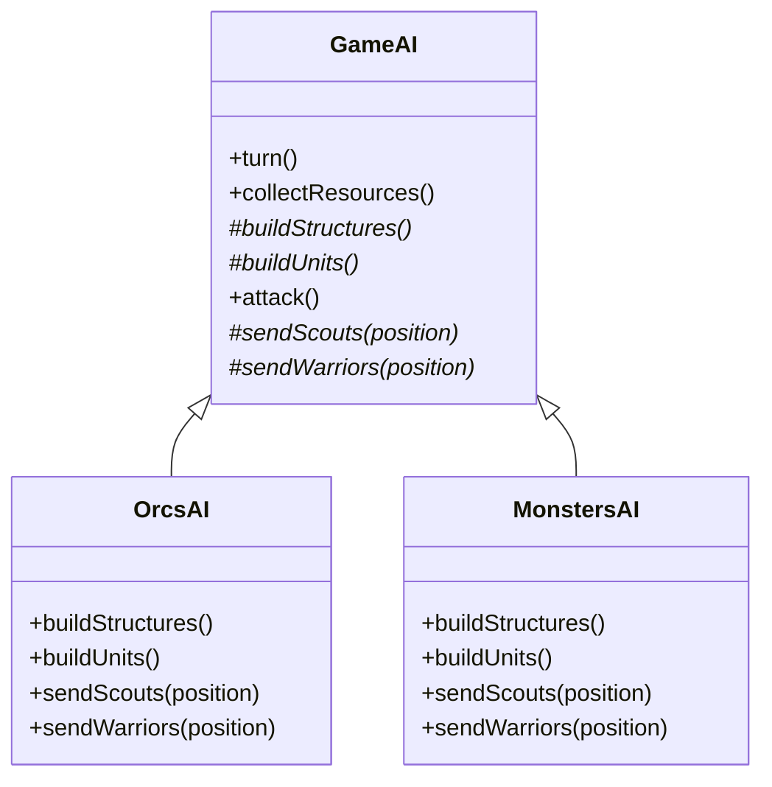
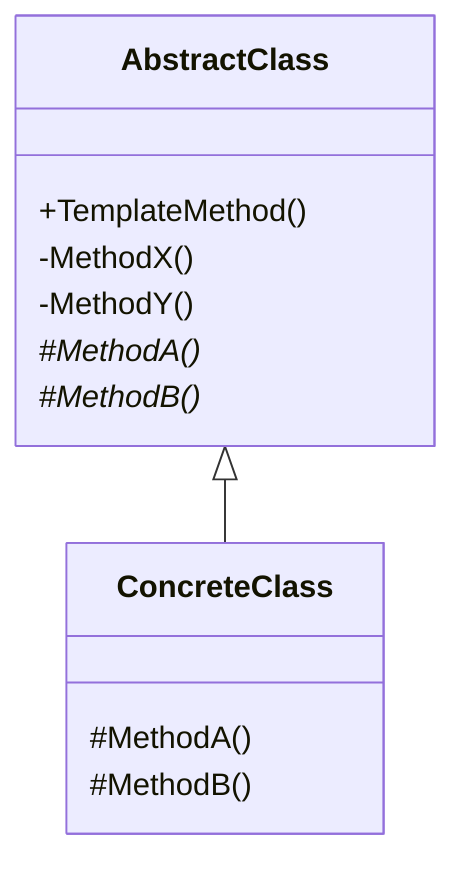
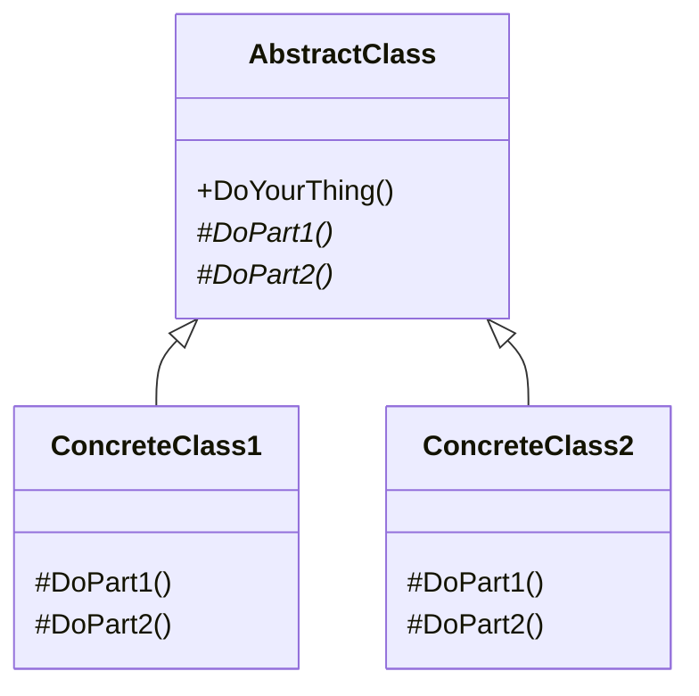
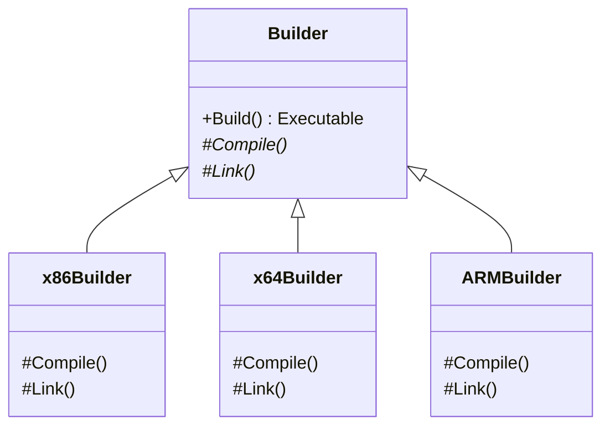
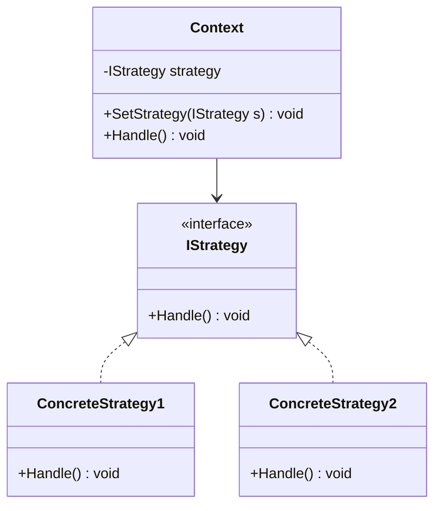
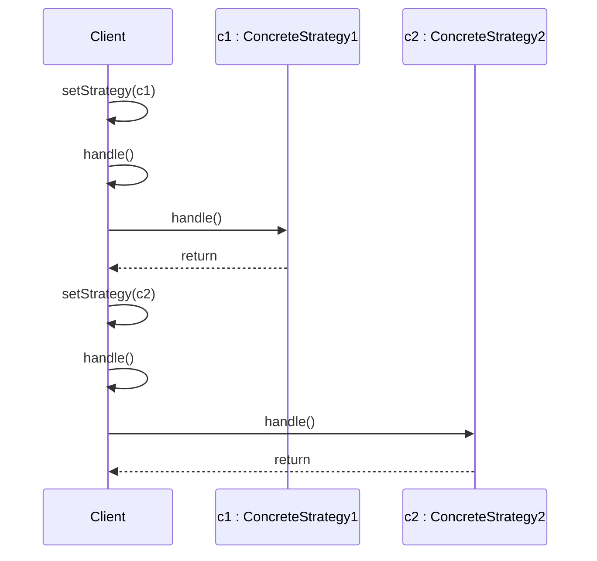
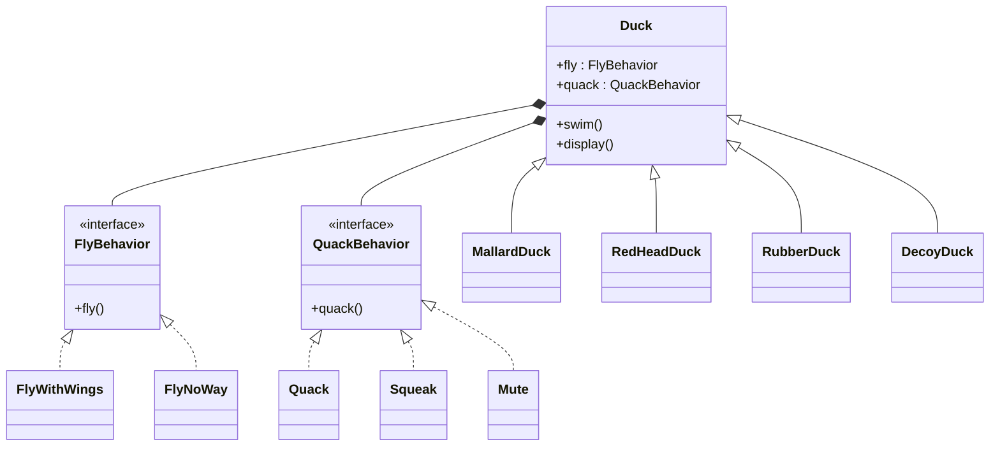

# Uge 7.1 — GoF Template Method og GoF Strategy

## Metadata

| Felt | Værdi |
|---|---|
| **Lektion** | Uge 7 — GoF Template Method, GoF Strategy |
| **Kursus** | Softwaredesign (SW4SWD-01) |
| **Forelæser** | Jørn Martin Hajek (HAJ) |
| **Kilde** | `GoF Template Method, GoF Strategy.pdf` (28 slides) |
| **Sprog/kode** | C# |
| **Emner dækket** | Template Method (intent, struktur, hooked methods, frameworks/Hollywood-princippet), Strategy (intent, struktur, sekvens, konsekvenser), sammenligning inheritance vs. delegation, Duck-eksemplet fra Head First Design Patterns, lab-øvelse "SuperSorter" |

---

## Agenda

1. GoF Template Method
2. GoF Strategy
3. Comparison
4. Lab exercise: "SuperSorter"

> Slide 3

Lektionen åbner med en meme om, at software­design er som at designe en båd: man bruger uendelige timer på at finde de ideelle materialer og teste motoren efter kundens præcise specifikationer — og når man er færdig, siger kunden *"Great job, we love it, just one little thing: we need it to fly."* Pointen er den samme som mønstrenes: variationspunkter skal være designet ind på forhånd, ellers koster ændringer en omskrivning.

> Slide 1

---

## 1. Motiverende eksempel: Game AI

Et strategispil har flere AI-typer (orker, monstre), som alle spiller en tur efter *samme* faste rækkefølge: indsaml ressourcer, byg strukturer, byg enheder, angrib. Selve rækkefølgen er invariant — det er kun *hvordan* hvert skridt udføres, der varierer pr. race.

Basisklassen `GameAI` er abstrakt og indeholder `turn()`, som fastlægger algoritmens skelet:

```csharp
// GameAI.turn() — skelettet, gengivet fra slidens noter
collectResources()
buildStructures()
buildUnits()
attack()
```

`collectResources()` er implementeret én gang for alle i basisklassen:

```csharp
foreach (s in this.builtStructures) do
  s.collect()
```

`attack()` er ligeledes fælles, men kalder to abstrakte skridt:

```csharp
enemy = closestEnemy()
if (enemy == null)
  sendScouts(map.center)
else
  sendWarriors(enemy.position)
```

De kursiverede (abstrakte) operationer på `GameAI` er `buildStructures()`, `buildUnits()`, `sendScouts(position)` og `sendWarriors(position)`. `OrcsAI` og `MonstersAI` arver fra `GameAI` og udfylder dem. `OrcsAI.buildStructures()` bygger farms, derefter barracks, derefter stronghold, hvis der er ressourcer; `OrcsAI.buildUnits()` bygger en peon til spejdergruppen hvis der ingen spejdere er, ellers en grunt til krigergruppen. `MonstersAI.buildStructures()` gør ingenting (`// do nothing`).



> Slide 4 (kilde: `https://refactoring.guru/design-patterns/template-method`)

---

## 2. GoF Template Method

### 2.1 Pattern name og intent

> **Pattern name:** Template Method
>
> **Intent:** "Define the *skeleton* of an algorithm in an operation, deferring some steps to client subclasses."

> Slide 5

Det centrale ord er *skeleton*. Basisklassen ejer rækkefølgen og kontrolflowet; subklasserne ejer indholdet af udvalgte skridt. Klienten kan derfor ikke ændre på, *hvornår* tingene sker — kun på *hvad* der sker.

### 2.2 Struktur (roller)

| Rolle | Ansvar |
|---|---|
| `AbstractClass` | Deklarerer `TemplateMethod()` (public, ikke-virtuel) som implementerer algoritmens skelet. Implementerer de invariante skridt (`MethodX()`, `MethodY()`, private) og deklarerer de variable skridt som abstrakte/protected (`MethodA()`, `MethodB()`). |
| `ConcreteClass` | Arver fra `AbstractClass` og implementerer de abstrakte skridt. Ejer ikke kontrolflowet. |



Selve template-metoden på sliden:

```csharp
public void TemplateMethod()
{
  MethodX();
  ...
  MethodA();
  ...
  MethodB();
  ...
  MethodY();
}
```

Bemærk synligheden i UML-boksen: `+TemplateMethod()` er public, `-MethodX()` og `-MethodY()` er private (invariante, kan ikke overskrives), mens `#MethodA()` og `#MethodB()` er protected og kursiverede — altså abstrakte hooks.

> Slide 6

### 2.3 Implementation og programflow

```csharp
public abstract class AbstractClass
{
    public void TemplateMethod()
    {
        MethodX();
        MethodA();
        MethodB();
        MethodY();
    }

    protected abstract void MethodA();
    protected abstract void MethodB();

    private void MethodX()
    {
        Console.WriteLine("MethodX called");
    }

    private void MethodY()
    {
        Console.WriteLine("MethodY called");
    }
}
```

```csharp
public class ConcreteClass1 : AbstractClass
{
    protected override void MethodA()
    {
        Console.WriteLine("ConcreteClass1 MethodA called");
    }

    protected override void MethodB()
    {
        Console.WriteLine("ConcreteClass1 MethodB called");
    }
}
```

```csharp
static void Main(string[] args)
{
    AbstractClass ac = new ConcreteClass1();
    ac.TemplateMethod();

    AbstractClass ac2 = new ConcreteClass2();
    ac2.TemplateMethod();
}
```

> Slide 7

Klienten holder referencen som `AbstractClass` — den ved ikke hvilken konkret subklasse den arbejder med. Programoutput:

```
MethodX called
ConcreteClass1 MethodA called
ConcreteClass1 MethodB called
MethodY called
MethodX called
ConcreteClass2 MethodA called
ConcreteClass2 MethodB called
MethodY called
Press any key to continue . . .
```

> Slide 8

Kaldsekvensen er altså: klienten kalder kun `TemplateMethod()` på basisklassen; basisklassen kalder selv ned i subklassens overrides. Det er en *inverteret* kontrolretning sammenlignet med normal biblioteksbrug.

### 2.4 Konkret eksempel: patientforløb

```csharp
public abstract class PatientCareProcess {
   public void AdmitPatient() {
       Console.WriteLine("Admitting patient...");
       PerformCheckup();
       DiagnosePatient();
       ProvideMedication();
       TreatPatient();
       DischargePatient();
       Console.WriteLine("Patient admitted.");
   }
   public void DiagnosePatient() {
       Console.WriteLine("Diagnosing patient..."); }
   public void TreatPatient() {
       Console.WriteLine("Treating patient..."); }
   public void DischargePatient() {
        Console.WriteLine("Discharging patient..."); }
   protected abstract void PerformCheckup();
   protected abstract void ProvideMedication(); }
```

```csharp
// Concrete class for inpatient care process
public class InpatientCareProcess : PatientCareProcess
{
  protected override void PerformCheckup() {
    Console.WriteLine("Performing comprehensive inpatient checkup.");
  }
  protected override void ProvideMedication() {
    Console.WriteLine("Administering inpatient medication and monitoring.");
  }
}
```

> Slide 9

Her er `AdmitPatient()` template-metoden. Forløbets rækkefølge er lovbestemt/proces­bestemt og må ikke variere; kun undersøgelsen og medicineringen afhænger af, om patienten er indlagt eller ambulant.

### 2.5 Frameworks og Hollywood-princippet

> "Template Method is commonly used in frameworks"
> - "Frameworks controls the flow (when to do something)"
> - "You instantiate the framework by implementing framework methods in derived classes"
>
> "Also called **Hollywood pattern** — Don't call us – we'll call you"

> Slide 10

Dette er kernen i mønstret set fra en arkitektur­vinkel. Et framework udgør den generiske, genbrugelige del; man *instantierer* det ved at nedarve og udfylde hooks. Kontrolflowet ligger i frameworket, ikke hos brugeren — deraf "don't call us, we'll call you".

Sliden viser opdelingen i to pakker: `Framework` indeholder `AbstractClass` med `+ DoYourThing()`, `# DoPart1()` og `# DoPart2()` (de to sidste kursiverede = abstrakte); `Instantiation` indeholder `ConcreteClass1` og `ConcreteClass2`, som begge arver fra `AbstractClass` og implementerer `# DoPart1()` og `# DoPart2()`.



> Slide 11 (`AbstractClass` ligger i pakken *Framework*, de to konkrete klasser i pakken *Instantiation*)

### 2.6 Eksempel 4: Build Process

En forenklet build-proces i fx C++: kildefilerne `A.cpp` og `B.cpp` samt headeren `C.hpp` går ind i **Compiler**, som producerer objektfilerne `A.o` og `B.o`. Disse går sammen med biblioteket `C.lib` ind i **Linker**, som producerer **Executable**.

> Slide 12 — opgaven på sliden: *"Describe, in general terms, how this build process could take place for different platforms (compiler suites) using the Template Method pattern"*

Svaret:

> "The *compile → link → return executable* sequence is fixed, but *actual* compilation and linkage is deferred to subclass(es)"

```csharp
abstract class Builder
{
  // Template Method
  public Executable Build(MakeFile m)
  {
    try
    {
      var objFiles = Compile(m.SourceFileList, m.HeaderFileList);  // Run compiler
      var executable = Link(objFiles, m.LibFiles);                 // Run linker
      return executable;                                           // Return the build result
    }
    catch(BuildError be)
    {
      // Build error occurred – handle it
      Console.WriteLine(be); // Do not do at home.
    }
  }

    protected abstract List<File> Compile(List<File> sourceFiles, List<File> headerFiles);
    protected abstract List<File> Link(List<File> objFiles, List<File> libFiles);
}
```

`Builder` har `+ Build(): Executable`, `# Compile()` og `# Link()` (de to sidste kursiverede = abstrakte). `x86Builder`, `x64Builder` og `ARMBuilder` arver alle fra `Builder` og implementerer `# Compile()` og `# Link()`.



> Slide 13

Bemærk desuden, at fejlhåndteringen (`try/catch(BuildError)`) også ligger i template-metoden — subklasserne behøver ikke gentage den. Kommentaren *"Do not do at home"* er forelæserens forbehold mod at `Console.WriteLine` en exception som produktions­fejlhåndtering.

### 2.7 Abstrakte metoder — varianter af hooks

> **Optional operation**
> - Empty implementation in root object – **Hooked Method**
>
> **Similar for all subclasses**
> - Final declaration

> Slide 14

Der er altså tre grader af "variabelt skridt" i en Template Method:

| Type | Deklaration i basisklassen | Betydning for subklassen |
|---|---|---|
| Obligatorisk hook | `protected abstract void MethodA();` | *Skal* implementeres — subklassen kan ikke oversættes uden |
| Valgfri hook (*hooked method*) | Tom, ikke-abstrakt implementering | *Kan* overskrives; ellers sker der ingenting |
| Invariant skridt | Private eller `final`/ikke-virtuel | Kan *ikke* overskrives — ens for alle subklasser |

Faustreglen: minimér antallet af abstrakte operationer. Jo flere hooks, jo tungere er det at skrive en ny subklasse.

---

## 3. GoF Strategy

### 3.1 Pattern name og intent

> **Pattern name:** Strategy
>
> **Intent:** "Define a *family* of algorithms, encapsulate each one, and make them interchangeable at runtime."

> Slide 15

To ord bærer forskellen til Template Method: *family* (algoritmerne er sideordnede, ikke skridt i en større algoritme) og *at runtime* (udskiftningen sker på et levende objekt, ikke ved oversættelse).

### 3.2 Struktur (roller)

| Rolle | Ansvar |
|---|---|
| `Context` | Holder en reference `- IStrategy: strategy`. Udstiller `+SetStrategy(IStrategy s): void` og `+Handle(): void`. `Handle()` delegerer arbejdet til den aktuelle strategi. |
| `IStrategy` | Interface (`<<interface>>`) der deklarerer `Handle(): void` — den fælles kontrakt for hele algoritmefamilien. |
| `ConcreteStrategy1`, `ConcreteStrategy2` | Realiserer `IStrategy` og implementerer hver sin variant af `+ Handle(): void`. |



> Slide 16 — `Context` har en almindelig association (åben pil) til `IStrategy`; de to konkrete strategier realiserer interfacet (stiplet linje, hul trekant).

### 3.3 Kollaboration / kaldsekvens



> Slide 17 — på sliden kommer `setStrategy(c1)` og `handle()` ind udefra på `Client`s livslinje; `Client` videresender `handle()` til `c1`, som returnerer (stiplet pil). Derefter gentages mønstret med `c2`.

Pointen i sekvensen: **samme** kald `handle()` giver **forskellig** adfærd, alene fordi `setStrategy(...)` blev kaldt imellem. Ingen recompilering, ingen ny type — kun et andet objekt bag referencen.

> "The Strategy pattern enables the *behavior* of the context to be defined at runtime by delegating it to another object."

> Slide 18

### 3.4 Eksempel: Event logging

```csharp
class SomeSubSystem
{
  public ILog Log {set; private get;}

  public SomeSubSystem()
  {
    Log = new NullLog(); // Default
  }

  public void DoYourThing()
  {
    Log.Log("Event occurred");
  }
}
```

```csharp
interface ILog
{
  void Log(string s);
}
```

```csharp
class ConsoleLog : ILog
{
  public void Log(string s)
  {
    Console.WriteLine(s);
  }
}
```

```csharp
class FileLog : ILog
{
  ...
}
```

> Slide 19

`SomeSubSystem` er `Context`, `ILog` er strategy-interfacet, og `ConsoleLog`/`FileLog`/`NullLog` er `ConcreteStrategy`. To detaljer er værd at bemærke til eksamen:

1. **`{set; private get;}`** — strategien kan sættes udefra, men ikke læses udefra. Konteksten eksponerer altså ikke sin egen strategi.
2. **`NullLog` som default** — et Null Object gør, at `Log.Log(...)` altid er sikkert at kalde. Uden det ville man skulle `null`-tjekke ved hvert kald, og konteksten ville være ubrugelig indtil klienten havde sat en strategi.

### 3.5 Andre anvendelser

- Sorting
- Games
- Checks/rules
- …?

> Slide 20

Fælles træk: en operation hvor der findes flere ligeværdige algoritmer, og hvor valget afhænger af data, brugerpræference eller konfiguration i stedet for af typen.

### 3.6 Konsekvenser og trade-offs

> - Alternative to sub-classing
> - Eliminate switch/case
> - Increases number of classes (stateless)
> - Number of possible implementations
> - Overhead between Strategy & Context
>   - Strategy interface handles simple to complex

> Slide 21

Udfoldet:

| Konsekvens | Uddybning |
|---|---|
| **Alternativ til subclassing** | Man varierer adfærd uden at arve. Konteksten forbliver én klasse, uanset hvor mange algoritmer der findes. |
| **Eliminerer switch/case** | En `switch` over en algoritme-enum bliver til polymorfi. Ny algoritme = ny klasse, ikke en ny `case` i en voksende metode (Open/Closed). |
| **Flere klasser** | Hver strategi er en klasse. Er de *stateless*, kan de deles/genbruges som singletons og koster intet i hukommelse — men de fylder stadig i kodebasen. |
| **Antal mulige implementeringer** | Klienten skal kende strategierne for at kunne vælge imellem dem. Det lækker viden om familien ud til klienten. |
| **Overhead mellem Strategy og Context** | Interfacet skal dække *alle* strategier — også de simple. En simpel strategi tvinges til at modtage parametre, den ikke bruger, eller konteksten må sende sig selv med, så strategien kan hente data. Det koster både kald og kobling. |

### 3.7 Hvornår skal man *ikke* bruge Strategy

- Når der kun findes én algoritme, og der ikke er nogen realistisk udsigt til en anden — så er indirektionen ren omkostning.
- Når "algoritmerne" i virkeligheden er skridt i én fast sekvens; så er Template Method det rigtige valg.
- Når strategierne kræver så meget af kontekstens interne tilstand, at strategy-interfacet reelt bliver kontekstens egen datamodel — så er indkapslingen brudt.
- Når valget aldrig ændrer sig efter opstart, og sproget har billigere mekanismer (fx en delegate/lambda eller et funktionsargument) til samme formål.

---

## 4. Comparison — Template Method vs. Strategy

> - "GoF Template Method and GoF Strategy are both **behavioral patterns**."
> - "Both are used to make the behavior of a system **extensible**."
> - "GoF Template Method uses *inheritance*" — Callback implementations, Frameworks, Behavior fixed at compile-time
> - "GoF Strategy uses *delegation*" — Behavior can be changed at runtime

> Slide 22

### 4.1 Sammenligningstabel

| | **Template Method** | **Strategy** |
|---|---|---|
| GoF-kategori | Behavioral | Behavioral |
| Formål | Behavior extensible | Behavior extensible |
| Mekanisme | **Inheritance** (arv) | **Delegation** (komposition) |
| Variationsenhed | Ét eller flere *skridt* i en fast algoritme | *Hele* algoritmen |
| Hvem ejer kontrolflowet | Basisklassen (`TemplateMethod()`) | Konteksten kalder, men strategien afgør alt indhold |
| Hvornår bindes adfærden | **Compile-time** — fastlagt af hvilken subklasse man instantierer | **Runtime** — kan skiftes via `SetStrategy(...)` |
| Kan adfærd skifte i objektets levetid | Nej | Ja |
| Antal objekter | Ét (subklasseinstansen) | To (kontekst + strategiobjekt) |
| Typisk anvendelse | Frameworks, callback-implementeringer, Hollywood-princippet | Familier af ligeværdige algoritmer (sortering, regler, logning) |
| Relation mellem roller | `ConcreteClass` **is-a** `AbstractClass` | `Context` **has-a** `IStrategy` |
| Genbrug af en variant | Bundet til én arvehierarki-gren | Samme strategiobjekt kan bruges af flere kontekster |
| Kobling | Stærk (arv er den stærkeste kobling i OO) | Løs (kun mod interfacet) |

### 4.2 Inheritance vs. Delegation — de to strukturer side om side

**Inheritance (Template Method):**


**Delegation (Strategy):**


> Slide 23 — de to diagrammer står på samme slide til direkte sammenligning.

---

## 5. Duck-eksemplet: hvorfor arv skalerer dårligt

Eksemplet er tilpasset fra Freeman, Eric, Elisabeth Robson, Bert Bates og Kathy Sierra: *Head First Design Patterns*, O'Reilly Media, Inc., 2008. Det udfoldes over fire slides som en gradvis forværring efterfulgt af løsningen.

### 5.1 Trin 1 — ny metode i basisklassen

Abstrakt `Duck` med `+ quack()`, `+ swim()`, `+ display()`. Subklasserne `MallardDuck` og `RedHeadDuck` arver uden at tilføje noget. Så tilføjes `+ fly()` til `Duck` (markeret rødt), og `RubberDuck` kommer til:

> 1. "Newly added method (has to be implemented in every subclass)"
> 2. "Newly added subclass (does not quite match the initial assumptions about "is a" Duck)"

`RubberDuck` må skrive:

```csharp
quack(){ // squeak }
fly() { //NoOp }
```

> Slide 24

To problemer på én gang: en ny metode på basisklassen tvinger sig ned i *alle* subklasser, og en ny subklasse passer ikke til den oprindelige "is-a"-antagelse. `fly()` som `NoOp` er et lugtende symptom — det er en løgn i typen.

### 5.2 Trin 2 — endnu en afvigende subklasse

`DecoyDuck` (lokkefugl) tilføjes:

```csharp
quack(){ // NoOp }
fly() { //NoOp }
```

> "One more subclass (also does not match the initial assumptions about "is a" Duck)"

> Slide 25

Nu er *to* af fire arvinger tomme skaller. Problemet er ikke antallet af subklasser — det er at adfærden varierer på tværs af hierarkiet i stedet for at følge det.

### 5.3 Trin 3 — interfaces (bedre, men ikke godt nok)

> 1. "Separate varying behaviors into two interfaces, so subclasses can choose which ones they implement."
> 2. "RubberDuck only implements Quackable and DecoyDuck implements no quack nor fly."
> 3. "Interfaces are used because most OO Programming Languages do not support multiple inheritance. So quack and fly have to be implemented in every subclass."
> 4. "What is the problem with this design?"

`Duck` reduceres til `+ swim()` og `+ display()`. To interfaces tilføjes: `<<Interface>> Flyable` med `+ fly()` og `<<Interface>> Quackable` med `+ quack()`. `MallardDuck` og `RedHeadDuck` implementerer begge interfaces; `RubberDuck` kun `Quackable`; `DecoyDuck` ingen af dem.

> Slide 26

Svaret på spørgsmål 4: interfaces fjerner løgnen i typen, men de indeholder ingen kode. Adfærden `fly()` skal derfor skrives om i hver eneste flyvende and — al genbrug er tabt, og en rettelse i flyvelogikken skal laves flere steder.

### 5.4 Trin 4 — delegation (Strategy)

> 1. "Encapsulate varying behaviors into objects that can be composed (like lego) into Duck class"
> 2. "Different strategies for FlyBehavior are implemented as subclasses"
> 3. "Subclasses just compose the behaviors they represent"
> 4. "Behaviors that do not vary among subclasses can remain in the Duck abstract class."

Strukturen: `<<Interface>> FlyBehavior` med `+ fly()` realiseres af `FlyWithWings` og `FlyNoWay`. `<<Interface>> QuackBehavior` med `+ quack()` realiseres af `Quack`, `Squeak` og `Mute`. Abstrakte `Duck` har felterne `+ fly: FlyBehavior` og `+ quack: QuackBehavior` samt de invariante operationer `+ swim()` og `+ display()`. `MallardDuck`, `RedHeadDuck`, `RubberDuck` og `DecoyDuck` arver fra `Duck`.

Sammensætningen sker i konstruktøren:

```csharp
public MallardDuck(){
  this.fly = new FlyWithWings()
  this.quack = new Quack()
}
```

```csharp
public RubberDuck(){
  this.fly = new FlyNoWay()
  this.quack = new Squeak()
}
```

> Slide 27 — `Duck` har en komposition (fyldt rombe på `Duck`-siden) til henholdsvis `FlyBehavior` og `QuackBehavior`; de fem behavior-klasser realiserer deres respektive interfaces; de fire and-klasser arver fra `Duck`.



Dette er Strategy anvendt to gange på samme kontekst. Gevinsterne i forhold til trin 3: adfærden er implementeret ét sted (`FlyNoWay` deles af alle ikke-flyvende ænder), en ny adfærd (`Mute`) kræver ingen ændring i and-hierarkiet, og fordi felterne er referencer, *kan* adfærden principielt også skiftes efter konstruktion — det er runtime-variationen, arv ikke kan give.

> Slide 27

---

## 6. Lab exercise: "SuperSorter"

Øvelsen står på agendaen som lektionens praktiske del. Opgaven er at bygge en sorterings­komponent hvor selve sorteringsalgoritmen er en Strategy: samme `Sort()`-kald skal kunne udføres med forskellige algoritmer valgt på runtime. Slide 28 er en afsluttende spørgsmåls-slide (billede af spørgsmålstegn) uden tekstindhold.

> Slide 28

---

## Opsummering

- **Template Method** definerer skelettet af en algoritme i en operation og udskyder enkelte skridt til subklasser. Basisklassen ejer rækkefølgen; subklassen udfylder hullerne. Bindingen sker på **compile-time** via **arv**.
- **Strategy** definerer en familie af algoritmer, indkapsler hver enkelt og gør dem udskiftelige på **runtime** via **delegation**. Konteksten holder en reference til et strategy-interface og kan skifte den ud med `SetStrategy(...)`.
- Begge er **behavioral patterns**, og begge løser samme grundproblem: at gøre systemets adfærd udvidelig. Forskellen er mekanismen (inheritance vs. delegation) og bindingstidspunktet (compile-time vs. runtime).
- Template Method er frameworkets mønster — **Hollywood-princippet**: "Don't call us, we'll call you." Frameworket styrer *hvornår*; du leverer *hvad* ved at implementere hooks i afledte klasser.
- Hooks findes i tre grader: abstrakte (skal implementeres), *hooked methods* med tom default (kan overskrives) og invariante skridt (kan ikke overskrives).
- Strategy eliminerer `switch/case` og er et alternativ til subclassing, men koster flere klasser, lækker kendskabet til algoritmefamilien ud til klienten og pålægger overhead i grænsefladen mellem `Context` og `Strategy`.
- **Duck-eksemplet** er kursets kanoniske argument for "favor composition over inheritance": arv tvinger ny adfærd ned i alle subklasser, rene interfaces dræber genbrug, mens indkapslede behavior-objekter kan sammensættes frit som lego.
