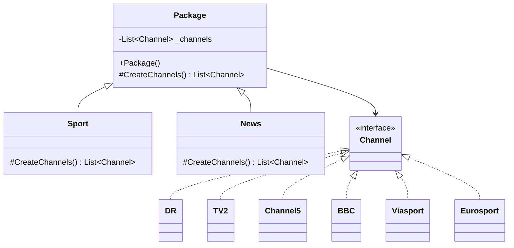
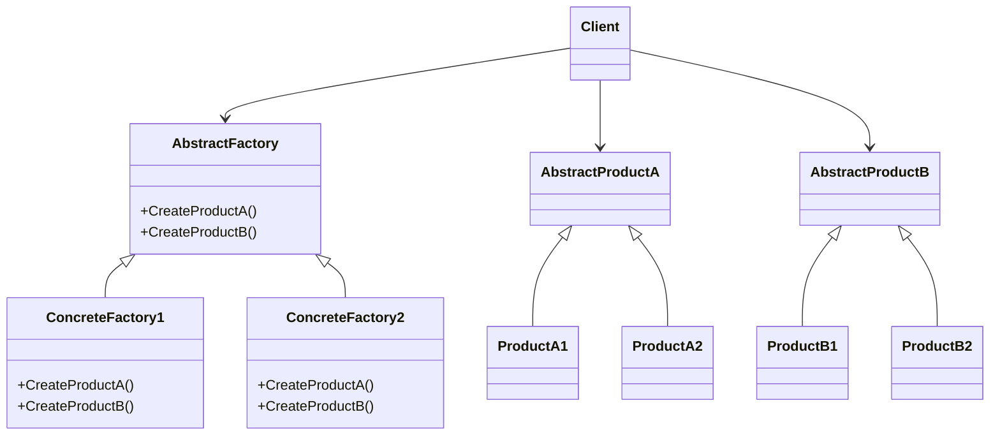
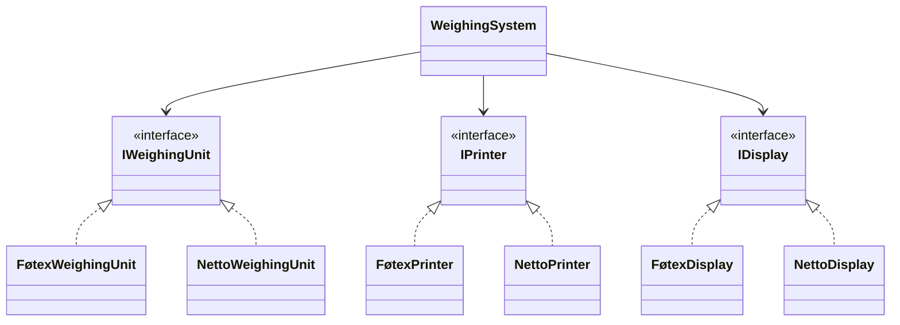
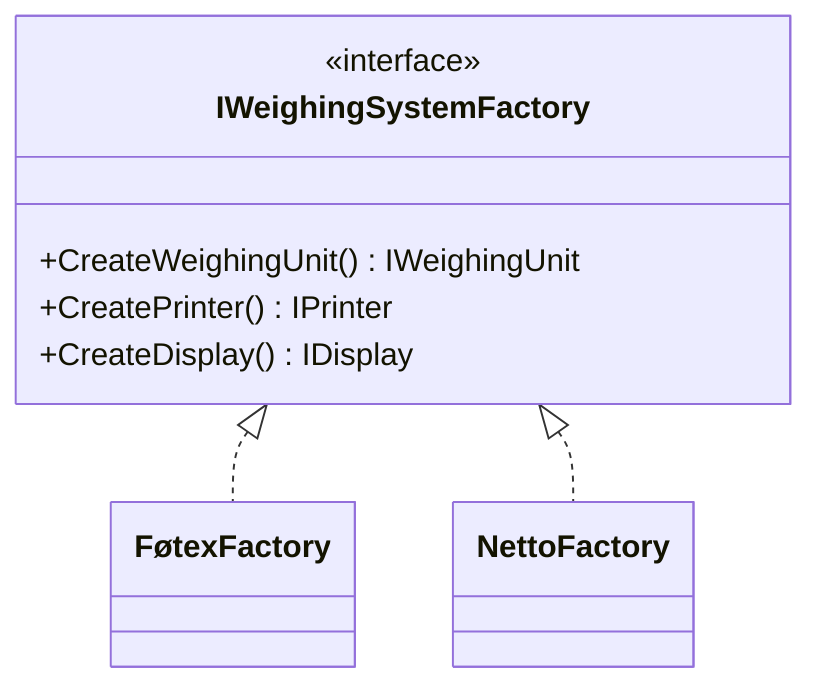
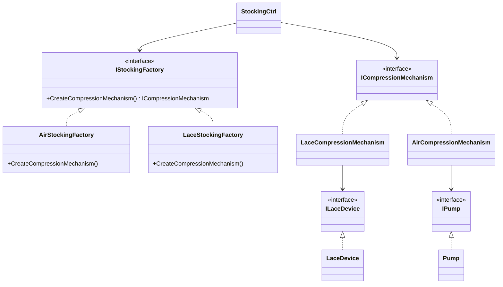

# Uge 7.2 — GoF Factory Method og GoF Abstract Factory

## Metadata

| Felt | Værdi |
|---|---|
| **Lektion** | Uge 7 — GoF Factory Method, GoF Abstract Factory |
| **Kursus** | Softwaredesign (SW4SWD-01) |
| **Forelæser** | Jørn Martin Hajek (HAJ) |
| **Kilde** | `GoF Factory Method, Gof Abstract Factory.pdf` (21 slides, version 1.0.2) |
| **Sprog/kode** | C# |
| **Emner dækket** | Factories som arkitekturmiddel (SRP, OCP), motivation (Document/Page), Factory Method (intent, struktur, Package/Channel-eksempel), Factory Method vs. Template Method, Abstract Factory (intent, struktur, WeighingSystem-eksempel, CompressionStocking-eksempel), DIP, andre creational patterns (Builder, Singleton, Prototype) |

---

## Agenda

1. Factories i software­arkitektur — mål og motivation
2. GoF Factory Method
3. Diskussion: Factory Method vs. Template Method
4. GoF Abstract Factory
5. Andre factories: Builder, Singleton, Prototype

---

## 1. Factories i software­arkitektur

Forelæsningen åbner med en tegneserie ("Design Patterns – Bureaucracy", monkeyuser.com), hvor man vandrer fra bygningen `ABSTRACT FACTORY` til `INITIALIZER`, `OBJ POOL`, `CHAIN OF RESPONSABILITY`, `PROXY`, `SINGLETON` osv. for til sidst at få udleveret en reference — "But this is a runtime…" — hvorefter alt fejler. Pointen er den samme som kritikken af creational patterns generelt: indirektionen har en pris, og over­anvendt bliver den til bureaukrati.

> Slide 1

> **The general goals of factories are:**
> - "to separate the creation of an object from its use – **SRP**"
> - "Make object creation code open for extension but closed for modification (**OCP**)"
>
> "Factories come in many different flavors – we will look at two classics:"
> - **GoF Factory Method:** "Define an interface for creating an object, but let the classes that implement the interface decide which object to instantiate."
> - **GoF Abstract Factory:** "Define an interface for creating families of related or dependent objects without specifying their concrete classes"

> Slide 4

De to mål er værd at holde adskilt til eksamen:

| Mål | SOLID-princip | Hvad det betyder konkret |
|---|---|---|
| Adskil oprettelse fra anvendelse | **SRP** (Single Responsibility) | En klasse skal enten *bruge* et objekt eller *bygge* det — ikke begge dele. At kende alle konstruktørargumenter til alle afhængigheder er et ansvar i sig selv. |
| Åben for udvidelse, lukket for ændring | **OCP** (Open/Closed) | Ny produkttype skal kunne tilføjes uden at røre den eksisterende oprettelseskode — ingen ny `case` i en `switch`. |

### 1.1 Motivation: Document og Page

Et `Document` indeholder en `+ pages: List<Page>` og har `+ Document()` og `+ print()`. `Page` er et `«interface»`, som realiseres af `Introduction`, `TableOfContents`, `Conclusion`, `Body`, `Abstract` og `Resume`.

Sliden stiller problemet op i to noter:

> 1. "Document "in theory" should only depend on Page interface"
> 2. "In practice", because of constructor, it depends on the concrete implementations of Page."

Konstruktørens indhold afslører hvorfor:

```csharp
var pages = new List<Page>();
pages.Add(new Abstract());
pages.Add(new Resume());
...
return pages;
```

> Slide 5

De røde pile på sliden går fra `+ Document()` til `Abstract` og `Resume` — altså fra konstruktøren til de *konkrete* klasser. Feltet `pages` afhænger kun af interfacet `Page` (sort stiplet pil), men konstruktøren skaber en direkte afhængighed til hver enkelt konkret sideimplementering. Det er præcis den afhængighed, en factory skal fjerne: `new` er en hårdkodning af en konkret type, uanset hvor pænt interfacet ellers er designet.

---

## 2. GoF Factory Method

### 2.1 Intent

> "**Factory Method:** Define an interface for creating an object(s), but let the classes that implement the interface decide which object(s) to instantiate."

> Slide 7

Bemærk forelæserens tilføjelse af "(s)": i eksemplet returnerer factory-metoden faktisk en *liste* af objekter, ikke ét enkelt. Det er en let udvidelse af GoF's originale formulering.

### 2.2 Struktur (roller)

Eksemplet er en TV-pakke. `Package` er abstrakt Creator med `- _channels: List<Channel>`, en `+ Package()` konstruktør og den abstrakte factory-metode `# CreateChannels(): List<Channel>` (kursiveret på sliden = abstrakt). `Sport` og `News` arver fra `Package` og implementerer hver sin `# CreateChannels(): List<Channel>`.

`Channel` er et `<<Interface>>`. `DR`, `TV2`, `Channel 5`, `BBC`, `Viasport` og `Eurosport` realiserer `Channel`.

| GoF-rolle | Klasse i eksemplet |
|---|---|
| `Creator` | `Package` — indeholder factory-metoden og bruger dens resultat |
| `ConcreteCreator` | `Sport`, `News` — bestemmer hvilke produkter der oprettes |
| `Product` | `Channel` (interface) |
| `ConcreteProduct` | `DR`, `TV2`, `Channel5`, `BBC`, `Viasport`, `Eurosport` |



> Slide 7 — `Package` har en almindelig association til `Channel` gennem feltet `_channels`; de seks kanalklasser realiserer interfacet (stiplet linje, hul trekant).

### 2.3 Implementation

Sliden præciserer intent'en med selve metodenavnet indsat:

> "*Factory Method*: Define an interface (`CreateChannels()`) for creating an object(s), but let the classes that implement the interface decide which object(s) to instantiate."

```csharp
class Package
{
  private List<Channel> _channels;
  public Package()
  {
    _channels = CreateChannels();
  }

    protected abstract List<Channel> CreateChannels();
}
```

```csharp
class Sport : Package
{
  protected override List<Channel> CreateChannels()
  {
    var channels = new List<Channel>();
    channels.Add(new Viasport());
    channels.Add(new Eurosport());
    return channels;
  }
}
```

```csharp
class News : Package
{
  protected override List<Channel> CreateChannels()
  {
    var channels = new List<Channels>();
    channels.Add(new BBC());
    channels.Add(new DR());
    channels.Add(new TV2());
    channels.Add(new Channel5());
    return channels;
  }
}
```

Sliden markerer begge mål som opfyldt:

> **Recap Goals:**
> - "to separate the creation of an object from its use – SRP" ✔
> - "Make creation code open for extension but closed for modification (OCP)" ✔

> Slide 8

Kollaborationen: `Package`s konstruktør kalder `CreateChannels()`, som på grund af polymorfi rammer subklassens implementering. `Package` bruger altså resultatet uden nogensinde at kende en eneste konkret `Channel`-klasse. En ny pakketype (fx `Kids`) tilføjes som en ny subklasse — ingen eksisterende kode ændres.

**Advarsel til implementeringen:** at kalde en virtuel/abstrakt metode fra en konstruktør (som `Package()` gør her) er et kendt faresignal i C# og Java, fordi subklassens felter endnu ikke er initialiseret på det tidspunkt. Sliden gør det for at holde eksemplet kort; i produktionskode ville man kalde `CreateChannels()` fra en initialiseringsmetode eller lazy ved første brug.

### 2.4 Konsekvenser og trade-offs

| Fordel | Ulempe |
|---|---|
| Creator er fri for `new` på konkrete produkter — afhænger kun af `Product`-interfacet | Kræver et arvehierarki: hver produktvariant koster en ny Creator-subklasse |
| Nye produkter tilføjes ved at tilføje kode, ikke ændre kode (OCP) | Klienten skal vælge den rigtige ConcreteCreator — valget flyttes, det forsvinder ikke |
| Adskiller oprettelse fra anvendelse (SRP) | Bindingen er compile-time: en `Sport`-instans kan aldrig blive til en `News`-instans |
| Factory-metoden kan indeholde vilkårligt kompleks opbygningslogik | Flere klasser, dybere hierarki, sværere at overskue for en nybegynder |

### 2.5 Hvornår skal man *ikke* bruge Factory Method

- Når der kun findes én konkret produkttype, og den ikke forventes at få selskab — så er `new` direkte i koden både kortere og tydeligere.
- Når valget af produkt skal kunne ændre sig i objektets levetid — arv låser det fast; brug i stedet en injiceret factory eller Strategy.
- Når man i forvejen bruger en dependency injection-container, der kan levere produktet — så duplikerer factory-hierarkiet containerens arbejde.

### 2.6 Diskussion: Factory Method vs. Template Method

> "**Discussion:** What's the difference between template method and factory method patterns?"

> Slide 9 — sliden viser Template Method-strukturen (`AbstractClass`/`ConcreteClass` med `TemplateMethod()`) og Factory Method-strukturen (`Package`/`Sport`/`News` med `Channel`) side om side.

Svaret, som man skal kunne give til eksamen:

| | **Template Method** | **Factory Method** |
|---|---|---|
| GoF-kategori | **Behavioral** | **Creational** |
| Hvad udskydes til subklassen | Ét eller flere *skridt* i en algoritme | *Hvilke objekter der instantieres* |
| Hvad returnerer den udskudte metode | Typisk `void` — den udfører et skridt | Et *produkt* (eller en samling produkter) |
| Basisklassens rolle | Ejer algoritmens rækkefølge | Ejer anvendelsen af det oprettede produkt |
| Mekanisme | Arv | Arv |
| Bindingstidspunkt | Compile-time | Compile-time |

Strukturelt er de næsten identiske — begge er en basisklasse med en abstrakt protected metode, som subklasser overskriver. Forskellen ligger i *intent*: Template Method varierer **adfærd**, Factory Method varierer **oprettelse**. Faktisk er Factory Method ofte implementeret *som* en Template Method: `Package()` er skelettet, `CreateChannels()` er hooket.

---

## 3. GoF Abstract Factory

### 3.1 Intent

> "Define an interface for creating *families* of related or dependent objects without specifying their concrete classes"

> Slide 11

Nøgleordet er **families**. Factory Method laver ét produkt (eller én slags produkt); Abstract Factory laver et *sæt* af produkter, som hører sammen og skal være konsistente indbyrdes.

### 3.2 Struktur (roller)

| Rolle | Ansvar |
|---|---|
| `AbstractFactory` | Deklarerer én create-operation pr. produkttype: `+CreateProductA()`, `+CreateProductB()`. |
| `ConcreteFactory1`, `ConcreteFactory2` | Implementerer create-operationerne, hver med sin egen produktfamilie. |
| `AbstractProductA`, `AbstractProductB` | Interfacet/basisklassen for hver produkttype. |
| `ProductA1`, `ProductA2`, `ProductB1`, `ProductB2` | De konkrete produkter. `ConcreteFactory1` laver `ProductA1` + `ProductB1`, `ConcreteFactory2` laver `ProductA2` + `ProductB2`. |
| `Client` | Bruger kun `AbstractFactory` og de abstrakte produkter — kender ingen konkrete klasser. |



> Slide 11 — de stiplede pile fra `ConcreteFactory1`/`ConcreteFactory2` til de konkrete produkter angiver, hvilken factory der instantierer hvilket produkt (`«create»`-afhængigheder).

Den centrale garanti: så længe klienten kun har én factory, kan den ikke komme til at blande familierne. `ConcreteFactory1` returnerer *aldrig* et `ProductB2`.

### 3.3 Eksempelsystem: `WeighingSystem`

Udgangspunktet er et system, hvis afhængigheder er hårdkodet:

```csharp
public class FøtexWeighingSystem
{
    private FøtexWeighingUnit _weighingUnit;
    private FøtexPrinter _printer;
    private FøtexDisplay _display;

    public WeighingSystem()
    {
        _weighingUnit = new FøtexWeighingUnit();
        _printer = new FøtexPrinter();
        _display = new FøtexDisplay();
    }
}
```

```csharp
public class Application
{
    public static void Main()
    {
        var føtexWs =
                   new FøtexWeighingSystem();
    }
}
```

Første skridt er **Dependency Inversion**: afhængighederne bliver til interfaces og bliver injiceret gennem konstruktøren.

```csharp
public class WeighingSystem
{
    private IWeighingUnit _weighingUnit;
    private IPrinter _printer;
    private IDisplay _display;

    public WeighingSystem(
            IWeighingUnit weighingUnit,
            IPrinter printer,
            IDisplay display)
    {
        _weighingUnit = weighingUnit;
        _printer = printer;
        _display = display;
    }
}
```

```csharp
public class Application
{
    public static void Main()
    {
        // Create a Føtex weight
        var føtexWs = new WeighingSystem(
                new FøtexWeighingUnit(),
                new FøtexPrinter(),
                new FøtexDisplay());
        }
        }
```

> Slide 12

Bemærk: `FøtexWeighingSystem` er forsvundet som type. Der findes nu kun én `WeighingSystem`-klasse — varianten bestemmes af de objekter, den får ind.

### 3.4 WeighingSystem efter DIP

`WeighingSystem` afhænger nu af tre interfaces: `<< interface >> IWeighingUnit`, `<< interface >> IPrinter` og `<< interface >> IDisplay`. Hvert interface realiseres af to konkrete klasser — en Føtex- og en Netto-variant:

| Interface | Konkrete implementeringer |
|---|---|
| `IWeighingUnit` | `FøtexWeighingUnit`, `NettoWeighingUnit` |
| `IPrinter` | `FøtexPrinter`, `NettoPrinter` |
| `IDisplay` | `FøtexDisplay`, `NettoDisplay` |



> Slide 13 — spørgsmålet på sliden: *"Question: how many different WeighingSystems can now be created?"*

Svaret er **2 × 2 × 2 = 8**. Og det er netop problemet: kun **2** af de 8 kombinationer er gyldige (ren Føtex eller ren Netto). De øvrige 6 er meningsløse blandinger, som typesystemet ikke fanger.

### 3.5 Uden Abstract Factory

> "Creation of `WeighingSystem` variants is complex and error prone"

```csharp
public class Application
{
    public static void Main()
    {
        // Create a Føtex weight
        var føtexWs = new WeighingSystem(
              new FøtexWeighingUnit(),
              new FøtexPrinter(),
              new FøtexDisplay());
       }
       }
```

```csharp
public class Application
{
    public static void Main()
    {
        // Create a Netto weight
        var nettoWs = new WeighingSystem(
              new NettoWeighingUnit(),
              new NettoPrinter(),
              new FøtexDisplay());
       }
       }
```

> Slide 14

Fejlen er i sidste linje: en Netto-vægt får en `FøtexDisplay()`. Sliden markerer den med en pil til det berømte still fra *The IT Crowd*, hvor kontoret står i flammer. Compileren siger ingenting — begge argumenter er gyldige `IDisplay`. Fejlen opdages først i drift.

Det er den præcise motivation for Abstract Factory: **familie­konsistens kan ikke sikres af et interface pr. produkt; den skal sikres af én factory pr. familie.**

### 3.6 Med Abstract Factory

> "By using GoF Abstract Factory we can isolate the complex creation of object families in factory classes …"

Der tilføjes `<< interface >> IWeighingSystemFactory` med tre create-operationer:

```
+ CreateWeighingUnit(): IWeighingUnit
+ CreatePrinter(): IPrinter
+ CreateDisplay(): IDisplay
```

Den realiseres af to *concrete factories*: `FøtexFactory` og `NettoFactory`. `WeighingSystem` afhænger nu af `IWeighingSystemFactory` (stiplet afhængighed) ud over de tre produktinterfaces.

> Slide 15 — sliden grupperer `IWeighingSystemFactory` i en grøn boks mærket *Abstract factory* og de to konkrete factories i en grøn boks mærket *Concrete factories*.



Koden:

```csharp
public class Application
{
  public static void Main()
  {
    // Create a Føtex weight
    var føtexWs = new WeighingSystem(new FøtexFactory());
  }
}
```

```csharp
public class Application
{
  public static void Main()
  {
    // Create a Netto weight
    var nettoWs = new WeighingSystem(new NettoFactory());
  }
}
```

```csharp
public class FøtexFactory : IWeighingSystemFactory
{
    public IWeighingUnit CreateWeighingUnit() {
        return new FøtexWeighingUnit();
    }
    public IDisplay CreateDisplay() {
        return new FøtexDisplay();
    }
    public IPrinter CreatePrinter() {
        return new FøtexPrinter();
    }
}
```

```csharp
public class NettoFactory : IWeighingSystemFactory
{
    public IWeighingUnit CreateWeighingUnit() {
        return new NettoWeighingUnit();
    }
    public IDisplay CreateDisplay() {
        return new NettoDisplay();
    }
    public IPrinter CreatePrinter() {
        return new NettoPrinter();
    }
}
```

```csharp
public class WeighingSystem
{
    private IWeighingUnit _weighingUnit;
    private IPrinter _printer;
    private IDisplay _display;

    public WeighingSystem(IWeighingSystemFactory factory)
    {
        _weighingUnit = factory.CreateWeighingUnit();
        _printer = factory.CreatePrinter();
        _display = factory.CreateDisplay();
    }
}
```

> Slide 16

Kollaborationen: klienten vælger *én* factory og giver den til `WeighingSystem`. Konstruktøren kalder de tre create-operationer på den samme factory — derfor kan produkterne pr. konstruktion ikke blande sig. Antallet af mulige kombinationer er faldet fra 8 til 2, og de 2 er præcis de gyldige.

### 3.7 Anvendelse: `CompressionStocking`

> "GoF Abstract Factory is especially handy when the family of products *depend* on each other in different ways"
>
> "Consider the `CompressionStocking` exercise (SOLID 2)"

Udgangspunktet: `StockingCtrl` (som udstiller `IBtnHandler` som provided interface, tegnet som en lollipop) bruger `<< interface >> ICompressionMechanism`. Dette realiseres af `LaceCompressionMechanism` og `AirCompressionMechanism`. `LaceCompressionMechanism` bruger `<< interface >> ILaceDevice` (realiseret af `LaceDevice`), mens `AirCompressionMechanism` bruger `<< interface >> IPump` (realiseret af `Pump`).

> Slide 17

Bemærk asymmetrien: de to mekanismer afhænger af *forskellige* underliggende device-interfaces. Det er præcis det, citatet mener med "depend on each other in different ways" — det er ikke bare to parallelle varianter af samme sæt, men to strukturelt forskellige sammensætninger.

Problemet:

> "Creating the different versions of the compression stocking within `StockingCtrl` requires changes in the creation of the mechanisms and devices."

```csharp
class StockingCtrl
{
  enum CompressionMethod { AIR, LACES }
  ICompressionMechanism _compressionMechanism;

  public StockingCtrl(CompressionMethod method)
  {
    switch(method)
    {
      case AIR:
        _compressionMechanism = new AirCompressionMechanism(new Pump(), 5000, 2000);
        break;

      case LACES:
        _compressionMechanism = new LaceCompressionMechanism(new LaceDevice(), 40, 100);
        break;
    }
  }
}
```

> "Adding new compression methods is a mess – violates OCP"

> Slide 18

Tre ting er galt her: `StockingCtrl` kender de konkrete mekanismeklasser, den kender de konkrete device-klasser (`Pump`, `LaceDevice`), og den kender de magiske konstruktørargumenter (`5000, 2000` henholdsvis `40, 100`) — parametre som betyder noget helt forskelligt for de to mekanismer. Hver ny kompressionsmetode kræver en ny `case`.

Løsningen:

> "Using GoF Abstract Factory, we can encapsulate creation details and dependencies and remove them from `StockingCtrl`"

Der indføres `<< interface >> IStockingFactory` med operationen `+ CreateCompressionMechanism(): ICompressionMechanism()`. Den realiseres af `AirStockingFactory` og `LaceStockingFactory`, som hver implementerer `+ CreateCompressionMechanism()`. `StockingCtrl` afhænger nu af `IStockingFactory` og af `ICompressionMechanism` — intet andet.

De to implementeringer:

```csharp
ICompressionMechanism CreateCompressionMechanism()
{
  // Connect and return AIR compression mechanism parts
  return new AirCompressionMechanism(new Pump(), 5000, 2000);
}
```

```csharp
ICompressionMechanism CreateCompressionMechanism()
{
  // Connect and return LACE compression mechanism parts
  return new LaceCompressionMechanism(new LaceDevice(), 40, 100);
}
```

> Slide 19



Resultatet i `StockingCtrl`:

> "Injecting the factory makes `StockingCtrl` oblivious to the compression mechanism (air or laces) and to the constructor arguments"

```csharp
class StockingCtrl
{
  ICompressionMechanism _compressionMechanism;

  public StockingCtrl(IStockingFactory factory)
  {
    _compressionMechanism = factory.CreateCompressionMechanish();
  }
}
```

> "Adding new compression methods is now done by adding new factories – adheres to OCP!"

> Slide 20 — (metodenavnet er stavet `CreateCompressionMechanish()` på sliden; det er en slåfejl for `CreateCompressionMechanism()`)

`switch`en er væk, de konkrete klasser er væk, og de magiske tal er flyttet ind i den factory, hvor de betyder noget. En ny kompressionsmetode kræver én ny factory-klasse og nul ændringer i `StockingCtrl`.

### 3.8 Konsekvenser og trade-offs

| Fordel | Ulempe |
|---|---|
| Garanterer konsistens inden for produktfamilien — umuligt at blande Føtex og Netto | Ny **produkttype** (fx `IScanner`) kræver ændring i `IWeighingSystemFactory` og i *alle* konkrete factories — bryder OCP på den akse |
| Klienten kender ingen konkrete produktklasser | Flere klasser og et ekstra abstraktionslag |
| Konstruktørargumenter og opbygningsdetaljer indkapsles ét sted | Klienten skal stadig vælge factory ét sted i systemet |
| Ny **familie** tilføjes ved at tilføje én factory-klasse (OCP) | Overkill hvis der kun findes én familie, eller hvis produkterne ikke reelt hænger sammen |

Den vigtigste asymmetri at kunne til eksamen: **Abstract Factory er open/closed over for nye *familier*, men ikke over for nye *produkttyper*.** At tilføje `NettoFactory` er gratis; at tilføje `CreateScanner()` til interfacet rammer alle eksisterende factories.

### 3.9 Hvornår skal man *ikke* bruge Abstract Factory

- Når der kun findes én produktfamilie — så er der intet at variere, og factory-laget er ren ceremoni.
- Når produkterne ikke faktisk skal være konsistente indbyrdes; er de uafhængige, er en Factory Method pr. produkt eller almindelig dependency injection nok.
- Når produktsættet forventes at vokse med nye *typer* snarere end nye *familier* — så vil interfacet skulle ændres igen og igen.
- Når en DI-container allerede løser sammensætningen deklarativt; da bliver factory-hierarkiet dobbeltarbejde.

---

## 4. Factory Method vs. Abstract Factory

| | **Factory Method** | **Abstract Factory** |
|---|---|---|
| GoF-kategori | Creational | Creational |
| Hvad oprettes | **Ét** produkt (eller én slags produkt) | En **familie** af relaterede/afhængige produkter |
| Antal create-operationer | Én | Én pr. produkttype |
| Mekanisme | **Arv** — subklassen overskriver factory-metoden | **Komposition/delegation** — factory-objektet injiceres |
| Hvem beslutter | ConcreteCreator-subklassen | ConcreteFactory-objektet |
| Bindingstidspunkt | Compile-time (hvilken subklasse instantieres) | Runtime (hvilket factory-objekt sendes ind) |
| Roller | `Creator`, `ConcreteCreator`, `Product`, `ConcreteProduct` | `AbstractFactory`, `ConcreteFactory`, `AbstractProduct`, `ConcreteProduct`, `Client` |
| Eksempel fra sliderne | `Package` → `Sport`, `News` | `IWeighingSystemFactory` → `FøtexFactory`, `NettoFactory` |
| OCP over for nye varianter | Ja (ny subklasse) | Ja (ny factory) |
| OCP over for nye produkttyper | Ja (rører kun én metode) | **Nej** — interfacet og alle factories skal ændres |
| Sikrer konsistens mellem produkter | Nej — kun ét produkt | **Ja** — det er hele pointen |

De to mønstre er ikke konkurrenter men lag: en Abstract Factory er typisk *implementeret* med en Factory Method pr. produkttype. Vejen fra det ene til det andet går gennem spørgsmålet "skal produkterne passe sammen indbyrdes?" — hvis ja, Abstract Factory.

---

## 5. Andre factories (creational patterns)

> **Builder**
> - "The intent of the Builder design pattern is to separate the construction of a complex object from its representation. By doing so the same construction process can create different representations."
>   (`https://en.wikipedia.org/wiki/Builder_pattern`)
>
> **Singleton**
> - "Ensure that only one instance of a class is created."
> - "Provide a global point of access to the object."
>   (`https://en.wikipedia.org/wiki/Singleton_pattern`)
>
> **Prototype**
> - "Specifying the kind of objects to create using a prototypical instance."
> - "Creating new objects by copying this prototype."
>   (`https://en.wikipedia.org/wiki/Prototype_pattern`)

> Slide 21

Sliden viser desuden Wikipedias klassediagrammer for de tre:

- **Builder:** `Director` bruger `«interface» Builder` med `buildPartA()` og `buildPartB()`; `Builder1` implementerer dem og skaber `ProductA1`/`ProductB1`, som samles (`«assemble»`) til `Complex Object`. Sekvensen: `:Director` kalder `buildPartA()` og `buildPartB()` på `builder :Builder1`, som `new`'er hvert produkt og assembler dem ind i `:Complex Object`.
- **Singleton:** én klasse `Singleton` med `- singleton : Singleton`, privat `- Singleton()` og `+ getInstance() : Singleton`.
- **Prototype:** `Client` holder `product` af typen `«interface» Product` og `prototype` af typen `«interface» Prototype` med `clone()`; `Product1` implementerer begge og klones (`«copy of itself»`) via `product = prototype.clone();`.

Kort placering af de tre i forhold til lektionens hovedmønstre: Builder løser *hvordan* et komplekst objekt bygges skridt for skridt (mange parametre, valgfrie dele); Prototype løser oprettelse ved kopiering frem for konstruktion; Singleton begrænser antallet af instanser og regnes bredt for et anti-pattern i moderne kode, fordi det introducerer global tilstand og gør enhedstest svær.

Slide 22 er en afsluttende "Questions?"-slide uden fagligt indhold.

> Slide 22

---

## Opsummering

- **Factories** har to mål: adskille oprettelse fra anvendelse (**SRP**) og gøre oprettelseskode åben for udvidelse, lukket for ændring (**OCP**). Motivationen er, at `new` på en konkret klasse er en hårdkodet afhængighed, uanset hvor pænt interfacet ellers er.
- **GoF Factory Method:** "Define an interface for creating an object(s), but let the classes that implement the interface decide which object(s) to instantiate." Creator kalder sin egen abstrakte factory-metode; subklassen bestemmer produktet. Mekanismen er **arv**, bindingen er **compile-time**.
- **Factory Method vs. Template Method:** strukturelt næsten ens (abstrakt hook i basisklasse), men Template Method er *behavioral* og varierer et algoritmeskridt, mens Factory Method er *creational* og varierer hvilket objekt der oprettes.
- **GoF Abstract Factory:** "Define an interface for creating families of related or dependent objects without specifying their concrete classes." Én create-operation pr. produkttype, én ConcreteFactory pr. familie. Mekanismen er **komposition** (factoryen injiceres), bindingen er **runtime**.
- `WeighingSystem`-eksemplet viser hvorfor: efter DIP kan der dannes 2×2×2 = **8** kombinationer, men kun **2** er gyldige. En `NettoWeighingSystem` med `FøtexDisplay` compilerer fint og fejler i drift. Abstract Factory reducerer 8 til de 2 rigtige.
- `CompressionStocking`-eksemplet viser gevinsten på OCP: en `switch(method)` med konkrete klasser og magiske konstruktørargumenter erstattes af `IStockingFactory`, hvorefter en ny kompressionsmetode kun kræver en ny factory-klasse.
- **Nøgle-trade-off for Abstract Factory:** open/closed over for nye *familier*, men ikke over for nye *produkttyper* — en ny create-operation rammer interfacet og hver eneste konkret factory.
- Øvrige creational patterns: **Builder** (adskil konstruktion fra repræsentation), **Singleton** (én instans, globalt adgangspunkt) og **Prototype** (opret ved at klone en prototypisk instans).
