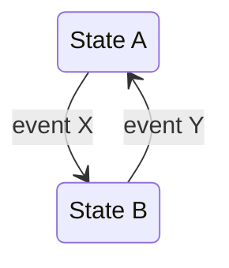
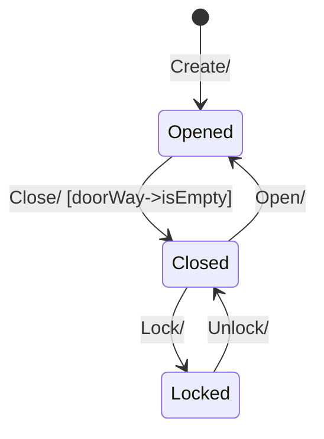
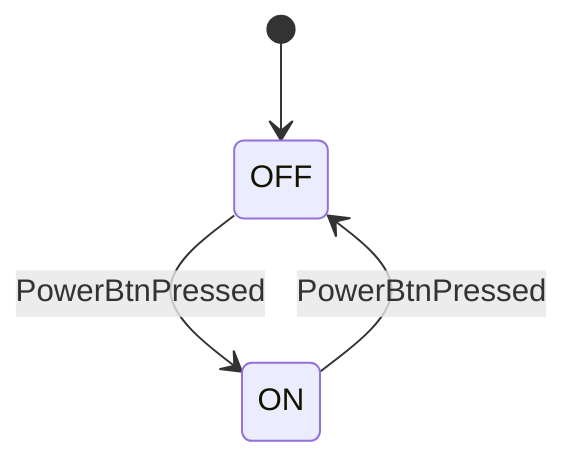
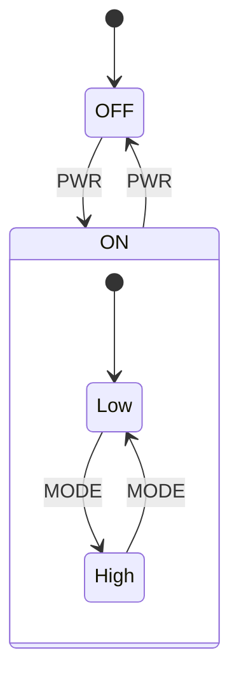
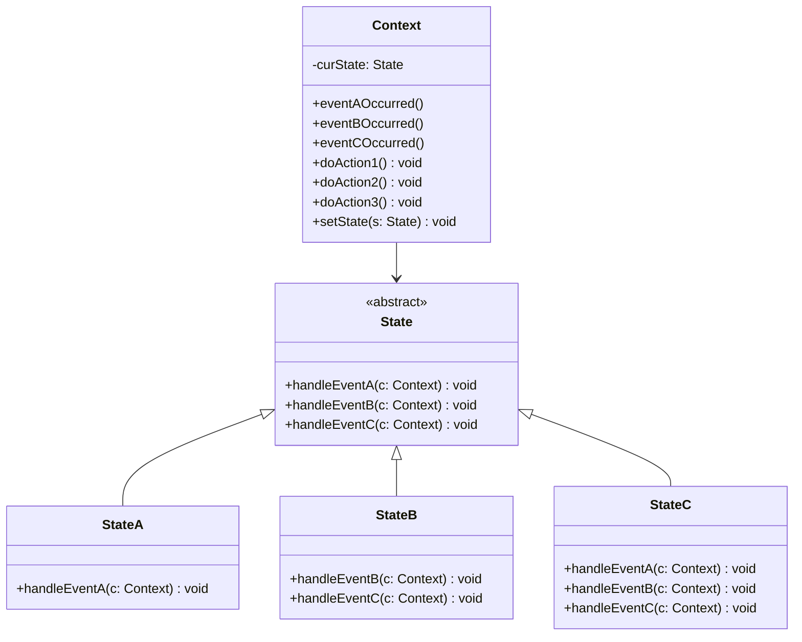
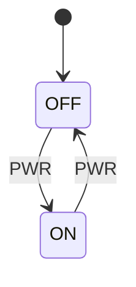
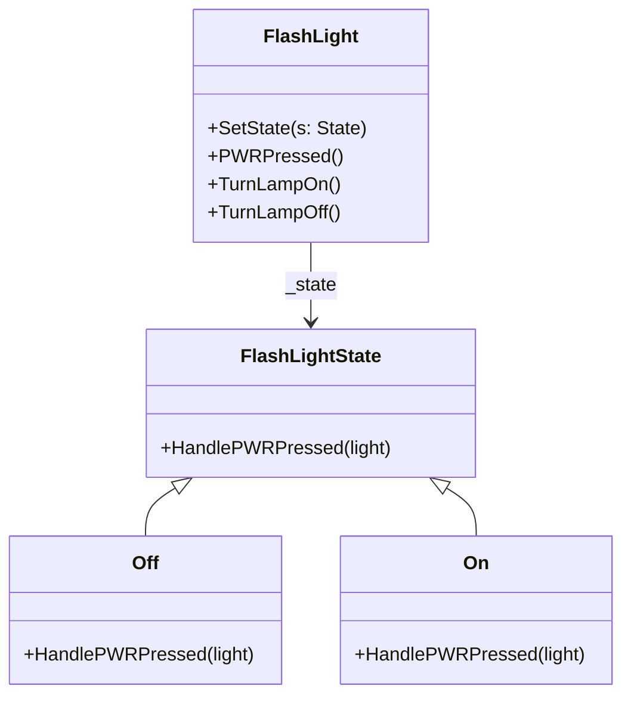
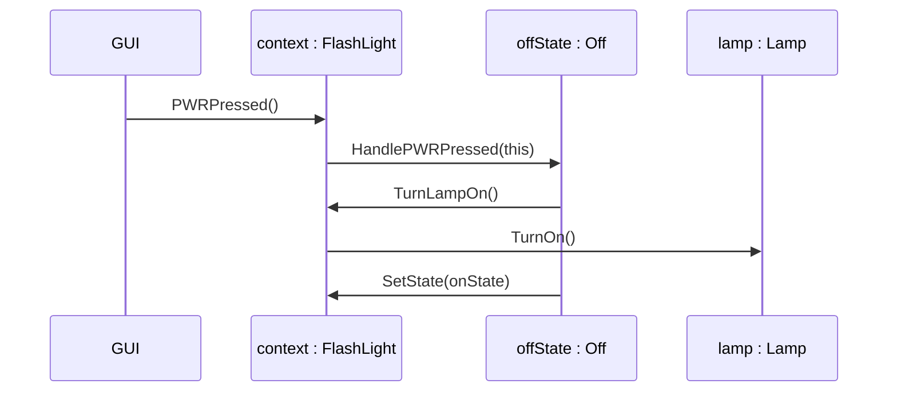

# Uge 8a — State Machines og GoF State-mønsteret

## Metadata

| Felt | Værdi |
|---|---|
| **Lektion** | Uge 8 — State machines og GoF State Pattern |
| **Kursus** | Softwaredesign (SW4SWD-01) |
| **Forelæser** | Henrik Bitsch Kirk (HK) |
| **Kilde** | `Patterns - State.pdf` (25 slides, version 1.0.2) |
| **Sprog/kode** | C# |
| **Emner dækket** | State machines (STM), UML state machine-diagrammer, switch/case-implementering, table-based implementering, GoF State Pattern, Context/State/ConcreteState-roller, event-håndtering og delegering, hvem der styrer transitions |

---

## Agenda

1. State machines
2. State machine implementations
   - Switch-case
   - Table based
   - **GoF state pattern**

> Slide 5

---

## 1. Motivation: den uopnåelige tilstand

Lektionen åbner med xkcd 2200: en fejlmeddelelse der lyder *"If you're seeing this, the code is in what I thought was an unreachable state."* Pointen er, at ad-hoc tilstandshåndtering fører til tilstande udvikleren ikke troede kunne opstå. En eksplicit modelleret state machine er svaret på netop det problem.

> Slide 1

Lektionen bygger videre på de tidligere creational patterns — Factory Method (`Document` / `Page` med `CreatePages() : List<Page>` som factory method, specialiseret i `ShortVersion` og `LongVersion`) og Abstract Factory (`WeighingSystem` med `IWeighingSystemFactory` og de konkrete `FøtexFactory` / `NettoFactory`).

> Slide 3, 4

---

## 2. State machines som begreb

En **state machine** (STM) er en model af en særlig slags system:

- På ethvert tidspunkt befinder STM'en sig i **én** tilstand fra en **endelig** mængde af *states*.
  - A light switch: `{ ON | OFF }`
  - A process: `{ READY | RUNNING | BLOCKED }`
- STM'en kan **transitionere** mellem states når **events** indtræffer.

> Slide 7

Det endelige antal tilstande er hele pointen. Modellen tvinger dig til at gøre op med, præcis hvilke tilstande systemet kan være i, og præcis hvilke events der flytter det mellem dem.

---

## 3. State machines i UML

En simpel UML STM består af states, transitions og events. Transitionen mellem `State A` og `State B` udløses af henholdsvis `event X` og `event Y`:



> Slide 8

Den fulde syntaks for en transition-label er:

```
trigger-signature [guard] / activity
```

Altså: hvilket event der udløser transitionen, en valgfri **guard** (betingelse der skal være opfyldt), og en valgfri **activity** (den handling der udføres når transitionen tages).

Endnu ikke dækket på dette tidspunkt i lektionen:

- Nested states
- Orthogonal states

> Slide 8

(Begge dækkes i `SW4SWD-01_W08b_State_Nested_Orthogonal.md`.)

### Eksempel: Protocol State Machine

Et større eksempel fra Sparx Systems' UML2-tutorial viser en dør:



> Slide 9 (kilde: https://sparxsystems.com/resources/tutorials/uml2/state-diagram.html)

Bemærk `[doorWay->isEmpty]` — en guard. Døren kan kun lukkes hvis døråbningen er tom.

---

## 4. Tre implementeringsstrategier

> "There are three common implementations of a state machine:
> 1. Switch-case
> 2. State/event tables
> 3. GoF State Pattern"
>
> "Each implementation maps the STM to code. Each has advantages and drawbacks."

> Slide 11

Alle tre mapper den samme model til kode. Valget handler om, hvor godt koden forbliver læsbar og testbar når state machine'n vokser.

---

## 5. Switch/case-implementeringen

### 5.1 Simpelt eksempel: to tilstande

Flashlight med kun `OFF` og `ON`, og ét event `PowerBtnPressed`:



Implementeringen holder den aktuelle tilstand i et `enum`-felt og skifter det i et `switch`:

```csharp
public class FlashLight
{
    public enum FlashLightEvent { PowerBtnPressed }
    enum FlashLightState  { On, Off }

    private FlashLightState _currentState;

    public FlashLight()
    {
        _currentState = FlashLightState.Off;
    }

    public void HandleEvent(FlashLightEvent evt)
    {
        switch (_currentState)
        {
            case FlashLightState.On:
                _currentState = FlashLightState.Off;
                break;

            case FlashLightState.Off:
                _currentState = FlashLightState.On;
                break;
        }
    }
}
```

> Slide 12

Med to tilstande og ét event er det fuldstændig overskueligt. Det er netop dét, der gør switch/case forførende.

### 5.2 Samme eksempel med nested states

Tilføj et `MODE`-event og to substates `Low` og `High` inde i `ON`:



> Slide 13

Implementeringen kræver nu **to** enum-felter og **nested switches**:

```csharp
class FlashLightWithModes
{
    public enum FlashLightEvent { PWR, MODE }
    enum FlashLightState  { On, Off }
    enum PwrOnSubStates { Low, High }

    private FlashLightState _currentState;
    private PwrOnSubStates _currentPwrOnSubState;

    public FlashLightWithModes()
    {
        _currentState = FlashLightState.Off;
        _currentPwrOnSubState = PwrOnSubStates.Low;
    }

    public void HandleEvent(FlashLightEvent evt)
    {
        switch (_currentState)
        {
            case FlashLightState.Off:
                switch (evt)
                {
                    case FlashLightEvent.PWR:
                        _currentState = FlashLightState.On;
                        _currentPwrOnSubState = PwrOnSubStates.Low;
                        break;
                }
                break;

            case FlashLightState.On:
                switch (evt)
                {
                    case FlashLightEvent.PWR:
                        _currentState = FlashLightState.Off;
                        break;

                    case FlashLightEvent.MODE:
                        switch(_currentPwrOnSubState)
                        {
                            case PwrOnSubStates.Low:
                                _currentPwrOnSubState = PwrOnSubStates.High;
                                break;

                            case PwrOnSubStates.High:
                                _currentPwrOnSubState = PwrOnSubStates.Low;
                                break;
                        }
                        break;
                }
            break;
        }
    }
}
```

> Slide 13

Sliden ledsages af et "KEEP CALM AND GIVE UP!"-plakat. Det er forelæserens kommentar til, hvad der sker med metoden når hierarkiet vokser: tre niveauers indlejrede `switch`-blokke for en state machine med i alt tre tilstande og to events. Skalering af dette til reelle systemer er ikke praktisk muligt.

Problemerne konkret:

- **Cyklomatisk kompleksitet** i én enkelt metode vokser multiplikativt med antal states × events × substates.
- **Al tilstandslogik er samlet ét sted**, så enhver ny tilstand betyder ændring i eksisterende, afprøvet kode.
- **Test kræver at man rammer én bestemt gren** dybt inde i et nested switch — der findes ingen isoleret enhed at teste.

---

## 6. Table-based implementeringen

Alternativet er at flytte state machine'n ud i en **state/event-tabel** i stedet for kontrolflow. Eksemplet `stm Example` har fire tilstande `S1`–`S4`, fire events `E1`–`E4` og fem actions `A1`–`A5`.

| State/Event | E1 | E2 | E3 | E4 |
|---|---|---|---|---|
| **S1** | A1/S1 | - | A4/S3 | - |
| **S2** | - | A5/S3 | - | - |
| **S3** | A1/S1 | - | A2/S4 | - |
| **S4** | A1/S1 | - | - | A3/S4 |

Læses sådan: *"In state S4, event E1 will cause action A1 and a transition to state S1"* og *"In state S3, event E3 will cause action A2 and a transition to state S4"*.

> Slide 14

Tabelform har den fordel, at transitionsreglerne er **data** frem for kode, og at tomme felter (`-`) gør det synligt, hvilke event/state-kombinationer der ikke er defineret. Men opslaget og udførelsen af actions er stadig generisk kode, og selve tabellen bliver hurtigt uoverskuelig for store state machines.

---

## 7. Pros and cons — diskussionsspørgsmålet

Sliden stiller spørgsmålet direkte:

> "What are the pros and cons of switch/case and table-based implementations in terms of…"

med de fem dimensioner:

- **Complexity**
- **Testability**
- **Maintainability**
- **Understandability**
- **Robustness**

efterfulgt af: *"A solution for this…"*

> Slide 15

Kort vurdering ad de fem dimensioner:

- **Complexity** — switch/case: al kompleksitet i én metode, vokser multiplikativt. Table-based: kompleksiteten flyttes til data, men tabellen bliver stor og svær at overskue.
- **Testability** — begge er svære at teste isoleret. Der er ingen naturlig testbar enhed pr. tilstand; man skal manøvrere hele maskinen ind i den ønskede tilstand for at teste én overgang.
- **Maintainability** — en ny tilstand kræver ændring i eksisterende kode (switch/case) eller i den centrale tabel. Det bryder Open/Closed Principle.
- **Understandability** — koblingen mellem diagrammet og koden er svag. Man kan ikke se på koden, hvordan diagrammet ser ud, og vice versa.
- **Robustness** — udefinerede state/event-kombinationer falder typisk igennem uden fejl. Det er præcis den situation xkcd-striben på slide 1 handler om.

---

## 8. GoF State Pattern

> "When STMs get complex, switch-case and table implementations become very messy and **extremely** difficult to test."
>
> "Time to introduce the GoF State Pattern!"

> Slide 17

### 8.1 …men bliver STM'er virkelig så komplekse?

Slide 18 svarer med et realistisk eksempel: en state machine for et medicinsk kompressionsapparat med toplevel-tilstande `Init`, `Relaxed`, `Operational`, `Client Gateway Connected`, `Fail Safe` og `Forced Decompression` — hvor `Init` indeholder `POST` og `Initial Decompression`, `Relaxed` indeholder `Idle` og `Establish Gateway Connection`, `Operational` indeholder `Initial Compression`, `Decompressing` og `Maintaining Compression` (som selv indeholder `Stationary` og `In Motion`), og `Healthcare Provider Gateway Connected` indeholder `Awaiting function selection`, `Configuring` og `Calibrating`.

Events omfatter blandt andet `POST passed`, `POST failed`, `Button pushed [Configured & Calibrated & Battery level ok]`, `Button long-pushed & Battery level ok`, `Timeout`, `Compression level reached`, `Gateway connection Lost`, `Canceled from GW`, `Motion detected`, `Motion ceased`, `Battery level critical detected` og `Unable to reach desired compression level`.

> Slide 18

Diagrammet er for tæt og har for mange krydsende transitionslinjer til at kunne gengives entydigt her. Svaret på spørgsmålet er dog utvetydigt: ja, de bliver dét komplekse, og en nested switch/case for denne maskine ville være ulæselig.

### 8.2 Strukturen



> Slide 19

Annotationerne på sliden forklarer rollerne:

- **`Context` is the "owner" of the state machine. Contains *event handlers* and *actions*.**
- **`State`: top-level state, usually an abstract class with empty default impl. of all event handlers (why?)**
- **`StateA` / `StateB` / `StateC`: implementation of concrete states and the event handlers for each state.**

> Slide 19

Bemærk hvorfor `State` har **tom default-implementering** af alle event handlers: en konkret tilstand skal kun override de events, den faktisk reagerer på. Alle andre events bliver dermed automatisk og stiltiende ignoreret i den tilstand — hvilket er præcis den korrekte semantik for et event der ikke har en transition i den tilstand. Uden default-implementeringer ville hver `ConcreteState` skulle implementere samtlige event handlers, også de irrelevante.

Bemærk også at `handleEventX` tager `Context` som parameter. Det er dét, der lader tilstandsobjektet kalde tilbage i konteksten — både for at udføre actions og for at sætte den næste tilstand.

### 8.3 Flashlight-eksemplet: struktur

Den simple flashlight med kun `PWR`:



mappes til:



> Slide 20

`FlashLight` er `Context`. Metoderne grupperes eksplicit på sliden i to kategorier:

- `// From GUI` — `PWRPressed()`, altså **event handlers** som brugergrænsefladen kalder.
- `// STM actions` — `TurnLampOn()`, `TurnLampOff()`, altså de **actions** som tilstandsobjekterne kalder tilbage i konteksten.

Plus `SetState(s: State)`, som tilstandsobjekterne bruger til at sætte den nye tilstand.

Deltagerne i objektstrukturen er: `context: FlashLight`, `_offState: Off`, `_onState: On` og `_lamp: Lamp`.

> Slide 21

### 8.4 Flashlight-eksemplet: kaldssekvensen

Sekvensdiagrammet på slide 22 viser præcis, hvad der sker når flashlighten står i `Off` og `PWRPressed()` kaldes:



> Slide 22

Rækkefølgen er central for at forstå mønsteret:

1. `context` modtager eventet fra GUI'en og **videresender det straks** til sit tilstandsobjekt — `HandlePWRPressed(this)`, hvor `this` er konteksten selv.
2. `offState` afgør, at der skal udføres en action, og **kalder tilbage** i konteksten: `TurnLampOn()`.
3. `context` udfører den faktiske action mod hardwaren: `lamp.TurnOn()`.
4. `offState` afgør, at der skal skiftes tilstand, og **kalder tilbage** i konteksten: `SetState(onState)`.

Bemærk at det er **tilstandsobjektet**, ikke konteksten, der bestemmer både om der skal udføres en action og hvilken tilstand der er den næste.

---

## 9. GoF State — hovedpointerne

> "In the GoF State pattern, each state is implemented as a subclass of a common abstract state class."
>
> "At any time, the context references exactly one state object — the context's *current state*."
>
> "The context delegates all of its state-dependent behavior to this state object — we say that the context's behavior is *externalized* in the states."
>
> "The state classes should be kept stateless so they can be singleton implementations."

> Slide 23

**Externalized behavior** er nøglebegrebet. Konteksten har ingen `if`- eller `switch`-logik over sin egen tilstand overhovedet; den delegerer ganske enkelt til det tilstandsobjekt, den peger på lige nu. Den tilstandsafhængige adfærd ligger *uden for* konteksten, i tilstandsklasserne.

**Stateless states**: hvis en tilstandsklasse ikke selv holder data, kan der nøjes med én instans pr. tilstand i hele programmet — en singleton. Al den variable data ligger i konteksten. Det er også derfor `HandleXPressed` tager konteksten som parameter i stedet for at tilstandsobjektet holder en reference til den.

---

## 10. Event reception og handling

> "When the context receives an event it immediately forwards it to its state object."
>
> "If an action shall be performed, the state object **calls back** into the context to perform the action."
>
> "If a state change shall be performed, the state object will **call back** to the context to set the context's *new* state object."
>
> "**Important!** The context is **not** responsible for setting the new state — the current state is!"

> Slide 24

Dette er lektionens vigtigste enkeltpointe og en klassisk fejlkilde. Det er fristende at lade `Context` afgøre, hvilken tilstand der kommer efter hvilken — men gør man det, har man genindført switch/case-problemet i konteksten og mistet hele mønsterets pointe.

**Regel:** Konteksten kender kun `SetState()`. Den kender ikke transitionsreglerne. Det gør de konkrete tilstande, hver især kun for sig selv.

Konsekvensen for extensibility: en ny tilstand tilføjes ved at skrive en ny `ConcreteState`-klasse. Eksisterende tilstande skal kun røres hvis der skal tilføjes en transition **til** den nye tilstand fra dem. Konteksten skal typisk slet ikke ændres, ud over eventuelle nye actions. Det er Open/Closed Principle i praksis.

---

## 11. Sammenligning af de to strategier

| Dimension | Switch/case | GoF State Pattern |
|---|---|---|
| **Extensibility** | Ny tilstand kræver ændring i den eksisterende `HandleEvent`-metode. Bryder OCP. | Ny tilstand = ny klasse. Eksisterende kode berøres minimalt. Følger OCP. |
| **Maintainability** | Al tilstandslogik i én metode; nested switches vokser multiplikativt. Svær at læse. | Én klasse pr. tilstand. Hver klasse er lille og indeholder kun dén tilstands adfærd. |
| **Testability** | Ingen isoleret testbar enhed. Man skal manøvrere maskinen ind i den rette tilstand for at ramme en gren. | Hver `ConcreteState` kan unit-testes for sig med en mocked/stubbet `Context`. Man kan verificere både transitions og actions pr. tilstand. |
| **Mapping til diagrammet** | Svag. Diagrammets struktur er ikke synlig i koden. | Direkte. Én tilstand i diagrammet = én klasse. Nested states = arv (se W08b). |
| **Antal klasser** | Én. | Én pr. tilstand plus abstrakt basisklasse. Mere boilerplate ved små maskiner. |

Switch/case er ikke forkert per se — for en state machine med to tilstande og ét event er det kortere og klarere end fem klasser. Skæringspunktet ligger dér, hvor nesting begynder, eller hvor tilstandsmængden forventes at vokse.

---

## 12. Øvelser

> "State patterns exercise 1 (intro), question 1-4"

> Slide 25

Se `../noter/SW4SWD-01_State_Machine_Examples.md` for øvelsesbeskrivelserne.

---

## Opsummering

- En **state machine** er et system, der på ethvert tidspunkt befinder sig i én af en **endelig** mængde tilstande, og som **transitionerer** mellem dem når **events** indtræffer. UML-transitionslabels har formen `trigger-signature [guard] / activity`.
- Der findes tre gængse implementeringer: **switch/case**, **state/event-tabeller** og **GoF State Pattern**. Alle mapper den samme model til kode med hver sine afvejninger.
- **Switch/case** er acceptabelt for trivielle maskiner, men nested states fører til indlejrede `switch`-blokke, der er praktisk umulige at læse og teste, og som bryder Open/Closed Principle.
- I **GoF State** er hver tilstand en subklasse af en fælles abstrakt `State`-klasse med **tomme default-implementeringer** af alle event handlers. `Context` refererer præcis ét tilstandsobjekt ad gangen og **delegerer** al tilstandsafhængig adfærd til det — adfærden er *externalized* i tilstandene.
- Tilstandsklasserne holdes **stateless** så de kan implementeres som singletons; derfor sendes `Context` med som parameter til hver event handler.
- **Konteksten sætter ikke selv den nye tilstand — den nuværende tilstand gør.** Tilstandsobjektet kalder tilbage i konteksten både for at udføre actions og for at kalde `SetState()`.
- GoF State vinder klart på **extensibility**, **maintainability** og **testability** for ikke-trivielle state machines, og giver en direkte 1:1-mapping mellem diagram og kode. Prisen er flere klasser.
