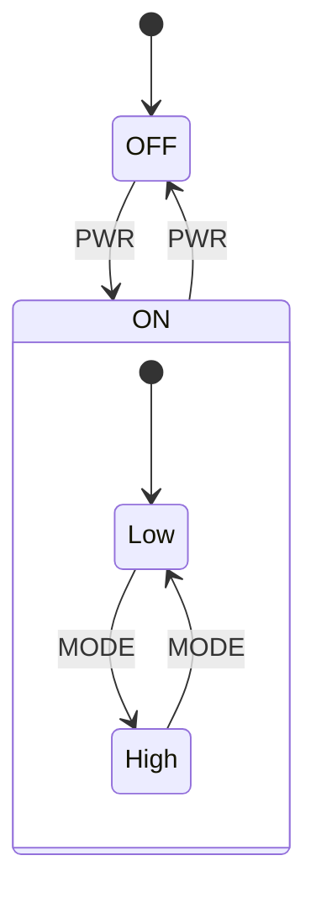
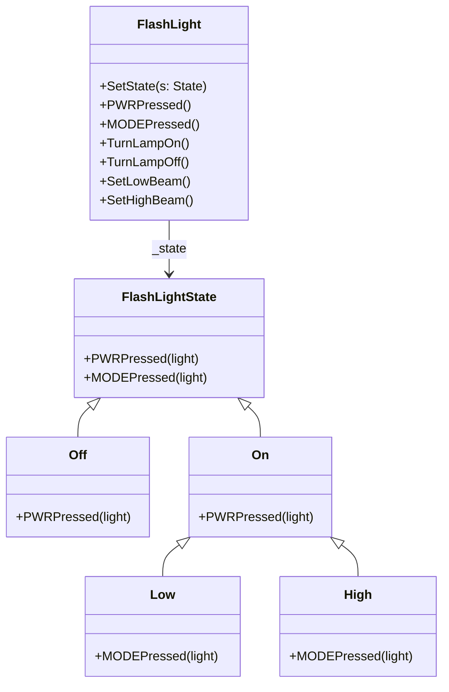
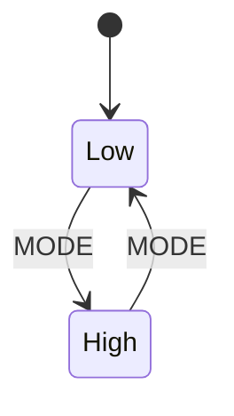
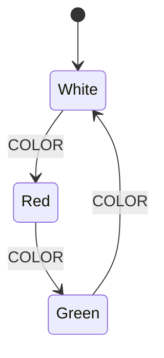
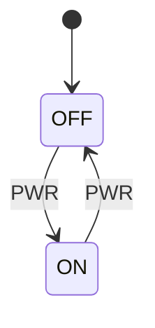
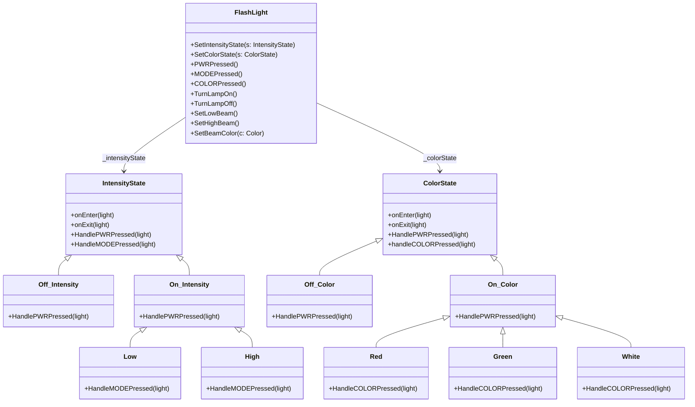
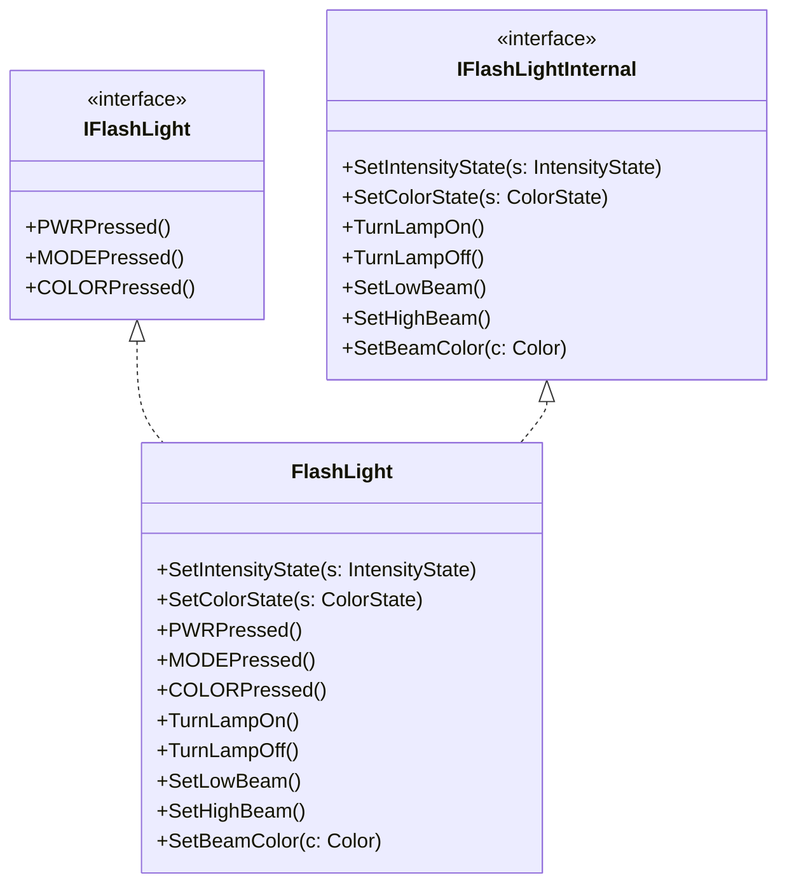
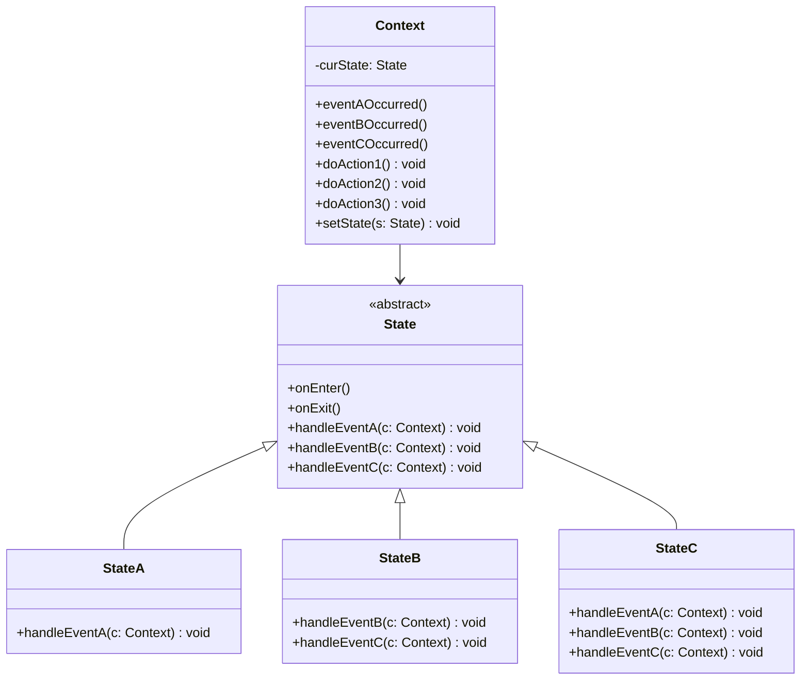
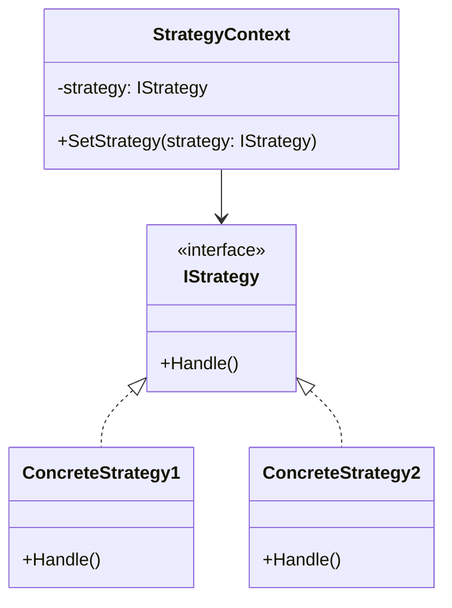
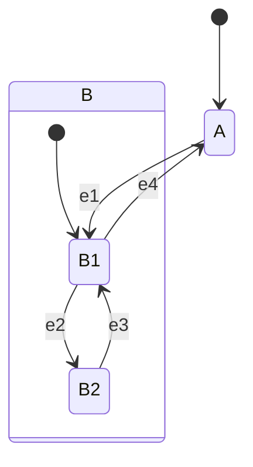

# Uge 8b — State Machines: Nested og Orthogonal States

## Metadata

| Felt | Værdi |
|---|---|
| **Lektion** | Uge 8 — Nested og orthogonal states i state machines |
| **Kursus** | Softwaredesign (SW4SWD-01) |
| **Forelæser** | Henrik Bitsch Kirk (HK) |
| **Kilde** | `Patterns - NestedOrthogonal - Copy.pdf` (13 slides, version 1.0.3) |
| **Sprog/kode** | C# |
| **Emner dækket** | Nested (hierarkiske) states, orthogonal states, mapping af nesting til arv, to implementeringsstrategier for orthogonale states, "the evil client", ISP anvendt på Context, State vs. Strategy, entry/exit-actions og State Pattern-begrænsninger |

---

## Agenda

1. GoF State: nested states
2. GoF State: orthogonal states
3. Implementeringsstrategier for orthogonale states
4. The evil client — og ISP som svar
5. State vs. Strategy
6. Warning: State Pattern limitations

---

## 1. Nested states

> "The GoF State Pattern is especially neat when used for complex (nested, orthogonal) state machines"

> Slide 2

Dette er fortsættelsen af argumentet fra W08a. Switch/case brød sammen netop dér, hvor nesting kom ind i billedet. GoF State gør det modsatte: nesting bliver **lettere**, ikke sværere, fordi hierarkiet i diagrammet mapper direkte til arvehierarkiet i koden.

### 1.1 Flashlight med power modes



> Slide 2

`ON` er en **composite state** (nested state) med to substates `Low` og `High`. Initial-tilstanden inde i `ON` er `Low`. `MODE`-eventet toggler mellem substates, mens `PWR` fører ud af `ON` uanset hvilken substate man befinder sig i.

### 1.2 Mapping til klasser: nesting bliver arv



> Slide 2

Dette er hele pointen, og sliden fremhæver den med farvede markeringer: den grønne markering forbinder composite state `ON` i diagrammet med klassen `On`; de røde og blå markeringer forbinder substates `Low` og `High` med klasserne `Low` og `High`.

**Reglen er:**

> En nested state i diagrammet bliver en **subklasse** af den klasse, der repræsenterer den omsluttende composite state.

Konsekvensen er elegant. `On` implementerer `PWRPressed(light)` — den transition der fører ud af hele `ON`-blokken. `Low` og `High` **arver** den implementering og behøver ikke gentage den. De implementerer kun `MODEPressed(light)`, som er dét der adskiller dem. Med andre ord: en transition tegnet på grænsen af en composite state implementeres én gang i basisklassen og gælder automatisk for alle substates.

Sammenlign med switch/case-versionen i W08a slide 13, hvor den samme struktur krævede tre niveauers indlejrede `switch`-blokke og to separate enum-felter.

Bemærk at `FlashLight` (konteksten) nu har fået `MODEPressed()` som event handler og `SetLowBeam()` / `SetHighBeam()` som STM actions.

---

## 2. Orthogonal states

Orthogonale states er tilstande, der er **aktive samtidigt** og uafhængigt af hinanden. I UML tegnes de som regioner adskilt af en stiplet linje inde i en composite state.

### 2.1 Flashlight med power modes + color control

`ON` indeholder nu to orthogonale regioner: en intensitetsregion (`Low` / `High`) og en farveregion (`White` / `Green` / `Red`).

Intensitetsregionen:



Farveregionen:



Og toplevel:



> Slide 3

Når lygten er i `ON`, er den samtidigt i **én** intensitetstilstand **og** i **én** farvetilstand. `MODE` påvirker kun intensitetsregionen; `COLOR` påvirker kun farveregionen; `PWR` forlader hele `ON`.

Farvecyklussen er en ring: `White → Red → Green → White`, alle udløst af `COLOR`.

### 2.2 To implementeringsstrategier

> "Two implementation strategies:
>
> 1) Collapse into a single state machine: Low-White, Low-Green, Low-Red, High-White, High-Green, High-Red.
>
> 2) Create two separate state machines and let the context hold a reference to both."

> Slide 4

**Strategi 1 — collapse.** Man danner **kryds­produktet** af de to regioners tilstande. Med 2 intensiteter × 3 farver bliver det 6 kombinerede tilstande. Det virker, men skalerer forfærdeligt: tilføjer man en tredje orthogonal region med *n* tilstande, ganges antallet med *n*. Dette er den klassiske **state explosion**.

**Strategi 2 — separate state machines.** Man beholder de to regioner som to uafhængige state machines, og lader konteksten holde en reference til hver. Antallet af tilstandsklasser er så *summen* (2 + 3 = 5) i stedet for produktet. Dette er den strategi lektionen bruger.

### 2.3 Strategi 2 implementeret



> Slide 5

*Note: på sliden hedder klasserne i begge hierarkier ganske enkelt `Off` og `On`. Suffikserne `_Intensity` / `_Color` er tilføjet her for at holde de to hierarkier fra hinanden i ét diagram — de er ikke slidets navne.*

Bemærk flere ting:

- Konteksten `FlashLight` holder **to** referencer: `_intensityState` og `_colorState`, og har derfor **to** settere: `SetIntensityState(s: IntensityState)` og `SetColorState(s: ColorState)`.
- **Begge** hierarkier har en `Off` og en `On`. Begge implementerer `HandlePWRPressed(light)`. Det er nødvendigt, fordi `PWR` skal påvirke begge regioner — når lygten slukkes, skal både intensitets- og farvemaskinen forlade deres `On`-gren.
- Nesting bliver igen til arv: `Low` og `High` arver fra `On` i intensitetshierarkiet; `Red`, `Green` og `White` arver fra `On` i farvehierarkiet.
- Begge abstrakte basisklasser har nu **`onEnter(light)` og `onExit(light)`**.

### 2.4 Entry- og exit-actions

`onEnter` og `onExit` er de handlinger, der udføres når en tilstand henholdsvis **tiltrædes** og **forlades** — uafhængigt af hvilken transition der førte dertil.

De er nødvendige netop her. Betragt `Low.onEnter(light)`: den kalder `light.SetLowBeam()`. Uden entry-action skulle *hver* transition ind i `Low` huske at kalde `SetLowBeam()` — både `High --MODE--> Low` og `Off --PWR--> On` (som lander i `Low` som initial substate). Med en entry-action skrives kaldet **ét sted**, og det er umuligt at glemme det på en ny transition.

Det er dét, øvelsesteksten i Exercise 5 refererer til: *"be sure you handle OnEnter correctly – if you do, the code becomes very elegant!"*

---

## 3. The evil client

> "What if a client to the context writes code which sets the state directly?"
>
> "Or turns on/off the lamp, and thus bypasses the statemachine?"

> Slide 6

Problemet er, at `FlashLight` som vist har **alle** sine metoder public:

```
+ SetIntensityState(s: IntensityState)
+ SetColorState(s : ColorState)

// From GUI
+ PWRPressed()
+ MODEPressed()
+ COLORPressed()

// STM actions
+ TurnLampOn()
+ TurnLampOff()
+ SetLowBeam()
+ SetHighBeam()
+ SetBeamColor(c: Color)
```

> Slide 6

Metoderne har to helt forskellige målgrupper. `PWRPressed()`, `MODEPressed()` og `COLORPressed()` er tiltænkt GUI'en. `SetIntensityState()`, `SetColorState()` og alle STM actions er tiltænkt **tilstandsobjekterne**.

Men typesystemet skelner ikke. En vilkårlig client kan kalde `SetIntensityState(...)` og placere lygten i en tilstand, som state machine'n aldrig ville have nået — eller kalde `TurnLampOn()` direkte og tænde lampen uden at state machine'n ved det. Så er den modellerede tilstand og den faktiske virkelighed ude af sync, og man er tilbage i xkcd 2200's *"unreachable state"*.

---

## 4. ISP to the rescue

> "Segregate the interface to the context."
>
> "One interface to be used by clients of the context."
>
> "Another interface to be used by the state machine implementation"

> Slide 7

**Interface Segregation Principle** løser det. `FlashLight` implementerer to separate interfaces:



> Slide 7

- **`IFlashLight`** — det interface GUI'en og andre eksterne clients får udleveret. Det indeholder **kun** event handlers. En client, der kun kender `IFlashLight`, kan simpelthen ikke sætte tilstanden eller manipulere lampen direkte.
- **`IFlashLightInternal`** — det interface tilstandsobjekterne får udleveret. Det indeholder state settere og STM actions.

Klassen `FlashLight` implementerer begge og har derfor stadig alle metoderne. Beskyttelsen ligger i, at ingen får en reference af den konkrete type — hver part får kun det interface, den har brug for. Det er præcis ISP: *clients should not be forced to depend upon interfaces they do not use.*

Det er også Exercise 7 i introduktionsøvelsen.

---

## 5. State vs. Strategy

> "The structure of GoF State and GoF Strategy are quite similar."

> Slide 8

### 5.1 Strukturel sammenligning

GoF State:



GoF Strategy:



> Slide 8

Bemærk at `State`-klassen her — modsat den forenklede version i W08a slide 19 — eksplicit har `onEnter()` og `onExit()`.

Strukturelt er de næsten identiske: en `Context` med en reference til et abstrakt/interface-typet objekt, en setter, og et antal konkrete subklasser. Det er *intentionen* og *dynamikken*, der adskiller dem.

### 5.2 GoF's definitioner

> **GoF State**
> "Allow an object to alter its behavior when its internal state changes. The object will appear to change its class."
>
> **GoF Strategy**
> "Define a family of algorithms, encapsulate each one, and make them interchangeable. Strategy lets the algorithm vary independently from clients that use it."

> Slide 9

### 5.3 Anvendelsen

> **GoF State**
> "Used to model a system, which has states. A client is **not** supposed to modify the state — the transition between states is done by the states."
>
> **GoF Strategy**
> "Used to change behavior of a part of a program i.e. change which algorithm to use. A client **is** allowed to change the algorithm."

> Slide 10

Dette er den praktiske skillelinje og forklarer, hvorfor "the evil client" på slide 6 overhovedet er et problem for State, men ikke for Strategy. I Strategy er det helt legitimt at en client kalder `SetStrategy(...)` — det er hele meningen. I State er det et brud på mønsteret; kun tilstandene selv må kalde `setState(...)`.

### 5.4 Opsummering af forskellen

> "**Summary**: Each pattern uses a polymorphic call to do something depending on the context.
>
> In the State pattern, the polymorphic call **often** causes a change to another *state* — and therefore its behavior.
>
> In the Strategy pattern, the polymorphic call does **not** typically change the context's behavior.
>
> Again, the State pattern's dynamics are determined by its corresponding *finite state machine*, which is essential to correct application of this pattern."
>
> — User Fuhrmanator @ https://stackoverflow.com/questions/1658192/what-is-the-difference-between-strategy-design-pattern-and-state-design-pattern

> Slide 11

Kernen: begge bruger et polymorfisk kald. Men i State **ændrer kaldet typisk konteksten** — det næste kald af samme metode rammer et andet objekt og gør noget andet. I Strategy gør kaldet det samme hver gang, indtil en client eksplicit skifter strategi. Og State kræver at man har en **finite state machine** at implementere; uden den anvender man mønsteret forkert.

---

## 6. Warning: State Pattern Limitations

Sliden viser et hierarki med toplevel-states `A` og `B`, hvor `B` er composite med substates `B1` og `B2`. Entry- og exit-actions er tegnet ind i diagrammet:

- `B` har `onEnter: Do_X()` og `onExit: Do_Y()`
- `B1` har `onEnter: Do_V()` og `onExit: Do_W()`

Transitionerne er:



> Slide 12

Selve begrænsningen ligger i, hvilke entry/exit-actions der skal køre for hvilken transition. Sliden viser det som en tabel over kaldssekvenser:

| Fra | Event | Til | Actions der skal udføres |
|---|---|---|---|
| `A` | `e1` | `B1` | `B.onEnter()`, `B1.onEnter()` |
| `B1` | `e4` | `A` | `B1.onExit()`, `B.onExit()` |
| `B2` | `e3` | `B1` | `B1.onEnter()` |
| `B1` | `e2` | `B2` | `B1.onExit()` |

> Slide 12

Bemærk asymmetrien, som sliden fremhæver med farvet markering: en transition **udefra** ind i `B1` (`A --e1--> B1`) skal køre **både** `B.onEnter()` og `B1.onEnter()`, i den rækkefølge — ydre først. En transition **internt** i `B` ind i `B1` (`B2 --e3--> B1`) må kun køre `B1.onEnter()`, fordi man allerede *er* i `B` og ikke tiltræder den påny. Tilsvarende omvendt for exit: ved udgang fra `B` køres `B1.onExit()` før `B.onExit()` — inderst først.

Klassediagrammet på sliden viser `Context` med en `current`-reference til den abstrakte `State` (kursiv = abstract), som har `onEnter(c: Context)`, `onExit(c: Context)` og `e1(c: Context)` til `e3(c: Context)`. `A` implementerer `e1(c: Context)`. `B` implementerer `e4(c: Context)`, `onEnter(c: Context)` og `onExit(c: Context)` — hvor de to sidste udfører henholdsvis `Do_X()` og `Do_Y()`. `B1` implementerer `e2(c: Context)`, `onEnter(c: Context)` og `onExit(c: Context)` — hvor `onEnter` udfører `Do_V()` og `onExit` udfører `Do_W()`. `B2` implementerer `e3(c: Context)`.

Løsningen på sammensætningsproblemet vises i den fremhævede note nederst: `B1.onEnter(c: Context)` implementeres som

```csharp
Do_V();
base.onEnter();
```

Altså — den indre tilstands `onEnter` kalder `base.onEnter()` for at få den ydre composite states entry-action med. Det virker for entry.

**Begrænsningen** er, at arvehierarkiet ikke af sig selv kan skelne mellem de to tilfælde ovenfor. En transition internt i `B` (fra `B2` til `B1`) må ikke køre `B.onEnter()` — men hvis `B1.onEnter()` ubetinget kalder `base.onEnter()`, gør den det alligevel. Mønsteret giver ingen indbygget mekanisme til at afgøre, om man krydser composite state-grænsen eller ej. Man må selv holde styr på det, hvilket er præcis den slags manuel bogføring, mønsteret ellers skulle fjerne.

Konklusionen er ikke at GoF State er dårligt, men at det har en grænse: for state machines med dybe hierarkier og entry/exit-actions på flere niveauer bliver den korrekte håndtering af transitionsgrænser en reel kilde til fejl. Til de tilfælde findes dedikerede state machine-frameworks og kodegeneratorer.

---

## 7. Øvelser

> "State patterns exercise 1 (intro), question 5-7"
>
> "State pattern exercise 2 (phone)"

> Slide 13

Se `../noter/SW4SWD-01_State_Machine_Examples.md` for øvelsesbeskrivelserne. Bemærk at telefonøvelsens Exercise 4 (speakerphone-toggle og mute) netop er en anvendelse af orthogonale substates fra denne lektion.

---

## Opsummering

- **Nested states** i diagrammet mapper direkte til **arv** i GoF State: en substate bliver subklasse af den klasse, der repræsenterer den omsluttende composite state. Transitioner tegnet på composite state'ens grænse implementeres én gang i basisklassen og arves af alle substates.
- **Orthogonal states** er regioner, der er aktive samtidigt. To implementeringsstrategier: **collapse** til krydsproduktet af tilstande (state explosion — 2 × 3 bliver 6), eller **separate state machines** hvor konteksten holder en reference til hver (2 + 3 bliver 5). Sidstnævnte skalerer.
- **`onEnter` / `onExit`** (entry/exit-actions) sikrer, at handlinger knyttet til at *være* i en tilstand skrives ét sted i stedet for på hver eneste indgående transition.
- **"The evil client"**: hvis konteksten eksponerer både event handlers og STM actions/state settere på én public flade, kan en client omgå state machine'n. Svaret er **ISP** — to interfaces: `IFlashLight` til clients (kun event handlers) og `IFlashLightInternal` til tilstandsobjekterne (state settere + actions).
- **State vs. Strategy** er strukturelt næsten ens, men adskiller sig i intention: State modellerer et system med tilstande hvor **kun tilstandene selv** må skifte tilstand; Strategy vælger mellem algoritmer hvor **clienten gerne må** skifte. I State ændrer det polymorfiske kald typisk konteksten; i Strategy gør det ikke.
- **Begrænsning**: GoF State har ingen indbygget mekanisme til at afgøre, om en transition krydser en composite state-grænse. Ved dybe hierarkier med entry/exit-actions på flere niveauer skal kaldssekvensen (`B.onEnter()` før `B1.onEnter()`; `B1.onExit()` før `B.onExit()`) håndteres manuelt — typisk med `base.onEnter()` — og det er en reel fejlkilde.
