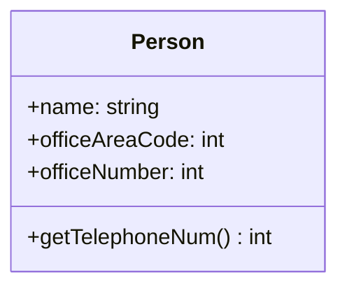
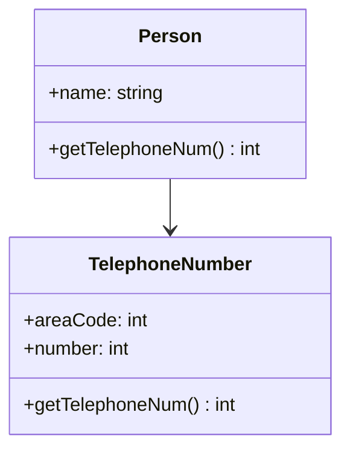
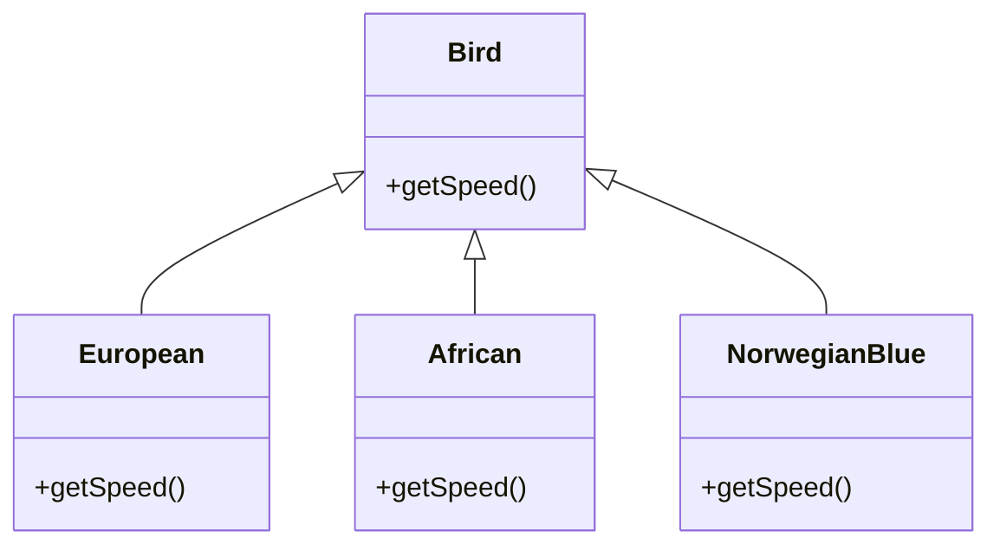

# Uge 9.1 — Refactoring

## Metadata

| Felt | Værdi |
|---|---|
| **Lektion** | Uge 9.1 — Refactoring |
| **Kursus** | Softwaredesign (SW4SWD-01) |
| **Forelæser** | Jørn Martin Hajek (HAJ) — slidesættet er forfattet af Michael Loft (ml@ase.au.dk) |
| **Kilde** | `Refactoring.pdf` (23 slides) |
| **Sprog/kode** | Java på Fowler-eksemplerne, C# på Move Field-eksemplet |
| **Emner dækket** | Refactoring-definition, factorization-analogien, mål med refactoring, hvornår man refactorer, code smells, forudsætninger før man går i gang, Extract Method, Extract Class, Replace Conditional with Polymorphism, Move Field, smell-til-refactoring-katalog, refactoring uden testsuite, katas |

---

## Agenda

1. Factorization som analogi
2. Refactoring — definition (noun/verb)
3. Hvad vi vil opnå
4. Hvornår man refactorer
5. Code smells — taksonomien fra uge 2
6. Før du starter: de fem forudsætninger
7. Extract Method (før/efter)
8. Extract Class (før/efter)
9. Replace Conditional with Polymorphism (før/efter)
10. Move Field — motivation, mechanics, eksempel
11. Kataloget over navngivne refactorings
12. Fra code smell til refactoring
13. Øvelser og refleksionsspørgsmål
14. Refactoring uden testsuite — legacy code

---

## 1. Factorization — analogien bag ordet

Ordet "refactoring" låner sin betydning fra matematikken.

> In mathematics, factorization consists of writing a number or another mathematical object as a product of several factors, usually smaller or simpler objects of the same kind.
>
> For example, 3 × 5 is a factorization of the integer 15 and (x – 2)(x + 2) is a factorization of the polynomial x² – 4.

> Slide 3

Pointen: 15 og 3 × 5 er *den samme værdi*. Faktoriseringen ændrer ikke resultatet — kun formen, som gøres enklere og lettere at arbejde med. Præcis det samme gælder refactoring af kode: opførslen er uændret, strukturen bliver simplere.

Kilde: <https://en.wikipedia.org/wiki/Factorization>

---

## 2. Refactoring — definition

Martin Fowler skelner mellem navneordet og udsagnsordet:

> **Refactoring** (noun): a change made to the internal structure of software to make it easier to understand and cheaper to modify without changing its observable behavior.
>
> **Refactor** (verb): to restructure software by applying a series of refactoring's without changing its observable behavior.

> Slide 4 — Martin Fowler, *Refactoring: Improving the Design of Existing Code*

Bemærk konstruktionen: *en* refactoring er et enkelt, navngivet, veldefineret indgreb (fx Extract Method). *At refactore* er at anvende en serie af dem efter hinanden. Det er derfor kataloget over navngivne refactorings er kernen i emnet — de er byggeklodserne.

Den afgørende del af begge definitioner er den sidste sætning: **without changing its observable behavior**. Ændrer du opførslen, er det ikke refactoring — det er en feature eller en bugfix, og så gælder sikkerhedsnettet nedenfor ikke længere.

---

## 3. Hvad vi vil opnå

Refactoring skal forbedre kodekvaliteten på fem akser:

- Maintainability
- Understandability
- Simplicity
- Extendability
- Testability

Og målet formuleres på sliden som:

> Want code to adhere to SOLID
> but
> **Without changing externally visible behavior**

> Slide 5

Der er altså en direkte forbindelse til SOLID-lektionen: SOLID beskriver, hvordan koden *bør* se ud, refactoring er den disciplinerede metode til at flytte eksisterende kode derhen uden at brække noget.

---

## 4. Hvornår refactorer man

Sliden angiver to konkrete tidspunkter:

**Before starting a new feature** — in order to make it easier to implement the feature. Man rydder op *først*, så den nye funktionalitet kan lægges ind i en struktur, der har plads til den. Det er billigere end at presse featuren ind i noget, der ikke passer, og rydde op bagefter (hvilket i praksis aldrig sker).

**After all your tests pass** — when you can trust that you do not change the external behavior. Her er testene den kontrakt, der beviser, at opførslen er uændret.

> Slide 6

De to tidspunkter dækker tilsammen den klassiske TDD-rytme: red → green → **refactor**. Man refactorer aldrig, mens en test er rød, for så kan man ikke skelne mellem "min refactoring brækkede noget" og "featuren er ikke færdig endnu".

---

## 5. Code smells

Taksonomien fra uge 2 gentages her, fordi smells er *indgangen* til refactoring — de fortæller, hvor man skal kigge.

**The Bloaters:**
Long Method · Large Class · Primitive Obsession · Long Parameter List · DataClumps

**The Object-Orientation Abusers:**
Switch Statements · Temporary Field · Refused Bequest · Alternative Classes with Different Interfaces

**The Change Preventers:**
Divergent Change · Shotgun Surgery · Parallel Inheritance Hierarchies

**The Dispensables:**
Lazy class · Data class · Duplicate Code · Dead Code · Speculative Generality

**The Couplers:**
Feature Envy · Inappropriate Intimacy · Message Chains · Middle Man

> Slide 7 — A Taxonomy for "Bad Code Smells", <https://mmantyla.github.io/BadCodeSmellsTaxonomy.html>

Se `SW4SWD-01_W02a_Design_Smells.md` for den fulde gennemgang af hver enkelt smell. Forholdet mellem de to lektioner er simpelt: **uge 2 lærer dig at lugte problemet, uge 9.1 lærer dig at fjerne det.** En smell er en diagnose, en refactoring er behandlingen.

---

## 6. Før du starter

Fem punkter, og rækkefølgen er ikke tilfældig:

1. **Ensure you have an extensive test suite of the code you will change.**
2. **Take small steps.**
3. **Locate a smell**
4. **Apply a refactoring and verify that all tests still pass.**
5. **Use source control** (e.g. `git reset --soft` to squash commits together afterwards)

> Slide 8

### Hvorfor tests er en forudsætning — ikke en anbefaling

Definitionen på refactoring er "uden at ændre observérbar opførsel". Uden tests har du ingen måde at *vide*, om du har overholdt definitionen. Du har kun din tro på det. En testsuite er den eneste mekanisme, der kan afvise påstanden empirisk.

Derfor hænger punkt 1, 2 og 4 sammen som ét sikkerhedssystem:

- Testsuiten er sikkerhedsnettet.
- Små skridt betyder, at når nettet fanger dig (en test bliver rød), er der kun en lille ændring at kigge i. Springet mellem to grønne tilstande er kort nok til, at fejlen er åbenlys.
- Kørslen af testene *efter hver enkelt refactoring* er det, der gør nettet aktivt. Kører du testene én gang efter tyve ændringer, ved du kun at *noget* er galt.

Punkt 5 er det andet sikkerhedsnet: source control giver dig muligheden for at kaste ændringen væk og starte forfra, når en refactoring viser sig at være en blindgyde. `git reset --soft` nævnes specifikt til at squashe de mange små refactoring-commits sammen bagefter — man committer altså tit undervejs (fordi hvert skridt er lille), og rydder op i historikken til sidst.

---

## 7. Extract Method

> You have a code fragment that can be grouped together.
>
> Turn the fragment into a method whose name explains the purpose of the method.

> Slide 9 — Martin Fowler, *Refactoring: Improving the Design of Existing Code*

**Før:**

```java
void printOwing(double amount)
{
  printBanner();

  //print details
  System.out.println ("name:" + _name);
  System.out.println ("amount" + amount);
}
```

**Efter:**

```java
void printOwing(double amount)
{
  printBanner();
  printDetails(amount);
}

void printDetails (double amount)
{
  System.out.println ("name:" + _name);
  System.out.println ("amount" + amount);
}
```

> Slide 10

Læg mærke til kommentaren `//print details` i før-versionen. Den er signalet: når du føler trang til at skrive en kommentar, der forklarer hvad den næste klump kode gør, er klumpen en metode, der venter på at blive født. Kommentarens tekst bliver metodens navn, og kommentaren kan slettes. Det er præcis den mekanik, smell'en **Comments (a.k.a. Deodorant)** peger på i tabellen nedenfor.

Extract Method er svaret på **Long Method** og en byggesten i næsten alle andre refactorings — man ekstraherer typisk først, flytter derefter.

---

## 8. Extract Class

> You have one class doing work that should be done by two.
>
> Create a new class and move the relevant fields and methods from the old class into the new class.

> Slide 11 — Martin Fowler, *Refactoring: Improving the Design of Existing Code*

Sliden viser før/efter som UML-klassediagrammer.

**Før** — én klasse med alt:



**Efter** — telefonnummeret er flyttet ud i sin egen klasse, og `Person` har en association til den:



> Slide 11

Bemærk at `getTelephoneNum()` findes i begge klasser efter refactoringen: `Person` beholder metoden som delegering udadtil (så eksisterende kaldere ikke brækker — den observérbare opførsel er uændret), mens den rigtige implementering nu bor i `TelephoneNumber`.

Felterne `officeAreaCode` og `officeNumber` er et lærebogseksempel på **Data Clumps**: to felter, der altid optræder sammen og altid handler om det samme. `TelephoneNumber` er det objekt, der ifølge Fowler "was dying to be born".

---

## 9. Replace Conditional with Polymorphism

> You have a conditional that chooses different behavior depending on the type of an object.
>
> Move each leg of the conditional to an overriding method in a subclass. Make the original method abstract.

> Slide 12 — Martin Fowler, *Refactoring: Improving the Design of Existing Code*

Sliden noterer også i margen: **Strategy pattern** — altså at denne refactoring er vejen fra en switch til et af GoF-mønstrene fra uge 7.

**Før:**

```java
double getSpeed()
{
  switch (_type) {
   case EUROPEAN:
     return getBaseSpeed();
   case AFRICAN:
     return getBaseSpeed() –
           getLoadFactor() * _numberOfCoconuts;
   case NORWEGIAN_BLUE:
     return (_isNailed) ? 0 :
           getBaseSpeed(_voltage);
  }
  throw new RuntimeException("Should be unreachable");
}
```

**Efter** — hvert ben i switchen er blevet til en subklasse, og `getSpeed` i basisklassen er gjort abstrakt (vist i kursiv på sliden):



> Slide 13

Efter refactoringen er `throw new RuntimeException("Should be unreachable")` forsvundet — den var kun nødvendig, fordi compileren ikke kunne vide, at switchen dækkede alle tilfælde. Med polymorfi bliver typesystemet selv garantien, og en ny fugleart tilføjes ved at skrive en ny subklasse i stedet for at redigere i en eksisterende switch. Det er Open/Closed Principle i praksis.

Denne refactoring er svaret på smell'en **Switch Statements** og på **Conditional Complexity**.

---

## 10. Move Field

Sliden bruger en tredelt skabelon, som går igen i hele Fowlers katalog: **1. Motivation**, **2. Mechanics**, **3. Examples**.

**1. Motivation** — Why do we want to move a field.

**2. Mechanics:**

1. Ensure field is encapsulated
2. Test
3. Create field and accessors in target
4. Run static check (compiler and/or lint)
5. Make reference from source to target object
6. Adjust accessor to use target field
7. Test

**3. Examples:**

**Før:**

```csharp
class Customer
{
    ...
    public Plan GetPlan() { return this.plan; }
    public float GetDiscountRate() {
       return this.discountRate;
    }
}
```

**Efter:**

```csharp
class Customer
{
    ...
    public Plan GetPlan() { return this.plan; }
    public float GetDiscountRate() {
       return this.plan.GetDiscountRate();
    }
}
```

> Slide 16 — <https://refactoring.com/catalog/moveField.html>

Bemærk hvordan mechanics-listen har **Test** både som skridt 2 og skridt 7 — man tester før man begynder (for at vide at man starter fra grønt) og igen efter. Det er det "små skridt"-princip fra slide 8 skrevet ud i detaljen.

Bemærk også, at `Customer.GetDiscountRate()` stadig findes efter flytningen og stadig returnerer en `float`. Set udefra er der intet ændret — kun *hvor* værdien bor. Det er definitionen på refactoring i sin reneste form.

Første mechanics-skridt, "Ensure field is encapsulated", er en forudsætning: hvis feltet læses direkte af andre klasser, kan man ikke flytte det uden at brække dem. Man er altså ofte nødt til at anvende **Self Encapsulate Field** først. Det er sådan, refactorings kædes sammen til et forløb.

---

## 11. Mange andre refactorings

Sliden viser et udsnit af indholdsfortegnelsen fra Fowlers bog:

**Chapter 7. Moving Features Between Objects** — Move Method (115) · Move Field (119) · Extract Class (122) · Inline Class (125) · Hide Delegate (127) · Remove Middle Man (130) · Introduce Foreign Method (131) · Introduce Local Extension (133)

**Chapter 8. Organizing Data** — Self Encapsulate Field (138) · Replace Data Value with Object (141) · Change Value to Reference (144) · Change Reference to Value (148) · Replace Array with Object (150) · Duplicate Observed Data (153) · Change Unidirectional Association to Bidirectional (159) · Change Bidirectional Association to Unidirectional (162) · Replace Magic Number with Symbolic Constant (166)

Dertil, fra det foregående kapitel: Replace Method with Method Object (110) · Substitute Algorithm (113).

Kommentaren i margen er vigtig:

> Note that there is both a refactoring for "Change value to reference" and "Change reference to value".
>
> The same for unidirectional and bidirectional associations.
>
> It is up to YOU to decide, what improves the code.

> Slide 14

Kataloget indeholder altså **modsatrettede par**. Der findes ingen refactoring, der er rigtig i sig selv. Extract Class har Inline Class som modstykke, Hide Delegate har Remove Middle Man. Hvilken retning der forbedrer koden, afhænger fuldstændigt af konteksten — og den vurdering kan kataloget ikke tage for dig. En Middle Man er en smell; men hvis du fjerner ham og opdager, at ti klasser nu kender til en delegat, de ikke burde kende, var han der af en grund.

---

## 12. Fra code smell til refactoring

Sliden viser tabellen "Smells to Refactorings" fra Industrial Logic. Notationen `[F 110]` betyder Fowlers bog side 110, `[K 247]` betyder Kerievskys *Refactoring to Patterns*.

| Smell | Refactoring(s) |
|---|---|
| **Alternative Classes with Different Interfaces** — the interfaces of two classes are different and yet the classes are quite similar `[F 85, K 43]` | Unify Interfaces with Adapter `[K 247]` · Rename Method `[F 273]` · Move Method `[F 142]` |
| **Combinatorial Explosion** — numerous pieces of code do the same thing using different combinations of data or behavior `[K 45]` | Replace Implicit Language with Interpreter `[K 269]` |
| **Comments (a.k.a. Deodorant)** — when you feel like writing a comment, first try "to refactor so that the comment becomes superfluous" `[F 87]` | Rename Method `[F 273]` · Extract Method `[F 110]` · Introduce Assertion `[F 267]` |
| **Conditional Complexity** — conditional logic is innocent in its infancy, but rarely ages well `[K 41]` | Introduce Null Object `[F 260, K 301]` · Move Embellishment to Decorator `[K 144]` · Replace Conditional Logic with Strategy `[K 129]` · Replace State-Altering Conditionals with State `[K 166]` |
| **Data Class** — classes that have fields, getters and setters, and nothing else `[F 86]` | Move Method `[F 142]` · Encapsulate Field `[F 206]` · Encapsulate Collection `[F 208]` |
| **Data Clumps** — bunches of data that hang around together ought to be made into their own object `[F 81]` | Extract Class `[F 149]` · Preserve Whole Object `[F 288]` · Introduce Parameter Object `[F 295]` |
| **Divergent Change** — one class is commonly changed in different ways for different reasons `[F 79]` | Extract Class `[F 149]` |
| **Duplicated Code** — the most pervasive and pungent smell in software; either explicit or subtle | Chain Constructors `[K 340]` · Extract Composite `[K 214]` · Extract Method `[F 110]` · Extract Class `[F 149]` · Form Template Method `[F 345, K 205]` · Introduce Null Object `[F 260, K 301]` · Introduce Polymorphic Creation with Factory Method `[K 88]` |

> Slide 15 — <https://www.industriallogic.com/wp-content/uploads/2005/09/smellstorefactorings.pdf>

Tabellen på sliden er beskåret nederst; de listede rækker er dem, der er læsbare på billedet.

### Sammenfatning: smell → refactoring på tværs af lektionen

Ud fra tabellen ovenfor og de refactorings, der gennemgås i detaljer på slides 9–16:

| Smell (fra uge 2) | Refactoring |
|---|---|
| Long Method | Extract Method |
| Large Class | Extract Class |
| Data Clumps | Extract Class, Introduce Parameter Object, Preserve Whole Object |
| Divergent Change | Extract Class |
| Duplicate Code | Extract Method, Extract Class, Form Template Method |
| Switch Statements / Conditional Complexity | Replace Conditional with Polymorphism, Replace Conditional Logic with Strategy |
| Data Class | Move Method, Encapsulate Field, Encapsulate Collection |
| Feature Envy | Move Method, Move Field |
| Middle Man | Remove Middle Man |
| Message Chains | Hide Delegate |
| Comments | Rename Method, Extract Method, Introduce Assertion |
| Alternative Classes with Different Interfaces | Unify Interfaces with Adapter, Rename Method, Move Method |
| Primitive Obsession | Replace Data Value with Object, Replace Array with Object, Replace Magic Number with Symbolic Constant |
| Lazy Class | Inline Class |

Rækkerne for Feature Envy, Middle Man, Message Chains, Primitive Obsession og Lazy Class stammer fra katalogets kapitelinddeling på slide 14 sammenholdt med smell-listen på slide 7 — de er ikke direkte læsbare i det beskårne tabelbillede på slide 15.

---

## 13. Øvelser

> **Your turn** — Begin the exercises

> Slide 17

### Spørgsmål til diskussion bagefter (del 1)

- How did it feel to work with such fast, comprehensive tests?
- Did you make mistakes while refactoring that were caught by the tests?
- If you used a tool to record your test runs, review it. Could you have taken smaller steps? Made fewer refactoring mistakes?
- Did you ever make any refactoring mistakes and then back out your changes? How did it feel to throw away code?

> Slide 18

### Spørgsmål til diskussion bagefter (del 2)

- What would you say to your colleague if they had written this code?
- What would you say to your boss about the value of this refactoring work?
- Was there more reason to do it over and above the extra billable hour or so?

> Slide 19

Spørgsmålene er ikke pynt. Første sæt handler om selve mekanikken — at mærke, hvordan hurtige tests ændrer, hvor dristigt man tør ændre kode, og at opdage, at "back out your changes" er et helt legitimt træk snarere end et nederlag. Andet sæt handler om det organisatoriske: refactoring skal kunne begrundes over for nogen, der betaler for tiden, og argumentet kan ikke være "koden var grim".

---

## 14. Hvad så nu

**Practice practice practices** — Try to identify code-smells · Use a cheat sheet to find solutions

**Practice by doing katas** — <https://kata-log.rocks/refactoring>

> Slide 20

Kata-log.rocks lader en vælge et emne (Agile, BDD, Golden Master, Mocks, Outside-In, Pair-Programming, Refactoring, SOLID Principles, Software-Design, TDD) og en constraint (Baby Steps, Ensemble Programming, Minimalist Coder, Mute Ping Pong, No Primitives, Simple Design, Tell! Don't ask!, The 70s Compiler). Constraint'en **Baby Steps** er direkte den disciplin, slide 8 punkt 2 efterlyser.

---

## 15. Når der ikke findes en testsuite

Det er situationen i praktisk talt al legacy code, og den er et problem, fordi hele sikkerhedsnettet fra afsnit 6 mangler.

**Refactoring without test:**

- Only use built in methods in IDE
- Insert ways to create tests case

**Practicing:**

- Gilded Rose (skrevet "Guilded rose" på sliden)
- <https://www.google.com/search?q=refactoring+kata>
- <https://understandlegacycode.com/blog/5-coding-exercises-to-practice-refactoring-legacy-code/>

Referencebog: Michael C. Feathers, *Working Effectively with Legacy Code*.

> Slide 21

Logikken i "kun IDE'ens indbyggede refactorings": de er implementeret som automatiserede, semantikbevarende transformationer. Når IDE'en udfører Extract Method eller Rename, gør værktøjet arbejdet mekanisk korrekt — der er ingen menneskelig fejlkilde. Det er ikke lige så godt som tests, men det er det bedste sikkerhedsnet, der findes, når man ikke har nogen. Og skridtet "Insert ways to create tests case" er det egentlige mål: man refactorer *lige akkurat nok* med IDE-værktøjer til at kunne få en test på plads, og derefter er man tilbage i den sikre rytme.

---

## Kilder og billeder

- Norwegian blue-papegøjen: `https://4.bp.blogspot.com/-k4WDh052w10/UW5AJJXPefI/AAAAAAAAA-A/EdeD0ryak6Q/s640/Norwegian+Blue+Parrot.jpg`
- Computer keyboard: `http://stockmedia.cc/computing_technology/slides/DSD_8790.jpg`
- Calvin and Hobbes (slide 1): `https://calvinandhobbes.fandom.com/index.php?title=File:Deadman%27s_float.gif&limit=100&showall=0`

> Slide 23

---

## Opsummering

- **Refactoring ændrer struktur, ikke opførsel.** Fowlers definition skelner mellem *en* refactoring (ét navngivet indgreb) og *at refactore* (en serie af dem). Fælles for begge: observérbar opførsel er uændret — analogt med at 15 og 3 × 5 er samme tal.
- **Tests er en forudsætning, ikke en anbefaling.** Uden en testsuite kan du ikke *vide*, at opførslen er uændret — du kan kun tro det. Testsuite + små skridt + test efter hver enkelt refactoring + source control udgør tilsammen ét sikkerhedssystem.
- **Smells er diagnosen, refactorings er behandlingen.** Uge 2 lærte dig at genkende Long Method, Data Clumps og Switch Statements; uge 9.1 giver de navngivne indgreb — Extract Method, Extract Class, Replace Conditional with Polymorphism — der fjerner dem. Industrial Logic-tabellen er opslagsværket mellem de to.
- **Kataloget indeholder modsatrettede par.** Change Value to Reference *og* Change Reference to Value. Extract Class *og* Inline Class. Ingen refactoring er rigtig i sig selv — "It is up to YOU to decide, what improves the code."
- **De to tidspunkter at refactore på** er før en ny feature (så den bliver lettere at implementere) og efter alle tests er grønne (hvor man kan stole på sikkerhedsnettet). Aldrig mens en test er rød.
- **Uden testsuite: brug kun IDE'ens indbyggede refactorings**, og brug dem lige akkurat til at komme i en tilstand, hvor de første tests kan skrives. Derefter er man tilbage i den sikre rytme.
