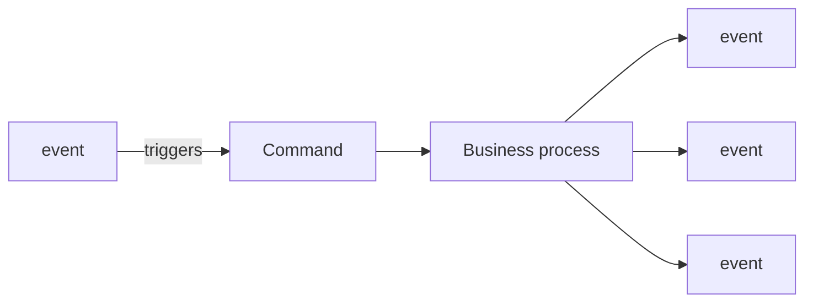
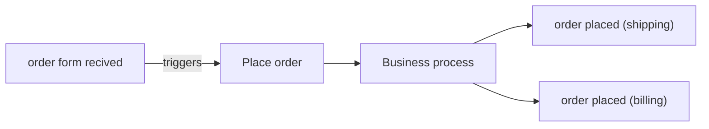

# Uge 9.2 — Domain Driven Design

## Metadata

| Felt | Værdi |
|---|---|
| **Lektion** | Uge 9.2 — Domain Driven Design |
| **Kursus** | Softwaredesign (SW4SWD-01) |
| **Forelæser** | Jørn Martin Hajek (HAJ) — slidesættet er forfattet af Henrik Bitsch Kirk (HK), dateret 5. september 2023 |
| **Kilde** | `Domain Driven Design.pdf` (27 slides) |
| **Sprog/kode** | C# (identifiers på sliderne) |
| **Emner dækket** | Domain knowledge, DDD som disciplin, shared model, domain events, event storming, commands, ubiquitous language, bounded context, context map, partnerships/context mapping-mønstre, tactical patterns, value objects vs. entities, aggregates og aggregate root, aggregate design, services, repositories, factories |

---

## Agenda

1. Domain knowledge — problemet DDD løser
2. Hvad er Domain Driven Development
3. **Strategic design**
   - Shared model
   - Domain events
   - Event storming
   - Documenting commands
   - Ubiquitous language
   - Bounded context og context map
   - Choosing the right contexts
   - Partnerships (context mapping-mønstre)
4. **Tactical patterns**
   - Value objects vs. entities
   - Aggregates og aggregate root
   - Aggregate design considerations
   - Services
   - Repositories og factories
   - Domain events (taktisk)

Referenceværk: Eric Evans, *Domain-Driven Design: Tackling Complexity in the Heart of Software*, forord af Martin Fowler.

> Slide 2

---

## 1. Domain knowledge — problemet

Udgangspunktet er en organisatorisk observation, ikke en teknisk:

> Developers don't know/talk to domain export – architects and salespersons do.
>
> - Requirements are just given in a document
> - Misunderstandings can occur

> Slide 3

Sliden illustrerer den klassiske kæde med et whiteboard-diagram: **Domain Experts** afleverer *knowledge* til **Business Analyst**, som afleverer *requirements* til **Software architects** (der arbejder i *iterationer*), som afleverer *architecture* til **Developers** (der arbejder i *sprints*), som producerer *product/code*.

> Slide 3

Problemet med kæden er, at viden er transitiv gennem mennesker. Hvert led er en oversættelse, og hver oversættelse taber og forvrænger. Udvikleren, der skriver koden, har aldrig talt med den person, der faktisk forstår forretningen — vedkommendes forståelse er filtreret gennem to eller tre mellemled og et dokument.

Konklusionen på sliden:

> It is important to
>
> - Understand the domain
> - Have a shared knowledge about the domain

---

## 2. Hvad er Domain Driven Development

> - The primary focus should be on the core and domain logic
> - Collaboration between technical and domain experts
>   - Build a common understanding of domain problems
> - Domain experts, developers, stakeholders, and (most importantly) code
>   - Must share the same model
>
> **Align domain and software**

> Slide 4

Whiteboard-tegningen på sliden viser fire parter — **Domain Experts**, **Developers**, **Stakeholders** og **Code** — der alle peger ind mod en fælles **SHARED MENTAL MODEL** i midten. Bemærk parentesen "(most importantly)": **koden** er en af de fire parter, der skal dele modellen. Det er en central DDD-påstand. Modellen findes ikke kun i hovedet på folk og i et dokument; den er indlejret i kodens klassenavne, metodenavne og struktur. Kan man ikke genkende domænet ved at læse koden, deler koden ikke modellen.

Kæden fra slide 3 erstattes altså af en stjerne: alle taler med alle om den samme model, i stedet for at sende viden videre i én retning.

### Øvelse: WasteNoFood (10 minutter)

**WasteNoFood** — vi modellerer et domæne for en applikation, der hjælper med at redde mad fra at blive smidt ud (idéen er baseret på Too Good To Go).

Den generelle idé:

- Supermarkets, restaurants, etc. (*Sellers*) can sign up to sell food to households
- Households (*Customers*) can buy food that would otherwise be thrown out

Opgave: skriv funktionelle krav for forretningen set fra forskellige perspektiver — økonomiafdeling, kunder, sælgere, PR (2–3 personer sammen).

> Slide 5

Pointen med at kræve *forskellige perspektiver* er, at det er den samme forretning set fra fire vinkler. Kravene bliver uundgåeligt forskellige og bruger delvist forskellige ord om de samme ting. Det er netop den observation, der senere motiverer **bounded contexts**.

---

# Del A — Strategic design

> Slide 6

Strategic design handler om **de store snit**: hvordan man deler systemet op, hvor grænserne går, hvem der ejer hvad, og hvilket sprog der tales hvor. Det er beslutninger på system- og organisationsniveau. Tactical patterns (del B) handler derimod om, hvordan man bygger *inde i* én af de kasser, strategic design har tegnet.

Denne opdeling er eksamensrelevant: bland ikke de to niveauer sammen. *Bounded context* er strategisk. *Aggregate* er taktisk.

---

## 3. Shared model

**The Goal of DDD:**

> Build a model – mental and in code – that is shared between developers, domain experts, architects, testers …

**Benefits:**

- Faster time to market
- More business value
- Less waste
- Easier maintenance

> Slide 7

Bemærk formuleringen "mental **and** in code". Det er ikke to modeller, der skal holdes i synk — det er én model med to repræsentationer. Når den mentale model ændrer sig, skal koden følge med, og omvendt: opdager man i koden, at en antagelse ikke holder, er det den fælles model, der var forkert.

---

## 4. Domain events (strategisk indgang)

> - Focus on transforming data rather than data relationship
>   - Idea is that static data do not add value
> - 'Every' piece of work is triggered by an event (outside or inside)
>
> - '*Order placed*', '*Flight booked*', '*Patient arrived*', etc.

> Slide 8

Dette er et perspektivskifte i forhold til klassisk datamodellering. Man spørger ikke "hvilke tabeller/klasser har vi, og hvordan hænger de sammen?" — man spørger "hvad *sker der* i denne forretning?". Begrundelsen på sliden er skarp: statiske data tilføjer ikke værdi. Værdien opstår, når noget transformeres, og transformationer udløses af begivenheder.

Bemærk navngivningen allerede her: *Order placed*, *Flight booked*, *Patient arrived* — alle i datid. Det uddybes i afsnit 14.

---

## 5. Event storming

Workshop udviklet af **Alberto Brandolini** for DDD.

> Slide 9 — Source: <https://deravesoftware.com/what-is-event-storming/>

**Workshop-based method to events in process. Steps:**

1. Create **Domain events** (orange)
2. Add **commands** that cause an event (blue with orange)
   1. Add an **actor** that executes the command (yellow)
3. Add corresponding **aggregate** (yellow)
4. Figure out **Business processes** (Purple)

**Participants:** Domain experts, developers, and other stakeholders

> Event storming contains more elements; 'External systems', 'Views', and 'Errors'

> Slide 10

Farvekoderne er ikke kosmetik — de er workshoppens notation:

| Farve | Element |
|---|---|
| Orange | Domain event |
| Blå | Command |
| Gul (lille) | Actor |
| Gul | Aggregate |
| Lilla | Business process |

Rækkefølgen af skridtene er selve metoden: man starter med *hvad der sker* (events), og arbejder derefter baglæns til *hvad der udløste det* (commands), *hvem der gjorde det* (actors) og *hvad der ejer beslutningen* (aggregates). Man modellerer altså ikke strukturen først og hændelserne bagefter — det er omvendt.

At deltagerkredsen eksplicit er domæneeksperter *og* udviklere *og* øvrige stakeholders, er hele pointen fra slide 3: væggen med post-its er det sted, hvor kæden erstattes af en fælles samtale.

### Eksempel

Sliden viser et event storming-resultat opdelt i to teams:

**Order team** indeholder: *order form recived*, kommandoen **Place order** som producerer eventet *order placed*, samt *change requested*, *cancelation requested*, *return requsted*. Uden for teamets ramme: *new customer* og *new customer registered*.

**Shipping team** indeholder: kommandoen **Ship order** som producerer eventet *order shipped*.

> Slide 11

De to rammer på sliden er de første konturer af **bounded contexts** — grænserne opstår ud af, hvor events og commands naturligt klumper sig sammen, og hvilke teams der ejer dem.

---

## 6. Documenting commands

Den generelle form:

> Slide 12

`Business process` har **Input: data needed for workflow** og producerer en **output list of events**.

Det konkrete eksempel:

> Slide 12

Her har `Business process` **Input: data needed for order**, og outputlisten er de events, der opstår ud af en placeret ordre.

Grundmønstret er altså: **event → triggers → command → business process → nye events**. Det er en kæde, ikke en enkelt transaktion. At ét *order placed* deles op i to varianter, en til shipping og en til billing, er værd at bemærke — det samme forretningsmæssige faktum får forskellig betydning og forskelligt indhold i to forskellige contexts.

### Øvelse: event storming (20 minutter)

I samme grupper:

1. Fill in as many events as you can – try putting them in order (**7 minutes**). Brug de funktionelle krav som input.
2. Refine events (Find missing events, remove duplicates, look for order) (**5 min**)
3. What or who (actor) triggers an event with what (command) – or other domain events (**8 min**). Add Commands in blue and actors in pale yellow.

Use **Draw.io** or **paper**.

> Slide 13

---

## 7. Ubiquitous language

> - Building a common language between domain experts and developers
>   - Only contain things represented in the domain
>   - Technical terms (factory, helper, manager, controller, etc.) should not be part of the design
>
> - Defines the shared mental model
>
> - All stakeholders collaborate on creating the ubiquitous language
>
> - Does not necessarily exists **one** ubiquitous language
>   - Dialect for each bounded context

> Slide 14

Det andet punkt er det mest konkrete og det, der oftest overtrædes: **tekniske ord hører ikke hjemme i domænemodellen.** En klasse ved navn `OrderManager` eller `CustomerHelper` fortæller ingenting om forretningen — ingen domæneekspert har nogensinde brugt ordet "manager" om noget i deres arbejde. Sproget skal kun indeholde ting, der faktisk findes i domænet.

Det sidste punkt er lige så vigtigt og modvirker en almindelig misforståelse: der findes **ikke** ét universelt sprog for hele virksomheden. Der findes en **dialekt pr. bounded context**. Ordet *Customer* betyder ikke det samme i salgsafdelingen som i forsendelsesafdelingen, og forsøget på at tvinge dem sammen til én klasse er præcis den fejl, bounded contexts eksisterer for at undgå.

Ubiquitous language og bounded context er derfor to sider af samme sag: **et bounded context er nøjagtigt det område, inden for hvilket ét ubiquitous language gælder entydigt.**

---

## 8. Bounded context

> - Bounded Contexts (DDD for subsystem)
>   - "Mini" domains
>
> - Why **Context**
>   - specialized knowledge
> - Why **Bounded**
>   - in software we need subsystems to be decoupled
>   - Evolve independently
>
> - **Context map**
>   - Interaction between contexts

> Slide 15

Opdelingen af ordet er en god eksamensdefinition: *Context* fordi der er tale om specialiseret viden — et afgrænset område, hvor bestemte ord har bestemte betydninger. *Bounded* fordi grænsen skal være reel: subsystemerne skal være decoupled og kunne udvikle sig uafhængigt af hinanden.

Sliden viser tre contexts som eksempel: **Order taking context**, **Shipping context** og **Billing context**.

Nederst vises et **context map** — interaktionen mellem contexts: en **Customer** sender *Order recived* ind i **Order taking context**, som derefter sender *Order placed* videre til både **Billing context** og **Shipping context**.

> Slide 15

Context mappet er altså ikke et klassediagram. Det viser, hvordan afgrænsede delsystemer taler sammen, og hvad de sender til hinanden — typisk domain events.

---

## 9. Choosing the right contexts

Kriterier for, hvor grænserne skal gå:

- **Domain experts** — Same language and same problems – properly same domain
- **Existing teams and department**
- **"Bounded"**
- **Autonomy** — Two teams/groups working on the same bounded context – is properly slower than working on two
- **Friction-free business workflows** — Interaction with 'many' different bounded contexts

> Slide 16

Første kriterium er det sproglige: taler folk samme sprog om samme problemer, er de sandsynligvis i samme domæne. Andet og fjerde kriterium er organisatoriske — de peger på, at bounded contexts i praksis følger teamgrænser. To teams, der deler ét bounded context, kommer til at trædes over tæerne og bevæge sig langsommere end to teams med hver sit.

Det femte kriterium er en advarsel den anden vej: hvis en almindelig forretningsproces skal krydse "mange" forskellige bounded contexts for at blive gennemført, har man skåret for fint. Grænserne koster koordinering, og en workflow, der konstant skal krydse dem, bliver friktionsfyldt.

---

## 10. Partnerships — relationer mellem contexts

Mønstrene for, hvordan to contexts (og de teams, der ejer dem) forholder sig til hinanden:

| Mønster | Beskrivelse |
|---|---|
| **Shared kernel** | Share a small common model — to teams deler en lille fælles del af modellen (skrevet "Shared kernal" på sliden) |
| **Customer-supplier** | Supplier provides what customer needs |
| **Conformist** | Customer-supplier – but customer cannot 'afford' to translate |
| **Anticorruption layer** | Customer create a translation layer between suppliers- and own-model (skrevet "Anticorrumption layer" på sliden) |
| **Other** | Partnership, Open host service, published language |

> Slide 17

Diagrammerne på sliden markerer relationerne med **S** (supplier) og **C** (customer) på pilen mellem to teams. Ved shared kernel overlapper de to ellipser hinanden fysisk (det gule felt er den delte kerne). Ved anticorruption layer sidder et gult **ACL**-felt på grænsen ind til customer-teamet.

De tre midterste mønstre er en trappe af faldende autonomi og stigende sårbarhed:

- **Customer-supplier**: supplier tager hensyn til, hvad customer behøver. Der forhandles.
- **Conformist**: customer opgiver at oversætte og adopterer bare supplierens model, som den er. Billigst, men customerens egen model bliver forurenet af en fremmed models begreber.
- **Anticorruption layer**: customer bygger et bevidst oversættelseslag mellem supplierens model og sin egen. Dyrere at bygge og vedligeholde, men customerens model forbliver ren. Navnet er bogstaveligt: laget beskytter mod, at en fremmed model *korrumperer* ens egen.

Valget mellem conformist og ACL er altså en pris/renheds-afvejning, ikke et spørgsmål om, hvad der er "rigtigt".

---

# Del B — Tactical patterns

> Key elements from OOP with an DDD perspective

> Slide 18

Sliden viser Evans' klassiske navigationsdiagram over de taktiske byggeklodser. De relationer, der er entydigt læsbare på billedet:

| Fra | Relation | Til |
|---|---|---|
| Model-Driven Design | express model with | Services |
| Model-Driven Design | express model with | Entities |
| Model-Driven Design | express model with | Value Objects |
| Model-Driven Design | isolate domain with | Layered Architecture |
| Model-Driven Design | mutually exclusive choices (X) | Smart UI |
| Entities | encapsulate with | Aggregates |
| Entities | act as root of | Aggregates |
| Entities | access with | Repositories |
| Value Objects | encapsulate with | Aggregates |
| Value Objects | encapsulate with | Factories |
| Aggregates | encapsulate with | Factories |
| Aggregates | access with | Repositories |

> Slide 18

To ting er værd at hæfte sig ved i diagrammet. **Entities act as root of Aggregates** — det er aggregate root-begrebet tegnet ind i landkortet: kun en entity kan være rod, aldrig et value object. Og **Model-Driven Design X Smart UI** er markeret som *mutually exclusive choices*: enten bygger man en rigtig domænemodel, eller også lægger man logikken i brugerfladen. Man kan ikke gøre begge dele.

---

## 11. Value objects vs. entities

Dette er den klassiske sondring — og klassisk eksamensstof.

| | **Value object** | **Entity** |
|---|---|---|
| Modellerer | Models a value | Model an individual thing (skrevet "think" på sliden) |
| Identitet | **No unique ID** | **Has unique ID** |
| Mutabilitet | **Immutable** | **Mutable** |
| Sammenligning | Comparison is done by attributes/value | (implicit: ved identitet/ID) |
| Eksempler | `Address`, `PhoneNumber`, `Money` | `OrderItem`, `Customer`, `Invoice` |

> Slide 19

### Hvorfor sondringen findes

Det afgørende spørgsmål er: **betyder det noget, *hvilken* af to ens ting du har fat i?**

To 100-kroneesedler med samme værdi er udskiftelige. Har du 100 kr., er det ligegyldigt hvilke 100 kr. `Money(100, "DKK")` er derfor et value object: to instanser med samme attributter *er* den samme værdi. Der er ingen grund til at give dem et ID, ingen grund til at kunne skelne dem, og derfor heller ingen grund til at kunne ændre dem.

To kunder med samme navn og adresse er derimod **ikke** den samme kunde. Selv hvis alle attributter er identiske, er der tale om to forskellige mennesker, og systemet skal kunne holde dem adskilt. `Customer` er derfor en entity og har brug for et ID.

Og en kunde, der flytter, er stadig den samme kunde — alle attributter kan skiftes ud, uden at identiteten ændrer sig. Det er derfor entities er **mutable**: identiteten bæres af ID'et, ikke af attributterne.

Modsat: hvis en `Address` ændrer sig, er det ikke "den samme adresse, der har ændret sig" — det er en anden adresse. Derfor er value objects **immutable**: man ændrer dem ikke, man erstatter dem med en ny instans.

### Konsekvenserne af sondringen

Alt følger af, hvor identiteten sidder:

- **Lighed**: entity sammenlignes på ID (to `Customer` med samme ID er samme kunde, uanset attributter). Value object sammenlignes på attributter (to `Money` med samme beløb og valuta er lige, punktum).
- **Mutabilitet**: entity kan ændres over tid og bevare sin identitet. Value object erstattes.
- **Livscyklus**: en entity har en historie — den oprettes, ændres, findes igen senere. Et value object har ingen historie; det eksisterer bare som en værdi.
- **Persistering**: entities hentes via repositories (se afsnit 15). Value objects gemmes typisk som del af den entity eller det aggregate, de tilhører.

Bemærk at sondringen er **kontekstafhængig**. `Address` er et value object i de fleste systemer, men i et system til postomdeling, hvor hver adresse har sin egen historik og sit eget ID, er den en entity. Der findes ingen liste over, hvad der "er" et value object — spørgsmålet er altid, om identiteten betyder noget i *dette* domæne.

Bemærk også, at `PhoneNumber` fra Extract Class-eksemplet i uge 9.1 dukker op igen her som value object-eksempel. Den refactoring var i realiteten at føde et value object.

---

## 12. Aggregates

> - Composed of one of more entities and value objects
> - Forms a **transactional consistent boundary**
> - One entity is called **aggregate root**
>   - Owns all other elements in aggregate
>   - Access to aggregate *must* go through the aggregate root
> - Examples:
>   - `Customer`
>   - `Invoice`

> Slide 20

Et aggregate er en klynge af entities og value objects, der behandles som én enhed. De tre egenskaber hænger sammen:

**Transactional consistent boundary** betyder, at reglerne (invarianterne) inde i aggregatet altid holder efter en gennemført transaktion. Vil man sikre, at en fakturas linjer altid summer til fakturaens total, skal linjer og total ligge i samme aggregate — ellers kan de nå at komme ud af trit.

**Aggregate root** er den ene entity, der ejer de øvrige. At adgang *skal* gå gennem roden er ikke en anbefaling, men den mekanisme, der gør konsistensgrænsen mulig: kan omverdenen ændre en fakturalinje direkte uden om `Invoice`, kan `Invoice` ikke garantere, at totalen stemmer. Roden er den eneste, der har overblikket til at håndhæve invarianten.

Deraf følger også, at kun **entities** kan være aggregate roots (jf. "Entities act as root of Aggregates" i diagrammet på slide 18) — roden skal have en identitet, som omverdenen kan referere til.

---

## 13. Aggregate design considerations

1. **Protect business invariants inside aggregate**
2. **Design small aggregates**
3. **Reference other aggregates only by identity**
4. **Update referenced aggregates using eventual consistency**

> Slide 21

De fire regler er en sammenhængende argumentkæde:

**(1)** Aggregatets eksistensberettigelse er at beskytte forretningsinvarianter. Er der ingen invariant at beskytte, er der ingen grund til at klumpe tingene sammen.

**(2)** Store aggregates er dyre: hele aggregatet skal typisk læses og låses ved hver transaktion, hvilket giver låsekonflikter og dårlig performance. Derfor: kun det, der *skal* være konsistent i samme øjeblik, hører til i samme aggregate.

**(3)** Følger direkte af (2): refererer aggregat A til aggregat B som et objekt, trækkes B med ind, og aggregatet vokser ukontrolleret. Refererer man i stedet kun til B's **ID**, holdes grænsen skarp. `Order` indeholder altså et `CustomerId`, ikke et helt `Customer`-objekt.

**(4)** Følger af (3): når to aggregates er adskilte, kan de ikke opdateres i samme transaktion. Ændringer der spænder over flere aggregates håndteres i stedet med **eventual consistency** — typisk ved at det ene aggregate udsender et domain event, som det andet reagerer på lidt senere. Det er her, domain events (afsnit 14) bliver den taktiske mekanisme, der binder de strategiske grænser sammen.

---

## 14. Services

> - Contain domain operations that do not belong to an entity or value object
> - Is **stateless**
> - Examples
>   - `PriceCalculation(…)`
>   - `CurrencyCoversion(…)`

> Slide 22

En service er restkategorien, og det er vigtigt, at den *forbliver* en restkategori. Hovedreglen i DDD er, at adfærd hører hjemme på den entity eller det value object, den handler om. Nogle operationer passer bare ikke naturligt nogen af stederne — en valutaomregning tilhører hverken beløbet eller valutaen — og de bliver til services.

Kravet om **stateless** er det, der adskiller en domain service fra en entity: en service husker ikke noget mellem kald. Al tilstand ligger i de objekter, den får ind og giver ud.

Advarslen fra ubiquitous language (afsnit 7) gælder skarpt her: opdager man, at ens domænemodel består af tynde dataklasser plus en stribe `…Service`-klasser med al logikken, har man ikke en domænemodel — man har en procedural applikation med klasser omkring. Det er det klassiske anti-pattern, DDD kalder anemic domain model, og det er også code smell'en **Data Class** fra uge 2.

---

## 15. Repositories og factories

**REPOSITORIES:**

> - Retrieve domain objects (aggregates) from data storage or (DAL)
> - You will see (have seen) this in SW4BED (Backend development)

**FACTORIES:**

> - Create domain objects
> - Encapsulates the creation of objects

> Slide 23

De to har hver sin rolle i objektets livscyklus, og forskellen er værd at holde skarp:

- En **factory** laver et **nyt** objekt, der ikke fandtes før.
- Et **repository** finder et **eksisterende** objekt frem fra lageret.

Begge skjuler kompleksitet — factory'en skjuler, hvordan et gyldigt objekt konstrueres; repository'et skjuler, at der overhovedet findes en database.

Bemærk formuleringen i første punkt: repositories henter **aggregates**. Det er ikke tilfældigt. Man har ét repository pr. aggregate root, ikke ét pr. klasse — netop fordi adgang til aggregatet skal gå gennem roden (afsnit 12). Et `OrderLineRepository` ved siden af et `OrderRepository` ville omgå konsistensgrænsen.

---

## 16. Domain events (taktisk)

> - Represent a business-significant occurrence in a bounded context
> - **Immutable facts**
> - Naming: Passed tense – using the ubiquitous language
> - Can be used for inter-service communication
> - Example
>   - `OrderRevieved`
>   - `NewCustomerRegisterd`

> Slide 24

(Identifierne er gengivet ordret fra sliden inklusive stavefejl.)

**Immutable facts** er den vigtigste egenskab. Et event beskriver noget, der *er sket*. Fortiden kan ikke ændres — en ordre, der er blevet afgivet, forbliver afgivet, også selvom den senere annulleres (hvilket i så fald er et nyt event). Derfor er events uforanderlige, og derfor kan de trygt sendes videre til andre systemer.

**Datid i navngivningen** er direkte konsekvens heraf: `OrderPlaced`, ikke `PlaceOrder`. Sidstnævnte ville være en **command** — en anmodning om at få noget til at ske, som kan afvises. Et event kan ikke afvises; det er allerede sket. Sondringen command/event fra event storming (afsnit 5) går altså igen i koden.

At navngivningen skal bruge **ubiquitous language** binder det taktiske tilbage til det strategiske: eventnavne er domæneord, ikke tekniske ord.

**Inter-service communication** er den mekanisme, der løser problemet fra afsnit 13, punkt 4: to aggregates (eller to bounded contexts) kan ikke opdateres i samme transaktion, men det ene kan udsende et event, som det andet reagerer på. Det er sådan eventual consistency implementeres i praksis — og det er præcis pilene på context mappet på slide 15.

### Øvelse: bounded context

- Find Aggregates and Bounded Contexts (5-10 min)
- Using the elements from the Tactical Patterns to try and describe a design for 1-2 of the aggregates you found.

Sliden viser et eksempel på et event storming-resultat med aggregates tilføjet og bounded context lagt ned over: konturerne **Order captured** (med aggregatet `Order`, aktøren *User*, kommandoen *Order information entered*, events *Input checks performed*, *Check inventory*, samt eksterne systemer *Webpage*, *Inventory*, *Originations-system*), **Shopping cart** (aggregaterne `Order` og `Shopping cart`, kommandoen *Add to chart*, events *Order added to chart*, *Shopping cart updated*), **Offers** (aggregatet `Offer`, kommandoerne *Accept* og *Decline*, events *Promotional offers identified/provided*, *Offers accepted*, *Offers declined*, eksternt system *Offer System*) og **Checkout process** (aggregatet `Address`, kommandoen *Checkout*, events *Checkout selected*, *Mailing address provided*, *Multiple offers bundled*, *Billing address provided*).

> Slide 25

Billedteksten på figuren: *"Example output with aggregates added in and bounded context applied"*. Bemærk arbejdsgangen: bounded contexts er ikke tegnet på forhånd — de er *aflæst* af, hvordan events og aggregates klumpede sig sammen under workshoppen. Strategien opstår af det konkrete arbejde med domænet, ikke omvendt.

---

## Referencer

- <https://xkcd.com/2166/> (tegningen "The Modern Tech Stack" på titelsliden)

> Slide 27

---

## Opsummering

- **Problemet DDD løser er organisatorisk, ikke teknisk.** Viden går tabt i kæden domæneekspert → business analyst → arkitekt → udvikler. DDD erstatter kæden med én fælles model, som domæneeksperter, udviklere, stakeholders *og koden* deler.
- **Hold strategic og tactical skarpt adskilt.** Strategic design tegner grænserne — ubiquitous language, bounded context, context map, partnerships. Tactical patterns bygger indeni — entity, value object, aggregate, repository, factory, service, domain event.
- **Entity vs. value object afgøres af identitet.** Entity har unikt ID, er mutable og sammenlignes på ID; identiteten overlever, at alle attributter ændres (`Customer`, `Invoice`, `OrderItem`). Value object har intet ID, er immutable og sammenlignes på attributter; to instanser med samme værdi *er* den samme ting (`Address`, `PhoneNumber`, `Money`). Sondringen er kontekstafhængig — spørgsmålet er altid, om det betyder noget, *hvilken* af to ens ting man har fat i.
- **Aggregatet er en transaktionel konsistensgrænse** med én entity som aggregate root. Al adgang skal gå gennem roden — det er den eneste måde, invarianterne kan håndhæves. Design små aggregates, referér andre aggregates kun ved ID, og opdatér på tværs med eventual consistency.
- **Ubiquitous language er ikke ét sprog for hele virksomheden**, men én dialekt pr. bounded context. Tekniske ord (factory, helper, manager, controller) hører ikke hjemme i domænemodellen.
- **Domain events er immutable facts navngivet i datid** med domænets eget sprog. De er både workshoppens udgangspunkt (event storming starter med events, ikke med struktur) og den mekanisme, der binder adskilte aggregates og bounded contexts sammen på tværs af transaktionsgrænser.
- **Event storming er metoden**, der producerer alt ovenstående: events (orange) → commands (blå) → actors (gul) → aggregates (gul) → business processes (lilla), med domæneeksperter og udviklere ved samme væg. Bounded contexts aflæses af, hvor klyngerne falder.
